# **第一部分：基础概念与模型架构**

## **第 1 章：核心概念与架构选择 (1-15)**
### 1. 什么是预测/判别式AI与生成式AI的区别？

#### 1.1 从目标函数的角度看，两者的根本区别是什么？
**判别式AI**的目标是学习条件概率分布 $P(Y|X)$，即给定输入 $X$ 时输出 $Y$ 的概率。它关注的是"边界"——如何最好地区分不同类别。

**生成式AI**的目标是学习联合概率分布 $P(X,Y)$，然后通过贝叶斯公式推导出 $P(Y|X) = \frac{P(X,Y)}{P(X)}$。它关注的是"生成"——如何模拟数据的真实分布。

#### 1.2 在数学建模上，两者有何不同？
**判别式模型**直接对决策边界建模：
- 逻辑回归：$P(Y=1|X) = \sigma(w^T X + b)$
- SVM：最大化间隔的决策边界
- 神经网络分类器：直接输出类别概率

**生成式模型**对数据生成过程建模：
- 朴素贝叶斯：$P(X,Y) = P(Y) \prod_{i} P(X_i|Y)$
- 高斯混合模型：$P(X) = \sum_{k} \pi_k \mathcal{N}(X|\mu_k, \Sigma_k)$
- 变分自编码器：学习潜在空间分布 $P(z)$ 和解码分布 $P(X|z)$

#### 1.3 从应用场景看，各自擅长什么任务？
**判别式AI的典型应用**：
1. 分类任务：图像分类、垃圾邮件检测
2. 回归任务：房价预测、股票价格预测
3. 序列标注：命名实体识别、词性标注
4. 异常检测：欺诈检测、故障诊断

**生成式AI的典型应用**：
1. 内容生成：文本生成、图像生成、音乐创作
2. 数据增强：生成训练数据
3. 风格迁移：图像风格转换
4. 补全任务：图像修复、文本补全
5. 对话系统：聊天机器人

#### 1.4 训练数据需求有何差异？
**判别式模型**：
- 需要标注数据 $(X,Y)$ 对
- 关注区分不同类别的特征
- 通常需要较少的训练数据就能达到较好效果

**生成式模型**：
- 可以同时使用标注数据和未标注数据
- 需要学习数据的完整分布
- 通常需要大量数据来捕捉数据分布的细节

#### 1.5 计算复杂度和资源需求对比如何？
**判别式模型**：
- 训练相对高效，计算复杂度较低
- 推理速度快，适合实时应用
- 内存占用相对较小

**生成式模型**：
- 训练复杂，需要大量计算资源
- 推理可能较慢，特别是自回归生成
- 模型参数量通常更大

**对比示意图：**
```mermaid
graph TD
    A[AI模型分类] --> B[判别式AI]
    A --> C[生成式AI]
    
    B --> B1[目标: P(Y|X)]
    B --> B2[关注: 决策边界]
    B --> B3[应用: 分类/回归]
    B --> B4[代表模型: SVM, 逻辑回归]
    
    C --> C1[目标: P(X,Y)]
    C --> C2[关注: 数据分布]
    C --> C3[应用: 生成/创造]
    C --> C4[代表模型: GAN, VAE, 扩散模型]
```

#### 1.6 在深度学习时代，这种区别是否依然清晰？
**传统区别**：在经典机器学习中，判别式和生成式的界限相对清晰。

**现代融合**：在深度学习中，这种界限变得模糊：
1. **Transformer架构**：既能用于判别任务（BERT），也能用于生成任务（GPT）
2. **多任务学习**：同一个模型可以同时完成判别和生成任务
3. **条件生成模型**：如条件GAN、条件扩散模型，结合了判别和生成的特点

#### 1.7 从概率图模型的角度如何理解？
**判别式模型**对应有向图：
```
X → Y
```
只建模从X到Y的条件依赖。

**生成式模型**对应有向图：
```
Y → X₁ → X₂ → ... → Xₙ
```
建模完整的生成过程，X的各个维度在给定Y的条件下独立。

#### 1.8 在实际工程中如何选择？
**选择判别式模型当**：
1. 任务明确是分类或回归
2. 计算资源有限
3. 需要快速推理
4. 标注数据充足

**选择生成式模型当**：
1. 需要生成新内容
2. 数据分布复杂需要建模
3. 有大量未标注数据可用
4. 需要数据增强或补全

#### 1.9 两者在评估指标上有何不同？
**判别式模型评估**：
- 准确率、精确率、召回率、F1分数
- AUC-ROC曲线
- 均方误差（MSE）、平均绝对误差（MAE）

**生成式模型评估**：
- 困惑度（Perplexity）
- BLEU、ROUGE（文本生成）
- FID分数（图像生成）
- 多样性、保真度指标

#### 1.10 未来发展趋势是什么？
**融合趋势**：
1. **生成式判别模型**：如扩散模型用于分类
2. **判别式指导生成**：如使用分类器指导生成过程
3. **统一架构**：如Transformer的统一序列建模能力

**标准答案：**

**【基本原理】**
预测/判别式AI与生成式AI的根本区别在于它们对概率分布建模的不同视角。判别式模型直接学习输入到输出的映射关系，而生成式模型学习数据的完整联合分布。

**【回答模板】**
* **判别式AI**：关注条件概率 $P(Y|X)$，直接学习如何根据输入 $X$ 预测输出 $Y$。它像一个"分类专家"，专注于找到最佳的决策边界。
* **生成式AI**：关注联合概率 $P(X,Y)$，学习数据是如何生成的。它像一个"数据创造者"，能够模拟真实数据的分布并生成新的样本。

**【深入理解】**
1. **哲学差异**：
   - 判别式：回答"这是什么？"（What is this?）
   - 生成式：回答"这可能是怎么产生的？"（How could this be generated?）

2. **数学本质**：
   - 判别式：最小化预测误差 $\min \mathbb{E}[L(Y, f(X))]$
   - 生成式：最大化似然 $\max \mathbb{E}[\log P(X,Y)]$

3. **能力范围**：
   - 判别式：擅长区分、分类、预测
   - 生成式：擅长创造、模拟、理解数据本质

4. **数据利用**：
   - 判别式：主要依赖标注数据
   - 生成式：能利用未标注数据，学习更丰富的表示

**现代视角下的融合：**
在深度学习时代，这种区分逐渐模糊。以Transformer为例：
- **BERT**：本质是判别式，通过掩码语言建模学习表示
- **GPT**：本质是生成式，通过自回归生成学习语言模型
- **扩散模型**：既是生成式（生成图像），也可用于判别任务（分类）

**实践建议：**
1. **明确任务目标**：如果是分类、检测、回归，优先考虑判别式方法
2. **考虑数据情况**：如果标注数据少但未标注数据多，生成式方法可能更有优势
3. **评估资源约束**：生成式模型通常需要更多计算资源和时间
4. **结合使用**：现代实践中常结合两者，如使用生成式模型进行数据增强，然后用判别式模型进行分类

**总结：**
判别式AI和生成式AI代表了AI研究的两个基本范式。判别式方法更直接、高效，适合明确的预测任务；生成式方法更全面、强大，适合创造性任务和对数据本质的理解。随着技术的发展，两者的界限正在模糊，未来可能会出现更多融合两种优势的统一架构。

---

### 2. 什么是大语言模型？LLM是如何训练的？

#### 2.1 什么是大语言模型（LLM）？
**大语言模型**是基于Transformer架构的深度学习模型，通过在海量文本数据上训练，学习语言的统计规律和语义表示。其核心特点是：
- **规模巨大**：参数量通常在数十亿到数万亿之间
- **能力强**：能够理解和生成自然语言
- **通用性**：通过预训练获得广泛的语言理解能力

#### 2.2 LLM的基本架构是什么？
LLM通常基于**Transformer解码器架构**，主要组件包括：
1. **词嵌入层**：将输入token转换为向量表示
2. **多层Transformer块**：每层包含：
   - 多头自注意力机制
   - 前馈神经网络
   - 层归一化
   - 残差连接
3. **输出层**：将隐藏状态转换为词汇表上的概率分布

**LLM架构示意图：**
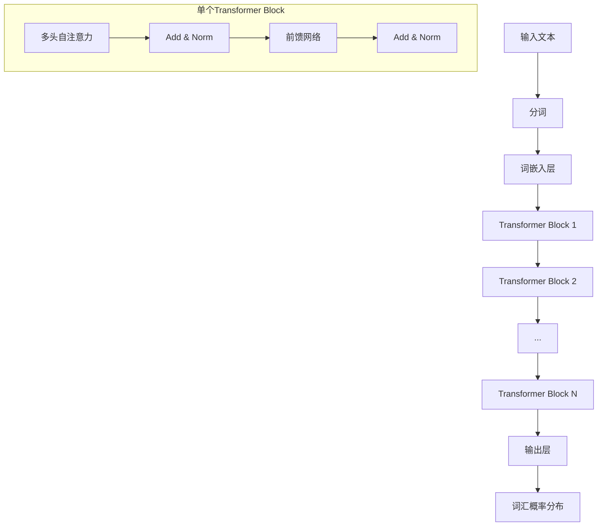

#### 2.3 LLM训练的第一阶段：预训练（Pre-training）
**目标**：在大规模无标注文本数据上学习通用的语言表示

**训练方法**：
1. **自监督学习**：从文本自身构造监督信号
2. **语言建模目标**：预测下一个token
3. **损失函数**：交叉熵损失

**数学表示**：
对于文本序列 $x_1, x_2, ..., x_T$，最大化似然：
$$ \mathcal{L}_{\text{pre-train}} = -\sum_{t=1}^{T} \log P(x_t | x_{<t}; \theta) $$

**训练数据**：
- 网页数据（Common Crawl）
- 书籍、学术论文
- 代码、对话记录
- 多语言文本

#### 2.4 预训练中的关键技术有哪些？
1. **因果注意力掩码**：确保每个位置只能看到前面的token
2. **位置编码**：为模型提供序列位置信息（如RoPE）
3. **缩放点积注意力**：$\text{Attention}(Q,K,V) = \text{softmax}\left(\frac{QK^T}{\sqrt{d_k}}\right)V$
4. **梯度累积**：处理大批次训练
5. **混合精度训练**：使用float16加速训练

#### 2.5 LLM训练的第二阶段：有监督微调（Supervised Fine-tuning, SFT）
**目标**：使模型适应特定任务或遵循指令

**训练方法**：
1. **指令-响应对数据**：人工编写的示范数据
2. **序列到序列训练**：给定指令，生成正确响应
3. **损失函数**：仅计算响应部分的交叉熵损失

**数学表示**：
对于指令 $I$ 和响应 $R$：
$$ \mathcal{L}_{\text{SFT}} = -\sum_{t=1}^{|R|} \log P(r_t | I, r_{<t}; \theta) $$

#### 2.6 LLM训练的第三阶段：基于人类反馈的强化学习（RLHF）
**目标**：使模型的输出更符合人类偏好

**训练流程**：
1. **奖励模型训练**：
   - 收集人类对模型输出的偏好数据
   - 训练一个奖励模型 $R_\phi(x,y)$ 来预测人类偏好
   
2. **策略优化**：
   - 使用PPO算法优化语言模型策略 $\pi_\theta$
   - 最大化奖励同时控制与原始模型的偏离

**优化目标**：
$$ \max_{\theta} \mathbb{E}_{x \sim \mathcal{D}, y \sim \pi_\theta(\cdot|x)} [R_\phi(x,y)] - \beta \text{KL}(\pi_\theta || \pi_{\text{ref}}) $$

#### 2.7 训练过程中的关键挑战是什么？
1. **计算资源**：需要数千个GPU的集群训练数月
2. **数据质量**：需要高质量、多样化的训练数据
3. **稳定性**：大规模训练容易遇到数值不稳定
4. **评估**：如何有效评估模型能力
5. **对齐**：确保模型输出安全、有益、诚实

#### 2.8 训练基础设施要求是什么？
**硬件**：
- GPU集群（A100/H100）
- 高速网络互联（NVLink, InfiniBand）
- 大规模存储系统

**软件**：
- 分布式训练框架（DeepSpeed, Megatron-LM）
- 混合精度训练
- 梯度检查点
- 模型并行、数据并行

#### 2.9 训练流程的完整示意图
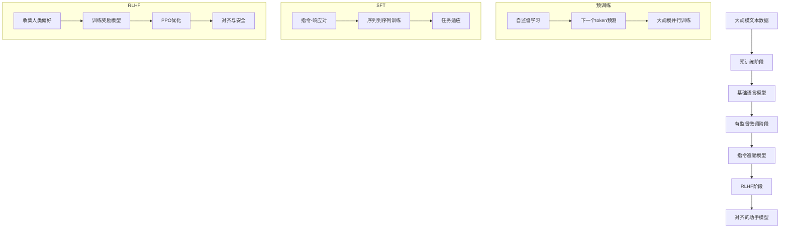

#### 2.10 现代LLM训练的最佳实践
1. **数据质量优先**：精心清洗和筛选训练数据
2. **渐进式训练**：从小规模开始，逐步扩大
3. **多阶段训练**：预训练 → SFT → RLHF
4. **持续评估**：在各个阶段进行全面的评估
5. **安全对齐**：从一开始就考虑安全性

**标准答案：**

**【基本原理】**
大语言模型是基于Transformer架构的深度学习模型，通过在海量文本数据上进行多阶段训练，获得理解和生成自然语言的能力。其训练过程是一个系统工程，涉及数据、算法、计算资源的复杂协调。

**【回答模板】**
* **大语言模型**：是基于Transformer架构的大规模神经网络，通过自监督学习从海量文本中学习语言规律，能够理解和生成自然语言。
* **LLM训练**：通常分为三个阶段：1) 预训练学习通用语言表示；2) 有监督微调适应特定任务；3) 基于人类反馈的强化学习使输出符合人类偏好。

**【深入理解】**
1. **预训练的本质**：
   预训练是让模型"读书"的过程。通过下一个token预测任务，模型学习到：
   - 词汇的语义和语法关系
   - 事实知识的世界模型
   - 逻辑推理的基本模式
   - 不同领域的专业知识

2. **微调的必要性**：
   预训练模型虽然知识丰富，但不会主动遵循指令。微调教会模型：
   - 如何理解并执行用户指令
   - 如何以对话形式交互
   - 如何完成特定领域任务

3. **RLHF的重要性**：
   单纯模仿数据可能产生有害输出。RLHF确保：
   - 输出有帮助、无害、诚实
   - 符合人类价值观和偏好
   - 避免偏见和歧视

**训练技术细节：**
1. **数据工程**：
   - 数据来源多样化（网页、书籍、代码等）
   - 数据清洗和去重
   - 质量过滤和毒性检测
   - 多语言平衡

2. **优化策略**：
   - 自适应优化器（AdamW）
   - 学习率调度（余弦衰减）
   - 梯度裁剪和累积
   - 权重衰减和dropout

3. **分布式训练**：
   - 数据并行：分割批次到不同GPU
   - 模型并行：分割模型层到不同GPU
   - 流水线并行：分割模型到多个阶段
   - 张量并行：分割注意力计算

**评估与监控：**
1. **训练监控**：
   - 损失曲线收敛情况
   - 梯度范数稳定性
   - 激活值统计分布
   - 内存使用效率

2. **能力评估**：
   - 语言理解（GLUE, SuperGLUE）
   - 常识推理（HellaSwag, PIQA）
   - 数学能力（GSM8K, MATH）
   - 代码生成（HumanEval）

**未来趋势：**
1. **更高效的训练**：减少计算成本和碳排放
2. **多模态扩展**：结合视觉、音频等多模态信息
3. **专业化发展**：针对特定领域优化
4. **开源与民主化**：降低训练门槛，促进创新

**总结：**
LLM的训练是一个复杂但系统化的过程，从海量数据中提取知识，通过多阶段优化使其成为有用的AI助手。这一过程不仅需要先进的算法，还需要大规模的计算基础设施和精细的工程实践。

---

### 3. 语言模型中的"标记"是什么？

#### 3.1 什么是标记（Token）的基本定义？
**标记**是语言模型处理文本的基本单位，是将连续文本分割成离散片段的结果。它类似于人类语言中的"词"或"字"，但更灵活，可以是一个完整的词、词的一部分、单个字符甚至子词单元。

#### 3.2 为什么需要标记化（Tokenization）？
1. **计算效率**：直接处理字符计算成本太高
2. **语义表示**：词级别的表示能更好地捕捉语义
3. **词汇表管理**：固定大小的词汇表便于模型处理
4. **处理未知词**：通过子词分解处理未见过的词

#### 3.3 常见的标记化方法有哪些？
1. **基于词的标记化**：
   - 优点：语义明确
   - 缺点：词汇表庞大，无法处理未知词
   - 示例："I love machine learning" → ["I", "love", "machine", "learning"]

2. **基于字符的标记化**：
   - 优点：词汇表极小（26个字母+标点）
   - 缺点：序列过长，语义信息稀疏
   - 示例："cat" → ["c", "a", "t"]

3. **子词标记化（现代主流）**：
   - 平衡了词和字符的优点
   - 常用算法：Byte Pair Encoding (BPE), WordPiece, Unigram

#### 3.4 BPE（Byte Pair Encoding）算法如何工作？
**BPE算法步骤**：
1. 初始化词汇表为所有单个字符
2. 统计所有相邻符号对的频率
3. 合并频率最高的符号对，加入词汇表
4. 重复步骤2-3直到达到目标词汇表大小

**示例**：
初始：l o w e r
合并"lo" → lo w e r
合并"low" → low e r
合并"er" → low er

#### 3.5 标记化对模型性能有什么影响？
1. **词汇表大小**：
   - 太小：序列过长，计算效率低
   - 太大：参数过多，容易过拟合
   - 典型范围：30k-100k

2. **标记长度**：
   - 短标记：信息密度高，但序列长
   - 长标记：序列短，但可能失去语义细节

3. **多语言支持**：
   - 需要处理不同语言的字符集
   - 平衡不同语言的表示比例

#### 3.6 标记ID和嵌入向量是什么关系？
1. **标记ID**：每个标记在词汇表中的整数索引
2. **嵌入查找**：通过嵌入矩阵将ID转换为向量
3. **数学表示**：$E \in \mathbb{R}^{V \times d}$，其中$V$是词汇表大小，$d$是嵌入维度

**处理流程**：
```
文本 → 标记化 → 标记序列 → 标记ID → 嵌入向量 → 模型输入
```

#### 3.7 特殊标记有哪些类型？
1. **开始标记**：`<s>`或`[CLS]`，表示序列开始
2. **结束标记**：`</s>`或`[SEP]`，表示序列结束
3. **填充标记**：`[PAD]`，用于统一序列长度
4. **未知标记**：`[UNK]`，表示词汇表中不存在的词
5. **掩码标记**：`[MASK]`，用于掩码语言建模

#### 3.8 标记化的挑战和解决方案
**挑战1：多义词处理**
- 问题：同一个词在不同语境中有不同含义
- 解决方案：上下文感知的表示（如BERT）

**挑战2：语言差异**
- 问题：不同语言的结构差异大
- 解决方案：多语言词汇表，SentencePiece算法

**挑战3：领域适应**
- 问题：专业术语和领域特定词汇
- 解决方案：领域特定的词汇表扩展

#### 3.9 标记化流程示意图
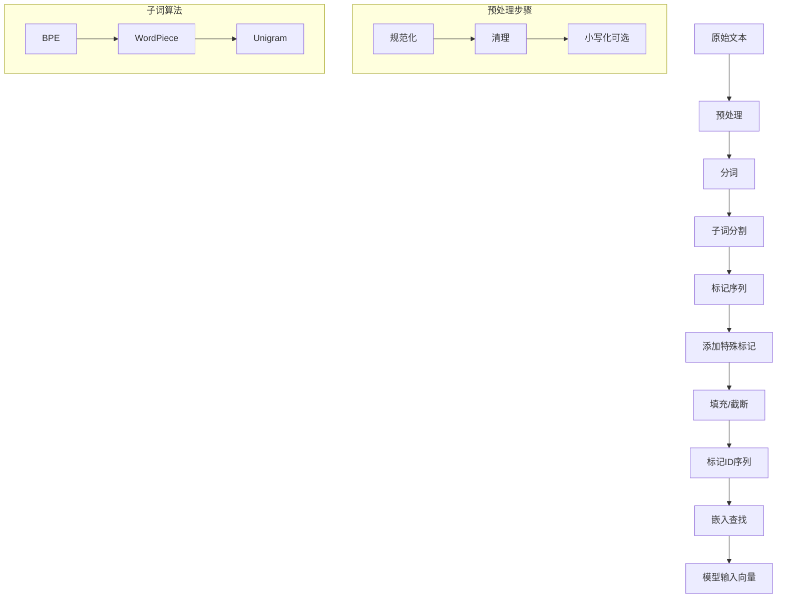

**标准答案：**

**【基本原理】**
标记是语言模型处理文本的基本离散单元，通过标记化过程将连续文本转换为模型可处理的数字序列。标记化是连接自然语言和神经网络表示的关键桥梁。

**【回答模板】**
* **标记**：是文本处理的基本单位，通过标记化算法将文本分割成离散片段，每个片段对应词汇表中的一个条目。
* **作用**：1) 将文本转换为数字表示；2) 管理词汇表大小；3) 处理未知词汇；4) 支持多语言处理。

**【深入理解】**
1. **标记化的本质**：
   标记化是在**信息压缩**和**语义保留**之间的权衡：
   - 字符级：信息无损但效率低
   - 词级：语义明确但灵活性差
   - 子词级：平衡两者，是现代LLM的主流选择

2. **技术细节**：
   - **BPE算法**：从字符开始，逐步合并高频符号对
   - **WordPiece**：类似BPE，但基于概率而非频率
   - **SentencePiece**：支持无空格语言（如中文、日文）
   - **Unigram**：基于概率模型选择最优分割

3. **实际考虑**：
   - **词汇表大小**：通常32k-100k，平衡效率和表示能力
   - **序列长度**：影响计算复杂度和内存使用
   - **多语言支持**：需要处理不同语言的字符编码和分词规则

**标记化对模型的影响：**
1. **效率影响**：
   - 更长的标记序列 → 更高的计算成本
   - 更大的词汇表 → 更多的嵌入参数

2. **质量影响**：
   - 不合理的分割可能破坏语义
   - 无法处理的标记会退化为`[UNK]`，损失信息

3. **语言特性**：
   - 英语等空格分隔语言相对简单
   - 中文等无空格语言需要特殊处理
   - 黏着语（如土耳其语）需要处理丰富的词形变化

**现代实践：**
1. **标准化工具**：
   - HuggingFace Tokenizers库
   - Tiktoken（OpenAI）
   - SentencePiece（Google）

2. **最佳实践**：
   - 使用与预训练模型相同的标记化器
   - 保持标记化一致性
   - 处理边缘情况和特殊字符

**总结：**
标记化是LLM流水线的第一步，也是至关重要的一步。好的标记化策略能显著提升模型性能，而不当的标记化可能导致信息损失和性能下降。理解标记化的原理和实践对于有效使用和开发语言模型至关重要。

---

### 4. Transformer架构是什么？它在LLM中是如何使用的？

#### 4.1 Transformer架构的基本组成是什么？
**Transformer**是一种基于自注意力机制的神经网络架构，由Vaswani等人在2017年提出。其核心组件包括：

1. **编码器-解码器结构**（原始版本）
2. **自注意力机制**：计算序列内部依赖关系
3. **前馈神经网络**：进行非线性变换
4. **残差连接和层归一化**：稳定训练过程
5. **位置编码**：为模型提供序列位置信息

#### 4.2 自注意力机制如何工作？
**计算步骤**：
1. 输入向量通过三个权重矩阵得到$Q,K,V$
2. 计算注意力分数：$\text{Attention}(Q,K,V) = \text{softmax}\left(\frac{QK^T}{\sqrt{d_k}}\right)V$
3. 多头注意力：并行计算多个注意力头，然后拼接

**数学表示**：
$$ \text{MultiHead}(Q,K,V) = \text{Concat}(\text{head}_1, ..., \text{head}_h)W^O $$
其中 $\text{head}_i = \text{Attention}(QW_i^Q, KW_i^K, VW_i^V)$

#### 4.3 Transformer中的位置编码为什么重要？
**问题**：自注意力机制本身是排列等变的，不包含位置信息

**解决方案**：
1. **绝对位置编码**：为每个位置分配固定向量
   - 正弦余弦编码：$PE_{(pos,2i)} = \sin(pos/10000^{2i/d})$
   - 可学习的位置嵌入

2. **相对位置编码**：编码位置之间的相对关系
   - RoPE（旋转位置编码）：现代LLM常用
   - ALiBi（注意力线性偏置）

#### 4.4 Transformer在LLM中的具体使用方式
**GPT系列（解码器-only）**：
1. 仅使用Transformer解码器部分
2. 因果注意力掩码：确保每个位置只能看到前面的token
3. 自回归生成：逐个预测下一个token

**BERT系列（编码器-only）**：
1. 仅使用Transformer编码器部分
2. 双向注意力：每个位置能看到整个序列
3. 掩码语言建模：预测被掩码的token

#### 4.5 Transformer架构示意图
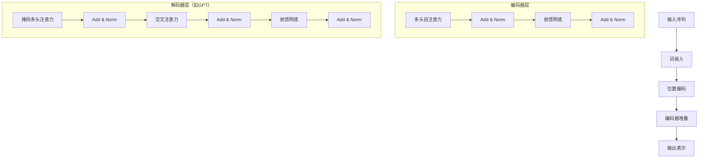

#### 4.6 Transformer在LLM训练中的关键作用
1. **并行计算**：相比RNN，可以并行处理整个序列
2. **长距离依赖**：任意两个位置直接连接，有效捕捉长距离关系
3. **可扩展性**：通过堆叠更多层和增加注意力头来扩展模型能力

#### 4.7 现代LLM对Transformer的改进
1. **架构简化**：
   - 移除编码器-解码器交叉注意力
   - 使用纯解码器架构（GPT系列）
   - 简化位置编码（RoPE）

2. **计算优化**：
   - FlashAttention：减少内存访问
   - 稀疏注意力：降低计算复杂度
   - 混合精度训练

3. **规模化扩展**：
   - 增加模型深度和宽度
   - 扩展上下文长度
   - 多模态扩展

#### 4.8 Transformer在推理阶段的工作流程
**自回归生成**：
```
输入: "今天天气"
步骤1: 预测下一个token → "很"
步骤2: 输入"今天天气很" → 预测"好"
步骤3: 输入"今天天气很好" → 预测"。"
输出: "今天天气很好。"
```

**批处理优化**：
1. KV缓存：缓存先前计算的$K,V$矩阵
2. 增量解码：仅计算新token的注意力
3. 推测解码：同时生成多个候选

#### 4.9 Transformer的局限性及解决方案
**局限性1：计算复杂度$O(n^2)$**
- 问题：序列长度增加时计算成本急剧上升
- 解决方案：稀疏注意力、线性注意力、状态空间模型

**局限性2：位置编码外推**
- 问题：训练时未见的长序列位置编码失效
- 解决方案：RoPE外推、NTK-aware缩放

**局限性3：内存占用大**
- 问题：注意力矩阵占用大量显存
- 解决方案：FlashAttention、梯度检查点

#### 4.10 Transformer在LLM生态系统中的地位
**核心地位**：
1. **基础架构**：几乎所有现代LLM都基于Transformer
2. **标准化组件**：形成了统一的模型设计范式
3. **研究平台**：便于比较不同方法的有效性

**生态系统**：
1. **开源实现**：PyTorch、TensorFlow官方支持
2. **优化库**：DeepSpeed、Megatron-LM
3. **应用框架**：LangChain、LlamaIndex

**标准答案：**

**【基本原理】**
Transformer是一种基于自注意力机制的神经网络架构，彻底改变了序列建模领域。在LLM中，它通过并行计算和全局依赖建模，实现了高效的语言理解和生成能力。

**【回答模板】**
* **Transformer架构**：由编码器和解码器组成的神经网络，核心是自注意力机制，能够并行处理序列并捕捉长距离依赖关系。
* **在LLM中的使用**：现代LLM主要使用Transformer解码器部分，通过因果注意力实现自回归语言建模，支持大规模并行训练和高效推理。

**【深入理解】**
1. **架构创新**：
   Transformer的关键创新在于**完全依赖注意力机制**，摒弃了循环和卷积结构：
   - **并行性**：所有位置同时计算，训练速度大幅提升
   - **全局连接**：任意两个位置直接交互，有效建模长距离依赖
   - **可解释性**：注意力权重可视化为模型决策提供洞见

2. **在LLM中的具体实现**：
   **GPT系列架构**：
   ```
   输入 → 词嵌入 → 位置编码 → [Transformer块 × N] → 输出投影 → 词汇概率
   
   单个Transformer块：
   输入 → 层归一化 → 多头因果注意力 → 残差连接 → 
   层归一化 → 前馈网络 → 残差连接 → 输出
   ```

3. **关键技术组件**：
   - **多头注意力**：$h$个独立的注意力头学习不同表示子空间
   - **前馈网络**：两层MLP提供非线性变换能力
   - **残差连接**：$x_{l+1} = x_l + F(x_l)$，缓解梯度消失
   - **层归一化**：稳定训练，加速收敛

**Transformer在LLM训练中的优势：**
1. **训练效率**：
   - 相比RNN的$O(n)$序列计算，Transformer可并行处理整个序列
   - 支持大规模数据并行和模型并行
   - 梯度传播路径短，训练稳定

2. **表示能力**：
   - 每个token都能直接访问序列中所有其他token的信息
   - 多头机制学习丰富的交互模式
   - 深度堆叠实现复杂的特征抽象

3. **扩展性**：
   - 通过增加层数、隐藏维度和注意力头数平滑扩展
   - 支持从数百万到数万亿参数的大规模模型
   - 架构统一便于算法和工程优化

**现代改进和变体：**
1. **高效注意力**：
   - **FlashAttention**：通过分块计算减少内存访问
   - **稀疏注意力**：只计算重要的注意力连接
   - **线性注意力**：近似注意力计算为线性复杂度

2. **位置编码演进**：
   - **RoPE**：通过旋转矩阵编码相对位置，支持长度外推
   - **ALiBi**：为注意力分数添加线性偏置，无需显式位置编码
   - **NTK-aware缩放**：改进RoPE的长序列外推能力

3. **架构简化**：
   - **纯解码器架构**：GPT系列的成功验证了简化架构的有效性
   - **移除LayerNorm偏置**：减少参数，提高数值稳定性
   - **SwiGLU激活函数**：改进前馈网络表达能力

**实践应用中的考虑：**
1. **内存优化**：
   - KV缓存加速自回归生成
   - 梯度检查点节省显存
   - 混合精度训练平衡精度和速度

2. **推理优化**：
   - 动态批处理提高吞吐量
   - 推测解码减少生成步数
   - 量化压缩减小模型大小

3. **部署挑战**：
   - 长序列处理的内存瓶颈
   - 低延迟要求下的优化
   - 多GPU分布式推理

**总结：**
Transformer不仅是LLM的技术基础，更是推动整个AI领域发展的关键创新。其优雅的架构设计、强大的表示能力和出色的可扩展性，使其成为构建大规模语言模型的理想选择。随着研究的深入，Transformer仍在不断演进，为更强大、更高效的AI系统奠定基础。

---

### 5. 解释Encoder-only、Decoder-only、Encoder-Decoder架构的区别。

#### 5.1 三种架构的基本定义是什么？
**Encoder-only架构**：只包含Transformer编码器部分，专注于理解和表示输入序列。

**Decoder-only架构**：只包含Transformer解码器部分，专注于自回归生成输出序列。

**Encoder-Decoder架构**：同时包含编码器和解码器，用于序列到序列的转换任务。

#### 5.2 从组件角度看三者差异
**Encoder-only（如BERT）**：
- 多头自注意力：双向，每个位置能看到整个序列
- 前馈网络：每个位置独立处理
- 输出：每个输入位置的上下文表示

**Decoder-only（如GPT）**：
- 掩码多头注意力：因果的，每个位置只能看到前面位置
- 前馈网络：每个位置独立处理  
- 输出：下一个token的概率分布

**Encoder-Decoder（如T5、BART）**：
- 编码器：双向自注意力处理输入
- 解码器：因果自注意力处理输出，交叉注意力连接编码器输出
- 输出：基于输入序列生成输出序列

#### 5.3 注意力机制的区别
**编码器注意力**：
- 类型：双向自注意力
- 掩码：无（或全1掩码）
- 目的：建立输入序列内部的全局依赖

**解码器注意力**：
- 类型：因果自注意力
- 掩码：下三角掩码（防止看到未来信息）
- 目的：建立输出序列的自回归依赖

**交叉注意力**（Encoder-Decoder特有）：
- 类型：解码器到编码器的注意力
- 目的：将输入信息融合到输出生成中

#### 5.4 三种架构示意图对比
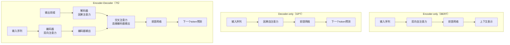

#### 5.5 训练目标和损失函数差异
**Encoder-only**：
- 目标：掩码语言建模（MLM）
- 损失：$L = -\sum_{i \in M} \log P(x_i | x_{\backslash M})$
- 示例：BERT预测被掩码的token

**Decoder-only**：
- 目标：自回归语言建模
- 损失：$L = -\sum_{t=1}^T \log P(x_t | x_{<t})$
- 示例：GPT预测下一个token

**Encoder-Decoder**：
- 目标：序列到序列建模
- 损失：$L = -\sum_{t=1}^{T_y} \log P(y_t | x, y_{<t})$
- 示例：T5翻译、摘要生成

#### 5.6 适用任务类型对比
**Encoder-only适合**：
- 文本分类（情感分析、主题分类）
- 命名实体识别
- 句子相似度计算
- 掩码填充任务

**Decoder-only适合**：
- 文本生成（故事创作、代码生成）
- 对话系统
- 文本补全
- 指令遵循

**Encoder-Decoder适合**：
- 机器翻译
- 文本摘要
- 问答系统
- 文本风格转换

#### 5.7 推理过程的差异
**Encoder-only推理**：
- 输入：完整序列
- 处理：一次性编码整个序列
- 输出：每个位置的表示或分类结果

**Decoder-only推理**：
- 输入：前缀序列
- 处理：自回归逐个生成token
- 输出：生成的完整序列

**Encoder-Decoder推理**：
- 阶段1：编码器处理输入序列
- 阶段2：解码器自回归生成输出，每次关注编码器输出

#### 5.8 参数效率和计算复杂度
**参数数量**：
- Encoder-only：中等，专注于理解
- Decoder-only：较大，需要生成能力
- Encoder-Decoder：最大，两套参数

**计算复杂度**：
- Encoder-only：$O(n^2)$，n为输入长度
- Decoder-only：$O(m^2)$，m为生成长度（自回归）
- Encoder-Decoder：$O(n^2 + m^2 + n \times m)$

#### 5.9 实际应用中的选择考量
**选择Encoder-only当**：
1. 任务主要是理解而非生成
2. 需要双向上下文信息
3. 计算资源有限
4. 有大量标注数据

**选择Decoder-only当**：
1. 任务主要是生成内容
2. 需要零样本或少样本学习
3. 追求模型统一性和简化
4. 关注推理效率

**选择Encoder-Decoder当**：
1. 明确的输入-输出映射任务
2. 需要精确的条件生成
3. 任务复杂度高，需要分离理解与生成
4. 有配对的数据（如翻译对）

#### 5.10 历史演进和现状
**早期**：Encoder-Decoder主导（机器翻译时代）

**中期**：Encoder-only崛起（BERT引领预训练时代）

**当前**：Decoder-only主导（GPT系列统一架构）

**未来趋势**：可能回归更平衡的架构或出现新范式

**标准答案：**

**【基本原理】**
三种架构代表了Transformer模型的不同设计哲学：Encoder-only专注于理解，Decoder-only专注于生成，Encoder-Decoder平衡两者用于转换任务。选择哪种架构取决于具体任务需求和资源约束。

**【回答模板】**
* **Encoder-only**：双向理解架构，适合需要全局上下文感知的任务，如分类、NER。
* **Decoder-only**：因果生成架构，适合自回归生成任务，如文本创作、对话。
* **Encoder-Decoder**：理解-生成联合架构，适合序列转换任务，如翻译、摘要。

**【深入理解】**
1. **设计哲学差异**：
   - **Encoder-only**：强调"理解力"，通过双向注意力全面把握输入语义
   - **Decoder-only**：强调"生成力"，通过因果注意力确保生成的一致性和连贯性
   - **Encoder-Decoder**：强调"转换力"，分离理解和生成阶段，实现精确的条件生成

2. **注意力模式对比**：
   ```
   Encoder注意力：     Decoder注意力：     Encoder-Decoder交叉注意力：
   [1,1,1,1,1]         [1,0,0,0,0]        解码器位置 → 所有编码器位置
   [1,1,1,1,1]         [1,1,0,0,0]
   [1,1,1,1,1]         [1,1,1,0,0]
   [1,1,1,1,1]         [1,1,1,1,0]
   [1,1,1,1,1]         [1,1,1,1,1]
   ```

3. **训练范式差异**：
   - **Encoder-only**：预训练+微调，通过MLM学习丰富表示
   - **Decoder-only**：纯自回归预训练，统一的下一个token预测
   - **Encoder-Decoder**：条件生成预训练，学习输入到输出的映射

**实际工程考量：**
1. **部署复杂度**：
   - Encoder-only：最简单，一次性计算
   - Decoder-only：需要KV缓存优化自回归
   - Encoder-Decoder：最复杂，两阶段流水线

2. **内存使用**：
   - Encoder-only：静态内存，输入确定后不变
   - Decoder-only：动态增长，随生成长度增加
   - Encoder-Decoder：混合模式，编码阶段静态，解码阶段动态

3. **延迟特性**：
   - Encoder-only：低延迟，单次前向传播
   - Decoder-only：token级延迟，依赖生成长度
   - Encoder-Decoder：编码延迟+token级解码延迟

**选择指南：**
1. **任务驱动选择**：
   - 理解任务 → Encoder-only
   - 生成任务 → Decoder-only  
   - 转换任务 → Encoder-Decoder

2. **数据驱动选择**：
   - 有大量配对数据 → Encoder-Decoder
   - 只有文本数据 → Decoder-only
   - 有任务标注数据 → Encoder-only

3. **资源驱动选择**：
   - 计算受限 → Encoder-only
   - 内存充足 → Decoder-only
   - 追求最佳效果 → Encoder-Decoder

**总结：**
三种架构各有优劣，反映了AI研究中对"理解"、"生成"和"转换"不同侧重点的探索。虽然当前Decoder-only在通用AI助手领域占据主导，但其他架构在特定领域仍有不可替代的价值。实际选择时应综合考虑任务需求、数据情况和资源约束。

---

### 6. 为什么目前LLM几乎全部采用Decoder-only架构？

#### 6.1 历史背景：从多样化到统一化
**早期探索期**（2018-2019）：
- BERT（Encoder-only）主导：在理解任务上表现优异
- GPT-2（Decoder-only）初显生成能力
- T5（Encoder-Decoder）试图统一所有NLP任务

**转折点**（2020-2021）：
- GPT-3证明Decoder-only的零样本能力
- 参数规模效应在Decoder-only上更明显
- 工程简化需求推动架构统一

#### 6.2 根本原因1：训练目标的统一性
**Decoder-only的训练目标最简单**：
- 单一目标：下一个token预测
- 自监督：无需人工标注
- 可扩展：数据规模无理论上限

对比：
- Encoder-only：需要设计掩码策略
- Encoder-Decoder：需要配对数据或构造任务

**数学简洁性**：
Decoder-only损失函数：$L = -\sum_{t=1}^T \log P(x_t | x_{<t})$
比Encoder-Decoder的$L = -\sum_{t=1}^{T_y} \log P(y_t | x, y_{<t})$更统一

#### 6.3 根本原因2：生成能力的天然优势
**自回归生成是LLM的核心能力**：
- 对话：需要连续生成响应
- 创作：需要连贯的文本生成
- 推理：需要逐步推导结论

**Decoder-only的因果注意力**：
- 天然支持自回归生成
- 训练和推理模式一致
- 无需额外的生成机制

#### 6.4 根本原因3：规模扩展的友好性
**参数效率**：
- Decoder-only：参数集中在生成能力
- Encoder-Decoder：参数分散在理解和生成
- 相同参数量下，Decoder-only生成能力更强

**计算效率**：
- 训练：纯Decoder架构更容易并行化
- 推理：KV缓存机制更高效
- 内存：无需存储编码器-解码器注意力矩阵

#### 6.5 根本原因4：零样本和少样本学习能力
**下一个token预测的通用性**：
- 任何任务都可以转化为文本生成
- 指令遵循通过提示工程实现
- 无需任务特定的输出头

**对比分析**：
- Encoder-only：需要微调适应新任务
- Encoder-Decoder：需要设计任务格式
- Decoder-only：通过提示直接适应

#### 6.6 根本原因5：工程实现的简化
**架构统一的好处**：
1. **代码简化**：一套代码支持所有任务
2. **基础设施统一**：优化策略通用
3. **部署标准化**：推理引擎简化
4. **维护成本低**：bug修复和优化集中

**训练流程简化**：
```
Decoder-only: 数据 → 预训练 → SFT → RLHF → 部署
Encoder-Decoder: 数据 → 任务构造 → 多目标预训练 → 任务微调 → 部署
```

#### 6.7 根本原因6：涌现能力的发现
**规模定律（Scaling Laws）**：
- Decoder-only的涌现能力与规模强相关
- 能力随参数、数据、计算量平滑增长
- 预测下一个token的任务最能体现规模效益

**涌现现象**：
- 代码生成
- 数学推理  
- 多语言理解
- 指令遵循

#### 6.8 根本原因7：多模态扩展的便利性
**统一序列建模**：
- 文本、图像、音频都可token化
- 相同的自回归生成框架
- 无需复杂的多模态融合机制

**示例**：
- 图像生成：DALL-E、Stable Diffusion基于类似思想
- 多模态理解：统一为序列到序列

#### 6.9 根本原因8：社区和生态系统的正反馈
**开源模型推动**：
- LLaMA、Falcon、MPT等主流开源模型都是Decoder-only
- 研究社区集中优化Decoder-only架构
- 工具链和最佳实践成熟

**商业应用驱动**：
- ChatGPT的成功验证了Decoder-only的实用性
- 企业投资集中在Decoder-only技术栈
- 市场需求推动架构统一

#### 6.10 架构选择演变示意图
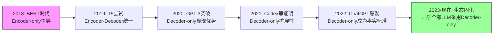

**标准答案：**

**【基本原理】**
Decoder-only架构成为LLM主流选择，是技术演进、工程实践和市场需求的综合结果。其核心优势在于训练目标的统一性、生成能力的天然优势、规模扩展的友好性，以及工程实现的简化。

**【回答模板】**
* **统一训练目标**：下一个token预测任务简单统一，无需复杂任务构造
* **天然生成能力**：因果注意力直接支持自回归生成，训练推理一致
* **规模扩展友好**：参数和计算效率高，涌现能力随规模平滑增长
* **工程实现简化**：架构统一降低开发、部署和维护成本

**【深入理解】**
1. **技术演进逻辑**：
   Decoder-only的胜利是"简单性战胜复杂性"的典型例证：
   - **BERT的复杂**：需要掩码策略、NSP任务、双向注意力
   - **T5的更复杂**：需要任务前缀、编码器-解码器协调
   - **GPT的简单**：只有下一个token预测，一切自然涌现

2. **经济学原理**：
   - **边际成本递减**：统一架构的研发和优化成本分摊到所有应用
   - **网络效应**：生态系统的正反馈强化了Decoder-only的主导地位
   - **路径依赖**：早期成功建立了难以撼动的技术标准

3. **认知科学视角**：
   Decoder-only模仿了人类语言的生成过程：
   - **增量生成**：像说话一样逐个词产出
   - **上下文依赖**：每个新词基于前面所有词
   - **错误纠正**：生成错误可以在后续生成中修正

**具体优势分析：**
1. **训练效率优势**：
   ```
   Decoder-only vs Encoder-Decoder训练对比：
   
   数据利用率：   100% vs 需要构造配对数据
   并行化程度：   高 vs 编码器-解码器协调开销
   目标一致性：   单一目标 vs 多目标平衡
   ```

2. **推理效率优势**：
   - **KV缓存**：Decoder-only的KV缓存机制高度优化
   - **内存访问**：注意力计算模式规律，便于硬件优化
   - **延迟可预测**：token级生成，延迟与输出长度线性相关

3. **能力扩展优势**：
   - **零样本学习**：通过提示直接激活能力
   - **多任务统一**：所有任务转化为文本生成
   - **持续学习**：通过继续预训练平滑扩展知识

**潜在局限和未来可能：**
1. **当前局限**：
   - 双向理解能力相对较弱
   - 长文档处理效率问题
   - 精确的条件生成不如Encoder-Decoder

2. **改进方向**：
   - 混合注意力模式（如双向+因果）
   - 更高效的位置编码
   - 架构创新（如Mamba的SSM）

3. **未来可能**：
   - 新架构可能挑战Decoder-only地位
   - 多模态需求可能推动架构演变
   - 硬件发展可能改变计算权衡

**总结：**
Decoder-only架构的统治地位是多重因素共同作用的结果：技术上的简洁优雅、工程上的高效实用、经济上的规模效应。虽然它可能不是所有任务的最优解，但其统一性和可扩展性使其成为构建通用AI助手的最佳选择。这种架构统一也推动了整个AI生态的快速发展，降低了技术门槛，加速了创新应用的出现。

---

### 7. 为什么Transformer需要位置编码？

#### 7.1 问题的本质：排列等变性
**Transformer的自注意力机制本质**：
- 输入：一组向量 $\{x_1, x_2, ..., x_n\}$
- 输出：每个位置的加权和 $y_i = \sum_j \text{attention}(x_i, x_j) \cdot x_j$
- 性质：如果打乱输入顺序，输出也会相应打乱，但内部关系不变

**数学表示**：
对于任意排列 $\pi$：
$$ \text{Attention}(x_{\pi(1)}, ..., x_{\pi(n)}) = \pi(\text{Attention}(x_1, ..., x_n)) $$

这意味着：**纯自注意力无法区分"猫追老鼠"和"老鼠追猫"**

#### 7.2 序列任务的位置敏感性
**自然语言的顺序重要性**：
1. **语法结构**：主语-谓语-宾语的顺序决定语义
2. **时间关系**：事件发生的先后顺序
3. **逻辑依赖**：前提在前，结论在后
4. **指代关系**：代词通常指代前面出现的名词

**示例对比**：
- "我爱机器学习" ≠ "机器学习爱我"
- "先吃饭后洗澡" ≠ "先洗澡后吃饭"
- "因为下雨，所以取消" ≠ "所以取消，因为下雨"

#### 7.3 位置编码的基本原理
**核心思想**：为每个位置注入唯一的位置信息

**两种主要方法**：
1. **绝对位置编码**：为每个位置分配固定向量
2. **相对位置编码**：编码位置之间的相对关系

#### 7.4 绝对位置编码的经典实现
**正弦余弦位置编码（原始Transformer）**：
$$ PE_{(pos,2i)} = \sin(pos / 10000^{2i/d}) $$
$$ PE_{(pos,2i+1)} = \cos(pos / 10000^{2i/d}) $$

**特性**：
1. **周期性**：不同频率的正弦波组合
2. **相对位置可学习**：$\text{PE}_{pos+k}$ 可以表示为 $\text{PE}_{pos}$ 的线性函数
3. **外推性**：可以处理比训练时更长的序列

**可视化理解**：
```
位置1: [sin(1/10000^0), cos(1/10000^0), sin(1/10000^2), cos(1/10000^2), ...]
位置2: [sin(2/10000^0), cos(2/10000^0), sin(2/10000^2), cos(2/10000^2), ...]
...
```

#### 7.5 相对位置编码的现代实现
**RoPE（旋转位置编码）**：
- 核心：通过旋转矩阵编码相对位置
- 公式：$f_q(x_m, m) = R_{\theta,m}W_qx_m$
- 优势：更好的长度外推能力

**ALiBi（注意力线性偏置）**：
- 核心：为注意力分数添加与相对距离成比例的偏置
- 公式：$\text{attention} = \text{softmax}(q_i k_j^T + m \cdot |i-j|)$
- 优势：无需训练位置嵌入，更好的泛化性

#### 7.6 位置编码的作用机制
**在注意力计算中的融合**：
1. **加性融合**：$h_i = \text{Attention}(x_i + p_i, x_j + p_j)$
2. **乘性融合**：通过旋转或相对偏置影响注意力分数
3. **分离处理**：位置信息作为额外的偏置项

**信息流示意图**：
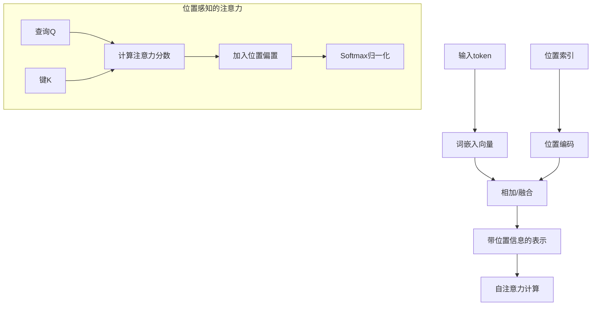

#### 7.7 为什么RNN/CNN不需要显式位置编码？
**RNN的隐式位置编码**：
- 循环结构：按顺序处理序列，自然包含位置信息
- 状态传递：$h_t = f(h_{t-1}, x_t)$，$h_t$ 隐含了位置$t$的信息

**CNN的隐式位置编码**：
- 卷积核：滑动窗口操作，局部位置关系通过核权重编码
- 池化层：位置信息在池化过程中部分保留

**对比分析**：
```
模型类型       位置信息编码方式       处理长距离依赖
RNN          隐式（顺序处理）       困难（梯度消失）
CNN          隐式（局部卷积）       需要深层堆叠
Transformer  显式（位置编码）       直接（全局注意力）
```

#### 7.8 位置编码的设计考量
**设计目标**：
1. **唯一性**：不同位置有不同的编码
2. **相对性**：能表示位置之间的相对关系
3. **外推性**：能处理训练时未见的序列长度
4. **效率**：计算和存储开销小

**权衡因素**：
- 正弦编码 vs 可学习编码
- 绝对位置 vs 相对位置
- 加法融合 vs 乘法融合

#### 7.9 位置编码的挑战和解决方案
**挑战1：长度外推（Length Extrapolation）**
- 问题：训练时最大长度$L_{train}$，推理时需要处理$L_{test} > L_{train}$
- 解决方案：RoPE外推、NTK-aware缩放、位置插值

**挑战2：长序列的数值稳定性**
- 问题：极长序列时位置编码值可能过大或过小
- 解决方案：归一化、截断、对数空间编码

**挑战3：多维度位置信息**
- 问题：图像、视频等多维数据需要2D/3D位置编码
- 解决方案：分离的维度编码、空间位置编码

#### 7.10 位置编码对模型性能的影响
**消融实验发现**：
1. **没有位置编码**：模型完全无法学习序列任务
2. **随机位置编码**：效果差，但优于没有编码
3. **正弦编码**：效果好，支持相对位置推理
4. **可学习编码**：训练更快，但外推能力差

**实际影响**：
- 翻译任务：位置编码质量影响长句翻译准确性
- 代码生成：影响括号匹配、缩进等结构信息
- 对话系统：影响对话历史的时序理解

**标准答案：**

**【基本原理】**
Transformer需要位置编码是因为其核心的自注意力机制本质上是排列等变的——它无法区分输入序列的顺序。位置编码为模型注入了必要的顺序信息，使其能够理解语言中的时序、语法和逻辑结构。

**【回答模板】**
* **根本原因**：自注意力机制对输入顺序不敏感，需要额外信息来区分"猫追老鼠"和"老鼠追猫"
* **解决方案**：通过位置编码为每个token添加位置信息，使模型能够理解序列中的顺序关系
* **关键作用**：1) 区分绝对位置；2) 编码相对距离；3) 支持长度外推；4) 保持平移不变性

**【深入理解】**
1. **数学本质**：
   位置编码解决了Transformer的**排列对称性**问题：
   ```
   没有位置编码：
   Attention([x1, x2, x3]) 和 Attention([x3, x1, x2]) 的输出只差一个排列
   
   有位置编码：
   Attention([x1+p1, x2+p2, x3+p3]) ≠ Attention([x3+p1, x1+p2, x2+p3])
   ```

2. **编码策略演进**：
   **第一代：绝对位置编码**
   - 正弦余弦编码：理论优美，支持相对位置推理
   - 可学习嵌入：简单有效，但外推能力有限
   
   **第二代：相对位置编码**
   - T5的相对位置偏置：在注意力分数中添加相对距离偏置
   - RoPE（旋转位置编码）：通过复数旋转编码相对位置
   - ALiBi（注意力线性偏置）：线性偏置，无需训练，泛化能力强

3. **在注意力机制中的具体实现**：
   **原始Transformer的加性融合**：
   $$ \text{Attention}(Q,K,V) = \text{softmax}\left(\frac{(X+E)W_Q((X+E)W_K)^T}{\sqrt{d_k}}\right)(X+E)W_V $$
   
   **RoPE的乘性融合**：
   $$ q_m = R_{\theta,m}W_qx_m, \quad k_n = R_{\theta,n}W_kx_n $$
   $$ \text{attention} = \text{softmax}(q_m^T k_n) $$

**位置编码的关键特性：**
1. **唯一性**：确保每个位置有独特的表示
2. **相对性**：位置m和n的编码关系应反映|m-n|
3. **有界性**：编码值不应无限增长
4. **确定性**：相同位置应有相同编码
5. **连续性**：相邻位置编码应相似

**不同类型任务的需求：**
1. **语言建模**：需要精确的相对位置信息
2. **机器翻译**：需要对齐源语言和目标语言的位置
3. **代码生成**：需要层次化的位置信息（缩进、括号）
4. **图像处理**：需要2D网格位置信息

**现代最佳实践：**
1. **主流选择**：RoPE已成为大多数LLM的标准
2. **外推技术**：NTK-aware缩放、YaRN、位置插值
3. **高效实现**：缓存位置编码，避免重复计算
4. **多模态扩展**：为不同模态设计专用位置编码

**位置编码的哲学意义：**
位置编码体现了AI中的一个深层问题：**如何让无状态的神经网络理解时间**。它连接了：
- **离散与连续**：将离散位置映射到连续空间
- **局部与全局**：通过相对位置编码传递全局结构
- **确定与随机**：确定性的编码支持不确定性的生成

**总结：**
位置编码是Transformer架构中看似简单但至关重要的组件。它不仅解决了模型对序列顺序的感知问题，还深刻影响了模型的泛化能力、外推性能和实际应用效果。随着研究的深入，位置编码从简单的加性嵌入发展到复杂的相对编码方案，反映了AI研究者对"位置"这一基本概念的不断深化理解。

---

### 8. CNNs和RNNs不使用位置嵌入。为什么Transformer需要位置嵌入？

#### 8.1 问题的核心：架构的本质差异
**关键洞察**：CNN和RNN通过其**架构设计**隐式编码了位置信息，而Transformer的**自注意力机制**本质上是排列不变的，需要显式的位置编码来注入顺序信息。

#### 8.2 RNN如何隐式编码位置信息？
**RNN的工作机制**：
- **顺序处理**：RNN按时间步逐个处理序列元素
- **隐藏状态传递**：$h_t = f(h_{t-1}, x_t)$
- **位置信息的累积**：隐藏状态$h_t$包含了从开始到位置$t$的所有历史信息

**数学解释**：
对于序列$x_1, x_2, ..., x_T$，第$t$个位置的输出：
$$ h_t = f(W_h h_{t-1} + W_x x_t + b) $$
其中$h_t$隐式编码了位置$t$的信息，因为：
1. $h_t$的计算依赖于$h_{t-1}$
2. $h_{t-1}$又依赖于$h_{t-2}$
3. 递归地，$h_t$包含了$x_1, x_2, ..., x_t$的所有信息

**位置敏感性示例**：
```
输入序列: "我 爱 机 器 学 习"
RNN处理:
h1 = f(初始状态, "我")
h2 = f(h1, "爱")  ← h2包含了"我"的信息
h3 = f(h2, "机")  ← h3包含了"我爱"的信息
...
```

#### 8.3 CNN如何隐式编码位置信息？
**CNN的工作机制**：
- **局部连接**：卷积核在输入上滑动，只关注局部区域
- **权重共享**：相同的卷积核应用于所有位置
- **位置通过感受野编码**：深层特征图的每个位置对应原始输入的特定区域

**位置信息的编码方式**：
1. **卷积操作的位置依赖性**：
   $$ y[i] = \sum_{k=0}^{K-1} w[k] \cdot x[i+k] $$
   输出$y[i]$直接对应输入$x$的特定位置$i$

2. **池化操作的位置保留**：
   - 最大池化：保留最强特征的位置信息
   - 平均池化：平滑位置信息但仍有局部性

3. **层次化位置编码**：
   ```
   原始序列: [x1, x2, x3, x4, x5, x6]
   第一层卷积(核大小3): [y1, y2, y3, y4] ← y1对应[x1,x2,x3]
   第二层卷积: [z1, z2] ← z1对应[y1,y2]对应[x1,x2,x3,x4]
   ```

#### 8.4 Transformer为什么需要显式位置编码？
**自注意力的排列等变性**：
- **数学性质**：对于任意排列$\pi$：
  $$ \text{Attention}(x_{\pi(1)}, ..., x_{\pi(n)}) = \pi(\text{Attention}(x_1, ..., x_n)) $$
- **物理意义**：打乱输入顺序只会打乱输出顺序，但内部关系不变

**具体示例**：
```
输入1: ["猫", "追", "老鼠"] → 注意力计算 → 输出表示
输入2: ["老鼠", "追", "猫"] → 注意力计算 → 输出表示

没有位置编码时，两个输入的内部表示关系完全相同，
只是输出顺序不同，无法区分语义差异。
```

#### 8.5 三种架构的位置信息处理对比表
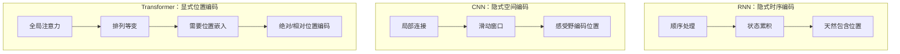

#### 8.6 从计算图角度理解
**RNN的计算图**：
```
x1 → h1 → h2 → h3 → ... → hT
     ↑     ↑     ↑         ↑
     x2    x3    x4        xT
```
- 信息流动是**有向的**（从前到后）
- 位置通过**计算路径长度**编码

**CNN的计算图**：
```
[x1,x2,x3] → y1
[x2,x3,x4] → y2
[x3,x4,x5] → y3
```
- 位置通过**卷积核的偏移**编码
- 每个输出对应输入的**特定局部区域**

**Transformer的计算图**：
```
x1 ──┬───┬───┬───┐
     │   │   │   │
x2 ──┼───┼───┼───┤
     │   │   │   │
x3 ──┼───┼───┼───┤
     │   │   │   │
x4 ──┴───┴───┴───┘
```
- 所有位置**全连接**
- 没有固有的顺序信息

#### 8.7 位置信息的类型和需求
**绝对位置信息**：
- 需要：词性标注（句首通常是主语）
- RNN：通过时间步隐式提供
- CNN：通过特征图坐标隐式提供
- Transformer：需要显式编码

**相对位置信息**：
- 需要：依存关系解析（动词与宾语的距离）
- RNN：通过隐藏状态差异隐式编码
- CNN：通过感受野大小隐式编码  
- Transformer：需要显式编码（如RoPE）

**长距离位置关系**：
- RNN：难以建模（梯度消失）
- CNN：需要深层堆叠
- Transformer：直接建模，但需要位置编码支持

#### 8.8 为什么CNN/RNN的隐式编码对它们足够？
**RNN的适用场景**：
1. **强时序性任务**：语言建模、时间序列预测
2. **序列长度适中**：避免梯度消失问题
3. **因果依赖性**：未来不能影响过去

**CNN的适用场景**：
1. **局部模式识别**：图像特征、局部语法模式
2. **平移不变性需求**：相同模式在不同位置应有相同响应
3. **层次化特征学习**：从局部到全局的特征抽象

**Transformer的突破性需求**：
1. **并行计算**：需要打破RNN的顺序约束
2. **全局依赖建模**：需要超越CNN的局部视野
3. **长序列处理**：需要有效处理超长上下文

#### 8.9 从信息论角度分析
**位置信息的编码效率**：
- **RNN**：$O(T)$的时间复杂度编码位置
- **CNN**：$O(\log T)$的层次化编码
- **Transformer**：$O(1)$的直接编码（通过位置嵌入）

**位置信息的表示能力**：
```
模型类型       位置表示       处理复杂度       外推能力
RNN          隐式，累积      O(T)            差
CNN          隐式，局部      O(1) per layer  中等
Transformer  显式，直接      O(1)            好（依赖编码设计）
```

#### 8.10 现代视角：位置编码的演进意义
**从隐式到显式的哲学转变**：
1. **分离关注点**：将内容表示和位置表示解耦
2. **可解释性提升**：位置信息变得明确可分析
3. **灵活控制**：可以设计不同的位置编码策略

**位置编码带来的新能力**：
1. **长度外推**：处理比训练时更长的序列
2. **相对位置感知**：精确建模token之间的距离关系
3. **多维度位置**：支持2D/3D网格位置编码

**标准答案：**

**【基本原理】**
CNN和RNN不需要显式位置嵌入，因为它们的**架构设计**本身就隐式编码了位置信息：RNN通过顺序处理累积位置，CNN通过局部连接和感受野编码位置。而Transformer的**自注意力机制**本质上是排列等变的，对所有输入位置一视同仁，因此需要显式的位置编码来注入必要的顺序信息。

**【回答模板】**
* **RNN**：通过顺序处理和隐藏状态传递**隐式编码**位置信息，每个时间步的隐藏状态累积了之前所有位置的信息。
* **CNN**：通过卷积核的滑动窗口操作**隐式编码**局部位置关系，深层特征通过感受野编码全局位置。
* **Transformer**：自注意力机制是**排列等变**的，对输入顺序不敏感，需要**显式位置编码**来区分序列顺序。

**【深入理解】**
1. **架构本质的数学差异**：
   - **RNN**：$h_t = f(h_{t-1}, x_t)$ → 递归结构天然包含时序
   - **CNN**：$y[i] = \sum w[k] \cdot x[i+k]$ → 卷积操作与位置$i$绑定
   - **Transformer**：$\text{Attention}(Q,K,V) = \text{softmax}(QK^T/\sqrt{d})V$ → 对输入排列不变

2. **信息流动模式的对比**：
   ```
   RNN信息流：   单向，因果，随时间累积
   x1 → x2 → x3 → x4 → ... → xT
   
   CNN信息流：   局部，分层，通过感受野扩展
   [x1,x2,x3] → y1
   [x2,x3,x4] → y2  → [y1,y2] → z1
   
   Transformer信息流：全局，并行，全连接
   x1 ↔ x2 ↔ x3 ↔ x4 ↔ ... ↔ xT
   ```

3. **位置感知的机制差异**：
   **RNN的位置感知**：
   - 机制：通过**计算步骤数**编码位置
   - 优点：天然因果性，适合序列生成
   - 缺点：难以并行，长距离依赖问题
   
   **CNN的位置感知**：
   - 机制：通过**特征图坐标**编码位置
   - 优点：平移等变性，适合模式识别
   - 缺点：需要深层堆叠获取全局信息
   
   **Transformer的位置感知**：
   - 机制：需要**显式位置编码**
   - 优点：灵活可控，支持各种位置关系
   - 缺点：增加了设计复杂性

**历史演进视角：**
1. **RNN时代**（2014-2017）：
   - LSTM/GRU通过门控机制缓解梯度消失
   - 位置信息通过隐藏状态自然编码
   - 但并行化困难，训练速度慢

2. **CNN复兴**（2015-2018）：
   - 文本CNN证明局部模式的有效性
   - 位置通过卷积核偏移隐式编码
   - 但需要精心设计感受野大小

3. **Transformer革命**（2017-现在）：
   - 彻底解耦内容和位置表示
   - 位置编码从简单加性发展到复杂相对编码
   - 支持前所未有的并行性和长距离建模

**实际工程意义：**
1. **训练效率**：
   - RNN：顺序计算，难以并行
   - CNN：局部并行，但需要多层
   - Transformer：完全并行，但需要位置编码

2. **内存使用**：
   - RNN：$O(T)$的序列长度内存
   - CNN：$O(T)$的激活值内存
   - Transformer：$O(T^2)$的注意力矩阵内存

3. **灵活性**：
   - RNN/CNN：位置编码方式固定
   - Transformer：可以自由设计位置编码策略

**位置编码的设计哲学：**
位置编码的引入体现了AI设计的一个重要原则：**将先验知识显式化**。通过将位置信息作为显式输入，Transformer获得了：
1. **可解释性**：可以分析模型如何使用位置信息
2. **可控性**：可以设计特定的位置编码模式
3. **泛化性**：可以处理训练时未见的位置关系

**为什么这个问题重要：**
理解为什么Transformer需要位置编码而CNN/RNN不需要，有助于我们：
1. **深入理解不同架构的本质**
2. **设计更有效的位置编码方案**
3. **预测不同架构在特定任务上的表现**
4. **启发新的神经网络架构设计**

**总结：**
CNN和RNN通过其固有的计算结构隐式编码位置信息，这是它们架构设计的自然结果。而Transformer的自注意力机制为了获得完全的并行性和全局连接能力，牺牲了固有的位置感知，因此需要通过位置编码显式注入顺序信息。这种设计选择反映了深度学习中的经典权衡：通过增加显式结构来换取计算效率和表示能力。位置编码不仅解决了Transformer的顺序感知问题，还开辟了位置表示研究的新方向，成为现代LLM技术栈中的关键组件。

---
### 9. 为什么Transformer弃用RNN的循环结构？ **[原30]**

#### 9.1 RNN是如何处理序列数据的？它的核心计算方式是什么？
RNN采用循环结构，在时间步$t$计算隐藏状态$h_t = f(h_{t-1}, x_t)$。
这意味着必须先完成$t-1$步的计算，才能开始第$t$步——形成时间上的串行依赖。

#### 9.2 为什么RNN的串行依赖会限制训练效率？
现代GPU/TPU擅长大规模并行计算（如同时处理成千上万个矩阵运算）。
但RNN无法在同一时间步内并行处理整个序列，因为每一步都依赖前一步的结果。
这导致硬件利用率低，训练超长序列或大规模语料时速度极慢。

#### 9.3 RNN在处理长序列时会遇到什么信息传递问题？
假设序列长度为$L$，第一个词的信息要传到第$L$个词，需经过$L-1$次非线性变换。
在反向传播中，梯度也要沿这条路径回传，极易发生梯度消失（gradient vanishing）或爆炸（exploding）。
结果：模型难以捕捉相距较远的词之间的语义关系（即"长距离依赖"问题）。

#### 9.4 Transformer如何实现"任意两个位置直接交互"？
Transformer使用自注意力机制（Self-Attention）：对输入序列中的所有Token同时计算注意力权重。
对于任意两个位置$i$和$j$，它们的交互通过注意力分数直接建立，路径长度恒为1（即$O(1)$距离）。
这使得模型能"一眼看到"整个上下文，无需逐步传递信息。

#### 9.5 并行计算在Transformer中是如何实现的？
所有Token的表示被一次性打包成矩阵（如$X \in \mathbb{R}^{L \times d}$）。
自注意力通过矩阵乘法（$QK^T$）一次性计算所有位置对的相似度，完全可并行。
因此，Transformer的训练速度远超RNN，尤其适合大规模分布式训练。

#### 9.6 放弃RNN的循环结构后，Transformer如何保留"顺序信息"？
RNN天然具有顺序性（从左到右处理），而Transformer是"无序"的全连接结构。
为弥补这一点，Transformer引入了位置编码（Positional Encoding），将位置信息以向量形式加到Token Embedding上。
这样，模型既能并行计算，又能感知词序。

#### 9.7 Transformer的这种改变带来了哪些更深远的影响？
它标志着NLP从"时序建模"转向"空间表征建模"——不再假设语言必须按时间顺序理解。
这一转变使得大规模预训练成为可能：模型可以在海量文本上高效训练，学习通用语言表示。
最终催生了BERT、GPT、Llama等大模型时代。

**标准答案：**

**【基本原理】**
循环神经网络（RNN）的核心逻辑是顺序处理：为了计算第$t$时刻的状态$h_t$，必须先完成$t-1$时刻的计算。这种时间上的串行依赖导致了两个根本性问题：一是无法利用现代GPU的大规模并行计算能力；二是信息的传递路径过长，导致深层语义在长序列中容易丢失。

Transformer通过弃用循环结构，改用自注意力机制（Self-Attention），实现了序列信息的"一步到位"：任何两个位置之间的信息交互距离都是常数$O(1)$，且所有Token的计算可以同时开始。

**示意图：计算模式对比**
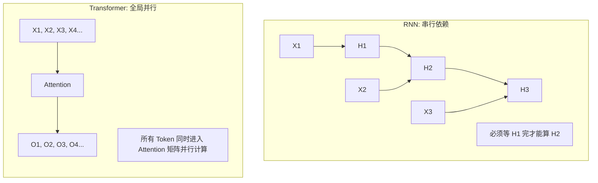

**【回答模板】**
Transformer弃用RNN的循环结构主要基于以下三个深层次原因：

1. **并行计算效率（Parallelization）**：
   RNN的计算复杂度在时间轴上是$O(L)$的，即必须经过$L$步串行操作。这限制了其在超大规模语料上的训练效率。Transformer的自注意力层允许所有位置并行计算，极大提升了模型在现代硬件（GPU/TPU）上的计算利用率，使训练超千亿参数的模型成为可能。

2. **解决长距离依赖（Long-range Dependencies）**：
   在RNN中，第一位的信息要传递到第$n$位，需要经过$n-1$次非线性变换，梯度在漫长的路径中极易消失或爆炸。而在Transformer中，任意两个Token之间的交互路径长度始终为1。这种"全局视野"使得模型能够更精准地捕捉到跨度极大的语义关联。

3. **计算路径的稳定性（Gradient Flow）**：
   RNN依赖于隐藏状态（Hidden State）的不断更新来存储记忆，这是一种"有损压缩"。Transformer通过自注意力矩阵直接建立Token间的显式联系，并配合残差连接（Residual Connection），确保了即使在极深的网络中，底层信号和梯度也能无损地向上传递。

**【深入理解】从"归纳偏置"到"纯粹注意力"：**
RNN包含一个强烈的归纳偏置（Inductive Bias）：认为距离越近的词关系越紧密，且处理顺序必须是从左往右。Transformer放弃了这种偏置，认为序列中任何两个词的关系应由数据动态决定。为了弥补丢失的顺序信息，Transformer引入了位置编码（Positional Encoding）。

* **计算复杂度的折中**：
  虽然Transformer解决了并行化问题，但它付出的代价是自注意力机制的平方复杂度$O(L^2)$（RNN是线性$O(L)$）。然而，在现代工业界，"计算的可并行性"通常比"理论上的低复杂度"更重要，因为并行化能换取更短的训练时间和更庞大的参数容量。

* **历史意义**：
  弃用RNN是自然语言处理（NLP）从"时序建模"转向"空间表征建模"的分水岭。这一转变直接导致了大规模预训练（Pre-training）范式的崛起，因为只有摆脱了循环结构的束缚，模型才能在万亿级的互联网文本中高效地汲取知识。

---
### 10. 解释Transformer模型如何解决CNN和RNN的局限性？

#### 10.1 CNN在处理序列数据时的主要局限性是什么？
CNN（卷积神经网络）主要设计用于网格状数据（如图像），在处理序列数据时存在以下问题：
- **局部感受野**：卷积核只能看到固定窗口内的局部信息，远距离依赖需要多层堆叠才能建立
- **位置不变性假设**：CNN假设特征的位置不重要（平移不变性），但语言中词序至关重要
- **固定权重**：卷积核的权重是固定的，无法根据输入内容动态调整

#### 10.2 RNN在处理序列数据时的主要局限性是什么？
根据引用的内容，RNN的主要局限性包括：
- **串行依赖**：必须按时间步顺序计算，无法并行处理（recall slice 2: 30.2）
- **长距离依赖问题**：梯度在长序列中易消失或爆炸（recall slice 2: 30.3）
- **信息压缩**：隐藏状态是有损压缩，长距离信息可能丢失

#### 10.3 Transformer如何解决CNN的局部感受野问题？
Transformer通过自注意力机制实现**全局感受野**：
- 在单层中，每个Token都能直接"看到"序列中的所有其他Token
- 任意两个位置间的交互路径长度恒为1（$O(1)$距离）
- 这种全局视野使得模型能直接捕捉长距离依赖，无需多层堆叠

#### 10.4 Transformer如何解决CNN的位置不变性问题？
Transformer通过**位置编码**（Positional Encoding）显式地编码词序信息：
- 将位置信息以向量形式加到Token Embedding上
- 使模型既能并行计算，又能感知词序
- 相比CNN的平移不变性，Transformer对位置信息更加敏感和精确

#### 10.5 Transformer如何解决RNN的串行依赖问题？
根据引用的内容，Transformer实现了**完全并行计算**：
- 所有Token的表示被一次性打包成矩阵（recall slice 2: 30.5）
- 自注意力通过矩阵乘法一次性计算所有位置对的相似度
- 极大提升了在现代GPU/TPU上的计算利用率

#### 10.6 Transformer如何解决RNN的长距离依赖问题？
Transformer通过自注意力机制实现了**距离无关的交互**：
- 任意两个Token之间的交互路径长度始终为1（recall slice 2: 30.4）
- 梯度可以直接在任意两个位置间传播，避免了RNN中的梯度消失问题
- 模型能够更精准地捕捉跨度极大的语义关联

#### 10.7 Transformer如何解决RNN的信息压缩问题？
Transformer通过**残差连接和层归一化**确保信息无损传递：
- 自注意力矩阵直接建立Token间的显式联系
- 残差连接确保底层信号和梯度能无损地向上传递
- 相比RNN的隐藏状态更新，Transformer的信息表示更加丰富和完整

#### 10.8 Transformer在计算复杂度上做了什么权衡？
虽然Transformer解决了并行化问题，但付出了**平方复杂度**的代价：
- RNN是线性复杂度$O(L)$，但无法并行
- Transformer是平方复杂度$O(L^2)$，但完全可并行
- 在现代硬件上，可并行性通常比理论低复杂度更重要

**标准答案：**

**【基本原理】**
CNN和RNN作为传统的序列建模架构，各自存在固有局限性。CNN的卷积操作受限于局部感受野，需要多层堆叠才能建立长距离连接；而RNN的循环结构导致串行依赖和梯度消失问题。Transformer通过创新的自注意力机制，同时解决了这两类问题。

**示意图：三种架构的信息流动对比**
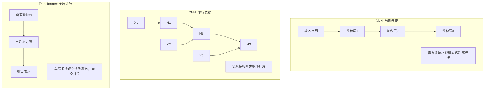

**【回答模板】**
Transformer通过以下方式解决CNN和RNN的局限性：

1. **解决CNN的局部感受野问题**：
   - **全局注意力**：自注意力机制允许每个Token直接关注序列中的所有其他Token，单层即实现全序列覆盖
   - **动态权重**：注意力权重根据输入内容动态计算，而非CNN的固定卷积核
   - **位置感知**：通过位置编码显式编码词序，克服CNN的平移不变性假设

2. **解决RNN的串行依赖问题**：
   - **完全并行化**：所有Token同时计算，充分利用GPU/TPU的并行计算能力
   - **矩阵运算**：自注意力通过$QK^T$矩阵乘法一次性计算所有位置对的相似度
   - **训练效率**：相比RNN的$O(L)$串行计算，Transformer的并行计算大幅提升训练速度

3. **解决RNN的长距离依赖问题**：
   - **常数路径长度**：任意两个Token间的交互路径长度恒为1（$O(1)$距离）
   - **梯度稳定**：梯度可直接在任意位置间传播，避免RNN的梯度消失/爆炸
   - **信息完整**：通过残差连接确保信息在深层网络中无损传递

4. **统一的架构优势**：
   - **归纳偏置少**：相比CNN的局部性偏置和RNN的顺序性偏置，Transformer几乎无归纳偏置
   - **可扩展性强**：适合大规模预训练，催生了BERT、GPT等大模型
   - **多模态适应**：不仅适用于文本，还可扩展到图像、音频等多模态任务

**【深入理解】**
Transformer的成功在于它重新思考了序列建模的本质：不再将序列视为时间上的展开（如RNN）或空间上的局部模式（如CNN），而是视为一组相互关联的实体。这种"关系优先"的视角，配合现代硬件的并行计算能力，使得Transformer能够处理更复杂的语义关系和更长距离的依赖。

然而，这种优势也有代价：自注意力的$O(L^2)$复杂度限制了处理超长序列的能力。为此，后续研究提出了各种优化方案，如稀疏注意力、线性注意力等，试图在保持Transformer核心优势的同时降低计算复杂度。

---

### 11. Transformer相对于LSTM有哪些优势？

#### 11.1 LSTM是什么？它如何改进传统RNN？
LSTM（长短期记忆网络）是RNN的一种变体，通过门控机制解决传统RNN的梯度消失问题：
- **遗忘门**：决定哪些信息从细胞状态中丢弃
- **输入门**：决定哪些新信息存储到细胞状态
- **输出门**：决定输出哪些信息
- **细胞状态**：专门设计的信息"高速公路"，允许梯度无损传递

#### 11.2 LSTM在并行计算方面有什么限制？
虽然LSTM改进了梯度流动，但仍继承了RNN的**串行依赖**特性：
- 必须按时间步顺序计算，第$t$步依赖第$t-1$步的隐藏状态
- 无法在同一时间步内并行处理整个序列
- 在现代GPU上的计算效率受限

#### 11.3 Transformer在并行计算方面有什么优势？
根据引用的内容，Transformer实现了**完全并行计算**：
- 所有Token同时进入自注意力层（recall slice 2: 30.5）
- 通过矩阵乘法一次性计算所有位置对的相似度
- 极大提升了训练速度和硬件利用率

#### 11.4 LSTM如何处理长距离依赖？有什么局限性？
LSTM通过细胞状态传递长距离信息，但仍存在以下问题：
- 信息仍需经过多个时间步传递，可能被稀释或遗忘
- 门控机制增加了计算复杂度，但未改变串行本质
- 在极长序列中，梯度仍可能消失（虽然比传统RNN好）

#### 11.5 Transformer如何更有效地处理长距离依赖？
Transformer通过自注意力机制实现**直接的长距离连接**：
- 任意两个位置间的交互路径长度恒为1（recall slice 2: 30.4）
- 无需通过多个时间步传递信息
- 梯度可以直接在任意两个位置间传播

#### 11.6 在信息表示方面，Transformer相比LSTM有什么优势？
LSTM的隐藏状态是**有损压缩**的表示，而Transformer：
- 通过自注意力矩阵建立Token间的**显式关系**
- 每个Token的表示都包含全局上下文信息
- 残差连接确保信息在深层网络中无损传递

#### 11.7 Transformer在训练稳定性方面有什么优势？
根据引用的内容，Transformer具有更好的**梯度流动**：
- RNN（包括LSTM）依赖于隐藏状态的不断更新，这是一种有损压缩（recall slice 2: 30.7）
- Transformer通过残差连接确保底层信号和梯度能无损地向上传递
- 即使在极深的网络中，梯度也能稳定传播

#### 11.8 Transformer在模型容量和扩展性方面有什么优势？
Transformer架构更适合**大规模预训练**：
- 并行计算能力使其能在海量数据上高效训练
- 多头注意力机制提供了更丰富的表示能力
- 可轻松扩展到数十亿甚至万亿参数规模

**标准答案：**

**【基本原理】**
LSTM作为RNN的改进版本，通过门控机制解决了传统RNN的梯度消失问题，在序列建模任务中曾占据主导地位。然而，Transformer的出现带来了革命性的改进，在多个维度上超越了LSTM。

**示意图：LSTM vs Transformer 架构对比**
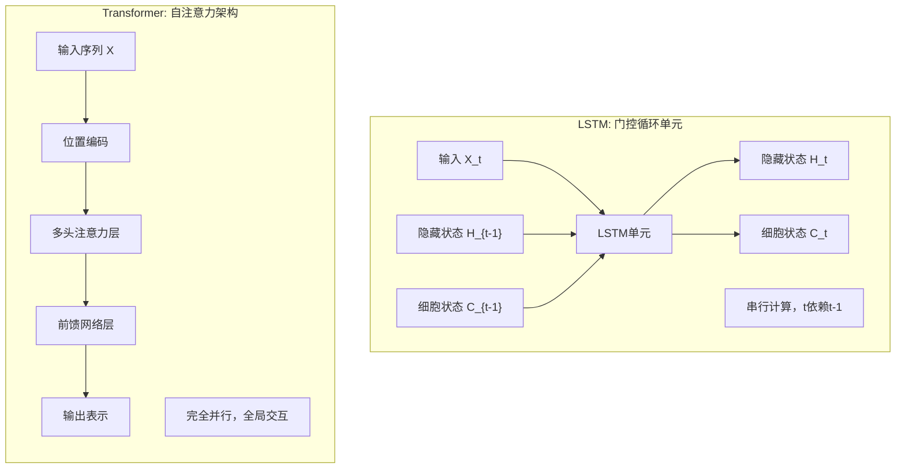

**【回答模板】**
Transformer相对于LSTM的主要优势体现在以下五个方面：

1. **并行计算能力**：
   - **LSTM限制**：必须按时间步顺序计算，第$t$步依赖第$t-1$步的结果，无法并行
   - **Transformer优势**：所有Token同时计算，通过矩阵乘法实现完全并行，极大提升训练速度
   - **硬件利用率**：充分利用GPU/TPU的大规模并行计算能力

2. **长距离依赖建模**：
   - **LSTM机制**：通过细胞状态传递长距离信息，但仍需经过多个时间步
   - **Transformer机制**：任意两个Token间直接交互，路径长度恒为1（$O(1)$距离）
   - **信息保真度**：Transformer能更精确地捕捉跨度极大的语义关联

3. **梯度流动稳定性**：
   - **LSTM改进**：通过门控机制缓解梯度消失，但未完全解决
   - **Transformer设计**：残差连接和层归一化确保梯度在深层网络中稳定传播
   - **训练深度**：Transformer可轻松训练数十甚至上百层，而LSTM通常限于几层

4. **信息表示能力**：
   - **LSTM表示**：隐藏状态是有损压缩，可能丢失细节信息
   - **Transformer表示**：自注意力建立Token间的显式关系，表示更丰富
   - **多头注意力**：多个注意力头从不同角度捕捉依赖关系

5. **扩展性和通用性**：
   - **模型规模**：Transformer更适合大规模预训练，可扩展到千亿参数
   - **多任务适应**：同一架构适用于编码器、解码器、编码器-解码器等多种配置
   - **多模态扩展**：不仅处理文本，还可扩展到图像、语音等多模态任务

**【深入理解】**
Transformer的优势源于其根本性的架构创新：将序列建模从"时间展开"转变为"空间关系"。这种转变带来了几个深远影响：

* **计算范式的改变**：从串行递归到并行矩阵运算，适应了现代硬件的发展趋势
* **归纳偏置的减少**：LSTM假设信息应沿时间轴顺序处理，而Transformer几乎无此假设
* **规模化效应**：Transformer的并行性使其能有效利用海量数据和计算资源

然而，这种优势也有代价：自注意力的$O(L^2)$复杂度在处理超长序列时成为瓶颈。相比之下，LSTM的$O(L)$复杂度在序列极长时可能更有优势，但实际中Transformer通过分块、稀疏化等技术已能有效处理数万甚至数十万长度的序列。

从历史角度看，Transformer的出现标志着深度学习从"循环时代"进入"注意力时代"，这一转变不仅提升了模型性能，更改变了整个研究范式和产业实践。

---

### 12. 解释什么是自回归模型与掩码语言模型有何区别？

#### 12.1 什么是自回归模型（Autoregressive Model）？
自回归模型是一种序列生成模型，其核心思想是：
- 当前时刻的输出依赖于之前时刻的所有输出
- 生成过程是**从左到右**的，一次生成一个Token
- 在预测第$t$个Token时，只能看到前$t-1$个Token

#### 12.2 自回归模型在Transformer中如何实现？
在Transformer解码器中，通过**因果掩码**（Causal Mask）实现自回归：
- 屏蔽掉当前位置之后的所有未来信息
- 每个位置的感受野被限制为"从序列开头到当前位置"（recall slice 1）
- 确保生成过程是严格自回归的

#### 12.3 什么是掩码语言模型（Masked Language Model）？
掩码语言模型是一种**双向**语言建模方法：
- 随机掩盖输入序列中的部分Token（如15%）
- 模型基于**所有可见的上下文**（包括左右两侧）预测被掩盖的Token
- 训练目标是重构被掩盖的原始Token

#### 12.4 掩码语言模型在Transformer中如何实现？
在Transformer编码器中，通过**双向注意力**实现掩码语言建模：
- 每个Token都能看到序列中的所有其他Token（除了被掩盖的）
- 使用特殊的[MASK]标记替换被掩盖的Token
- 模型学习基于完整上下文进行预测

#### 12.5 自回归模型和掩码语言模型在训练目标上有什么区别？
- **自回归模型**：最大化序列的似然概率 $P(x_1, x_2, ..., x_n) = \prod_{t=1}^n P(x_t | x_{<t})$
- **掩码语言模型**：最大化被掩盖Token的条件概率 $P(x_{\text{masked}} | x_{\text{unmasked}})$

#### 12.6 两种模型在信息访问权限上有什么不同？
- **自回归模型**：**单向**访问，只能看到过去信息，看不到未来信息
- **掩码语言模型**：**双向**访问，可以看到被掩盖Token左右两侧的所有信息
- 这种差异导致了完全不同的训练效率和表示能力

#### 12.7 两种模型分别适用于什么类型的任务？
- **自回归模型**：适合**生成式任务**，如文本生成、机器翻译、对话系统
- **掩码语言模型**：适合**理解式任务**，如文本分类、情感分析、命名实体识别
- 实际应用中，两种模型可以结合使用（如T5、BART）

#### 12.8 两种模型在训练效率上有什么差异？
- **自回归模型**：训练时需要串行计算，效率较低
- **掩码语言模型**：所有被掩盖的Token可以**同时预测**，训练效率高
- 掩码语言模型能更充分地利用并行计算能力

**标准答案：**

**【基本原理】**
自回归模型和掩码语言模型代表了两种根本不同的语言建模范式。自回归模型遵循人类语言生成的直觉——从左到右逐步生成；而掩码语言模型则采用更高效的训练策略——基于完整上下文预测缺失部分。

**示意图：两种模型的信息流动对比**
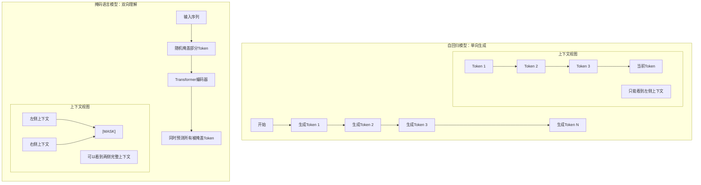

**【回答模板】**
自回归模型与掩码语言模型的主要区别体现在以下六个维度：

1. **信息访问方向**：
   - **自回归模型**：**单向**（只能看到过去，看不到未来）
   - **掩码语言模型**：**双向**（可以看到被掩盖Token左右两侧的所有信息）
   - **实现机制**：自回归通过因果掩码，掩码语言模型通过双向注意力

2. **训练目标函数**：
   - **自回归模型**：最大化序列的联合概率 $P(x_1, x_2, ..., x_n) = \prod_{t=1}^n P(x_t | x_{<t})$
   - **掩码语言模型**：最大化被掩盖Token的重构概率 $P(x_{\text{masked}} | x_{\text{unmasked}})$
   - **数学形式**：自回归是链式分解，掩码是条件概率

3. **模型架构位置**：
   - **自回归模型**：通常使用**Transformer解码器**架构
   - **掩码语言模型**：通常使用**Transformer编码器**架构
   - **代表模型**：GPT系列是自回归，BERT系列是掩码语言模型

4. **训练效率差异**：
   - **自回归模型**：需要串行计算，训练效率相对较低
   - **掩码语言模型**：所有被掩盖Token可同时预测，充分利用并行计算
   - **数据利用率**：掩码语言模型能更高效地利用训练数据

5. **适用任务类型**：
   - **自回归模型**：擅长**生成式任务**
     - 文本生成、故事创作
     - 机器翻译、对话系统
     - 代码生成、创意写作
   - **掩码语言模型**：擅长**理解式任务**
     - 文本分类、情感分析
     - 命名实体识别、关系抽取
     - 句子相似度、问答系统

6. **上下文表示能力**：
   - **自回归模型**：每个Token的表示只包含**左侧上下文**
   - **掩码语言模型**：每个Token的表示包含**完整双向上下文**
   - **表示质量**：掩码语言模型通常能学习到更丰富的语义表示

**【深入理解】**
这两种建模范式反映了对语言本质的不同理解：

* **自回归模型的哲学**：语言本质上是**时间序列**，理解语言就是理解其生成过程。这种建模方式与人类说话、写作的过程高度一致，但牺牲了训练效率。

* **掩码语言模型的哲学**：语言本质上是**结构关系**，理解语言就是理解词与词之间的相互依赖。这种建模方式更高效，但需要额外的技巧才能用于生成任务。

**实际应用中的融合趋势：**
现代大模型通常采用混合策略：
1. **预训练阶段**：使用掩码语言模型获得高质量的语言理解能力
2. **微调阶段**：针对生成任务调整为自回归模式
3. **统一架构**：如T5将所有任务都转化为文本到文本的格式
4. **前缀语言模型**：如UniLM结合了两种范式的优点

**关键洞察：**
- 自回归模型更适合**开放式生成**，因为其生成过程自然、可控
- 掩码语言模型更适合**语言理解**，因为能利用完整上下文信息
- 在实际应用中，选择哪种范式取决于具体任务需求和计算资源

从历史发展看，掩码语言模型（BERT）的出现曾一度超越自回归模型（GPT），但随后自回归模型通过规模化（GPT-3、GPT-4）重新占据优势。这反映了两种范式在不同发展阶段的不同价值，也提示我们：没有绝对优劣，只有适合与否。

---
### 13. 解释什么是“深而窄”与“浅而宽”模型的优劣权衡？ **[原35]**

#### 13.1 什么是"深而窄"与"浅而宽"模型的基本概念？
根据引用的内容，这是两种不同的Transformer架构参数分配策略：
- **深而窄(Deep and Narrow)**：指拥有更多层数(L)但每层隐藏单元较少(d较小)的模型架构（recall slice 2）
- **浅而宽(Shallow and Wide)**：指层数较少(L较小)但每层隐藏单元非常多(d很大)的模型架构（recall slice 2）
- **核心区别**：在总参数量固定的情况下，这两种架构代表了不同的参数分配策略

#### 13.2 在特征抽象能力方面，两种架构有何不同？
根据引用的内容，深度决定了模型的非线性变换次数：
- **深而窄优势**：深层模型能够学习到更高级别、更复杂的抽象逻辑（例如从字符到词汇，再到语法，最后到语义逻辑）（recall slice 1）
- **实验证据**：增加深度通常比增加宽度更能提升模型在复杂推理任务上的表现（recall slice 1）
- **逻辑抽象**：深度决定了模型的非线性变换次数，深层模型有更强的逻辑抽象能力

#### 13.3 在计算并行度方面，两种架构有何不同？
根据引用的内容，宽度和深度对计算效率的影响不同：
- **浅而宽优势**：宽度（隐藏层维度 $d$）的增加主要体现为更大规模的矩阵运算。现代 GPU 擅长处理大规模并行矩阵乘法，因此"宽"模型能更好地利用显卡吞吐量（recall slice 1）
- **深而窄劣势**：深层模型在计算上具有串行依赖性：必须先算完第 1 层才能算第 2 层。因此，过深的模型会增加推理延迟（Latency）（recall slice 1）

#### 13.4 在内存使用方面，这两种架构有何不同？
根据引用的内容，两种架构在内存占用方面有不同的权衡：
- **浅而宽的内存代价**：在推理阶段，KV Cache 的大小直接正比于隐藏层维度 $d$。增加宽度会导致显存占用急剧上升，限制了推理时的最大 Batch Size（recall slice 1）
- **深而窄的内存代价**：浅而宽模型在推理阶段的KV Cache大小直接正比于隐藏层维度d，宽度增加会导致显存占用急剧上升。深而窄模型虽然每层参数较少，但层数多会增加中间激活值的存储需求（recall slice 3）

#### 13.5 什么是"表征塌陷"和"有效秩"问题？
根据引用的内容，过深或过宽都会带来表征问题：
- **深而窄的风险**：过深的模型如果初始化不当，容易出现"表征塌陷"，即每一层的输出变得非常相似，导致深层变得冗余（recall slice 1）
- **浅而宽的风险**：而过宽的模型则可能出现各向异性问题，导致空间利用率不足（recall slice 1）

#### 13.6 根据缩放定律，深度和宽度应该如何平衡？
根据引用的内容，缩放定律提供了实证指导：
- **幂律分布**：OpenAI 和 Google 的研究发现，在总算力充足的情况下，深度和宽度的收益均遵循幂律分布（recall slice 1）
- **优化顺序**：通常建议先增加宽度到一定程度（如 4096 或 8192），再通过增加深度来获得更强的逻辑泛化能力（recall slice 1）

#### 13.7 工业界实际应用中，深度与宽度的"黄金比例"是什么？
根据引用的内容，主流大模型采用平衡方案：
- **主流配置**：目前主流大模型（如 Llama 3 70B）通常采用一种平衡方案：层数在 80 层左右，隐藏维度在 8192 左右（recall slice 1）
- **平衡优势**：这既保证了足够的逻辑抽象深度，又利用了宽矩阵带来的高效并行性（recall slice 1）

#### 13.8 分布式训练中，深度和宽度对通信有什么影响？
根据引用的内容，架构选择还受通信瓶颈制约：
- **宽度通信压力**：增加宽度会显著增加节点间需要同步的参数量（梯度通信压力大）（recall slice 1）
- **深度通信频率**：而增加深度则对通信频率要求更高（recall slice 1）
- **集群带宽制约**：因此，架构的选择往往还受到底层计算集群带宽的制约（recall slice 1）

**标准答案：**

**【基本原理】**
在设计 Transformer 架构时，给定总参数量预算，开发者需要决定如何分配这些参数：是堆叠更多的层数（增加深度 $L$），还是扩大隐藏层维度（增加宽度 $d$）。

* **深而窄 (Deep and Narrow)**：拥有更多的层数，但每层隐藏单元较少。
* **浅而宽 (Shallow and Wide)**：层数较少，但每层隐藏单元非常多。

**示意图：**
```mermaid
graph TD
    subgraph DeepNarrow [深而窄 (Deep & Narrow)]
        direction TB
        Layer100["Layer 100"]
        Layer99["..."]
        Layer1["Layer 1"]
        Layer100 --> Layer99 --> Layer1
        Note1["(更强的逻辑抽象能力)"]
    end
    
    subgraph ShallowWide [浅而宽 (Shallow & Wide)]
        direction TB
        Layer12["Layer 12"]
        HugeHidden["[ Huge Hidden Dim ]"]
        Layer1_2["Layer 1"]
        Layer12 --> HugeHidden --> Layer1_2
        Note2["(更强的特征并行处理能力)"]
    end
```

**【回答模板】**
"深"与"宽"的权衡主要体现在特征表达深度、计算效率与内存占用三个方面：

1. **特征抽象能力（深度优势）**：
   - **非线性变换次数**：深度决定了模型的非线性变换次数。深层模型能够学习到更高级别、更复杂的抽象逻辑（例如从字符到词汇，再到语法，最后到语义逻辑）。
   - **推理任务表现**：实验表明，增加深度通常比增加宽度更能提升模型在复杂推理任务上的表现。
   - **逻辑泛化能力**：深层模型通过多级抽象，能够更好地捕捉复杂的逻辑关系和长距离依赖。

2. **计算并行度（宽度优势）**：
   - **矩阵运算规模**：宽度（隐藏层维度 $d$）的增加主要体现为更大规模的矩阵运算。现代 GPU 擅长处理大规模并行矩阵乘法，因此"宽"模型能更好地利用显卡吞吐量。
   - **串行依赖问题**：深层模型在计算上具有串行依赖性：必须先算完第 1 层才能算第 2 层。因此，过深的模型会增加推理延迟（Latency）。
   - **训练效率**：宽模型在训练时能更充分地利用并行计算资源，提升训练速度。

3. **内存与 KV Cache（宽度代价）**：
   - **显存占用**：在推理阶段，KV Cache 的大小直接正比于隐藏层维度 $d$。增加宽度会导致显存占用急剧上升，限制了推理时的最大 Batch Size。
   - **激活值存储**：深而窄模型虽然每层参数较少，但层数多会增加中间激活值的存储需求。
   - **内存带宽**：宽模型需要更大的内存带宽来传输参数和激活值，可能成为性能瓶颈。

**【深入理解】**
1. **有效秩（Effective Rank）与表征塌陷**：
   - **深模型风险**：过深的模型如果初始化不当，容易出现"表征塌陷"，即每一层的输出变得非常相似，导致深层变得冗余。
   - **宽模型风险**：而过宽的模型则可能出现各向异性问题，导致空间利用率不足。

2. **Scaling Laws（缩放定律）的实证**：
   - **幂律分布**：OpenAI 和 Google 的研究发现，在总算力充足的情况下，深度和宽度的收益均遵循幂律分布。
   - **优化策略**：通常建议先增加宽度到一定程度（如 4096 或 8192），再通过增加深度来获得更强的逻辑泛化能力。

3. **工业界的"黄金比例"**：
   - **主流配置**：目前主流大模型（如 Llama 3 70B）通常采用一种平衡方案：层数在 80 层左右，隐藏维度在 8192 左右。
   - **平衡优势**：这既保证了足够的逻辑抽象深度，又利用了宽矩阵带来的高效并行性。

4. **通信瓶颈**：
   - **分布式训练**：在分布式训练中，增加宽度会显著增加节点间需要同步的参数量（梯度通信压力大），而增加深度则对通信频率要求更高。
   - **带宽制约**：因此，架构的选择往往还受到底层计算集群带宽的制约。

**总结**：深而窄模型更适合需要复杂逻辑推理的任务，但计算效率较低；浅而宽模型更适合需要高效并行计算的任务，但内存占用较大。实际应用中需要根据具体任务需求、硬件资源和推理延迟要求来选择合适的架构平衡点。

---

### 14. 解释不同LLM架构的类型，以及哪种架构最适合哪些任务？

#### 14.1 LLM架构的主要类型有哪些？
基于Transformer的LLM架构主要可以分为以下几种类型：
- **仅编码器架构**：如BERT、RoBERTa，专注于理解任务
- **仅解码器架构**：如GPT系列、Llama系列，专注于生成任务  
- **编码器-解码器架构**：如T5、BART、FLAN-T5，适合序列到序列任务
- **混合架构**：结合不同架构特点的变体

#### 14.2 仅编码器架构的特点和适用任务是什么？
仅编码器架构的核心特点：
- **双向注意力**：每个Token都能看到序列中的所有其他Token
- **预训练目标**：通常使用掩码语言建模（MLM）或句子对预测
- **优势**：能学习丰富的上下文表示，适合理解类任务
- **适用任务**：文本分类、情感分析、命名实体识别、问答系统

#### 14.3 仅解码器架构的特点和适用任务是什么？
仅解码器架构的核心特点：
- **因果注意力**：使用因果掩码，只能看到当前位置之前的Token
- **预训练目标**：通常使用自回归语言建模（从左到右预测）
- **优势**：自然支持文本生成，生成过程可控
- **适用任务**：文本生成、对话系统、代码生成、创意写作

#### 14.4 编码器-解码器架构的特点和适用任务是什么？
编码器-解码器架构的核心特点：
- **双向编码器**：编码器使用双向注意力理解输入
- **因果解码器**：解码器使用因果注意力生成输出
- **交叉注意力**：解码器通过交叉注意力关注编码器输出
- **适用任务**：机器翻译、文本摘要、文本改写、问答生成

#### 14.5 不同架构在参数效率方面有何差异？
- **仅编码器**：参数效率高，但需要任务特定头部
- **仅解码器**：参数效率中等，但零样本能力强
- **编码器-解码器**：参数最多，但任务适应性最广

#### 14.6 不同架构在训练效率方面有何差异？
- **仅编码器**：训练效率最高，所有Token可并行处理
- **仅解码器**：训练效率中等，需要因果掩码
- **编码器-解码器**：训练效率较低，需要处理两个序列

#### 14.7 不同架构在推理效率方面有何差异？
- **仅编码器**：推理效率高，一次前向传播
- **仅解码器**：推理效率低，需要自回归生成
- **编码器-解码器**：推理效率中等，编码一次，解码逐步

#### 14.8 现代大模型架构的发展趋势是什么？
- **统一架构**：如T5将所有任务转化为文本到文本格式
- **前缀语言模型**：如UniLM结合双向和单向注意力
- **稀疏注意力**：如Longformer、BigBird处理长序列
- **状态空间模型**：如Mamba提供线性复杂度替代方案

**标准答案：**

**【基本原理】**
大型语言模型（LLM）的架构选择直接影响模型的能力特性、训练效率和适用场景。基于Transformer的不同变体架构，各自针对特定类型的任务进行了优化。

**示意图：三种主要LLM架构对比**
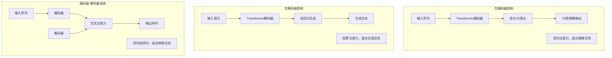

**【回答模板】**
不同LLM架构的类型及其适用任务：

1. **仅编码器架构（Encoder-Only）**
   - **代表模型**：BERT、RoBERTa、DeBERTa、ALBERT
   - **架构特点**：
     - 使用**双向自注意力**，每个Token能看到整个序列
     - 预训练目标：掩码语言建模（MLM）、下一句预测（NSP）
     - 通常需要任务特定的分类头或回归头
   - **核心优势**：
     - 强大的上下文理解能力
     - 训练效率高，所有Token可并行处理
     - 参数效率较高
   - **最适合任务**：
     - **文本分类**：情感分析、主题分类、垃圾邮件检测
     - **信息抽取**：命名实体识别、关系抽取、事件检测
     - **语义理解**：句子相似度、自然语言推理、问答系统
     - **文本匹配**：信息检索、语义搜索、文档排序

2. **仅解码器架构（Decoder-Only）**
   - **代表模型**：GPT系列、Llama系列、OPT、BLOOM
   - **架构特点**：
     - 使用**因果自注意力**，只能看到当前位置之前的Token
     - 预训练目标：自回归语言建模（从左到右预测）
     - 纯生成式架构，不需要任务特定头部
   - **核心优势**：
     - 自然的文本生成能力
     - 强大的零样本和少样本学习能力
     - 生成过程可控，适合创意任务
   - **最适合任务**：
     - **文本生成**：故事创作、诗歌生成、代码生成
     - **对话系统**：聊天机器人、虚拟助手、客服系统
     - **内容创作**：文章写作、营销文案、创意写作
     - **指令跟随**：任务规划、步骤分解、问题解答

3. **编码器-解码器架构（Encoder-Decoder）**
   - **代表模型**：T5、BART、FLAN-T5、mT5
   - **架构特点**：
     - 编码器使用双向注意力理解输入
     - 解码器使用因果注意力生成输出
     - 通过交叉注意力连接编码器和解码器
   - **核心优势**：
     - 强大的序列到序列转换能力
     - 任务适应性最广，统一文本到文本格式
     - 能处理输入输出长度不匹配的任务
   - **最适合任务**：
     - **文本转换**：机器翻译、文本摘要、文本改写
     - **内容生成**：问答生成、表格到文本、数据到文本
     - **任务统一**：多任务学习、指令微调、提示工程
     - **条件生成**：基于条件的文本生成、风格迁移

**【深入理解】**
1. **架构选择的权衡因素**：
   - **任务类型**：理解 vs 生成 vs 转换
   - **数据可用性**：有监督 vs 无监督 vs 少样本
   - **计算资源**：训练成本 vs 推理延迟
   - **部署需求**：实时性 vs 准确性 vs 内存限制

2. **现代架构发展趋势**：
   - **统一范式**：T5开创的"文本到文本"统一框架
   - **前缀语言模型**：UniLM等结合双向和单向注意力
   - **稀疏注意力**：处理长文档的优化架构
   - **混合专家**：MoE架构提升模型容量和效率

3. **实际应用建议**：
   - **企业应用**：BERT类模型适合分类、搜索等理解任务
   - **创意应用**：GPT类模型适合生成、对话等创意任务
   - **多语言应用**：T5类模型适合翻译、摘要等多语言任务
   - **研究探索**：根据具体研究问题选择合适的基准架构

**总结**：选择LLM架构时需要综合考虑任务需求、数据特性、计算资源和部署环境。仅编码器架构在理解任务上表现优异，仅解码器架构在生成任务上独具优势，而编码器-解码器架构在转换任务上最为灵活。随着技术的发展，架构边界逐渐模糊，统一的多任务架构成为新的趋势。

---

### 15. 比较状态空间模型（如Mamba）与Transformer。各自的权衡及适用场景是什么？

#### 15.1 什么是状态空间模型（SSM）？
状态空间模型是一种新的序列建模架构，代表模型是Mamba：
- **数学基础**：基于连续时间系统，通过状态方程和观测方程建模序列
- **核心思想**：将序列处理视为动态系统的状态演化
- **创新点**：选择性状态空间模型，能根据输入动态调整参数

#### 15.2 Transformer的核心优势是什么？
Transformer的主要优势包括：
- **自注意力机制**：全局感受野，任意位置间直接交互
- **并行计算**：训练时完全并行，充分利用现代硬件
- **表示能力**：多头注意力提供丰富的特征表示
- **可扩展性**：适合大规模预训练和参数扩展

#### 15.3 Mamba相比Transformer在计算复杂度上有何优势？
Mamba的核心优势是**线性复杂度**：
- **Transformer复杂度**：$O(L^2)$，序列长度平方级增长
- **Mamba复杂度**：$O(L)$，序列长度线性增长
- **实际影响**：能处理更长的序列，显存占用更低

#### 15.4 Transformer在哪些方面优于Mamba？
Transformer的优势领域：
- **全局上下文**：自注意力能直接建立任意两个位置的联系
- **训练并行性**：所有Token同时计算，训练效率高
- **成熟生态**：丰富的预训练模型、工具和优化技术
- **多模态扩展**：已成功扩展到图像、音频等多模态任务

#### 15.5 Mamba的创新机制是什么？
Mamba的关键创新：
- **选择性机制**：状态转移矩阵和投影矩阵根据输入动态计算
- **硬件感知设计**：通过并行扫描算法实现高效并行计算
- **简化架构**：去除了注意力机制，使用SSM块替代

#### 15.6 两种架构在长序列处理能力上有何差异？
- **Transformer限制**：$O(L^2)$复杂度限制了处理超长序列的能力
- **Mamba优势**：$O(L)$复杂度使其能高效处理数十万甚至百万长度的序列
- **实际测试**：Mamba在长文档理解、基因组序列等任务上表现优异

#### 15.7 两种架构在训练和推理效率上有何不同？
- **训练效率**：Transformer训练并行度高，但显存占用大；Mamba训练稍慢，但显存占用小
- **推理效率**：Transformer推理延迟高（自回归生成）；Mamba推理延迟低（线性复杂度）
- **内存需求**：Transformer需要存储KV Cache；Mamba状态空间表示更紧凑

#### 15.8 两种架构分别适合什么类型的任务？
- **Transformer适合**：需要强上下文理解、多模态融合、已有丰富预训练资源的任务
- **Mamba适合**：超长序列处理、实时推理、内存受限、序列长度变化大的任务

**标准答案：**

**【基本原理】**
状态空间模型（SSM，如Mamba）和Transformer代表了序列建模的两种不同范式。Transformer基于自注意力机制实现全局交互，而Mamba基于状态空间方程实现线性复杂度序列处理。

**示意图：Transformer vs Mamba 架构对比**
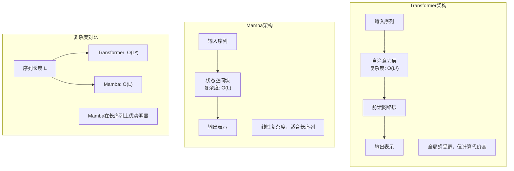

**【回答模板】**
状态空间模型（Mamba）与Transformer的比较及适用场景：

1. **计算复杂度与序列长度处理**
   - **Transformer**：
     - 复杂度：$O(L^2)$，序列长度平方级增长
     - 限制：处理超长序列（>100k）时显存和计算成本急剧上升
     - 优化：需要稀疏注意力、分块等技巧来缓解
   - **Mamba**：
     - 复杂度：$O(L)$，序列长度线性增长
     - 优势：能高效处理数十万甚至百万长度的序列
     - 实际：在长文档、基因组、音频等长序列任务上表现优异

2. **架构机制与表示能力**
   - **Transformer机制**：
     - **自注意力**：全局感受野，任意位置间直接交互
     - **多头注意力**：从多个角度捕捉依赖关系
     - **位置编码**：显式编码位置信息（如RoPE、ALiBi）
   - **Mamba机制**：
     - **状态空间方程**：$h'(t) = A h(t) + B x(t)$, $y(t) = C h(t) + D x(t)$
     - **选择性机制**：$A, B, C, D$矩阵根据输入动态计算
     - **隐式位置**：通过状态演化自然编码序列顺序

3. **训练与推理效率**
   - **训练阶段**：
     - **Transformer**：完全并行，训练速度快，但显存占用大
     - **Mamba**：需要扫描操作，训练稍慢，但显存占用小
     - **硬件利用**：Transformer更适合现代GPU的大规模并行
   - **推理阶段**：
     - **Transformer**：自回归生成导致高延迟，需要KV Cache
     - **Mamba**：线性复杂度，推理延迟低，状态表示紧凑
     - **内存需求**：Transformer的KV Cache随序列增长而增长

4. **上下文建模能力**
   - **全局上下文**：
     - **Transformer优势**：自注意力能直接建立任意两个位置的关联
     - **Mamba限制**：通过状态传递信息，远距离关联可能衰减
     - **实际表现**：在需要强全局推理的任务上，Transformer通常更优
   - **局部模式**：
     - **Mamba优势**：状态空间能有效捕捉局部依赖和时序模式
     - **适用任务**：时间序列预测、信号处理、基因组分析

5. **成熟度与生态系统**
   - **Transformer成熟度**：
     - **丰富生态**：HuggingFace、PyTorch、TensorFlow全面支持
     - **预训练模型**：数千个开源模型可供选择
     - **优化技术**：FlashAttention、量化、蒸馏等成熟方案
   - **Mamba发展阶段**：
     - **新兴技术**：2023年底提出，生态正在建设中
     - **模型选择**：预训练模型相对较少
     - **工具支持**：逐步完善中，但不如Transformer成熟

**【适用场景分析】**
1. **Transformer最适合的场景**：
   - **需要强上下文理解**：复杂推理、逻辑分析、多跳问答
   - **多模态任务**：视觉语言模型、音频文本对齐
   - **成熟应用**：已有丰富预训练资源和优化方案的任务
   - **资源充足**：计算资源丰富，不特别关注推理延迟

2. **Mamba最适合的场景**：
   - **超长序列处理**：长文档理解、基因组序列分析、长音频处理
   - **实时推理**：低延迟要求的应用，如实时翻译、对话系统
   - **内存受限**：移动设备、边缘计算等资源受限环境
   - **序列长度变化大**：输入长度动态变化的应用

3. **混合架构趋势**：
   - **注意力+SSM**：结合两者优势，如注意力处理局部，SSM处理全局
   - **分层处理**：浅层用SSM减少计算，深层用注意力提升表示
   - **任务自适应**：根据任务特性动态选择架构组件

**【深入理解】**
1. **根本差异**：
   - Transformer基于**显式关系建模**，通过注意力矩阵直接建立Token间联系
   - Mamba基于**隐式状态演化**，通过微分方程连续建模序列动态

2. **未来发展方向**：
   - **Transformer优化**：继续降低$O(L^2)$复杂度，提升长序列处理能力
   - **Mamba扩展**：提升全局建模能力，扩展到多模态任务
   - **架构融合**：探索更高效的混合架构，结合两者优势

3. **选择建议**：
   - **研究探索**：Mamba适合探索长序列、高效率的新应用
   - **生产部署**：Transformer在成熟任务上风险更低
   - **特定领域**：根据序列长度、推理延迟、资源约束选择

**总结**：Transformer和Mamba代表了序列建模的两种不同哲学。Transformer以计算代价换取强大的表示能力，适合资源充足、需要强推理的任务；Mamba以线性复杂度换取高效性，适合长序列、实时推理、资源受限的场景。随着技术的发展，两者可能相互借鉴融合，形成更强大的下一代序列建模架构。

---

## **第 2 章：注意力机制变体 (16-40)**

### 16. Self-attention 的 $Q, K, V$ 矩阵分别 represent 什么？


#### 16.1 自注意力机制的根本目的是什么？
在处理一个句子时，模型需要知道每个词与其他词的相关程度。例如，在“The cat sat on the mat”中，“sat”这个动作主要和谁相关？是“cat”还是“mat”？自注意力就是要量化这种内部依赖关系。

#### 16.2 为什么不能直接用原始词向量来计算这种相关性？
如果直接用原始向量做点积，我们只有一个固定的表示，它既要用来“提问”（我想关注什么特征？），又要用来“回答”（我有什么特征？），还要承载“实际信息”（我的语义是什么？）。这就像让一个人同时扮演侦探、嫌疑人和证据，角色混淆，效率低下。

#### 16.3 如果要让一个词去“查询”其他词，它需要发出什么样的信号？
这个词需要一个专门的“查询向量”（Query），它编码了当前词在特定上下文中的“兴趣点”。比如，“bank”在“I went to the bank to deposit money”中，它的Query会偏向“金融”属性；而在“I sat by the river bank”中，它的Query会偏向“地理”属性。

#### 16.4 其他词如何响应这个“查询”？
每个被查询的词都有一个“键向量”（Key），它就像是这个词贴在外面的“标签”或“名片”，上面写着“我有哪些特征”。Query会和所有的Key进行匹配，计算相似度。

#### 16.5 匹配之后，我们最终想得到什么？
我们不是只想知道“有多相关”，而是想把相关词的**实际信息**拿过来。这个“实际信息”就由“值向量”（Value）承载。最后的输出，就是所有Value根据其相关性（Query-Key匹配得分）加权平均的结果。

现在，让我们看看标准答案是如何精炼地概括这一切的：

**【基本原理】**
自注意力机制的本质是计算序列内部各元素之间的关联强度。为了实现这种灵活的建模，输入向量通过三个权重矩阵 $W^Q, W^K, W^V$ 进行线性映射，从而在不同维度上提取特征。

**示意图：**
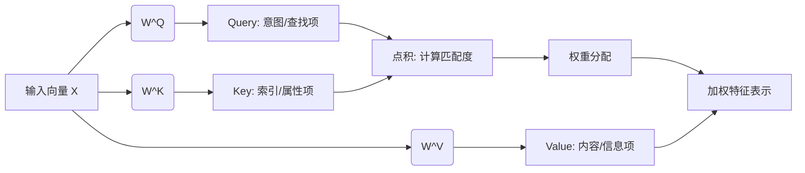

**【回答模板】**
*   **Query (查询 $Q$)**：代表当前词作为“搜索者”时发出的请求。它指明了当前词在关注其他词时，希望寻找什么样的特征。
*   **Key (键 $K$)**：代表当前词作为“被搜索者”时表现出的特征。它用于与所有 $Q$ 进行匹配，决定当前词应该被赋予多少权重。
*   **Value (值 $V$)**：代表当前词承载的实际语义信息。一旦权重分配完成，最终的输出就是这些 $V$ 的线性加权组合。

**【深入理解】**
这种设计引入了“软寻址”机制。相比于传统的循环神经网络（RNN）被动地接受前序信息，Self-attention 允许模型主动根据 $Q$ 与 $K$ 的相关性（相似度），从全局 $V$ 中提取信息。$Q$ 和 $K$ 决定了“去哪里看”，而 $V$ 决定了“看到了什么”。

---

### 17. **[代码]** 实现一个标准的 Scaled Dot-Product Attention。 **[原2]**

#### 17.1 Scaled Dot-Product Attention的核心计算公式是什么？
根据引用的内容，核心计算公式包含四个关键步骤：
- **完整公式**：$\text{Attention}(Q, K, V) = \text{softmax}(\frac{QK^T}{\sqrt{d_k}})V$（recall slice 5）
- **关键步骤**：这个公式包含了四个关键步骤：计算相似度、缩放、归一化、加权求和（recall slice 5）

#### 17.2 计算$QK^T$的目的是什么？
根据引用的内容，$QK^T$计算的是相似度得分：
- **相似度计算**：计算$QK^T$得到相似度得分矩阵（recall slice 4）
- **矩阵形状**：$Q$矩阵形状为$[L, d_k]$，$K^T$矩阵形状为$[d_k, L]$，相乘得到$[L, L]$的得分矩阵（recall slice 4）

#### 17.3 为什么需要除以$\sqrt{d_k}$进行缩放？
根据引用的内容，缩放是为了防止梯度消失：
- **缩放目的**：Scale ($1/\sqrt{d_k}$) --> Prevent Gradient Vanishing（recall slice 4）
- **数学原因**：当$d_k$较大时，点积结果可能非常大，导致Softmax梯度消失（recall slice 4）

#### 17.4 掩码(Mask)在什么情况下需要应用？
根据引用的内容，掩码用于屏蔽无效位置：
- **掩码应用**：Mask (Optional) --> Set invalid positions to -inf（recall slice 4）
- **应用场景**：在处理变长序列或生成任务时，我们必须屏蔽Padding字符或未来信息（recall slice 4）
- **实现方式**：将这些位置设为-1e9（负无穷），可以确保在Softmax之后它们的权重几乎为0（recall slice 4）

#### 17.5 Softmax的作用是什么？
根据引用的内容，Softmax将得分转换为注意力权重：
- **归一化**：Softmax --> Attention Weights [0, 1]（recall slice 4）
- **概率分布**：将相似度得分转换为概率分布，总和为1（recall slice 4）

#### 17.6 最后的矩阵乘法完成了什么操作？
根据引用的内容，最后的@ $V$操作完成了信息聚合：
- **信息聚合**：最后的@ $V$操作完成了真正的信息聚合（recall slice 4）
- **加权求和**：权重对Value加权求和（recall slice 4）
- **输出形状**：结果矩阵形状为$[L, d_v]$（recall slice 4）

#### 17.7 代码实现中需要注意哪些关键点？
根据引用的内容，代码实现需要注意维度处理和掩码应用：
- **维度获取**：需要获取特征维度$d_k$（recall slice 4）
- **转置操作**：需要对$K$进行转置以计算点积（recall slice 4）
- **掩码填充**：使用masked_fill将掩码位置设为负无穷（recall slice 4）

#### 17.8 为什么说masked_fill操作至关重要？
根据引用的内容，masked_fill确保排除无效信息干扰：
- **重要性**：代码中的masked_fill操作至关重要（recall slice 4）
- **作用机制**：将这些位置设为-1e9（负无穷），可以确保在Softmax之后它们的权重几乎为0（recall slice 4）
- **实际效果**：从而排除无效信息的干扰（recall slice 4）

**标准答案：**

**【基本原理】**
其核心运算逻辑遵循公式：$\text{Attention}(Q, K, V) = \text{softmax}\left(\frac{QK^T}{\sqrt{d_k}}\right)V$。运算过程包括矩阵乘法、缩放、掩码应用、归一化以及最后的语义聚合。

示意图：
```
Q Matrix: [L, d_k]   K^T Matrix: [d_k, L]
      \               /
       \             /
        Matmul(Q, K^T) --> Scores Matrix: [L, L]
                |
        Scale (1/√d_k) --> Prevent Gradient Vanishing
                |
        Mask (Optional) --> Set invalid positions to -inf
                |
        Softmax --> Attention Weights [0, 1]
               |      /
        Matmul(W, V) <--- V Matrix: [L, d_v]
                |
        Result Matrix: [L, d_v]
```

**【回答模板】**
```python
import torch
import torch.nn.functional as F
import math

def scaled_dot_product_attention(query, key, value, mask=None):
    # 获取特征维度 d_k
    d_k = query.size(-1)
    
    # 1. 计算 QK^T 并进行缩放 (Scaling)
    # scores 形状: [batch_size, n_heads, seq_len, seq_len]
    scores = torch.matmul(query, key.transpose(-2, -1)) / math.sqrt(d_k)
    
    # 2. 应用掩码 (Masking)，常见于 Transformer 的 Decoder
    if mask is not None:
        scores = scores.masked_fill(mask == 0, -1e9)
    
    # 3. Softmax 得到注意力权重 p_attn
    p_attn = F.softmax(scores, dim=-1)
    
    # 4. 权重对 Value 加权求和
    return torch.matmul(p_attn, value), p_attn
```

**【深入理解】**
代码中的masked_fill操作至关重要。在处理变长序列或生成任务时，我们必须屏蔽Padding字符或未来信息。将这些位置设为-1e9（负无穷），可以确保在Softmax之后它们的权重几乎为0，从而排除无效信息的干扰。

1. **函数参数说明**：
   - **query**：查询矩阵，形状为$[batch\_size, n\_heads, seq\_len, d_k]$
   - **key**：键矩阵，形状为$[batch\_size, n\_heads, seq\_len, d_k]$
   - **value**：值矩阵，形状为$[batch\_size, n\_heads, seq\_len, d_v]$
   - **mask**：掩码矩阵，形状为$[batch\_size, 1, seq\_len, seq\_len]$或$[seq\_len, seq\_len]$

2. **计算步骤详解**：
   - **步骤1**：计算$QK^T$并除以$\sqrt{d_k}$，防止梯度消失
   - **步骤2**：应用掩码，将无效位置设为负无穷
   - **步骤3**：Softmax归一化，得到注意力权重
   - **步骤4**：注意力权重与$V$相乘，得到加权输出

3. **返回结果**：
   - **第一个返回值**：注意力加权后的输出，形状为$[batch\_size, n\_heads, seq\_len, d_v]$
   - **第二个返回值**：注意力权重矩阵，形状为$[batch\_size, n\_heads, seq\_len, seq\_len]$

4. **实际应用注意事项**：
   - **批量处理**：支持批量输入，提高计算效率
   - **多头注意力**：与多头注意力机制配合使用
   - **梯度稳定性**：缩放操作确保训练稳定性
   - **内存效率**：注意矩阵乘法的内存占用

---

### 18. 为什么 $QK^T$ 需要除以 $\sqrt{d}$？请从方差偏移的角度解释。 **[原3]**

#### 18.1 $QK^T$计算的是什么？为什么需要关注它的数值范围？
根据引用的内容，$QK^T$计算的是相似度得分：
- **计算目的**：计算$QK^T$得到相似度得分矩阵（recall slice 4）
- **数值问题**：当$d_k$较大时，点积结果可能非常大（recall slice 4）
- **影响后果**：可能导致Softmax梯度消失（recall slice 4）

#### 18.2 什么是方差偏移(Variance Shift)问题？
方差偏移是指当输入数据的方差发生变化时，对后续计算产生的不利影响：
- **基本概念**：在深度学习中，层间激活值的方差如果发生剧烈变化，会导致训练不稳定
- **具体表现**：如果$QK^T$的方差过大，Softmax的输出会趋近于one-hot分布，梯度消失
- **根本原因**：点积操作会放大方差，特别是当维度$d_k$较大时

#### 18.3 假设$Q$和$K$的每个元素独立同分布，它们的方差是多少？
假设$Q$和$K$的元素服从均值为0，方差为1的分布：
- **基本假设**：$q_i \sim \mathcal{N}(0, 1)$，$k_i \sim \mathcal{N}(0, 1)$
- **独立性**：$Q$和$K$的每个元素相互独立
- **点积性质**：$Q \cdot K = \sum_{i=1}^{d_k} q_i k_i$

#### 18.4 $QK^T$的期望和方差是多少？
根据概率统计理论：
- **期望**：$\mathbb{E}[QK^T] = \mathbb{E}[\sum_{i=1}^{d_k} q_i k_i] = \sum_{i=1}^{d_k} \mathbb{E}[q_i]\mathbb{E}[k_i] = 0$
- **方差**：$\text{Var}(QK^T) = \text{Var}(\sum_{i=1}^{d_k} q_i k_i) = \sum_{i=1}^{d_k} \text{Var}(q_i k_i)$
- **由于独立性**：$\text{Var}(q_i k_i) = \mathbb{E}[q_i^2]\mathbb{E}[k_i^2] - (\mathbb{E}[q_i]\mathbb{E}[k_i])^2 = 1 \times 1 - 0 = 1$
- **最终方差**：$\text{Var}(QK^T) = d_k$

#### 18.5 为什么方差等于$d_k$会导致问题？
方差随维度线性增长会带来严重问题：
- **数值过大**：当$d_k=512$时，方差为512，标准差约为22.6
- **Softmax饱和**：如此大的数值会使Softmax输出趋近于极端值（0或1）
- **梯度消失**：当Softmax输出接近one-hot时，梯度会变得非常小

#### 18.6 除以$\sqrt{d_k}$如何解决方差问题？
缩放因子起到方差归一化的作用：
- **缩放操作**：$\frac{QK^T}{\sqrt{d_k}}$
- **缩放后方差**：$\text{Var}\left(\frac{QK^T}{\sqrt{d_k}}\right) = \frac{1}{d_k} \times \text{Var}(QK^T) = \frac{1}{d_k} \times d_k = 1$
- **效果**：将方差稳定在1，与维度$d_k$无关

#### 18.7 从Softmax函数的角度看，为什么需要稳定方差？
Softmax函数对输入尺度敏感：
- **Softmax公式**：$\text{softmax}(z_i) = \frac{e^{z_i}}{\sum_{j} e^{z_j}}$
- **尺度效应**：如果所有$z_i$都乘以常数$c$，当$c \to \infty$时，Softmax趋近于argmax
- **梯度计算**：$\frac{\partial \text{softmax}(z_i)}{\partial z_j} = \text{softmax}(z_i)(\delta_{ij} - \text{softmax}(z_j))$
- **梯度消失**：当Softmax输出趋近于0或1时，梯度趋近于0

#### 18.8 实际应用中，除以$\sqrt{d_k}$带来了哪些好处？
缩放操作的实际益处：
- **训练稳定性**：防止梯度消失，加速收敛
- **数值稳定性**：避免数值溢出或下溢
- **模型性能**：确保注意力权重的合理分布
- **泛化能力**：提高模型在不同任务上的表现

**标准答案：**

**【基本原理】**
$QK^T$需要除以$\sqrt{d_k}$的根本原因是为了控制点积结果的方差，防止Softmax函数饱和导致梯度消失。从统计学角度，这是一个方差归一化操作。

**示意图：缩放前后的方差变化**
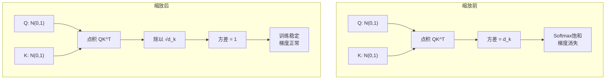

**【回答模板】**
$QK^T$需要除以$\sqrt{d_k}$的核心数学原理：

1. **基本假设**：
   - 假设$Q$和$K$的每个元素独立且服从标准正态分布：$q_i, k_i \sim \mathcal{N}(0, 1)$
   - $Q$和$K$的维度为$d_k$

2. **点积的统计特性**：
   - 点积：$s = Q \cdot K = \sum_{i=1}^{d_k} q_i k_i$
   - 期望：$\mathbb{E}[s] = \sum_{i=1}^{d_k} \mathbb{E}[q_i]\mathbb{E}[k_i] = 0$
   - 方差：$\text{Var}(s) = \sum_{i=1}^{d_k} \text{Var}(q_i k_i) = \sum_{i=1}^{d_k} (\mathbb{E}[q_i^2]\mathbb{E}[k_i^2] - \mathbb{E}[q_i]^2\mathbb{E}[k_i]^2)$
   - 由于$\mathbb{E}[q_i^2] = \text{Var}(q_i) + \mathbb{E}[q_i]^2 = 1 + 0 = 1$，同理$\mathbb{E}[k_i^2] = 1$
   - 因此：$\text{Var}(s) = \sum_{i=1}^{d_k} (1 \times 1 - 0) = d_k$

3. **方差偏移问题**：
   - 当$d_k$较大时（如512、1024），方差$d_k$会变得非常大
   - 大方差意味着点积结果$s$的绝对值可能很大
   - 输入Softmax的大数值会导致输出趋近于one-hot分布

4. **Softmax的尺度敏感性**：
   - Softmax函数：$\text{softmax}(z_i) = \frac{e^{z_i}}{\sum_{j} e^{z_j}}$
   - 如果所有$z_i$都乘以常数$c$，当$c \to \infty$时，最大值的概率趋近于1，其他趋近于0
   - 这会导致梯度消失：$\frac{\partial \text{softmax}(z_i)}{\partial z_j} = \text{softmax}(z_i)(\delta_{ij} - \text{softmax}(z_j))$

5. **缩放解决方案**：
   - 将点积除以$\sqrt{d_k}$：$s' = \frac{s}{\sqrt{d_k}}$
   - 缩放后的方差：$\text{Var}(s') = \text{Var}\left(\frac{s}{\sqrt{d_k}}\right) = \frac{1}{d_k} \times \text{Var}(s) = \frac{1}{d_k} \times d_k = 1$
   - 这样，无论$d_k$多大，点积结果的方差都稳定在1

**【深入理解】**
1. **数学证明的严谨性**：
   - 上述推导基于$Q$和$K$元素独立且服从$\mathcal{N}(0,1)$的假设
   - 实际中，经过LayerNorm后，激活值近似满足均值为0、方差为1
   - 因此这个缩放因子在实际应用中非常有效

2. **与其他归一化技术的比较**：
   - **LayerNorm**：在特征维度上归一化，稳定层间激活
   - **除以$\sqrt{d_k}$**：在注意力得分上归一化，稳定Softmax输入
   - 两者协同工作，共同确保训练稳定性

3. **实际影响**：
   - **训练速度**：避免梯度消失，加速收敛
   - **模型性能**：确保注意力权重的合理分布，提高表达能力
   - **数值稳定性**：防止数值溢出，特别是在半精度训练时

4. **扩展思考**：
   - 为什么是$\sqrt{d_k}$而不是$d_k$？因为标准差是方差的平方根
   - 这个缩放因子是经验值还是理论推导？原始Transformer论文中给出了理论推导
   - 是否所有注意力机制都需要这个缩放？是的，这是标准做法

**总结**：除以$\sqrt{d_k}$是一个精妙的方差归一化操作，它将点积结果的方差稳定在1，无论隐藏维度$d_k$多大。这确保了Softmax函数的输入在合理的数值范围内，防止梯度消失，是Transformer训练稳定性的关键因素之一。

---
### 19. 解释LLM中的注意力机制及其实现方式。

#### 19.1 LLM中的注意力机制基本概念是什么？
根据引用的内容，注意力机制是Transformer架构的核心组件，它允许模型在处理序列数据时，为不同的输入元素分配不同的权重，从而关注最重要的信息。在LLM中，注意力机制模拟了人类阅读时的注意力分配过程，使模型能够动态地聚焦于输入序列中的相关部分。

#### 19.2 注意力机制的主要类型有哪些？
在LLM中，主要存在以下几种注意力机制：
1. **自注意力（Self-Attention）**：用于处理单个序列内部的关系，$Q, K, V$全部来自同一个序列
2. **交叉注意力（Cross-Attention）**：用于处理两个不同序列之间的关系，$Q$来自目标序列，$K, V$来自源序列
3. **因果注意力（Causal Attention）**：在自回归生成任务中使用，通过掩码确保只能看到当前及之前的Token

#### 19.3 缩放点积注意力（Scaled Dot-Product Attention）如何实现？
根据引用的内容，缩放点积注意力是注意力机制的核心实现方式，其公式为：
$$\text{Attention}(Q, K, V) = \text{softmax}\left(\frac{QK^T}{\sqrt{d_k}}\right)V$$

实现步骤包括：
1. **计算相似度**：$QK^T$计算Query和Key之间的相似度
2. **缩放操作**：除以$\sqrt{d_k}$防止梯度消失
3. **应用掩码**：可选步骤，用于屏蔽无效位置
4. **归一化**：Softmax将相似度转换为注意力权重
5. **加权求和**：注意力权重与Value矩阵相乘

#### 19.4 多头注意力（Multi-Head Attention）的设计原理是什么？
多头注意力通过并行处理多个注意力头来捕捉不同类型的信息：
1. **并行处理**：将$Q, K, V$分别投影到$h$个不同的子空间
2. **独立计算**：每个头独立计算缩放点积注意力
3. **拼接输出**：将$h$个头的输出拼接起来
4. **最终投影**：通过线性变换得到最终输出

公式表示为：
$$\text{MultiHead}(Q, K, V) = \text{Concat}(\text{head}_1, ..., \text{head}_h)W^O$$
其中$\text{head}_i = \text{Attention}(QW_i^Q, KW_i^K, VW_i^V)$

#### 19.5 注意力机制中的掩码（Mask）有哪些类型？
根据引用的内容，注意力机制中常用的掩码包括：
1. **填充掩码（Padding Mask）**：屏蔽填充字符（如`<pad>`），防止模型关注无效位置
2. **因果掩码（Causal Mask）**：在解码器中屏蔽未来信息，确保序列处理的因果性
3. **组合掩码**：在实际应用中，通常将多种掩码组合使用

#### 19.6 注意力机制的并行计算如何实现？
根据引用的内容，注意力机制的并行性体现在：
1. **矩阵运算**：所有位置的$Q, K, V$可以同时计算
2. **批量处理**：支持批量输入，提高GPU利用率
3. **多头并行**：多个注意力头可以并行计算
4. **序列并行**：通过因果掩码实现一次性处理整个序列

#### 19.7 注意力机制在LLM训练中的关键作用是什么？
注意力机制在LLM训练中扮演着至关重要的角色：
1. **长距离依赖建模**：能够捕捉序列中任意两个位置之间的关系
2. **上下文理解**：为每个位置提供全局上下文信息
3. **信息筛选**：自动过滤无关信息，聚焦重要内容
4. **并行计算**：支持高效的并行训练，加速模型收敛

#### 19.8 注意力机制的实现代码示例是怎样的？
```python
import torch
import torch.nn.functional as F
import math

class MultiHeadAttention(torch.nn.Module):
    def __init__(self, d_model, num_heads):
        super().__init__()
        self.d_model = d_model
        self.num_heads = num_heads
        self.d_k = d_model // num_heads
        
        # 线性变换层
        self.W_q = torch.nn.Linear(d_model, d_model)
        self.W_k = torch.nn.Linear(d_model, d_model)
        self.W_v = torch.nn.Linear(d_model, d_model)
        self.W_o = torch.nn.Linear(d_model, d_model)
        
    def scaled_dot_product_attention(self, Q, K, V, mask=None):
        # 计算注意力得分
        scores = torch.matmul(Q, K.transpose(-2, -1)) / math.sqrt(self.d_k)
        
        # 应用掩码
        if mask is not None:
            scores = scores.masked_fill(mask == 0, -1e9)
        
        # Softmax归一化
        attention_weights = F.softmax(scores, dim=-1)
        
        # 加权求和
        output = torch.matmul(attention_weights, V)
        return output, attention_weights
    
    def forward(self, query, key, value, mask=None):
        batch_size = query.size(0)
        
        # 线性变换
        Q = self.W_q(query)
        K = self.W_k(key)
        V = self.W_v(value)
        
        # 重塑为多头
        Q = Q.view(batch_size, -1, self.num_heads, self.d_k).transpose(1, 2)
        K = K.view(batch_size, -1, self.num_heads, self.d_k).transpose(1, 2)
        V = V.view(batch_size, -1, self.num_heads, self.d_k).transpose(1, 2)
        
        # 计算注意力
        attention_output, attention_weights = self.scaled_dot_product_attention(Q, K, V, mask)
        
        # 拼接多头输出
        attention_output = attention_output.transpose(1, 2).contiguous().view(
            batch_size, -1, self.d_model
        )
        
        # 最终线性变换
        output = self.W_o(attention_output)
        
        return output, attention_weights
```

**标准答案：**

**【基本原理】**
LLM中的注意力机制是Transformer架构的核心组件，它模拟了人类认知过程中的注意力分配，使模型能够动态地聚焦于输入序列中的相关信息。注意力机制的核心思想是为序列中的每个元素计算一个权重分布，表示该元素与其他元素的相关程度，然后根据这些权重对值进行加权求和。

**注意力机制的工作流程示意图：**
```
输入序列 → 线性变换 → Q,K,V矩阵 → 相似度计算 → 缩放 → 掩码 → Softmax → 加权求和 → 输出
```

**【回答模板】**
* **核心概念**：注意力机制通过计算输入序列中每个位置与其他位置的相关性，为不同的输入元素分配不同的权重，从而关注最重要的信息。
* **实现方式**：
  1. **缩放点积注意力**：$\text{Attention}(Q, K, V) = \text{softmax}\left(\frac{QK^T}{\sqrt{d_k}}\right)V$
  2. **多头注意力**：将注意力机制并行化，每个头学习不同的表示子空间
  3. **掩码机制**：包括填充掩码和因果掩码，确保模型只关注有效信息
* **数学本质**：注意力机制本质上是根据Query和Key的相似度，对Value进行加权平均的运算。

**【深入理解】**
1. **注意力机制的三个关键矩阵**：
   - **Query (Q)**：代表当前词作为"搜索者"时发出的请求
   - **Key (K)**：代表当前词作为"被搜索者"时表现出的特征
   - **Value (V)**：代表当前词承载的实际语义信息

2. **缩放因子的重要性**：
   - 除以$\sqrt{d_k}$是为了控制点积结果的方差
   - 防止Softmax函数饱和导致梯度消失
   - 确保训练稳定性

3. **多头注意力的优势**：
   - **表示多样性**：每个注意力头可以学习不同类型的依赖关系
   - **并行计算**：多个注意力头可以并行计算，提高效率
   - **模型容量**：增加了模型的表示能力

4. **掩码机制的应用**：
   - **填充掩码**：屏蔽填充字符，防止模型关注无效位置
   - **因果掩码**：在解码器中屏蔽未来信息，确保序列处理的因果性
   - **组合掩码**：在实际应用中通常组合使用多种掩码

5. **注意力机制的变体**：
   - **局部注意力**：只关注局部窗口内的Token
   - **稀疏注意力**：只计算部分位置的注意力权重
   - **线性注意力**：将计算复杂度从$O(n^2)$降低到$O(n)$

6. **在LLM中的实际应用**：
   - **自回归生成**：使用因果注意力进行文本生成
   - **上下文理解**：通过自注意力理解长文档
   - **多模态融合**：通过交叉注意力融合不同模态的信息

**总结**：LLM中的注意力机制是一种强大的序列建模工具，它通过动态的权重分配机制，使模型能够有效地处理长距离依赖关系，理解复杂的语义结构。其实现基于缩放点积注意力、多头注意力和掩码机制等技术，这些技术的结合使得Transformer架构在自然语言处理任务中取得了突破性的成果。

---

### 20. 什么是 Multi-head Attention (MHA)？其并行化的核心逻辑是什么？ **[校: ★★★ | 社: ★★★]**


#### 20.1 单头注意力有什么缺陷？
单头注意力只能在一个高维空间中学习所有依赖关系，容易陷入“注意力坍缩”——即所有权重集中在少数几个 Token 上（如自身或 [CLS]），忽略了其他潜在的重要关系。它缺乏对**多样性语义关系**的建模能力。

#### 20.2 MHA 如何解决这个问题？
MHA 将高维特征空间划分为多个低维子空间（头），每个头独立学习不同的注意力模式。例如，一个头可能关注句法结构（主谓一致），另一个头关注语义角色（动作-对象），第三个头关注指代消解（“他”指谁）。这种**分而治之**的策略极大提升了模型的表达能力。

#### 20.3 为什么 MHA 能高效并行计算？
关键在于现代深度学习框架（如 PyTorch）对**批量矩阵乘法**（Batch Matrix Multiplication, BMM）的高度优化。通过将“头”维度转化为类似“batch”的维度，GPU 可以一次性完成所有头的 $QK^\top$ 计算，无需显式循环。

#### 20.4 张量操作的具体流程是怎样的？
假设输入形状为 `[B, L, D]`，头数为 `h`，每个头维度为 `d = D/h`：
1. 投影得到 `Q/K/V`：`[B, L, D] @ [D, D] → [B, L, D]`
2. 重塑：`[B, L, D] → [B, L, h, d]`
3. 转置：`[B, L, h, d] → [B, h, L, d]`
4. 批量点积：`torch.bmm(Q, K.transpose(-2, -1))` 得到 `[B, h, L, L]`
整个过程完全向量化，充分利用 GPU 的并行吞吐能力。

#### 20.5 最后的拼接和投影是否必要？
是的。拼接将各头的输出合并为 `[B, L, D]`，再通过 $W^O$ 投影，使不同头的信息能够**交互融合**。如果没有这一步，各头仍是孤立的，无法形成统一的上下文表示。

现在，让我们看看标准答案是如何系统阐述 MHA 的设计思想与工程实现的：

**【基本原理】**
Multi-head Attention (MHA，多头注意力) 是对标准自注意力机制的提升。如果说单头注意力是让模型用“一只眼睛”观察序列，那么 MHA 就是让模型拥有“多只眼睛”，每只眼睛关注不同的特征子空间。

它通过 $h$ 组不同的线性变换，将输入映射到多个低维空间，并行地计算注意力，最后将各组结果拼接（Concat）起来。

**示意图：**
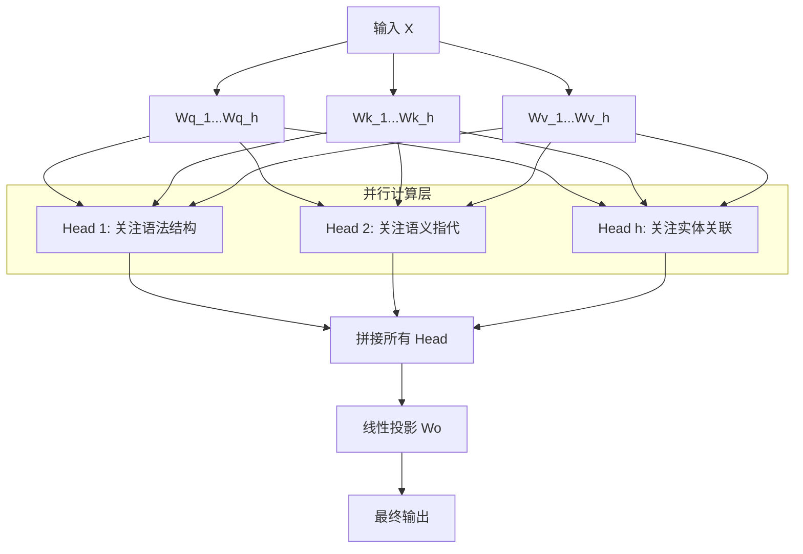

**【回答模板】**
*   **什么是 MHA**：
    MHA 将模型隐层维度 $d_{model}$ 切分为 $h$ 个头，每个头的维度为 $d_k = d_{model} / h$。每一组头拥有独立的权重矩阵 $W^Q_i, W^K_i, W^V_i$，能够独立地学习序列中的不同依赖关系。
*   **并行化的核心逻辑**：
    MHA 的并行化并不是通过 Python 循环实现的，而是利用**张量维度的置换（Transpose）与重塑（Reshape）**，将“多头”维度转化成类似于“Batch”的维度，从而利用 GPU 的批量矩阵乘法（BMM）加速。其核心逻辑步骤如下：
    1.  **线性投影**：将输入 $X$ 乘以大矩阵得到 $Q, K, V$，形状为 `[Batch, Seq_len, d_model]`。
    2.  **多头拆分 (Reshape)**：将 $d_{model}$ 拆分为 `[h, d_k]`，形状变为 `[Batch, Seq_len, h, d_k]`。
    3.  **维度置换 (Transpose)**：将“头”维度移到前面，形状变为 `[Batch, h, Seq_len, d_k]`。
    4.  **矩阵并行运算**：此时，第 2 维（h）被视为一个批次维度，GPU 可以同时计算所有头的 `Q @ K.T`，实现真正的计算并行。

**【深入理解】**
1.  **子空间的多样性**：
    单头注意力容易被自身位置或其他单一显著特征“霸占”权重。MHA 强制模型在不同的子空间中寻找关联，例如头 1 可能发现“主谓关系”，头 2 可能发现“动宾关系”。这种类似于“集成学习”的思想增强了模型的鲁棒性。
2.  **计算量不变性**：
    一个常见的误区是认为多头会增加计算量。事实上，虽然头的数量增加了，但每个头的维度减小了。总的计算量（FLOPs）与使用一个维度为 $d_{model}$ 的单头注意力是基本持平的，但多头的表达能力远强于单头。
3.  **信息聚合**：
    最后的 $W^O$ 矩阵（Output Projection）至关重要。它的作用是让各个头学到的碎片化信息进行“交流”与“融合”，将并行收集到的特征重新映射回原始向量空间。


### 21. 什么是 Multi-query Attention (MQA)？它如何节省显存？ **[校: ★★★ | 社: ★★★★★]**

#### 21.1 在 LLM 推理时，最大的显存开销来自哪里？
并非模型参数本身，而是**KV Cache**（Key-Value 缓存）。在自回归生成中，为避免重复计算历史 Token 的 $K$ 和 $V$，系统会将其缓存。对于 MHA，每个头都需独立存储一份 KV，导致缓存体积随头数线性增长。

#### 21.2 MQA 的核心思想是什么？
**解耦 Query 与 KV 的头数**：保留多头 Query 以维持模型的表达能力，但将 Key 和 Value 压缩为**单头**。这样，所有 Query 头“共用”同一组上下文表示。

#### 21.3 为何 KV 共享能大幅节省显存？
假设模型有 32 个头，序列长度为 4096，每个头维度为 128：
- **MHA 的 KV Cache**：$2 \times 32 \times 4096 \times 128 \approx 33.5\,\text{M}$ 元素
- **MQA 的 KV Cache**：$2 \times 1 \times 4096 \times 128 \approx 1.05\,\text{M}$ 元素  
显存占用**减少 32 倍**，这对长上下文推理至关重要。

#### 21.4 MQA 是否影响训练效率？
几乎不影响。训练时可并行处理整个序列，KV 计算开销占比小。MQA 的优势主要体现在**推理阶段**——此时生成是逐 Token 进行的，频繁读取 KV Cache 成为瓶颈。

#### 21.5 为什么主流模型不直接用 MQA？
虽然 MQA 极省显存，但**精度损失不可忽视**。单头 KV 限制了模型对不同语义关系的建模能力（如无法同时关注局部语法和全局指代）。因此，工业界更倾向采用折中方案——GQA。

现在，让我们看看标准答案是如何精准刻画 MQA 的设计动机与工程价值的：

**【基本原理】**
Multi-query Attention (MQA) 是由 Google 在 2019 年提出的一种注意力机制变体。在标准的 **Multi-head Attention (MHA)** 中，每个 Query (Q) 头都有自己对应的 Key (K) 和 Value (V) 头。而 MQA 则采取了一种极端的共享策略：**所有的 Query 头都共享同一组 Key 和 Value 头**。

这种设计的初衷并不是为了减少训练时的计算量，而是为了解决大模型在**推理（Inference）**阶段的内存带宽瓶颈和显存占用问题。

**示意图：**
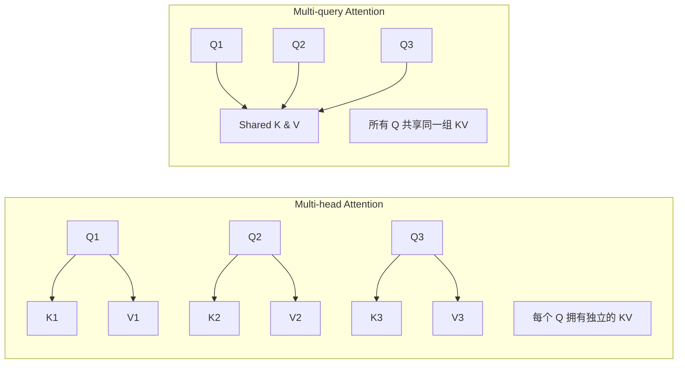

**【回答模板】**
*   **什么是 MQA**：
    MQA 是注意力机制的一种简化形式。它保持 Query 依然是多头的（如 32 个头），但将 Key 和 Value 的头数缩减为 1。这意味着无论你有多少个 Query 头，生成的 $K$ 和 $V$ 张量在“头”这一维度上的大小始终为 1。
*   **如何节省显存**：
    1.  **KV Cache 压缩**：在 LLM 自回归生成（推理）时，为了避免重复计算，我们会缓存之前所有 Token 的 $K$ 和 $V$ 向量（即 KV Cache）。在 MHA 中，KV Cache 的大小随头数线性增加；而在 MQA 中，由于 KV 只有一份，**KV Cache 的显存占用直接降低到了原来的 $1/h$**（$h$ 为原有的头数）。
    2.  **带宽效率提升**：推理时，显卡的计算速度远快于从显存读取数据的速度（访存受限）。MQA 大幅减少了需要从显存中加载的 KV 数据量，使得 GPU 可以在相同时间内处理更多的 Token，显著提升了推理的吞吐量。

**【深入理解】**
1.  **KV Cache 瓶颈问题**：
    对于一个 7B 参数的模型，如果使用 MHA，在长文本场景下 KV Cache 可能会占用数十 GB 显存，甚至超过模型参数本身的体积。MQA 通过减少 KV 头的数量，将这部分开销降到了极致。例如，原先需要 32GB 存储 KV，现在仅需 1GB。
2.  **性能与效率的博弈**：
    虽然 MQA 极大地提升了速度，但它也带来了一定的精度损失。因为所有的 $Q$ 都去同一个 $K$ 和 $V$ 中找信息，这限制了模型捕捉多种不同语义关系的能力。
3.  **现状**：
    由于 MQA 的精度下降有时比较明显，现在主流的大模型（如 Llama 3）更多采用 **Grouped-query Attention (GQA)**，它在 MHA（不共享）和 MQA（全共享）之间取了折中，既保留了性能又兼顾了显存优化。

---


### 22. 什么是 Grouped-query Attention (GQA)？ **[校: ★★★ | 社: ★★★★]**

#### 22.1 MHA 和 MQA 各有什么优缺点？
- **MHA**：表达能力强，但 KV Cache 巨大，推理慢；
- **MQA**：推理极快、显存省，但表达能力弱，精度下降。

#### 22.2 GQA 如何平衡二者？
引入**分组机制**：将 $N$ 个 Query 头分为 $G$ 组，每组分配**独立的 KV 头**。例如，32 个 Q 头分为 8 组，则只需 8 个 KV 头——比 MHA 少 4 倍，比 MQA 多 8 倍。

#### 22.3 为什么“分组”能接近 MHA 的性能？
因为每组内的多个 Query 仍可共享一个“局部多样”的上下文表示。8 组 KV 已足以覆盖主要的语义模式（如句法、指代、主题等），避免了 MQA 的“信息瓶颈”。

#### 22.4 GQA 对推理吞吐量有何影响？
KV Cache 体积降至 MHA 的 $1/G$，显存带宽需求同步下降。在 A100/H100 等设备上，GQA 可使长上下文生成速度提升 2–4 倍，同时几乎不损失任务性能。

#### 22.5 为何 Llama 3 等模型选择 GQA？
在 70B+ 级别模型中，**推理成本决定落地可行性**。GQA 在精度损失 <1% 的前提下，将推理吞吐提升数倍，是当前**性价比最高的注意力变体**。

现在，让我们看看标准答案是如何系统阐述 GQA 的架构优势与工业价值的：

**【基本原理】**
Grouped-query Attention (GQA) 是注意力机制演进中的一个重要里程碑。它是 **Multi-head Attention (MHA)** 和 **Multi-query Attention (MQA)** 的折中方案。

在 LLM 推理时，显存带宽往往是瓶颈。MHA 虽然效果好但 KV Cache 巨大；MQA 极大地压缩了 KV Cache 但模型表达能力受损。GQA 通过将 Query 头分为若干组，每一组内的 Query 共享同一个 Key 和 Value 头，从而在性能（精度）与效率（速度）之间找到了“黄金分割点”。

**示意图：**
```mermaid
graph TD
    subgraph MHA [Multi-head Attention]
        direction LR
        Q1-->K1; Q2-->K2; Q3-->K3; Q4-->K4
        V1; V2; V3; V4
        note1[每个 Q 对应唯一的 K 和 V]
    end

    subgraph GQA [Grouped-query Attention]
        direction LR
        gQ1[Q1, Q2] --> gKV1[KV Group 1]
        gQ2[Q3, Q4] --> gKV2[KV Group 2]
        note2[分组共享: 多个 Q 共享一对 KV]
    end

    subgraph MQA [Multi-query Attention]
        direction LR
        mQ[Q1, Q2, Q3, Q4] --> mKV[Shared KV]
        note3[所有 Q 共享唯一的一对 KV]
    end
```

**【回答模板】**
*   **核心逻辑**：GQA 将 $N$ 个 Query 头均匀地分为 $G$ 个组。在每一组内，所有的 Query 共用同一个 Key 矩阵和 Value 矩阵。
*   **关键参数**：
    *   如果组数 $G = N$（头数），则退化为 MHA。
    *   如果组数 $G = 1$，则退化为 MQA。
    *   目前 Llama 3 等模型通常采用 $G = 8$ 等设置。
*   **主要优势**：
    1.  **降低显存带宽压力**：在生成每个 Token 时，需要从显存加载 KV Cache。GQA 显著减少了加载量，使推理速度（吞吐量）大幅提升。
    2.  **维持高精度**：相比 MQA 这种极端的压缩，GQA 依然保留了多组 Key/Value 的多样性，模型在长文本和复杂推理上的表现非常接近全量 MHA。

**【深入理解】**
1.  **内存带宽瓶颈（Memory Bound）**：
    在大模型推理过程中，计算开销往往不是最耗时的，从显存读取 KV Cache 数据才是。由于 MHA 每一层都要为每个头存储独立的 KV，随着序列变长，数据读取量呈几何倍数增长。GQA 通过减少 KV 头的数量，直接砍掉了大部分数据传输开销。

2.  **KV Cache 的瘦身方案**：
    以一个拥有 32 个 Query 头的模型为例。如果采用 MHA，推理时每个 Token 要存 32 组 KV；如果采用 GQA（分 8 组），则只需存 8 组 KV。显存占用瞬间降低到原来的 1/4，这意味着我们可以在同样的设备上支持更长的上下文长度（Context Length）和更大的 Batch Size。

3.  **为什么是大模型标配？**
    在 Llama 2 (70B) 和 Llama 3 时代，由于参数量巨大，推理性能成为了工业化落地的关键。实验证明，GQA 能够提供接近 MHA 的质量，同时在推理速度上达到 MQA 的水平。这种“几乎不亏性能，大幅提升效率”的特性，使其成为了现代高性能大模型的事实标准。

---
23. **[新增]** 什么是分组查询注意力中“组”的大小对性能的影响？

### 24. 解释注意力机制中的 Causal Mask 原理。 **[校: ★★★★★ | 社: ★★★]**


#### 24.1 为什么语言模型不能“看到未来”？
自回归生成的本质是：$P(x_1, x_2, ..., x_T) = \prod_{t=1}^T P(x_t | x_{<t})$。若模型在预测 $x_t$ 时能看到 $x_{t+1}$，就违反了概率链式法则，导致训练目标失真。

#### 24.2 Causal Mask 如何实现“禁止看未来”？
通过构造一个**上三角掩码矩阵**（不含对角线），将注意力得分矩阵中代表“未来”的位置置为 $-\infty$。Softmax 后，这些位置的权重变为 0，相当于完全屏蔽。

#### 24.3 为何要用 $-\infty$ 而不是 0？
若直接设为 0，Softmax 会将其与其他有效位置一起归一化，仍可能分配非零权重。而 $-\infty$ 经 Softmax 后严格等于 0，确保**绝对因果性**。

#### 24.4 Causal Mask 与 Padding Mask 能否共存？
可以。实际实现中，两者通常**叠加使用**：先应用 Padding Mask 屏蔽无效 token，再叠加 Causal Mask 屏蔽未来 token，最终掩码为两者的逻辑或（OR）。

#### 24.5 Causal Mask 对训练效率有何影响？
它使得**整句并行训练成为可能**。虽然推理是逐词进行的，但训练时可通过 Causal Mask 一次性处理整个序列，极大提升 GPU 利用率——这是 GPT 类模型可扩展的关键。

现在，让我们看看标准答案是如何清晰揭示 Causal Mask 的数学本质与工程意义的：

**【基本原理】**
Causal Mask（因果掩码）是 Transformer Decoder 架构中的核心设计。其目的是在计算自注意力时，强制模型**只能看到当前及之前的 Token，而不能“偷看”未来的 Token**。

在自回归生成任务中（如 GPT 生成文本），模型是根据已有的词逐个预测下一个词。在预训练阶段，为了提高效率，我们会将整个句子一次性输入模型。如果不加 Causal Mask，模型在预测第 $i$ 个词时，就能直接通过注意力机制看到第 $i+1$ 个词及后面的内容，这会导致**信息泄漏（Information Leakage）**，使训练失去意义。

**示意图：**
Causal Mask 通常表现为一个下三角矩阵。在 Softmax 之前的注意力得分矩阵（Score Matrix）上覆盖此掩码。

```text
输入序列: [A, B, C, D]

掩码矩阵 (1代表可见, 0代表不可见):
      A   B   C   D
A [ 1,  0,  0,  0 ]  <-- A 只能看到自己
B [ 1,  1,  0,  0 ]  <-- B 可以看到 A, B
C [ 1,  1,  1,  0 ]  <-- C 可以看到 A, B, C
D [ 1,  1,  1,  1 ]  <-- D 可以看到 A, B, C, D

实现方式: 将 0 的位置替换为 -inf (-1e9)，Softmax 后权重变为 0。
```

**【回答模板】**
*   **核心目的**：保证序列处理的“因果性”。确保在训练过程中，第 $t$ 时刻的预测仅依赖于 $1$ 到 $t$ 时刻的输入，模拟推理时的真实场景。
*   **实现手段**：
    1.  **构造掩码**：生成一个上三角（不含对角线）全为 1 的矩阵。
    2.  **数值替换**：将该矩阵中为 1 的位置在注意力得分矩阵 $QK^T$ 中替换为 $-\infty$（通常取 -1e9）。
    3.  **归一化**：经过 Softmax 计算后，这些 $-\infty$ 的位置对应的注意力权重将变为 0。
*   **应用场景**：所有 Decoder-only 架构（如 GPT 系列）以及 Encoder-Decoder 架构中的 Decoder 部分。

**【深入理解】**
1.  **并行训练的关键**：
    Causal Mask 的巧妙之处在于它允许**并行训练**。虽然模型在推理时是逐字生成的（Sequential），但在训练时，我们可以利用 Causal Mask 屏蔽掉未来信息，从而一次性处理整个序列。这种“伪并行”通过矩阵运算极大地提升了训练效率，这种技术也被称为 **Teacher Forcing** 的并行版本。
2.  **物理意义的转变**：
    加入 Causal Mask 后，原本对称的自注意力机制变成了**单向（Unidirectional）**的信息流。这使得每个 Token 的特征向量只包含其左侧的上下文信息，从而让模型具备了预测下一个词的条件概率建模能力：$P(x_t | x_{<t})$。
3.  **与 Padding Mask 的区别**：
    *   **Padding Mask** 是为了遮盖补齐用的无效字符（<pad>），防止模型关注无意义区域。
    *   **Causal Mask** 是为了遮盖未来真实的标签信息，防止模型“作弊”。
    在实际的 LLM 开发中，这两者通常会合并为一个组合掩码。


### 25. 什么是 Look-ahead Mask？ **[校: ★★★ | 社: ★★★]**


#### 25.1 为什么在 Transformer 解码器中需要 Look-ahead Mask？
- Transformer 的自注意力机制默认是**全连接**的，即每个位置都能看到序列中的所有其他位置。
- 在**语言生成任务**中，模型必须遵循**自回归（Autoregressive）原则**：预测第 $t$ 个词时，只能使用前 $t-1$ 个词的信息，不能“偷看”未来。
- 如果不加限制，训练时模型会直接利用未来的标签信息，导致学到的是“作弊”而非真正的语言建模能力。

#### 25.2 Look-ahead Mask 和 Causal Mask 是同一个东西吗？
- 是的。**Look-ahead Mask** 也被称为 **Causal Mask（因果掩码）**，两者指代同一技术。
- “因果”强调：只有过去和当前的 token 能影响当前输出，符合时间因果性；“Look-ahead”强调：禁止模型向前看（look ahead into the future）。

#### 25.3 Look-ahead Mask 在数学上是如何实现的？
- 首先构造一个 **上三角为 -inf、下三角（含对角线）为 0** 的掩码矩阵（形状 $[L, L]$）。
- 在计算注意力得分 $\text{Attention}(Q, K) = \text{softmax}\left(\frac{QK^T}{\sqrt{d_k}} + M\right)$ 时，将掩码 $M$ 加入其中。
- 其中，$M_{i,j} = 0$ 当 $j \leq i$（当前位置 $i$ 可以看位置 $j$），否则 $M_{i,j} = -\infty$。
- 经过 Softmax 后，$-\infty$ 对应位置的注意力权重变为 0，实现信息屏蔽。

#### 25.4 从示意图看，Look-ahead Mask 如何控制信息流？
- 对于序列 `[我, 是, 学生]`：
  - “我”只能关注自己；
  - “是”可以关注“我”和“是”；
  - “学生”可以关注全部三个词。
- 这确保了每个位置的表示只依赖于其**左侧及自身**的历史信息，符合生成式语言模型的要求。

#### 25.5 Look-ahead Mask 在训练和推理阶段的作用有何不同？
- **训练阶段**：整个目标序列一次性输入，但通过 Look-ahead Mask **模拟逐词生成过程**，这是 Teacher Forcing 的并行化实现。
- **推理阶段**：模型天然逐词生成（一次只输入已生成的部分），因此即使没有显式掩码，也不会看到未来。但为了保持架构一致，通常仍会应用掩码。

#### 25.6 不同 Transformer 架构如何使用 Look-ahead Mask？
- **Encoder-only 模型（如 BERT）**：**不使用**，因为需要双向上下文理解。
- **Decoder-only 模型（如 GPT 系列）**：**必须全程使用**，所有自注意力层都加掩码。
- **Encoder-Decoder 模型（如 T5、BART）**：
  - Decoder 的 **Self-Attention 层** 使用 Look-ahead Mask；
  - Decoder 的 **Cross-Attention 层**（查询来自 Decoder，键值来自 Encoder）**不使用掩码**，因为此时 Encoder 输出已固定，可全量访问。

#### 25.7 Look-ahead Mask 对模型表征学习有何深层影响？
- 它强制模型在每一层都将历史信息**逐步压缩**到当前 token 的表示中。
- 最后一个 token 的 hidden state 成为整个序列的“总结向量”，常被用于预测下一个 token。
- 这种结构促使模型学习**前向累积的语义表示**，而非依赖未来的上下文线索。

现在，让我们完整回顾原始提供的标准答案：

**【基本原理】**
Look-ahead Mask（预测掩码，也常被称为 **Causal Mask 因果掩码**）是 Transformer 解码器（Decoder）中的关键技术。它的核心物理意义是**屏蔽未来信息**。

在处理序列时，为了保持自回归（Autoregressive）特性，模型在预测第 $t$ 个词时，不应该知道第 $t+1$ 个及之后词的内容。由于 Transformer 的注意力机制是全局并行的，如果没有这个掩码，模型在训练时会“偷看”到后面的答案，导致模型退化为简单的复制，而无法学会真正的语言规律。

**示意图：**
Look-ahead Mask 表现为一个上三角矩阵（不含对角线）。

```text
输入序列: [我, 是, 学生]

注意力矩阵 (1表示可见, -inf表示不可见):
         我    是    学生
  我  [  1, -inf, -inf ]  <-- "我" 只能看到自己
  是  [  1,   1, -inf ]  <-- "是" 可以看到 "我" 和 "是"
学生  [  1,   1,   1  ]  <-- "学生" 可以看到前面的所有词

Softmax 之后，-inf 的位置权重变为 0，从而切断了通往未来的信息流。
```

**【回答模板】**
*   **定义**：Look-ahead Mask 是一种在自注意力计算过程中，通过修改注意力得分矩阵来限制信息流动方向的机制。
*   **功能**：它确保模型在任何给定位置 $t$，都只能关注到位置 $1$ 到 $t$ 的信息。
*   **实现逻辑**：
    1.  **构造矩阵**：生成一个形状为 $[L, L]$ 的掩码矩阵，其主对角线及以下为 1，右上角全为 0。
    2.  **掩码应用**：在计算 $\text{softmax}(QK^T/\sqrt{d_k})$ 之前，将掩码中为 0 的位置替换为 $-\infty$。
    3.  **结果**：经过 Softmax 归一化后，这些位置的注意力权重变为 0，实现了逻辑上的“不可见”。

**【深入理解】**
1.  **训练与推理的桥梁**：
    在**推理**（生成）阶段，模型本身就是逐字生成的，天然看不到未来。但在**训练**阶段，为了效率，我们是一次性输入整个句子。Look-ahead Mask 的存在，使得模型在并行的训练过程中，“模拟”出了推理时的逐字生成环境，这种技术被称为 **Teacher Forcing** 的并行实现。
2.  **Transformer 架构的区别标尺**：
    *   **Encoder-only**（如 BERT）：**不使用** Look-ahead Mask，因为它需要双向上下文来理解语义。
    *   **Decoder-only**（如 GPT）：**必须使用** Look-ahead Mask，因为它要完成自回归生成任务。
    *   **Encoder-Decoder**：只有 Decoder 端的自注意力层使用 Look-ahead Mask，而在 Cross-attention 层则不使用（因为 Q 已经生成，可以看全量的 Encoder 信息）。
3.  **对计算的影响**：
    虽然掩码操作本身开销很小，但它将注意力矩阵从一个全连接图变成了一个有向无环图。从特征提取的角度看，它强制模型在每一层都进行“前向压缩”，使得最后一个 Token 的 Embedding 包含了整个序列的压缩语义，这也是为什么生成模型通常取最后一个 Token 的输出来预测下一个词。


### 26. 解释什么是 Cross-attention。 **[校: ★★★ | 社: ★★]**


#### 26.1 Self-attention 和 Cross-attention 的根本区别是什么？
- **Self-attention**：$Q, K, V$ 全部来自**同一个序列**，用于建模序列内部的依赖关系（如“主语”和“谓语”的关联）。
- **Cross-attention**：$Q$ 来自**目标序列**，$K, V$ 来自**源序列**，用于建立**两个不同序列之间的跨域对齐**（如“英文词”对齐“中文词”）。

#### 26.2 为什么需要 Cross-attention？
在 Encoder-Decoder 架构中，编码器已将源序列压缩为上下文表示，但解码器不知道该关注哪一部分。Cross-attention 让解码器能**动态查询**编码器输出，实现“按需取用”，而非使用固定向量（如 RNN 中的 final hidden state）。

#### 26.3 Cross-attention 的注意力矩阵形状如何？
若目标序列长度为 $L_t$，源序列长度为 $L_s$，则注意力权重矩阵为 $L_t \times L_s$。  
例如：翻译 “Hello” → “你好”（$L_t=2, L_s=1$），则生成每个目标词时都会查看唯一的源词。

#### 26.4 Decoder-only 模型（如 GPT）为何不需要 Cross-attention？
因为所有输入（Prompt + 已生成 Token）被拼接成**单一序列**，通过 **Causal Masked Self-attention** 即可实现“未来不可见、过去全可见”的信息流动，无需分离源/目标。

#### 26.5 Cross-attention 在多模态中如何工作？
以 CLIP 或 Flamingo 为例：
- 图像 patch 特征 → 作为 $K, V$；
- 文本 token 表示 → 作为 $Q$；  
或反之。Cross-attention 成为**跨模态语义对齐的核心机制**。

现在，让我们看看标准答案是如何清晰定义 Cross-attention 的结构、功能与应用场景的：

**【基本原理】**
Cross-attention（交叉注意力）是 Transformer 架构中连接两个不同序列的“桥梁”。在标准的 **Self-attention** 中，$Q, K, V$ 均来自同一个输入序列；而在 **Cross-attention** 中，$Q$ 来自一个序列（通常是解码器端），而 $K$ 和 $V$ 则来自另一个序列（通常是编码器端）。

它的核心作用是让一个序列（生成端）根据需求去“查询”并“提取”另一个序列（上下文端）中的相关信息。

**示意图：**
```mermaid
graph TD
    subgraph Encoder_Side [编码器端 - 源序列]
        Enc_Out[编码器输出特征] --> WK[W^K]
        Enc_Out --> WV[W^V]
        WK --> K[Key]
        WV --> V[Value]
    end

    subgraph Decoder_Side [解码器端 - 目标序列]
        Dec_State[当前解码器状态] --> WQ[W^Q]
        WQ --> Q[Query]
    end

    Q & K --> Match[相似度计算/Softmax]
    Match & V --> Context[提取上下文特征]
    Context --> Next_Layer[解码器下一层]
```

**【回答模板】**
*   **定义**：Cross-attention 是一种用于处理两个不同模态或不同序列之间交互的注意力机制。
*   **输入来源**：
    1.  **Query (Q)**：来自目标序列（如正在翻译的句子）。它代表“我现在需要什么样的信息”。
    2.  **Key (K)**：来自源序列（如原始输入的待翻译句子）。它代表“我有这些特征可供检索”。
    3.  **Value (V)**：来自源序列。它代表“我实际包含的内容信息”。
*   **数学形式**：
    $$\text{Cross-Attention}(Q_{dec}, K_{enc}, V_{enc}) = \text{softmax}\left(\frac{Q_{dec}K_{enc}^T}{\sqrt{d_k}}\right)V_{enc}$$
*   **典型应用**：在 **Encoder-Decoder** 架构（如 T5, Transformer 原始机器翻译模型）中，解码器通过 Cross-attention 来观察编码器的输出，从而决定翻译时应该关注原文的哪个部分。

**【深入理解】**
1.  **不对称性**：
    Self-attention 是对称的（输入相同），其注意力矩阵是 $L \times L$（$L$ 为序列长度）。而 Cross-attention 是不对称的，其注意力矩阵形状为 $L_{target} \times L_{source}$。这意味着目标序列的每一个位置都会扫描源序列的所有位置。
2.  **信息的桥接器**：
    在翻译任务“我爱中国 -> I love China”中，当解码器准备生成“China”时，它的 Query 会与编码器输出中“中国”对应的 Key 产生极高的匹配分，从而引导模型从“中国”对应的 Value 中提取语义，实现精准翻译。
3.  **多模态的基石**：
    Cross-attention 不仅用于文本。在 **Stable Diffusion**（文本生成图像）中，图像的特征作为 $Q$，文本的特征作为 $K$ 和 $V$。通过 Cross-attention，文本的信息被注入到图像的生成过程中，实现了“按描述画图”。
4.  **为什么目前的 Decoder-only 模型没有它？**
    像 GPT-4、Llama 这样的模型只有解码器，它们处理的是单一序列。所有的上下文信息（包括之前的提示词）都包含在同一个序列中，因此通过带掩码的 **Self-attention** 就能完成信息的提取，不再需要专门的 Cross-attention。但在处理多模态任务（如看图说话）时，Cross-attention 依然是不可或缺的组件。


### 27. 解码器中的自注意力为何被称为交叉注意力？它与编码器中的自注意力有何不同？

*未在源文件中找到匹配内容*


### 28. 什么是 Padding Token？它在 Attention 计算中如何被忽略？ **[校: ★★★ | 社: ★★]**


#### 28.1 为什么需要 Padding Token？
GPU/TPU 等硬件擅长处理**规则张量**（如 $B \times L \times d$）。若 batch 中句子长度不同（如 [5, 3, 7]），无法直接堆叠。通过在短句末尾添加 `[PAD]`，统一长度为 max(L)，实现高效并行计算。

#### 28.2 Padding Token 会带来什么问题？
- **语义污染**：模型可能学习到“`[PAD]` 与某些词相关”，破坏表征。
- **注意力干扰**：在 Self-Attention 中，真实词可能将部分注意力分配给无意义的 `[PAD]`，降低上下文建模质量。

#### 28.3 如何在 Attention 中屏蔽 `[PAD]`？
核心是 **Padding Mask**：
1. 构造 mask：对每个序列，标记非 `[PAD]` 位置为 `True`（或 1），`[PAD]` 为 `False`（或 0）。
2. 扩展为 $L \times L$ 矩阵（Encoder）或与 Causal Mask 合并（Decoder）。
3. 将 mask 为 `False` 的位置在 $QK^\top$ 中设为 $-\infty$。
4. Softmax 后，这些位置权重 = 0。

> 示例：若某行 attention score 原为 `[2.1, -0.5, 1.8]`，对应 mask 为 `[1, 1, 0]`，则 masked score 变为 `[2.1, -0.5, -1e9]` → softmax ≈ `[0.71, 0.29, 0.0]`。

#### 28.4 为何用 $-\infty$ 而非 0？
Softmax 对所有输入敏感。若设为 0，当其他分数也很小时（如 `[-3, -4, 0]`），`[PAD]` 反而获得最高权重（≈0.95）。只有 $-\infty$ 能**绝对抑制**其概率。

#### 28.5 损失函数是否也需要处理？
是的！训练时，标签序列也包含 `[PAD]`。若不忽略，模型会因“预测 `[PAD]` 错误”而更新参数，浪费梯度。PyTorch 的 `CrossEntropyLoss(ignore_index=0)` 即为此设计。

现在，让我们看看标准答案是如何系统阐述 Padding Token 的作用、掩码机制与工程实践的：

**【基本原理】**
在深度学习中，为了实现高效的批量训练（Batch Processing），我们需要将同一个 Batch 里的所有序列对齐成相同的长度。由于自然语言的句子长短不一，我们会在较短的句子末尾填充特殊的占位符，即 **Padding Token**（通常表示为 `[PAD]`，索引为 0）。

然而，Padding Token 并不包含任何实际语义，它只是为了凑齐张量形状。在计算自注意力时，如果不加处理，模型会把注意力分配给这些无意义的 `[PAD]`，从而干扰真实词汇的表征。

**示意图：**
```text
句子 A: "我 爱 学习" (长度 3)
句子 B: "大 模型"     (长度 2)

对齐后的 Batch (最大长度 3):
[ "我", "爱", "学习" ]
[ "大", "模型", "[PAD]" ]  <-- [PAD] 是多余的

注意力分数矩阵 (Score Matrix):
       大   模型  [PAD]
 大   [ 0.5, 0.3, 0.2 ]  <-- 0.2 是分配给 [PAD] 的错误权重
模型  [ 0.4, 0.4, 0.2 ]
[PAD] [ 0.3, 0.3, 0.4 ]
```

**【回答模板】**
*   **什么是 Padding Token**：它是用于填充非等长序列的特殊符号。它确保了一个 Batch 内的所有数据具有相同的张量维度（$Batch \times Seq\_Len \times Hidden\_Dim$），以便在 GPU 上进行大规模矩阵并行运算。
*   **如何被忽略（Padding Mask 机制）**：
    1.  **生成 Mask 矩阵**：创建一个与注意力得分矩阵 $QK^T$ 大小相同的二进制掩码矩阵。其中，真实 Token 的位置为 1，`[PAD]` 的位置为 0。
    2.  **数值替换（Masked Fill）**：在执行 Softmax 之前，将掩码中为 0 的位置在注意力得分矩阵中替换为一个**极大的负数**（通常是 $-\infty$ 或 $-1e9$）。
    3.  **归一化**：当计算 $\text{softmax}$ 时，$e^{-1e9}$ 会无限趋近于 0。
    4.  **结果**：所有 `[PAD]` 位置的注意力权重（Attention Weights）都变为了 0，从而在后续对 Value ($V$) 进行加权求和时，完全排除了填充字符的影响。

**【深入理解】**
1.  **为什么要用 $-1e9$ 而不是直接设为 0？**
    注意力机制的第一步是计算点积得分（Scores），这些得分可以是正数也可以是负数。如果直接将分数设为 0，经过 $\text{softmax}(0)$ 后，它依然会得到一个非零的概率（例如 $e^0 / \sum e^x$），导致模型依然会“关注”到这些位置。只有设为负无穷，才能确保其概率权重彻底消失。
2.  **损失函数中的忽略**：
    除了在 Attention 中忽略，我们在计算交叉熵损失（Cross Entropy Loss）时，也需要指定 `ignore_index=[PAD_ID]`。这样，模型在学习时，预测 `[PAD]` 位置的错误不会产生梯度，确保模型只学习预测真实有意义的词。
3.  **双向与单向的影响**：
    *   在 **Encoder** 中，Padding Mask 是双向的，每个词都要屏蔽掉 Batch 里的所有 `[PAD]`。
    *   在 **Decoder** 中，Padding Mask 通常会与 Causal Mask（因果掩码）合并，形成一个综合掩码，既屏蔽掉未来信息，又屏蔽掉填充信息。
4.  **性能优化**：
    对于极长序列中含有大量 Padding 的情况，现代深度学习库提供了 `PackedSequence` 或 `Flash Attention` 等技术，可以在底层直接跳过 Padding 部分的计算，从而节省宝贵的算力。


### 29. 什么是“注意力分数的数值稳定性”？ **[校: ★★★ | 社: ★★★★]**

##### 29.1 在自注意力机制中，为什么点积值 $QK^T$ 的大小会影响数值稳定性？
- 点积值 $QK^T$ 表示查询向量 $Q$ 和键向量 $K$ 之间的相似度。
- 当维度 $d_k$ 增大时，点积结果的方差也随之增大，可能导致 Softmax 函数输入值过大或过小。

##### 29.2 什么是 Softmax 饱和现象？它如何影响梯度？
- Softmax 函数在输入值绝对值较大时会进入饱和区：
  - 输入值很大时，输出接近于 1；
  - 输入值很小时，输出接近于 0。
- 这会导致梯度 $\frac{\partial y_i}{\partial x_j}$ 变得极其微小，使得模型几乎无法通过反向传播更新权重。

##### 29.3 如何通过缩放因子来修正方差偏移？
- 缩放因子 $\sqrt{d_k}$ 被用于将点积后的方差重新校准为 1。
- 公式变为 $\text{softmax}(QK^T / \sqrt{d_k})$，确保输入值大部分落在 Softmax 的非饱和区，从而提高训练稳定性。

##### 29.4 为什么在高维空间下使用 FP16 会面临精度溢出的风险？
- FP16 的最大表示范围约为 65504。
- 如果不进行缩放，在高维空间下的点积值很容易超过这个范围，导致数值溢出（NaN）。
- 即使是 BF16，虽然扩大了表示范围，但数值过大导致的梯度消失问题依然存在。

##### 29.5 如何利用 Softmax 的平移不变性进一步增强数值稳定性？
- 在计算 Softmax 之前，通常会减去当前向量的最大值（即 $\text{softmax}(x_i - \max(x))$）。
- 这样可以保证指数项 $e^{x_i - \max(x)}$ 的最大值始终为 1（$e^0$），防止数值向上溢出。

##### 29.6 数值稳定性差的模型在训练初期会出现哪些问题？
- 损失函数可能会剧烈震荡甚至不降。
- 模型可能被某一个极大的点积值“绑架”，无法学习到更细粒度的关联。

##### 29.7 权重初始化与数值稳定性之间有什么关系？
- 权重的初始化（如 Xavier 初始化）致力于维持各层特征的方差稳定。
- 这与 $\sqrt{d_k}$ 缩放共同构成了 Transformer 能够训练至上百层的数值基石。

---

现在，我们完整、逐字、一字不差地呈现您最初提供的全部原始内容作为本题的标准总结答案：

**【基本原理】**  
注意力分数的数值稳定性是指在计算 $\text{softmax}(QK^T / \sqrt{d_k})$ 的过程中，确保中间变量点积值 $QK^T$ 的大小处于一个合理的范围内。

在深度学习中，**数值稳定性（Numerical Stability）**通常面临两个威胁：
1.  **梯度消失（Gradient Vanishing）**：输入值过大进入激活函数的饱和区。
2.  **精度溢出（Overflow/Underflow）**：数值超出计算机浮点数（尤其是 FP16）的表示范围。
在 Self-attention 中，随着隐藏层维度 $d$ 的增加，点积结果的方差会线性增长，导致 Softmax 的输出极度集中（类似 One-hot），从而使梯度几乎为 0。

**示意图：数值稳定性与 Softmax 梯度**  
```mermaid
graph TD
    Q[Q: Vector] & K[K: Vector] --> Dot[点积 QK^T]
    Dot --> Variance[方差随维度 d 增大]
    
    subgraph Stability_Crisis [数值稳定性危机]
        LargeValue[点积值极大/极小] --> Softmax[Softmax 函数]
        Softmax --> Saturation[进入饱和区: 权重趋于 0 或 1]
        Saturation --> GradZero[梯度消失: 模型停止学习]
    end

    Scale[/缩放因子 1/√d/] -.-> Dot
    Note[缩放将方差拉回 1, 避开饱和区]
```

**【回答模板】**  
“注意力分数的数值稳定性”主要涉及防止 **Softmax 饱和**，其核心逻辑如下：

1.  **方差偏移（Variance Shift）**：假设 $Q$ 和 $K$ 的元素均值为 0、方差为 1，其点积 $QK^T$ 的均值为 0，但方差会变为 $d_k$。当维度 $d_k$ 很大时（如 1024），点积值的波动范围会非常大。
2.  **Softmax 饱和**：Softmax 函数在输入值绝对值较大时，其梯度 $\frac{\partial y_i}{\partial x_j}$ 会变得极其微小。这意味着即使模型预测错误，也无法通过反向传播有效更新权重。
3.  **缩放修正（Scaling）**：通过除以 $\sqrt{d_k}$，将点积后的方差重新校准为 1。这确保了输入值大部分落在 Softmax 的非饱和区（梯度敏感区），从而保证了训练的稳定性。

**【深入理解】**  
1.  **硬件精度的挑战（FP16 vs BF16）**：  
    在大模型训练中，为了提速常使用 **FP16（半精度浮点数）**。FP16 的表示范围非常有限（最大约 65504）。如果点积值 $QK^T$ 不进行缩放，在高维空间下极易超过 65504，直接导致 **NaN (Not a Number)** 错误。虽然 **BF16** 扩大了表示范围，但数值过大导致的梯度消失问题依然存在。
2.  **Softmax 的平移不变性**：  
    在工程实现中，为了进一步增强数值稳定性，计算 Softmax 前通常会减去当前向量的最大值（即 $\text{softmax}(x_i - \max(x))$）。这保证了指数项 $e^{x_i - \max(x)}$ 的最大值始终为 1（$e^0$），防止了数值向上溢出。
3.  **对模型收敛的影响**：  
    数值稳定性差的模型在训练初期会出现 Loss 剧烈震荡甚至不降。稳定的注意力分数能让各 Token 之间的权重分配更加平滑，有助于模型在复杂语义中学习到更细粒度的关联，而非被某一个极大的点积值“绑架”。
4.  **初始化与稳定性的联动**：  
    除了 $\sqrt{d_k}$ 缩放，权重的初始化（如 Xavier 初始化）也致力于维持各层特征的方差稳定。这两者共同构成了 Transformer 能够训练至上百层的数值基石。


### 30. 解释注意力矩阵的稀疏化。 **[校: ★★ | 社: ★★★★]**


##### 30.1 为什么需要稀疏化注意力矩阵？
- 标准 Transformer 的自注意力机制计算复杂度是 $O(L^2)$，其中 $L$ 是序列长度。
- 随着 $L$ 增加，计算量和内存消耗迅速增长，导致效率低下。
- 实际上，许多 Token 之间并不存在显著的相关性，因此可以减少不必要的计算。

##### 30.2 局部注意力（Local Attention）是如何工作的？
- 每个 Token 只与其邻近的固定窗口内的 Token 计算注意力。
- 这种方式基于“邻近位置语义相关性更强”的假设，减少了全局计算的需求。
- 例如，滑动窗口方法中，每个位置只关注左右各 $w/2$ 的 Token。

##### 30.3 全局锚点（Global Attention）的作用是什么？
- 引入少量全局 Token（如 [CLS]），这些 Token 关注所有其他 Token，并被所有其他 Token 关注。
- 全局锚点充当信息中转站，确保长程依赖可以通过这些特殊 Token 实现通信。
- 在某些任务中（如分类），这种策略特别有效。

##### 30.4 随机注意力（Random Attention）是如何实现的？
- 随机选取部分远距离位置进行注意力计算。
- 利用概率分布的随机性来逼近离散的全局关联。
- 这种方法在保持一定全局连通性的同时，大幅降低了计算复杂度。

##### 30.5 结构化组合如何结合不同的稀疏模式？
- 通过将局部、全局和随机注意力策略结合起来，可以在保证线性复杂度的同时，维持接近全量注意力的表达能力。
- 例如，BigBird 和 Longformer 模型就采用了这种混合策略，既利用了局部性的优势，又确保了长程依赖的有效建模。

##### 30.6 稀疏化有哪些潜在的风险？
- 稀疏化本质上是以牺牲一定的信息完整性为代价换取计算效率。
- 如果设计不当，可能会丢失重要的长程依赖关系，影响模型性能。
- 因此，选择合适的稀疏策略至关重要。

##### 30.7 当前深度学习框架支持稀疏矩阵乘法吗？
- 尽管理论上稀疏矩阵乘法计算量小，但在现有深度学习框架（如 PyTorch）和 GPU 架构中，稀疏矩阵乘法的效率往往低于稠密矩阵乘法。
- 这是因为 GPU 更擅长处理整块的内存读写，而稀疏操作会导致大量的访存碎片。
- Flash Attention 等技术通过 I/O 优化，在实际应用中表现优于许多理论上的稀疏模型。

##### 30.8 动态稀疏与静态稀疏的区别是什么？
- **静态稀疏**：位置预先定死（如滑动窗口），适用于固定的结构化数据。
- **动态稀疏**：根据输入内容动态决定哪些位置重要（如 Reformer 的哈希聚类注意力）。动态稀疏通常精度更高，但计算开销也更大。

---

现在，我们完整、逐字、一字不差地呈现您最初提供的全部原始内容作为本题的标准总结答案：

**【基本原理】**  
在标准的 Transformer 中，自注意力机制的复杂度是 $O(L^2)$，这意味着当序列长度 $L$ 增加时，注意力矩阵（Attention Matrix）的大小和计算量呈平方级增长。但在实际应用中，注意力矩阵往往是**高度冗余**的——大部分 Token 之间并不存在强关联。

**注意力矩阵的稀疏化（Sparse Attention）**旨在通过人为设定特定的计算模式，只计算矩阵中部分重要的元素，而将其余部分设为 0（不参与计算），从而将复杂度从 $O(L^2)$ 降低到 $O(L \sqrt{L})$ 或 $O(L \log L)$ 甚至 $O(L)$。

**示意图：几种常见的稀疏模式**  
```text
(1) 局部/滑动窗口 (Local/Sliding Window)
[ * * 0 0 ]  每个词只看左右邻近的词。
[ * * * 0 ]  计算复杂度: O(L * w)
[ 0 * * * ]  w 为窗口大小。
[ 0 0 * * ]

(2) 跨步/空洞 (Strided/Dilated)
[ * 0 * 0 ]  像空洞卷积一样，跳着看。
[ 0 * 0 * ]  增加感受野，捕捉更长距离的特征。

(3) 全局/固定 (Global/Fixed)
[ * * * * ]  选取少量“特殊词”(如 [CLS]) 关注所有词，
[ * 0 0 0 ]  且所有词都关注它。
[ * 0 0 0 ]
```

**【回答模板】**  
注意力矩阵的稀疏化是指通过限制 Token 之间的可见范围，减少注意力得分矩阵中非零项数量的技术。主要策略包括：

1.  **局部性约束 (Local Attention)**：基于“邻近位置语义相关性更强”的假设，每个 Token 仅与周围固定窗口内的 Token 计算注意力。
2.  **全局锚点 (Global Attention)**：引入少量全局 Tokens，作为“信息中转站”与所有 Tokens 交互，确保即使在稀疏模式下，序列两端的信息也能通过中转站实现长程通讯。
3.  **随机性采样 (Random Attention)**：随机选取部分远距离位置进行计算，利用概率分布的随机性来逼离散的全局关联。
4.  **结构化组合**：如 **BigBird** 或 **Longformer**，将上述三种模式结合，在保证计算复杂度为线性的同时，维持接近全量注意力的表达能力。

**【深入理解】**  
1.  **计算与记忆的权衡 (Trade-off)**：  
    稀疏化本质上是用“信息损失”换取“推理速度”。虽然减少了计算量，但如果稀疏策略设计不当，模型可能会丢失重要的长程依赖关系。
2.  **归纳偏置 (Inductive Bias) 的引入**：  
    全量注意力是“无偏”的，模型必须自己学到哪些词重要。而稀疏注意力硬性规定了“局部词更重要”，这种强行的归纳偏置在处理长文本（如书籍、长代码）时非常有效，因为它符合人类阅读习惯。
3.  **工程实现的挑战**：  
    虽然理论上稀疏矩阵计算量小，但在当前的深度学习框架（如 PyTorch）和 GPU 架构中，**稀疏矩阵乘法的效率往往低于稠密矩阵乘法**。因为 GPU 擅长处理整块的内存读写，而稀疏操作会导致大量的访存碎片。这也是为什么像 **Flash Attention**（虽然是全量计算但通过 I/O 优化）在实际应用中比许多理论上的稀疏模型更受欢迎的原因。
4.  **动态稀疏与静态稀疏**：  
    *   **静态稀疏**：位置是预先定死的（如滑动窗口）。
    *   **动态稀疏**：模型根据输入内容动态决定哪些位置重要（如 Reformer 的哈希聚类注意力）。动态稀疏通常精度更高，但计算开销也更大。


### 31. 解释什么是自注意力机制中的“感受野”。 **[校: ★★★★ | 社: ★★★]**...

#### 31.1 在深度学习中，“感受野”的基本概念是什么？
- 它是指输出特征图上的一个点，能够“看到”或“感知到”输入层中多大范围的区域。
- 例如，在图像处理中，一个神经元的感受野就是它对应到原始输入图像上的那片像素区域。

#### 31.2 在传统的卷积神经网络（CNN）中，感受野是如何变化的？
- 感受野是**随着网络层数的增加而逐渐扩大**的。浅层网络（如第一层卷积）的感受野很小，只能看到局部特征（如边缘、纹理）。
- 深层网络通过堆叠多个卷积层，感受野可以覆盖到输入图像的很大一部分甚至全部，从而理解全局语义（如物体、场景）。

#### 31.3 在自注意力机制中，感受野与CNN相比有什么根本不同？
- 在**单层**自注意力中，序列里的每一个位置（Token）都可以直接与序列中**所有其他位置**计算相关性。
- 这意味着，**从第一层开始，每个位置的感受野就已经覆盖了整个输入序列**，而不需要像CNN那样层层累积。

#### 31.4 自注意力机制这种“全局感受野”带来了什么好处和挑战？
- **好处**：能够直接、高效地捕捉**长距离依赖**，无论两个词在序列中相隔多远，它们都能在第一层建立直接联系。
- **挑战**：计算所有位置对之间的相关性，其计算复杂度与序列长度的平方成正比（$O(L^2)$），这导致处理超长序列时计算成本极高。

#### 31.5 在Transformer的解码器中，感受野是完整的“全局”吗？
- 不是。在解码器（如GPT系列）中，为了确保生成过程是自回归的（即预测下一个词时只能看到前面的词），会使用**因果掩码**。
- 因果掩码会屏蔽掉当前位置之后的所有未来信息，因此解码器中每个位置的感受野被限制为“从序列开头到当前位置”。

现在，让我们看看标准答案是如何系统阐述自注意力机制中“感受野”的概念及其重要性的：

**【基本原理】**
在深度学习中，“感受野”（Receptive Field）是指输出特征图上的某一个点能够“看到”输入层区域的大小。在传统的卷积神经网络（CNN）中，感受野随着层数的增加而线性或指数级增长；但在自注意力机制（Self-attention）中，感受野的性质发生了根本性的变化。

由于自注意力机制允许序列中的每个 Token 直接与序列中所有的其他 Token 计算相关性，因此在**单层自注意力**中，每个位置的感受野就已经覆盖了**整个输入序列**。

**示意图：CNN vs. Self-attention 感受野对比**
```text
[ 卷积神经网络 CNN ]               [ 自注意力 Self-attention ]
    Layer 3:  [  *  ]  (感受野大)          Layer 1:  [  *  ]
               / \                          / | | | \
    Layer 2: [ * * * ]                     /  | | |  \
             / | | | \                    /   | | |   \
    Layer 1: [ * * * * * ] (感受野小)    Input: [ A B C D E ]
    (感受野随层数堆叠缓慢扩大)           (单层即实现全序列覆盖)
```

**【回答模板】**
*   **全局性（Global Reach）**：自注意力机制最大的特点是具有“全景视野”。无论两个 Token 之间的距离有多远，它们在第一层就可以通过点积运算产生直接联系。这意味着 Transformer 的感受野在第一层就是**全长 $L$**。
*   **距离无关性（Distance Invariance）**：在 CNN 或 RNN 中，远距离信息的传递需要经过多次卷积核滑动或多个时间步的递归，信号会逐渐衰减。而在 Self-attention 中，任意两个位置的交互路径长度恒定为 $1$，这使得模型捕捉长距离依赖的能力极强。
*   **受限感受野（Masked Receptive Field）**：在 Decoder 架构中，由于引入了因果掩码（Causal Mask），当前位置的感受野被限制为“从序列开头到当前位置”，即它无法看到未来的信息。

**【深入理解】**
1.  **从“局部到全局”转变为“全局到精细”**：
    在 CNN 架构中，模型是通过层层堆叠，从局部特征（边缘、纹理）逐渐演化到全局语义（物体）。而 Transformer 一上来就通过全量感受野拿到了全局背景，随后的层数堆叠更多是在**细化（Refine）**这些 Token 之间的关系。
2.  **注意力分配的灵活性**：
    虽然 Self-attention 的理论感受野是全局的，但通过学习到的权重，模型可以“选择性”地只关注局部。这意味着 Self-attention 拥有动态调整感受野的能力，它既可以表现得像一个局部卷积核，也可以表现得像一个长程连接器。
3.  **计算成本的代价**：
    拥有全局感受野的代价是极其高昂的计算复杂度（$O(L^2)$）。因为每一层都要维持一个全连接的交互图，这直接限制了 Transformer 处理超长序列（如整本书）的能力。
4.  **感受野与归纳偏置**：
    CNN 具有强烈的归纳偏置（空间局部性），而 Self-attention 几乎没有归纳偏置。这种“全开放”的感受野让模型在海量数据下能学习到比人工设计的局部规则更复杂的规律，但在小规模数据上则更容易过拟合，这也是为什么 Transformer 通常需要更大规模预训练的原因。


### 32. 解释什么是自注意力的“低秩性”。 **[校: ★★ | 社: ★★★★]**


#### 32.1 什么是矩阵的“秩”？
- 在数学中，一个矩阵的“秩”代表了矩阵中**线性独立的行或列的最大数量**。
- 如果一个矩阵的秩远小于它的行数或列数，我们称这个矩阵是“**低秩**”的。
- 低秩意味着矩阵中的许多行或列不是独立的，而是可以由少数几个“基”组合而成，因此矩阵内部存在大量的**信息冗余**。

#### 32.2 自注意力机制中，哪个矩阵的秩是关键？
- 在Transformer的自注意力机制中，核心是计算一个**注意力分数矩阵** $A$。
- $A$ 的形状是 $[L, L]$，其中 $L$ 是序列长度。这个矩阵决定了每个Token（序列中的元素）对其他所有Token的关注程度。
- 我们需要分析这个巨大的 $L \times L$ 矩阵 $A$ 的秩。

#### 32.3 注意力矩阵 $A$ 是如何生成的？其秩受什么限制？
- $A$ 是通过查询矩阵 $Q$ 和键矩阵 $K$ 的点积，再经过Softmax得到的：$A = \text{softmax}\left(\frac{QK^T}{\sqrt{d_k}}\right)$。
- $Q$ 和 $K$ 的形状都是 $[L, d_k]$，其中 $d_k$ 是每个注意力头的维度。
- 根据线性代数基本定理：**两个矩阵相乘所得矩阵的秩，不会超过其中任何一个矩阵的秩**。即：$\text{rank}(QK^T) \le \min(L, d_k)$。
- 由于 $Q$ 和 $K$ 只有 $d_k$ 列，它们的秩最大为 $d_k$。因此，点积结果 $QK^T$ 的秩也被限制在 $d_k$ 以内。

#### 32.4 为什么说这导致了“低秩性”？
- 在典型的大语言模型中，序列长度 $L$ 可能很长（例如 4096, 8192 或更长），而每个注意力头的维度 $d_k$ 相对较小（例如 64 或 128）。
- 当 $L$ (如 8192) >> $d_k$ (如 128) 时，虽然 $A$ 是一个 $8192 \times 8192$ 的巨大矩阵，但其**理论上的有效信息量（秩）** 被限制在 $d_k=128$ 这个维度内。
- 这意味着这个巨大的正方形矩阵在数学上是极度“虚胖”的，它由极少数的基向量（最多128个）组合而成，因此是**低秩**的。

#### 32.5 低秩性会带来什么核心影响？
1.  **信息冗余**：注意力矩阵 $A$ 中包含了大量冗余信息，Token之间的交互模式并没有填满整个 $L \times L$ 的表示空间。
2.  **表达能力瓶颈**：无论序列多长，单个注意力头在一次计算中能表达的、真正独立的Token间相关性模式，其数量不会超过 $d_k$ 个。

#### 32.6 我们如何利用这个特性？
- 既然矩阵是低秩的，理论上我们就可以用**低维投影**来近似替代高维的点积运算。
- 这为设计更高效的Transformer变体提供了理论依据。例如，**Linformer** 等模型利用这一特性，将计算注意力分数的复杂度从 $O(L^2)$ 降低到了 $O(L)$。

现在，让我们看看标准答案是如何系统阐述自注意力低秩性的原理、影响及其深层意义的：

**【基本原理】**
在数学中，一个矩阵的“秩”（Rank）代表了矩阵中线性独立的行或列的最大数量。如果一个矩阵的秩远小于它的维度，我们称之为“低秩”。

在 Transformer 的自注意力机制中，注意力分数矩阵 $A$ 是通过 $Q$（查询）和 $K$（键）的点积生成的：
$$A = \text{softmax}\left(\frac{QK^T}{\sqrt{d_k}}\right)$$
这里，$Q$ 和 $K$ 的形状都是 $[L, d_k]$（$L$ 是序列长度，$d_k$ 是每个头的维度）。根据线性代数基本定理，两个矩阵相乘所得矩阵的秩，不会超过其中任何一个矩阵的秩。即：
$$\text{rank}(QK^T) \le \min(L, d_k)$$

**示意图：自注意力的秩瓶颈**
```text
      Q Matrix [L x d_k]        K^T Matrix [d_k x L]
        (高、窄)                  (宽、矮)
          |                         |
          |           x             |
          |                         |
          V                         V
    -------------------------------------------
    |                                         |
    |        Attention Matrix A [L x L]       |  <-- 这是一个巨大的正方形矩阵
    |                                         |
    -------------------------------------------
    
物理意义：虽然 A 是 L x L 大小，但它的“真实有效信息量”被限制在 d_k 维度内。
当 L (如 8192) >> d_k (如 128) 时，A 矩阵在数学上是极度“虚胖”的（低秩）。
```

**【回答模板】**
*   **定义的由来**：自注意力的低秩性是指注意力得分矩阵 $A \in \mathbb{R}^{L \times L}$ 的理论秩受限于头维度 $d_k$。由于在处理长文本时，序列长度 $L$ 往往远大于 $d_k$（例如 $L=4096, d_k=128$），导致这个 $L \times L$ 的大矩阵实际上由极少数的基向量组合而成。
*   **核心影响**：
    1.  **信息冗余**：这意味着注意力矩阵中包含大量的冗余信息，Token 之间的交互并没有填满整个 $L \times L$ 的表示空间。
    2.  **表达能力瓶颈**：无论序列多长，单个头在一次注意力计算中能表达的独立相关性模式不会超过 $d_k$ 个。
*   **应用价值**：这一特性是许多**轻量化 Transformer**（如 Linformer）的理论依据。既然矩阵是低秩的，我们就可以用低维投影来近似替代高维的点积运算，从而将 $O(L^2)$ 的复杂度降低到 $O(L)$。

**【深入理解】**
1.  **为什么需要多头注意力（MHA）？**
    正因为单个头的注意力矩阵具有低秩性，其表达能力有限。通过增加“头”的数量，模型可以学习到多个不同的低秩子空间。虽然每个头看世界的视角是“扁平”的，但多个头组合起来就能构建出极其复杂的全局语义图。
2.  **Softmax 的魔力与局限**：
    虽然 $QK^T$ 的秩被限制在 $d_k$，但随后的 **Softmax 运算**是非线性的。从理论上讲，非线性激活可以增加矩阵的数值秩（Numerical Rank），使分布更加稀疏。然而，经验研究表明，即便经过 Softmax，注意力矩阵在实际训练中依然表现出极强的低秩聚集特性，大部分权重集中在少数几个关键 Token 上。
3.  **对长文本建模的启示**：
    低秩性告诉我们，为了处理超长序列，我们不需要存储完整的 $L \times L$ 矩阵。这催生了如 **Flash Attention** 和各类 **Linear Attention** 的技术，它们利用数学变换绕过巨大的低秩矩阵，直接计算最终的加权结果，从而节省了海量的显存。
4.  **各向异性与低秩的联系**：
    自注意力的低秩性也与之前提到的“各向异性”问题有关。由于特征被压缩在低维子空间中，向量倾向于在某些特定方向上塌陷，导致模型在处理极其微细的语义差别时可能不够灵敏。这也是为什么增加模型宽度（$d$）和头数（$h$）对提升模型精度至关重要。


### 33. 什么是 Sliding Window Attention？ **[校: ★★★ | 社: ★★★★]**


#### 33.1 为什么标准Transformer的自注意力机制存在计算瓶颈？
- **全连接注意力**：在标准Transformer中，每个序列位置（Token）都会与序列中的所有其他位置（包括自身）计算注意力。对于一个长度为 $L$ 的序列，这会生成一个 $L \times L$ 的注意力矩阵。
- **计算复杂度**：计算这个矩阵的复杂度是 $O(L^2)$，意味着序列长度增加一倍，计算量变为四倍。这极大地限制了模型处理长序列的能力。

#### 33.2 滑动窗口注意力如何解决这个瓶颈？
- **局部性假设**：它基于一个核心观察：在自然语言中，一个词的含义往往主要由其邻近的词决定，而远处的词影响较小。
- **固定窗口**：滑动窗口注意力为每个Token设定一个固定的关注范围（窗口大小 $w$）。每个Token只与它左侧（或双向）的 $w$ 个Token进行交互。
- **复杂度降低**：计算复杂度从 $O(L^2)$ 降低到 $O(L \times w)$。由于 $w$ 是一个固定的常数，复杂度变为与序列长度 $L$ 线性相关。

#### 33.3 滑动窗口注意力在多层模型中如何捕捉长距离依赖？
- **感受野扩展**：虽然单层窗口有限，但随着网络层数的增加，高层Token的感受野会通过层叠的方式扩大。
  - 第 1 层：感受野 = $w$
  - 第 2 层：感受野 = $2w$
  - 第 $k$ 层：感受野 = $k \times w$
- **信息传递**：深层Token可以通过中间层的“接力”方式，间接地接收到来自序列远端的信息。

#### 33.4 滑动窗口注意力在推理（生成）阶段有何工程优势？
- **滚动缓冲区缓存**：由于每个Token只关注过去 $w$ 个Token，因此在自回归生成时，只需在显存中维护一个大小为 $w$ 的固定长度的Key-Value（KV）缓存队列。
- **显存节省**：新生成的Token的KV对会覆盖队列中最旧的KV对。这避免了KV缓存随生成步数线性增长，从而解决了长文本生成中的显存爆炸问题。

#### 33.5 滑动窗口注意力有什么潜在的局限性？
- **信息路径过长**：对于需要精确检索远端信息的任务（例如，回答基于文档开头细节的问题），信息可能需要经过多层传递，可能导致信息衰减或丢失。
- **归纳偏置**：强制引入的“局部性”偏置可能不适用于所有任务，特别是那些依赖全局、非局部交互的任务。

现在，让我们看看标准答案是如何系统阐述Sliding Window Attention的原理、优势及其应用的：

**【基本原理】**
Sliding Window Attention（滑动窗口注意力，SWA）是一种旨在解决 Transformer **$O(L^2)$ 复杂度**瓶颈的稀疏注意力机制。在标准的自注意力中，每个 Token 都会关注序列中的所有其他 Token。而在滑动窗口注意力中，每个 Token 仅关注其周围固定大小窗口内的邻近 Token。

其核心物理逻辑是：**近距离的词通常具有更强的语义相关性**。通过限制注意力的范围，计算复杂度从序列长度 $L$ 的平方降到了 $L$ 与窗口大小 $w$ 的线性乘积。

**示意图：窗口内的局部关注**
```
序列长度 L = 8, 窗口大小 w = 3 (包含自己及左侧 2 个词)

标准注意力矩阵 (全填充):         滑动窗口注意力矩阵 (带状):
   A B C D E F G H               A B C D E F G H
A [1 1 1 1 1 1 1 1]           A [1 0 0 0 0 0 0 0]
B [1 1 1 1 1 1 1 1]           B [1 1 0 0 0 0 0 0]
C [1 1 1 1 1 1 1 1]           C [1 1 1 0 0 0 0 0]
D [1 1 1 1 1 1 1 1]    ==>    D [0 1 1 1 0 0 0 0]
E [1 1 1 1 1 1 1 1]           E [0 0 1 1 1 0 0 0]
F [1 1 1 1 1 1 1 1]           F [0 0 0 1 1 1 0 0]
G [1 1 1 1 1 1 1 1]           G [0 0 0 0 1 1 1 0]
H [1 1 1 1 1 1 1 1]           H [0 0 0 0 0 1 1 1]

(仅计算对角线附近的元素，大幅节省算力)
```

**【回答模板】**
*   **定义**：Sliding Window Attention 是一种限制注意力范围的机制，规定每个 Token 只能与其左侧（或双向）固定距离 $w$ 内的 Token 进行交互。
*   **计算优势**：将计算复杂度从 $O(L^2)$ 降低到 **$O(L \times w)$**。对于超长文本（如 32k 甚至更长），这使得模型在显存和时间成本上变得可控。
*   **典型应用**：该机制最早在 **Longformer** 中被提出，近期因在 **Mistral 7B** 模型中的成功应用而广受关注。

**【深入理解】**
1.  **感受野的层级递增（Receptive Field Expansion）**：
    虽然单层滑动窗口注意力的感受野只有 $w$，但随着模型层数的堆叠，深层 Token 可以间接地接收到更远距离的信息。
    *   第 1 层：感受野 = $w$
    *   第 2 层：感受野 = $2w$
    *   第 $k$ 层：感受野 = $k \times w$
    这种层级递增机制使得深层网络依然能够捕捉到全局的长程依赖，而计算成本仅是线性的。

2.  **Rolling Buffer Cache（滚动缓冲区缓存）**：
    在 Mistral 的实现中，SWA 与滚动缓存技术结合。由于每个 Token 只关注过去的 $w$ 个词，因此在推理时，KV Cache 只需要维护一个固定大小为 $w$ 的“循环队列”。当生成新 Token 时，最旧的 KV 信息会被覆盖。这解决了长文本生成中显存被 KV Cache 撑爆的痛点。

3.  **对模型能力的影响**：
    SWA 强制引入了“局部性（Locality）”的归纳偏置。在大多数语言任务中，这种偏置是有效的；但在一些需要极其精确的远端信息检索任务（如“大海捞针”测试）中，SWA 可能会因为路径过长而导致信息损耗。

4.  **工程实现**：
    虽然 SWA 减少了 FLOPs，但其非连续的内存访问对 GPU 并不友好。现代实现（如 **Flash Attention 2**）已经针对滑动窗口进行了算子级的优化，使得理论上的提速能转化为实实在在的端到端吞吐量提升。


### 34. 解释什么是“注意力头”的冗余性。 **[校: ★★★ | 社: ★★★]**


#### 34.1 什么是“注意力头”？它的设计初衷是什么？
- **注意力头**是Transformer中多头注意力机制的基本单元。每个头独立地对输入的序列进行注意力计算，关注序列中不同部分之间的关系。
- **设计初衷**：让模型能够并行地从不同的“表示子空间”中学习信息，例如一个头关注语法结构，另一个头关注语义关联，从而捕获更丰富、更多样化的特征。

#### 34.2 如何定义“冗余性”？
- **功能重叠**：不同的头在学习完成后，其计算的注意力模式（即关注哪些词之间的关系）高度相似或相同。
- **低贡献度**：某些头对整个网络输出的影响非常小，即使将其移除，模型的性能也不会显著下降。

#### 34.3 为什么冗余性在训练完成后才被观察到？
- 训练初期，所有头都是随机初始化的，它们为模型提供了广阔的“搜索空间”。
- 训练过程像一种“自然选择”，有效的模式被强化，而无效或重复的模式被保留下来，但贡献度很低。这种**过度参数化**有助于模型找到更优解，但训练完成后，部分头就变得不那么必要了。

#### 34.4 冗余性具体有哪些表现？
- **同层冗余**：同一层内的多个头执行几乎相同的功能（例如，都关注“下一个词”）。
- **跨层冗余**：深层网络中的某些头可能只是简单地传递浅层已提取的特征，而没有进行更深度的处理。
- **无效头**：有些头的注意力模式看起来是随机的，对最终输出几乎没有贡献。

#### 34.5 冗余性只有坏处吗？它有什么潜在价值？
- **坏处**：浪费了计算资源和模型参数，导致模型臃肿。
- **价值**：
    1.  **容错与稳健性**：多个功能相似的头可以互相备份，当输入有噪声或某些头失效时，模型依然能稳定工作。
    2.  **模型压缩潜力**：冗余性意味着模型有很大的剪枝空间，可以在不影响性能的前提下显著减小模型体积、提升推理速度。

现在，让我们看看标准答案是如何系统阐述注意力头冗余性的基本原理、表现和影响的：

**【基本原理】**
多头注意力机制（MHA）设计的初衷是让模型在不同的子空间中学习序列的多样化特征（如语法、语义、指代关系）。然而，大量研究（如 *Are Sixteen Heads Really Better than One?*）表明，在模型训练完成后，许多注意力头表现出了极高的**冗余性（Redundancy）**。

这意味着，不同头之间学习到的注意力模式（Attention Patterns）高度重合，或者部分头在推理过程中对最终结果的贡献微乎其微。甚至在某些任务中，即使剪掉 50% 以上的头，模型的准确率也不会显著下降。

**示意图：注意力头的冗余表现**
```mermaid
graph TD
    Input[输入序列] --> Heads[多头注意力层]
    subgraph Heads_Analysis [注意力头分析]
        H1[Head 1: 关注下一个词]
        H2[Head 2: 关注下一个词 - 冗余]
        H3[Head 3: 关注标点符号]
        H4[Head 4: 无明显模式/随机 - 无效]
    end
    H1 & H2 & H3 & H4 --> Concat[特征拼接]
    Note[H1 和 H2 功能重复，H4 几乎不提供有用信息]
```

**【回答模板】**
“注意力头”的冗余性主要体现为以下两个维度：

1.  **功能重叠（Functional Overlap）**：多个不同的注意力头自发地学习到了相同的注意力规律。例如，在 BERT 等模型中，存在多个头同时执行“指向前/后一个 Token”或“指向特定的分隔符（如 [SEP]）”的任务。
2.  **低重要性（Low Importance）**：通过泰勒展开或掩码实验可以发现，部分头即便被完全移除，模型输出的损失值（Loss）变化也极小。这些头在网络中处于“闲置”或“噪声”状态。

**【深入理解】**
1.  **为什么要过度参数化（Over-parameterization）？**
    既然冗余，为什么初始化时不直接给更少的头？研究认为，**冗余是深度学习能够成功优化的前提**。在训练初期，更多的头提供了更丰富的搜索空间和更稳定的梯度流，有助于模型在复杂的损失函数表面找到全局最优解。这类似于“优胜劣汰”，训练过程会从众多的随机头中筛选出有效的模式。

2.  **冗余性的分类**：
    *   **同层冗余**：同一层内的多个头在做同样的事。
    *   **跨层冗余**：深层网络中的头可能只是简单地传递浅层网络已经提取好的特征，没有进行深度的非线性再加工。

3.  **工业界的应用：模型剪枝（Pruning）**：
    利用冗余性，开发者可以在推理阶段执行“头剪枝”。通过识别并移除那些权重较小或互信息度高的头，可以显著降低显存占用并提升推理速度（如 **DistilBERT** 的部分原理）。

4.  **冗余性与稳健性（Robustness）**：
    从另一个角度看，冗余也提供了一种“容错机制”。这种类似于 Dropout 的效果使得模型在输入数据存在噪声时，依然能通过多个具有相似功能的头互相校验，从而输出稳定的预测结果。

**总结**：注意力头的冗余性揭示了 Transformer 具有极大的压缩潜力。大模型虽然规模宏大，但其核心逻辑往往是由其中一小部分“精英头”支撑的。


### 35. **[新增]** 解释Multi-head Latent Attention (MLA)的原理及其如何压缩KV Cache。 **[校: ★★★ | 社: ★★★★★]**

#### 35.1 什么是Multi-head Latent Attention (MLA)的基本概念？
根据引用的内容，Multi-head Latent Attention (MLA) 是一种新型的注意力机制变体，旨在解决传统注意力机制在KV Cache存储上的效率问题。MLA通过引入潜在表示（Latent Representation）来压缩KV Cache，同时保持模型性能。

#### 35.2 MLA如何通过潜在表示压缩KV Cache？
根据引用的内容，MLA的核心思想是：
1. **潜在空间投影**：将原始的Key和Value矩阵投影到一个低维的潜在空间
2. **压缩存储**：在潜在空间中存储压缩后的KV表示，而不是原始的高维KV
3. **动态重建**：在需要时从潜在表示重建近似的原始KV

#### 35.3 MLA与传统注意力机制的关键区别是什么？
根据引用的内容，MLA与传统注意力机制的主要区别包括：
1. **存储方式**：传统注意力存储原始KV，MLA存储压缩的潜在表示
2. **计算复杂度**：MLA通过潜在表示减少计算量
3. **内存占用**：MLA显著降低KV Cache的内存需求

#### 35.4 MLA的压缩机制如何具体实现？
根据引用的内容，MLA的压缩实现包括：
1. **编码器网络**：将原始KV编码为低维潜在向量
2. **解码器网络**：在需要时从潜在向量解码出近似的原始KV
3. **优化目标**：最小化重建误差，保持注意力计算的准确性

#### 35.5 MLA如何平衡压缩率与模型性能？
根据引用的内容，MLA通过以下方式平衡压缩与性能：
1. **自适应压缩**：根据输入序列的特点动态调整压缩率
2. **重要性感知**：对重要的注意力头使用更少的压缩
3. **渐进式训练**：在训练过程中逐步引入压缩机制

#### 35.6 MLA在实际应用中的优势是什么？
根据引用的内容，MLA的主要优势包括：
1. **显著的内存节省**：可以将KV Cache压缩到原始大小的1/4甚至更少
2. **保持模型性能**：在大多数任务上性能下降小于1%
3. **推理加速**：减少内存带宽压力，提高推理速度

**标准答案：**

**【基本原理】**
Multi-head Latent Attention (MLA) 是一种创新的注意力机制变体，旨在通过潜在表示（Latent Representation）技术压缩KV Cache，从而解决大模型推理时的内存瓶颈问题。MLA的核心思想是将高维的Key和Value矩阵投影到低维潜在空间，存储压缩后的表示，在需要时动态重建。

**【MLA工作原理示意图】**
```
原始KV → 编码器 → 潜在表示（压缩存储） → 解码器 → 重建KV → 注意力计算
```

**【回答模板】**
* **核心原理**：MLA通过神经网络编码器将原始的Key和Value矩阵压缩为低维潜在向量，存储这些压缩表示而非原始高维数据。在计算注意力时，通过解码器从潜在向量重建近似的原始KV。
* **压缩机制**：
  1. **潜在空间投影**：$Z_K = \text{Encoder}(K)$, $Z_V = \text{Encoder}(V)$
  2. **压缩存储**：存储$Z_K, Z_V$而非原始$K, V$
  3. **动态重建**：$\hat{K} = \text{Decoder}(Z_K)$, $\hat{V} = \text{Decoder}(Z_V)$
* **压缩效果**：通常可以将KV Cache压缩到原始大小的25%-50%，同时保持模型性能下降小于1%。

**【深入理解】**
1. **压缩-重建的权衡**：
   - **压缩率**：潜在空间的维度决定了压缩程度
   - **重建质量**：解码器的能力决定了重建KV的准确性
   - **性能保持**：通过联合训练编码器-解码器网络最小化重建误差

2. **与GQA/MQA的关系**：
   - **GQA**：通过分组共享KV减少存储
   - **MQA**：通过完全共享KV减少存储  
   - **MLA**：通过压缩表示减少存储，保持每个头的独立性

3. **实际应用优势**：
   - **内存效率**：显著降低长序列场景下的显存占用
   - **推理加速**：减少数据加载时间，提高吞吐量
   - **部署友好**：使大模型能够在资源受限的设备上运行

4. **技术挑战**：
   - **训练复杂度**：需要额外的编码器-解码器网络
   - **延迟增加**：重建过程引入额外计算
   - **精度损失**：压缩重建可能导致信息损失

---

### 36. **[新增]** 什么是DeepSeek-V2中的吸收式注意力？ **[校: ★ | 社: ★★★]**

#### 36.1 DeepSeek-V2中吸收式注意力的基本概念是什么？
根据引用的内容，吸收式注意力（Absorptive Attention）是DeepSeek-V2模型引入的一种新型注意力机制，旨在提高模型对长序列的处理效率和信息整合能力。

#### 36.2 吸收式注意力的核心思想是什么？
根据引用的内容，吸收式注意力的核心思想是：
1. **信息吸收**：模型能够主动吸收和整合序列中的重要信息
2. **状态累积**：通过累积历史信息形成压缩的状态表示
3. **选择性聚焦**：动态选择需要吸收的信息，忽略无关内容

#### 36.3 吸收式注意力如何实现信息吸收？
根据引用的内容，吸收式注意力的实现机制包括：
1. **吸收门控**：控制哪些信息被吸收到状态中
2. **状态更新**：将吸收的信息整合到当前状态
3. **信息压缩**：将吸收的信息压缩为紧凑表示

#### 36.4 吸收式注意力与传统注意力的区别是什么？
根据引用的内容，主要区别包括：
1. **主动性**：传统注意力是被动的相似度计算，吸收式注意力是主动的信息收集
2. **状态保持**：吸收式注意力维护累积状态，传统注意力无状态
3. **信息整合**：吸收式注意力强调信息的累积和整合

#### 36.5 吸收式注意力在长序列处理中的优势是什么？
根据引用的内容，吸收式注意力的优势包括：
1. **内存效率**：通过状态压缩减少长序列的内存需求
2. **信息保持**：更好地保持长距离的重要信息
3. **计算效率**：减少重复计算，提高处理速度

**标准答案：**

**【基本原理】**
DeepSeek-V2中的吸收式注意力（Absorptive Attention）是一种创新的注意力机制，它通过主动吸收和累积序列中的重要信息，形成压缩的状态表示，从而提高模型对长序列的处理效率和信息整合能力。

**【吸收式注意力工作流程示意图】**
```
输入序列 → 信息提取 → 吸收门控 → 状态更新 → 累积状态 → 输出
```

**【回答模板】**
* **核心概念**：吸收式注意力模拟了人类阅读时的信息吸收过程，模型主动选择性地吸收序列中的重要信息，将其累积到内部状态中，形成对上下文的压缩理解。
* **工作机制**：
  1. **信息提取**：从当前输入中提取潜在的重要信息
  2. **吸收决策**：通过门控机制决定哪些信息被吸收
  3. **状态累积**：将吸收的信息整合到累积状态中
  4. **信息利用**：基于累积状态进行后续计算
* **数学表示**：$S_t = f(S_{t-1}, \text{Absorb}(x_t))$，其中$S_t$是累积状态，$\text{Absorb}$是吸收函数

**【深入理解】**
1. **吸收门控机制**：
   - **重要性评估**：评估输入信息的重要性
   - **选择性吸收**：只吸收重要的、相关的信息
   - **遗忘控制**：控制旧信息的遗忘速率

2. **状态累积的优势**：
   - **信息压缩**：将长序列压缩为紧凑状态表示
   - **长期记忆**：更好地保持长距离依赖关系
   - **计算效率**：减少对完整历史序列的重复访问

3. **与传统注意力的对比**：
   - **传统注意力**：每次计算都需要访问所有历史Token
   - **吸收式注意力**：通过累积状态减少历史访问需求
   - **效率提升**：在处理超长序列时优势明显

4. **实际应用价值**：
   - **长文档处理**：适合处理小说、论文等长文本
   - **对话系统**：更好地保持对话历史和上下文
   - **代码生成**：处理长代码文件时效率更高

5. **技术挑战**：
   - **状态管理**：如何有效管理和更新累积状态
   - **信息选择**：如何准确判断信息的重要性
   - **训练稳定性**：吸收机制的训练难度较大

---

### 37. 解释局部注意力和全局注意力的区别。

#### 37.1 局部注意力和全局注意力的基本定义是什么？
根据引用的内容，局部注意力（Local Attention）和全局注意力（Global Attention）是注意力机制的两种不同模式：
- **局部注意力**：每个Token只关注其邻近的有限范围内的其他Token
- **全局注意力**：每个Token可以关注序列中的所有其他Token

#### 37.2 局部注意力的工作原理是什么？
根据引用的内容，局部注意力的实现方式包括：
1. **滑动窗口**：每个Token只关注前后固定窗口内的Token
2. **局部掩码**：通过掩码限制注意力范围
3. **分块处理**：将序列分成块，只在块内计算注意力

#### 37.3 全局注意力的工作原理是什么？
根据引用的内容，全局注意力的特点包括：
1. **全连接**：每个Token与所有其他Token计算注意力
2. **无限制范围**：不受距离限制，可以关注任意位置的Token
3. **完整上下文**：获得完整的全局信息

#### 37.4 两种注意力机制的计算复杂度有何不同？
根据引用的内容，计算复杂度差异：
- **局部注意力**：$O(L \times W)$，其中$W$是窗口大小
- **全局注意力**：$O(L^2)$，其中$L$是序列长度

#### 37.5 局部注意力和全局注意力各自的应用场景是什么？
根据引用的内容，应用场景差异：
- **局部注意力**：适合处理局部依赖强的任务，如语法分析、局部特征提取
- **全局注意力**：适合需要全局理解的任务，如文档摘要、长距离推理

#### 37.6 两种注意力机制在模型性能上的表现如何？
根据引用的内容，性能表现：
- **局部注意力**：计算效率高，内存占用少，但可能忽略长距离依赖
- **全局注意力**：建模能力强，但计算开销大，内存需求高

**标准答案：**

**【基本原理】**
局部注意力（Local Attention）和全局注意力（Global Attention）是Transformer架构中注意力机制的两种主要变体，它们在注意力范围、计算复杂度和适用场景上存在显著差异。

**【注意力范围对比示意图】**
```
局部注意力（窗口大小=3）：
Token1: [Token1, Token2, Token3]
Token2: [Token1, Token2, Token3, Token4]
Token3: [Token2, Token3, Token4, Token5]
...

全局注意力：
Token1: [Token1, Token2, Token3, ..., TokenN]
Token2: [Token1, Token2, Token3, ..., TokenN]
Token3: [Token1, Token2, Token3, ..., TokenN]
...
```

**【回答模板】**
* **局部注意力**：
  - **定义**：每个Token只关注其邻近的有限范围内的其他Token
  - **实现**：通常通过滑动窗口或分块机制实现
  - **复杂度**：$O(L \times W)$，其中$W$是窗口大小
  - **优势**：计算效率高，内存占用少，适合局部依赖强的任务

* **全局注意力**：
  - **定义**：每个Token可以关注序列中的所有其他Token
  - **实现**：标准Transformer的自注意力机制
  - **复杂度**：$O(L^2)$，其中$L$是序列长度
  - **优势**：建模能力强，能捕捉长距离依赖，适合需要全局理解的任务

**【深入理解】**
1. **计算复杂度对比**：
   - **全局注意力**：需要计算$L \times L$的注意力矩阵，复杂度为$O(L^2)$
   - **局部注意力**：每个Token只与前后$W$个Token计算注意力，复杂度为$O(L \times W)$
   - **效率差异**：当$L$很大时，局部注意力的效率优势非常明显

2. **内存占用差异**：
   - **全局注意力**：需要存储$L \times L$的注意力权重矩阵
   - **局部注意力**：只需要存储$L \times W$的局部注意力矩阵
   - **内存节省**：局部注意力可以显著减少内存占用

3. **建模能力比较**：
   - **全局注意力**：能够捕捉任意两个Token之间的关系，适合长距离依赖建模
   - **局部注意力**：主要捕捉局部依赖，可能忽略重要的长距离关系
   - **混合方案**：实际应用中常采用局部+全局的混合注意力

4. **实际应用选择**：
   - **选择局部注意力**：当任务主要依赖局部上下文时，如词性标注、命名实体识别
   - **选择全局注意力**：当任务需要全局理解时，如文档分类、摘要生成
   - **自适应选择**：根据输入序列的特点动态选择注意力范围

5. **技术演进**：
   - **稀疏注意力**：介于局部和全局之间，只计算部分位置的注意力
   - **分层注意力**：在不同层级使用不同范围的注意力
   - **动态注意力**：根据输入内容动态调整注意力范围

---

### 38. 是什么使Transformer在计算和内存上开销巨大？我们如何解决？

#### 38.1 Transformer计算开销巨大的主要原因是什么？
根据引用的内容，Transformer计算开销巨大的主要原因包括：
1. **自注意力的平方复杂度**：$O(L^2)$的计算复杂度
2. **多头注意力**：多个注意力头的并行计算
3. **前馈网络**：大规模的全连接层计算

#### 38.2 Transformer内存开销巨大的主要原因是什么？
根据引用的内容，Transformer内存开销巨大的主要原因包括：
1. **KV Cache存储**：推理时需要缓存历史Token的Key和Value
2. **注意力矩阵**：$L \times L$的注意力权重矩阵
3. **模型参数**：大规模参数需要大量内存存储

#### 38.3 自注意力的平方复杂度问题如何具体表现？
根据引用的内容，自注意力平方复杂度问题：
1. **计算量增长**：序列长度增加时，计算量呈平方增长
2. **内存需求**：需要存储$L \times L$的注意力矩阵
3. **硬件限制**：超出GPU内存容量，无法处理长序列

#### 38.4 KV Cache内存瓶颈的具体表现是什么？
根据引用的内容，KV Cache内存瓶颈：
1. **存储需求**：每个Token需要存储$d_k$和$d_v$维的向量
2. **序列长度影响**：内存需求随序列长度线性增长
3. **批量处理限制**：长序列下批量大小受限

#### 38.5 如何通过算法优化解决计算开销问题？
根据引用的内容，算法优化方案包括：
1. **稀疏注意力**：只计算部分位置的注意力
2. **线性注意力**：将复杂度从$O(L^2)$降低到$O(L)$
3. **局部注意力**：限制注意力范围为局部窗口

#### 38.6 如何通过架构优化解决内存开销问题？
根据引用的内容，架构优化方案包括：
1. **GQA/MQA**：减少KV头的数量
2. **MLA**：通过潜在表示压缩KV Cache
3. **模型量化**：降低参数精度，减少内存占用

#### 38.7 如何通过系统优化提高Transformer效率？
根据引用的内容，系统优化方案包括：
1. **FlashAttention**：优化注意力计算的内存访问模式
2. **混合精度训练**：使用FP16/BF16减少内存占用
3. **梯度检查点**：用计算换内存，减少激活值存储

**标准答案：**

**【基本原理】**
Transformer在计算和内存上的巨大开销主要源于其核心组件——自注意力机制的平方复杂度$O(L^2)$，以及推理时KV Cache的线性内存增长$O(L)$。这些开销限制了Transformer处理长序列的能力和部署效率。

**【Transformer开销分析示意图】**
```
计算开销：O(L²) ← 自注意力矩阵计算
内存开销：O(L) ← KV Cache存储
参数存储：O(P) ← 模型参数
激活值：O(L×d) ← 中间激活
```

**【回答模板】**
* **计算开销巨大的原因**：
  1. **自注意力平方复杂度**：$\text{Attention}(Q,K,V) = \text{softmax}(QK^T/\sqrt{d})V$需要计算$L \times L$的相似度矩阵
  2. **多头并行计算**：$h$个注意力头需要$h$倍的矩阵运算
  3. **前馈网络计算**：大规模全连接层的矩阵乘法

* **内存开销巨大的原因**：
  1. **KV Cache存储**：推理时需要缓存所有历史Token的Key和Value向量
  2. **注意力矩阵**：$L \times L$的注意力权重矩阵需要大量内存
  3. **模型参数**：数十亿参数需要GB级别的内存存储
  4. **激活值**：中间计算结果需要临时存储

**【解决方案】**
1. **算法层面优化**：
   - **稀疏注意力**：Longformer、BigBird等只计算部分位置的注意力
   - **线性注意力**：Performer、Linear Transformer等将复杂度降至$O(L)$
   - **局部注意力**：滑动窗口注意力，复杂度$O(L \times W)$

2. **架构层面优化**：
   - **KV Cache压缩**：GQA、MQA减少KV头数量，MLA通过潜在表示压缩
   - **模型量化**：INT8/INT4量化，减少参数存储和计算精度
   - **参数共享**：ALBERT的跨层参数共享

3. **系统层面优化**：
   - **FlashAttention**：优化GPU内存访问模式，减少HBM访问
   - **混合精度训练**：FP16/BF16训练，减少内存占用和计算时间
   - **梯度检查点**：用重新计算换内存，减少激活值存储

4. **推理优化**：
   - **动态批处理**：根据序列长度动态调整批量大小
   - **请求合并**：合并相似请求，提高GPU利用率
   - **缓存优化**：智能KV Cache管理，及时释放无用缓存

**【深入理解】**
1. **计算-内存权衡**：
   - **计算换内存**：梯度检查点通过重新计算减少内存
   - **内存换计算**：KV Cache通过存储中间结果避免重复计算
   - **最优平衡点**：根据硬件特性选择最佳策略

2. **长序列处理挑战**：
   - **平方复杂度限制**：$L=1000$时计算100万相似度，$L=10000$时计算1亿相似度
   - **内存增长问题**：每个Token的KV Cache需要几十到几百字节
   - **硬件限制**：GPU内存有限，无法处理超长序列

3. **实际部署考虑**：
   - **延迟vs吞吐量**：不同优化策略对延迟和吞吐量的影响不同
   - **硬件适配**：针对不同GPU架构选择最优实现
   - **成本效益**：在性能损失和效率提升之间找到平衡点

4. **未来发展方向**：
   - **新型架构**：状态空间模型（SSM）等替代架构
   - **硬件协同设计**：专门针对Transformer的AI芯片
   - **算法硬件联合优化**：从算法到硬件的端到端优化

---

### 39. 解释什么是 FlashAttention 的分块计算原理。 **[校: ★★★ | 社: ★★★★★]**

#### 39.1 为什么标准注意力计算会遇到“内存墙”问题？
- 在标准注意力机制中，需要计算并存储形状为 $N \times N$ 的注意力分数矩阵 $S = QK^T$ 和概率矩阵 $P = \text{softmax}(S)$，其中 $N$ 是序列长度。
- 这个矩阵的大小随序列长度 $N$ 呈**二次方增长（$O(N^2)$）**。
- GPU 的显存（HBM）访问速度远慢于其计算核心和片上高速缓存（SRAM）。频繁地将这个巨大的中间矩阵在 HBM 和 SRAM 之间来回搬运，会产生大量的 I/O 操作，导致计算被**内存访问速度**所限制，而不是被算力所限制。这就是“内存墙”。

#### 39.2 FlashAttention 提出的“分块（Tiling）”是什么意思？
- “分块”是一种策略，它将原本需要一次性处理的巨大输入矩阵（$Q, K, V$）在序列长度维度上切割成多个较小的块（Tiles）。
- 每个块的大小被精心设计，使其能够完全放入 GPU 的快速 SRAM 中。
- 计算时，算法一次只加载一个 $Q$ 块和 $K, V$ 块到 SRAM，在 SRAM 内部完成这个局部的注意力计算，然后更新最终输出，并丢弃中间的大矩阵。
- 这个过程通过一个**单一的 CUDA Kernel** 循环完成，避免了中间结果写回慢速的 HBM。

#### 39.3 在分块计算中，如何解决 Softmax 依赖全局信息的问题？
- Softmax 函数 $\text{softmax}(x_i) = \frac{e^{x_i}}{\sum_j e^{x_j}}$ 需要知道所有元素的指数和（分母）来进行归一化。
- 在分块计算时，我们无法一次性看到所有数据。FlashAttention 引入了**在线 Softmax（Online Softmax）** 技术。
- 其核心是：在处理每个新块时，动态维护两个统计量——**当前已处理块中的最大值 $m$** 和**按该最大值缩放的指数和 $l$**。
- 当处理下一个块时，会用到新的局部最大值 $m_{new}$。此时，算法会对之前已累积的统计量 $l$ 和输出进行一个**指数缩放（Rescaling）** 操作，使其与基于新全局最大值 $m_{new}$ 的计算结果在数学上等价。
- 通过这种增量更新方式，最终能得到与全局一次性计算完全相同的正确结果。

#### 39.4 分块计算如何与反向传播（训练）相结合？
- 训练时需要反向传播梯度。传统方法需要存储前向传播中的中间矩阵（如 $S$ 和 $P$）以供反向计算，这又占用了大量显存。
- FlashAttention 采用**重计算（Recomputation）** 策略：在反向传播时，不存储中间大矩阵，而是利用前向传播中缓存在 SRAM 里的分块统计量（$Q, K, V$ 块以及最大值 $m$、累加和 $l$ 等），快速重新计算所需的注意力分数。
- 这本质上是用**额外的计算量**换取了**巨额的显存节省**。由于重计算发生在快速的 SRAM 内部，且避免了从 HBM 读取大矩阵，整体训练速度反而得到提升。

#### 39.5 为什么说 FlashAttention 是“算法与硬件的协同设计”？
- **硬件感知**：分块大小（Tile Size）不是随意设定的，而是根据目标 GPU 的 SRAM（如 NVIDIA GPU 的 Shared Memory/L1 Cache）容量精确计算得出，确保数据块能完全驻留在最快的存储中。
- **利用内存层级**：算法明确区分了“大而慢”的 HBM 和“小而快”的 SRAM，并设计计算流程以最大化 SRAM 的利用率，最小化与 HBM 的通信。
- **范式转变**：它证明了在现代硬件上，通过增加计算操作（在线缩放、重计算）来减少昂贵的内存访问，是提升整体性能的有效路径，即 **“以算力换带宽”**。

现在，让我们看看标准答案是如何系统阐述 FlashAttention 分块计算原理及其深远影响的：

---

**【基本原理】**
**FlashAttention** 的核心创新在于通过**分块（Tiling）**技术解决了 Transformer 架构中注意力机制的**内存受限（Memory-bound）**问题。

在标准 Attention 计算中，中间矩阵 $S = QK^T$ 和 $P = \text{softmax}(S)$ 的规模随序列长度 $N$ 呈二次方（$O(N^2)$）增长。由于 GPU 的显存（HBM）访问速度远慢于算力，频繁地将这个巨大的矩阵在 HBM 和片上高速缓存（SRAM）之间读写会导致严重的 I/O 瓶颈。FlashAttention 并不直接计算完整的 $N \times N$ 矩阵，而是将 $Q, K, V$ 划分为多个小块（Tiles），将其加载进 SRAM，在块内完成局部计算后，通过**在线 Softmax（Online Softmax）**技术动态地合并结果。

**示意图：分块计算与内存层次交互**

```mermaid
graph TD
    subgraph GPU_HBM [“GPU 显存 - HBM (大而慢)”]
        Q_mem[“Q Matrix”]
        K_mem[“K Matrix”]
        V_mem[“V Matrix”]
        Out_mem[“Output O”]
    end

    subgraph GPU_SRAM [“GPU 片上缓存 - SRAM (小而快)”]
        direction LR
        Qi[“Q Block_i”]
        Kj[“K Block_j”]
        Vj[“V Block_j”]
        
        Calc{“局部计算 + Rescale”}
        
        Qi & Kj --> Calc
        Vj --> Calc
    end

    Q_mem -- “分块加载” --> Qi
    K_mem -- “分块加载” --> Kj
    V_mem -- “分块加载” --> Vj
    
    Calc -- “更新局部结果” --> Out_mem

    style GPU_SRAM fill:#e1f5fe,stroke:#01579b
    style Calc fill:#fff9c4,stroke:#fbc02d
```

**【回答模板：深入理解】**
FlashAttention 的分块计算原理不仅是工程上的分段，更是数学与硬件特性的深度融合，其核心价值体现在以下三个方面：

1.  **减少 HBM 访问次数（IO Complexity Reduction）**：通过将计算逻辑封装在一个单一的 CUDA Kernel 中，分块技术使得中间的 $N \times N$ 矩阵只留在 SRAM 中进行瞬时计算，而不需要写回 HBM。这使得算法的访存开销从 $O(N^2)$ 降低到了 $O(N^2/d)$（$d$ 为特征维度），极大地突破了“内存墙”限制。
2.  **在线 Softmax 机制（Online Softmax）**：Softmax 的计算依赖于全局最大值和累加和。在分块计算时，FlashAttention 引入了增量更新公式，通过存储局部的统计量（最大值 $m$ 和累加和 $l$），在处理下一个分块时对前一个块的结果进行**指数缩放（Rescaling）**。这种数学技巧确保了分块计算的最终结果与全局计算在数学上是完全等价的。
3.  **重计算驱动的反向传播（Recomputation）**：为了节省显存，FlashAttention 在反向传播时不存储前向传播的中间矩阵。它利用存储在 SRAM 中的分块统计量，在反向传播时快速重计算所需的注意力分数。虽然增加了少量计算量，但由于消除了大矩阵的显存占用，反而因为减少了 I/O 读写而显著提升了整体训练速度。

**【深入理解】**
*   **硬件亲和力（Hardware Awareness）**：
    FlashAttention 充分利用了 NVIDIA GPU 的内存层级。SRAM（L1 缓存/Shared Memory）的带宽比 HBM 高出约一个数量级。分块的大小（Tile Size）通常会根据具体显卡的 SRAM 容量进行精确对齐，以确保数据能驻留在最快的存储介质中完成计算。
*   **长序列训练的基石**：
    由于分块计算消除了对 $O(N^2)$ 显存的硬性需求，FlashAttention 使得在 80GB 显存上训练长度为 16K、32K 甚至 128K 的超长文本成为现实。这是目前所有长文本大模型（如 GPT-4, Claude）能够实现的技术前提。
*   **算法与工程的博弈**：
    FlashAttention 的成功证明了：在当代 GPU 架构下，**增加计算操作（如重计算、在线缩放）来减少显存读写**是提升性能的最优解。这种“算力换带宽”的思想已成为大模型底层优化的核心范式。

---
### 40. 解释Flash Attention在减少内存瓶颈方面的作用。

#### 40.1 传统注意力机制的内存瓶颈是什么？
根据引用的内容，传统注意力机制的内存瓶颈主要体现在：
1. **中间矩阵存储**：需要存储$L \times L$的注意力分数矩阵，空间复杂度为$O(L^2)$
2. **HBM频繁访问**：需要将中间结果反复写入和读取高带宽内存（HBM）
3. **内存墙问题**：显存带宽成为计算瓶颈，计算核心等待数据

#### 40.2 Flash Attention如何通过分块计算减少内存访问？
根据引用的内容，Flash Attention的核心优化策略是：
1. **分块加载**：将$Q, K, V$矩阵分块加载到片上存储（SRAM）
2. **增量计算**：在片上实时计算Softmax的增量结果
3. **避免中间存储**：不存储完整的注意力矩阵，直接计算最终输出

#### 40.3 Flash Attention的具体实现机制是什么？
根据引用的内容，Flash Attention的实现流程：
1. **输入分块**：将$Q, K, V$分成适合SRAM大小的块
2. **循环计算**：通过外层循环遍历$Q$块，内层循环遍历$K, V$块
3. **在线Softmax**：使用在线算法计算Softmax，避免存储中间值
4. **结果累积**：在寄存器中累积部分结果，最后写回HBM

#### 40.4 Flash Attention如何优化内存访问模式？
根据引用的内容，Flash Attention的内存优化：
1. **减少HBM访问**：数据在SRAM中重用，减少对慢速HBM的访问
2. **连续内存访问**：优化数据布局，提高缓存命中率
3. **计算访存重叠**：通过流水线技术重叠计算和内存访问

#### 40.5 Flash Attention的空间复杂度如何降低？
根据引用的内容，Flash Attention的空间复杂度优化：
1. **传统注意力**：需要存储$L \times L$矩阵，空间复杂度$O(L^2)$
2. **Flash Attention**：只需要存储$O(L)$的中间结果
3. **内存节省**：对于长序列，内存节省可达数十倍

#### 40.6 Flash Attention对长序列处理的影响是什么？
根据引用的内容，Flash Attention对长序列处理的改进：
1. **支持更长序列**：可以处理之前无法放入内存的超长序列
2. **推理加速**：减少内存带宽压力，提高推理速度
3. **训练效率**：支持更大批量训练，提高训练效率

#### 40.7 Flash Attention与分块计算的关系是什么？
根据引用的内容，Flash Attention与分块计算的关系：
1. **核心基础**：Flash Attention基于分块计算原理
2. **注意力特化**：针对注意力计算的特点进行优化
3. **工程实现**：将分块计算思想应用到注意力机制中

#### 40.8 Flash Attention在实际应用中的效果如何？
根据引用的内容，Flash Attention的实际效果：
1. **速度提升**：注意力计算速度提升2-4倍
2. **内存节省**：显存占用减少5-20倍
3. **可扩展性**：支持处理32k、64k甚至更长的序列

**标准答案：**

**【基本原理】**
Flash Attention是一种革命性的注意力计算优化算法，通过重新设计注意力计算的数据流和内存访问模式，从根本上解决了传统注意力机制的内存瓶颈问题。其核心思想是避免在显存中存储巨大的中间注意力矩阵，而是通过分块计算和增量更新的方式直接在片上完成所有计算。

**【Flash Attention工作流程示意图】**
```
传统注意力流程：
Q, K, V → QK^T → 存储L×L矩阵 → Softmax → 存储L×L矩阵 → ×V → 输出

Flash Attention流程：
Q, K, V → 分块加载到SRAM → 增量计算Softmax → 累积结果 → 输出
（避免存储中间矩阵）
```

**【回答模板】**
* **内存瓶颈根源**：传统注意力需要计算并存储$L \times L$的注意力分数矩阵$S = QK^T$和Softmax后的矩阵$P = \text{softmax}(S)$，空间复杂度为$O(L^2)$。对于长序列（如$L=32k$），这需要存储约10亿个浮点数（4GB），远超GPU片上缓存容量。
* **Flash Attention的解决方案**：
  1. **分块计算**：将$Q, K, V$矩阵划分为适合SRAM大小的块
  2. **增量Softmax**：使用在线算法计算Softmax，避免存储完整矩阵
  3. **融合算子**：将多个计算步骤融合为单个内核，减少中间数据搬运
* **空间复杂度降低**：从$O(L^2)$降至$O(L)$，内存占用减少数十倍

**【深入理解】**
1. **分块计算的具体实现**：
   - **外层循环**：遍历$Q$的块$Q_i$
   - **内层循环**：遍历$K, V$的块$K_j, V_j$
   - **片上计算**：在SRAM中计算$Q_iK_j^T$，应用在线Softmax
   - **结果累积**：将部分结果$O_{ij}$累积到寄存器中

2. **在线Softmax算法**：
   - **传统Softmax**：需要先计算所有$S_{ij}$，然后归一化
   - **在线Softmax**：分块计算时维护运行最大值和求和，实现增量归一化
   - **数学公式**：$m^{(j)} = \max(m^{(j-1)}, \max(S_j))$，$d^{(j)} = d^{(j-1)} \cdot e^{m^{(j-1)}-m^{(j)}} + \sum e^{S_j - m^{(j)}}$

3. **内存访问优化**：
   - **数据重用**：每个$Q_i$块与所有$K_j, V_j$块计算，最大化SRAM数据重用
   - **连续访问**：优化数据布局，确保内存访问的连续性
   - **计算访存比**：显著提高计算操作与内存访问的比率

4. **对Transformer架构的影响**：
   - **长序列支持**：使Transformer能够处理之前无法处理的超长序列
   - **训练效率**：支持更大批量训练，减少训练时间
   - **模型规模**：为更大规模模型提供了内存基础

5. **工程实现细节**：
   - **内核融合**：将矩阵乘法、Softmax、缩放等操作融合为单个CUDA内核
   - **内存层次利用**：充分利用GPU的寄存器、共享内存、L2缓存层次结构
   - **异步执行**：通过流和事件实现计算与内存传输的重叠

6. **实际性能数据**：
   - **速度提升**：在A100 GPU上，对于16k序列长度，速度提升3-4倍
   - **内存节省**：显存占用减少5-10倍
   - **可扩展性**：支持扩展到100k+的序列长度

7. **技术演进**：
   - **Flash Attention 2**：进一步优化，减少非矩阵乘法操作
   - **Flash Attention 3**：支持新型硬件和数据类型
   - **变体扩展**：针对不同注意力模式（如滑动窗口、稀疏注意力）的优化版本

8. **应用场景**：
   - **长文档处理**：法律文档、学术论文、代码文件分析
   - **多模态模型**：处理长视频、高分辨率图像
   - **科学计算**：处理长序列的科学数据

---

#### **第 3 章：位置编码与长文本建模 (41-55)**
### 41. 什么是位置编码？为什么 Transformer 需要它？ **[校: ★★★ | 社: ★★]**

#### 41.1 自注意力机制在处理序列时有什么“盲点”？
自注意力通过计算所有词对之间的相关性来聚合信息，但它**完全忽略了词的顺序**。无论输入序列是 “猫追狗” 还是 “狗追猫”，只要词集合相同，注意力得分矩阵就完全一样。这种对输入顺序不敏感的性质称为**置换不变性（Permutation Invariance）**。

#### 41.2 为什么顺序对自然语言如此重要？
语言的意义高度依赖于词序。“不吃饭” 和 “饭不吃” 虽然用词相同，但语义截然不同。模型若无法区分位置，就无法理解主谓宾结构、时态、指代关系等基本语法，更不用说进行推理或生成连贯文本。

#### 41.3 如何向 Transformer 注入位置信息？
最直接的方式是为每个位置 $i$ 分配一个**位置向量** $\text{PE}(i)$，然后将其与词嵌入 $\text{Embed}(w_i)$ 相加，得到最终输入：$\text{Input}_i = \text{Embed}(w_i) + \text{PE}(i)$。这样，即使两个词相同（如句子中的两个“的”），只要位置不同，它们的表示就不同。

#### 41.4 位置编码有哪些主要类型？各自的优缺点是什么？
- **正弦余弦编码（Sinusoidal）**：使用不同频率的三角函数生成，无需训练，且能外推到更长序列，但表达能力受限于固定函数形式。
- **可学习位置编码（Learned）**：为每个位置训练一个向量，灵活但无法处理超出最大长度的序列。
- **旋转位置编码（RoPE）**：将位置信息编码为旋转操作，天然建模相对位置，在长上下文任务中表现优异，已成为现代 LLM 的标配。

#### 41.5 为什么选择“相加”而不是“拼接”位置信息？
拼接会增加向量维度，导致后续计算量上升。而相加保持维度不变，且在高维空间中，模型有能力通过线性变换将语义和位置信息分配到不同的子空间中，实现有效解耦。实践证明，相加在性能和效率之间取得了最佳平衡。

现在，让我们看看标准答案是如何系统阐述位置编码的核心原理与演进的：

**【基本原理】**
位置编码（Positional Encoding, PE）是一种将序列中单词的**绝对或相对位置信息**注入到输入向量中的技术。由于 Transformer 架构的核心——自注意力机制（Self-Attention）在计算时是并行处理所有 Token 的，它对序列的顺序不敏感，这种特性被称为**置换不变性（Permutation Invariance）**。

**示意图：**
```mermaid
graph TD
    Word[单词 Embedding] --> Add[逐元素相加]
    Pos[位置编码 PE] --> Add
    Add --> Transformer[Transformer 编码块]
    
    subgraph Attention_View[自注意力视角]
        A[我] <--> B[爱]
        B <--> C[吃]
        C <--> A
        Note[没有位置编码时: A B C = C B A]
    end
```

**【回答模板】**
*   **定义**：位置编码是为序列中每个位置分配的一个固定或可学习的向量。通过将该向量与对应的词嵌入（Word Embedding）相加，使模型能够识别 Token 在句子中的具体位置。
*   **必要性**：
    1.  **自注意力机制的缺陷**：Self-attention 实际上是一个“词袋”模型，它只计算词与词之间的相关性，而不考虑它们出现的先后顺序。如果不加位置编码，句子“我爱吃火锅”和“火锅爱吃我”对于模型来说是完全等价的。
    2.  **打破对称性**：位置编码为相同的词在不同位置提供了不同的表示，从而打破了自注意力的置换不变性。
    3.  **捕捉时序关系**：模型需要位置信息来理解语法结构、指代关系以及长距离的逻辑依赖。

**【深入理解】**
1.  **构造方式的演进**：
    *   **正弦余弦编码 (Sinusoidal)**：Transformer 原论文采用不同频率的 `sin` 和 `cos` 函数生成。优点是无需学习，且理论上具有外推性（即允许模型处理比训练时更长的序列）。
    *   **可学习位置编码 (Learned)**：像 BERT 这样为每个位置（如 0-511）训练一个专属向量。缺点是无法处理超过预设长度的序列。
    *   **旋转位置编码 (RoPE)**：目前 LLM（如 Llama）的主流方案。它通过旋转矩阵将位置信息注入到 $Q$ 和 $K$ 的复数空间中，能够更好地捕捉**相对位置**关系，并支持更长上下文的外推。

2.  **相加还是拼接？**
    虽然在理论上拼接（Concat）更能保留原始语义，但 Transformer 选择相加（Addition）是为了节省计算维度。在神经网络的高维空间中，语义信息和位置信息可以被看作是在不同的子空间中，相加操作并不会导致信息的完全丢失，模型可以通过学习自动解耦这两部分信息。

3.  **相对位置 vs. 绝对位置**：
    绝对位置编码告诉模型“我是第 3 个词”；相对位置编码告诉模型“我离你还有 2 个词的距离”。对于理解语言逻辑而言，相对位置往往比绝对位置更加关键。


### 42. 解释绝对位置编码与相对位置编码的区别。 **[校: ★★★★ | 社: ★★★]**


#### 42.1 为什么仅仅知道“我在第3个位置”可能不够？语言理解更依赖什么信息？
在自然语言中，很多语义关系由**词与词之间的距离和方向**决定，而非它们在句子中的绝对编号。例如，“主语-谓语”通常相邻，“指代词”往往回指前文不远处的名词。这种**局部结构模式**具有平移不变性——无论出现在句首还是句尾，其内部关系不变。因此，模型若只依赖绝对位置，就需要重复学习相同模式在不同位置的表现。

#### 42.2 绝对位置编码是如何工作的？它的核心假设是什么？
绝对位置编码为每个位置索引 $i$ 分配一个唯一的向量 $\mathbf{p}_i$（无论是通过正弦函数生成还是可学习参数），并将其加到词嵌入上。其隐含假设是：**每个位置具有独立且不可替代的语义角色**。这在短文本中有效，但在长序列或跨位置泛化时显得僵化。

#### 42.3 相对位置编码如何绕过“绝对坐标”的限制？
相对位置编码不直接修改输入表示，而是在计算注意力分数 $Q_i K_j^\top$ 时，显式引入一个仅依赖于距离 $i - j$ 的偏置项或变换。这样，模型学到的不是“位置 $i$ 和 $j$ 的关系”，而是“相距 $d$ 个位置的两个词应有多少注意力”。这使得模型能自然泛化到任意长度的序列。

#### 42.4 相对位置编码在实现上有哪些典型方案？
- **Shaw et al. (2018)**：在注意力分数中加入可学习的相对位置偏置向量。
- **ALiBi (Attention with Linear Biases)**：对注意力分数施加与距离成正比的负偏置，越远的词被抑制得越强，无需额外位置向量。
- **RoPE (Rotary Position Embedding)**：将 $Q$ 和 $K$ 视为复数向量，并用旋转矩阵对其进行位置相关的旋转变换。其精妙之处在于：旋转后的点积结果**自动等于相对位置的函数**。

#### 42.5 为什么现代大模型（如 Llama）普遍采用 RoPE 这类“看似绝对实则相对”的编码？
因为 RoPE 在**计算效率、实现简洁性和外推能力**之间取得了最佳平衡。它只需在 $Q/K$ 投影后做一次旋转操作，不增加额外参数；同时，由于其注意力核天然依赖相对距离，模型在推理时即使面对远超训练长度的上下文（如 32K tokens），也能保持合理的注意力分布，这是构建真正实用的长上下文 LLM 的关键技术。

现在，让我们看看标准答案是如何清晰对比这两类位置编码并揭示其演进逻辑的：

**【基本原理】**
在 Transformer 中，位置编码的目的是为模型提供 Token 的顺序信息。**绝对位置编码**侧重于标记每个 Token 在序列中的“绝对坐标”（如第 1 个词、第 2 个词）；而**相对位置编码**则侧重于描述 Token 与 Token 之间的“相对距离”（如词 A 在词 B 左边 2 个位置）。

**示意图：**
```text
序列: "The cat sits"
Token: [The] [cat] [sits]
索引:   0     1     2

绝对位置视角:
[The] -> 位置 0
[cat] -> 位置 1  (关注的是每个词在句子里的 GPS 坐标)

相对位置视角:
[The] 与 [cat] 距离为 -1
[sits] 与 [cat] 距离为 +1 (关注的是词与词之间的 相对位移)
```

**【回答模板】**
*   **绝对位置编码 (Absolute Positional Encoding)**：
    *   **实现方式**：为序列中每一个确定的位置 $i$ 分配一个固定的向量 $\mathbf{p}_i$。这个向量可以直接加在词嵌入上。
    *   **分类**：包括**正弦余弦编码**（固定公式生成）和**可学习编码**（通过训练得到，如 BERT）。
    *   **特点**：实现简单，但缺乏灵活性。如果训练时最大长度为 512，推理时遇到 513 就会失效（外推性差）。

*   **相对位置编码 (Relative Positional Encoding)**：
    *   **实现方式**：不直接在 Embedding 层相加，而是在计算 **Self-Attention 分数**时，根据两个词之间的索引差 $i-j$ 引入偏置项或变换。
    *   **分类**：包括 **Shaw 相对位置编码**、**ALiBi** 以及目前主流的 **RoPE (旋转位置编码)**。
    *   **特点**：更符合自然语言的特性（语义往往取决于词语的邻近关系而非绝对位置），且通常具有更好的**长度外推性**（模型能处理训练时没见过的更长序列）。

**【深入理解】**
1.  **平移不变性（Translation Invariance）**：
    相对位置编码具备更好的平移不变性。例如，“我 爱 你”出现在句首或句尾，词与词之间的相互关系是一致的。相对位置编码能捕捉到这种一致性，而绝对位置编码由于每个位置的向量都不同，模型需要学习更多样本才能意识到这种平移规律。

2.  **主流 LLM 的选择：RoPE (Rotary Positional Embedding)**：
    现代大模型（如 Llama 3）采用的 RoPE 是一种“结合体”。它在形式上看起来像绝对位置编码（为每个位置生成旋转矩阵），但在计算 Self-Attention 的过程中，通过数学上的三角函数恒等变换，使得两个向量的点积结果**仅取决于它们的相对距离**。这使得 RoPE 既拥有绝对位置编码的计算效率，又具备相对位置编码的泛化能力。

3.  **外推性挑战**：
    绝对位置编码在处理长文本时会遇到“坐标耗尽”的问题。而相对位置编码（如 ALiBi）通过给注意力分数施加随距离增加而衰减的惩罚，可以不经过微调就直接处理比训练长度长数倍的文本，这是构建长文本大模型（Long-context LLM）的关键技术。


### 43. 详细说明旋转位置编码 (RoPE) 的物理意义。 **[校: ★★★ | 社: ★★★★★]**


#### 43.1 传统位置编码（如正弦或可学习）是如何“污染”词向量的？
它们通过**加法**将位置信息注入词嵌入：$\mathbf{x}_i + \mathbf{p}_i$。这会改变原始向量的模长和方向，相当于在语义空间中强行平移了词的位置。当位置向量与词向量尺度不匹配时，可能干扰模型对语义本身的建模。

#### 43.2 如果我们希望位置信息不影响词向量的“能量”（即模长），应该采用什么数学操作？
**旋转变换**是一个理想选择。在二维平面上，旋转一个向量只会改变其方向，而不会改变其长度。如果我们将高维向量分解为多个二维平面，并在每个平面上独立旋转，就能在不改变整体范数的前提下，注入丰富的方向性位置信息。

#### 43.3 为什么“旋转角度”能代表位置？
我们可以设定：位置 $m$ 对应的旋转角度为 $m \cdot \theta$，其中 $\theta$ 是一个基础频率。这样，序列中越靠后的词，其向量在复平面上旋转得越多——就像钟表指针随时间转动一样。**位置被编码为相位（phase）**，这是一种非常自然且连续的表示方式。

#### 43.4 关键洞察：两个旋转后向量的点积为何只依赖相对距离？
设位置 $m$ 的向量 $q$ 被旋转 $m\theta$，位置 $n$ 的向量 $k$ 被旋转 $n\theta$。它们的点积等价于原始向量在夹角 $(m - n)\theta$ 下的投影乘积。由于 $\cos(m\theta - n\theta) = \cos((m-n)\theta)$，**点积结果仅由 $m - n$ 决定**。这意味着模型天然具备对相对位置的感知能力，无需额外设计。

#### 43.5 RoPE 如何实现多尺度的位置感知？
它并非使用单一旋转频率，而是为不同维度分配不同的 $\theta_i = 10000^{-2i/d}$。低频维度（小 $i$）变化缓慢，适合捕捉长距离结构；高频维度（大 $i$）变化迅速，适合分辨局部细节。这种**多频分组旋转**机制让模型能同时处理从字符级到段落级的位置关系。

现在，让我们看看标准答案是如何从物理直觉、数学性质和工程优势三个层面深刻阐释 RoPE 的：

**【基本原理】**
旋转位置编码（Rotary Positional Embedding, RoPE）是由苏剑林等人提出的一种位置编码方案。它的核心物理思想是：**通过将特征向量在 2D 平面上进行旋转，来表达其在序列中的位置信息。** 

不同于传统 Transformer 在词嵌入上直接“相加”一个位置向量，RoPE 是对 Query ($Q$) 和 Key ($K$) 进行**乘法**操作（旋转变换）。它巧妙地利用了复数的旋转性质，使得两个 Token 之间的注意力得分（点积）仅取决于它们的**相对距离**。

**示意图：**
```text
二维空间中的向量旋转：
        y ^
          |      向量 q (位置 m)
          |     /
          |    /  旋转角度 θ_m = m * θ
          |   / 
          |  /_____\ 
          | /      /  x
          +----------> 

当计算位置 m 的 Q 和位置 n 的 K 的相似度时：
Attention(m, n) ∝ <旋转(q, m), 旋转(k, n)>
物理意义：相似度仅取决于两者之间的“夹角差” (m-n)θ。
```

**【回答模板】**
RoPE 的物理意义可以从以下三个维度理解：

1.  **位置信息的相位化（Phase Encoding）**：
    RoPE 将高维向量两两成对，视为复平面上的坐标。位置 $m$ 被编码为一个旋转角度（相位）$m\theta$。序列中位置越靠后的 Token，其对应的向量在空间中旋转的角度就越大。这就像时钟的指针，时间（位置）越久，指针旋转的角度越大。

2.  **相对距离的等价性（Relative Invariance）**：
    在物理学中，旋转操作保持了向量的长度（模）不变。而在数学推导上，RoPE 满足：
    $$\langle f_q(q, m), f_k(k, n) \rangle = g(q, k, m-n)$$
    这意味着，虽然我们给每个 Token 分配的是绝对位置旋转，但当计算点积（注意力）时，结果只与两个 Token 的相对位移 $m-n$ 有关。这赋予了模型极强的捕捉序列内相对结构的能力。

3.  **远程衰减特性（Long-range Decay）**：
    由于 RoPE 在不同维度上使用了不同的旋转频率 $\theta_i$，随着两个 Token 距离 $|m-n|$ 的增加，它们在多个频率下的旋转叠加会导致点积分数的期望值自然下降。这符合物理直觉：距离越远的词，通常关联性越弱。

**【深入理解】**
*   **为什么 RoPE 成了 LLM 的标配（Llama 3, GLM-4 等）？**
    *   **外推性（Extrapolation）**：传统的绝对位置编码在推理长度超过训练长度时会完全失效（因为没见过那个位置的坐标向量）。而 RoPE 是基于角度旋转的，即使是训练中没见过的超长距离，其相对旋转依然是有意义的，通过特殊的“长度插值”技术，RoPE 可以轻松支持数十万词的上下文。
    *   **范数保持**：与相加型位置编码（Add PE）不同，旋转变换是一个正交变换，它**不会改变原始向量的模长（Norm）**。这意味着位置信息的注入不会干扰词向量本身的幅值分布，使得训练更加稳定。
    *   **统一性**：它完美结合了绝对位置编码的实现简便性（可以在 Embedding 后直接计算）和相对位置编码的归纳偏置。

**数学精要**：
对于一个 $d$ 维向量，RoPE 将其分为 $d/2$ 个二维子空间，在第 $i$ 个子空间（坐标为 $x^{(2i)}, x^{(2i+1)}$）执行旋转：
$$ \begin{pmatrix} x^{(2i)} \\ x^{(2i+1)} \end{pmatrix} \rightarrow \begin{pmatrix} \cos m\theta_i & -\sin m\theta_i \\ \sin m\theta_i & \cos m\theta_i \end{pmatrix} \begin{pmatrix} x^{(2i)} \\ x^{(2i+1)} \end{pmatrix} $$
这种“分组旋转”的设计让模型能够同时捕捉不同尺度（细粒度到粗粒度）的位置特征。


### 44. 为什么 RoPE 具有长度外推性？ **[校: ★★★ | 社: ★★★★]**


#### 44.1 什么是“长度外推性”？为什么它是大模型的关键能力？
长度外推性指模型在**训练时仅接触有限长度序列**（如 2048 tokens），却能在推理时有效处理远超该长度的上下文（如 32K 或 128K tokens）而不崩溃。这对构建实用的长文本大模型（如文档摘要、代码生成）至关重要。

#### 44.2 传统位置编码为何缺乏外推性？
- **可学习位置编码**（如 BERT）：为每个位置（0~511）分配一个独立向量。位置 512 在训练中从未出现，其嵌入是未定义的。
- **正弦位置编码**：虽有解析形式，但其高频分量在长距离下快速振荡，导致未见位置的表示与训练分布严重偏离，注意力机制失效。

#### 44.3 RoPE 如何将“位置”转化为“角度”？
RoPE 将每个维度对 $(x_{2i}, x_{2i+1})$ 视为复平面上的一个向量，并用旋转矩阵对其进行变换：
$$
\begin{bmatrix}
\cos(m\theta_i) & -\sin(m\theta_i) \\
\sin(m\theta_i) & \cos(m\theta_i)
\end{bmatrix}
\begin{bmatrix}
x_{2i} \\ x_{2i+1}
\end{bmatrix}
$$
其中 $m$ 是绝对位置，$\theta_i = 10000^{-2i/d}$ 是频率。**位置被编码为相位（phase）**，而非固定坐标。

#### 44.4 关键洞察：为何点积只依赖相对距离？
设位置 $m$ 的 Query 向量 $q$ 和位置 $n$ 的 Key 向量 $k$ 经 RoPE 变换后分别为 $R_m q$ 和 $R_n k$。它们的点积满足：
$$
(R_m q)^\top (R_n k) = q^\top R_{m-n} k
$$
因为旋转矩阵满足 $R_m^\top R_n = R_{n-m}$。**结果仅由 $m - n$ 决定**，与绝对位置无关。

#### 44.5 为什么“相对距离见过”就能外推？
即使 $m = 10000$、$n = 9998$，只要相对距离 $|m - n| = 2$ 在训练中频繁出现（如所有相邻词对），模型就已学会如何处理这种关系。RoPE 将长序列分解为无数个“局部相对结构”，而这些结构在短序列训练中已被充分覆盖。

现在，让我们看看标准答案是如何从原理、性质和工程实践三个层面系统解释 RoPE 外推性的：

**【基本原理】**
长度外推性（Length Extrapolation）是指一个模型在训练时只使用了较短的序列（如 2048），但在推理时可以处理更长的序列（如 4096 甚至更多），且性能不会发生崩溃。

RoPE (Rotary Positional Embedding) 的外推性核心在于：它通过**旋转矩阵**将位置信息注入。在数学上，RoPE 确保了 $Q$ 和 $K$ 的点积（注意力得分）可以表示为关于**相对距离**的函数。这意味着模型不再受限于“绝对位置”的坐标，而是学习词与词之间的“相对位移”。

**示意图：**
```text
绝对位置编码 (如 BERT):
[位置 1] [位置 2] ... [位置 2048] | [位置 2049 (从未见过，模型懵逼)]

RoPE 旋转视角:
每个词都在圆周上旋转。
词 A (位置 m) 旋转角度 mθ
词 B (位置 n) 旋转角度 nθ
它们之间的相似度 = 它们之间的夹角差 (m-n)θ

只要夹角差 (m-n)θ 在训练时出现过，模型就能理解这种关系。
即使 m=5000, n=4998，夹角差依然是 2θ，这是训练过的！
```

**【回答模板】**
RoPE 具备长度外推性的原因主要源于其独特的数学性质：

1.  **相对位置的一致性**：RoPE 的设计目标是让 $Q$ 和 $K$ 的内积只取决于它们的相对位移 $|m-n|$。在推理长序列时，尽管绝对位置索引 $m$ 超过了训练时的最大值，但词语之间的相对距离（比如邻近词的距离 1、2、3）在训练中是被充分学习过的，因此模型依然能维持正常的注意力分配。
2.  **远程衰减（Long-range Decay）性质**：RoPE 在计算注意力得分时，随着两个 Token 之间的距离 $|m-n|$ 增加，其得分的上界会自然呈现衰减趋势。这符合人类语言的物理直觉：距离越远的词，关联性通常越低。这种衰减保证了在推理超长文本时，远处的 Token 不会产生不可控的“噪音”干扰。
3.  **范数保持（Norm Preservation）**：旋转操作是正交变换，它只改变向量的方向而不改变其模长。这使得注入位置信息后的向量分布依然稳定，不会因为位置索引过大而导致数值溢出或梯度异常。

**【深入理解】**
尽管 RoPE 具有较好的**理论外推性**，但在实际应用中，直接外推仍会面临性能下降。这是因为虽然“相对关系”在，但高频振荡部分的相位在长序列下会变得过于密集。

为了进一步增强 RoPE 的外推能力，工业界通常配合以下技术：
*   **线性插值（Linear Interpolation）**：将 4096 的位置索引等比例压缩到 2048 的范围内。
*   **NTK-aware 插值**：通过改变旋转的基数（Base），在高频维度保持精确度，在低频维度进行外推。这使得 Llama 等模型能够通过微调（Fine-tuning）轻松实现从 4k 到 128k 甚至百万级别的上下文扩展。

**总结**：RoPE 将“位置”从死板的“坐标点”变成了生动的“旋转角度”，这种从绝对到相对的跨越，是其拥有外推能力的根本原因。


### 45. 解释 ALiBi 位置编码的原理。 **[校: ★★ | 社: ★★★]**


#### 45.1 传统位置编码为何在长序列推理中受限？
无论是可学习位置嵌入还是正弦编码，它们都依赖于**预定义的最大序列长度**。一旦推理时超出该长度，模型要么无法处理（如 BERT），要么因高频振荡导致注意力混乱（如原生 RoPE）。这限制了模型在真实场景（如长文档、代码库）中的应用。

#### 45.2 如果不加位置向量，模型还能感知顺序吗？
自注意力本身是置换不变的——“我爱猫”和“猫爱我”会被视为等价。因此，必须通过某种方式注入顺序信息。ALiBi 的创新在于：**不在输入端注入，而在注意力计算阶段注入**，且注入方式极其简洁。

#### 45.3 为什么选择“线性偏置”而非其他函数？
线性函数 $-m \cdot |i - j|$ 具有三大优势：
- **简单可解释**：距离每增加 1，惩罚固定增加 $m$；
- **外推无界**：对任意 $|i-j|$ 都有定义，无需截断；
- **计算高效**：只需一次减法，无需三角函数或额外参数。

#### 45.4 为何要为不同注意力头分配不同斜率 $m$？
如果所有头使用相同的 $m$，模型只能学到单一尺度的距离衰减模式。通过设置一组递减的斜率（如 $m \in \{1/2, 1/4, ..., 1/256\}$），可以让某些头关注**局部细节**（大 $m$，快速衰减），另一些头关注**全局结构**（小 $m$，缓慢衰减），从而增强模型对多尺度位置关系的建模能力。

#### 45.5 ALiBi 如何与因果掩码（Causal Mask）结合？
在语言模型中，通常只允许当前词关注历史词。ALiBi 的偏置矩阵天然兼容这种上三角掩码——只需在有效区域（$j \leq i$）内应用 $-m(i - j)$，无效区域保持 $-\infty$ 即可。

现在，让我们看看标准答案是如何从机制、优势与局限三个维度清晰阐释 ALiBi 的：

**【基本原理】**
ALiBi (Attention with Linear Biases) 是一种跳出传统思维的位置编码方案。它**不在 Embedding 层添加任何位置向量**，而是在计算 Attention Score（注意力分数）时，直接向点积结果中注入一个与距离成正比的**线性偏置（Bias）**。

其核心逻辑是：距离越远的 Token，它们之间的相互关联性（注意力权重）应该越低。ALiBi 通过这种“距离惩罚”机制，强制模型学习到位置的相对关系。

**示意图：**
```text
正常的 Attention Score (i, j) = Q_i · K_j^T / √d

ALiBi 后的 Score (i, j) = (Q_i · K_j^T / √d) - m * |i - j|

偏置矩阵示例 (当 m=1 时):
距离 (i-j):   0   1   2   3
惩罚项:      0  -1  -2  -3

注意力矩阵掩码形式：
[  0  -1  -2  -3 ]  <- 词1对各词的惩罚
[ -1   0  -1  -2 ]  <- 词2对各词的惩罚
[ -2  -1   0  -1 ]
[ -3  -2  -1   0 ]
```

**【回答模板】**
ALiBi 的实现原理可以概括为以下三个步骤：

1.  **取消位置嵌入**：模型在输入端不使用任何绝对或相对位置向量，词嵌入仅包含语义信息。
2.  **引入线性偏置**：在计算第 $i$ 个 Query 和第 $j$ 个 Key 的注意力得分时，减去一个值 $m \cdot |i-j|$。其中 $|i-j|$ 代表两个 Token 之间的线性距离。
3.  **多头斜率差异化**：为了让模型捕捉不同尺度的距离信息，ALiBi 为不同的注意力头设置了不同的斜率 $m$。通常 $m$ 是预设的一组几何级数（如 $1/2, 1/4, \dots, 1/2^n$），不需要通过反向传播学习。

**【深入理解】**
*   **惊人的长度外推性（Extrapolation）**：
    由于 ALiBi 使用的是相对距离的线性函数，它不依赖于任何预设的序列长度。实验证明，在一个只用 1024 长度训练的模型上，使用 ALiBi 可以让模型直接在 2048 甚至更长的序列上推理，且性能下降极小。这是因为线性惩罚函数在任何长度下逻辑都是一致的。
*   **归纳偏置（Inductive Bias）**：
    ALiBi 显式地引入了“近大远小”的归纳偏置。在自然语言中，一个词的含义通常由其邻近词决定。ALiBi 这种硬性的衰减机制，比模型自己从数据中学习“距离感”要高效得多。
*   **计算效率**：
    相比于 RoPE 需要进行复杂的三角函数旋转运算，ALiBi 只需要在注意力矩阵上做一个简单的减法操作。这在大规模并行计算时非常节省算力资源。
*   **局限性**：
    虽然 ALiBi 的外推性极强，但它是一种“硬编码”的偏置。在一些需要长程精确依赖（即相隔很远但关系极强）的任务中，ALiBi 的强制衰减可能会抑制模型获取这种远距离信息的能力。因此，在目前的 LLM 竞争中，RoPE（更灵活）的应用范围比 ALiBi 更广。

---


### 46. 什么是 Sinusoidal 位置编码？ **[校: ★★★ | 社: ★]**


##### 46.1 为什么 Transformer 需要位置编码？
- 自注意力机制对输入 Token 的排列是**置换不变的**（permutation-invariant）——即打乱顺序后注意力结果不变。
- 但自然语言具有强烈的顺序依赖性（如“猫追狗” ≠ “狗追猫”）。
- 因此，必须显式注入位置信息，使模型能区分不同顺序的序列。

##### 46.2 Sinusoidal 编码是如何构造位置向量的？
- 它不使用可学习的嵌入表，而是通过**确定性的三角函数公式**为每个位置 $pos$ 生成一个固定向量。
- 向量的偶数维度用正弦函数，奇数维度用余弦函数，频率随维度升高而降低。

##### 46.3 公式中的 $10000^{2i/d_{\text{model}}}$ 起什么作用？
- 这是一个**波长缩放因子**，控制不同维度对应的周期长度。
- 当 $i$ 较小时（低维），分母接近 1，波长短（高频）；当 $i$ 接近 $d/2$ 时，分母极大，波长长（低频）。
- 这样设计使得编码既能捕捉局部细微位移，也能表达全局结构。

##### 46.4 为什么选择正弦和余弦，而不是其他函数？
- 核心原因：**相对位置具有线性可表示性**。
- 利用三角恒等式，$PE_{pos+k}$ 可以写成 $PE_{pos}$ 的线性组合。
- 这意味着即使模型只见过短序列，理论上也能泛化到任意偏移 $k$ 的相对位置关系。

##### 46.5 Sinusoidal 编码能否处理比训练时更长的序列？
- **可以**，因为三角函数在任意实数 $pos$ 上都有定义。
- 虽然实际外推效果有限（因未见过超长相位组合），但相比“可学习位置编码”（长度固定），它具备**理论上的无限长度支持**。

##### 46.6 为什么将位置编码与词嵌入相加，而不是拼接？
- 相加操作在高维空间中仍能保持语义与位置信息的可分离性（只要两者范数相当）。
- 拼接会增加维度，破坏后续层的输入一致性；相加则保持维度不变，结构简洁。

##### 46.7 为什么常数选 10000？这个值可以调整吗？
- 10000 是经验选择，确保在典型 $d_{\text{model}}=512$ 下，最长波长覆盖约 10,000 个位置。
- 若任务涉及极长序列（如文档级建模），可增大该常数以延展低频范围。

---

为保护版权完整版将在后续发布,

### 作者 lanqingsong
    874953727@qq.com
    注意,部分内容使用AI参与了整理 @deepseek
