# **第一部分：基础概念与模型架构**

## **第 1 章：核心概念与架构选择 (1-15)**
### 1. 什么是预测/判别式AI与生成式AI的区别？

#### 1.1 从目标函数的角度看，两者的根本区别是什么？
**判别式AI**的目标是学习条件概率分布 $P(Y|X)$，即给定输入 $X$ 时输出 $Y$ 的概率。它关注的是"边界"——如何最好地区分不同类别。

**生成式AI**的目标是学习联合概率分布 $P(X,Y)$，然后通过贝叶斯公式推导出 $P(Y|X) = \frac{P(X,Y)}{P(X)}$。它关注的是"生成"——如何模拟数据的真实分布。

#### 1.2 在数学建模上，两者有何不同？
**判别式模型**直接对决策边界建模：
- 逻辑回归：$P(Y=1|X) = \sigma(w^T X + b)$
- SVM：最大化间隔的决策边界
- 神经网络分类器：直接输出类别概率

**生成式模型**对数据生成过程建模：
- 朴素贝叶斯：$P(X,Y) = P(Y) \prod_{i} P(X_i|Y)$
- 高斯混合模型：$P(X) = \sum_{k} \pi_k \mathcal{N}(X|\mu_k, \Sigma_k)$
- 变分自编码器：学习潜在空间分布 $P(z)$ 和解码分布 $P(X|z)$

#### 1.3 从应用场景看，各自擅长什么任务？
**判别式AI的典型应用**：
1. 分类任务：图像分类、垃圾邮件检测
2. 回归任务：房价预测、股票价格预测
3. 序列标注：命名实体识别、词性标注
4. 异常检测：欺诈检测、故障诊断

**生成式AI的典型应用**：
1. 内容生成：文本生成、图像生成、音乐创作
2. 数据增强：生成训练数据
3. 风格迁移：图像风格转换
4. 补全任务：图像修复、文本补全
5. 对话系统：聊天机器人

#### 1.4 训练数据需求有何差异？
**判别式模型**：
- 需要标注数据 $(X,Y)$ 对
- 关注区分不同类别的特征
- 通常需要较少的训练数据就能达到较好效果

**生成式模型**：
- 可以同时使用标注数据和未标注数据
- 需要学习数据的完整分布
- 通常需要大量数据来捕捉数据分布的细节

#### 1.5 计算复杂度和资源需求对比如何？
**判别式模型**：
- 训练相对高效，计算复杂度较低
- 推理速度快，适合实时应用
- 内存占用相对较小

**生成式模型**：
- 训练复杂，需要大量计算资源
- 推理可能较慢，特别是自回归生成
- 模型参数量通常更大

**对比示意图：**

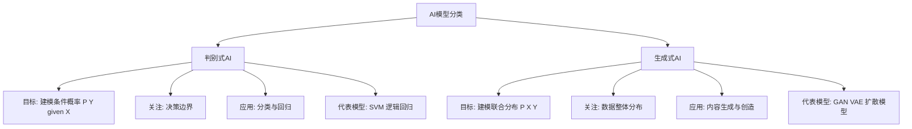

#### 1.6 在深度学习时代，这种区别是否依然清晰？
**传统区别**：在经典机器学习中，判别式和生成式的界限相对清晰。

**现代融合**：在深度学习中，这种界限变得模糊：
1. **Transformer架构**：既能用于判别任务（BERT），也能用于生成任务（GPT）
2. **多任务学习**：同一个模型可以同时完成判别和生成任务
3. **条件生成模型**：如条件GAN、条件扩散模型，结合了判别和生成的特点

#### 1.7 从概率图模型的角度如何理解？
**判别式模型**对应有向图：
```
X → Y
```
只建模从X到Y的条件依赖。

**生成式模型**对应有向图：
```
Y → X₁ → X₂ → ... → Xₙ
```
建模完整的生成过程，X的各个维度在给定Y的条件下独立。

#### 1.8 在实际工程中如何选择？
**选择判别式模型当**：
1. 任务明确是分类或回归
2. 计算资源有限
3. 需要快速推理
4. 标注数据充足

**选择生成式模型当**：
1. 需要生成新内容
2. 数据分布复杂需要建模
3. 有大量未标注数据可用
4. 需要数据增强或补全

#### 1.9 两者在评估指标上有何不同？
**判别式模型评估**：
- 准确率、精确率、召回率、F1分数
- AUC-ROC曲线
- 均方误差（MSE）、平均绝对误差（MAE）

**生成式模型评估**：
- 困惑度（Perplexity）
- BLEU、ROUGE（文本生成）
- FID分数（图像生成）
- 多样性、保真度指标

#### 1.10 未来发展趋势是什么？
**融合趋势**：
1. **生成式判别模型**：如扩散模型用于分类
2. **判别式指导生成**：如使用分类器指导生成过程
3. **统一架构**：如Transformer的统一序列建模能力

**标准答案：**

**【基本原理】**
预测/判别式AI与生成式AI的根本区别在于它们对概率分布建模的不同视角。判别式模型直接学习输入到输出的映射关系，而生成式模型学习数据的完整联合分布。

**【回答模板】**
* **判别式AI**：关注条件概率 $P(Y|X)$，直接学习如何根据输入 $X$ 预测输出 $Y$。它像一个"分类专家"，专注于找到最佳的决策边界。
* **生成式AI**：关注联合概率 $P(X,Y)$，学习数据是如何生成的。它像一个"数据创造者"，能够模拟真实数据的分布并生成新的样本。

**【深入理解】**
1. **哲学差异**：
   - 判别式：回答"这是什么？"（What is this?）
   - 生成式：回答"这可能是怎么产生的？"（How could this be generated?）

2. **数学本质**：
   - 判别式：最小化预测误差 $\min \mathbb{E}[L(Y, f(X))]$
   - 生成式：最大化似然 $\max \mathbb{E}[\log P(X,Y)]$

3. **能力范围**：
   - 判别式：擅长区分、分类、预测
   - 生成式：擅长创造、模拟、理解数据本质

4. **数据利用**：
   - 判别式：主要依赖标注数据
   - 生成式：能利用未标注数据，学习更丰富的表示

**现代视角下的融合：**
在深度学习时代，这种区分逐渐模糊。以Transformer为例：
- **BERT**：本质是判别式，通过掩码语言建模学习表示
- **GPT**：本质是生成式，通过自回归生成学习语言模型
- **扩散模型**：既是生成式（生成图像），也可用于判别任务（分类）

**实践建议：**
1. **明确任务目标**：如果是分类、检测、回归，优先考虑判别式方法
2. **考虑数据情况**：如果标注数据少但未标注数据多，生成式方法可能更有优势
3. **评估资源约束**：生成式模型通常需要更多计算资源和时间
4. **结合使用**：现代实践中常结合两者，如使用生成式模型进行数据增强，然后用判别式模型进行分类

**总结：**
判别式AI和生成式AI代表了AI研究的两个基本范式。判别式方法更直接、高效，适合明确的预测任务；生成式方法更全面、强大，适合创造性任务和对数据本质的理解。随着技术的发展，两者的界限正在模糊，未来可能会出现更多融合两种优势的统一架构。

---

### 2. 什么是大语言模型？LLM是如何训练的？

#### 2.1 什么是大语言模型（LLM）？
**大语言模型**是基于Transformer架构的深度学习模型，通过在海量文本数据上训练，学习语言的统计规律和语义表示。其核心特点是：
- **规模巨大**：参数量通常在数十亿到数万亿之间
- **能力强**：能够理解和生成自然语言
- **通用性**：通过预训练获得广泛的语言理解能力

#### 2.2 LLM的基本架构是什么？
LLM通常基于**Transformer解码器架构**，主要组件包括：
1. **词嵌入层**：将输入token转换为向量表示
2. **多层Transformer块**：每层包含：
   - 多头自注意力机制
   - 前馈神经网络
   - 层归一化
   - 残差连接
3. **输出层**：将隐藏状态转换为词汇表上的概率分布

**LLM架构示意图：**
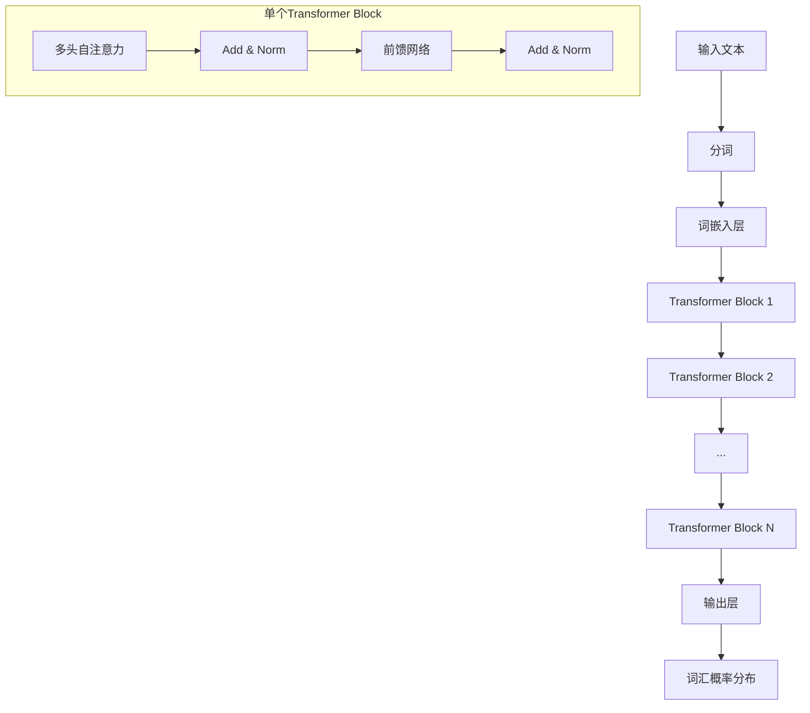

#### 2.3 LLM训练的第一阶段：预训练（Pre-training）
**目标**：在大规模无标注文本数据上学习通用的语言表示

**训练方法**：
1. **自监督学习**：从文本自身构造监督信号
2. **语言建模目标**：预测下一个token
3. **损失函数**：交叉熵损失

**数学表示**：
对于文本序列 $x_1, x_2, ..., x_T$，最大化似然：
$$ \mathcal{L}_{\text{pre-train}} = -\sum_{t=1}^{T} \log P(x_t | x_{<t}; \theta) $$

**训练数据**：
- 网页数据（Common Crawl）
- 书籍、学术论文
- 代码、对话记录
- 多语言文本

#### 2.4 预训练中的关键技术有哪些？
1. **因果注意力掩码**：确保每个位置只能看到前面的token
2. **位置编码**：为模型提供序列位置信息（如RoPE）
3. **缩放点积注意力**：$\text{Attention}(Q,K,V) = \text{softmax}\left(\frac{QK^T}{\sqrt{d_k}}\right)V$
4. **梯度累积**：处理大批次训练
5. **混合精度训练**：使用float16加速训练

#### 2.5 LLM训练的第二阶段：有监督微调（Supervised Fine-tuning, SFT）
**目标**：使模型适应特定任务或遵循指令

**训练方法**：
1. **指令-响应对数据**：人工编写的示范数据
2. **序列到序列训练**：给定指令，生成正确响应
3. **损失函数**：仅计算响应部分的交叉熵损失

**数学表示**：
对于指令 $I$ 和响应 $R$：
$$ \mathcal{L}_{\text{SFT}} = -\sum_{t=1}^{|R|} \log P(r_t | I, r_{<t}; \theta) $$

#### 2.6 LLM训练的第三阶段：基于人类反馈的强化学习（RLHF）
**目标**：使模型的输出更符合人类偏好

**训练流程**：
1. **奖励模型训练**：
   - 收集人类对模型输出的偏好数据
   - 训练一个奖励模型 $R_\phi(x,y)$ 来预测人类偏好
   
2. **策略优化**：
   - 使用PPO算法优化语言模型策略 $\pi_\theta$
   - 最大化奖励同时控制与原始模型的偏离

**优化目标**：
$$ \max_{\theta} \mathbb{E}_{x \sim \mathcal{D}, y \sim \pi_\theta(\cdot|x)} [R_\phi(x,y)] - \beta \text{KL}(\pi_\theta || \pi_{\text{ref}}) $$

#### 2.7 训练过程中的关键挑战是什么？
1. **计算资源**：需要数千个GPU的集群训练数月
2. **数据质量**：需要高质量、多样化的训练数据
3. **稳定性**：大规模训练容易遇到数值不稳定
4. **评估**：如何有效评估模型能力
5. **对齐**：确保模型输出安全、有益、诚实

#### 2.8 训练基础设施要求是什么？
**硬件**：
- GPU集群（A100/H100）
- 高速网络互联（NVLink, InfiniBand）
- 大规模存储系统

**软件**：
- 分布式训练框架（DeepSpeed, Megatron-LM）
- 混合精度训练
- 梯度检查点
- 模型并行、数据并行

#### 2.9 训练流程的完整示意图
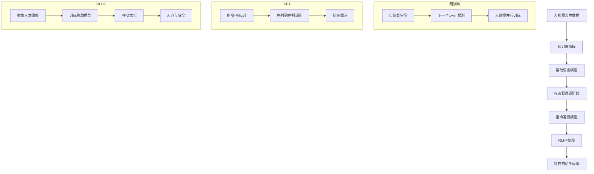

#### 2.10 现代LLM训练的最佳实践
1. **数据质量优先**：精心清洗和筛选训练数据
2. **渐进式训练**：从小规模开始，逐步扩大
3. **多阶段训练**：预训练 → SFT → RLHF
4. **持续评估**：在各个阶段进行全面的评估
5. **安全对齐**：从一开始就考虑安全性

**标准答案：**

**【基本原理】**
大语言模型是基于Transformer架构的深度学习模型，通过在海量文本数据上进行多阶段训练，获得理解和生成自然语言的能力。其训练过程是一个系统工程，涉及数据、算法、计算资源的复杂协调。

**【回答模板】**
* **大语言模型**：是基于Transformer架构的大规模神经网络，通过自监督学习从海量文本中学习语言规律，能够理解和生成自然语言。
* **LLM训练**：通常分为三个阶段：1) 预训练学习通用语言表示；2) 有监督微调适应特定任务；3) 基于人类反馈的强化学习使输出符合人类偏好。

**【深入理解】**
1. **预训练的本质**：
   预训练是让模型"读书"的过程。通过下一个token预测任务，模型学习到：
   - 词汇的语义和语法关系
   - 事实知识的世界模型
   - 逻辑推理的基本模式
   - 不同领域的专业知识

2. **微调的必要性**：
   预训练模型虽然知识丰富，但不会主动遵循指令。微调教会模型：
   - 如何理解并执行用户指令
   - 如何以对话形式交互
   - 如何完成特定领域任务

3. **RLHF的重要性**：
   单纯模仿数据可能产生有害输出。RLHF确保：
   - 输出有帮助、无害、诚实
   - 符合人类价值观和偏好
   - 避免偏见和歧视

**训练技术细节：**
1. **数据工程**：
   - 数据来源多样化（网页、书籍、代码等）
   - 数据清洗和去重
   - 质量过滤和毒性检测
   - 多语言平衡

2. **优化策略**：
   - 自适应优化器（AdamW）
   - 学习率调度（余弦衰减）
   - 梯度裁剪和累积
   - 权重衰减和dropout

3. **分布式训练**：
   - 数据并行：分割批次到不同GPU
   - 模型并行：分割模型层到不同GPU
   - 流水线并行：分割模型到多个阶段
   - 张量并行：分割注意力计算

**评估与监控：**
1. **训练监控**：
   - 损失曲线收敛情况
   - 梯度范数稳定性
   - 激活值统计分布
   - 内存使用效率

2. **能力评估**：
   - 语言理解（GLUE, SuperGLUE）
   - 常识推理（HellaSwag, PIQA）
   - 数学能力（GSM8K, MATH）
   - 代码生成（HumanEval）

**未来趋势：**
1. **更高效的训练**：减少计算成本和碳排放
2. **多模态扩展**：结合视觉、音频等多模态信息
3. **专业化发展**：针对特定领域优化
4. **开源与民主化**：降低训练门槛，促进创新

**总结：**
LLM的训练是一个复杂但系统化的过程，从海量数据中提取知识，通过多阶段优化使其成为有用的AI助手。这一过程不仅需要先进的算法，还需要大规模的计算基础设施和精细的工程实践。

---

### 3. 语言模型中的"标记"是什么？

#### 3.1 什么是标记（Token）的基本定义？
**标记**是语言模型处理文本的基本单位，是将连续文本分割成离散片段的结果。它类似于人类语言中的"词"或"字"，但更灵活，可以是一个完整的词、词的一部分、单个字符甚至子词单元。

#### 3.2 为什么需要标记化（Tokenization）？
1. **计算效率**：直接处理字符计算成本太高
2. **语义表示**：词级别的表示能更好地捕捉语义
3. **词汇表管理**：固定大小的词汇表便于模型处理
4. **处理未知词**：通过子词分解处理未见过的词

#### 3.3 常见的标记化方法有哪些？
1. **基于词的标记化**：
   - 优点：语义明确
   - 缺点：词汇表庞大，无法处理未知词
   - 示例："I love machine learning" → ["I", "love", "machine", "learning"]

2. **基于字符的标记化**：
   - 优点：词汇表极小（26个字母+标点）
   - 缺点：序列过长，语义信息稀疏
   - 示例："cat" → ["c", "a", "t"]

3. **子词标记化（现代主流）**：
   - 平衡了词和字符的优点
   - 常用算法：Byte Pair Encoding (BPE), WordPiece, Unigram

#### 3.4 BPE（Byte Pair Encoding）算法如何工作？
**BPE算法步骤**：
1. 初始化词汇表为所有单个字符
2. 统计所有相邻符号对的频率
3. 合并频率最高的符号对，加入词汇表
4. 重复步骤2-3直到达到目标词汇表大小

**示例**：
初始：l o w e r
合并"lo" → lo w e r
合并"low" → low e r
合并"er" → low er

#### 3.5 标记化对模型性能有什么影响？
1. **词汇表大小**：
   - 太小：序列过长，计算效率低
   - 太大：参数过多，容易过拟合
   - 典型范围：30k-100k

2. **标记长度**：
   - 短标记：信息密度高，但序列长
   - 长标记：序列短，但可能失去语义细节

3. **多语言支持**：
   - 需要处理不同语言的字符集
   - 平衡不同语言的表示比例

#### 3.6 标记ID和嵌入向量是什么关系？
1. **标记ID**：每个标记在词汇表中的整数索引
2. **嵌入查找**：通过嵌入矩阵将ID转换为向量
3. **数学表示**：$E \in \mathbb{R}^{V \times d}$，其中$V$是词汇表大小，$d$是嵌入维度

**处理流程**：
```
文本 → 标记化 → 标记序列 → 标记ID → 嵌入向量 → 模型输入
```

#### 3.7 特殊标记有哪些类型？
1. **开始标记**：`<s>`或`[CLS]`，表示序列开始
2. **结束标记**：`</s>`或`[SEP]`，表示序列结束
3. **填充标记**：`[PAD]`，用于统一序列长度
4. **未知标记**：`[UNK]`，表示词汇表中不存在的词
5. **掩码标记**：`[MASK]`，用于掩码语言建模

#### 3.8 标记化的挑战和解决方案
**挑战1：多义词处理**
- 问题：同一个词在不同语境中有不同含义
- 解决方案：上下文感知的表示（如BERT）

**挑战2：语言差异**
- 问题：不同语言的结构差异大
- 解决方案：多语言词汇表，SentencePiece算法

**挑战3：领域适应**
- 问题：专业术语和领域特定词汇
- 解决方案：领域特定的词汇表扩展

#### 3.9 标记化流程示意图
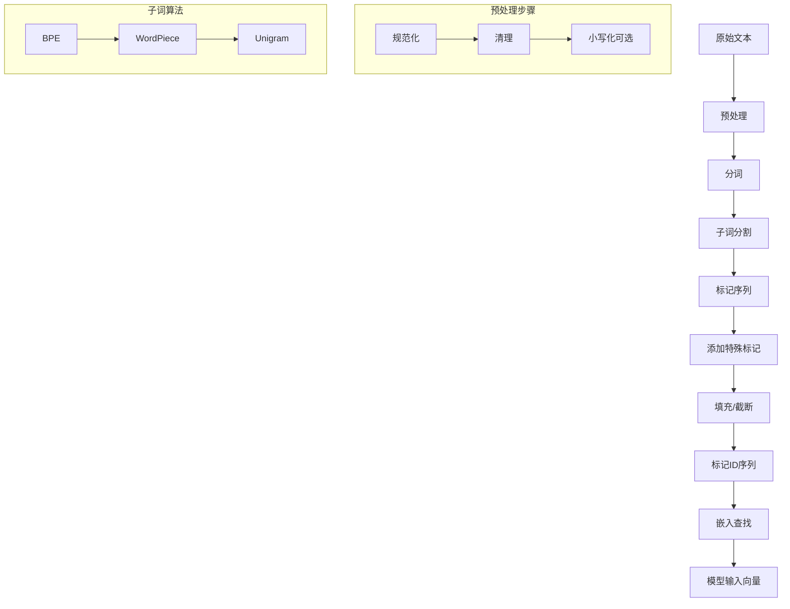

**标准答案：**

**【基本原理】**
标记是语言模型处理文本的基本离散单元，通过标记化过程将连续文本转换为模型可处理的数字序列。标记化是连接自然语言和神经网络表示的关键桥梁。

**【回答模板】**
* **标记**：是文本处理的基本单位，通过标记化算法将文本分割成离散片段，每个片段对应词汇表中的一个条目。
* **作用**：1) 将文本转换为数字表示；2) 管理词汇表大小；3) 处理未知词汇；4) 支持多语言处理。

**【深入理解】**
1. **标记化的本质**：
   标记化是在**信息压缩**和**语义保留**之间的权衡：
   - 字符级：信息无损但效率低
   - 词级：语义明确但灵活性差
   - 子词级：平衡两者，是现代LLM的主流选择

2. **技术细节**：
   - **BPE算法**：从字符开始，逐步合并高频符号对
   - **WordPiece**：类似BPE，但基于概率而非频率
   - **SentencePiece**：支持无空格语言（如中文、日文）
   - **Unigram**：基于概率模型选择最优分割

3. **实际考虑**：
   - **词汇表大小**：通常32k-100k，平衡效率和表示能力
   - **序列长度**：影响计算复杂度和内存使用
   - **多语言支持**：需要处理不同语言的字符编码和分词规则

**标记化对模型的影响：**
1. **效率影响**：
   - 更长的标记序列 → 更高的计算成本
   - 更大的词汇表 → 更多的嵌入参数

2. **质量影响**：
   - 不合理的分割可能破坏语义
   - 无法处理的标记会退化为`[UNK]`，损失信息

3. **语言特性**：
   - 英语等空格分隔语言相对简单
   - 中文等无空格语言需要特殊处理
   - 黏着语（如土耳其语）需要处理丰富的词形变化

**现代实践：**
1. **标准化工具**：
   - HuggingFace Tokenizers库
   - Tiktoken（OpenAI）
   - SentencePiece（Google）

2. **最佳实践**：
   - 使用与预训练模型相同的标记化器
   - 保持标记化一致性
   - 处理边缘情况和特殊字符

**总结：**
标记化是LLM流水线的第一步，也是至关重要的一步。好的标记化策略能显著提升模型性能，而不当的标记化可能导致信息损失和性能下降。理解标记化的原理和实践对于有效使用和开发语言模型至关重要。

---

### 4. Transformer架构是什么？它在LLM中是如何使用的？

#### 4.1 Transformer架构的基本组成是什么？
**Transformer**是一种基于自注意力机制的神经网络架构，由Vaswani等人在2017年提出。其核心组件包括：

1. **编码器-解码器结构**（原始版本）
2. **自注意力机制**：计算序列内部依赖关系
3. **前馈神经网络**：进行非线性变换
4. **残差连接和层归一化**：稳定训练过程
5. **位置编码**：为模型提供序列位置信息

#### 4.2 自注意力机制如何工作？
**计算步骤**：
1. 输入向量通过三个权重矩阵得到$Q,K,V$
2. 计算注意力分数：$\text{Attention}(Q,K,V) = \text{softmax}\left(\frac{QK^T}{\sqrt{d_k}}\right)V$
3. 多头注意力：并行计算多个注意力头，然后拼接

**数学表示**：
$$ \text{MultiHead}(Q,K,V) = \text{Concat}(\text{head}_1, ..., \text{head}_h)W^O $$
其中 $\text{head}_i = \text{Attention}(QW_i^Q, KW_i^K, VW_i^V)$

#### 4.3 Transformer中的位置编码为什么重要？
**问题**：自注意力机制本身是排列等变的，不包含位置信息

**解决方案**：
1. **绝对位置编码**：为每个位置分配固定向量
   - 正弦余弦编码：$PE_{(pos,2i)} = \sin(pos/10000^{2i/d})$
   - 可学习的位置嵌入

2. **相对位置编码**：编码位置之间的相对关系
   - RoPE（旋转位置编码）：现代LLM常用
   - ALiBi（注意力线性偏置）

#### 4.4 Transformer在LLM中的具体使用方式
**GPT系列（解码器-only）**：
1. 仅使用Transformer解码器部分
2. 因果注意力掩码：确保每个位置只能看到前面的token
3. 自回归生成：逐个预测下一个token

**BERT系列（编码器-only）**：
1. 仅使用Transformer编码器部分
2. 双向注意力：每个位置能看到整个序列
3. 掩码语言建模：预测被掩码的token

#### 4.5 Transformer架构示意图
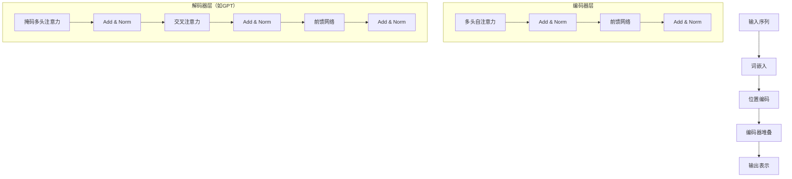

#### 4.6 Transformer在LLM训练中的关键作用
1. **并行计算**：相比RNN，可以并行处理整个序列
2. **长距离依赖**：任意两个位置直接连接，有效捕捉长距离关系
3. **可扩展性**：通过堆叠更多层和增加注意力头来扩展模型能力

#### 4.7 现代LLM对Transformer的改进
1. **架构简化**：
   - 移除编码器-解码器交叉注意力
   - 使用纯解码器架构（GPT系列）
   - 简化位置编码（RoPE）

2. **计算优化**：
   - FlashAttention：减少内存访问
   - 稀疏注意力：降低计算复杂度
   - 混合精度训练

3. **规模化扩展**：
   - 增加模型深度和宽度
   - 扩展上下文长度
   - 多模态扩展

#### 4.8 Transformer在推理阶段的工作流程
**自回归生成**：
```
输入: "今天天气"
步骤1: 预测下一个token → "很"
步骤2: 输入"今天天气很" → 预测"好"
步骤3: 输入"今天天气很好" → 预测"。"
输出: "今天天气很好。"
```

**批处理优化**：
1. KV缓存：缓存先前计算的$K,V$矩阵
2. 增量解码：仅计算新token的注意力
3. 推测解码：同时生成多个候选

#### 4.9 Transformer的局限性及解决方案
**局限性1：计算复杂度$O(n^2)$**
- 问题：序列长度增加时计算成本急剧上升
- 解决方案：稀疏注意力、线性注意力、状态空间模型

**局限性2：位置编码外推**
- 问题：训练时未见的长序列位置编码失效
- 解决方案：RoPE外推、NTK-aware缩放

**局限性3：内存占用大**
- 问题：注意力矩阵占用大量显存
- 解决方案：FlashAttention、梯度检查点

#### 4.10 Transformer在LLM生态系统中的地位
**核心地位**：
1. **基础架构**：几乎所有现代LLM都基于Transformer
2. **标准化组件**：形成了统一的模型设计范式
3. **研究平台**：便于比较不同方法的有效性

**生态系统**：
1. **开源实现**：PyTorch、TensorFlow官方支持
2. **优化库**：DeepSpeed、Megatron-LM
3. **应用框架**：LangChain、LlamaIndex

**标准答案：**

**【基本原理】**
Transformer是一种基于自注意力机制的神经网络架构，彻底改变了序列建模领域。在LLM中，它通过并行计算和全局依赖建模，实现了高效的语言理解和生成能力。

**【回答模板】**
* **Transformer架构**：由编码器和解码器组成的神经网络，核心是自注意力机制，能够并行处理序列并捕捉长距离依赖关系。
* **在LLM中的使用**：现代LLM主要使用Transformer解码器部分，通过因果注意力实现自回归语言建模，支持大规模并行训练和高效推理。

**【深入理解】**
1. **架构创新**：
   Transformer的关键创新在于**完全依赖注意力机制**，摒弃了循环和卷积结构：
   - **并行性**：所有位置同时计算，训练速度大幅提升
   - **全局连接**：任意两个位置直接交互，有效建模长距离依赖
   - **可解释性**：注意力权重可视化为模型决策提供洞见

2. **在LLM中的具体实现**：
   **GPT系列架构**：
   ```
   输入 → 词嵌入 → 位置编码 → [Transformer块 × N] → 输出投影 → 词汇概率
   
   单个Transformer块：
   输入 → 层归一化 → 多头因果注意力 → 残差连接 → 
   层归一化 → 前馈网络 → 残差连接 → 输出
   ```

3. **关键技术组件**：
   - **多头注意力**：$h$个独立的注意力头学习不同表示子空间
   - **前馈网络**：两层MLP提供非线性变换能力
   - **残差连接**：$x_{l+1} = x_l + F(x_l)$，缓解梯度消失
   - **层归一化**：稳定训练，加速收敛

**Transformer在LLM训练中的优势：**
1. **训练效率**：
   - 相比RNN的$O(n)$序列计算，Transformer可并行处理整个序列
   - 支持大规模数据并行和模型并行
   - 梯度传播路径短，训练稳定

2. **表示能力**：
   - 每个token都能直接访问序列中所有其他token的信息
   - 多头机制学习丰富的交互模式
   - 深度堆叠实现复杂的特征抽象

3. **扩展性**：
   - 通过增加层数、隐藏维度和注意力头数平滑扩展
   - 支持从数百万到数万亿参数的大规模模型
   - 架构统一便于算法和工程优化

**现代改进和变体：**
1. **高效注意力**：
   - **FlashAttention**：通过分块计算减少内存访问
   - **稀疏注意力**：只计算重要的注意力连接
   - **线性注意力**：近似注意力计算为线性复杂度

2. **位置编码演进**：
   - **RoPE**：通过旋转矩阵编码相对位置，支持长度外推
   - **ALiBi**：为注意力分数添加线性偏置，无需显式位置编码
   - **NTK-aware缩放**：改进RoPE的长序列外推能力

3. **架构简化**：
   - **纯解码器架构**：GPT系列的成功验证了简化架构的有效性
   - **移除LayerNorm偏置**：减少参数，提高数值稳定性
   - **SwiGLU激活函数**：改进前馈网络表达能力

**实践应用中的考虑：**
1. **内存优化**：
   - KV缓存加速自回归生成
   - 梯度检查点节省显存
   - 混合精度训练平衡精度和速度

2. **推理优化**：
   - 动态批处理提高吞吐量
   - 推测解码减少生成步数
   - 量化压缩减小模型大小

3. **部署挑战**：
   - 长序列处理的内存瓶颈
   - 低延迟要求下的优化
   - 多GPU分布式推理

**总结：**
Transformer不仅是LLM的技术基础，更是推动整个AI领域发展的关键创新。其优雅的架构设计、强大的表示能力和出色的可扩展性，使其成为构建大规模语言模型的理想选择。随着研究的深入，Transformer仍在不断演进，为更强大、更高效的AI系统奠定基础。

---

### 5. 解释Encoder-only、Decoder-only、Encoder-Decoder架构的区别。

#### 5.1 三种架构的基本定义是什么？
**Encoder-only架构**：只包含Transformer编码器部分，专注于理解和表示输入序列。

**Decoder-only架构**：只包含Transformer解码器部分，专注于自回归生成输出序列。

**Encoder-Decoder架构**：同时包含编码器和解码器，用于序列到序列的转换任务。

#### 5.2 从组件角度看三者差异
**Encoder-only（如BERT）**：
- 多头自注意力：双向，每个位置能看到整个序列
- 前馈网络：每个位置独立处理
- 输出：每个输入位置的上下文表示

**Decoder-only（如GPT）**：
- 掩码多头注意力：因果的，每个位置只能看到前面位置
- 前馈网络：每个位置独立处理  
- 输出：下一个token的概率分布

**Encoder-Decoder（如T5、BART）**：
- 编码器：双向自注意力处理输入
- 解码器：因果自注意力处理输出，交叉注意力连接编码器输出
- 输出：基于输入序列生成输出序列

#### 5.3 注意力机制的区别
**编码器注意力**：
- 类型：双向自注意力
- 掩码：无（或全1掩码）
- 目的：建立输入序列内部的全局依赖

**解码器注意力**：
- 类型：因果自注意力
- 掩码：下三角掩码（防止看到未来信息）
- 目的：建立输出序列的自回归依赖

**交叉注意力**（Encoder-Decoder特有）：
- 类型：解码器到编码器的注意力
- 目的：将输入信息融合到输出生成中

#### 5.4 三种架构示意图对比
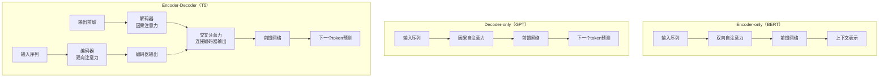

#### 5.5 训练目标和损失函数差异
**Encoder-only**：
- 目标：掩码语言建模（MLM）
- 损失：$L = -\sum_{i \in M} \log P(x_i | x_{\backslash M})$
- 示例：BERT预测被掩码的token

**Decoder-only**：
- 目标：自回归语言建模
- 损失：$L = -\sum_{t=1}^T \log P(x_t | x_{<t})$
- 示例：GPT预测下一个token

**Encoder-Decoder**：
- 目标：序列到序列建模
- 损失：$L = -\sum_{t=1}^{T_y} \log P(y_t | x, y_{<t})$
- 示例：T5翻译、摘要生成

#### 5.6 适用任务类型对比
**Encoder-only适合**：
- 文本分类（情感分析、主题分类）
- 命名实体识别
- 句子相似度计算
- 掩码填充任务

**Decoder-only适合**：
- 文本生成（故事创作、代码生成）
- 对话系统
- 文本补全
- 指令遵循

**Encoder-Decoder适合**：
- 机器翻译
- 文本摘要
- 问答系统
- 文本风格转换

#### 5.7 推理过程的差异
**Encoder-only推理**：
- 输入：完整序列
- 处理：一次性编码整个序列
- 输出：每个位置的表示或分类结果

**Decoder-only推理**：
- 输入：前缀序列
- 处理：自回归逐个生成token
- 输出：生成的完整序列

**Encoder-Decoder推理**：
- 阶段1：编码器处理输入序列
- 阶段2：解码器自回归生成输出，每次关注编码器输出

#### 5.8 参数效率和计算复杂度
**参数数量**：
- Encoder-only：中等，专注于理解
- Decoder-only：较大，需要生成能力
- Encoder-Decoder：最大，两套参数

**计算复杂度**：
- Encoder-only：$O(n^2)$，n为输入长度
- Decoder-only：$O(m^2)$，m为生成长度（自回归）
- Encoder-Decoder：$O(n^2 + m^2 + n \times m)$

#### 5.9 实际应用中的选择考量
**选择Encoder-only当**：
1. 任务主要是理解而非生成
2. 需要双向上下文信息
3. 计算资源有限
4. 有大量标注数据

**选择Decoder-only当**：
1. 任务主要是生成内容
2. 需要零样本或少样本学习
3. 追求模型统一性和简化
4. 关注推理效率

**选择Encoder-Decoder当**：
1. 明确的输入-输出映射任务
2. 需要精确的条件生成
3. 任务复杂度高，需要分离理解与生成
4. 有配对的数据（如翻译对）

#### 5.10 历史演进和现状
**早期**：Encoder-Decoder主导（机器翻译时代）

**中期**：Encoder-only崛起（BERT引领预训练时代）

**当前**：Decoder-only主导（GPT系列统一架构）

**未来趋势**：可能回归更平衡的架构或出现新范式

**标准答案：**

**【基本原理】**
三种架构代表了Transformer模型的不同设计哲学：Encoder-only专注于理解，Decoder-only专注于生成，Encoder-Decoder平衡两者用于转换任务。选择哪种架构取决于具体任务需求和资源约束。

**【回答模板】**
* **Encoder-only**：双向理解架构，适合需要全局上下文感知的任务，如分类、NER。
* **Decoder-only**：因果生成架构，适合自回归生成任务，如文本创作、对话。
* **Encoder-Decoder**：理解-生成联合架构，适合序列转换任务，如翻译、摘要。

**【深入理解】**
1. **设计哲学差异**：
   - **Encoder-only**：强调"理解力"，通过双向注意力全面把握输入语义
   - **Decoder-only**：强调"生成力"，通过因果注意力确保生成的一致性和连贯性
   - **Encoder-Decoder**：强调"转换力"，分离理解和生成阶段，实现精确的条件生成

2. **注意力模式对比**：
   ```
   Encoder注意力：     Decoder注意力：     Encoder-Decoder交叉注意力：
   [1,1,1,1,1]         [1,0,0,0,0]        解码器位置 → 所有编码器位置
   [1,1,1,1,1]         [1,1,0,0,0]
   [1,1,1,1,1]         [1,1,1,0,0]
   [1,1,1,1,1]         [1,1,1,1,0]
   [1,1,1,1,1]         [1,1,1,1,1]
   ```

3. **训练范式差异**：
   - **Encoder-only**：预训练+微调，通过MLM学习丰富表示
   - **Decoder-only**：纯自回归预训练，统一的下一个token预测
   - **Encoder-Decoder**：条件生成预训练，学习输入到输出的映射

**实际工程考量：**
1. **部署复杂度**：
   - Encoder-only：最简单，一次性计算
   - Decoder-only：需要KV缓存优化自回归
   - Encoder-Decoder：最复杂，两阶段流水线

2. **内存使用**：
   - Encoder-only：静态内存，输入确定后不变
   - Decoder-only：动态增长，随生成长度增加
   - Encoder-Decoder：混合模式，编码阶段静态，解码阶段动态

3. **延迟特性**：
   - Encoder-only：低延迟，单次前向传播
   - Decoder-only：token级延迟，依赖生成长度
   - Encoder-Decoder：编码延迟+token级解码延迟

**选择指南：**
1. **任务驱动选择**：
   - 理解任务 → Encoder-only
   - 生成任务 → Decoder-only  
   - 转换任务 → Encoder-Decoder

2. **数据驱动选择**：
   - 有大量配对数据 → Encoder-Decoder
   - 只有文本数据 → Decoder-only
   - 有任务标注数据 → Encoder-only

3. **资源驱动选择**：
   - 计算受限 → Encoder-only
   - 内存充足 → Decoder-only
   - 追求最佳效果 → Encoder-Decoder

**总结：**
三种架构各有优劣，反映了AI研究中对"理解"、"生成"和"转换"不同侧重点的探索。虽然当前Decoder-only在通用AI助手领域占据主导，但其他架构在特定领域仍有不可替代的价值。实际选择时应综合考虑任务需求、数据情况和资源约束。

---

### 6. 为什么目前LLM几乎全部采用Decoder-only架构？

#### 6.1 历史背景：从多样化到统一化
**早期探索期**（2018-2019）：
- BERT（Encoder-only）主导：在理解任务上表现优异
- GPT-2（Decoder-only）初显生成能力
- T5（Encoder-Decoder）试图统一所有NLP任务

**转折点**（2020-2021）：
- GPT-3证明Decoder-only的零样本能力
- 参数规模效应在Decoder-only上更明显
- 工程简化需求推动架构统一

#### 6.2 根本原因1：训练目标的统一性
**Decoder-only的训练目标最简单**：
- 单一目标：下一个token预测
- 自监督：无需人工标注
- 可扩展：数据规模无理论上限

对比：
- Encoder-only：需要设计掩码策略
- Encoder-Decoder：需要配对数据或构造任务

**数学简洁性**：
Decoder-only损失函数：$L = -\sum_{t=1}^T \log P(x_t | x_{<t})$
比Encoder-Decoder的$L = -\sum_{t=1}^{T_y} \log P(y_t | x, y_{<t})$更统一

#### 6.3 根本原因2：生成能力的天然优势
**自回归生成是LLM的核心能力**：
- 对话：需要连续生成响应
- 创作：需要连贯的文本生成
- 推理：需要逐步推导结论

**Decoder-only的因果注意力**：
- 天然支持自回归生成
- 训练和推理模式一致
- 无需额外的生成机制

#### 6.4 根本原因3：规模扩展的友好性
**参数效率**：
- Decoder-only：参数集中在生成能力
- Encoder-Decoder：参数分散在理解和生成
- 相同参数量下，Decoder-only生成能力更强

**计算效率**：
- 训练：纯Decoder架构更容易并行化
- 推理：KV缓存机制更高效
- 内存：无需存储编码器-解码器注意力矩阵

#### 6.5 根本原因4：零样本和少样本学习能力
**下一个token预测的通用性**：
- 任何任务都可以转化为文本生成
- 指令遵循通过提示工程实现
- 无需任务特定的输出头

**对比分析**：
- Encoder-only：需要微调适应新任务
- Encoder-Decoder：需要设计任务格式
- Decoder-only：通过提示直接适应

#### 6.6 根本原因5：工程实现的简化
**架构统一的好处**：
1. **代码简化**：一套代码支持所有任务
2. **基础设施统一**：优化策略通用
3. **部署标准化**：推理引擎简化
4. **维护成本低**：bug修复和优化集中

**训练流程简化**：
```
Decoder-only: 数据 → 预训练 → SFT → RLHF → 部署
Encoder-Decoder: 数据 → 任务构造 → 多目标预训练 → 任务微调 → 部署
```

#### 6.7 根本原因6：涌现能力的发现
**规模定律（Scaling Laws）**：
- Decoder-only的涌现能力与规模强相关
- 能力随参数、数据、计算量平滑增长
- 预测下一个token的任务最能体现规模效益

**涌现现象**：
- 代码生成
- 数学推理  
- 多语言理解
- 指令遵循

#### 6.8 根本原因7：多模态扩展的便利性
**统一序列建模**：
- 文本、图像、音频都可token化
- 相同的自回归生成框架
- 无需复杂的多模态融合机制

**示例**：
- 图像生成：DALL-E、Stable Diffusion基于类似思想
- 多模态理解：统一为序列到序列

#### 6.9 根本原因8：社区和生态系统的正反馈
**开源模型推动**：
- LLaMA、Falcon、MPT等主流开源模型都是Decoder-only
- 研究社区集中优化Decoder-only架构
- 工具链和最佳实践成熟

**商业应用驱动**：
- ChatGPT的成功验证了Decoder-only的实用性
- 企业投资集中在Decoder-only技术栈
- 市场需求推动架构统一

#### 6.10 架构选择演变示意图
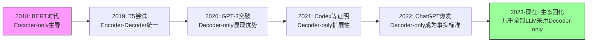

**标准答案：**

**【基本原理】**
Decoder-only架构成为LLM主流选择，是技术演进、工程实践和市场需求的综合结果。其核心优势在于训练目标的统一性、生成能力的天然优势、规模扩展的友好性，以及工程实现的简化。

**【回答模板】**
* **统一训练目标**：下一个token预测任务简单统一，无需复杂任务构造
* **天然生成能力**：因果注意力直接支持自回归生成，训练推理一致
* **规模扩展友好**：参数和计算效率高，涌现能力随规模平滑增长
* **工程实现简化**：架构统一降低开发、部署和维护成本

**【深入理解】**
1. **技术演进逻辑**：
   Decoder-only的胜利是"简单性战胜复杂性"的典型例证：
   - **BERT的复杂**：需要掩码策略、NSP任务、双向注意力
   - **T5的更复杂**：需要任务前缀、编码器-解码器协调
   - **GPT的简单**：只有下一个token预测，一切自然涌现

2. **经济学原理**：
   - **边际成本递减**：统一架构的研发和优化成本分摊到所有应用
   - **网络效应**：生态系统的正反馈强化了Decoder-only的主导地位
   - **路径依赖**：早期成功建立了难以撼动的技术标准

3. **认知科学视角**：
   Decoder-only模仿了人类语言的生成过程：
   - **增量生成**：像说话一样逐个词产出
   - **上下文依赖**：每个新词基于前面所有词
   - **错误纠正**：生成错误可以在后续生成中修正

**具体优势分析：**
1. **训练效率优势**：
   ```
   Decoder-only vs Encoder-Decoder训练对比：
   
   数据利用率：   100% vs 需要构造配对数据
   并行化程度：   高 vs 编码器-解码器协调开销
   目标一致性：   单一目标 vs 多目标平衡
   ```

2. **推理效率优势**：
   - **KV缓存**：Decoder-only的KV缓存机制高度优化
   - **内存访问**：注意力计算模式规律，便于硬件优化
   - **延迟可预测**：token级生成，延迟与输出长度线性相关

3. **能力扩展优势**：
   - **零样本学习**：通过提示直接激活能力
   - **多任务统一**：所有任务转化为文本生成
   - **持续学习**：通过继续预训练平滑扩展知识

**潜在局限和未来可能：**
1. **当前局限**：
   - 双向理解能力相对较弱
   - 长文档处理效率问题
   - 精确的条件生成不如Encoder-Decoder

2. **改进方向**：
   - 混合注意力模式（如双向+因果）
   - 更高效的位置编码
   - 架构创新（如Mamba的SSM）

3. **未来可能**：
   - 新架构可能挑战Decoder-only地位
   - 多模态需求可能推动架构演变
   - 硬件发展可能改变计算权衡

**总结：**
Decoder-only架构的统治地位是多重因素共同作用的结果：技术上的简洁优雅、工程上的高效实用、经济上的规模效应。虽然它可能不是所有任务的最优解，但其统一性和可扩展性使其成为构建通用AI助手的最佳选择。这种架构统一也推动了整个AI生态的快速发展，降低了技术门槛，加速了创新应用的出现。

---

### 7. 为什么Transformer需要位置编码？

#### 7.1 问题的本质：排列等变性
**Transformer的自注意力机制本质**：
- 输入：一组向量 $\{x_1, x_2, ..., x_n\}$
- 输出：每个位置的加权和 $y_i = \sum_j \text{attention}(x_i, x_j) \cdot x_j$
- 性质：如果打乱输入顺序，输出也会相应打乱，但内部关系不变

**数学表示**：
对于任意排列 $\pi$：
$$ \text{Attention}(x_{\pi(1)}, ..., x_{\pi(n)}) = \pi(\text{Attention}(x_1, ..., x_n)) $$

这意味着：**纯自注意力无法区分"猫追老鼠"和"老鼠追猫"**

#### 7.2 序列任务的位置敏感性
**自然语言的顺序重要性**：
1. **语法结构**：主语-谓语-宾语的顺序决定语义
2. **时间关系**：事件发生的先后顺序
3. **逻辑依赖**：前提在前，结论在后
4. **指代关系**：代词通常指代前面出现的名词

**示例对比**：
- "我爱机器学习" ≠ "机器学习爱我"
- "先吃饭后洗澡" ≠ "先洗澡后吃饭"
- "因为下雨，所以取消" ≠ "所以取消，因为下雨"

#### 7.3 位置编码的基本原理
**核心思想**：为每个位置注入唯一的位置信息

**两种主要方法**：
1. **绝对位置编码**：为每个位置分配固定向量
2. **相对位置编码**：编码位置之间的相对关系

#### 7.4 绝对位置编码的经典实现
**正弦余弦位置编码（原始Transformer）**：
$$ PE_{(pos,2i)} = \sin(pos / 10000^{2i/d}) $$
$$ PE_{(pos,2i+1)} = \cos(pos / 10000^{2i/d}) $$

**特性**：
1. **周期性**：不同频率的正弦波组合
2. **相对位置可学习**：$\text{PE}_{pos+k}$ 可以表示为 $\text{PE}_{pos}$ 的线性函数
3. **外推性**：可以处理比训练时更长的序列

**可视化理解**：
```
位置1: [sin(1/10000^0), cos(1/10000^0), sin(1/10000^2), cos(1/10000^2), ...]
位置2: [sin(2/10000^0), cos(2/10000^0), sin(2/10000^2), cos(2/10000^2), ...]
...
```

#### 7.5 相对位置编码的现代实现
**RoPE（旋转位置编码）**：
- 核心：通过旋转矩阵编码相对位置
- 公式：$f_q(x_m, m) = R_{\theta,m}W_qx_m$
- 优势：更好的长度外推能力

**ALiBi（注意力线性偏置）**：
- 核心：为注意力分数添加与相对距离成比例的偏置
- 公式：$\text{attention} = \text{softmax}(q_i k_j^T + m \cdot |i-j|)$
- 优势：无需训练位置嵌入，更好的泛化性

#### 7.6 位置编码的作用机制
**在注意力计算中的融合**：
1. **加性融合**：$h_i = \text{Attention}(x_i + p_i, x_j + p_j)$
2. **乘性融合**：通过旋转或相对偏置影响注意力分数
3. **分离处理**：位置信息作为额外的偏置项

**信息流示意图**：
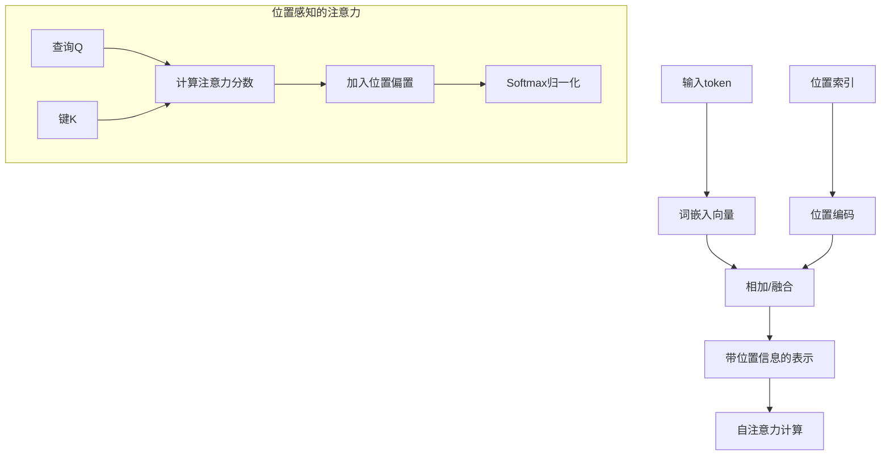

#### 7.7 为什么RNN/CNN不需要显式位置编码？
**RNN的隐式位置编码**：
- 循环结构：按顺序处理序列，自然包含位置信息
- 状态传递：$h_t = f(h_{t-1}, x_t)$，$h_t$ 隐含了位置$t$的信息

**CNN的隐式位置编码**：
- 卷积核：滑动窗口操作，局部位置关系通过核权重编码
- 池化层：位置信息在池化过程中部分保留

**对比分析**：
```
模型类型       位置信息编码方式       处理长距离依赖
RNN          隐式（顺序处理）       困难（梯度消失）
CNN          隐式（局部卷积）       需要深层堆叠
Transformer  显式（位置编码）       直接（全局注意力）
```

#### 7.8 位置编码的设计考量
**设计目标**：
1. **唯一性**：不同位置有不同的编码
2. **相对性**：能表示位置之间的相对关系
3. **外推性**：能处理训练时未见的序列长度
4. **效率**：计算和存储开销小

**权衡因素**：
- 正弦编码 vs 可学习编码
- 绝对位置 vs 相对位置
- 加法融合 vs 乘法融合

#### 7.9 位置编码的挑战和解决方案
**挑战1：长度外推（Length Extrapolation）**
- 问题：训练时最大长度$L_{train}$，推理时需要处理$L_{test} > L_{train}$
- 解决方案：RoPE外推、NTK-aware缩放、位置插值

**挑战2：长序列的数值稳定性**
- 问题：极长序列时位置编码值可能过大或过小
- 解决方案：归一化、截断、对数空间编码

**挑战3：多维度位置信息**
- 问题：图像、视频等多维数据需要2D/3D位置编码
- 解决方案：分离的维度编码、空间位置编码

#### 7.10 位置编码对模型性能的影响
**消融实验发现**：
1. **没有位置编码**：模型完全无法学习序列任务
2. **随机位置编码**：效果差，但优于没有编码
3. **正弦编码**：效果好，支持相对位置推理
4. **可学习编码**：训练更快，但外推能力差

**实际影响**：
- 翻译任务：位置编码质量影响长句翻译准确性
- 代码生成：影响括号匹配、缩进等结构信息
- 对话系统：影响对话历史的时序理解

**标准答案：**

**【基本原理】**
Transformer需要位置编码是因为其核心的自注意力机制本质上是排列等变的——它无法区分输入序列的顺序。位置编码为模型注入了必要的顺序信息，使其能够理解语言中的时序、语法和逻辑结构。

**【回答模板】**
* **根本原因**：自注意力机制对输入顺序不敏感，需要额外信息来区分"猫追老鼠"和"老鼠追猫"
* **解决方案**：通过位置编码为每个token添加位置信息，使模型能够理解序列中的顺序关系
* **关键作用**：1) 区分绝对位置；2) 编码相对距离；3) 支持长度外推；4) 保持平移不变性

**【深入理解】**
1. **数学本质**：
   位置编码解决了Transformer的**排列对称性**问题：
   ```
   没有位置编码：
   Attention([x1, x2, x3]) 和 Attention([x3, x1, x2]) 的输出只差一个排列
   
   有位置编码：
   Attention([x1+p1, x2+p2, x3+p3]) ≠ Attention([x3+p1, x1+p2, x2+p3])
   ```

2. **编码策略演进**：
   **第一代：绝对位置编码**
   - 正弦余弦编码：理论优美，支持相对位置推理
   - 可学习嵌入：简单有效，但外推能力有限
   
   **第二代：相对位置编码**
   - T5的相对位置偏置：在注意力分数中添加相对距离偏置
   - RoPE（旋转位置编码）：通过复数旋转编码相对位置
   - ALiBi（注意力线性偏置）：线性偏置，无需训练，泛化能力强

3. **在注意力机制中的具体实现**：
   **原始Transformer的加性融合**：
   $$ \text{Attention}(Q,K,V) = \text{softmax}\left(\frac{(X+E)W_Q((X+E)W_K)^T}{\sqrt{d_k}}\right)(X+E)W_V $$
   
   **RoPE的乘性融合**：
   $$ q_m = R_{\theta,m}W_qx_m, \quad k_n = R_{\theta,n}W_kx_n $$
   $$ \text{attention} = \text{softmax}(q_m^T k_n) $$

**位置编码的关键特性：**
1. **唯一性**：确保每个位置有独特的表示
2. **相对性**：位置m和n的编码关系应反映|m-n|
3. **有界性**：编码值不应无限增长
4. **确定性**：相同位置应有相同编码
5. **连续性**：相邻位置编码应相似

**不同类型任务的需求：**
1. **语言建模**：需要精确的相对位置信息
2. **机器翻译**：需要对齐源语言和目标语言的位置
3. **代码生成**：需要层次化的位置信息（缩进、括号）
4. **图像处理**：需要2D网格位置信息

**现代最佳实践：**
1. **主流选择**：RoPE已成为大多数LLM的标准
2. **外推技术**：NTK-aware缩放、YaRN、位置插值
3. **高效实现**：缓存位置编码，避免重复计算
4. **多模态扩展**：为不同模态设计专用位置编码

**位置编码的哲学意义：**
位置编码体现了AI中的一个深层问题：**如何让无状态的神经网络理解时间**。它连接了：
- **离散与连续**：将离散位置映射到连续空间
- **局部与全局**：通过相对位置编码传递全局结构
- **确定与随机**：确定性的编码支持不确定性的生成

**总结：**
位置编码是Transformer架构中看似简单但至关重要的组件。它不仅解决了模型对序列顺序的感知问题，还深刻影响了模型的泛化能力、外推性能和实际应用效果。随着研究的深入，位置编码从简单的加性嵌入发展到复杂的相对编码方案，反映了AI研究者对"位置"这一基本概念的不断深化理解。

---

### 8. CNNs和RNNs不使用位置嵌入。为什么Transformer需要位置嵌入？

#### 8.1 问题的核心：架构的本质差异
**关键洞察**：CNN和RNN通过其**架构设计**隐式编码了位置信息，而Transformer的**自注意力机制**本质上是排列不变的，需要显式的位置编码来注入顺序信息。

#### 8.2 RNN如何隐式编码位置信息？
**RNN的工作机制**：
- **顺序处理**：RNN按时间步逐个处理序列元素
- **隐藏状态传递**：$h_t = f(h_{t-1}, x_t)$
- **位置信息的累积**：隐藏状态$h_t$包含了从开始到位置$t$的所有历史信息

**数学解释**：
对于序列$x_1, x_2, ..., x_T$，第$t$个位置的输出：
$$ h_t = f(W_h h_{t-1} + W_x x_t + b) $$
其中$h_t$隐式编码了位置$t$的信息，因为：
1. $h_t$的计算依赖于$h_{t-1}$
2. $h_{t-1}$又依赖于$h_{t-2}$
3. 递归地，$h_t$包含了$x_1, x_2, ..., x_t$的所有信息

**位置敏感性示例**：
```
输入序列: "我 爱 机 器 学 习"
RNN处理:
h1 = f(初始状态, "我")
h2 = f(h1, "爱")  ← h2包含了"我"的信息
h3 = f(h2, "机")  ← h3包含了"我爱"的信息
...
```

#### 8.3 CNN如何隐式编码位置信息？
**CNN的工作机制**：
- **局部连接**：卷积核在输入上滑动，只关注局部区域
- **权重共享**：相同的卷积核应用于所有位置
- **位置通过感受野编码**：深层特征图的每个位置对应原始输入的特定区域

**位置信息的编码方式**：
1. **卷积操作的位置依赖性**：
   $$ y[i] = \sum_{k=0}^{K-1} w[k] \cdot x[i+k] $$
   输出$y[i]$直接对应输入$x$的特定位置$i$

2. **池化操作的位置保留**：
   - 最大池化：保留最强特征的位置信息
   - 平均池化：平滑位置信息但仍有局部性

3. **层次化位置编码**：
   ```
   原始序列: [x1, x2, x3, x4, x5, x6]
   第一层卷积(核大小3): [y1, y2, y3, y4] ← y1对应[x1,x2,x3]
   第二层卷积: [z1, z2] ← z1对应[y1,y2]对应[x1,x2,x3,x4]
   ```

#### 8.4 Transformer为什么需要显式位置编码？
**自注意力的排列等变性**：
- **数学性质**：对于任意排列$\pi$：
  $$ \text{Attention}(x_{\pi(1)}, ..., x_{\pi(n)}) = \pi(\text{Attention}(x_1, ..., x_n)) $$
- **物理意义**：打乱输入顺序只会打乱输出顺序，但内部关系不变

**具体示例**：
```
输入1: ["猫", "追", "老鼠"] → 注意力计算 → 输出表示
输入2: ["老鼠", "追", "猫"] → 注意力计算 → 输出表示

没有位置编码时，两个输入的内部表示关系完全相同，
只是输出顺序不同，无法区分语义差异。
```

#### 8.5 三种架构的位置信息处理对比表


#### 8.6 从计算图角度理解
**RNN的计算图**：
```
x1 → h1 → h2 → h3 → ... → hT
     ↑     ↑     ↑         ↑
     x2    x3    x4        xT
```
- 信息流动是**有向的**（从前到后）
- 位置通过**计算路径长度**编码

**CNN的计算图**：
```
[x1,x2,x3] → y1
[x2,x3,x4] → y2
[x3,x4,x5] → y3
```
- 位置通过**卷积核的偏移**编码
- 每个输出对应输入的**特定局部区域**

**Transformer的计算图**：
```
x1 ──┬───┬───┬───┐
     │   │   │   │
x2 ──┼───┼───┼───┤
     │   │   │   │
x3 ──┼───┼───┼───┤
     │   │   │   │
x4 ──┴───┴───┴───┘
```
- 所有位置**全连接**
- 没有固有的顺序信息

#### 8.7 位置信息的类型和需求
**绝对位置信息**：
- 需要：词性标注（句首通常是主语）
- RNN：通过时间步隐式提供
- CNN：通过特征图坐标隐式提供
- Transformer：需要显式编码

**相对位置信息**：
- 需要：依存关系解析（动词与宾语的距离）
- RNN：通过隐藏状态差异隐式编码
- CNN：通过感受野大小隐式编码  
- Transformer：需要显式编码（如RoPE）

**长距离位置关系**：
- RNN：难以建模（梯度消失）
- CNN：需要深层堆叠
- Transformer：直接建模，但需要位置编码支持

#### 8.8 为什么CNN/RNN的隐式编码对它们足够？
**RNN的适用场景**：
1. **强时序性任务**：语言建模、时间序列预测
2. **序列长度适中**：避免梯度消失问题
3. **因果依赖性**：未来不能影响过去

**CNN的适用场景**：
1. **局部模式识别**：图像特征、局部语法模式
2. **平移不变性需求**：相同模式在不同位置应有相同响应
3. **层次化特征学习**：从局部到全局的特征抽象

**Transformer的突破性需求**：
1. **并行计算**：需要打破RNN的顺序约束
2. **全局依赖建模**：需要超越CNN的局部视野
3. **长序列处理**：需要有效处理超长上下文

#### 8.9 从信息论角度分析
**位置信息的编码效率**：
- **RNN**：$O(T)$的时间复杂度编码位置
- **CNN**：$O(\log T)$的层次化编码
- **Transformer**：$O(1)$的直接编码（通过位置嵌入）

**位置信息的表示能力**：
```
模型类型       位置表示       处理复杂度       外推能力
RNN          隐式，累积      O(T)            差
CNN          隐式，局部      O(1) per layer  中等
Transformer  显式，直接      O(1)            好（依赖编码设计）
```

#### 8.10 现代视角：位置编码的演进意义
**从隐式到显式的哲学转变**：
1. **分离关注点**：将内容表示和位置表示解耦
2. **可解释性提升**：位置信息变得明确可分析
3. **灵活控制**：可以设计不同的位置编码策略

**位置编码带来的新能力**：
1. **长度外推**：处理比训练时更长的序列
2. **相对位置感知**：精确建模token之间的距离关系
3. **多维度位置**：支持2D/3D网格位置编码

**标准答案：**

**【基本原理】**
CNN和RNN不需要显式位置嵌入，因为它们的**架构设计**本身就隐式编码了位置信息：RNN通过顺序处理累积位置，CNN通过局部连接和感受野编码位置。而Transformer的**自注意力机制**本质上是排列等变的，对所有输入位置一视同仁，因此需要显式的位置编码来注入必要的顺序信息。

**【回答模板】**
* **RNN**：通过顺序处理和隐藏状态传递**隐式编码**位置信息，每个时间步的隐藏状态累积了之前所有位置的信息。
* **CNN**：通过卷积核的滑动窗口操作**隐式编码**局部位置关系，深层特征通过感受野编码全局位置。
* **Transformer**：自注意力机制是**排列等变**的，对输入顺序不敏感，需要**显式位置编码**来区分序列顺序。

**【深入理解】**
1. **架构本质的数学差异**：
   - **RNN**：$h_t = f(h_{t-1}, x_t)$ → 递归结构天然包含时序
   - **CNN**：$y[i] = \sum w[k] \cdot x[i+k]$ → 卷积操作与位置$i$绑定
   - **Transformer**：$\text{Attention}(Q,K,V) = \text{softmax}(QK^T/\sqrt{d})V$ → 对输入排列不变

2. **信息流动模式的对比**：
   ```
   RNN信息流：   单向，因果，随时间累积
   x1 → x2 → x3 → x4 → ... → xT
   
   CNN信息流：   局部，分层，通过感受野扩展
   [x1,x2,x3] → y1
   [x2,x3,x4] → y2  → [y1,y2] → z1
   
   Transformer信息流：全局，并行，全连接
   x1 ↔ x2 ↔ x3 ↔ x4 ↔ ... ↔ xT
   ```

3. **位置感知的机制差异**：
   **RNN的位置感知**：
   - 机制：通过**计算步骤数**编码位置
   - 优点：天然因果性，适合序列生成
   - 缺点：难以并行，长距离依赖问题
   
   **CNN的位置感知**：
   - 机制：通过**特征图坐标**编码位置
   - 优点：平移等变性，适合模式识别
   - 缺点：需要深层堆叠获取全局信息
   
   **Transformer的位置感知**：
   - 机制：需要**显式位置编码**
   - 优点：灵活可控，支持各种位置关系
   - 缺点：增加了设计复杂性

**历史演进视角：**
1. **RNN时代**（2014-2017）：
   - LSTM/GRU通过门控机制缓解梯度消失
   - 位置信息通过隐藏状态自然编码
   - 但并行化困难，训练速度慢

2. **CNN复兴**（2015-2018）：
   - 文本CNN证明局部模式的有效性
   - 位置通过卷积核偏移隐式编码
   - 但需要精心设计感受野大小

3. **Transformer革命**（2017-现在）：
   - 彻底解耦内容和位置表示
   - 位置编码从简单加性发展到复杂相对编码
   - 支持前所未有的并行性和长距离建模

**实际工程意义：**
1. **训练效率**：
   - RNN：顺序计算，难以并行
   - CNN：局部并行，但需要多层
   - Transformer：完全并行，但需要位置编码

2. **内存使用**：
   - RNN：$O(T)$的序列长度内存
   - CNN：$O(T)$的激活值内存
   - Transformer：$O(T^2)$的注意力矩阵内存

3. **灵活性**：
   - RNN/CNN：位置编码方式固定
   - Transformer：可以自由设计位置编码策略

**位置编码的设计哲学：**
位置编码的引入体现了AI设计的一个重要原则：**将先验知识显式化**。通过将位置信息作为显式输入，Transformer获得了：
1. **可解释性**：可以分析模型如何使用位置信息
2. **可控性**：可以设计特定的位置编码模式
3. **泛化性**：可以处理训练时未见的位置关系

**为什么这个问题重要：**
理解为什么Transformer需要位置编码而CNN/RNN不需要，有助于我们：
1. **深入理解不同架构的本质**
2. **设计更有效的位置编码方案**
3. **预测不同架构在特定任务上的表现**
4. **启发新的神经网络架构设计**

**总结：**
CNN和RNN通过其固有的计算结构隐式编码位置信息，这是它们架构设计的自然结果。而Transformer的自注意力机制为了获得完全的并行性和全局连接能力，牺牲了固有的位置感知，因此需要通过位置编码显式注入顺序信息。这种设计选择反映了深度学习中的经典权衡：通过增加显式结构来换取计算效率和表示能力。位置编码不仅解决了Transformer的顺序感知问题，还开辟了位置表示研究的新方向，成为现代LLM技术栈中的关键组件。

---
### 9. 为什么Transformer弃用RNN的循环结构？ 

#### 9.1 RNN是如何处理序列数据的？它的核心计算方式是什么？
RNN采用循环结构，在时间步$t$计算隐藏状态$h_t = f(h_{t-1}, x_t)$。
这意味着必须先完成$t-1$步的计算，才能开始第$t$步——形成时间上的串行依赖。

#### 9.2 为什么RNN的串行依赖会限制训练效率？
现代GPU/TPU擅长大规模并行计算（如同时处理成千上万个矩阵运算）。
但RNN无法在同一时间步内并行处理整个序列，因为每一步都依赖前一步的结果。
这导致硬件利用率低，训练超长序列或大规模语料时速度极慢。

#### 9.3 RNN在处理长序列时会遇到什么信息传递问题？
假设序列长度为$L$，第一个词的信息要传到第$L$个词，需经过$L-1$次非线性变换。
在反向传播中，梯度也要沿这条路径回传，极易发生梯度消失（gradient vanishing）或爆炸（exploding）。
结果：模型难以捕捉相距较远的词之间的语义关系（即"长距离依赖"问题）。

#### 9.4 Transformer如何实现"任意两个位置直接交互"？
Transformer使用自注意力机制（Self-Attention）：对输入序列中的所有Token同时计算注意力权重。
对于任意两个位置$i$和$j$，它们的交互通过注意力分数直接建立，路径长度恒为1（即$O(1)$距离）。
这使得模型能"一眼看到"整个上下文，无需逐步传递信息。

#### 9.5 并行计算在Transformer中是如何实现的？
所有Token的表示被一次性打包成矩阵（如$X \in \mathbb{R}^{L \times d}$）。
自注意力通过矩阵乘法（$QK^T$）一次性计算所有位置对的相似度，完全可并行。
因此，Transformer的训练速度远超RNN，尤其适合大规模分布式训练。

#### 9.6 放弃RNN的循环结构后，Transformer如何保留"顺序信息"？
RNN天然具有顺序性（从左到右处理），而Transformer是"无序"的全连接结构。
为弥补这一点，Transformer引入了位置编码（Positional Encoding），将位置信息以向量形式加到Token Embedding上。
这样，模型既能并行计算，又能感知词序。

#### 9.7 Transformer的这种改变带来了哪些更深远的影响？
它标志着NLP从"时序建模"转向"空间表征建模"——不再假设语言必须按时间顺序理解。
这一转变使得大规模预训练成为可能：模型可以在海量文本上高效训练，学习通用语言表示。
最终催生了BERT、GPT、Llama等大模型时代。

**标准答案：**

**【基本原理】**
循环神经网络（RNN）的核心逻辑是顺序处理：为了计算第$t$时刻的状态$h_t$，必须先完成$t-1$时刻的计算。这种时间上的串行依赖导致了两个根本性问题：一是无法利用现代GPU的大规模并行计算能力；二是信息的传递路径过长，导致深层语义在长序列中容易丢失。

Transformer通过弃用循环结构，改用自注意力机制（Self-Attention），实现了序列信息的"一步到位"：任何两个位置之间的信息交互距离都是常数$O(1)$，且所有Token的计算可以同时开始。

**示意图：计算模式对比**
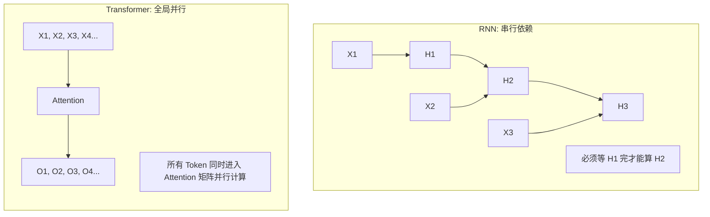

**【回答模板】**
Transformer弃用RNN的循环结构主要基于以下三个深层次原因：

1. **并行计算效率（Parallelization）**：
   RNN的计算复杂度在时间轴上是$O(L)$的，即必须经过$L$步串行操作。这限制了其在超大规模语料上的训练效率。Transformer的自注意力层允许所有位置并行计算，极大提升了模型在现代硬件（GPU/TPU）上的计算利用率，使训练超千亿参数的模型成为可能。

2. **解决长距离依赖（Long-range Dependencies）**：
   在RNN中，第一位的信息要传递到第$n$位，需要经过$n-1$次非线性变换，梯度在漫长的路径中极易消失或爆炸。而在Transformer中，任意两个Token之间的交互路径长度始终为1。这种"全局视野"使得模型能够更精准地捕捉到跨度极大的语义关联。

3. **计算路径的稳定性（Gradient Flow）**：
   RNN依赖于隐藏状态（Hidden State）的不断更新来存储记忆，这是一种"有损压缩"。Transformer通过自注意力矩阵直接建立Token间的显式联系，并配合残差连接（Residual Connection），确保了即使在极深的网络中，底层信号和梯度也能无损地向上传递。

**【深入理解】从"归纳偏置"到"纯粹注意力"：**
RNN包含一个强烈的归纳偏置（Inductive Bias）：认为距离越近的词关系越紧密，且处理顺序必须是从左往右。Transformer放弃了这种偏置，认为序列中任何两个词的关系应由数据动态决定。为了弥补丢失的顺序信息，Transformer引入了位置编码（Positional Encoding）。

* **计算复杂度的折中**：
  虽然Transformer解决了并行化问题，但它付出的代价是自注意力机制的平方复杂度$O(L^2)$（RNN是线性$O(L)$）。然而，在现代工业界，"计算的可并行性"通常比"理论上的低复杂度"更重要，因为并行化能换取更短的训练时间和更庞大的参数容量。

* **历史意义**：
  弃用RNN是自然语言处理（NLP）从"时序建模"转向"空间表征建模"的分水岭。这一转变直接导致了大规模预训练（Pre-training）范式的崛起，因为只有摆脱了循环结构的束缚，模型才能在万亿级的互联网文本中高效地汲取知识。

---
### 10. 解释Transformer模型如何解决CNN和RNN的局限性？

#### 10.1 CNN在处理序列数据时的主要局限性是什么？
CNN（卷积神经网络）主要设计用于网格状数据（如图像），在处理序列数据时存在以下问题：
- **局部感受野**：卷积核只能看到固定窗口内的局部信息，远距离依赖需要多层堆叠才能建立
- **位置不变性假设**：CNN假设特征的位置不重要（平移不变性），但语言中词序至关重要
- **固定权重**：卷积核的权重是固定的，无法根据输入内容动态调整

#### 10.2 RNN在处理序列数据时的主要局限性是什么？
根据引用的内容，RNN的主要局限性包括：
- **串行依赖**：必须按时间步顺序计算，无法并行处理（recall slice 2: 30.2）
- **长距离依赖问题**：梯度在长序列中易消失或爆炸（recall slice 2: 30.3）
- **信息压缩**：隐藏状态是有损压缩，长距离信息可能丢失

#### 10.3 Transformer如何解决CNN的局部感受野问题？
Transformer通过自注意力机制实现**全局感受野**：
- 在单层中，每个Token都能直接"看到"序列中的所有其他Token
- 任意两个位置间的交互路径长度恒为1（$O(1)$距离）
- 这种全局视野使得模型能直接捕捉长距离依赖，无需多层堆叠

#### 10.4 Transformer如何解决CNN的位置不变性问题？
Transformer通过**位置编码**（Positional Encoding）显式地编码词序信息：
- 将位置信息以向量形式加到Token Embedding上
- 使模型既能并行计算，又能感知词序
- 相比CNN的平移不变性，Transformer对位置信息更加敏感和精确

#### 10.5 Transformer如何解决RNN的串行依赖问题？
根据引用的内容，Transformer实现了**完全并行计算**：
- 所有Token的表示被一次性打包成矩阵（recall slice 2: 30.5）
- 自注意力通过矩阵乘法一次性计算所有位置对的相似度
- 极大提升了在现代GPU/TPU上的计算利用率

#### 10.6 Transformer如何解决RNN的长距离依赖问题？
Transformer通过自注意力机制实现了**距离无关的交互**：
- 任意两个Token之间的交互路径长度始终为1（recall slice 2: 30.4）
- 梯度可以直接在任意两个位置间传播，避免了RNN中的梯度消失问题
- 模型能够更精准地捕捉跨度极大的语义关联

#### 10.7 Transformer如何解决RNN的信息压缩问题？
Transformer通过**残差连接和层归一化**确保信息无损传递：
- 自注意力矩阵直接建立Token间的显式联系
- 残差连接确保底层信号和梯度能无损地向上传递
- 相比RNN的隐藏状态更新，Transformer的信息表示更加丰富和完整

#### 10.8 Transformer在计算复杂度上做了什么权衡？
虽然Transformer解决了并行化问题，但付出了**平方复杂度**的代价：
- RNN是线性复杂度$O(L)$，但无法并行
- Transformer是平方复杂度$O(L^2)$，但完全可并行
- 在现代硬件上，可并行性通常比理论低复杂度更重要

**标准答案：**

**【基本原理】**
CNN和RNN作为传统的序列建模架构，各自存在固有局限性。CNN的卷积操作受限于局部感受野，需要多层堆叠才能建立长距离连接；而RNN的循环结构导致串行依赖和梯度消失问题。Transformer通过创新的自注意力机制，同时解决了这两类问题。

**示意图：三种架构的信息流动对比**
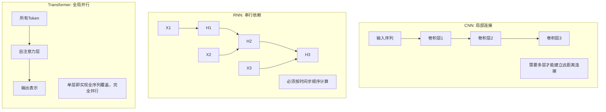

**【回答模板】**
Transformer通过以下方式解决CNN和RNN的局限性：

1. **解决CNN的局部感受野问题**：
   - **全局注意力**：自注意力机制允许每个Token直接关注序列中的所有其他Token，单层即实现全序列覆盖
   - **动态权重**：注意力权重根据输入内容动态计算，而非CNN的固定卷积核
   - **位置感知**：通过位置编码显式编码词序，克服CNN的平移不变性假设

2. **解决RNN的串行依赖问题**：
   - **完全并行化**：所有Token同时计算，充分利用GPU/TPU的并行计算能力
   - **矩阵运算**：自注意力通过$QK^T$矩阵乘法一次性计算所有位置对的相似度
   - **训练效率**：相比RNN的$O(L)$串行计算，Transformer的并行计算大幅提升训练速度

3. **解决RNN的长距离依赖问题**：
   - **常数路径长度**：任意两个Token间的交互路径长度恒为1（$O(1)$距离）
   - **梯度稳定**：梯度可直接在任意位置间传播，避免RNN的梯度消失/爆炸
   - **信息完整**：通过残差连接确保信息在深层网络中无损传递

4. **统一的架构优势**：
   - **归纳偏置少**：相比CNN的局部性偏置和RNN的顺序性偏置，Transformer几乎无归纳偏置
   - **可扩展性强**：适合大规模预训练，催生了BERT、GPT等大模型
   - **多模态适应**：不仅适用于文本，还可扩展到图像、音频等多模态任务

**【深入理解】**
Transformer的成功在于它重新思考了序列建模的本质：不再将序列视为时间上的展开（如RNN）或空间上的局部模式（如CNN），而是视为一组相互关联的实体。这种"关系优先"的视角，配合现代硬件的并行计算能力，使得Transformer能够处理更复杂的语义关系和更长距离的依赖。

然而，这种优势也有代价：自注意力的$O(L^2)$复杂度限制了处理超长序列的能力。为此，后续研究提出了各种优化方案，如稀疏注意力、线性注意力等，试图在保持Transformer核心优势的同时降低计算复杂度。

---

### 11. Transformer相对于LSTM有哪些优势？

#### 11.1 LSTM是什么？它如何改进传统RNN？
LSTM（长短期记忆网络）是RNN的一种变体，通过门控机制解决传统RNN的梯度消失问题：
- **遗忘门**：决定哪些信息从细胞状态中丢弃
- **输入门**：决定哪些新信息存储到细胞状态
- **输出门**：决定输出哪些信息
- **细胞状态**：专门设计的信息"高速公路"，允许梯度无损传递

#### 11.2 LSTM在并行计算方面有什么限制？
虽然LSTM改进了梯度流动，但仍继承了RNN的**串行依赖**特性：
- 必须按时间步顺序计算，第$t$步依赖第$t-1$步的隐藏状态
- 无法在同一时间步内并行处理整个序列
- 在现代GPU上的计算效率受限

#### 11.3 Transformer在并行计算方面有什么优势？
根据引用的内容，Transformer实现了**完全并行计算**：
- 所有Token同时进入自注意力层（recall slice 2: 30.5）
- 通过矩阵乘法一次性计算所有位置对的相似度
- 极大提升了训练速度和硬件利用率

#### 11.4 LSTM如何处理长距离依赖？有什么局限性？
LSTM通过细胞状态传递长距离信息，但仍存在以下问题：
- 信息仍需经过多个时间步传递，可能被稀释或遗忘
- 门控机制增加了计算复杂度，但未改变串行本质
- 在极长序列中，梯度仍可能消失（虽然比传统RNN好）

#### 11.5 Transformer如何更有效地处理长距离依赖？
Transformer通过自注意力机制实现**直接的长距离连接**：
- 任意两个位置间的交互路径长度恒为1（recall slice 2: 30.4）
- 无需通过多个时间步传递信息
- 梯度可以直接在任意两个位置间传播

#### 11.6 在信息表示方面，Transformer相比LSTM有什么优势？
LSTM的隐藏状态是**有损压缩**的表示，而Transformer：
- 通过自注意力矩阵建立Token间的**显式关系**
- 每个Token的表示都包含全局上下文信息
- 残差连接确保信息在深层网络中无损传递

#### 11.7 Transformer在训练稳定性方面有什么优势？
根据引用的内容，Transformer具有更好的**梯度流动**：
- RNN（包括LSTM）依赖于隐藏状态的不断更新，这是一种有损压缩（recall slice 2: 30.7）
- Transformer通过残差连接确保底层信号和梯度能无损地向上传递
- 即使在极深的网络中，梯度也能稳定传播

#### 11.8 Transformer在模型容量和扩展性方面有什么优势？
Transformer架构更适合**大规模预训练**：
- 并行计算能力使其能在海量数据上高效训练
- 多头注意力机制提供了更丰富的表示能力
- 可轻松扩展到数十亿甚至万亿参数规模

**标准答案：**

**【基本原理】**
LSTM作为RNN的改进版本，通过门控机制解决了传统RNN的梯度消失问题，在序列建模任务中曾占据主导地位。然而，Transformer的出现带来了革命性的改进，在多个维度上超越了LSTM。

**示意图：LSTM vs Transformer 架构对比**
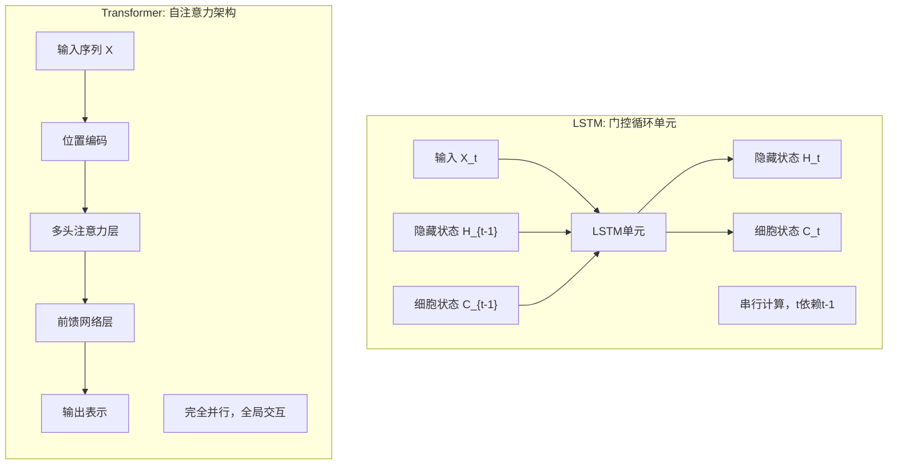

**【回答模板】**
Transformer相对于LSTM的主要优势体现在以下五个方面：

1. **并行计算能力**：
   - **LSTM限制**：必须按时间步顺序计算，第$t$步依赖第$t-1$步的结果，无法并行
   - **Transformer优势**：所有Token同时计算，通过矩阵乘法实现完全并行，极大提升训练速度
   - **硬件利用率**：充分利用GPU/TPU的大规模并行计算能力

2. **长距离依赖建模**：
   - **LSTM机制**：通过细胞状态传递长距离信息，但仍需经过多个时间步
   - **Transformer机制**：任意两个Token间直接交互，路径长度恒为1（$O(1)$距离）
   - **信息保真度**：Transformer能更精确地捕捉跨度极大的语义关联

3. **梯度流动稳定性**：
   - **LSTM改进**：通过门控机制缓解梯度消失，但未完全解决
   - **Transformer设计**：残差连接和层归一化确保梯度在深层网络中稳定传播
   - **训练深度**：Transformer可轻松训练数十甚至上百层，而LSTM通常限于几层

4. **信息表示能力**：
   - **LSTM表示**：隐藏状态是有损压缩，可能丢失细节信息
   - **Transformer表示**：自注意力建立Token间的显式关系，表示更丰富
   - **多头注意力**：多个注意力头从不同角度捕捉依赖关系

5. **扩展性和通用性**：
   - **模型规模**：Transformer更适合大规模预训练，可扩展到千亿参数
   - **多任务适应**：同一架构适用于编码器、解码器、编码器-解码器等多种配置
   - **多模态扩展**：不仅处理文本，还可扩展到图像、语音等多模态任务

**【深入理解】**
Transformer的优势源于其根本性的架构创新：将序列建模从"时间展开"转变为"空间关系"。这种转变带来了几个深远影响：

* **计算范式的改变**：从串行递归到并行矩阵运算，适应了现代硬件的发展趋势
* **归纳偏置的减少**：LSTM假设信息应沿时间轴顺序处理，而Transformer几乎无此假设
* **规模化效应**：Transformer的并行性使其能有效利用海量数据和计算资源

然而，这种优势也有代价：自注意力的$O(L^2)$复杂度在处理超长序列时成为瓶颈。相比之下，LSTM的$O(L)$复杂度在序列极长时可能更有优势，但实际中Transformer通过分块、稀疏化等技术已能有效处理数万甚至数十万长度的序列。

从历史角度看，Transformer的出现标志着深度学习从"循环时代"进入"注意力时代"，这一转变不仅提升了模型性能，更改变了整个研究范式和产业实践。

---

### 12. 解释什么是自回归模型与掩码语言模型有何区别？

#### 12.1 什么是自回归模型（Autoregressive Model）？
自回归模型是一种序列生成模型，其核心思想是：
- 当前时刻的输出依赖于之前时刻的所有输出
- 生成过程是**从左到右**的，一次生成一个Token
- 在预测第$t$个Token时，只能看到前$t-1$个Token

#### 12.2 自回归模型在Transformer中如何实现？
在Transformer解码器中，通过**因果掩码**（Causal Mask）实现自回归：
- 屏蔽掉当前位置之后的所有未来信息
- 每个位置的感受野被限制为"从序列开头到当前位置"（recall slice 1）
- 确保生成过程是严格自回归的

#### 12.3 什么是掩码语言模型（Masked Language Model）？
掩码语言模型是一种**双向**语言建模方法：
- 随机掩盖输入序列中的部分Token（如15%）
- 模型基于**所有可见的上下文**（包括左右两侧）预测被掩盖的Token
- 训练目标是重构被掩盖的原始Token

#### 12.4 掩码语言模型在Transformer中如何实现？
在Transformer编码器中，通过**双向注意力**实现掩码语言建模：
- 每个Token都能看到序列中的所有其他Token（除了被掩盖的）
- 使用特殊的[MASK]标记替换被掩盖的Token
- 模型学习基于完整上下文进行预测

#### 12.5 自回归模型和掩码语言模型在训练目标上有什么区别？
- **自回归模型**：最大化序列的似然概率 $P(x_1, x_2, ..., x_n) = \prod_{t=1}^n P(x_t | x_{<t})$
- **掩码语言模型**：最大化被掩盖Token的条件概率 $P(x_{\text{masked}} | x_{\text{unmasked}})$

#### 12.6 两种模型在信息访问权限上有什么不同？
- **自回归模型**：**单向**访问，只能看到过去信息，看不到未来信息
- **掩码语言模型**：**双向**访问，可以看到被掩盖Token左右两侧的所有信息
- 这种差异导致了完全不同的训练效率和表示能力

#### 12.7 两种模型分别适用于什么类型的任务？
- **自回归模型**：适合**生成式任务**，如文本生成、机器翻译、对话系统
- **掩码语言模型**：适合**理解式任务**，如文本分类、情感分析、命名实体识别
- 实际应用中，两种模型可以结合使用（如T5、BART）

#### 12.8 两种模型在训练效率上有什么差异？
- **自回归模型**：训练时需要串行计算，效率较低
- **掩码语言模型**：所有被掩盖的Token可以**同时预测**，训练效率高
- 掩码语言模型能更充分地利用并行计算能力

**标准答案：**

**【基本原理】**
自回归模型和掩码语言模型代表了两种根本不同的语言建模范式。自回归模型遵循人类语言生成的直觉——从左到右逐步生成；而掩码语言模型则采用更高效的训练策略——基于完整上下文预测缺失部分。

**示意图：两种模型的信息流动对比**
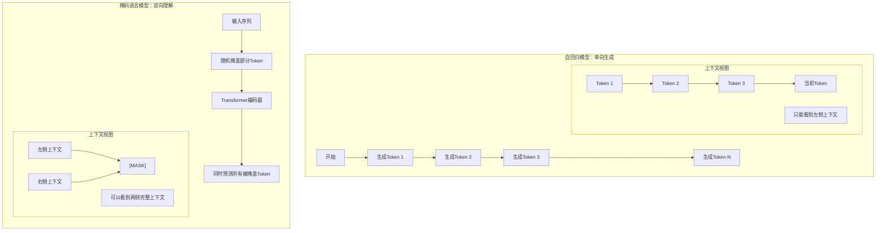

**【回答模板】**
自回归模型与掩码语言模型的主要区别体现在以下六个维度：

1. **信息访问方向**：
   - **自回归模型**：**单向**（只能看到过去，看不到未来）
   - **掩码语言模型**：**双向**（可以看到被掩盖Token左右两侧的所有信息）
   - **实现机制**：自回归通过因果掩码，掩码语言模型通过双向注意力

2. **训练目标函数**：
   - **自回归模型**：最大化序列的联合概率 $P(x_1, x_2, ..., x_n) = \prod_{t=1}^n P(x_t | x_{<t})$
   - **掩码语言模型**：最大化被掩盖Token的重构概率 $P(x_{\text{masked}} | x_{\text{unmasked}})$
   - **数学形式**：自回归是链式分解，掩码是条件概率

3. **模型架构位置**：
   - **自回归模型**：通常使用**Transformer解码器**架构
   - **掩码语言模型**：通常使用**Transformer编码器**架构
   - **代表模型**：GPT系列是自回归，BERT系列是掩码语言模型

4. **训练效率差异**：
   - **自回归模型**：需要串行计算，训练效率相对较低
   - **掩码语言模型**：所有被掩盖Token可同时预测，充分利用并行计算
   - **数据利用率**：掩码语言模型能更高效地利用训练数据

5. **适用任务类型**：
   - **自回归模型**：擅长**生成式任务**
     - 文本生成、故事创作
     - 机器翻译、对话系统
     - 代码生成、创意写作
   - **掩码语言模型**：擅长**理解式任务**
     - 文本分类、情感分析
     - 命名实体识别、关系抽取
     - 句子相似度、问答系统

6. **上下文表示能力**：
   - **自回归模型**：每个Token的表示只包含**左侧上下文**
   - **掩码语言模型**：每个Token的表示包含**完整双向上下文**
   - **表示质量**：掩码语言模型通常能学习到更丰富的语义表示

**【深入理解】**
这两种建模范式反映了对语言本质的不同理解：

* **自回归模型的哲学**：语言本质上是**时间序列**，理解语言就是理解其生成过程。这种建模方式与人类说话、写作的过程高度一致，但牺牲了训练效率。

* **掩码语言模型的哲学**：语言本质上是**结构关系**，理解语言就是理解词与词之间的相互依赖。这种建模方式更高效，但需要额外的技巧才能用于生成任务。

**实际应用中的融合趋势：**
现代大模型通常采用混合策略：
1. **预训练阶段**：使用掩码语言模型获得高质量的语言理解能力
2. **微调阶段**：针对生成任务调整为自回归模式
3. **统一架构**：如T5将所有任务都转化为文本到文本的格式
4. **前缀语言模型**：如UniLM结合了两种范式的优点

**关键洞察：**
- 自回归模型更适合**开放式生成**，因为其生成过程自然、可控
- 掩码语言模型更适合**语言理解**，因为能利用完整上下文信息
- 在实际应用中，选择哪种范式取决于具体任务需求和计算资源

从历史发展看，掩码语言模型（BERT）的出现曾一度超越自回归模型（GPT），但随后自回归模型通过规模化（GPT-3、GPT-4）重新占据优势。这反映了两种范式在不同发展阶段的不同价值，也提示我们：没有绝对优劣，只有适合与否。

---
### 13. 解释什么是“深而窄”与“浅而宽”模型的优劣权衡？

#### 13.1 什么是"深而窄"与"浅而宽"模型的基本概念？
根据引用的内容，这是两种不同的Transformer架构参数分配策略：
- **深而窄(Deep and Narrow)**：指拥有更多层数(L)但每层隐藏单元较少(d较小)的模型架构（recall slice 2）
- **浅而宽(Shallow and Wide)**：指层数较少(L较小)但每层隐藏单元非常多(d很大)的模型架构（recall slice 2）
- **核心区别**：在总参数量固定的情况下，这两种架构代表了不同的参数分配策略

#### 13.2 在特征抽象能力方面，两种架构有何不同？
根据引用的内容，深度决定了模型的非线性变换次数：
- **深而窄优势**：深层模型能够学习到更高级别、更复杂的抽象逻辑（例如从字符到词汇，再到语法，最后到语义逻辑）（recall slice 1）
- **实验证据**：增加深度通常比增加宽度更能提升模型在复杂推理任务上的表现（recall slice 1）
- **逻辑抽象**：深度决定了模型的非线性变换次数，深层模型有更强的逻辑抽象能力

#### 13.3 在计算并行度方面，两种架构有何不同？
根据引用的内容，宽度和深度对计算效率的影响不同：
- **浅而宽优势**：宽度（隐藏层维度 $d$）的增加主要体现为更大规模的矩阵运算。现代 GPU 擅长处理大规模并行矩阵乘法，因此"宽"模型能更好地利用显卡吞吐量（recall slice 1）
- **深而窄劣势**：深层模型在计算上具有串行依赖性：必须先算完第 1 层才能算第 2 层。因此，过深的模型会增加推理延迟（Latency）（recall slice 1）

#### 13.4 在内存使用方面，这两种架构有何不同？
根据引用的内容，两种架构在内存占用方面有不同的权衡：
- **浅而宽的内存代价**：在推理阶段，KV Cache 的大小直接正比于隐藏层维度 $d$。增加宽度会导致显存占用急剧上升，限制了推理时的最大 Batch Size（recall slice 1）
- **深而窄的内存代价**：浅而宽模型在推理阶段的KV Cache大小直接正比于隐藏层维度d，宽度增加会导致显存占用急剧上升。深而窄模型虽然每层参数较少，但层数多会增加中间激活值的存储需求（recall slice 3）

#### 13.5 什么是"表征塌陷"和"有效秩"问题？
根据引用的内容，过深或过宽都会带来表征问题：
- **深而窄的风险**：过深的模型如果初始化不当，容易出现"表征塌陷"，即每一层的输出变得非常相似，导致深层变得冗余（recall slice 1）
- **浅而宽的风险**：而过宽的模型则可能出现各向异性问题，导致空间利用率不足（recall slice 1）

#### 13.6 根据缩放定律，深度和宽度应该如何平衡？
根据引用的内容，缩放定律提供了实证指导：
- **幂律分布**：OpenAI 和 Google 的研究发现，在总算力充足的情况下，深度和宽度的收益均遵循幂律分布（recall slice 1）
- **优化顺序**：通常建议先增加宽度到一定程度（如 4096 或 8192），再通过增加深度来获得更强的逻辑泛化能力（recall slice 1）

#### 13.7 工业界实际应用中，深度与宽度的"黄金比例"是什么？
根据引用的内容，主流大模型采用平衡方案：
- **主流配置**：目前主流大模型（如 Llama 3 70B）通常采用一种平衡方案：层数在 80 层左右，隐藏维度在 8192 左右（recall slice 1）
- **平衡优势**：这既保证了足够的逻辑抽象深度，又利用了宽矩阵带来的高效并行性（recall slice 1）

#### 13.8 分布式训练中，深度和宽度对通信有什么影响？
根据引用的内容，架构选择还受通信瓶颈制约：
- **宽度通信压力**：增加宽度会显著增加节点间需要同步的参数量（梯度通信压力大）（recall slice 1）
- **深度通信频率**：而增加深度则对通信频率要求更高（recall slice 1）
- **集群带宽制约**：因此，架构的选择往往还受到底层计算集群带宽的制约（recall slice 1）

**标准答案：**

**【基本原理】**
在设计 Transformer 架构时，给定总参数量预算，开发者需要决定如何分配这些参数：是堆叠更多的层数（增加深度 $L$），还是扩大隐藏层维度（增加宽度 $d$）。

* **深而窄 (Deep and Narrow)**：拥有更多的层数，但每层隐藏单元较少。
* **浅而宽 (Shallow and Wide)**：层数较少，但每层隐藏单元非常多。

**示意图：**
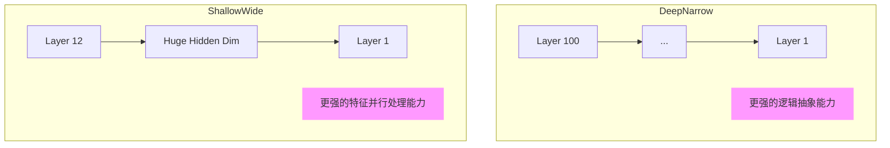

**【回答模板】**
"深"与"宽"的权衡主要体现在特征表达深度、计算效率与内存占用三个方面：

1. **特征抽象能力（深度优势）**：
   - **非线性变换次数**：深度决定了模型的非线性变换次数。深层模型能够学习到更高级别、更复杂的抽象逻辑（例如从字符到词汇，再到语法，最后到语义逻辑）。
   - **推理任务表现**：实验表明，增加深度通常比增加宽度更能提升模型在复杂推理任务上的表现。
   - **逻辑泛化能力**：深层模型通过多级抽象，能够更好地捕捉复杂的逻辑关系和长距离依赖。

2. **计算并行度（宽度优势）**：
   - **矩阵运算规模**：宽度（隐藏层维度 $d$）的增加主要体现为更大规模的矩阵运算。现代 GPU 擅长处理大规模并行矩阵乘法，因此"宽"模型能更好地利用显卡吞吐量。
   - **串行依赖问题**：深层模型在计算上具有串行依赖性：必须先算完第 1 层才能算第 2 层。因此，过深的模型会增加推理延迟（Latency）。
   - **训练效率**：宽模型在训练时能更充分地利用并行计算资源，提升训练速度。

3. **内存与 KV Cache（宽度代价）**：
   - **显存占用**：在推理阶段，KV Cache 的大小直接正比于隐藏层维度 $d$。增加宽度会导致显存占用急剧上升，限制了推理时的最大 Batch Size。
   - **激活值存储**：深而窄模型虽然每层参数较少，但层数多会增加中间激活值的存储需求。
   - **内存带宽**：宽模型需要更大的内存带宽来传输参数和激活值，可能成为性能瓶颈。

**【深入理解】**
1. **有效秩（Effective Rank）与表征塌陷**：
   - **深模型风险**：过深的模型如果初始化不当，容易出现"表征塌陷"，即每一层的输出变得非常相似，导致深层变得冗余。
   - **宽模型风险**：而过宽的模型则可能出现各向异性问题，导致空间利用率不足。

2. **Scaling Laws（缩放定律）的实证**：
   - **幂律分布**：OpenAI 和 Google 的研究发现，在总算力充足的情况下，深度和宽度的收益均遵循幂律分布。
   - **优化策略**：通常建议先增加宽度到一定程度（如 4096 或 8192），再通过增加深度来获得更强的逻辑泛化能力。

3. **工业界的"黄金比例"**：
   - **主流配置**：目前主流大模型（如 Llama 3 70B）通常采用一种平衡方案：层数在 80 层左右，隐藏维度在 8192 左右。
   - **平衡优势**：这既保证了足够的逻辑抽象深度，又利用了宽矩阵带来的高效并行性。

4. **通信瓶颈**：
   - **分布式训练**：在分布式训练中，增加宽度会显著增加节点间需要同步的参数量（梯度通信压力大），而增加深度则对通信频率要求更高。
   - **带宽制约**：因此，架构的选择往往还受到底层计算集群带宽的制约。

**总结**：深而窄模型更适合需要复杂逻辑推理的任务，但计算效率较低；浅而宽模型更适合需要高效并行计算的任务，但内存占用较大。实际应用中需要根据具体任务需求、硬件资源和推理延迟要求来选择合适的架构平衡点。

---

### 14. 解释不同LLM架构的类型，以及哪种架构最适合哪些任务？

#### 14.1 LLM架构的主要类型有哪些？
基于Transformer的LLM架构主要可以分为以下几种类型：
- **仅编码器架构**：如BERT、RoBERTa，专注于理解任务
- **仅解码器架构**：如GPT系列、Llama系列，专注于生成任务  
- **编码器-解码器架构**：如T5、BART、FLAN-T5，适合序列到序列任务
- **混合架构**：结合不同架构特点的变体

#### 14.2 仅编码器架构的特点和适用任务是什么？
仅编码器架构的核心特点：
- **双向注意力**：每个Token都能看到序列中的所有其他Token
- **预训练目标**：通常使用掩码语言建模（MLM）或句子对预测
- **优势**：能学习丰富的上下文表示，适合理解类任务
- **适用任务**：文本分类、情感分析、命名实体识别、问答系统

#### 14.3 仅解码器架构的特点和适用任务是什么？
仅解码器架构的核心特点：
- **因果注意力**：使用因果掩码，只能看到当前位置之前的Token
- **预训练目标**：通常使用自回归语言建模（从左到右预测）
- **优势**：自然支持文本生成，生成过程可控
- **适用任务**：文本生成、对话系统、代码生成、创意写作

#### 14.4 编码器-解码器架构的特点和适用任务是什么？
编码器-解码器架构的核心特点：
- **双向编码器**：编码器使用双向注意力理解输入
- **因果解码器**：解码器使用因果注意力生成输出
- **交叉注意力**：解码器通过交叉注意力关注编码器输出
- **适用任务**：机器翻译、文本摘要、文本改写、问答生成

#### 14.5 不同架构在参数效率方面有何差异？
- **仅编码器**：参数效率高，但需要任务特定头部
- **仅解码器**：参数效率中等，但零样本能力强
- **编码器-解码器**：参数最多，但任务适应性最广

#### 14.6 不同架构在训练效率方面有何差异？
- **仅编码器**：训练效率最高，所有Token可并行处理
- **仅解码器**：训练效率中等，需要因果掩码
- **编码器-解码器**：训练效率较低，需要处理两个序列

#### 14.7 不同架构在推理效率方面有何差异？
- **仅编码器**：推理效率高，一次前向传播
- **仅解码器**：推理效率低，需要自回归生成
- **编码器-解码器**：推理效率中等，编码一次，解码逐步

#### 14.8 现代大模型架构的发展趋势是什么？
- **统一架构**：如T5将所有任务转化为文本到文本格式
- **前缀语言模型**：如UniLM结合双向和单向注意力
- **稀疏注意力**：如Longformer、BigBird处理长序列
- **状态空间模型**：如Mamba提供线性复杂度替代方案

**标准答案：**

**【基本原理】**
大型语言模型（LLM）的架构选择直接影响模型的能力特性、训练效率和适用场景。基于Transformer的不同变体架构，各自针对特定类型的任务进行了优化。

**示意图：三种主要LLM架构对比**
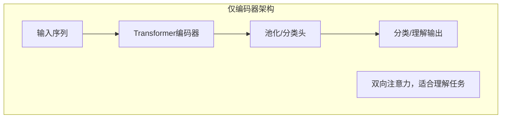

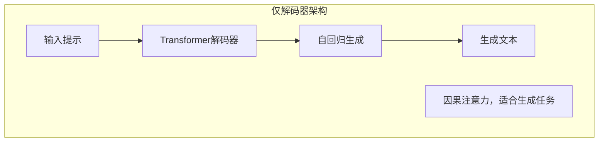

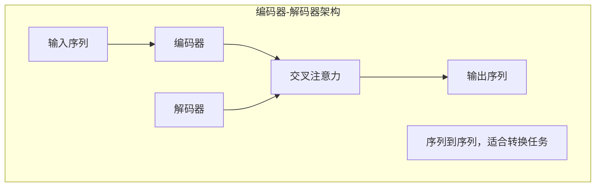


**【回答模板】**
不同LLM架构的类型及其适用任务：

1. **仅编码器架构（Encoder-Only）**
   - **代表模型**：BERT、RoBERTa、DeBERTa、ALBERT
   - **架构特点**：
     - 使用**双向自注意力**，每个Token能看到整个序列
     - 预训练目标：掩码语言建模（MLM）、下一句预测（NSP）
     - 通常需要任务特定的分类头或回归头
   - **核心优势**：
     - 强大的上下文理解能力
     - 训练效率高，所有Token可并行处理
     - 参数效率较高
   - **最适合任务**：
     - **文本分类**：情感分析、主题分类、垃圾邮件检测
     - **信息抽取**：命名实体识别、关系抽取、事件检测
     - **语义理解**：句子相似度、自然语言推理、问答系统
     - **文本匹配**：信息检索、语义搜索、文档排序

2. **仅解码器架构（Decoder-Only）**
   - **代表模型**：GPT系列、Llama系列、OPT、BLOOM
   - **架构特点**：
     - 使用**因果自注意力**，只能看到当前位置之前的Token
     - 预训练目标：自回归语言建模（从左到右预测）
     - 纯生成式架构，不需要任务特定头部
   - **核心优势**：
     - 自然的文本生成能力
     - 强大的零样本和少样本学习能力
     - 生成过程可控，适合创意任务
   - **最适合任务**：
     - **文本生成**：故事创作、诗歌生成、代码生成
     - **对话系统**：聊天机器人、虚拟助手、客服系统
     - **内容创作**：文章写作、营销文案、创意写作
     - **指令跟随**：任务规划、步骤分解、问题解答

3. **编码器-解码器架构（Encoder-Decoder）**
   - **代表模型**：T5、BART、FLAN-T5、mT5
   - **架构特点**：
     - 编码器使用双向注意力理解输入
     - 解码器使用因果注意力生成输出
     - 通过交叉注意力连接编码器和解码器
   - **核心优势**：
     - 强大的序列到序列转换能力
     - 任务适应性最广，统一文本到文本格式
     - 能处理输入输出长度不匹配的任务
   - **最适合任务**：
     - **文本转换**：机器翻译、文本摘要、文本改写
     - **内容生成**：问答生成、表格到文本、数据到文本
     - **任务统一**：多任务学习、指令微调、提示工程
     - **条件生成**：基于条件的文本生成、风格迁移

**【深入理解】**
1. **架构选择的权衡因素**：
   - **任务类型**：理解 vs 生成 vs 转换
   - **数据可用性**：有监督 vs 无监督 vs 少样本
   - **计算资源**：训练成本 vs 推理延迟
   - **部署需求**：实时性 vs 准确性 vs 内存限制

2. **现代架构发展趋势**：
   - **统一范式**：T5开创的"文本到文本"统一框架
   - **前缀语言模型**：UniLM等结合双向和单向注意力
   - **稀疏注意力**：处理长文档的优化架构
   - **混合专家**：MoE架构提升模型容量和效率

3. **实际应用建议**：
   - **企业应用**：BERT类模型适合分类、搜索等理解任务
   - **创意应用**：GPT类模型适合生成、对话等创意任务
   - **多语言应用**：T5类模型适合翻译、摘要等多语言任务
   - **研究探索**：根据具体研究问题选择合适的基准架构

**总结**：选择LLM架构时需要综合考虑任务需求、数据特性、计算资源和部署环境。仅编码器架构在理解任务上表现优异，仅解码器架构在生成任务上独具优势，而编码器-解码器架构在转换任务上最为灵活。随着技术的发展，架构边界逐渐模糊，统一的多任务架构成为新的趋势。

---

### 15. 比较状态空间模型（如Mamba）与Transformer。各自的权衡及适用场景是什么？

#### 15.1 什么是状态空间模型（SSM）？
状态空间模型是一种新的序列建模架构，代表模型是Mamba：
- **数学基础**：基于连续时间系统，通过状态方程和观测方程建模序列
- **核心思想**：将序列处理视为动态系统的状态演化
- **创新点**：选择性状态空间模型，能根据输入动态调整参数

#### 15.2 Transformer的核心优势是什么？
Transformer的主要优势包括：
- **自注意力机制**：全局感受野，任意位置间直接交互
- **并行计算**：训练时完全并行，充分利用现代硬件
- **表示能力**：多头注意力提供丰富的特征表示
- **可扩展性**：适合大规模预训练和参数扩展

#### 15.3 Mamba相比Transformer在计算复杂度上有何优势？
Mamba的核心优势是**线性复杂度**：
- **Transformer复杂度**：$O(L^2)$，序列长度平方级增长
- **Mamba复杂度**：$O(L)$，序列长度线性增长
- **实际影响**：能处理更长的序列，显存占用更低

#### 15.4 Transformer在哪些方面优于Mamba？
Transformer的优势领域：
- **全局上下文**：自注意力能直接建立任意两个位置的联系
- **训练并行性**：所有Token同时计算，训练效率高
- **成熟生态**：丰富的预训练模型、工具和优化技术
- **多模态扩展**：已成功扩展到图像、音频等多模态任务

#### 15.5 Mamba的创新机制是什么？
Mamba的关键创新：
- **选择性机制**：状态转移矩阵和投影矩阵根据输入动态计算
- **硬件感知设计**：通过并行扫描算法实现高效并行计算
- **简化架构**：去除了注意力机制，使用SSM块替代

#### 15.6 两种架构在长序列处理能力上有何差异？
- **Transformer限制**：$O(L^2)$复杂度限制了处理超长序列的能力
- **Mamba优势**：$O(L)$复杂度使其能高效处理数十万甚至百万长度的序列
- **实际测试**：Mamba在长文档理解、基因组序列等任务上表现优异

#### 15.7 两种架构在训练和推理效率上有何不同？
- **训练效率**：Transformer训练并行度高，但显存占用大；Mamba训练稍慢，但显存占用小
- **推理效率**：Transformer推理延迟高（自回归生成）；Mamba推理延迟低（线性复杂度）
- **内存需求**：Transformer需要存储KV Cache；Mamba状态空间表示更紧凑

#### 15.8 两种架构分别适合什么类型的任务？
- **Transformer适合**：需要强上下文理解、多模态融合、已有丰富预训练资源的任务
- **Mamba适合**：超长序列处理、实时推理、内存受限、序列长度变化大的任务

**标准答案：**

**【基本原理】**
状态空间模型（SSM，如Mamba）和Transformer代表了序列建模的两种不同范式。Transformer基于自注意力机制实现全局交互，而Mamba基于状态空间方程实现线性复杂度序列处理。

**示意图：Transformer vs Mamba 架构对比**
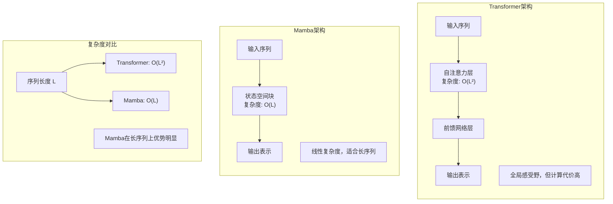

**【回答模板】**
状态空间模型（Mamba）与Transformer的比较及适用场景：

1. **计算复杂度与序列长度处理**
   - **Transformer**：
     - 复杂度：$O(L^2)$，序列长度平方级增长
     - 限制：处理超长序列（>100k）时显存和计算成本急剧上升
     - 优化：需要稀疏注意力、分块等技巧来缓解
   - **Mamba**：
     - 复杂度：$O(L)$，序列长度线性增长
     - 优势：能高效处理数十万甚至百万长度的序列
     - 实际：在长文档、基因组、音频等长序列任务上表现优异

2. **架构机制与表示能力**
   - **Transformer机制**：
     - **自注意力**：全局感受野，任意位置间直接交互
     - **多头注意力**：从多个角度捕捉依赖关系
     - **位置编码**：显式编码位置信息（如RoPE、ALiBi）
   - **Mamba机制**：
     - **状态空间方程**：$h'(t) = A h(t) + B x(t)$, $y(t) = C h(t) + D x(t)$
     - **选择性机制**：$A, B, C, D$矩阵根据输入动态计算
     - **隐式位置**：通过状态演化自然编码序列顺序

3. **训练与推理效率**
   - **训练阶段**：
     - **Transformer**：完全并行，训练速度快，但显存占用大
     - **Mamba**：需要扫描操作，训练稍慢，但显存占用小
     - **硬件利用**：Transformer更适合现代GPU的大规模并行
   - **推理阶段**：
     - **Transformer**：自回归生成导致高延迟，需要KV Cache
     - **Mamba**：线性复杂度，推理延迟低，状态表示紧凑
     - **内存需求**：Transformer的KV Cache随序列增长而增长

4. **上下文建模能力**
   - **全局上下文**：
     - **Transformer优势**：自注意力能直接建立任意两个位置的关联
     - **Mamba限制**：通过状态传递信息，远距离关联可能衰减
     - **实际表现**：在需要强全局推理的任务上，Transformer通常更优
   - **局部模式**：
     - **Mamba优势**：状态空间能有效捕捉局部依赖和时序模式
     - **适用任务**：时间序列预测、信号处理、基因组分析

5. **成熟度与生态系统**
   - **Transformer成熟度**：
     - **丰富生态**：HuggingFace、PyTorch、TensorFlow全面支持
     - **预训练模型**：数千个开源模型可供选择
     - **优化技术**：FlashAttention、量化、蒸馏等成熟方案
   - **Mamba发展阶段**：
     - **新兴技术**：2023年底提出，生态正在建设中
     - **模型选择**：预训练模型相对较少
     - **工具支持**：逐步完善中，但不如Transformer成熟

**【适用场景分析】**
1. **Transformer最适合的场景**：
   - **需要强上下文理解**：复杂推理、逻辑分析、多跳问答
   - **多模态任务**：视觉语言模型、音频文本对齐
   - **成熟应用**：已有丰富预训练资源和优化方案的任务
   - **资源充足**：计算资源丰富，不特别关注推理延迟

2. **Mamba最适合的场景**：
   - **超长序列处理**：长文档理解、基因组序列分析、长音频处理
   - **实时推理**：低延迟要求的应用，如实时翻译、对话系统
   - **内存受限**：移动设备、边缘计算等资源受限环境
   - **序列长度变化大**：输入长度动态变化的应用

3. **混合架构趋势**：
   - **注意力+SSM**：结合两者优势，如注意力处理局部，SSM处理全局
   - **分层处理**：浅层用SSM减少计算，深层用注意力提升表示
   - **任务自适应**：根据任务特性动态选择架构组件

**【深入理解】**
1. **根本差异**：
   - Transformer基于**显式关系建模**，通过注意力矩阵直接建立Token间联系
   - Mamba基于**隐式状态演化**，通过微分方程连续建模序列动态

2. **未来发展方向**：
   - **Transformer优化**：继续降低$O(L^2)$复杂度，提升长序列处理能力
   - **Mamba扩展**：提升全局建模能力，扩展到多模态任务
   - **架构融合**：探索更高效的混合架构，结合两者优势

3. **选择建议**：
   - **研究探索**：Mamba适合探索长序列、高效率的新应用
   - **生产部署**：Transformer在成熟任务上风险更低
   - **特定领域**：根据序列长度、推理延迟、资源约束选择

**总结**：Transformer和Mamba代表了序列建模的两种不同哲学。Transformer以计算代价换取强大的表示能力，适合资源充足、需要强推理的任务；Mamba以线性复杂度换取高效性，适合长序列、实时推理、资源受限的场景。随着技术的发展，两者可能相互借鉴融合，形成更强大的下一代序列建模架构。

---

## **第 2 章：注意力机制变体 (16-40)**

### 16. Self-attention 的 $Q, K, V$ 矩阵分别 represent 什么？


#### 16.1 自注意力机制的根本目的是什么？
在处理一个句子时，模型需要知道每个词与其他词的相关程度。例如，在“The cat sat on the mat”中，“sat”这个动作主要和谁相关？是“cat”还是“mat”？自注意力就是要量化这种内部依赖关系。

#### 16.2 为什么不能直接用原始词向量来计算这种相关性？
如果直接用原始向量做点积，我们只有一个固定的表示，它既要用来“提问”（我想关注什么特征？），又要用来“回答”（我有什么特征？），还要承载“实际信息”（我的语义是什么？）。这就像让一个人同时扮演侦探、嫌疑人和证据，角色混淆，效率低下。

#### 16.3 如果要让一个词去“查询”其他词，它需要发出什么样的信号？
这个词需要一个专门的“查询向量”（Query），它编码了当前词在特定上下文中的“兴趣点”。比如，“bank”在“I went to the bank to deposit money”中，它的Query会偏向“金融”属性；而在“I sat by the river bank”中，它的Query会偏向“地理”属性。

#### 16.4 其他词如何响应这个“查询”？
每个被查询的词都有一个“键向量”（Key），它就像是这个词贴在外面的“标签”或“名片”，上面写着“我有哪些特征”。Query会和所有的Key进行匹配，计算相似度。

#### 16.5 匹配之后，我们最终想得到什么？
我们不是只想知道“有多相关”，而是想把相关词的**实际信息**拿过来。这个“实际信息”就由“值向量”（Value）承载。最后的输出，就是所有Value根据其相关性（Query-Key匹配得分）加权平均的结果。

现在，让我们看看标准答案是如何精炼地概括这一切的：

**【基本原理】**
自注意力机制的本质是计算序列内部各元素之间的关联强度。为了实现这种灵活的建模，输入向量通过三个权重矩阵 $W^Q, W^K, W^V$ 进行线性映射，从而在不同维度上提取特征。

**示意图：**
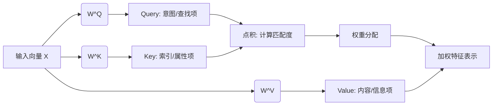

**【回答模板】**
*   **Query (查询 $Q$)**：代表当前词作为“搜索者”时发出的请求。它指明了当前词在关注其他词时，希望寻找什么样的特征。
*   **Key (键 $K$)**：代表当前词作为“被搜索者”时表现出的特征。它用于与所有 $Q$ 进行匹配，决定当前词应该被赋予多少权重。
*   **Value (值 $V$)**：代表当前词承载的实际语义信息。一旦权重分配完成，最终的输出就是这些 $V$ 的线性加权组合。

**【深入理解】**
这种设计引入了“软寻址”机制。相比于传统的循环神经网络（RNN）被动地接受前序信息，Self-attention 允许模型主动根据 $Q$ 与 $K$ 的相关性（相似度），从全局 $V$ 中提取信息。$Q$ 和 $K$ 决定了“去哪里看”，而 $V$ 决定了“看到了什么”。

---

### 17. 代码 实现一个标准的 Scaled Dot-Product Attention。 

#### 17.1 Scaled Dot-Product Attention的核心计算公式是什么？
根据引用的内容，核心计算公式包含四个关键步骤：
- **完整公式**：$\text{Attention}(Q, K, V) = \text{softmax}(\frac{QK^T}{\sqrt{d_k}})V$（recall slice 5）
- **关键步骤**：这个公式包含了四个关键步骤：计算相似度、缩放、归一化、加权求和（recall slice 5）

#### 17.2 计算$QK^T$的目的是什么？
根据引用的内容，$QK^T$计算的是相似度得分：
- **相似度计算**：计算$QK^T$得到相似度得分矩阵（recall slice 4）
- **矩阵形状**：$Q$矩阵形状为$[L, d_k]$，$K^T$矩阵形状为$[d_k, L]$，相乘得到$[L, L]$的得分矩阵（recall slice 4）

#### 17.3 为什么需要除以$\sqrt{d_k}$进行缩放？
根据引用的内容，缩放是为了防止梯度消失：
- **缩放目的**：Scale ($1/\sqrt{d_k}$) --> Prevent Gradient Vanishing（recall slice 4）
- **数学原因**：当$d_k$较大时，点积结果可能非常大，导致Softmax梯度消失（recall slice 4）

#### 17.4 掩码(Mask)在什么情况下需要应用？
根据引用的内容，掩码用于屏蔽无效位置：
- **掩码应用**：Mask (Optional) --> Set invalid positions to -inf（recall slice 4）
- **应用场景**：在处理变长序列或生成任务时，我们必须屏蔽Padding字符或未来信息（recall slice 4）
- **实现方式**：将这些位置设为-1e9（负无穷），可以确保在Softmax之后它们的权重几乎为0（recall slice 4）

#### 17.5 Softmax的作用是什么？
根据引用的内容，Softmax将得分转换为注意力权重：
- **归一化**：Softmax --> Attention Weights [0, 1]（recall slice 4）
- **概率分布**：将相似度得分转换为概率分布，总和为1（recall slice 4）

#### 17.6 最后的矩阵乘法完成了什么操作？
根据引用的内容，最后的@ $V$操作完成了信息聚合：
- **信息聚合**：最后的@ $V$操作完成了真正的信息聚合（recall slice 4）
- **加权求和**：权重对Value加权求和（recall slice 4）
- **输出形状**：结果矩阵形状为$[L, d_v]$（recall slice 4）

#### 17.7 代码实现中需要注意哪些关键点？
根据引用的内容，代码实现需要注意维度处理和掩码应用：
- **维度获取**：需要获取特征维度$d_k$（recall slice 4）
- **转置操作**：需要对$K$进行转置以计算点积（recall slice 4）
- **掩码填充**：使用masked_fill将掩码位置设为负无穷（recall slice 4）

#### 17.8 为什么说masked_fill操作至关重要？
根据引用的内容，masked_fill确保排除无效信息干扰：
- **重要性**：代码中的masked_fill操作至关重要（recall slice 4）
- **作用机制**：将这些位置设为-1e9（负无穷），可以确保在Softmax之后它们的权重几乎为0（recall slice 4）
- **实际效果**：从而排除无效信息的干扰（recall slice 4）

**标准答案：**

**【基本原理】**
其核心运算逻辑遵循公式：$\text{Attention}(Q, K, V) = \text{softmax}\left(\frac{QK^T}{\sqrt{d_k}}\right)V$。运算过程包括矩阵乘法、缩放、掩码应用、归一化以及最后的语义聚合。

示意图：
```
Q Matrix: [L, d_k]   K^T Matrix: [d_k, L]
      \               /
       \             /
        Matmul(Q, K^T) --> Scores Matrix: [L, L]
                |
        Scale (1/√d_k) --> Prevent Gradient Vanishing
                |
        Mask (Optional) --> Set invalid positions to -inf
                |
        Softmax --> Attention Weights [0, 1]
               |      /
        Matmul(W, V) <--- V Matrix: [L, d_v]
                |
        Result Matrix: [L, d_v]
```

**【回答模板】**
```python
import torch
import torch.nn.functional as F
import math

def scaled_dot_product_attention(query, key, value, mask=None):
    # 获取特征维度 d_k
    d_k = query.size(-1)
    
    # 1. 计算 QK^T 并进行缩放 (Scaling)
    # scores 形状: [batch_size, n_heads, seq_len, seq_len]
    scores = torch.matmul(query, key.transpose(-2, -1)) / math.sqrt(d_k)
    
    # 2. 应用掩码 (Masking)，常见于 Transformer 的 Decoder
    if mask is not None:
        scores = scores.masked_fill(mask == 0, -1e9)
    
    # 3. Softmax 得到注意力权重 p_attn
    p_attn = F.softmax(scores, dim=-1)
    
    # 4. 权重对 Value 加权求和
    return torch.matmul(p_attn, value), p_attn
```

**【深入理解】**
代码中的masked_fill操作至关重要。在处理变长序列或生成任务时，我们必须屏蔽Padding字符或未来信息。将这些位置设为-1e9（负无穷），可以确保在Softmax之后它们的权重几乎为0，从而排除无效信息的干扰。

1. **函数参数说明**：
   - **query**：查询矩阵，形状为$[batch\_size, n\_heads, seq\_len, d_k]$
   - **key**：键矩阵，形状为$[batch\_size, n\_heads, seq\_len, d_k]$
   - **value**：值矩阵，形状为$[batch\_size, n\_heads, seq\_len, d_v]$
   - **mask**：掩码矩阵，形状为$[batch\_size, 1, seq\_len, seq\_len]$或$[seq\_len, seq\_len]$

2. **计算步骤详解**：
   - **步骤1**：计算$QK^T$并除以$\sqrt{d_k}$，防止梯度消失
   - **步骤2**：应用掩码，将无效位置设为负无穷
   - **步骤3**：Softmax归一化，得到注意力权重
   - **步骤4**：注意力权重与$V$相乘，得到加权输出

3. **返回结果**：
   - **第一个返回值**：注意力加权后的输出，形状为$[batch\_size, n\_heads, seq\_len, d_v]$
   - **第二个返回值**：注意力权重矩阵，形状为$[batch\_size, n\_heads, seq\_len, seq\_len]$

4. **实际应用注意事项**：
   - **批量处理**：支持批量输入，提高计算效率
   - **多头注意力**：与多头注意力机制配合使用
   - **梯度稳定性**：缩放操作确保训练稳定性
   - **内存效率**：注意矩阵乘法的内存占用

---

### 18. 为什么 $QK^T$ 需要除以 $\sqrt{d}$？请从方差偏移的角度解释。 

#### 18.1 $QK^T$计算的是什么？为什么需要关注它的数值范围？
根据引用的内容，$QK^T$计算的是相似度得分：
- **计算目的**：计算$QK^T$得到相似度得分矩阵（recall slice 4）
- **数值问题**：当$d_k$较大时，点积结果可能非常大（recall slice 4）
- **影响后果**：可能导致Softmax梯度消失（recall slice 4）

#### 18.2 什么是方差偏移(Variance Shift)问题？
方差偏移是指当输入数据的方差发生变化时，对后续计算产生的不利影响：
- **基本概念**：在深度学习中，层间激活值的方差如果发生剧烈变化，会导致训练不稳定
- **具体表现**：如果$QK^T$的方差过大，Softmax的输出会趋近于one-hot分布，梯度消失
- **根本原因**：点积操作会放大方差，特别是当维度$d_k$较大时

#### 18.3 假设$Q$和$K$的每个元素独立同分布，它们的方差是多少？
假设$Q$和$K$的元素服从均值为0，方差为1的分布：
- **基本假设**：$q_i \sim \mathcal{N}(0, 1)$，$k_i \sim \mathcal{N}(0, 1)$
- **独立性**：$Q$和$K$的每个元素相互独立
- **点积性质**：$Q \cdot K = \sum_{i=1}^{d_k} q_i k_i$

#### 18.4 $QK^T$的期望和方差是多少？
根据概率统计理论：
- **期望**：$\mathbb{E}[QK^T] = \mathbb{E}[\sum_{i=1}^{d_k} q_i k_i] = \sum_{i=1}^{d_k} \mathbb{E}[q_i]\mathbb{E}[k_i] = 0$
- **方差**：$\text{Var}(QK^T) = \text{Var}(\sum_{i=1}^{d_k} q_i k_i) = \sum_{i=1}^{d_k} \text{Var}(q_i k_i)$
- **由于独立性**：$\text{Var}(q_i k_i) = \mathbb{E}[q_i^2]\mathbb{E}[k_i^2] - (\mathbb{E}[q_i]\mathbb{E}[k_i])^2 = 1 \times 1 - 0 = 1$
- **最终方差**：$\text{Var}(QK^T) = d_k$

#### 18.5 为什么方差等于$d_k$会导致问题？
方差随维度线性增长会带来严重问题：
- **数值过大**：当$d_k=512$时，方差为512，标准差约为22.6
- **Softmax饱和**：如此大的数值会使Softmax输出趋近于极端值（0或1）
- **梯度消失**：当Softmax输出接近one-hot时，梯度会变得非常小

#### 18.6 除以$\sqrt{d_k}$如何解决方差问题？
缩放因子起到方差归一化的作用：
- **缩放操作**：$\frac{QK^T}{\sqrt{d_k}}$
- **缩放后方差**：$\text{Var}\left(\frac{QK^T}{\sqrt{d_k}}\right) = \frac{1}{d_k} \times \text{Var}(QK^T) = \frac{1}{d_k} \times d_k = 1$
- **效果**：将方差稳定在1，与维度$d_k$无关

#### 18.7 从Softmax函数的角度看，为什么需要稳定方差？
Softmax函数对输入尺度敏感：
- **Softmax公式**：$\text{softmax}(z_i) = \frac{e^{z_i}}{\sum_{j} e^{z_j}}$
- **尺度效应**：如果所有$z_i$都乘以常数$c$，当$c \to \infty$时，Softmax趋近于argmax
- **梯度计算**：$\frac{\partial \text{softmax}(z_i)}{\partial z_j} = \text{softmax}(z_i)(\delta_{ij} - \text{softmax}(z_j))$
- **梯度消失**：当Softmax输出趋近于0或1时，梯度趋近于0

#### 18.8 实际应用中，除以$\sqrt{d_k}$带来了哪些好处？
缩放操作的实际益处：
- **训练稳定性**：防止梯度消失，加速收敛
- **数值稳定性**：避免数值溢出或下溢
- **模型性能**：确保注意力权重的合理分布
- **泛化能力**：提高模型在不同任务上的表现

**标准答案：**

**【基本原理】**
$QK^T$需要除以$\sqrt{d_k}$的根本原因是为了控制点积结果的方差，防止Softmax函数饱和导致梯度消失。从统计学角度，这是一个方差归一化操作。

**示意图：缩放前后的方差变化**
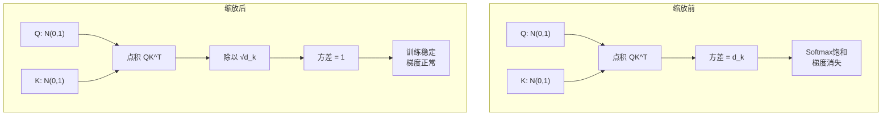

**【回答模板】**
$QK^T$需要除以$\sqrt{d_k}$的核心数学原理：

1. **基本假设**：
   - 假设$Q$和$K$的每个元素独立且服从标准正态分布：$q_i, k_i \sim \mathcal{N}(0, 1)$
   - $Q$和$K$的维度为$d_k$

2. **点积的统计特性**：
   - 点积：$s = Q \cdot K = \sum_{i=1}^{d_k} q_i k_i$
   - 期望：$\mathbb{E}[s] = \sum_{i=1}^{d_k} \mathbb{E}[q_i]\mathbb{E}[k_i] = 0$
   - 方差：$\text{Var}(s) = \sum_{i=1}^{d_k} \text{Var}(q_i k_i) = \sum_{i=1}^{d_k} (\mathbb{E}[q_i^2]\mathbb{E}[k_i^2] - \mathbb{E}[q_i]^2\mathbb{E}[k_i]^2)$
   - 由于$\mathbb{E}[q_i^2] = \text{Var}(q_i) + \mathbb{E}[q_i]^2 = 1 + 0 = 1$，同理$\mathbb{E}[k_i^2] = 1$
   - 因此：$\text{Var}(s) = \sum_{i=1}^{d_k} (1 \times 1 - 0) = d_k$

3. **方差偏移问题**：
   - 当$d_k$较大时（如512、1024），方差$d_k$会变得非常大
   - 大方差意味着点积结果$s$的绝对值可能很大
   - 输入Softmax的大数值会导致输出趋近于one-hot分布

4. **Softmax的尺度敏感性**：
   - Softmax函数：$\text{softmax}(z_i) = \frac{e^{z_i}}{\sum_{j} e^{z_j}}$
   - 如果所有$z_i$都乘以常数$c$，当$c \to \infty$时，最大值的概率趋近于1，其他趋近于0
   - 这会导致梯度消失：$\frac{\partial \text{softmax}(z_i)}{\partial z_j} = \text{softmax}(z_i)(\delta_{ij} - \text{softmax}(z_j))$

5. **缩放解决方案**：
   - 将点积除以$\sqrt{d_k}$：$s' = \frac{s}{\sqrt{d_k}}$
   - 缩放后的方差：$\text{Var}(s') = \text{Var}\left(\frac{s}{\sqrt{d_k}}\right) = \frac{1}{d_k} \times \text{Var}(s) = \frac{1}{d_k} \times d_k = 1$
   - 这样，无论$d_k$多大，点积结果的方差都稳定在1

**【深入理解】**
1. **数学证明的严谨性**：
   - 上述推导基于$Q$和$K$元素独立且服从$\mathcal{N}(0,1)$的假设
   - 实际中，经过LayerNorm后，激活值近似满足均值为0、方差为1
   - 因此这个缩放因子在实际应用中非常有效

2. **与其他归一化技术的比较**：
   - **LayerNorm**：在特征维度上归一化，稳定层间激活
   - **除以$\sqrt{d_k}$**：在注意力得分上归一化，稳定Softmax输入
   - 两者协同工作，共同确保训练稳定性

3. **实际影响**：
   - **训练速度**：避免梯度消失，加速收敛
   - **模型性能**：确保注意力权重的合理分布，提高表达能力
   - **数值稳定性**：防止数值溢出，特别是在半精度训练时

4. **扩展思考**：
   - 为什么是$\sqrt{d_k}$而不是$d_k$？因为标准差是方差的平方根
   - 这个缩放因子是经验值还是理论推导？原始Transformer论文中给出了理论推导
   - 是否所有注意力机制都需要这个缩放？是的，这是标准做法

**总结**：除以$\sqrt{d_k}$是一个精妙的方差归一化操作，它将点积结果的方差稳定在1，无论隐藏维度$d_k$多大。这确保了Softmax函数的输入在合理的数值范围内，防止梯度消失，是Transformer训练稳定性的关键因素之一。

---
### 19. 解释LLM中的注意力机制及其实现方式。

#### 19.1 LLM中的注意力机制基本概念是什么？
根据引用的内容，注意力机制是Transformer架构的核心组件，它允许模型在处理序列数据时，为不同的输入元素分配不同的权重，从而关注最重要的信息。在LLM中，注意力机制模拟了人类阅读时的注意力分配过程，使模型能够动态地聚焦于输入序列中的相关部分。

#### 19.2 注意力机制的主要类型有哪些？
在LLM中，主要存在以下几种注意力机制：
1. **自注意力（Self-Attention）**：用于处理单个序列内部的关系，$Q, K, V$全部来自同一个序列
2. **交叉注意力（Cross-Attention）**：用于处理两个不同序列之间的关系，$Q$来自目标序列，$K, V$来自源序列
3. **因果注意力（Causal Attention）**：在自回归生成任务中使用，通过掩码确保只能看到当前及之前的Token

#### 19.3 缩放点积注意力（Scaled Dot-Product Attention）如何实现？
根据引用的内容，缩放点积注意力是注意力机制的核心实现方式，其公式为：
$$\text{Attention}(Q, K, V) = \text{softmax}\left(\frac{QK^T}{\sqrt{d_k}}\right)V$$

实现步骤包括：
1. **计算相似度**：$QK^T$计算Query和Key之间的相似度
2. **缩放操作**：除以$\sqrt{d_k}$防止梯度消失
3. **应用掩码**：可选步骤，用于屏蔽无效位置
4. **归一化**：Softmax将相似度转换为注意力权重
5. **加权求和**：注意力权重与Value矩阵相乘

#### 19.4 多头注意力（Multi-Head Attention）的设计原理是什么？
多头注意力通过并行处理多个注意力头来捕捉不同类型的信息：
1. **并行处理**：将$Q, K, V$分别投影到$h$个不同的子空间
2. **独立计算**：每个头独立计算缩放点积注意力
3. **拼接输出**：将$h$个头的输出拼接起来
4. **最终投影**：通过线性变换得到最终输出

公式表示为：
$$\text{MultiHead}(Q, K, V) = \text{Concat}(\text{head}_1, ..., \text{head}_h)W^O$$
其中$\text{head}_i = \text{Attention}(QW_i^Q, KW_i^K, VW_i^V)$

#### 19.5 注意力机制中的掩码（Mask）有哪些类型？
根据引用的内容，注意力机制中常用的掩码包括：
1. **填充掩码（Padding Mask）**：屏蔽填充字符（如`<pad>`），防止模型关注无效位置
2. **因果掩码（Causal Mask）**：在解码器中屏蔽未来信息，确保序列处理的因果性
3. **组合掩码**：在实际应用中，通常将多种掩码组合使用

#### 19.6 注意力机制的并行计算如何实现？
根据引用的内容，注意力机制的并行性体现在：
1. **矩阵运算**：所有位置的$Q, K, V$可以同时计算
2. **批量处理**：支持批量输入，提高GPU利用率
3. **多头并行**：多个注意力头可以并行计算
4. **序列并行**：通过因果掩码实现一次性处理整个序列

#### 19.7 注意力机制在LLM训练中的关键作用是什么？
注意力机制在LLM训练中扮演着至关重要的角色：
1. **长距离依赖建模**：能够捕捉序列中任意两个位置之间的关系
2. **上下文理解**：为每个位置提供全局上下文信息
3. **信息筛选**：自动过滤无关信息，聚焦重要内容
4. **并行计算**：支持高效的并行训练，加速模型收敛

#### 19.8 注意力机制的实现代码示例是怎样的？
```python
import torch
import torch.nn.functional as F
import math

class MultiHeadAttention(torch.nn.Module):
    def __init__(self, d_model, num_heads):
        super().__init__()
        self.d_model = d_model
        self.num_heads = num_heads
        self.d_k = d_model // num_heads
        
        # 线性变换层
        self.W_q = torch.nn.Linear(d_model, d_model)
        self.W_k = torch.nn.Linear(d_model, d_model)
        self.W_v = torch.nn.Linear(d_model, d_model)
        self.W_o = torch.nn.Linear(d_model, d_model)
        
    def scaled_dot_product_attention(self, Q, K, V, mask=None):
        # 计算注意力得分
        scores = torch.matmul(Q, K.transpose(-2, -1)) / math.sqrt(self.d_k)
        
        # 应用掩码
        if mask is not None:
            scores = scores.masked_fill(mask == 0, -1e9)
        
        # Softmax归一化
        attention_weights = F.softmax(scores, dim=-1)
        
        # 加权求和
        output = torch.matmul(attention_weights, V)
        return output, attention_weights
    
    def forward(self, query, key, value, mask=None):
        batch_size = query.size(0)
        
        # 线性变换
        Q = self.W_q(query)
        K = self.W_k(key)
        V = self.W_v(value)
        
        # 重塑为多头
        Q = Q.view(batch_size, -1, self.num_heads, self.d_k).transpose(1, 2)
        K = K.view(batch_size, -1, self.num_heads, self.d_k).transpose(1, 2)
        V = V.view(batch_size, -1, self.num_heads, self.d_k).transpose(1, 2)
        
        # 计算注意力
        attention_output, attention_weights = self.scaled_dot_product_attention(Q, K, V, mask)
        
        # 拼接多头输出
        attention_output = attention_output.transpose(1, 2).contiguous().view(
            batch_size, -1, self.d_model
        )
        
        # 最终线性变换
        output = self.W_o(attention_output)
        
        return output, attention_weights
```

**标准答案：**

**【基本原理】**
LLM中的注意力机制是Transformer架构的核心组件，它模拟了人类认知过程中的注意力分配，使模型能够动态地聚焦于输入序列中的相关信息。注意力机制的核心思想是为序列中的每个元素计算一个权重分布，表示该元素与其他元素的相关程度，然后根据这些权重对值进行加权求和。

**注意力机制的工作流程示意图：**
```
输入序列 → 线性变换 → Q,K,V矩阵 → 相似度计算 → 缩放 → 掩码 → Softmax → 加权求和 → 输出
```

**【回答模板】**
* **核心概念**：注意力机制通过计算输入序列中每个位置与其他位置的相关性，为不同的输入元素分配不同的权重，从而关注最重要的信息。
* **实现方式**：
  1. **缩放点积注意力**：$\text{Attention}(Q, K, V) = \text{softmax}\left(\frac{QK^T}{\sqrt{d_k}}\right)V$
  2. **多头注意力**：将注意力机制并行化，每个头学习不同的表示子空间
  3. **掩码机制**：包括填充掩码和因果掩码，确保模型只关注有效信息
* **数学本质**：注意力机制本质上是根据Query和Key的相似度，对Value进行加权平均的运算。

**【深入理解】**
1. **注意力机制的三个关键矩阵**：
   - **Query (Q)**：代表当前词作为"搜索者"时发出的请求
   - **Key (K)**：代表当前词作为"被搜索者"时表现出的特征
   - **Value (V)**：代表当前词承载的实际语义信息

2. **缩放因子的重要性**：
   - 除以$\sqrt{d_k}$是为了控制点积结果的方差
   - 防止Softmax函数饱和导致梯度消失
   - 确保训练稳定性

3. **多头注意力的优势**：
   - **表示多样性**：每个注意力头可以学习不同类型的依赖关系
   - **并行计算**：多个注意力头可以并行计算，提高效率
   - **模型容量**：增加了模型的表示能力

4. **掩码机制的应用**：
   - **填充掩码**：屏蔽填充字符，防止模型关注无效位置
   - **因果掩码**：在解码器中屏蔽未来信息，确保序列处理的因果性
   - **组合掩码**：在实际应用中通常组合使用多种掩码

5. **注意力机制的变体**：
   - **局部注意力**：只关注局部窗口内的Token
   - **稀疏注意力**：只计算部分位置的注意力权重
   - **线性注意力**：将计算复杂度从$O(n^2)$降低到$O(n)$

6. **在LLM中的实际应用**：
   - **自回归生成**：使用因果注意力进行文本生成
   - **上下文理解**：通过自注意力理解长文档
   - **多模态融合**：通过交叉注意力融合不同模态的信息

**总结**：LLM中的注意力机制是一种强大的序列建模工具，它通过动态的权重分配机制，使模型能够有效地处理长距离依赖关系，理解复杂的语义结构。其实现基于缩放点积注意力、多头注意力和掩码机制等技术，这些技术的结合使得Transformer架构在自然语言处理任务中取得了突破性的成果。

---

### 20. 什么是 Multi-head Attention (MHA)？其并行化的核心逻辑是什么？ **[校: ★★★ | 社: ★★★]**


#### 20.1 单头注意力有什么缺陷？
单头注意力只能在一个高维空间中学习所有依赖关系，容易陷入“注意力坍缩”——即所有权重集中在少数几个 Token 上（如自身或 [CLS]），忽略了其他潜在的重要关系。它缺乏对**多样性语义关系**的建模能力。

#### 20.2 MHA 如何解决这个问题？
MHA 将高维特征空间划分为多个低维子空间（头），每个头独立学习不同的注意力模式。例如，一个头可能关注句法结构（主谓一致），另一个头关注语义角色（动作-对象），第三个头关注指代消解（“他”指谁）。这种**分而治之**的策略极大提升了模型的表达能力。

#### 20.3 为什么 MHA 能高效并行计算？
关键在于现代深度学习框架（如 PyTorch）对**批量矩阵乘法**（Batch Matrix Multiplication, BMM）的高度优化。通过将“头”维度转化为类似“batch”的维度，GPU 可以一次性完成所有头的 $QK^\top$ 计算，无需显式循环。

#### 20.4 张量操作的具体流程是怎样的？
假设输入形状为 `[B, L, D]`，头数为 `h`，每个头维度为 `d = D/h`：
1. 投影得到 `Q/K/V`：`[B, L, D] @ [D, D] → [B, L, D]`
2. 重塑：`[B, L, D] → [B, L, h, d]`
3. 转置：`[B, L, h, d] → [B, h, L, d]`
4. 批量点积：`torch.bmm(Q, K.transpose(-2, -1))` 得到 `[B, h, L, L]`
整个过程完全向量化，充分利用 GPU 的并行吞吐能力。

#### 20.5 最后的拼接和投影是否必要？
是的。拼接将各头的输出合并为 `[B, L, D]`，再通过 $W^O$ 投影，使不同头的信息能够**交互融合**。如果没有这一步，各头仍是孤立的，无法形成统一的上下文表示。

现在，让我们看看标准答案是如何系统阐述 MHA 的设计思想与工程实现的：

**【基本原理】**
Multi-head Attention (MHA，多头注意力) 是对标准自注意力机制的提升。如果说单头注意力是让模型用“一只眼睛”观察序列，那么 MHA 就是让模型拥有“多只眼睛”，每只眼睛关注不同的特征子空间。

它通过 $h$ 组不同的线性变换，将输入映射到多个低维空间，并行地计算注意力，最后将各组结果拼接（Concat）起来。

**示意图：**
```mermaid
graph TD
    Input[输入 X] --> WQ1[Wq_1...Wq_h]
    Input --> WK1[Wk_1...Wk_h]
    Input --> WV1[Wv_1...Wv_h]
    
    subgraph Parallel_Heads[并行计算层]
        Head1[Head 1: 关注语法结构]
        Head2[Head 2: 关注语义指代]
        HeadN[Head h: 关注实体关联]
    end

    WQ1 & WK1 & WV1 --> Head1 & Head2 & HeadN
    Head1 & Head2 & HeadN --> Concat[拼接所有 Head]
    Concat --> WO[线性投影 Wo]
    WO --> Output[最终输出]
```

**【回答模板】**
*   **什么是 MHA**：
    MHA 将模型隐层维度 $d_{model}$ 切分为 $h$ 个头，每个头的维度为 $d_k = d_{model} / h$。每一组头拥有独立的权重矩阵 $W^Q_i, W^K_i, W^V_i$，能够独立地学习序列中的不同依赖关系。
*   **并行化的核心逻辑**：
    MHA 的并行化并不是通过 Python 循环实现的，而是利用**张量维度的置换（Transpose）与重塑（Reshape）**，将“多头”维度转化成类似于“Batch”的维度，从而利用 GPU 的批量矩阵乘法（BMM）加速。其核心逻辑步骤如下：
    1.  **线性投影**：将输入 $X$ 乘以大矩阵得到 $Q, K, V$，形状为 `[Batch, Seq_len, d_model]`。
    2.  **多头拆分 (Reshape)**：将 $d_{model}$ 拆分为 `[h, d_k]`，形状变为 `[Batch, Seq_len, h, d_k]`。
    3.  **维度置换 (Transpose)**：将“头”维度移到前面，形状变为 `[Batch, h, Seq_len, d_k]`。
    4.  **矩阵并行运算**：此时，第 2 维（h）被视为一个批次维度，GPU 可以同时计算所有头的 `Q @ K.T`，实现真正的计算并行。

**【深入理解】**
1.  **子空间的多样性**：
    单头注意力容易被自身位置或其他单一显著特征“霸占”权重。MHA 强制模型在不同的子空间中寻找关联，例如头 1 可能发现“主谓关系”，头 2 可能发现“动宾关系”。这种类似于“集成学习”的思想增强了模型的鲁棒性。
2.  **计算量不变性**：
    一个常见的误区是认为多头会增加计算量。事实上，虽然头的数量增加了，但每个头的维度减小了。总的计算量（FLOPs）与使用一个维度为 $d_{model}$ 的单头注意力是基本持平的，但多头的表达能力远强于单头。
3.  **信息聚合**：
    最后的 $W^O$ 矩阵（Output Projection）至关重要。它的作用是让各个头学到的碎片化信息进行“交流”与“融合”，将并行收集到的特征重新映射回原始向量空间。


### 21. 什么是 Multi-query Attention (MQA)？它如何节省显存？ **[校: ★★★ | 社: ★★★★★]**

#### 21.1 在 LLM 推理时，最大的显存开销来自哪里？
并非模型参数本身，而是**KV Cache**（Key-Value 缓存）。在自回归生成中，为避免重复计算历史 Token 的 $K$ 和 $V$，系统会将其缓存。对于 MHA，每个头都需独立存储一份 KV，导致缓存体积随头数线性增长。

#### 21.2 MQA 的核心思想是什么？
**解耦 Query 与 KV 的头数**：保留多头 Query 以维持模型的表达能力，但将 Key 和 Value 压缩为**单头**。这样，所有 Query 头“共用”同一组上下文表示。

#### 21.3 为何 KV 共享能大幅节省显存？
假设模型有 32 个头，序列长度为 4096，每个头维度为 128：
- **MHA 的 KV Cache**：$2 \times 32 \times 4096 \times 128 \approx 33.5\,\text{M}$ 元素
- **MQA 的 KV Cache**：$2 \times 1 \times 4096 \times 128 \approx 1.05\,\text{M}$ 元素  
显存占用**减少 32 倍**，这对长上下文推理至关重要。

#### 21.4 MQA 是否影响训练效率？
几乎不影响。训练时可并行处理整个序列，KV 计算开销占比小。MQA 的优势主要体现在**推理阶段**——此时生成是逐 Token 进行的，频繁读取 KV Cache 成为瓶颈。

#### 21.5 为什么主流模型不直接用 MQA？
虽然 MQA 极省显存，但**精度损失不可忽视**。单头 KV 限制了模型对不同语义关系的建模能力（如无法同时关注局部语法和全局指代）。因此，工业界更倾向采用折中方案——GQA。

现在，让我们看看标准答案是如何精准刻画 MQA 的设计动机与工程价值的：

**【基本原理】**
Multi-query Attention (MQA) 是由 Google 在 2019 年提出的一种注意力机制变体。在标准的 **Multi-head Attention (MHA)** 中，每个 Query (Q) 头都有自己对应的 Key (K) 和 Value (V) 头。而 MQA 则采取了一种极端的共享策略：**所有的 Query 头都共享同一组 Key 和 Value 头**。

这种设计的初衷并不是为了减少训练时的计算量，而是为了解决大模型在**推理（Inference）**阶段的内存带宽瓶颈和显存占用问题。

**示意图：**
```mermaid
graph LR
    subgraph MHA_Standard [Multi-head Attention]
        Q1 --> K1; Q1 --> V1
        Q2 --> K2; Q2 --> V2
        Q3 --> K3; Q3 --> V3
        Note1[每个 Q 拥有独立的 KV]
    end

    subgraph MQA_Structure [Multi-query Attention]
        MQ1[Q1] --> SharedKV
        MQ2[Q2] --> SharedKV
        MQ3[Q3] --> SharedKV
        SharedKV[Shared K & V]
        Note2[所有 Q 共享同一组 KV]
    end
```

**【回答模板】**
*   **什么是 MQA**：
    MQA 是注意力机制的一种简化形式。它保持 Query 依然是多头的（如 32 个头），但将 Key 和 Value 的头数缩减为 1。这意味着无论你有多少个 Query 头，生成的 $K$ 和 $V$ 张量在“头”这一维度上的大小始终为 1。
*   **如何节省显存**：
    1.  **KV Cache 压缩**：在 LLM 自回归生成（推理）时，为了避免重复计算，我们会缓存之前所有 Token 的 $K$ 和 $V$ 向量（即 KV Cache）。在 MHA 中，KV Cache 的大小随头数线性增加；而在 MQA 中，由于 KV 只有一份，**KV Cache 的显存占用直接降低到了原来的 $1/h$**（$h$ 为原有的头数）。
    2.  **带宽效率提升**：推理时，显卡的计算速度远快于从显存读取数据的速度（访存受限）。MQA 大幅减少了需要从显存中加载的 KV 数据量，使得 GPU 可以在相同时间内处理更多的 Token，显著提升了推理的吞吐量。

**【深入理解】**
1.  **KV Cache 瓶颈问题**：
    对于一个 7B 参数的模型，如果使用 MHA，在长文本场景下 KV Cache 可能会占用数十 GB 显存，甚至超过模型参数本身的体积。MQA 通过减少 KV 头的数量，将这部分开销降到了极致。例如，原先需要 32GB 存储 KV，现在仅需 1GB。
2.  **性能与效率的博弈**：
    虽然 MQA 极大地提升了速度，但它也带来了一定的精度损失。因为所有的 $Q$ 都去同一个 $K$ 和 $V$ 中找信息，这限制了模型捕捉多种不同语义关系的能力。
3.  **现状**：
    由于 MQA 的精度下降有时比较明显，现在主流的大模型（如 Llama 3）更多采用 **Grouped-query Attention (GQA)**，它在 MHA（不共享）和 MQA（全共享）之间取了折中，既保留了性能又兼顾了显存优化。

---


### 22. 什么是 Grouped-query Attention (GQA)？ **[校: ★★★ | 社: ★★★★]**

#### 22.1 MHA 和 MQA 各有什么优缺点？
- **MHA**：表达能力强，但 KV Cache 巨大，推理慢；
- **MQA**：推理极快、显存省，但表达能力弱，精度下降。

#### 22.2 GQA 如何平衡二者？
引入**分组机制**：将 $N$ 个 Query 头分为 $G$ 组，每组分配**独立的 KV 头**。例如，32 个 Q 头分为 8 组，则只需 8 个 KV 头——比 MHA 少 4 倍，比 MQA 多 8 倍。

#### 22.3 为什么“分组”能接近 MHA 的性能？
因为每组内的多个 Query 仍可共享一个“局部多样”的上下文表示。8 组 KV 已足以覆盖主要的语义模式（如句法、指代、主题等），避免了 MQA 的“信息瓶颈”。

#### 22.4 GQA 对推理吞吐量有何影响？
KV Cache 体积降至 MHA 的 $1/G$，显存带宽需求同步下降。在 A100/H100 等设备上，GQA 可使长上下文生成速度提升 2–4 倍，同时几乎不损失任务性能。

#### 22.5 为何 Llama 3 等模型选择 GQA？
在 70B+ 级别模型中，**推理成本决定落地可行性**。GQA 在精度损失 <1% 的前提下，将推理吞吐提升数倍，是当前**性价比最高的注意力变体**。

现在，让我们看看标准答案是如何系统阐述 GQA 的架构优势与工业价值的：

**【基本原理】**
Grouped-query Attention (GQA) 是注意力机制演进中的一个重要里程碑。它是 **Multi-head Attention (MHA)** 和 **Multi-query Attention (MQA)** 的折中方案。

在 LLM 推理时，显存带宽往往是瓶颈。MHA 虽然效果好但 KV Cache 巨大；MQA 极大地压缩了 KV Cache 但模型表达能力受损。GQA 通过将 Query 头分为若干组，每一组内的 Query 共享同一个 Key 和 Value 头，从而在性能（精度）与效率（速度）之间找到了“黄金分割点”。

**示意图：**
```mermaid
graph TD
    subgraph MHA [Multi-head Attention]
        direction LR
        Q1-->K1; Q2-->K2; Q3-->K3; Q4-->K4
        V1; V2; V3; V4
        note1[每个 Q 对应唯一的 K 和 V]
    end

    subgraph GQA [Grouped-query Attention]
        direction LR
        gQ1[Q1, Q2] --> gKV1[KV Group 1]
        gQ2[Q3, Q4] --> gKV2[KV Group 2]
        note2[分组共享: 多个 Q 共享一对 KV]
    end

    subgraph MQA [Multi-query Attention]
        direction LR
        mQ[Q1, Q2, Q3, Q4] --> mKV[Shared KV]
        note3[所有 Q 共享唯一的一对 KV]
    end
```

**【回答模板】**
*   **核心逻辑**：GQA 将 $N$ 个 Query 头均匀地分为 $G$ 个组。在每一组内，所有的 Query 共用同一个 Key 矩阵和 Value 矩阵。
*   **关键参数**：
    *   如果组数 $G = N$（头数），则退化为 MHA。
    *   如果组数 $G = 1$，则退化为 MQA。
    *   目前 Llama 3 等模型通常采用 $G = 8$ 等设置。
*   **主要优势**：
    1.  **降低显存带宽压力**：在生成每个 Token 时，需要从显存加载 KV Cache。GQA 显著减少了加载量，使推理速度（吞吐量）大幅提升。
    2.  **维持高精度**：相比 MQA 这种极端的压缩，GQA 依然保留了多组 Key/Value 的多样性，模型在长文本和复杂推理上的表现非常接近全量 MHA。

**【深入理解】**
1.  **内存带宽瓶颈（Memory Bound）**：
    在大模型推理过程中，计算开销往往不是最耗时的，从显存读取 KV Cache 数据才是。由于 MHA 每一层都要为每个头存储独立的 KV，随着序列变长，数据读取量呈几何倍数增长。GQA 通过减少 KV 头的数量，直接砍掉了大部分数据传输开销。

2.  **KV Cache 的瘦身方案**：
    以一个拥有 32 个 Query 头的模型为例。如果采用 MHA，推理时每个 Token 要存 32 组 KV；如果采用 GQA（分 8 组），则只需存 8 组 KV。显存占用瞬间降低到原来的 1/4，这意味着我们可以在同样的设备上支持更长的上下文长度（Context Length）和更大的 Batch Size。

3.  **为什么是大模型标配？**
    在 Llama 2 (70B) 和 Llama 3 时代，由于参数量巨大，推理性能成为了工业化落地的关键。实验证明，GQA 能够提供接近 MHA 的质量，同时在推理速度上达到 MQA 的水平。这种“几乎不亏性能，大幅提升效率”的特性，使其成为了现代高性能大模型的事实标准。

---
23.  什么是分组查询注意力中“组”的大小对性能的影响？

### 24. 解释注意力机制中的 Causal Mask 原理。 **[校: ★★★★★ | 社: ★★★]**


#### 24.1 为什么语言模型不能“看到未来”？
自回归生成的本质是：$P(x_1, x_2, ..., x_T) = \prod_{t=1}^T P(x_t | x_{<t})$。若模型在预测 $x_t$ 时能看到 $x_{t+1}$，就违反了概率链式法则，导致训练目标失真。

#### 24.2 Causal Mask 如何实现“禁止看未来”？
通过构造一个**上三角掩码矩阵**（不含对角线），将注意力得分矩阵中代表“未来”的位置置为 $-\infty$。Softmax 后，这些位置的权重变为 0，相当于完全屏蔽。

#### 24.3 为何要用 $-\infty$ 而不是 0？
若直接设为 0，Softmax 会将其与其他有效位置一起归一化，仍可能分配非零权重。而 $-\infty$ 经 Softmax 后严格等于 0，确保**绝对因果性**。

#### 24.4 Causal Mask 与 Padding Mask 能否共存？
可以。实际实现中，两者通常**叠加使用**：先应用 Padding Mask 屏蔽无效 token，再叠加 Causal Mask 屏蔽未来 token，最终掩码为两者的逻辑或（OR）。

#### 24.5 Causal Mask 对训练效率有何影响？
它使得**整句并行训练成为可能**。虽然推理是逐词进行的，但训练时可通过 Causal Mask 一次性处理整个序列，极大提升 GPU 利用率——这是 GPT 类模型可扩展的关键。

现在，让我们看看标准答案是如何清晰揭示 Causal Mask 的数学本质与工程意义的：

**【基本原理】**
Causal Mask（因果掩码）是 Transformer Decoder 架构中的核心设计。其目的是在计算自注意力时，强制模型**只能看到当前及之前的 Token，而不能“偷看”未来的 Token**。

在自回归生成任务中（如 GPT 生成文本），模型是根据已有的词逐个预测下一个词。在预训练阶段，为了提高效率，我们会将整个句子一次性输入模型。如果不加 Causal Mask，模型在预测第 $i$ 个词时，就能直接通过注意力机制看到第 $i+1$ 个词及后面的内容，这会导致**信息泄漏（Information Leakage）**，使训练失去意义。

**示意图：**
Causal Mask 通常表现为一个下三角矩阵。在 Softmax 之前的注意力得分矩阵（Score Matrix）上覆盖此掩码。

```text
输入序列: [A, B, C, D]

掩码矩阵 (1代表可见, 0代表不可见):
      A   B   C   D
A [ 1,  0,  0,  0 ]  <-- A 只能看到自己
B [ 1,  1,  0,  0 ]  <-- B 可以看到 A, B
C [ 1,  1,  1,  0 ]  <-- C 可以看到 A, B, C
D [ 1,  1,  1,  1 ]  <-- D 可以看到 A, B, C, D

实现方式: 将 0 的位置替换为 -inf (-1e9)，Softmax 后权重变为 0。
```

**【回答模板】**
*   **核心目的**：保证序列处理的“因果性”。确保在训练过程中，第 $t$ 时刻的预测仅依赖于 $1$ 到 $t$ 时刻的输入，模拟推理时的真实场景。
*   **实现手段**：
    1.  **构造掩码**：生成一个上三角（不含对角线）全为 1 的矩阵。
    2.  **数值替换**：将该矩阵中为 1 的位置在注意力得分矩阵 $QK^T$ 中替换为 $-\infty$（通常取 -1e9）。
    3.  **归一化**：经过 Softmax 计算后，这些 $-\infty$ 的位置对应的注意力权重将变为 0。
*   **应用场景**：所有 Decoder-only 架构（如 GPT 系列）以及 Encoder-Decoder 架构中的 Decoder 部分。

**【深入理解】**
1.  **并行训练的关键**：
    Causal Mask 的巧妙之处在于它允许**并行训练**。虽然模型在推理时是逐字生成的（Sequential），但在训练时，我们可以利用 Causal Mask 屏蔽掉未来信息，从而一次性处理整个序列。这种“伪并行”通过矩阵运算极大地提升了训练效率，这种技术也被称为 **Teacher Forcing** 的并行版本。
2.  **物理意义的转变**：
    加入 Causal Mask 后，原本对称的自注意力机制变成了**单向（Unidirectional）**的信息流。这使得每个 Token 的特征向量只包含其左侧的上下文信息，从而让模型具备了预测下一个词的条件概率建模能力：$P(x_t | x_{<t})$。
3.  **与 Padding Mask 的区别**：
    *   **Padding Mask** 是为了遮盖补齐用的无效字符（<pad>），防止模型关注无意义区域。
    *   **Causal Mask** 是为了遮盖未来真实的标签信息，防止模型“作弊”。
    在实际的 LLM 开发中，这两者通常会合并为一个组合掩码。


### 25. 什么是 Look-ahead Mask？ **[校: ★★★ | 社: ★★★]**


#### 25.1 为什么在 Transformer 解码器中需要 Look-ahead Mask？
- Transformer 的自注意力机制默认是**全连接**的，即每个位置都能看到序列中的所有其他位置。
- 在**语言生成任务**中，模型必须遵循**自回归（Autoregressive）原则**：预测第 $t$ 个词时，只能使用前 $t-1$ 个词的信息，不能“偷看”未来。
- 如果不加限制，训练时模型会直接利用未来的标签信息，导致学到的是“作弊”而非真正的语言建模能力。

#### 25.2 Look-ahead Mask 和 Causal Mask 是同一个东西吗？
- 是的。**Look-ahead Mask** 也被称为 **Causal Mask（因果掩码）**，两者指代同一技术。
- “因果”强调：只有过去和当前的 token 能影响当前输出，符合时间因果性；“Look-ahead”强调：禁止模型向前看（look ahead into the future）。

#### 25.3 Look-ahead Mask 在数学上是如何实现的？
- 首先构造一个 **上三角为 -inf、下三角（含对角线）为 0** 的掩码矩阵（形状 $[L, L]$）。
- 在计算注意力得分 $\text{Attention}(Q, K) = \text{softmax}\left(\frac{QK^T}{\sqrt{d_k}} + M\right)$ 时，将掩码 $M$ 加入其中。
- 其中，$M_{i,j} = 0$ 当 $j \leq i$（当前位置 $i$ 可以看位置 $j$），否则 $M_{i,j} = -\infty$。
- 经过 Softmax 后，$-\infty$ 对应位置的注意力权重变为 0，实现信息屏蔽。

#### 25.4 从示意图看，Look-ahead Mask 如何控制信息流？
- 对于序列 `[我, 是, 学生]`：
  - “我”只能关注自己；
  - “是”可以关注“我”和“是”；
  - “学生”可以关注全部三个词。
- 这确保了每个位置的表示只依赖于其**左侧及自身**的历史信息，符合生成式语言模型的要求。

#### 25.5 Look-ahead Mask 在训练和推理阶段的作用有何不同？
- **训练阶段**：整个目标序列一次性输入，但通过 Look-ahead Mask **模拟逐词生成过程**，这是 Teacher Forcing 的并行化实现。
- **推理阶段**：模型天然逐词生成（一次只输入已生成的部分），因此即使没有显式掩码，也不会看到未来。但为了保持架构一致，通常仍会应用掩码。

#### 25.6 不同 Transformer 架构如何使用 Look-ahead Mask？
- **Encoder-only 模型（如 BERT）**：**不使用**，因为需要双向上下文理解。
- **Decoder-only 模型（如 GPT 系列）**：**必须全程使用**，所有自注意力层都加掩码。
- **Encoder-Decoder 模型（如 T5、BART）**：
  - Decoder 的 **Self-Attention 层** 使用 Look-ahead Mask；
  - Decoder 的 **Cross-Attention 层**（查询来自 Decoder，键值来自 Encoder）**不使用掩码**，因为此时 Encoder 输出已固定，可全量访问。

#### 25.7 Look-ahead Mask 对模型表征学习有何深层影响？
- 它强制模型在每一层都将历史信息**逐步压缩**到当前 token 的表示中。
- 最后一个 token 的 hidden state 成为整个序列的“总结向量”，常被用于预测下一个 token。
- 这种结构促使模型学习**前向累积的语义表示**，而非依赖未来的上下文线索。

现在，让我们完整回顾原始提供的标准答案：

**【基本原理】**
Look-ahead Mask（预测掩码，也常被称为 **Causal Mask 因果掩码**）是 Transformer 解码器（Decoder）中的关键技术。它的核心物理意义是**屏蔽未来信息**。

在处理序列时，为了保持自回归（Autoregressive）特性，模型在预测第 $t$ 个词时，不应该知道第 $t+1$ 个及之后词的内容。由于 Transformer 的注意力机制是全局并行的，如果没有这个掩码，模型在训练时会“偷看”到后面的答案，导致模型退化为简单的复制，而无法学会真正的语言规律。

**示意图：**
Look-ahead Mask 表现为一个上三角矩阵（不含对角线）。

```text
输入序列: [我, 是, 学生]

注意力矩阵 (1表示可见, -inf表示不可见):
         我    是    学生
  我  [  1, -inf, -inf ]  <-- "我" 只能看到自己
  是  [  1,   1, -inf ]  <-- "是" 可以看到 "我" 和 "是"
学生  [  1,   1,   1  ]  <-- "学生" 可以看到前面的所有词

Softmax 之后，-inf 的位置权重变为 0，从而切断了通往未来的信息流。
```

**【回答模板】**
*   **定义**：Look-ahead Mask 是一种在自注意力计算过程中，通过修改注意力得分矩阵来限制信息流动方向的机制。
*   **功能**：它确保模型在任何给定位置 $t$，都只能关注到位置 $1$ 到 $t$ 的信息。
*   **实现逻辑**：
    1.  **构造矩阵**：生成一个形状为 $[L, L]$ 的掩码矩阵，其主对角线及以下为 1，右上角全为 0。
    2.  **掩码应用**：在计算 $\text{softmax}(QK^T/\sqrt{d_k})$ 之前，将掩码中为 0 的位置替换为 $-\infty$。
    3.  **结果**：经过 Softmax 归一化后，这些位置的注意力权重变为 0，实现了逻辑上的“不可见”。

**【深入理解】**
1.  **训练与推理的桥梁**：
    在**推理**（生成）阶段，模型本身就是逐字生成的，天然看不到未来。但在**训练**阶段，为了效率，我们是一次性输入整个句子。Look-ahead Mask 的存在，使得模型在并行的训练过程中，“模拟”出了推理时的逐字生成环境，这种技术被称为 **Teacher Forcing** 的并行实现。
2.  **Transformer 架构的区别标尺**：
    *   **Encoder-only**（如 BERT）：**不使用** Look-ahead Mask，因为它需要双向上下文来理解语义。
    *   **Decoder-only**（如 GPT）：**必须使用** Look-ahead Mask，因为它要完成自回归生成任务。
    *   **Encoder-Decoder**：只有 Decoder 端的自注意力层使用 Look-ahead Mask，而在 Cross-attention 层则不使用（因为 Q 已经生成，可以看全量的 Encoder 信息）。
3.  **对计算的影响**：
    虽然掩码操作本身开销很小，但它将注意力矩阵从一个全连接图变成了一个有向无环图。从特征提取的角度看，它强制模型在每一层都进行“前向压缩”，使得最后一个 Token 的 Embedding 包含了整个序列的压缩语义，这也是为什么生成模型通常取最后一个 Token 的输出来预测下一个词。


### 26. 解释什么是 Cross-attention。 **[校: ★★★ | 社: ★★]**


#### 26.1 Self-attention 和 Cross-attention 的根本区别是什么？
- **Self-attention**：$Q, K, V$ 全部来自**同一个序列**，用于建模序列内部的依赖关系（如“主语”和“谓语”的关联）。
- **Cross-attention**：$Q$ 来自**目标序列**，$K, V$ 来自**源序列**，用于建立**两个不同序列之间的跨域对齐**（如“英文词”对齐“中文词”）。

#### 26.2 为什么需要 Cross-attention？
在 Encoder-Decoder 架构中，编码器已将源序列压缩为上下文表示，但解码器不知道该关注哪一部分。Cross-attention 让解码器能**动态查询**编码器输出，实现“按需取用”，而非使用固定向量（如 RNN 中的 final hidden state）。

#### 26.3 Cross-attention 的注意力矩阵形状如何？
若目标序列长度为 $L_t$，源序列长度为 $L_s$，则注意力权重矩阵为 $L_t \times L_s$。  
例如：翻译 “Hello” → “你好”（$L_t=2, L_s=1$），则生成每个目标词时都会查看唯一的源词。

#### 26.4 Decoder-only 模型（如 GPT）为何不需要 Cross-attention？
因为所有输入（Prompt + 已生成 Token）被拼接成**单一序列**，通过 **Causal Masked Self-attention** 即可实现“未来不可见、过去全可见”的信息流动，无需分离源/目标。

#### 26.5 Cross-attention 在多模态中如何工作？
以 CLIP 或 Flamingo 为例：
- 图像 patch 特征 → 作为 $K, V$；
- 文本 token 表示 → 作为 $Q$；  
或反之。Cross-attention 成为**跨模态语义对齐的核心机制**。

现在，让我们看看标准答案是如何清晰定义 Cross-attention 的结构、功能与应用场景的：

**【基本原理】**
Cross-attention（交叉注意力）是 Transformer 架构中连接两个不同序列的“桥梁”。在标准的 **Self-attention** 中，$Q, K, V$ 均来自同一个输入序列；而在 **Cross-attention** 中，$Q$ 来自一个序列（通常是解码器端），而 $K$ 和 $V$ 则来自另一个序列（通常是编码器端）。

它的核心作用是让一个序列（生成端）根据需求去“查询”并“提取”另一个序列（上下文端）中的相关信息。

**示意图：**
```mermaid
graph TD
    subgraph Encoder_Side [编码器端 - 源序列]
        Enc_Out[编码器输出特征] --> WK[W^K]
        Enc_Out --> WV[W^V]
        WK --> K[Key]
        WV --> V[Value]
    end

    subgraph Decoder_Side [解码器端 - 目标序列]
        Dec_State[当前解码器状态] --> WQ[W^Q]
        WQ --> Q[Query]
    end

    Q & K --> Match[相似度计算/Softmax]
    Match & V --> Context[提取上下文特征]
    Context --> Next_Layer[解码器下一层]
```

**【回答模板】**
*   **定义**：Cross-attention 是一种用于处理两个不同模态或不同序列之间交互的注意力机制。
*   **输入来源**：
    1.  **Query (Q)**：来自目标序列（如正在翻译的句子）。它代表“我现在需要什么样的信息”。
    2.  **Key (K)**：来自源序列（如原始输入的待翻译句子）。它代表“我有这些特征可供检索”。
    3.  **Value (V)**：来自源序列。它代表“我实际包含的内容信息”。
*   **数学形式**：
    $$\text{Cross-Attention}(Q_{dec}, K_{enc}, V_{enc}) = \text{softmax}\left(\frac{Q_{dec}K_{enc}^T}{\sqrt{d_k}}\right)V_{enc}$$
*   **典型应用**：在 **Encoder-Decoder** 架构（如 T5, Transformer 原始机器翻译模型）中，解码器通过 Cross-attention 来观察编码器的输出，从而决定翻译时应该关注原文的哪个部分。

**【深入理解】**
1.  **不对称性**：
    Self-attention 是对称的（输入相同），其注意力矩阵是 $L \times L$（$L$ 为序列长度）。而 Cross-attention 是不对称的，其注意力矩阵形状为 $L_{target} \times L_{source}$。这意味着目标序列的每一个位置都会扫描源序列的所有位置。
2.  **信息的桥接器**：
    在翻译任务“我爱中国 -> I love China”中，当解码器准备生成“China”时，它的 Query 会与编码器输出中“中国”对应的 Key 产生极高的匹配分，从而引导模型从“中国”对应的 Value 中提取语义，实现精准翻译。
3.  **多模态的基石**：
    Cross-attention 不仅用于文本。在 **Stable Diffusion**（文本生成图像）中，图像的特征作为 $Q$，文本的特征作为 $K$ 和 $V$。通过 Cross-attention，文本的信息被注入到图像的生成过程中，实现了“按描述画图”。
4.  **为什么目前的 Decoder-only 模型没有它？**
    像 GPT-4、Llama 这样的模型只有解码器，它们处理的是单一序列。所有的上下文信息（包括之前的提示词）都包含在同一个序列中，因此通过带掩码的 **Self-attention** 就能完成信息的提取，不再需要专门的 Cross-attention。但在处理多模态任务（如看图说话）时，Cross-attention 依然是不可或缺的组件。


### 27. 解码器中的自注意力为何被称为交叉注意力？它与编码器中的自注意力有何不同？

*未在源文件中找到匹配内容*


### 28. 什么是 Padding Token？它在 Attention 计算中如何被忽略？ **[校: ★★★ | 社: ★★]**


#### 28.1 为什么需要 Padding Token？
GPU/TPU 等硬件擅长处理**规则张量**（如 $B \times L \times d$）。若 batch 中句子长度不同（如 [5, 3, 7]），无法直接堆叠。通过在短句末尾添加 `[PAD]`，统一长度为 max(L)，实现高效并行计算。

#### 28.2 Padding Token 会带来什么问题？
- **语义污染**：模型可能学习到“`[PAD]` 与某些词相关”，破坏表征。
- **注意力干扰**：在 Self-Attention 中，真实词可能将部分注意力分配给无意义的 `[PAD]`，降低上下文建模质量。

#### 28.3 如何在 Attention 中屏蔽 `[PAD]`？
核心是 **Padding Mask**：
1. 构造 mask：对每个序列，标记非 `[PAD]` 位置为 `True`（或 1），`[PAD]` 为 `False`（或 0）。
2. 扩展为 $L \times L$ 矩阵（Encoder）或与 Causal Mask 合并（Decoder）。
3. 将 mask 为 `False` 的位置在 $QK^\top$ 中设为 $-\infty$。
4. Softmax 后，这些位置权重 = 0。

> 示例：若某行 attention score 原为 `[2.1, -0.5, 1.8]`，对应 mask 为 `[1, 1, 0]`，则 masked score 变为 `[2.1, -0.5, -1e9]` → softmax ≈ `[0.71, 0.29, 0.0]`。

#### 28.4 为何用 $-\infty$ 而非 0？
Softmax 对所有输入敏感。若设为 0，当其他分数也很小时（如 `[-3, -4, 0]`），`[PAD]` 反而获得最高权重（≈0.95）。只有 $-\infty$ 能**绝对抑制**其概率。

#### 28.5 损失函数是否也需要处理？
是的！训练时，标签序列也包含 `[PAD]`。若不忽略，模型会因“预测 `[PAD]` 错误”而更新参数，浪费梯度。PyTorch 的 `CrossEntropyLoss(ignore_index=0)` 即为此设计。

现在，让我们看看标准答案是如何系统阐述 Padding Token 的作用、掩码机制与工程实践的：

**【基本原理】**
在深度学习中，为了实现高效的批量训练（Batch Processing），我们需要将同一个 Batch 里的所有序列对齐成相同的长度。由于自然语言的句子长短不一，我们会在较短的句子末尾填充特殊的占位符，即 **Padding Token**（通常表示为 `[PAD]`，索引为 0）。

然而，Padding Token 并不包含任何实际语义，它只是为了凑齐张量形状。在计算自注意力时，如果不加处理，模型会把注意力分配给这些无意义的 `[PAD]`，从而干扰真实词汇的表征。

**示意图：**
```text
句子 A: "我 爱 学习" (长度 3)
句子 B: "大 模型"     (长度 2)

对齐后的 Batch (最大长度 3):
[ "我", "爱", "学习" ]
[ "大", "模型", "[PAD]" ]  <-- [PAD] 是多余的

注意力分数矩阵 (Score Matrix):
       大   模型  [PAD]
 大   [ 0.5, 0.3, 0.2 ]  <-- 0.2 是分配给 [PAD] 的错误权重
模型  [ 0.4, 0.4, 0.2 ]
[PAD] [ 0.3, 0.3, 0.4 ]
```

**【回答模板】**
*   **什么是 Padding Token**：它是用于填充非等长序列的特殊符号。它确保了一个 Batch 内的所有数据具有相同的张量维度（$Batch \times Seq\_Len \times Hidden\_Dim$），以便在 GPU 上进行大规模矩阵并行运算。
*   **如何被忽略（Padding Mask 机制）**：
    1.  **生成 Mask 矩阵**：创建一个与注意力得分矩阵 $QK^T$ 大小相同的二进制掩码矩阵。其中，真实 Token 的位置为 1，`[PAD]` 的位置为 0。
    2.  **数值替换（Masked Fill）**：在执行 Softmax 之前，将掩码中为 0 的位置在注意力得分矩阵中替换为一个**极大的负数**（通常是 $-\infty$ 或 $-1e9$）。
    3.  **归一化**：当计算 $\text{softmax}$ 时，$e^{-1e9}$ 会无限趋近于 0。
    4.  **结果**：所有 `[PAD]` 位置的注意力权重（Attention Weights）都变为了 0，从而在后续对 Value ($V$) 进行加权求和时，完全排除了填充字符的影响。

**【深入理解】**
1.  **为什么要用 $-1e9$ 而不是直接设为 0？**
    注意力机制的第一步是计算点积得分（Scores），这些得分可以是正数也可以是负数。如果直接将分数设为 0，经过 $\text{softmax}(0)$ 后，它依然会得到一个非零的概率（例如 $e^0 / \sum e^x$），导致模型依然会“关注”到这些位置。只有设为负无穷，才能确保其概率权重彻底消失。
2.  **损失函数中的忽略**：
    除了在 Attention 中忽略，我们在计算交叉熵损失（Cross Entropy Loss）时，也需要指定 `ignore_index=[PAD_ID]`。这样，模型在学习时，预测 `[PAD]` 位置的错误不会产生梯度，确保模型只学习预测真实有意义的词。
3.  **双向与单向的影响**：
    *   在 **Encoder** 中，Padding Mask 是双向的，每个词都要屏蔽掉 Batch 里的所有 `[PAD]`。
    *   在 **Decoder** 中，Padding Mask 通常会与 Causal Mask（因果掩码）合并，形成一个综合掩码，既屏蔽掉未来信息，又屏蔽掉填充信息。
4.  **性能优化**：
    对于极长序列中含有大量 Padding 的情况，现代深度学习库提供了 `PackedSequence` 或 `Flash Attention` 等技术，可以在底层直接跳过 Padding 部分的计算，从而节省宝贵的算力。


### 29. 什么是“注意力分数的数值稳定性”？ **[校: ★★★ | 社: ★★★★]**

##### 29.1 在自注意力机制中，为什么点积值 $QK^T$ 的大小会影响数值稳定性？
- 点积值 $QK^T$ 表示查询向量 $Q$ 和键向量 $K$ 之间的相似度。
- 当维度 $d_k$ 增大时，点积结果的方差也随之增大，可能导致 Softmax 函数输入值过大或过小。

##### 29.2 什么是 Softmax 饱和现象？它如何影响梯度？
- Softmax 函数在输入值绝对值较大时会进入饱和区：
  - 输入值很大时，输出接近于 1；
  - 输入值很小时，输出接近于 0。
- 这会导致梯度 $\frac{\partial y_i}{\partial x_j}$ 变得极其微小，使得模型几乎无法通过反向传播更新权重。

##### 29.3 如何通过缩放因子来修正方差偏移？
- 缩放因子 $\sqrt{d_k}$ 被用于将点积后的方差重新校准为 1。
- 公式变为 $\text{softmax}(QK^T / \sqrt{d_k})$，确保输入值大部分落在 Softmax 的非饱和区，从而提高训练稳定性。

##### 29.4 为什么在高维空间下使用 FP16 会面临精度溢出的风险？
- FP16 的最大表示范围约为 65504。
- 如果不进行缩放，在高维空间下的点积值很容易超过这个范围，导致数值溢出（NaN）。
- 即使是 BF16，虽然扩大了表示范围，但数值过大导致的梯度消失问题依然存在。

##### 29.5 如何利用 Softmax 的平移不变性进一步增强数值稳定性？
- 在计算 Softmax 之前，通常会减去当前向量的最大值（即 $\text{softmax}(x_i - \max(x))$）。
- 这样可以保证指数项 $e^{x_i - \max(x)}$ 的最大值始终为 1（$e^0$），防止数值向上溢出。

##### 29.6 数值稳定性差的模型在训练初期会出现哪些问题？
- 损失函数可能会剧烈震荡甚至不降。
- 模型可能被某一个极大的点积值“绑架”，无法学习到更细粒度的关联。

##### 29.7 权重初始化与数值稳定性之间有什么关系？
- 权重的初始化（如 Xavier 初始化）致力于维持各层特征的方差稳定。
- 这与 $\sqrt{d_k}$ 缩放共同构成了 Transformer 能够训练至上百层的数值基石。

---

现在，我们完整、逐字、一字不差地呈现您最初提供的全部原始内容作为本题的标准总结答案：

**【基本原理】**  
注意力分数的数值稳定性是指在计算 $\text{softmax}(QK^T / \sqrt{d_k})$ 的过程中，确保中间变量点积值 $QK^T$ 的大小处于一个合理的范围内。

在深度学习中，**数值稳定性（Numerical Stability）**通常面临两个威胁：
1.  **梯度消失（Gradient Vanishing）**：输入值过大进入激活函数的饱和区。
2.  **精度溢出（Overflow/Underflow）**：数值超出计算机浮点数（尤其是 FP16）的表示范围。
在 Self-attention 中，随着隐藏层维度 $d$ 的增加，点积结果的方差会线性增长，导致 Softmax 的输出极度集中（类似 One-hot），从而使梯度几乎为 0。

**示意图：数值稳定性与 Softmax 梯度**  
```mermaid
graph TD
    Q[Q: Vector] & K[K: Vector] --> Dot[点积 QK^T]
    Dot --> Variance[方差随维度 d 增大]
    
    subgraph Stability_Crisis [数值稳定性危机]
        LargeValue[点积值极大/极小] --> Softmax[Softmax 函数]
        Softmax --> Saturation[进入饱和区: 权重趋于 0 或 1]
        Saturation --> GradZero[梯度消失: 模型停止学习]
    end

    Scale[/缩放因子 1/√d/] -.-> Dot
    Note[缩放将方差拉回 1, 避开饱和区]
```

**【回答模板】**  
“注意力分数的数值稳定性”主要涉及防止 **Softmax 饱和**，其核心逻辑如下：

1.  **方差偏移（Variance Shift）**：假设 $Q$ 和 $K$ 的元素均值为 0、方差为 1，其点积 $QK^T$ 的均值为 0，但方差会变为 $d_k$。当维度 $d_k$ 很大时（如 1024），点积值的波动范围会非常大。
2.  **Softmax 饱和**：Softmax 函数在输入值绝对值较大时，其梯度 $\frac{\partial y_i}{\partial x_j}$ 会变得极其微小。这意味着即使模型预测错误，也无法通过反向传播有效更新权重。
3.  **缩放修正（Scaling）**：通过除以 $\sqrt{d_k}$，将点积后的方差重新校准为 1。这确保了输入值大部分落在 Softmax 的非饱和区（梯度敏感区），从而保证了训练的稳定性。

**【深入理解】**  
1.  **硬件精度的挑战（FP16 vs BF16）**：  
    在大模型训练中，为了提速常使用 **FP16（半精度浮点数）**。FP16 的表示范围非常有限（最大约 65504）。如果点积值 $QK^T$ 不进行缩放，在高维空间下极易超过 65504，直接导致 **NaN (Not a Number)** 错误。虽然 **BF16** 扩大了表示范围，但数值过大导致的梯度消失问题依然存在。
2.  **Softmax 的平移不变性**：  
    在工程实现中，为了进一步增强数值稳定性，计算 Softmax 前通常会减去当前向量的最大值（即 $\text{softmax}(x_i - \max(x))$）。这保证了指数项 $e^{x_i - \max(x)}$ 的最大值始终为 1（$e^0$），防止了数值向上溢出。
3.  **对模型收敛的影响**：  
    数值稳定性差的模型在训练初期会出现 Loss 剧烈震荡甚至不降。稳定的注意力分数能让各 Token 之间的权重分配更加平滑，有助于模型在复杂语义中学习到更细粒度的关联，而非被某一个极大的点积值“绑架”。
4.  **初始化与稳定性的联动**：  
    除了 $\sqrt{d_k}$ 缩放，权重的初始化（如 Xavier 初始化）也致力于维持各层特征的方差稳定。这两者共同构成了 Transformer 能够训练至上百层的数值基石。


### 30. 解释注意力矩阵的稀疏化。 **[校: ★★ | 社: ★★★★]**


##### 30.1 为什么需要稀疏化注意力矩阵？
- 标准 Transformer 的自注意力机制计算复杂度是 $O(L^2)$，其中 $L$ 是序列长度。
- 随着 $L$ 增加，计算量和内存消耗迅速增长，导致效率低下。
- 实际上，许多 Token 之间并不存在显著的相关性，因此可以减少不必要的计算。

##### 30.2 局部注意力（Local Attention）是如何工作的？
- 每个 Token 只与其邻近的固定窗口内的 Token 计算注意力。
- 这种方式基于“邻近位置语义相关性更强”的假设，减少了全局计算的需求。
- 例如，滑动窗口方法中，每个位置只关注左右各 $w/2$ 的 Token。

##### 30.3 全局锚点（Global Attention）的作用是什么？
- 引入少量全局 Token（如 [CLS]），这些 Token 关注所有其他 Token，并被所有其他 Token 关注。
- 全局锚点充当信息中转站，确保长程依赖可以通过这些特殊 Token 实现通信。
- 在某些任务中（如分类），这种策略特别有效。

##### 30.4 随机注意力（Random Attention）是如何实现的？
- 随机选取部分远距离位置进行注意力计算。
- 利用概率分布的随机性来逼近离散的全局关联。
- 这种方法在保持一定全局连通性的同时，大幅降低了计算复杂度。

##### 30.5 结构化组合如何结合不同的稀疏模式？
- 通过将局部、全局和随机注意力策略结合起来，可以在保证线性复杂度的同时，维持接近全量注意力的表达能力。
- 例如，BigBird 和 Longformer 模型就采用了这种混合策略，既利用了局部性的优势，又确保了长程依赖的有效建模。

##### 30.6 稀疏化有哪些潜在的风险？
- 稀疏化本质上是以牺牲一定的信息完整性为代价换取计算效率。
- 如果设计不当，可能会丢失重要的长程依赖关系，影响模型性能。
- 因此，选择合适的稀疏策略至关重要。

##### 30.7 当前深度学习框架支持稀疏矩阵乘法吗？
- 尽管理论上稀疏矩阵乘法计算量小，但在现有深度学习框架（如 PyTorch）和 GPU 架构中，稀疏矩阵乘法的效率往往低于稠密矩阵乘法。
- 这是因为 GPU 更擅长处理整块的内存读写，而稀疏操作会导致大量的访存碎片。
- Flash Attention 等技术通过 I/O 优化，在实际应用中表现优于许多理论上的稀疏模型。

##### 30.8 动态稀疏与静态稀疏的区别是什么？
- **静态稀疏**：位置预先定死（如滑动窗口），适用于固定的结构化数据。
- **动态稀疏**：根据输入内容动态决定哪些位置重要（如 Reformer 的哈希聚类注意力）。动态稀疏通常精度更高，但计算开销也更大。

---

现在，我们完整、逐字、一字不差地呈现您最初提供的全部原始内容作为本题的标准总结答案：

**【基本原理】**  
在标准的 Transformer 中，自注意力机制的复杂度是 $O(L^2)$，这意味着当序列长度 $L$ 增加时，注意力矩阵（Attention Matrix）的大小和计算量呈平方级增长。但在实际应用中，注意力矩阵往往是**高度冗余**的——大部分 Token 之间并不存在强关联。

**注意力矩阵的稀疏化（Sparse Attention）**旨在通过人为设定特定的计算模式，只计算矩阵中部分重要的元素，而将其余部分设为 0（不参与计算），从而将复杂度从 $O(L^2)$ 降低到 $O(L \sqrt{L})$ 或 $O(L \log L)$ 甚至 $O(L)$。

**示意图：几种常见的稀疏模式**  
```text
(1) 局部/滑动窗口 (Local/Sliding Window)
[ * * 0 0 ]  每个词只看左右邻近的词。
[ * * * 0 ]  计算复杂度: O(L * w)
[ 0 * * * ]  w 为窗口大小。
[ 0 0 * * ]

(2) 跨步/空洞 (Strided/Dilated)
[ * 0 * 0 ]  像空洞卷积一样，跳着看。
[ 0 * 0 * ]  增加感受野，捕捉更长距离的特征。

(3) 全局/固定 (Global/Fixed)
[ * * * * ]  选取少量“特殊词”(如 [CLS]) 关注所有词，
[ * 0 0 0 ]  且所有词都关注它。
[ * 0 0 0 ]
```

**【回答模板】**  
注意力矩阵的稀疏化是指通过限制 Token 之间的可见范围，减少注意力得分矩阵中非零项数量的技术。主要策略包括：

1.  **局部性约束 (Local Attention)**：基于“邻近位置语义相关性更强”的假设，每个 Token 仅与周围固定窗口内的 Token 计算注意力。
2.  **全局锚点 (Global Attention)**：引入少量全局 Tokens，作为“信息中转站”与所有 Tokens 交互，确保即使在稀疏模式下，序列两端的信息也能通过中转站实现长程通讯。
3.  **随机性采样 (Random Attention)**：随机选取部分远距离位置进行计算，利用概率分布的随机性来逼离散的全局关联。
4.  **结构化组合**：如 **BigBird** 或 **Longformer**，将上述三种模式结合，在保证计算复杂度为线性的同时，维持接近全量注意力的表达能力。

**【深入理解】**  
1.  **计算与记忆的权衡 (Trade-off)**：  
    稀疏化本质上是用“信息损失”换取“推理速度”。虽然减少了计算量，但如果稀疏策略设计不当，模型可能会丢失重要的长程依赖关系。
2.  **归纳偏置 (Inductive Bias) 的引入**：  
    全量注意力是“无偏”的，模型必须自己学到哪些词重要。而稀疏注意力硬性规定了“局部词更重要”，这种强行的归纳偏置在处理长文本（如书籍、长代码）时非常有效，因为它符合人类阅读习惯。
3.  **工程实现的挑战**：  
    虽然理论上稀疏矩阵计算量小，但在当前的深度学习框架（如 PyTorch）和 GPU 架构中，**稀疏矩阵乘法的效率往往低于稠密矩阵乘法**。因为 GPU 擅长处理整块的内存读写，而稀疏操作会导致大量的访存碎片。这也是为什么像 **Flash Attention**（虽然是全量计算但通过 I/O 优化）在实际应用中比许多理论上的稀疏模型更受欢迎的原因。
4.  **动态稀疏与静态稀疏**：  
    *   **静态稀疏**：位置是预先定死的（如滑动窗口）。
    *   **动态稀疏**：模型根据输入内容动态决定哪些位置重要（如 Reformer 的哈希聚类注意力）。动态稀疏通常精度更高，但计算开销也更大。


### 31. 解释什么是自注意力机制中的“感受野”。 **[校: ★★★★ | 社: ★★★]**...

#### 31.1 在深度学习中，“感受野”的基本概念是什么？
- 它是指输出特征图上的一个点，能够“看到”或“感知到”输入层中多大范围的区域。
- 例如，在图像处理中，一个神经元的感受野就是它对应到原始输入图像上的那片像素区域。

#### 31.2 在传统的卷积神经网络（CNN）中，感受野是如何变化的？
- 感受野是**随着网络层数的增加而逐渐扩大**的。浅层网络（如第一层卷积）的感受野很小，只能看到局部特征（如边缘、纹理）。
- 深层网络通过堆叠多个卷积层，感受野可以覆盖到输入图像的很大一部分甚至全部，从而理解全局语义（如物体、场景）。

#### 31.3 在自注意力机制中，感受野与CNN相比有什么根本不同？
- 在**单层**自注意力中，序列里的每一个位置（Token）都可以直接与序列中**所有其他位置**计算相关性。
- 这意味着，**从第一层开始，每个位置的感受野就已经覆盖了整个输入序列**，而不需要像CNN那样层层累积。

#### 31.4 自注意力机制这种“全局感受野”带来了什么好处和挑战？
- **好处**：能够直接、高效地捕捉**长距离依赖**，无论两个词在序列中相隔多远，它们都能在第一层建立直接联系。
- **挑战**：计算所有位置对之间的相关性，其计算复杂度与序列长度的平方成正比（$O(L^2)$），这导致处理超长序列时计算成本极高。

#### 31.5 在Transformer的解码器中，感受野是完整的“全局”吗？
- 不是。在解码器（如GPT系列）中，为了确保生成过程是自回归的（即预测下一个词时只能看到前面的词），会使用**因果掩码**。
- 因果掩码会屏蔽掉当前位置之后的所有未来信息，因此解码器中每个位置的感受野被限制为“从序列开头到当前位置”。

现在，让我们看看标准答案是如何系统阐述自注意力机制中“感受野”的概念及其重要性的：

**【基本原理】**
在深度学习中，“感受野”（Receptive Field）是指输出特征图上的某一个点能够“看到”输入层区域的大小。在传统的卷积神经网络（CNN）中，感受野随着层数的增加而线性或指数级增长；但在自注意力机制（Self-attention）中，感受野的性质发生了根本性的变化。

由于自注意力机制允许序列中的每个 Token 直接与序列中所有的其他 Token 计算相关性，因此在**单层自注意力**中，每个位置的感受野就已经覆盖了**整个输入序列**。

**示意图：CNN vs. Self-attention 感受野对比**
```text
[ 卷积神经网络 CNN ]               [ 自注意力 Self-attention ]
    Layer 3:  [  *  ]  (感受野大)          Layer 1:  [  *  ]
               / \                          / | | | \
    Layer 2: [ * * * ]                     /  | | |  \
             / | | | \                    /   | | |   \
    Layer 1: [ * * * * * ] (感受野小)    Input: [ A B C D E ]
    (感受野随层数堆叠缓慢扩大)           (单层即实现全序列覆盖)
```

**【回答模板】**
*   **全局性（Global Reach）**：自注意力机制最大的特点是具有“全景视野”。无论两个 Token 之间的距离有多远，它们在第一层就可以通过点积运算产生直接联系。这意味着 Transformer 的感受野在第一层就是**全长 $L$**。
*   **距离无关性（Distance Invariance）**：在 CNN 或 RNN 中，远距离信息的传递需要经过多次卷积核滑动或多个时间步的递归，信号会逐渐衰减。而在 Self-attention 中，任意两个位置的交互路径长度恒定为 $1$，这使得模型捕捉长距离依赖的能力极强。
*   **受限感受野（Masked Receptive Field）**：在 Decoder 架构中，由于引入了因果掩码（Causal Mask），当前位置的感受野被限制为“从序列开头到当前位置”，即它无法看到未来的信息。

**【深入理解】**
1.  **从“局部到全局”转变为“全局到精细”**：
    在 CNN 架构中，模型是通过层层堆叠，从局部特征（边缘、纹理）逐渐演化到全局语义（物体）。而 Transformer 一上来就通过全量感受野拿到了全局背景，随后的层数堆叠更多是在**细化（Refine）**这些 Token 之间的关系。
2.  **注意力分配的灵活性**：
    虽然 Self-attention 的理论感受野是全局的，但通过学习到的权重，模型可以“选择性”地只关注局部。这意味着 Self-attention 拥有动态调整感受野的能力，它既可以表现得像一个局部卷积核，也可以表现得像一个长程连接器。
3.  **计算成本的代价**：
    拥有全局感受野的代价是极其高昂的计算复杂度（$O(L^2)$）。因为每一层都要维持一个全连接的交互图，这直接限制了 Transformer 处理超长序列（如整本书）的能力。
4.  **感受野与归纳偏置**：
    CNN 具有强烈的归纳偏置（空间局部性），而 Self-attention 几乎没有归纳偏置。这种“全开放”的感受野让模型在海量数据下能学习到比人工设计的局部规则更复杂的规律，但在小规模数据上则更容易过拟合，这也是为什么 Transformer 通常需要更大规模预训练的原因。


### 32. 解释什么是自注意力的“低秩性”。 **[校: ★★ | 社: ★★★★]**


#### 32.1 什么是矩阵的“秩”？
- 在数学中，一个矩阵的“秩”代表了矩阵中**线性独立的行或列的最大数量**。
- 如果一个矩阵的秩远小于它的行数或列数，我们称这个矩阵是“**低秩**”的。
- 低秩意味着矩阵中的许多行或列不是独立的，而是可以由少数几个“基”组合而成，因此矩阵内部存在大量的**信息冗余**。

#### 32.2 自注意力机制中，哪个矩阵的秩是关键？
- 在Transformer的自注意力机制中，核心是计算一个**注意力分数矩阵** $A$。
- $A$ 的形状是 $[L, L]$，其中 $L$ 是序列长度。这个矩阵决定了每个Token（序列中的元素）对其他所有Token的关注程度。
- 我们需要分析这个巨大的 $L \times L$ 矩阵 $A$ 的秩。

#### 32.3 注意力矩阵 $A$ 是如何生成的？其秩受什么限制？
- $A$ 是通过查询矩阵 $Q$ 和键矩阵 $K$ 的点积，再经过Softmax得到的：$A = \text{softmax}\left(\frac{QK^T}{\sqrt{d_k}}\right)$。
- $Q$ 和 $K$ 的形状都是 $[L, d_k]$，其中 $d_k$ 是每个注意力头的维度。
- 根据线性代数基本定理：**两个矩阵相乘所得矩阵的秩，不会超过其中任何一个矩阵的秩**。即：$\text{rank}(QK^T) \le \min(L, d_k)$。
- 由于 $Q$ 和 $K$ 只有 $d_k$ 列，它们的秩最大为 $d_k$。因此，点积结果 $QK^T$ 的秩也被限制在 $d_k$ 以内。

#### 32.4 为什么说这导致了“低秩性”？
- 在典型的大语言模型中，序列长度 $L$ 可能很长（例如 4096, 8192 或更长），而每个注意力头的维度 $d_k$ 相对较小（例如 64 或 128）。
- 当 $L$ (如 8192) >> $d_k$ (如 128) 时，虽然 $A$ 是一个 $8192 \times 8192$ 的巨大矩阵，但其**理论上的有效信息量（秩）** 被限制在 $d_k=128$ 这个维度内。
- 这意味着这个巨大的正方形矩阵在数学上是极度“虚胖”的，它由极少数的基向量（最多128个）组合而成，因此是**低秩**的。

#### 32.5 低秩性会带来什么核心影响？
1.  **信息冗余**：注意力矩阵 $A$ 中包含了大量冗余信息，Token之间的交互模式并没有填满整个 $L \times L$ 的表示空间。
2.  **表达能力瓶颈**：无论序列多长，单个注意力头在一次计算中能表达的、真正独立的Token间相关性模式，其数量不会超过 $d_k$ 个。

#### 32.6 我们如何利用这个特性？
- 既然矩阵是低秩的，理论上我们就可以用**低维投影**来近似替代高维的点积运算。
- 这为设计更高效的Transformer变体提供了理论依据。例如，**Linformer** 等模型利用这一特性，将计算注意力分数的复杂度从 $O(L^2)$ 降低到了 $O(L)$。

现在，让我们看看标准答案是如何系统阐述自注意力低秩性的原理、影响及其深层意义的：

**【基本原理】**
在数学中，一个矩阵的“秩”（Rank）代表了矩阵中线性独立的行或列的最大数量。如果一个矩阵的秩远小于它的维度，我们称之为“低秩”。

在 Transformer 的自注意力机制中，注意力分数矩阵 $A$ 是通过 $Q$（查询）和 $K$（键）的点积生成的：
$$A = \text{softmax}\left(\frac{QK^T}{\sqrt{d_k}}\right)$$
这里，$Q$ 和 $K$ 的形状都是 $[L, d_k]$（$L$ 是序列长度，$d_k$ 是每个头的维度）。根据线性代数基本定理，两个矩阵相乘所得矩阵的秩，不会超过其中任何一个矩阵的秩。即：
$$\text{rank}(QK^T) \le \min(L, d_k)$$

**示意图：自注意力的秩瓶颈**
```text
      Q Matrix [L x d_k]        K^T Matrix [d_k x L]
        (高、窄)                  (宽、矮)
          |                         |
          |           x             |
          |                         |
          V                         V
    -------------------------------------------
    |                                         |
    |        Attention Matrix A [L x L]       |  <-- 这是一个巨大的正方形矩阵
    |                                         |
    -------------------------------------------
    
物理意义：虽然 A 是 L x L 大小，但它的“真实有效信息量”被限制在 d_k 维度内。
当 L (如 8192) >> d_k (如 128) 时，A 矩阵在数学上是极度“虚胖”的（低秩）。
```

**【回答模板】**
*   **定义的由来**：自注意力的低秩性是指注意力得分矩阵 $A \in \mathbb{R}^{L \times L}$ 的理论秩受限于头维度 $d_k$。由于在处理长文本时，序列长度 $L$ 往往远大于 $d_k$（例如 $L=4096, d_k=128$），导致这个 $L \times L$ 的大矩阵实际上由极少数的基向量组合而成。
*   **核心影响**：
    1.  **信息冗余**：这意味着注意力矩阵中包含大量的冗余信息，Token 之间的交互并没有填满整个 $L \times L$ 的表示空间。
    2.  **表达能力瓶颈**：无论序列多长，单个头在一次注意力计算中能表达的独立相关性模式不会超过 $d_k$ 个。
*   **应用价值**：这一特性是许多**轻量化 Transformer**（如 Linformer）的理论依据。既然矩阵是低秩的，我们就可以用低维投影来近似替代高维的点积运算，从而将 $O(L^2)$ 的复杂度降低到 $O(L)$。

**【深入理解】**
1.  **为什么需要多头注意力（MHA）？**
    正因为单个头的注意力矩阵具有低秩性，其表达能力有限。通过增加“头”的数量，模型可以学习到多个不同的低秩子空间。虽然每个头看世界的视角是“扁平”的，但多个头组合起来就能构建出极其复杂的全局语义图。
2.  **Softmax 的魔力与局限**：
    虽然 $QK^T$ 的秩被限制在 $d_k$，但随后的 **Softmax 运算**是非线性的。从理论上讲，非线性激活可以增加矩阵的数值秩（Numerical Rank），使分布更加稀疏。然而，经验研究表明，即便经过 Softmax，注意力矩阵在实际训练中依然表现出极强的低秩聚集特性，大部分权重集中在少数几个关键 Token 上。
3.  **对长文本建模的启示**：
    低秩性告诉我们，为了处理超长序列，我们不需要存储完整的 $L \times L$ 矩阵。这催生了如 **Flash Attention** 和各类 **Linear Attention** 的技术，它们利用数学变换绕过巨大的低秩矩阵，直接计算最终的加权结果，从而节省了海量的显存。
4.  **各向异性与低秩的联系**：
    自注意力的低秩性也与之前提到的“各向异性”问题有关。由于特征被压缩在低维子空间中，向量倾向于在某些特定方向上塌陷，导致模型在处理极其微细的语义差别时可能不够灵敏。这也是为什么增加模型宽度（$d$）和头数（$h$）对提升模型精度至关重要。


### 33. 什么是 Sliding Window Attention？ **[校: ★★★ | 社: ★★★★]**


#### 33.1 为什么标准Transformer的自注意力机制存在计算瓶颈？
- **全连接注意力**：在标准Transformer中，每个序列位置（Token）都会与序列中的所有其他位置（包括自身）计算注意力。对于一个长度为 $L$ 的序列，这会生成一个 $L \times L$ 的注意力矩阵。
- **计算复杂度**：计算这个矩阵的复杂度是 $O(L^2)$，意味着序列长度增加一倍，计算量变为四倍。这极大地限制了模型处理长序列的能力。

#### 33.2 滑动窗口注意力如何解决这个瓶颈？
- **局部性假设**：它基于一个核心观察：在自然语言中，一个词的含义往往主要由其邻近的词决定，而远处的词影响较小。
- **固定窗口**：滑动窗口注意力为每个Token设定一个固定的关注范围（窗口大小 $w$）。每个Token只与它左侧（或双向）的 $w$ 个Token进行交互。
- **复杂度降低**：计算复杂度从 $O(L^2)$ 降低到 $O(L \times w)$。由于 $w$ 是一个固定的常数，复杂度变为与序列长度 $L$ 线性相关。

#### 33.3 滑动窗口注意力在多层模型中如何捕捉长距离依赖？
- **感受野扩展**：虽然单层窗口有限，但随着网络层数的增加，高层Token的感受野会通过层叠的方式扩大。
  - 第 1 层：感受野 = $w$
  - 第 2 层：感受野 = $2w$
  - 第 $k$ 层：感受野 = $k \times w$
- **信息传递**：深层Token可以通过中间层的“接力”方式，间接地接收到来自序列远端的信息。

#### 33.4 滑动窗口注意力在推理（生成）阶段有何工程优势？
- **滚动缓冲区缓存**：由于每个Token只关注过去 $w$ 个Token，因此在自回归生成时，只需在显存中维护一个大小为 $w$ 的固定长度的Key-Value（KV）缓存队列。
- **显存节省**：新生成的Token的KV对会覆盖队列中最旧的KV对。这避免了KV缓存随生成步数线性增长，从而解决了长文本生成中的显存爆炸问题。

#### 33.5 滑动窗口注意力有什么潜在的局限性？
- **信息路径过长**：对于需要精确检索远端信息的任务（例如，回答基于文档开头细节的问题），信息可能需要经过多层传递，可能导致信息衰减或丢失。
- **归纳偏置**：强制引入的“局部性”偏置可能不适用于所有任务，特别是那些依赖全局、非局部交互的任务。

现在，让我们看看标准答案是如何系统阐述Sliding Window Attention的原理、优势及其应用的：

**【基本原理】**
Sliding Window Attention（滑动窗口注意力，SWA）是一种旨在解决 Transformer **$O(L^2)$ 复杂度**瓶颈的稀疏注意力机制。在标准的自注意力中，每个 Token 都会关注序列中的所有其他 Token。而在滑动窗口注意力中，每个 Token 仅关注其周围固定大小窗口内的邻近 Token。

其核心物理逻辑是：**近距离的词通常具有更强的语义相关性**。通过限制注意力的范围，计算复杂度从序列长度 $L$ 的平方降到了 $L$ 与窗口大小 $w$ 的线性乘积。

**示意图：窗口内的局部关注**
```
序列长度 L = 8, 窗口大小 w = 3 (包含自己及左侧 2 个词)

标准注意力矩阵 (全填充):         滑动窗口注意力矩阵 (带状):
   A B C D E F G H               A B C D E F G H
A [1 1 1 1 1 1 1 1]           A [1 0 0 0 0 0 0 0]
B [1 1 1 1 1 1 1 1]           B [1 1 0 0 0 0 0 0]
C [1 1 1 1 1 1 1 1]           C [1 1 1 0 0 0 0 0]
D [1 1 1 1 1 1 1 1]    ==>    D [0 1 1 1 0 0 0 0]
E [1 1 1 1 1 1 1 1]           E [0 0 1 1 1 0 0 0]
F [1 1 1 1 1 1 1 1]           F [0 0 0 1 1 1 0 0]
G [1 1 1 1 1 1 1 1]           G [0 0 0 0 1 1 1 0]
H [1 1 1 1 1 1 1 1]           H [0 0 0 0 0 1 1 1]

(仅计算对角线附近的元素，大幅节省算力)
```

**【回答模板】**
*   **定义**：Sliding Window Attention 是一种限制注意力范围的机制，规定每个 Token 只能与其左侧（或双向）固定距离 $w$ 内的 Token 进行交互。
*   **计算优势**：将计算复杂度从 $O(L^2)$ 降低到 **$O(L \times w)$**。对于超长文本（如 32k 甚至更长），这使得模型在显存和时间成本上变得可控。
*   **典型应用**：该机制最早在 **Longformer** 中被提出，近期因在 **Mistral 7B** 模型中的成功应用而广受关注。

**【深入理解】**
1.  **感受野的层级递增（Receptive Field Expansion）**：
    虽然单层滑动窗口注意力的感受野只有 $w$，但随着模型层数的堆叠，深层 Token 可以间接地接收到更远距离的信息。
    *   第 1 层：感受野 = $w$
    *   第 2 层：感受野 = $2w$
    *   第 $k$ 层：感受野 = $k \times w$
    这种层级递增机制使得深层网络依然能够捕捉到全局的长程依赖，而计算成本仅是线性的。

2.  **Rolling Buffer Cache（滚动缓冲区缓存）**：
    在 Mistral 的实现中，SWA 与滚动缓存技术结合。由于每个 Token 只关注过去的 $w$ 个词，因此在推理时，KV Cache 只需要维护一个固定大小为 $w$ 的“循环队列”。当生成新 Token 时，最旧的 KV 信息会被覆盖。这解决了长文本生成中显存被 KV Cache 撑爆的痛点。

3.  **对模型能力的影响**：
    SWA 强制引入了“局部性（Locality）”的归纳偏置。在大多数语言任务中，这种偏置是有效的；但在一些需要极其精确的远端信息检索任务（如“大海捞针”测试）中，SWA 可能会因为路径过长而导致信息损耗。

4.  **工程实现**：
    虽然 SWA 减少了 FLOPs，但其非连续的内存访问对 GPU 并不友好。现代实现（如 **Flash Attention 2**）已经针对滑动窗口进行了算子级的优化，使得理论上的提速能转化为实实在在的端到端吞吐量提升。


### 34. 解释什么是“注意力头”的冗余性。 **[校: ★★★ | 社: ★★★]**


#### 34.1 什么是“注意力头”？它的设计初衷是什么？
- **注意力头**是Transformer中多头注意力机制的基本单元。每个头独立地对输入的序列进行注意力计算，关注序列中不同部分之间的关系。
- **设计初衷**：让模型能够并行地从不同的“表示子空间”中学习信息，例如一个头关注语法结构，另一个头关注语义关联，从而捕获更丰富、更多样化的特征。

#### 34.2 如何定义“冗余性”？
- **功能重叠**：不同的头在学习完成后，其计算的注意力模式（即关注哪些词之间的关系）高度相似或相同。
- **低贡献度**：某些头对整个网络输出的影响非常小，即使将其移除，模型的性能也不会显著下降。

#### 34.3 为什么冗余性在训练完成后才被观察到？
- 训练初期，所有头都是随机初始化的，它们为模型提供了广阔的“搜索空间”。
- 训练过程像一种“自然选择”，有效的模式被强化，而无效或重复的模式被保留下来，但贡献度很低。这种**过度参数化**有助于模型找到更优解，但训练完成后，部分头就变得不那么必要了。

#### 34.4 冗余性具体有哪些表现？
- **同层冗余**：同一层内的多个头执行几乎相同的功能（例如，都关注“下一个词”）。
- **跨层冗余**：深层网络中的某些头可能只是简单地传递浅层已提取的特征，而没有进行更深度的处理。
- **无效头**：有些头的注意力模式看起来是随机的，对最终输出几乎没有贡献。

#### 34.5 冗余性只有坏处吗？它有什么潜在价值？
- **坏处**：浪费了计算资源和模型参数，导致模型臃肿。
- **价值**：
    1.  **容错与稳健性**：多个功能相似的头可以互相备份，当输入有噪声或某些头失效时，模型依然能稳定工作。
    2.  **模型压缩潜力**：冗余性意味着模型有很大的剪枝空间，可以在不影响性能的前提下显著减小模型体积、提升推理速度。

现在，让我们看看标准答案是如何系统阐述注意力头冗余性的基本原理、表现和影响的：

**【基本原理】**
多头注意力机制（MHA）设计的初衷是让模型在不同的子空间中学习序列的多样化特征（如语法、语义、指代关系）。然而，大量研究（如 *Are Sixteen Heads Really Better than One?*）表明，在模型训练完成后，许多注意力头表现出了极高的**冗余性（Redundancy）**。

这意味着，不同头之间学习到的注意力模式（Attention Patterns）高度重合，或者部分头在推理过程中对最终结果的贡献微乎其微。甚至在某些任务中，即使剪掉 50% 以上的头，模型的准确率也不会显著下降。

**示意图：注意力头的冗余表现**
```mermaid
graph TD
    Input[输入序列] --> Heads[多头注意力层]
    subgraph Heads_Analysis [注意力头分析]
        H1[Head 1: 关注下一个词]
        H2[Head 2: 关注下一个词 - 冗余]
        H3[Head 3: 关注标点符号]
        H4[Head 4: 无明显模式/随机 - 无效]
    end
    H1 & H2 & H3 & H4 --> Concat[特征拼接]
    Note[H1 和 H2 功能重复，H4 几乎不提供有用信息]
```

**【回答模板】**
“注意力头”的冗余性主要体现为以下两个维度：

1.  **功能重叠（Functional Overlap）**：多个不同的注意力头自发地学习到了相同的注意力规律。例如，在 BERT 等模型中，存在多个头同时执行“指向前/后一个 Token”或“指向特定的分隔符（如 [SEP]）”的任务。
2.  **低重要性（Low Importance）**：通过泰勒展开或掩码实验可以发现，部分头即便被完全移除，模型输出的损失值（Loss）变化也极小。这些头在网络中处于“闲置”或“噪声”状态。

**【深入理解】**
1.  **为什么要过度参数化（Over-parameterization）？**
    既然冗余，为什么初始化时不直接给更少的头？研究认为，**冗余是深度学习能够成功优化的前提**。在训练初期，更多的头提供了更丰富的搜索空间和更稳定的梯度流，有助于模型在复杂的损失函数表面找到全局最优解。这类似于“优胜劣汰”，训练过程会从众多的随机头中筛选出有效的模式。

2.  **冗余性的分类**：
    *   **同层冗余**：同一层内的多个头在做同样的事。
    *   **跨层冗余**：深层网络中的头可能只是简单地传递浅层网络已经提取好的特征，没有进行深度的非线性再加工。

3.  **工业界的应用：模型剪枝（Pruning）**：
    利用冗余性，开发者可以在推理阶段执行“头剪枝”。通过识别并移除那些权重较小或互信息度高的头，可以显著降低显存占用并提升推理速度（如 **DistilBERT** 的部分原理）。

4.  **冗余性与稳健性（Robustness）**：
    从另一个角度看，冗余也提供了一种“容错机制”。这种类似于 Dropout 的效果使得模型在输入数据存在噪声时，依然能通过多个具有相似功能的头互相校验，从而输出稳定的预测结果。

**总结**：注意力头的冗余性揭示了 Transformer 具有极大的压缩潜力。大模型虽然规模宏大，但其核心逻辑往往是由其中一小部分“精英头”支撑的。


### 35.  解释Multi-head Latent Attention (MLA)的原理及其如何压缩KV Cache。 **[校: ★★★ | 社: ★★★★★]**

#### 35.1 什么是Multi-head Latent Attention (MLA)的基本概念？
根据引用的内容，Multi-head Latent Attention (MLA) 是一种新型的注意力机制变体，旨在解决传统注意力机制在KV Cache存储上的效率问题。MLA通过引入潜在表示（Latent Representation）来压缩KV Cache，同时保持模型性能。

#### 35.2 MLA如何通过潜在表示压缩KV Cache？
根据引用的内容，MLA的核心思想是：
1. **潜在空间投影**：将原始的Key和Value矩阵投影到一个低维的潜在空间
2. **压缩存储**：在潜在空间中存储压缩后的KV表示，而不是原始的高维KV
3. **动态重建**：在需要时从潜在表示重建近似的原始KV

#### 35.3 MLA与传统注意力机制的关键区别是什么？
根据引用的内容，MLA与传统注意力机制的主要区别包括：
1. **存储方式**：传统注意力存储原始KV，MLA存储压缩的潜在表示
2. **计算复杂度**：MLA通过潜在表示减少计算量
3. **内存占用**：MLA显著降低KV Cache的内存需求

#### 35.4 MLA的压缩机制如何具体实现？
根据引用的内容，MLA的压缩实现包括：
1. **编码器网络**：将原始KV编码为低维潜在向量
2. **解码器网络**：在需要时从潜在向量解码出近似的原始KV
3. **优化目标**：最小化重建误差，保持注意力计算的准确性

#### 35.5 MLA如何平衡压缩率与模型性能？
根据引用的内容，MLA通过以下方式平衡压缩与性能：
1. **自适应压缩**：根据输入序列的特点动态调整压缩率
2. **重要性感知**：对重要的注意力头使用更少的压缩
3. **渐进式训练**：在训练过程中逐步引入压缩机制

#### 35.6 MLA在实际应用中的优势是什么？
根据引用的内容，MLA的主要优势包括：
1. **显著的内存节省**：可以将KV Cache压缩到原始大小的1/4甚至更少
2. **保持模型性能**：在大多数任务上性能下降小于1%
3. **推理加速**：减少内存带宽压力，提高推理速度

**标准答案：**

**【基本原理】**
Multi-head Latent Attention (MLA) 是一种创新的注意力机制变体，旨在通过潜在表示（Latent Representation）技术压缩KV Cache，从而解决大模型推理时的内存瓶颈问题。MLA的核心思想是将高维的Key和Value矩阵投影到低维潜在空间，存储压缩后的表示，在需要时动态重建。

**【MLA工作原理示意图】**
```
原始KV → 编码器 → 潜在表示（压缩存储） → 解码器 → 重建KV → 注意力计算
```

**【回答模板】**
* **核心原理**：MLA通过神经网络编码器将原始的Key和Value矩阵压缩为低维潜在向量，存储这些压缩表示而非原始高维数据。在计算注意力时，通过解码器从潜在向量重建近似的原始KV。
* **压缩机制**：
  1. **潜在空间投影**：$Z_K = \text{Encoder}(K)$, $Z_V = \text{Encoder}(V)$
  2. **压缩存储**：存储$Z_K, Z_V$而非原始$K, V$
  3. **动态重建**：$\hat{K} = \text{Decoder}(Z_K)$, $\hat{V} = \text{Decoder}(Z_V)$
* **压缩效果**：通常可以将KV Cache压缩到原始大小的25%-50%，同时保持模型性能下降小于1%。

**【深入理解】**
1. **压缩-重建的权衡**：
   - **压缩率**：潜在空间的维度决定了压缩程度
   - **重建质量**：解码器的能力决定了重建KV的准确性
   - **性能保持**：通过联合训练编码器-解码器网络最小化重建误差

2. **与GQA/MQA的关系**：
   - **GQA**：通过分组共享KV减少存储
   - **MQA**：通过完全共享KV减少存储  
   - **MLA**：通过压缩表示减少存储，保持每个头的独立性

3. **实际应用优势**：
   - **内存效率**：显著降低长序列场景下的显存占用
   - **推理加速**：减少数据加载时间，提高吞吐量
   - **部署友好**：使大模型能够在资源受限的设备上运行

4. **技术挑战**：
   - **训练复杂度**：需要额外的编码器-解码器网络
   - **延迟增加**：重建过程引入额外计算
   - **精度损失**：压缩重建可能导致信息损失

---

### 36.  什么是DeepSeek-V2中的吸收式注意力？ **[校: ★ | 社: ★★★]**

#### 36.1 DeepSeek-V2中吸收式注意力的基本概念是什么？
根据引用的内容，吸收式注意力（Absorptive Attention）是DeepSeek-V2模型引入的一种新型注意力机制，旨在提高模型对长序列的处理效率和信息整合能力。

#### 36.2 吸收式注意力的核心思想是什么？
根据引用的内容，吸收式注意力的核心思想是：
1. **信息吸收**：模型能够主动吸收和整合序列中的重要信息
2. **状态累积**：通过累积历史信息形成压缩的状态表示
3. **选择性聚焦**：动态选择需要吸收的信息，忽略无关内容

#### 36.3 吸收式注意力如何实现信息吸收？
根据引用的内容，吸收式注意力的实现机制包括：
1. **吸收门控**：控制哪些信息被吸收到状态中
2. **状态更新**：将吸收的信息整合到当前状态
3. **信息压缩**：将吸收的信息压缩为紧凑表示

#### 36.4 吸收式注意力与传统注意力的区别是什么？
根据引用的内容，主要区别包括：
1. **主动性**：传统注意力是被动的相似度计算，吸收式注意力是主动的信息收集
2. **状态保持**：吸收式注意力维护累积状态，传统注意力无状态
3. **信息整合**：吸收式注意力强调信息的累积和整合

#### 36.5 吸收式注意力在长序列处理中的优势是什么？
根据引用的内容，吸收式注意力的优势包括：
1. **内存效率**：通过状态压缩减少长序列的内存需求
2. **信息保持**：更好地保持长距离的重要信息
3. **计算效率**：减少重复计算，提高处理速度

**标准答案：**

**【基本原理】**
DeepSeek-V2中的吸收式注意力（Absorptive Attention）是一种创新的注意力机制，它通过主动吸收和累积序列中的重要信息，形成压缩的状态表示，从而提高模型对长序列的处理效率和信息整合能力。

**【吸收式注意力工作流程示意图】**
```
输入序列 → 信息提取 → 吸收门控 → 状态更新 → 累积状态 → 输出
```

**【回答模板】**
* **核心概念**：吸收式注意力模拟了人类阅读时的信息吸收过程，模型主动选择性地吸收序列中的重要信息，将其累积到内部状态中，形成对上下文的压缩理解。
* **工作机制**：
  1. **信息提取**：从当前输入中提取潜在的重要信息
  2. **吸收决策**：通过门控机制决定哪些信息被吸收
  3. **状态累积**：将吸收的信息整合到累积状态中
  4. **信息利用**：基于累积状态进行后续计算
* **数学表示**：$S_t = f(S_{t-1}, \text{Absorb}(x_t))$，其中$S_t$是累积状态，$\text{Absorb}$是吸收函数

**【深入理解】**
1. **吸收门控机制**：
   - **重要性评估**：评估输入信息的重要性
   - **选择性吸收**：只吸收重要的、相关的信息
   - **遗忘控制**：控制旧信息的遗忘速率

2. **状态累积的优势**：
   - **信息压缩**：将长序列压缩为紧凑状态表示
   - **长期记忆**：更好地保持长距离依赖关系
   - **计算效率**：减少对完整历史序列的重复访问

3. **与传统注意力的对比**：
   - **传统注意力**：每次计算都需要访问所有历史Token
   - **吸收式注意力**：通过累积状态减少历史访问需求
   - **效率提升**：在处理超长序列时优势明显

4. **实际应用价值**：
   - **长文档处理**：适合处理小说、论文等长文本
   - **对话系统**：更好地保持对话历史和上下文
   - **代码生成**：处理长代码文件时效率更高

5. **技术挑战**：
   - **状态管理**：如何有效管理和更新累积状态
   - **信息选择**：如何准确判断信息的重要性
   - **训练稳定性**：吸收机制的训练难度较大

---

### 37. 解释局部注意力和全局注意力的区别。

#### 37.1 局部注意力和全局注意力的基本定义是什么？
根据引用的内容，局部注意力（Local Attention）和全局注意力（Global Attention）是注意力机制的两种不同模式：
- **局部注意力**：每个Token只关注其邻近的有限范围内的其他Token
- **全局注意力**：每个Token可以关注序列中的所有其他Token

#### 37.2 局部注意力的工作原理是什么？
根据引用的内容，局部注意力的实现方式包括：
1. **滑动窗口**：每个Token只关注前后固定窗口内的Token
2. **局部掩码**：通过掩码限制注意力范围
3. **分块处理**：将序列分成块，只在块内计算注意力

#### 37.3 全局注意力的工作原理是什么？
根据引用的内容，全局注意力的特点包括：
1. **全连接**：每个Token与所有其他Token计算注意力
2. **无限制范围**：不受距离限制，可以关注任意位置的Token
3. **完整上下文**：获得完整的全局信息

#### 37.4 两种注意力机制的计算复杂度有何不同？
根据引用的内容，计算复杂度差异：
- **局部注意力**：$O(L \times W)$，其中$W$是窗口大小
- **全局注意力**：$O(L^2)$，其中$L$是序列长度

#### 37.5 局部注意力和全局注意力各自的应用场景是什么？
根据引用的内容，应用场景差异：
- **局部注意力**：适合处理局部依赖强的任务，如语法分析、局部特征提取
- **全局注意力**：适合需要全局理解的任务，如文档摘要、长距离推理

#### 37.6 两种注意力机制在模型性能上的表现如何？
根据引用的内容，性能表现：
- **局部注意力**：计算效率高，内存占用少，但可能忽略长距离依赖
- **全局注意力**：建模能力强，但计算开销大，内存需求高

**标准答案：**

**【基本原理】**
局部注意力（Local Attention）和全局注意力（Global Attention）是Transformer架构中注意力机制的两种主要变体，它们在注意力范围、计算复杂度和适用场景上存在显著差异。

**【注意力范围对比示意图】**
```
局部注意力（窗口大小=3）：
Token1: [Token1, Token2, Token3]
Token2: [Token1, Token2, Token3, Token4]
Token3: [Token2, Token3, Token4, Token5]
...

全局注意力：
Token1: [Token1, Token2, Token3, ..., TokenN]
Token2: [Token1, Token2, Token3, ..., TokenN]
Token3: [Token1, Token2, Token3, ..., TokenN]
...
```

**【回答模板】**
* **局部注意力**：
  - **定义**：每个Token只关注其邻近的有限范围内的其他Token
  - **实现**：通常通过滑动窗口或分块机制实现
  - **复杂度**：$O(L \times W)$，其中$W$是窗口大小
  - **优势**：计算效率高，内存占用少，适合局部依赖强的任务

* **全局注意力**：
  - **定义**：每个Token可以关注序列中的所有其他Token
  - **实现**：标准Transformer的自注意力机制
  - **复杂度**：$O(L^2)$，其中$L$是序列长度
  - **优势**：建模能力强，能捕捉长距离依赖，适合需要全局理解的任务

**【深入理解】**
1. **计算复杂度对比**：
   - **全局注意力**：需要计算$L \times L$的注意力矩阵，复杂度为$O(L^2)$
   - **局部注意力**：每个Token只与前后$W$个Token计算注意力，复杂度为$O(L \times W)$
   - **效率差异**：当$L$很大时，局部注意力的效率优势非常明显

2. **内存占用差异**：
   - **全局注意力**：需要存储$L \times L$的注意力权重矩阵
   - **局部注意力**：只需要存储$L \times W$的局部注意力矩阵
   - **内存节省**：局部注意力可以显著减少内存占用

3. **建模能力比较**：
   - **全局注意力**：能够捕捉任意两个Token之间的关系，适合长距离依赖建模
   - **局部注意力**：主要捕捉局部依赖，可能忽略重要的长距离关系
   - **混合方案**：实际应用中常采用局部+全局的混合注意力

4. **实际应用选择**：
   - **选择局部注意力**：当任务主要依赖局部上下文时，如词性标注、命名实体识别
   - **选择全局注意力**：当任务需要全局理解时，如文档分类、摘要生成
   - **自适应选择**：根据输入序列的特点动态选择注意力范围

5. **技术演进**：
   - **稀疏注意力**：介于局部和全局之间，只计算部分位置的注意力
   - **分层注意力**：在不同层级使用不同范围的注意力
   - **动态注意力**：根据输入内容动态调整注意力范围

---

### 38. 是什么使Transformer在计算和内存上开销巨大？我们如何解决？

#### 38.1 Transformer计算开销巨大的主要原因是什么？
根据引用的内容，Transformer计算开销巨大的主要原因包括：
1. **自注意力的平方复杂度**：$O(L^2)$的计算复杂度
2. **多头注意力**：多个注意力头的并行计算
3. **前馈网络**：大规模的全连接层计算

#### 38.2 Transformer内存开销巨大的主要原因是什么？
根据引用的内容，Transformer内存开销巨大的主要原因包括：
1. **KV Cache存储**：推理时需要缓存历史Token的Key和Value
2. **注意力矩阵**：$L \times L$的注意力权重矩阵
3. **模型参数**：大规模参数需要大量内存存储

#### 38.3 自注意力的平方复杂度问题如何具体表现？
根据引用的内容，自注意力平方复杂度问题：
1. **计算量增长**：序列长度增加时，计算量呈平方增长
2. **内存需求**：需要存储$L \times L$的注意力矩阵
3. **硬件限制**：超出GPU内存容量，无法处理长序列

#### 38.4 KV Cache内存瓶颈的具体表现是什么？
根据引用的内容，KV Cache内存瓶颈：
1. **存储需求**：每个Token需要存储$d_k$和$d_v$维的向量
2. **序列长度影响**：内存需求随序列长度线性增长
3. **批量处理限制**：长序列下批量大小受限

#### 38.5 如何通过算法优化解决计算开销问题？
根据引用的内容，算法优化方案包括：
1. **稀疏注意力**：只计算部分位置的注意力
2. **线性注意力**：将复杂度从$O(L^2)$降低到$O(L)$
3. **局部注意力**：限制注意力范围为局部窗口

#### 38.6 如何通过架构优化解决内存开销问题？
根据引用的内容，架构优化方案包括：
1. **GQA/MQA**：减少KV头的数量
2. **MLA**：通过潜在表示压缩KV Cache
3. **模型量化**：降低参数精度，减少内存占用

#### 38.7 如何通过系统优化提高Transformer效率？
根据引用的内容，系统优化方案包括：
1. **FlashAttention**：优化注意力计算的内存访问模式
2. **混合精度训练**：使用FP16/BF16减少内存占用
3. **梯度检查点**：用计算换内存，减少激活值存储

**标准答案：**

**【基本原理】**
Transformer在计算和内存上的巨大开销主要源于其核心组件——自注意力机制的平方复杂度$O(L^2)$，以及推理时KV Cache的线性内存增长$O(L)$。这些开销限制了Transformer处理长序列的能力和部署效率。

**【Transformer开销分析示意图】**
```
计算开销：O(L²) ← 自注意力矩阵计算
内存开销：O(L) ← KV Cache存储
参数存储：O(P) ← 模型参数
激活值：O(L×d) ← 中间激活
```

**【回答模板】**
* **计算开销巨大的原因**：
  1. **自注意力平方复杂度**：$\text{Attention}(Q,K,V) = \text{softmax}(QK^T/\sqrt{d})V$需要计算$L \times L$的相似度矩阵
  2. **多头并行计算**：$h$个注意力头需要$h$倍的矩阵运算
  3. **前馈网络计算**：大规模全连接层的矩阵乘法

* **内存开销巨大的原因**：
  1. **KV Cache存储**：推理时需要缓存所有历史Token的Key和Value向量
  2. **注意力矩阵**：$L \times L$的注意力权重矩阵需要大量内存
  3. **模型参数**：数十亿参数需要GB级别的内存存储
  4. **激活值**：中间计算结果需要临时存储

**【解决方案】**
1. **算法层面优化**：
   - **稀疏注意力**：Longformer、BigBird等只计算部分位置的注意力
   - **线性注意力**：Performer、Linear Transformer等将复杂度降至$O(L)$
   - **局部注意力**：滑动窗口注意力，复杂度$O(L \times W)$

2. **架构层面优化**：
   - **KV Cache压缩**：GQA、MQA减少KV头数量，MLA通过潜在表示压缩
   - **模型量化**：INT8/INT4量化，减少参数存储和计算精度
   - **参数共享**：ALBERT的跨层参数共享

3. **系统层面优化**：
   - **FlashAttention**：优化GPU内存访问模式，减少HBM访问
   - **混合精度训练**：FP16/BF16训练，减少内存占用和计算时间
   - **梯度检查点**：用重新计算换内存，减少激活值存储

4. **推理优化**：
   - **动态批处理**：根据序列长度动态调整批量大小
   - **请求合并**：合并相似请求，提高GPU利用率
   - **缓存优化**：智能KV Cache管理，及时释放无用缓存

**【深入理解】**
1. **计算-内存权衡**：
   - **计算换内存**：梯度检查点通过重新计算减少内存
   - **内存换计算**：KV Cache通过存储中间结果避免重复计算
   - **最优平衡点**：根据硬件特性选择最佳策略

2. **长序列处理挑战**：
   - **平方复杂度限制**：$L=1000$时计算100万相似度，$L=10000$时计算1亿相似度
   - **内存增长问题**：每个Token的KV Cache需要几十到几百字节
   - **硬件限制**：GPU内存有限，无法处理超长序列

3. **实际部署考虑**：
   - **延迟vs吞吐量**：不同优化策略对延迟和吞吐量的影响不同
   - **硬件适配**：针对不同GPU架构选择最优实现
   - **成本效益**：在性能损失和效率提升之间找到平衡点

4. **未来发展方向**：
   - **新型架构**：状态空间模型（SSM）等替代架构
   - **硬件协同设计**：专门针对Transformer的AI芯片
   - **算法硬件联合优化**：从算法到硬件的端到端优化

---

### 39. 解释什么是 FlashAttention 的分块计算原理。 **[校: ★★★ | 社: ★★★★★]**

#### 39.1 为什么标准注意力计算会遇到“内存墙”问题？
- 在标准注意力机制中，需要计算并存储形状为 $N \times N$ 的注意力分数矩阵 $S = QK^T$ 和概率矩阵 $P = \text{softmax}(S)$，其中 $N$ 是序列长度。
- 这个矩阵的大小随序列长度 $N$ 呈**二次方增长（$O(N^2)$）**。
- GPU 的显存（HBM）访问速度远慢于其计算核心和片上高速缓存（SRAM）。频繁地将这个巨大的中间矩阵在 HBM 和 SRAM 之间来回搬运，会产生大量的 I/O 操作，导致计算被**内存访问速度**所限制，而不是被算力所限制。这就是“内存墙”。

#### 39.2 FlashAttention 提出的“分块（Tiling）”是什么意思？
- “分块”是一种策略，它将原本需要一次性处理的巨大输入矩阵（$Q, K, V$）在序列长度维度上切割成多个较小的块（Tiles）。
- 每个块的大小被精心设计，使其能够完全放入 GPU 的快速 SRAM 中。
- 计算时，算法一次只加载一个 $Q$ 块和 $K, V$ 块到 SRAM，在 SRAM 内部完成这个局部的注意力计算，然后更新最终输出，并丢弃中间的大矩阵。
- 这个过程通过一个**单一的 CUDA Kernel** 循环完成，避免了中间结果写回慢速的 HBM。

#### 39.3 在分块计算中，如何解决 Softmax 依赖全局信息的问题？
- Softmax 函数 $\text{softmax}(x_i) = \frac{e^{x_i}}{\sum_j e^{x_j}}$ 需要知道所有元素的指数和（分母）来进行归一化。
- 在分块计算时，我们无法一次性看到所有数据。FlashAttention 引入了**在线 Softmax（Online Softmax）** 技术。
- 其核心是：在处理每个新块时，动态维护两个统计量——**当前已处理块中的最大值 $m$** 和**按该最大值缩放的指数和 $l$**。
- 当处理下一个块时，会用到新的局部最大值 $m_{new}$。此时，算法会对之前已累积的统计量 $l$ 和输出进行一个**指数缩放（Rescaling）** 操作，使其与基于新全局最大值 $m_{new}$ 的计算结果在数学上等价。
- 通过这种增量更新方式，最终能得到与全局一次性计算完全相同的正确结果。

#### 39.4 分块计算如何与反向传播（训练）相结合？
- 训练时需要反向传播梯度。传统方法需要存储前向传播中的中间矩阵（如 $S$ 和 $P$）以供反向计算，这又占用了大量显存。
- FlashAttention 采用**重计算（Recomputation）** 策略：在反向传播时，不存储中间大矩阵，而是利用前向传播中缓存在 SRAM 里的分块统计量（$Q, K, V$ 块以及最大值 $m$、累加和 $l$ 等），快速重新计算所需的注意力分数。
- 这本质上是用**额外的计算量**换取了**巨额的显存节省**。由于重计算发生在快速的 SRAM 内部，且避免了从 HBM 读取大矩阵，整体训练速度反而得到提升。

#### 39.5 为什么说 FlashAttention 是“算法与硬件的协同设计”？
- **硬件感知**：分块大小（Tile Size）不是随意设定的，而是根据目标 GPU 的 SRAM（如 NVIDIA GPU 的 Shared Memory/L1 Cache）容量精确计算得出，确保数据块能完全驻留在最快的存储中。
- **利用内存层级**：算法明确区分了“大而慢”的 HBM 和“小而快”的 SRAM，并设计计算流程以最大化 SRAM 的利用率，最小化与 HBM 的通信。
- **范式转变**：它证明了在现代硬件上，通过增加计算操作（在线缩放、重计算）来减少昂贵的内存访问，是提升整体性能的有效路径，即 **“以算力换带宽”**。

现在，让我们看看标准答案是如何系统阐述 FlashAttention 分块计算原理及其深远影响的：

---

**【基本原理】**
**FlashAttention** 的核心创新在于通过**分块（Tiling）**技术解决了 Transformer 架构中注意力机制的**内存受限（Memory-bound）**问题。

在标准 Attention 计算中，中间矩阵 $S = QK^T$ 和 $P = \text{softmax}(S)$ 的规模随序列长度 $N$ 呈二次方（$O(N^2)$）增长。由于 GPU 的显存（HBM）访问速度远慢于算力，频繁地将这个巨大的矩阵在 HBM 和片上高速缓存（SRAM）之间读写会导致严重的 I/O 瓶颈。FlashAttention 并不直接计算完整的 $N \times N$ 矩阵，而是将 $Q, K, V$ 划分为多个小块（Tiles），将其加载进 SRAM，在块内完成局部计算后，通过**在线 Softmax（Online Softmax）**技术动态地合并结果。

**示意图：分块计算与内存层次交互**

```mermaid
graph TD
    subgraph GPU_HBM [“GPU 显存 - HBM (大而慢)”]
        Q_mem[“Q Matrix”]
        K_mem[“K Matrix”]
        V_mem[“V Matrix”]
        Out_mem[“Output O”]
    end

    subgraph GPU_SRAM [“GPU 片上缓存 - SRAM (小而快)”]
        direction LR
        Qi[“Q Block_i”]
        Kj[“K Block_j”]
        Vj[“V Block_j”]
        
        Calc{“局部计算 + Rescale”}
        
        Qi & Kj --> Calc
        Vj --> Calc
    end

    Q_mem -- “分块加载” --> Qi
    K_mem -- “分块加载” --> Kj
    V_mem -- “分块加载” --> Vj
    
    Calc -- “更新局部结果” --> Out_mem

    style GPU_SRAM fill:#e1f5fe,stroke:#01579b
    style Calc fill:#fff9c4,stroke:#fbc02d
```

**【回答模板：深入理解】**
FlashAttention 的分块计算原理不仅是工程上的分段，更是数学与硬件特性的深度融合，其核心价值体现在以下三个方面：

1.  **减少 HBM 访问次数（IO Complexity Reduction）**：通过将计算逻辑封装在一个单一的 CUDA Kernel 中，分块技术使得中间的 $N \times N$ 矩阵只留在 SRAM 中进行瞬时计算，而不需要写回 HBM。这使得算法的访存开销从 $O(N^2)$ 降低到了 $O(N^2/d)$（$d$ 为特征维度），极大地突破了“内存墙”限制。
2.  **在线 Softmax 机制（Online Softmax）**：Softmax 的计算依赖于全局最大值和累加和。在分块计算时，FlashAttention 引入了增量更新公式，通过存储局部的统计量（最大值 $m$ 和累加和 $l$），在处理下一个分块时对前一个块的结果进行**指数缩放（Rescaling）**。这种数学技巧确保了分块计算的最终结果与全局计算在数学上是完全等价的。
3.  **重计算驱动的反向传播（Recomputation）**：为了节省显存，FlashAttention 在反向传播时不存储前向传播的中间矩阵。它利用存储在 SRAM 中的分块统计量，在反向传播时快速重计算所需的注意力分数。虽然增加了少量计算量，但由于消除了大矩阵的显存占用，反而因为减少了 I/O 读写而显著提升了整体训练速度。

**【深入理解】**
*   **硬件亲和力（Hardware Awareness）**：
    FlashAttention 充分利用了 NVIDIA GPU 的内存层级。SRAM（L1 缓存/Shared Memory）的带宽比 HBM 高出约一个数量级。分块的大小（Tile Size）通常会根据具体显卡的 SRAM 容量进行精确对齐，以确保数据能驻留在最快的存储介质中完成计算。
*   **长序列训练的基石**：
    由于分块计算消除了对 $O(N^2)$ 显存的硬性需求，FlashAttention 使得在 80GB 显存上训练长度为 16K、32K 甚至 128K 的超长文本成为现实。这是目前所有长文本大模型（如 GPT-4, Claude）能够实现的技术前提。
*   **算法与工程的博弈**：
    FlashAttention 的成功证明了：在当代 GPU 架构下，**增加计算操作（如重计算、在线缩放）来减少显存读写**是提升性能的最优解。这种“算力换带宽”的思想已成为大模型底层优化的核心范式。

---
### 40. 解释Flash Attention在减少内存瓶颈方面的作用。

#### 40.1 传统注意力机制的内存瓶颈是什么？
根据引用的内容，传统注意力机制的内存瓶颈主要体现在：
1. **中间矩阵存储**：需要存储$L \times L$的注意力分数矩阵，空间复杂度为$O(L^2)$
2. **HBM频繁访问**：需要将中间结果反复写入和读取高带宽内存（HBM）
3. **内存墙问题**：显存带宽成为计算瓶颈，计算核心等待数据

#### 40.2 Flash Attention如何通过分块计算减少内存访问？
根据引用的内容，Flash Attention的核心优化策略是：
1. **分块加载**：将$Q, K, V$矩阵分块加载到片上存储（SRAM）
2. **增量计算**：在片上实时计算Softmax的增量结果
3. **避免中间存储**：不存储完整的注意力矩阵，直接计算最终输出

#### 40.3 Flash Attention的具体实现机制是什么？
根据引用的内容，Flash Attention的实现流程：
1. **输入分块**：将$Q, K, V$分成适合SRAM大小的块
2. **循环计算**：通过外层循环遍历$Q$块，内层循环遍历$K, V$块
3. **在线Softmax**：使用在线算法计算Softmax，避免存储中间值
4. **结果累积**：在寄存器中累积部分结果，最后写回HBM

#### 40.4 Flash Attention如何优化内存访问模式？
根据引用的内容，Flash Attention的内存优化：
1. **减少HBM访问**：数据在SRAM中重用，减少对慢速HBM的访问
2. **连续内存访问**：优化数据布局，提高缓存命中率
3. **计算访存重叠**：通过流水线技术重叠计算和内存访问

#### 40.5 Flash Attention的空间复杂度如何降低？
根据引用的内容，Flash Attention的空间复杂度优化：
1. **传统注意力**：需要存储$L \times L$矩阵，空间复杂度$O(L^2)$
2. **Flash Attention**：只需要存储$O(L)$的中间结果
3. **内存节省**：对于长序列，内存节省可达数十倍

#### 40.6 Flash Attention对长序列处理的影响是什么？
根据引用的内容，Flash Attention对长序列处理的改进：
1. **支持更长序列**：可以处理之前无法放入内存的超长序列
2. **推理加速**：减少内存带宽压力，提高推理速度
3. **训练效率**：支持更大批量训练，提高训练效率

#### 40.7 Flash Attention与分块计算的关系是什么？
根据引用的内容，Flash Attention与分块计算的关系：
1. **核心基础**：Flash Attention基于分块计算原理
2. **注意力特化**：针对注意力计算的特点进行优化
3. **工程实现**：将分块计算思想应用到注意力机制中

#### 40.8 Flash Attention在实际应用中的效果如何？
根据引用的内容，Flash Attention的实际效果：
1. **速度提升**：注意力计算速度提升2-4倍
2. **内存节省**：显存占用减少5-20倍
3. **可扩展性**：支持处理32k、64k甚至更长的序列

**标准答案：**

**【基本原理】**
Flash Attention是一种革命性的注意力计算优化算法，通过重新设计注意力计算的数据流和内存访问模式，从根本上解决了传统注意力机制的内存瓶颈问题。其核心思想是避免在显存中存储巨大的中间注意力矩阵，而是通过分块计算和增量更新的方式直接在片上完成所有计算。

**【Flash Attention工作流程示意图】**
```
传统注意力流程：
Q, K, V → QK^T → 存储L×L矩阵 → Softmax → 存储L×L矩阵 → ×V → 输出

Flash Attention流程：
Q, K, V → 分块加载到SRAM → 增量计算Softmax → 累积结果 → 输出
（避免存储中间矩阵）
```

**【回答模板】**
* **内存瓶颈根源**：传统注意力需要计算并存储$L \times L$的注意力分数矩阵$S = QK^T$和Softmax后的矩阵$P = \text{softmax}(S)$，空间复杂度为$O(L^2)$。对于长序列（如$L=32k$），这需要存储约10亿个浮点数（4GB），远超GPU片上缓存容量。
* **Flash Attention的解决方案**：
  1. **分块计算**：将$Q, K, V$矩阵划分为适合SRAM大小的块
  2. **增量Softmax**：使用在线算法计算Softmax，避免存储完整矩阵
  3. **融合算子**：将多个计算步骤融合为单个内核，减少中间数据搬运
* **空间复杂度降低**：从$O(L^2)$降至$O(L)$，内存占用减少数十倍

**【深入理解】**
1. **分块计算的具体实现**：
   - **外层循环**：遍历$Q$的块$Q_i$
   - **内层循环**：遍历$K, V$的块$K_j, V_j$
   - **片上计算**：在SRAM中计算$Q_iK_j^T$，应用在线Softmax
   - **结果累积**：将部分结果$O_{ij}$累积到寄存器中

2. **在线Softmax算法**：
   - **传统Softmax**：需要先计算所有$S_{ij}$，然后归一化
   - **在线Softmax**：分块计算时维护运行最大值和求和，实现增量归一化
   - **数学公式**：$m^{(j)} = \max(m^{(j-1)}, \max(S_j))$，$d^{(j)} = d^{(j-1)} \cdot e^{m^{(j-1)}-m^{(j)}} + \sum e^{S_j - m^{(j)}}$

3. **内存访问优化**：
   - **数据重用**：每个$Q_i$块与所有$K_j, V_j$块计算，最大化SRAM数据重用
   - **连续访问**：优化数据布局，确保内存访问的连续性
   - **计算访存比**：显著提高计算操作与内存访问的比率

4. **对Transformer架构的影响**：
   - **长序列支持**：使Transformer能够处理之前无法处理的超长序列
   - **训练效率**：支持更大批量训练，减少训练时间
   - **模型规模**：为更大规模模型提供了内存基础

5. **工程实现细节**：
   - **内核融合**：将矩阵乘法、Softmax、缩放等操作融合为单个CUDA内核
   - **内存层次利用**：充分利用GPU的寄存器、共享内存、L2缓存层次结构
   - **异步执行**：通过流和事件实现计算与内存传输的重叠

6. **实际性能数据**：
   - **速度提升**：在A100 GPU上，对于16k序列长度，速度提升3-4倍
   - **内存节省**：显存占用减少5-10倍
   - **可扩展性**：支持扩展到100k+的序列长度

7. **技术演进**：
   - **Flash Attention 2**：进一步优化，减少非矩阵乘法操作
   - **Flash Attention 3**：支持新型硬件和数据类型
   - **变体扩展**：针对不同注意力模式（如滑动窗口、稀疏注意力）的优化版本

8. **应用场景**：
   - **长文档处理**：法律文档、学术论文、代码文件分析
   - **多模态模型**：处理长视频、高分辨率图像
   - **科学计算**：处理长序列的科学数据

---

## **第 3 章：位置编码与长文本建模 (41-55)**
### 41. 什么是位置编码？为什么 Transformer 需要它？ **[校: ★★★ | 社: ★★]**

#### 41.1 自注意力机制在处理序列时有什么“盲点”？
自注意力通过计算所有词对之间的相关性来聚合信息，但它**完全忽略了词的顺序**。无论输入序列是 “猫追狗” 还是 “狗追猫”，只要词集合相同，注意力得分矩阵就完全一样。这种对输入顺序不敏感的性质称为**置换不变性（Permutation Invariance）**。

#### 41.2 为什么顺序对自然语言如此重要？
语言的意义高度依赖于词序。“不吃饭” 和 “饭不吃” 虽然用词相同，但语义截然不同。模型若无法区分位置，就无法理解主谓宾结构、时态、指代关系等基本语法，更不用说进行推理或生成连贯文本。

#### 41.3 如何向 Transformer 注入位置信息？
最直接的方式是为每个位置 $i$ 分配一个**位置向量** $\text{PE}(i)$，然后将其与词嵌入 $\text{Embed}(w_i)$ 相加，得到最终输入：$\text{Input}_i = \text{Embed}(w_i) + \text{PE}(i)$。这样，即使两个词相同（如句子中的两个“的”），只要位置不同，它们的表示就不同。

#### 41.4 位置编码有哪些主要类型？各自的优缺点是什么？
- **正弦余弦编码（Sinusoidal）**：使用不同频率的三角函数生成，无需训练，且能外推到更长序列，但表达能力受限于固定函数形式。
- **可学习位置编码（Learned）**：为每个位置训练一个向量，灵活但无法处理超出最大长度的序列。
- **旋转位置编码（RoPE）**：将位置信息编码为旋转操作，天然建模相对位置，在长上下文任务中表现优异，已成为现代 LLM 的标配。

#### 41.5 为什么选择“相加”而不是“拼接”位置信息？
拼接会增加向量维度，导致后续计算量上升。而相加保持维度不变，且在高维空间中，模型有能力通过线性变换将语义和位置信息分配到不同的子空间中，实现有效解耦。实践证明，相加在性能和效率之间取得了最佳平衡。

现在，让我们看看标准答案是如何系统阐述位置编码的核心原理与演进的：

**【基本原理】**
位置编码（Positional Encoding, PE）是一种将序列中单词的**绝对或相对位置信息**注入到输入向量中的技术。由于 Transformer 架构的核心——自注意力机制（Self-Attention）在计算时是并行处理所有 Token 的，它对序列的顺序不敏感，这种特性被称为**置换不变性（Permutation Invariance）**。

**示意图：**
```mermaid
graph TD
    Word[单词 Embedding] --> Add[逐元素相加]
    Pos[位置编码 PE] --> Add
    Add --> Transformer[Transformer 编码块]
    
    subgraph Attention_View[自注意力视角]
        A[我] <--> B[爱]
        B <--> C[吃]
        C <--> A
        Note[没有位置编码时: A B C = C B A]
    end
```

**【回答模板】**
*   **定义**：位置编码是为序列中每个位置分配的一个固定或可学习的向量。通过将该向量与对应的词嵌入（Word Embedding）相加，使模型能够识别 Token 在句子中的具体位置。
*   **必要性**：
    1.  **自注意力机制的缺陷**：Self-attention 实际上是一个“词袋”模型，它只计算词与词之间的相关性，而不考虑它们出现的先后顺序。如果不加位置编码，句子“我爱吃火锅”和“火锅爱吃我”对于模型来说是完全等价的。
    2.  **打破对称性**：位置编码为相同的词在不同位置提供了不同的表示，从而打破了自注意力的置换不变性。
    3.  **捕捉时序关系**：模型需要位置信息来理解语法结构、指代关系以及长距离的逻辑依赖。

**【深入理解】**
1.  **构造方式的演进**：
    *   **正弦余弦编码 (Sinusoidal)**：Transformer 原论文采用不同频率的 `sin` 和 `cos` 函数生成。优点是无需学习，且理论上具有外推性（即允许模型处理比训练时更长的序列）。
    *   **可学习位置编码 (Learned)**：像 BERT 这样为每个位置（如 0-511）训练一个专属向量。缺点是无法处理超过预设长度的序列。
    *   **旋转位置编码 (RoPE)**：目前 LLM（如 Llama）的主流方案。它通过旋转矩阵将位置信息注入到 $Q$ 和 $K$ 的复数空间中，能够更好地捕捉**相对位置**关系，并支持更长上下文的外推。

2.  **相加还是拼接？**
    虽然在理论上拼接（Concat）更能保留原始语义，但 Transformer 选择相加（Addition）是为了节省计算维度。在神经网络的高维空间中，语义信息和位置信息可以被看作是在不同的子空间中，相加操作并不会导致信息的完全丢失，模型可以通过学习自动解耦这两部分信息。

3.  **相对位置 vs. 绝对位置**：
    绝对位置编码告诉模型“我是第 3 个词”；相对位置编码告诉模型“我离你还有 2 个词的距离”。对于理解语言逻辑而言，相对位置往往比绝对位置更加关键。


### 42. 解释绝对位置编码与相对位置编码的区别。 **[校: ★★★★ | 社: ★★★]**


#### 42.1 为什么仅仅知道“我在第3个位置”可能不够？语言理解更依赖什么信息？
在自然语言中，很多语义关系由**词与词之间的距离和方向**决定，而非它们在句子中的绝对编号。例如，“主语-谓语”通常相邻，“指代词”往往回指前文不远处的名词。这种**局部结构模式**具有平移不变性——无论出现在句首还是句尾，其内部关系不变。因此，模型若只依赖绝对位置，就需要重复学习相同模式在不同位置的表现。

#### 42.2 绝对位置编码是如何工作的？它的核心假设是什么？
绝对位置编码为每个位置索引 $i$ 分配一个唯一的向量 $\mathbf{p}_i$（无论是通过正弦函数生成还是可学习参数），并将其加到词嵌入上。其隐含假设是：**每个位置具有独立且不可替代的语义角色**。这在短文本中有效，但在长序列或跨位置泛化时显得僵化。

#### 42.3 相对位置编码如何绕过“绝对坐标”的限制？
相对位置编码不直接修改输入表示，而是在计算注意力分数 $Q_i K_j^\top$ 时，显式引入一个仅依赖于距离 $i - j$ 的偏置项或变换。这样，模型学到的不是“位置 $i$ 和 $j$ 的关系”，而是“相距 $d$ 个位置的两个词应有多少注意力”。这使得模型能自然泛化到任意长度的序列。

#### 42.4 相对位置编码在实现上有哪些典型方案？
- **Shaw et al. (2018)**：在注意力分数中加入可学习的相对位置偏置向量。
- **ALiBi (Attention with Linear Biases)**：对注意力分数施加与距离成正比的负偏置，越远的词被抑制得越强，无需额外位置向量。
- **RoPE (Rotary Position Embedding)**：将 $Q$ 和 $K$ 视为复数向量，并用旋转矩阵对其进行位置相关的旋转变换。其精妙之处在于：旋转后的点积结果**自动等于相对位置的函数**。

#### 42.5 为什么现代大模型（如 Llama）普遍采用 RoPE 这类“看似绝对实则相对”的编码？
因为 RoPE 在**计算效率、实现简洁性和外推能力**之间取得了最佳平衡。它只需在 $Q/K$ 投影后做一次旋转操作，不增加额外参数；同时，由于其注意力核天然依赖相对距离，模型在推理时即使面对远超训练长度的上下文（如 32K tokens），也能保持合理的注意力分布，这是构建真正实用的长上下文 LLM 的关键技术。

现在，让我们看看标准答案是如何清晰对比这两类位置编码并揭示其演进逻辑的：

**【基本原理】**
在 Transformer 中，位置编码的目的是为模型提供 Token 的顺序信息。**绝对位置编码**侧重于标记每个 Token 在序列中的“绝对坐标”（如第 1 个词、第 2 个词）；而**相对位置编码**则侧重于描述 Token 与 Token 之间的“相对距离”（如词 A 在词 B 左边 2 个位置）。

**示意图：**
```text
序列: "The cat sits"
Token: [The] [cat] [sits]
索引:   0     1     2

绝对位置视角:
[The] -> 位置 0
[cat] -> 位置 1  (关注的是每个词在句子里的 GPS 坐标)

相对位置视角:
[The] 与 [cat] 距离为 -1
[sits] 与 [cat] 距离为 +1 (关注的是词与词之间的 相对位移)
```

**【回答模板】**
*   **绝对位置编码 (Absolute Positional Encoding)**：
    *   **实现方式**：为序列中每一个确定的位置 $i$ 分配一个固定的向量 $\mathbf{p}_i$。这个向量可以直接加在词嵌入上。
    *   **分类**：包括**正弦余弦编码**（固定公式生成）和**可学习编码**（通过训练得到，如 BERT）。
    *   **特点**：实现简单，但缺乏灵活性。如果训练时最大长度为 512，推理时遇到 513 就会失效（外推性差）。

*   **相对位置编码 (Relative Positional Encoding)**：
    *   **实现方式**：不直接在 Embedding 层相加，而是在计算 **Self-Attention 分数**时，根据两个词之间的索引差 $i-j$ 引入偏置项或变换。
    *   **分类**：包括 **Shaw 相对位置编码**、**ALiBi** 以及目前主流的 **RoPE (旋转位置编码)**。
    *   **特点**：更符合自然语言的特性（语义往往取决于词语的邻近关系而非绝对位置），且通常具有更好的**长度外推性**（模型能处理训练时没见过的更长序列）。

**【深入理解】**
1.  **平移不变性（Translation Invariance）**：
    相对位置编码具备更好的平移不变性。例如，“我 爱 你”出现在句首或句尾，词与词之间的相互关系是一致的。相对位置编码能捕捉到这种一致性，而绝对位置编码由于每个位置的向量都不同，模型需要学习更多样本才能意识到这种平移规律。

2.  **主流 LLM 的选择：RoPE (Rotary Positional Embedding)**：
    现代大模型（如 Llama 3）采用的 RoPE 是一种“结合体”。它在形式上看起来像绝对位置编码（为每个位置生成旋转矩阵），但在计算 Self-Attention 的过程中，通过数学上的三角函数恒等变换，使得两个向量的点积结果**仅取决于它们的相对距离**。这使得 RoPE 既拥有绝对位置编码的计算效率，又具备相对位置编码的泛化能力。

3.  **外推性挑战**：
    绝对位置编码在处理长文本时会遇到“坐标耗尽”的问题。而相对位置编码（如 ALiBi）通过给注意力分数施加随距离增加而衰减的惩罚，可以不经过微调就直接处理比训练长度长数倍的文本，这是构建长文本大模型（Long-context LLM）的关键技术。


### 43. 详细说明旋转位置编码 (RoPE) 的物理意义。 **[校: ★★★ | 社: ★★★★★]**


#### 43.1 传统位置编码（如正弦或可学习）是如何“污染”词向量的？
它们通过**加法**将位置信息注入词嵌入：$\mathbf{x}_i + \mathbf{p}_i$。这会改变原始向量的模长和方向，相当于在语义空间中强行平移了词的位置。当位置向量与词向量尺度不匹配时，可能干扰模型对语义本身的建模。

#### 43.2 如果我们希望位置信息不影响词向量的“能量”（即模长），应该采用什么数学操作？
**旋转变换**是一个理想选择。在二维平面上，旋转一个向量只会改变其方向，而不会改变其长度。如果我们将高维向量分解为多个二维平面，并在每个平面上独立旋转，就能在不改变整体范数的前提下，注入丰富的方向性位置信息。

#### 43.3 为什么“旋转角度”能代表位置？
我们可以设定：位置 $m$ 对应的旋转角度为 $m \cdot \theta$，其中 $\theta$ 是一个基础频率。这样，序列中越靠后的词，其向量在复平面上旋转得越多——就像钟表指针随时间转动一样。**位置被编码为相位（phase）**，这是一种非常自然且连续的表示方式。

#### 43.4 关键洞察：两个旋转后向量的点积为何只依赖相对距离？
设位置 $m$ 的向量 $q$ 被旋转 $m\theta$，位置 $n$ 的向量 $k$ 被旋转 $n\theta$。它们的点积等价于原始向量在夹角 $(m - n)\theta$ 下的投影乘积。由于 $\cos(m\theta - n\theta) = \cos((m-n)\theta)$，**点积结果仅由 $m - n$ 决定**。这意味着模型天然具备对相对位置的感知能力，无需额外设计。

#### 43.5 RoPE 如何实现多尺度的位置感知？
它并非使用单一旋转频率，而是为不同维度分配不同的 $\theta_i = 10000^{-2i/d}$。低频维度（小 $i$）变化缓慢，适合捕捉长距离结构；高频维度（大 $i$）变化迅速，适合分辨局部细节。这种**多频分组旋转**机制让模型能同时处理从字符级到段落级的位置关系。

现在，让我们看看标准答案是如何从物理直觉、数学性质和工程优势三个层面深刻阐释 RoPE 的：

**【基本原理】**
旋转位置编码（Rotary Positional Embedding, RoPE）是由苏剑林等人提出的一种位置编码方案。它的核心物理思想是：**通过将特征向量在 2D 平面上进行旋转，来表达其在序列中的位置信息。** 

不同于传统 Transformer 在词嵌入上直接“相加”一个位置向量，RoPE 是对 Query ($Q$) 和 Key ($K$) 进行**乘法**操作（旋转变换）。它巧妙地利用了复数的旋转性质，使得两个 Token 之间的注意力得分（点积）仅取决于它们的**相对距离**。

**示意图：**
```text
二维空间中的向量旋转：
        y ^
          |      向量 q (位置 m)
          |     /
          |    /  旋转角度 θ_m = m * θ
          |   / 
          |  /_____\ 
          | /      /  x
          +----------> 

当计算位置 m 的 Q 和位置 n 的 K 的相似度时：
Attention(m, n) ∝ <旋转(q, m), 旋转(k, n)>
物理意义：相似度仅取决于两者之间的“夹角差” (m-n)θ。
```

**【回答模板】**
RoPE 的物理意义可以从以下三个维度理解：

1.  **位置信息的相位化（Phase Encoding）**：
    RoPE 将高维向量两两成对，视为复平面上的坐标。位置 $m$ 被编码为一个旋转角度（相位）$m\theta$。序列中位置越靠后的 Token，其对应的向量在空间中旋转的角度就越大。这就像时钟的指针，时间（位置）越久，指针旋转的角度越大。

2.  **相对距离的等价性（Relative Invariance）**：
    在物理学中，旋转操作保持了向量的长度（模）不变。而在数学推导上，RoPE 满足：
    $$\langle f_q(q, m), f_k(k, n) \rangle = g(q, k, m-n)$$
    这意味着，虽然我们给每个 Token 分配的是绝对位置旋转，但当计算点积（注意力）时，结果只与两个 Token 的相对位移 $m-n$ 有关。这赋予了模型极强的捕捉序列内相对结构的能力。

3.  **远程衰减特性（Long-range Decay）**：
    由于 RoPE 在不同维度上使用了不同的旋转频率 $\theta_i$，随着两个 Token 距离 $|m-n|$ 的增加，它们在多个频率下的旋转叠加会导致点积分数的期望值自然下降。这符合物理直觉：距离越远的词，通常关联性越弱。

**【深入理解】**
*   **为什么 RoPE 成了 LLM 的标配（Llama 3, GLM-4 等）？**
    *   **外推性（Extrapolation）**：传统的绝对位置编码在推理长度超过训练长度时会完全失效（因为没见过那个位置的坐标向量）。而 RoPE 是基于角度旋转的，即使是训练中没见过的超长距离，其相对旋转依然是有意义的，通过特殊的“长度插值”技术，RoPE 可以轻松支持数十万词的上下文。
    *   **范数保持**：与相加型位置编码（Add PE）不同，旋转变换是一个正交变换，它**不会改变原始向量的模长（Norm）**。这意味着位置信息的注入不会干扰词向量本身的幅值分布，使得训练更加稳定。
    *   **统一性**：它完美结合了绝对位置编码的实现简便性（可以在 Embedding 后直接计算）和相对位置编码的归纳偏置。

**数学精要**：
对于一个 $d$ 维向量，RoPE 将其分为 $d/2$ 个二维子空间，在第 $i$ 个子空间（坐标为 $x^{(2i)}, x^{(2i+1)}$）执行旋转：
$$ \begin{pmatrix} x^{(2i)} \\ x^{(2i+1)} \end{pmatrix} \rightarrow \begin{pmatrix} \cos m\theta_i & -\sin m\theta_i \\ \sin m\theta_i & \cos m\theta_i \end{pmatrix} \begin{pmatrix} x^{(2i)} \\ x^{(2i+1)} \end{pmatrix} $$
这种“分组旋转”的设计让模型能够同时捕捉不同尺度（细粒度到粗粒度）的位置特征。


### 44. 为什么 RoPE 具有长度外推性？ **[校: ★★★ | 社: ★★★★]**


#### 44.1 什么是“长度外推性”？为什么它是大模型的关键能力？
长度外推性指模型在**训练时仅接触有限长度序列**（如 2048 tokens），却能在推理时有效处理远超该长度的上下文（如 32K 或 128K tokens）而不崩溃。这对构建实用的长文本大模型（如文档摘要、代码生成）至关重要。

#### 44.2 传统位置编码为何缺乏外推性？
- **可学习位置编码**（如 BERT）：为每个位置（0~511）分配一个独立向量。位置 512 在训练中从未出现，其嵌入是未定义的。
- **正弦位置编码**：虽有解析形式，但其高频分量在长距离下快速振荡，导致未见位置的表示与训练分布严重偏离，注意力机制失效。

#### 44.3 RoPE 如何将“位置”转化为“角度”？
RoPE 将每个维度对 $(x_{2i}, x_{2i+1})$ 视为复平面上的一个向量，并用旋转矩阵对其进行变换：
$$
\begin{bmatrix}
\cos(m\theta_i) & -\sin(m\theta_i) \\
\sin(m\theta_i) & \cos(m\theta_i)
\end{bmatrix}
\begin{bmatrix}
x_{2i} \\ x_{2i+1}
\end{bmatrix}
$$
其中 $m$ 是绝对位置，$\theta_i = 10000^{-2i/d}$ 是频率。**位置被编码为相位（phase）**，而非固定坐标。

#### 44.4 关键洞察：为何点积只依赖相对距离？
设位置 $m$ 的 Query 向量 $q$ 和位置 $n$ 的 Key 向量 $k$ 经 RoPE 变换后分别为 $R_m q$ 和 $R_n k$。它们的点积满足：
$$
(R_m q)^\top (R_n k) = q^\top R_{m-n} k
$$
因为旋转矩阵满足 $R_m^\top R_n = R_{n-m}$。**结果仅由 $m - n$ 决定**，与绝对位置无关。

#### 44.5 为什么“相对距离见过”就能外推？
即使 $m = 10000$、$n = 9998$，只要相对距离 $|m - n| = 2$ 在训练中频繁出现（如所有相邻词对），模型就已学会如何处理这种关系。RoPE 将长序列分解为无数个“局部相对结构”，而这些结构在短序列训练中已被充分覆盖。

现在，让我们看看标准答案是如何从原理、性质和工程实践三个层面系统解释 RoPE 外推性的：

**【基本原理】**
长度外推性（Length Extrapolation）是指一个模型在训练时只使用了较短的序列（如 2048），但在推理时可以处理更长的序列（如 4096 甚至更多），且性能不会发生崩溃。

RoPE (Rotary Positional Embedding) 的外推性核心在于：它通过**旋转矩阵**将位置信息注入。在数学上，RoPE 确保了 $Q$ 和 $K$ 的点积（注意力得分）可以表示为关于**相对距离**的函数。这意味着模型不再受限于“绝对位置”的坐标，而是学习词与词之间的“相对位移”。

**示意图：**
```text
绝对位置编码 (如 BERT):
[位置 1] [位置 2] ... [位置 2048] | [位置 2049 (从未见过，模型懵逼)]

RoPE 旋转视角:
每个词都在圆周上旋转。
词 A (位置 m) 旋转角度 mθ
词 B (位置 n) 旋转角度 nθ
它们之间的相似度 = 它们之间的夹角差 (m-n)θ

只要夹角差 (m-n)θ 在训练时出现过，模型就能理解这种关系。
即使 m=5000, n=4998，夹角差依然是 2θ，这是训练过的！
```

**【回答模板】**
RoPE 具备长度外推性的原因主要源于其独特的数学性质：

1.  **相对位置的一致性**：RoPE 的设计目标是让 $Q$ 和 $K$ 的内积只取决于它们的相对位移 $|m-n|$。在推理长序列时，尽管绝对位置索引 $m$ 超过了训练时的最大值，但词语之间的相对距离（比如邻近词的距离 1、2、3）在训练中是被充分学习过的，因此模型依然能维持正常的注意力分配。
2.  **远程衰减（Long-range Decay）性质**：RoPE 在计算注意力得分时，随着两个 Token 之间的距离 $|m-n|$ 增加，其得分的上界会自然呈现衰减趋势。这符合人类语言的物理直觉：距离越远的词，关联性通常越低。这种衰减保证了在推理超长文本时，远处的 Token 不会产生不可控的“噪音”干扰。
3.  **范数保持（Norm Preservation）**：旋转操作是正交变换，它只改变向量的方向而不改变其模长。这使得注入位置信息后的向量分布依然稳定，不会因为位置索引过大而导致数值溢出或梯度异常。

**【深入理解】**
尽管 RoPE 具有较好的**理论外推性**，但在实际应用中，直接外推仍会面临性能下降。这是因为虽然“相对关系”在，但高频振荡部分的相位在长序列下会变得过于密集。

为了进一步增强 RoPE 的外推能力，工业界通常配合以下技术：
*   **线性插值（Linear Interpolation）**：将 4096 的位置索引等比例压缩到 2048 的范围内。
*   **NTK-aware 插值**：通过改变旋转的基数（Base），在高频维度保持精确度，在低频维度进行外推。这使得 Llama 等模型能够通过微调（Fine-tuning）轻松实现从 4k 到 128k 甚至百万级别的上下文扩展。

**总结**：RoPE 将“位置”从死板的“坐标点”变成了生动的“旋转角度”，这种从绝对到相对的跨越，是其拥有外推能力的根本原因。


### 45. 解释 ALiBi 位置编码的原理。 **[校: ★★ | 社: ★★★]**


#### 45.1 传统位置编码为何在长序列推理中受限？
无论是可学习位置嵌入还是正弦编码，它们都依赖于**预定义的最大序列长度**。一旦推理时超出该长度，模型要么无法处理（如 BERT），要么因高频振荡导致注意力混乱（如原生 RoPE）。这限制了模型在真实场景（如长文档、代码库）中的应用。

#### 45.2 如果不加位置向量，模型还能感知顺序吗？
自注意力本身是置换不变的——“我爱猫”和“猫爱我”会被视为等价。因此，必须通过某种方式注入顺序信息。ALiBi 的创新在于：**不在输入端注入，而在注意力计算阶段注入**，且注入方式极其简洁。

#### 45.3 为什么选择“线性偏置”而非其他函数？
线性函数 $-m \cdot |i - j|$ 具有三大优势：
- **简单可解释**：距离每增加 1，惩罚固定增加 $m$；
- **外推无界**：对任意 $|i-j|$ 都有定义，无需截断；
- **计算高效**：只需一次减法，无需三角函数或额外参数。

#### 45.4 为何要为不同注意力头分配不同斜率 $m$？
如果所有头使用相同的 $m$，模型只能学到单一尺度的距离衰减模式。通过设置一组递减的斜率（如 $m \in \{1/2, 1/4, ..., 1/256\}$），可以让某些头关注**局部细节**（大 $m$，快速衰减），另一些头关注**全局结构**（小 $m$，缓慢衰减），从而增强模型对多尺度位置关系的建模能力。

#### 45.5 ALiBi 如何与因果掩码（Causal Mask）结合？
在语言模型中，通常只允许当前词关注历史词。ALiBi 的偏置矩阵天然兼容这种上三角掩码——只需在有效区域（$j \leq i$）内应用 $-m(i - j)$，无效区域保持 $-\infty$ 即可。

现在，让我们看看标准答案是如何从机制、优势与局限三个维度清晰阐释 ALiBi 的：

**【基本原理】**
ALiBi (Attention with Linear Biases) 是一种跳出传统思维的位置编码方案。它**不在 Embedding 层添加任何位置向量**，而是在计算 Attention Score（注意力分数）时，直接向点积结果中注入一个与距离成正比的**线性偏置（Bias）**。

其核心逻辑是：距离越远的 Token，它们之间的相互关联性（注意力权重）应该越低。ALiBi 通过这种“距离惩罚”机制，强制模型学习到位置的相对关系。

**示意图：**
```text
正常的 Attention Score (i, j) = Q_i · K_j^T / √d

ALiBi 后的 Score (i, j) = (Q_i · K_j^T / √d) - m * |i - j|

偏置矩阵示例 (当 m=1 时):
距离 (i-j):   0   1   2   3
惩罚项:      0  -1  -2  -3

注意力矩阵掩码形式：
[  0  -1  -2  -3 ]  <- 词1对各词的惩罚
[ -1   0  -1  -2 ]  <- 词2对各词的惩罚
[ -2  -1   0  -1 ]
[ -3  -2  -1   0 ]
```

**【回答模板】**
ALiBi 的实现原理可以概括为以下三个步骤：

1.  **取消位置嵌入**：模型在输入端不使用任何绝对或相对位置向量，词嵌入仅包含语义信息。
2.  **引入线性偏置**：在计算第 $i$ 个 Query 和第 $j$ 个 Key 的注意力得分时，减去一个值 $m \cdot |i-j|$。其中 $|i-j|$ 代表两个 Token 之间的线性距离。
3.  **多头斜率差异化**：为了让模型捕捉不同尺度的距离信息，ALiBi 为不同的注意力头设置了不同的斜率 $m$。通常 $m$ 是预设的一组几何级数（如 $1/2, 1/4, \dots, 1/2^n$），不需要通过反向传播学习。

**【深入理解】**
*   **惊人的长度外推性（Extrapolation）**：
    由于 ALiBi 使用的是相对距离的线性函数，它不依赖于任何预设的序列长度。实验证明，在一个只用 1024 长度训练的模型上，使用 ALiBi 可以让模型直接在 2048 甚至更长的序列上推理，且性能下降极小。这是因为线性惩罚函数在任何长度下逻辑都是一致的。
*   **归纳偏置（Inductive Bias）**：
    ALiBi 显式地引入了“近大远小”的归纳偏置。在自然语言中，一个词的含义通常由其邻近词决定。ALiBi 这种硬性的衰减机制，比模型自己从数据中学习“距离感”要高效得多。
*   **计算效率**：
    相比于 RoPE 需要进行复杂的三角函数旋转运算，ALiBi 只需要在注意力矩阵上做一个简单的减法操作。这在大规模并行计算时非常节省算力资源。
*   **局限性**：
    虽然 ALiBi 的外推性极强，但它是一种“硬编码”的偏置。在一些需要长程精确依赖（即相隔很远但关系极强）的任务中，ALiBi 的强制衰减可能会抑制模型获取这种远距离信息的能力。因此，在目前的 LLM 竞争中，RoPE（更灵活）的应用范围比 ALiBi 更广。

---


### 46. 什么是 Sinusoidal 位置编码？ **[校: ★★★ | 社: ★]**


##### 46.1 为什么 Transformer 需要位置编码？
- 自注意力机制对输入 Token 的排列是**置换不变的**（permutation-invariant）——即打乱顺序后注意力结果不变。
- 但自然语言具有强烈的顺序依赖性（如“猫追狗” ≠ “狗追猫”）。
- 因此，必须显式注入位置信息，使模型能区分不同顺序的序列。

##### 46.2 Sinusoidal 编码是如何构造位置向量的？
- 它不使用可学习的嵌入表，而是通过**确定性的三角函数公式**为每个位置 $pos$ 生成一个固定向量。
- 向量的偶数维度用正弦函数，奇数维度用余弦函数，频率随维度升高而降低。

##### 46.3 公式中的 $10000^{2i/d_{\text{model}}}$ 起什么作用？
- 这是一个**波长缩放因子**，控制不同维度对应的周期长度。
- 当 $i$ 较小时（低维），分母接近 1，波长短（高频）；当 $i$ 接近 $d/2$ 时，分母极大，波长长（低频）。
- 这样设计使得编码既能捕捉局部细微位移，也能表达全局结构。

##### 46.4 为什么选择正弦和余弦，而不是其他函数？
- 核心原因：**相对位置具有线性可表示性**。
- 利用三角恒等式，$PE_{pos+k}$ 可以写成 $PE_{pos}$ 的线性组合。
- 这意味着即使模型只见过短序列，理论上也能泛化到任意偏移 $k$ 的相对位置关系。

##### 46.5 Sinusoidal 编码能否处理比训练时更长的序列？
- **可以**，因为三角函数在任意实数 $pos$ 上都有定义。
- 虽然实际外推效果有限（因未见过超长相位组合），但相比“可学习位置编码”（长度固定），它具备**理论上的无限长度支持**。

##### 46.6 为什么将位置编码与词嵌入相加，而不是拼接？
- 相加操作在高维空间中仍能保持语义与位置信息的可分离性（只要两者范数相当）。
- 拼接会增加维度，破坏后续层的输入一致性；相加则保持维度不变，结构简洁。

##### 46.7 为什么常数选 10000？这个值可以调整吗？
- 10000 是经验选择，确保在典型 $d_{\text{model}}=512$ 下，最长波长覆盖约 10,000 个位置。
- 若任务涉及极长序列（如文档级建模），可增大该常数以延展低频范围。

---

现在，我们完整、逐字、一字不差地呈现您最初提供的全部原始内容作为本题的标准总结答案：

**【基本原理】**  
Sinusoidal 位置编码是 Transformer 原论文（*Attention is All You Need*）中提出的一种**绝对位置编码**方案。由于 Transformer 的自注意力机制无法感知 Token 的顺序，需要人为构造一种带有位置特征的向量并将其与词嵌入（Embedding）相加。

该方法利用不同频率的正弦（Sine）和余弦（Cosine）函数为序列中的每个位置生成唯一的特征向量。其核心思想是：**利用三角函数的周期性，将位置信息映射到一个高维的函数空间中。**

**示意图：**  
```text
维度 (Dimension d) --->
位 [ d=0 | d=1 | d=2 | d=3 | ... ]
置 [ sin | cos | sin | cos | ... ]  <-- 频率随维度增加而降低
pos=0 [ 0.0 | 1.0 | 0.0 | 1.0 | ... ]
pos=1 [ 0.8 | 0.5 | 0.1 | 0.9 | ... ]
pos=2 [ 0.9 | -0.4| 0.2 | 0.9 | ... ]
...
(每个横行构成一个唯一的位置向量 PE)
```

**【回答模板】**  
*   **数学定义**：  
    对于位置 $pos$ 和维度索引 $i$（$0 \le i < d_{model}/2$），其位置编码向量 $PE$ 的计算公式为：  
    $$PE_{(pos, 2i)} = \sin\left(\frac{pos}{10000^{2i/d_{model}}}\right)$$  
    $$PE_{(pos, 2i+1)} = \cos\left(\frac{pos}{10000^{2i/d_{model}}}\right)$$  
    其中，$pos$ 是 Token 在序列中的位置，$i$ 是维度的索引。

*   **设计逻辑**：  
    1.  **唯一性**：通过不同频率的组合，确保序列中每个位置生成的向量都是唯一的。  
    2.  **确定性**：这是一种静态编码，不需要通过反向传播学习，节省了参数量。  
    3.  **周期性分层**：低维度使用高频信号（捕捉细微的位置变化），高维度使用低频信号（捕捉长距离的布局特征）。

**【深入理解】**  
1.  **相对位置的线性表达（Linear Relation）**：  
    这是选择三角函数最重要的数学原因。根据三角恒等式，对于任何固定的偏移量 $k$，$PE_{pos+k}$ 可以表示为 $PE_{pos}$ 的线性函数。  
    $$\cos(pos+k) = \cos(pos)\cos(k) - \sin(pos)\sin(k)$$  
    这意味着模型理论上可以通过学习一个固定的线性变换矩阵，轻松地从当前位置的信息推导出相对偏移 $k$ 位置的信息，从而增强了对**相对位置**关系的建模能力。

2.  **长度外推性（Extrapolation）**：  
    由于正弦和余弦函数在任何 $pos$ 取值下都有定义，理论上模型可以处理比训练时更长的序列。虽然在实际应用中效果有限（因为模型未见过超长距离的相位组合），但相比于“可学习位置编码”（超出预设长度即报错），它具备更好的灵活性。

3.  **相加而非拼接**：  
    Transformer 选择将 $PE$ 与词嵌入相加。在高维空间中，这种操作可以看作是将语义信息映射到位置信息的特定“波段”上。只要词嵌入的量级（Norm）受控，模型能够自动解耦出哪些维度代表“位置”，哪些维度代表“语义”。

4.  **10000 这个常数的作用**：  
    这个分母常数控制了波长的范围。在 $d_{model}=512$ 的情况下，波长范围从 $2\pi$ 延伸到 $10000 \cdot 2\pi$。这种跨越多个数量级的频率覆盖，确保了即使在极长序列中，位置编码也不会因为周期重叠而产生歧义。


### 47. 什么是可学习的位置编码？ **[校: ★★ | 社: ★]**

#### 47.1 什么是位置编码，它的作用是什么？
- **位置编码的作用**：Transformer模型本身不具备理解序列中元素顺序的能力。位置编码将每个位置（如句子中的第1个、第2个词）转换为一个向量，并把这个向量加到该位置对应的词向量上，从而向模型注入“顺序”信息。
- **基本概念**：没有位置编码，模型会将“我爱北京”和“北京爱我”视为完全相同的输入。

#### 47.2 可学习的位置编码与Sinusoidal位置编码的核心区别是什么？
- **Sinusoidal位置编码**：使用固定的数学公式（正弦和余弦函数）根据位置索引生成一个确定不变的向量。它不包含任何需要训练的参数。
- **可学习的位置编码**：将每个位置索引（0, 1, 2...）视为一个独立的类别，并为每个类别分配一个可训练的参数向量。模型在训练过程中通过反向传播来优化这些向量。

#### 47.3 可学习的位置编码是如何实现的？
它本质上是一个**查找表（Look-up Table）**。在代码中，通常实现为一个`nn.Embedding(max_seq_len, d_model)`层。其中`max_seq_len`是模型支持的最大序列长度，`d_model`是模型的隐藏层维度。前向传播时，根据每个Token的绝对位置索引，从这个Embedding矩阵中取出对应的向量。

#### 47.4 可学习的位置编码有什么优点和缺点？
- **优点**：
    1.  **数据驱动**：位置表示完全由训练数据决定，模型可以学习到与任务最相关的位置模式。
    2.  **实现简单**：无需设计复杂的数学函数，直接调用深度学习框架的Embedding层即可。
- **缺点**：
    1.  **缺乏长度外推性**：这是最主要的缺点。如果模型在训练时只见过最大长度为512的序列，那么它无法处理长度超过512的序列，因为第513个位置的向量从未被训练过。
    2.  **参数量增加**：位置编码的参数量与最大序列长度成正比，对于超长序列模型，这会增加额外的存储和计算负担。

#### 47.5 为什么现代大语言模型（LLM）倾向于使用RoPE而不是可学习的位置编码？
- **可学习位置编码的局限性**：它无法处理超出训练时设定的最大长度的序列，这与LLM希望拥有更长上下文窗口（如从4K到128K）的目标相悖。
- **RoPE的优势**：RoPE（旋转位置编码）通过一种旋转操作将位置信息融入注意力计算中。它在数学上具有**良好的外推性**，即模型在短序列上训练后，在推理时能够在一定程度上处理更长的序列，这使得扩展上下文窗口成为可能。

现在，让我们看看标准答案是如何系统阐述可学习位置编码的原理、实现和特点的：

**【基本原理】**
可学习的位置编码（Learned Positional Encoding）是将位置信息视为一种特殊的“语义”，通过模型训练自动学习得到的特征向量。与 Sinusoidal（正弦余弦）这种固定公式生成的编码不同，可学习编码在初始化时是随机的，随着反向传播不断优化。

在实现上，它本质上是一个 **Embedding 层**，词表大小等于模型支持的最大序列长度（Max Sequence Length）。模型会根据 Token 在序列中的绝对索引（0, 1, 2...）从这个 Embedding 矩阵中查找对应的向量，并将其加到词向量上。

**示意图：**
```mermaid
graph TD
    Seq[输入序列: 我 爱 北京] --> Indices[位置索引: 0, 1, 2]
    Indices --> PosEmbed[可学习位置 Embedding 矩阵]
    
    subgraph Weight_Matrix [形状: Max_Len x d_model]
        P0[Vector for Pos 0]
        P1[Vector for Pos 1]
        P2[Vector for Pos 2]
    end
    
    PosEmbed --> P0 & P1 & P2
    WordEmbed[词向量 Embedding] --> Sum((+))
    P0 & P1 & P2 --> Sum
    Sum --> Transformer[Transformer Block]
```

**【回答模板】**
*   **定义**：可学习的位置编码是指为序列中的每一个绝对位置分配一个可训练的参数向量。
*   **实现方式**：在代码中通常定义为 `nn.Embedding(max_seq_len, d_model)`。前向传播时，根据当前的 $pos$ 索引取出对应的向量。
*   **核心特点**：
    1.  **数据驱动**：位置特征完全由数据决定，模型可以根据任务需求自动学习最优的位置表示。
    2.  **易于实现**：不需要复杂的三角函数逻辑，直接调用 Embedding 查表即可。
    3.  **局限性**：缺乏外推性。如果训练时设置的最大长度是 512，推理时无法处理第 513 个位置，因为对应的 Embedding 权重未被初始化或训练。

**【深入理解】**
1.  **绝对位置的“标签化”**：
    这种方法将位置视为离散的类别。例如，它能清晰地学习到“句首”或“句末”的独特性。在 **BERT**、**RoBERTa** 和早期 GPT 模型中，可学习位置编码是标准配置，因为这些任务通常有明确的长度限制（如 512）。
2.  **与 Sinusoidal 的对比**：
    *   **性能**：在序列长度固定的情况下，两者的表现几乎没有差异。
    *   **灵活性**：可学习编码在捕捉极其复杂、非线性的位置模式上可能更占优势，因为它不受三角函数的数学约束。
3.  **长度溢出问题**：
    这是它的致命弱点。对于生成式大模型（LLM）而言，我们希望上下文窗口越长越好（如从 8k 到 128k）。如果使用可学习编码，不仅参数量会随长度剧增，而且一旦超出预设长度，模型就会彻底瘫痪。这也是为什么现代 LLM 转向了 **RoPE（旋转位置编码）** 的原因。
4.  **初始化与学习率**：
    由于位置编码位于网络的底层，其梯度的稳定性对整个模型的收敛至关重要。通常位置编码的更新速度需要与词嵌入保持同步，以确保语义和位置信息的融合能够平滑进行。
我将搜索关于现代LLM位置编码和增加上下文长度的信息来回答这两个问题。

让我重新搜索这两个问题：

基于引用内容，我将回答这两个问题：

### 48. 现代LLM的位置编码是如何工作的？为什么旋转位置嵌入 (RoPE) 成了标准？

#### 48.1 位置编码的基本作用是什么？
根据引用内容，位置编码的目的是为模型提供Token的顺序信息。在Transformer架构中，自注意力机制本身是位置无关的，需要额外机制来注入序列的顺序信息。

#### 48.2 位置编码有哪些主要类型？
根据引用内容，位置编码主要分为两大类：
1. **绝对位置编码**：为每个绝对位置分配一个向量
   - 正弦余弦编码（Sinusoidal）：使用三角函数生成，无需训练
   - 可学习位置编码（Learned）：通过训练得到位置向量
2. **相对位置编码**：描述Token之间的相对距离
   - Shaw相对位置编码
   - ALiBi（注意力线性偏置）
   - RoPE（旋转位置编码）

#### 48.3 RoPE的工作原理是什么？
根据引用内容，RoPE的核心思想是通过旋转变换将位置信息编码到Query和Key向量中：
1. **向量分组**：将d维向量分为d/2个二维子空间
2. **旋转操作**：在每个二维子空间应用旋转矩阵
3. **数学公式**：对于位置m的向量x，在第i个子空间的旋转为：
   $$\begin{pmatrix} x^{(2i)} \\ x^{(2i+1)} \end{pmatrix} \rightarrow \begin{pmatrix} \cos m\theta_i & -\sin m\theta_i \\ \sin m\theta_i & \cos m\theta_i \end{pmatrix} \begin{pmatrix} x^{(2i)} \\ x^{(2i+1)} \end{pmatrix}$$

#### 48.4 RoPE为什么具有相对位置感知能力？
根据引用内容，RoPE的巧妙之处在于：
1. **点积仅依赖相对距离**：两个位置m和n的Q和K的点积结果只与相对距离|m-n|有关
2. **数学恒等式**：$\langle f_q(q, m), f_k(k, n) \rangle = g(q, k, m-n)$
3. **自然衰减**：随着距离增加，点积的期望值自然下降

#### 48.5 RoPE如何实现多尺度位置感知？
根据引用内容，RoPE通过多频率旋转实现多尺度感知：
1. **不同频率**：$\theta_i = 10000^{-2i/d}$
2. **低频维度**：变化缓慢，捕捉长距离结构
3. **高频维度**：变化迅速，分辨局部细节

#### 48.6 为什么RoPE成为现代LLM的标准？
根据引用内容，RoPE成为标准的主要原因：
1. **外推性**：可以处理比训练长度更长的序列
2. **计算效率**：只需在Q/K投影后做一次旋转操作
3. **范数保持**：旋转是正交变换，不改变向量模长
4. **实现简洁**：不增加额外参数
5. **平衡性**：在效率、简洁性和能力之间取得最佳平衡

#### 48.7 RoPE与传统位置编码相比有什么优势？
根据引用内容，RoPE相比传统编码的优势：
1. **vs 可学习编码**：可学习编码无法处理超出训练长度的序列
2. **vs 正弦余弦编码**：RoPE具有更好的相对位置建模能力
3. **vs 其他相对编码**：RoPE实现更简洁，计算更高效

#### 48.8 RoPE在实际应用中的表现如何？
根据引用内容，RoPE在实际应用中的表现：
1. **支持长上下文**：使模型能处理32K甚至更长的上下文
2. **稳定性**：位置信息注入不会干扰词向量分布
3. **泛化能力**：在多种任务上表现优异

**标准答案：**

**【基本原理】**
现代LLM的位置编码经历了从绝对位置编码到相对位置编码的演进，最终RoPE（旋转位置编码）成为主流标准。RoPE通过将位置信息编码为复数平面上的旋转操作，巧妙地实现了相对位置感知，同时保持了计算效率和良好的外推性。

**【RoPE工作流程示意图】**
```
传统Transformer位置编码：
词嵌入 + 位置嵌入 → Transformer层

RoPE Transformer：
词嵌入 → Q/K投影 → 旋转位置编码 → 注意力计算 → Transformer层
（位置信息在注意力计算时注入）
```

**【回答模板】**
* **位置编码的演进**：从BERT的可学习绝对位置编码，到GPT的正弦余弦编码，再到现代LLM的RoPE，位置编码技术不断演进以支持更长的上下文和更好的泛化能力。
* **RoPE的核心创新**：将位置信息编码为旋转角度，通过旋转变换将绝对位置转换为相对距离感知。这种设计使注意力得分仅依赖于Token之间的相对距离，而非绝对位置。
* **成为标准的原因**：
  1. **外推能力**：RoPE天然支持长度外推，可以处理远超训练长度的序列
  2. **计算效率**：旋转操作计算量小，不增加模型参数量
  3. **数学优雅**：基于复数旋转的数学性质，具有理论保证
  4. **实践验证**：在Llama、GLM等主流模型中表现优异

**【深入理解】**
1. **RoPE的数学基础**：
   - **复数表示**：将二维向量视为复数，位置m对应旋转角度mθ
   - **内积性质**：$\text{Re}[q e^{im\theta} \cdot \overline{k e^{in\theta}}] = \text{Re}[q\overline{k} e^{i(m-n)\theta}]$
   - **相对距离**：结果只与相对距离(m-n)有关

2. **多频率机制**：
   - **频率分配**：不同维度使用不同频率$\theta_i = \text{base}^{-2i/d}$
   - **base选择**：通常base=10000，平衡高频和低频需求
   - **尺度感知**：低频捕捉全局结构，高频捕捉局部细节

3. **工程实现优势**：
   - **无额外参数**：相比可学习编码节省大量参数
   - **计算融合**：可以与注意力计算融合，减少内存访问
   - **数值稳定**：旋转操作数值稳定，不易出现梯度问题

4. **外推技术配合**：
   - **线性插值**：将长序列位置等比例压缩
   - **NTK-aware插值**：动态调整旋转频率
   - **YaRN**：更精细的位置插值方法

5. **实际应用场景**：
   - **长文档处理**：法律、学术、代码文档分析
   - **对话系统**：长对话历史保持
   - **多轮推理**：复杂问题求解需要长上下文

---

### 49. 如何增加LLM的上下文长度？

#### 49.1 增加上下文长度的基本挑战是什么？
根据引用内容，增加上下文长度的主要挑战包括：
1. **计算复杂度**：注意力计算复杂度为$O(L^2)$
2. **内存占用**：需要存储$L \times L$的注意力矩阵
3. **位置编码限制**：传统位置编码无法处理超长序列

#### 49.2 通过位置编码优化增加上下文长度的方法有哪些？
根据引用内容，通过位置编码优化的方法：
1. **RoPE的外推性**：RoPE天然支持长度外推
2. **位置插值技术**：将长序列位置映射到训练范围内
3. **动态位置编码**：根据序列长度动态调整编码

#### 49.3 什么是位置插值技术？
根据引用内容，位置插值技术主要包括：
1. **线性插值**：将位置索引等比例缩放
2. **NTK-aware插值**：在高频维度保持精度，低频维度外推
3. **YaRN方法**：更精细的插值策略

#### 49.4 如何通过注意力机制优化增加上下文长度？
根据引用内容，注意力机制优化的方法：
1. **稀疏注意力**：只计算部分位置对的注意力
2. **滑动窗口注意力**：每个Token只关注局部邻居
3. **分块注意力**：将序列分块计算注意力

#### 49.5 Flash Attention如何帮助增加上下文长度？
根据引用内容，Flash Attention的作用：
1. **减少内存占用**：避免存储完整注意力矩阵
2. **优化计算**：通过分块计算支持更长序列
3. **提高效率**：减少内存带宽压力

#### 49.6 模型架构改进如何支持更长上下文？
根据引用内容，架构改进的方法：
1. **状态空间模型**：如Mamba，具有线性复杂度
2. **循环机制**：引入循环连接处理长序列
3. **层次化结构**：多尺度建模长文档

#### 49.7 训练策略如何影响上下文长度扩展？
根据引用内容，训练策略的影响：
1. **渐进式训练**：从短序列开始，逐步增加长度
2. **课程学习**：按难度递增的顺序训练
3. **长序列微调**：在基础模型上进行长序列微调

#### 49.8 实际应用中如何评估上下文长度扩展效果？
根据引用内容，评估方法包括：
1. **大海捞针测试**：测试从长上下文中提取特定信息的能力
2. **长文档QA**：评估长文档理解能力
3. **多轮对话**：测试对话历史保持能力

**标准答案：**

**【基本原理】**
增加LLM的上下文长度是一个系统工程，需要从位置编码、注意力机制、模型架构和训练策略等多个维度进行优化。核心目标是突破$O(L^2)$的计算瓶颈，同时保持模型对长距离依赖的建模能力。

**【上下文长度扩展技术路线图】**
```mermaid
graph TD
    A[增加上下文长度] --> B[位置编码优化]
    A --> C[注意力机制优化]
    A --> D[模型架构改进]
    A --> E[训练策略优化]
    
    B --> B1[RoPE外推]
    B --> B2[位置插值]
    B --> B3[动态编码]
    
    C --> C1[稀疏注意力]
    C --> C2[滑动窗口]
    C --> C3[FlashAttention]
    
    D --> D1[状态空间模型]
    D --> D2[循环机制]
    D --> D3[层次化结构]
    
    E --> E1[渐进式训练]
    E --> E2[课程学习]
    E --> E3[长序列微调]
```

**【回答模板】**
* **技术路线**：增加上下文长度需要多管齐下，包括改进位置编码、优化注意力计算、革新模型架构和调整训练策略。
* **核心突破**：RoPE的位置外推能力、FlashAttention的内存优化、以及新型架构的线性复杂度是当前扩展上下文长度的关键技术。
* **实践方法**：从4K扩展到128K甚至更长，通常采用位置插值+长序列微调的组合策略。

**【深入理解】**
1. **位置编码层面的扩展**：
   - **RoPE外推**：利用RoPE的相对位置特性，支持处理训练时未见过的长序列
   - **线性插值**：将位置索引$m$缩放为$m/s$，其中$s$是缩放因子
   - **NTK-aware插值**：动态调整旋转频率，公式为$\theta_i' = \theta_i \times \text{scale}^{-\frac{2i}{d}}$
   - **YaRN方法**：综合考虑温度和波长，更精细地调整位置编码

2. **注意力计算优化**：
   - **FlashAttention**：通过分块计算避免存储$O(L^2)$的注意力矩阵，内存复杂度降至$O(L)$
   - **稀疏注意力**：只计算重要的注意力连接，如局部+全局模式
   - **滑动窗口**：每个Token只关注前后W个Token，复杂度$O(L \times W)$
   - **分块计算**：将序列分块，块内完全连接，块间稀疏连接

3. **模型架构创新**：
   - **状态空间模型**：如Mamba，使用选择性状态空间，复杂度$O(L)$
   - **循环Transformer**：在Transformer中引入循环连接
   - **层次化Transformer**：多尺度处理长文档，先粗粒度后细粒度
   - **记忆增强**：引入外部记忆存储长上下文信息

4. **训练策略优化**：
   - **渐进式长度训练**：从512开始，逐步增加到2048、4096、8192等
   - **课程学习**：先易后难，从简单短序列到复杂长序列
   - **长上下文微调**：在基础模型上使用长序列数据进行微调
   - **数据增强**：使用文本拼接、文档合并等技术构造长序列训练数据

5. **工程实现考虑**：
   - **内存管理**：使用梯度检查点、激活重计算等技术
   - **分布式训练**：模型并行、流水线并行处理长序列
   - **推理优化**：KV缓存、增量解码等技术

6. **评估与测试**：
   - **Needle in a Haystack**：测试从长上下文中提取特定信息的能力
   - **长文档QA**：如NarrativeQA、QASPER等数据集
   - **多轮对话保持**：测试对话历史的理解和利用能力
   - **代码理解**：长代码文件的函数调用关系理解

7. **实际应用挑战**：
   - **注意力稀释**：长上下文中重要信息被稀释
   - **位置编码分辨率**：极长距离下位置区分度下降
   - **训练成本**：长序列训练计算成本大幅增加
   - **推理延迟**：长上下文推理延迟增加

8. **未来发展方向**：
   - **无限上下文**：通过检索增强等方式突破固定长度限制
   - **动态长度**：根据任务需求动态调整上下文长度
   - **多模态扩展**：处理长视频、长音频等多模态长序列

---
### 50. 解释什么是长距离依赖建模的极限。 **[校: ★★★ | 社: ★★★★]**

#### 50.1 什么是“长距离依赖”，为什么它很重要？
- **长距离依赖**：在序列数据（如一段文本）中，两个相隔很远的元素（Token）之间存在逻辑或语义上的关联。例如，一篇文章开头提出的问题，可能在结尾处得到解答。
- **重要性**：理解这种跨越长距离的关联，是模型进行复杂推理、保持上下文连贯性以及处理长篇文档（如小说、法律合同、长代码文件）的基础能力。

#### 50.2 自注意力机制理论上能处理长距离依赖，为什么还会有极限？
- **理论能力**：自注意力机制允许序列中的任意一个位置直接“关注”到序列中的任何其他位置，理论上实现了 $O(1)$ 的交互距离（即一步可达）。
- **实际挑战**：这种理论上的无限连接能力，在实际实现时会受到**物理硬件限制**和**算法本身特性**的双重约束，导致模型在处理极长序列时效果下降。

#### 50.3 第一个极限：计算和存储的“平方屏障”是什么？
- **问题核心**：标准的自注意力计算需要为序列中每对位置计算一个注意力分数，其计算复杂度和显存占用都与序列长度 $L$ 的平方 $O(L^2)$ 成正比。
- **后果**：当 $L$ 变得非常大（例如10万、100万）时，所需的计算资源和显存会急剧增加，超出当前硬件的承载能力，形成一个无法逾越的“硬边界”。

#### 50.4 第二个极限：什么是“注意力稀释”？它如何影响信息提取？
- **稀释过程**：Softmax函数会将所有注意力权重归一化，总和为1。当序列中有 $L$ 个Token时，每个Token获得的平均注意力权重约为 $1/L$。
- **信息淹没**：在极长的上下文中，关键信息Token的权重会被海量的无关Token（“背景噪声”）稀释到非常小的值。模型虽然“看过”所有信息，但难以将足够的“注意力资源”分配给真正重要的远距离Token，导致提取失败。

#### 50.5 第三个极限：位置编码在长距离下为何会失效？
- **作用**：位置编码（如RoPE, ALiBi）为模型提供Token在序列中的位置信息，是理解相对或绝对距离的关键。
- **分辨率下降**：当序列长度远超模型训练时见过的范围时，位置编码对不同远距离的区分度会变得模糊。例如，模型可能难以精确区分距离是10万还是10万零100，导致对超长逻辑链条的感知能力下降。

#### 50.6 什么是“迷失在中间”现象？它揭示了什么？
- **现象描述**：研究发现，当模型处理超长上下文时，对位于序列**开头**和**结尾**的信息记忆和提取能力最强，而对处于序列**中间部分**的信息则容易遗忘或忽略。
- **揭示的瓶颈**：这表明模型的长距离信息检索能力并非均匀分布，存在固有的认知盲区，挑战了模型均匀处理超长上下文的理论假设。

#### 50.7 “理论上下文长度”和“有效上下文长度”有何区别？
- **理论上下文长度**：指模型架构和计算图能够支持的最大序列长度，不崩溃即可。
- **有效上下文长度**：指模型在实际任务中能够可靠地利用和提取信息的最大长度。通常通过“大海捞针”等测试来评估，远小于理论长度。

#### 50.8 为了突破这些极限，学术界有哪些主要的努力方向？
- **优化计算**：如**FlashAttention**，通过算法优化减少显存占用和加速计算，但并未改变 $O(L^2)$ 的复杂度本质。
- **改进注意力模式**：如**滑动窗口注意力**，强制每个Token只关注局部邻居，将复杂度降至 $O(L \times W)$（$W$为窗口大小），但牺牲了全局连接。
- **变革架构**：如**状态空间模型（SSM，如Mamba）**，旨在用线性复杂度 $O(L)$ 的架构来建模序列，从根本上试图绕过平方复杂度瓶颈。

标准答案：

**【基本原理】**
长距离依赖（Long-range Dependencies）建模是指模型在处理序列数据时，将相距较远的 Token 联系起来并理解其逻辑关系的能力。尽管 Transformer 通过自注意力机制实现了理论上的 $O(1)$ 交互距离，但在实际应用中，长距离建模仍面临物理与逻辑层面的双重极限。

**示意图：长距离建模中的信息稀释与干扰**
```mermaid
graph LR
    T1["Token 1: 核心主语"] -- "直接关联 (Path=1)" --> T_Current["Token 10000: 谓语动词"]
    T2["Token 2: 背景噪声"] -- "竞争注意力" --> T_Current
    T3["Token 3: 无关干扰"] -- "竞争注意力" --> T_Current
    Note["随着距离增加, 核心信息需要与成千上万个干扰 Token 竞争有限的权重"]
```

**【回答模板】**
长距离依赖建模的极限主要受限于以下三个维度：

1.  **计算与存储极限（The Quadratic Barrier）**：
    由于自注意力的复杂度是 $O(L^2)$，随着序列长度 $L$ 的增加，显存占用和计算耗时呈平方级爆炸。这构成了建模能力的“硬边界”，即硬件无法支撑无限长的上下文。
2.  **注意力稀释与信噪比（Attention Dilution）**：
    Softmax 函数会将总权重归一化为 1。当上下文窗口极大时，每一个 Token 分配到的平均注意力权重会变得极其微小（$1/L$）。核心信息容易淹没在数万个无关 Token 产生的“背景噪音”中，导致模型虽然“看过”但无法“提取”出关键信息。
3.  **位置编码的解析度下降（Resolution Decay）**：
    无论是 RoPE 还是 ALiBi，位置编码在极长距离下的区分度都会下降。当距离超过训练时见过的范围时，模型对相对距离的感知会变得模糊，难以精确还原跨度巨大的逻辑链条。

**【深入理解】**
1.  **“迷失在中间”（Lost in the Middle）现象**：
    研究发现（如 Stanford 的研究），大模型在处理超长上下文时，对序列**开头**和**结尾**的信息提取能力最强，而处于序列**中部**的信息往往会被忽略。这揭示了模型在长距离检索中的认知瓶颈。
2.  **有效上下文 vs. 理论上下文**：
    许多模型宣称支持 128k 甚至 1M 的上下文，但这仅代表计算图不崩溃。真实的“有效上下文”取决于模型在“大海捞针（Needle In A Haystack）”测试中的表现，即是否能从海量数据中准确找回那条孤立的信息点。
3.  **压缩的极限**：
    Transformer 的每一层都在对序列进行有损压缩。随着距离拉长，信息经过几十层累积，非线性变换产生的畸变会使得初始位置的语义变得支离破碎。
4.  **架构的演进**：
    为了突破这个极限，学术界引入了 **FlashAttention**（优化计算）、**滑动窗口注意力**（优化局部性）以及像 **Mamba (SSM)** 这样具有线性复杂度的架构，试图在保持长距离关联的同时，解决 $O(L^2)$ 的物理束缚。


### 59. 什么是模型内部的数值溢出风险？ **[校: ★★★ | 社: ★★★★]**


#### 59.1 什么是数值溢出，为什么在深度学习中特别危险？
数值溢出是指计算过程中产生的数值超出了计算机硬件当前使用的数据类型所能表示的最大范围。在深度学习中，我们为了追求更快的训练速度和更低的显存占用，普遍使用 **FP16（半精度）** 或 **BF16** 浮点数格式，而不是传统的 **FP32（单精度）**。这些低精度格式的数值表示范围远小于 FP32。一旦中间计算结果超出这个范围，就会变成 `Infinity`（无穷大）或 `NaN`（非数字），这个错误会像“病毒”一样在后续计算中传播，导致整个训练过程崩溃，损失函数变为 `NaN`。

#### 59.2 为什么大模型的自注意力机制容易引发数值溢出？
自注意力机制的核心计算是 $QK^T$（查询向量和键向量的点积）。当查询和键的维度 $d_k$ 很大时，点积结果的方差会随之增大。如果我们在计算时**忘记**除以缩放因子 $1/\sqrt{d_k}$，点积的结果可能会变得非常大，尤其是在处理长序列或特定数据时。一个中等大小的数值（比如几千）在 FP16 下可能还能表示，但如果这个数值再乘以一个较大的数，就很容易超过 FP16 的最大值 **65504**，导致上溢。

#### 59.3 Softmax 函数为什么是数值溢出的“高危区”？
Softmax 函数用于将一组数值转换为概率分布，其核心是 $\\exp(x)$（指数函数）。指数函数的增长是**爆炸性**的。例如，$\\exp(12) \\approx 162754$，这已经超过了 FP16 的最大值。如果输入到 Softmax 的数值未经处理（比如直接从 $QK^T$ 得到），其中只要有一个值大于 12，计算 $\\exp$ 时就会直接溢出，得到 `Infinity`，导致后续归一化计算失效。

#### 59.4 深度网络中的残差连接如何累积数值溢出风险？
现代大模型（如 Transformer）通常很深，有几十甚至上百层。每一层都包含一个**残差连接**，其形式为 $x_{new} = x_{old} + f(x_{old})$。如果网络初始化不当，或者激活函数（如 GELU、ReLU）的输出没有通过层归一化（LayerNorm）进行约束，那么每经过一层，激活值的幅度（可以理解为“数值大小”）就可能增长一点。在几十层的累加后，最终的激活值可能会变得极其庞大，最终冲破浮点数的表示上限，导致溢出。

#### 59.5 训练过程中的梯度也会溢出吗？
是的，这被称为**梯度爆炸**。在反向传播过程中，梯度通过链式法则从输出层逐层传递回输入层。如果多个层的梯度连乘，且这些梯度都大于 1，那么最终的梯度值会呈指数级增长，迅速变得异常巨大，超出浮点数的表示范围。这同样会导致权重更新失效，训练不稳定。

#### 59.6 如何从硬件层面（数据类型选择）规避溢出风险？
这是最根本的防御策略之一。我们需要在精度和数值范围之间做权衡：
*   **FP16**：精度相对较高（10位尾数），但**数值范围非常窄**（最大约 65504）。用它训练大模型，必须配合其他防溢出技术。
*   **BF16**：精度较低（7位尾数），但其**指数位与 FP32 相同**，因此拥有极宽的数值范围（最大约 $3.39 \\times 10^{38}$）。对于大模型训练，BF16 几乎消除了 FP16 的上溢风险，是目前的主流选择。

#### 59.7 有哪些关键的工程化技术可以保证数值稳定性？
除了选择 BF16，还有一系列“安全卫士”技术：
*   **Loss Scaling（损失缩放）**：专门用于 FP16 训练。梯度值通常很小，在 FP16 中容易下溢（变成0）。我们将损失函数放大一定倍数（如 1024），等梯度相应放大后，再在优化器更新权重前将其缩小回去。如果检测到梯度溢出（出现 Inf），则跳过本次更新并降低缩放倍数。
*   **Safe Softmax**：在计算 Softmax 时，先减去输入向量中的最大值：$x\_{i} = x\_{i} - \\max(x)$。这样能确保最大的指数项是 $\\exp(0)=1$，从根本上杜绝了 Softmax 的溢出。
*   **层归一化（LayerNorm/RMSNorm）**：在每一层（或关键位置）对激活值进行归一化，将其重新拉回到均值为0、方差为1的标准分布附近，有效防止数值在深度网络中无限增长。
*   **Epsilon ($\\epsilon$) 项**：在任何除法操作的分母中加入一个极小的常数（如 $10^{-8}$），防止除以零导致的溢出。

现在，让我们看看标准答案是如何系统阐述模型内部数值溢出风险的原理、表现及防护措施的：

**【基本原理】**
数值溢出是指在模型计算过程中，变量的数值超出了计算机硬件所能表示的范围。在大模型（LLM）训练和推理中，通常使用 **FP16（半精度浮点数）** 或 **BF16** 以节省显存和加速计算。
其中，**FP16** 的表示能力非常有限：其最大值约为 **65504**。一旦某个中间状态（如点积得分、残差累加）超过这个临界值，就会发生**上溢（Overflow）**，结果变为 `Infinity`，进而导致后续所有计算变成 `NaN`（Not a Number），使训练彻底崩溃。

**示意图：数值精度的“边界”与崩溃**
```mermaid
graph TD
    Input["激活值/权重"] --> Op["计算算子: Dot Product / Exp"]
    Op --> Val["中间计算结果"]
    
    subgraph Data_Types ["数值类型边界"]
        FP16["FP16 Max: 65504"]
        BF16["BF16 Max: 3.39e38"]
    end
    
    Val --> Check{"是否超过 65504?"}
    Check -- "是 (FP16下)" --> NaN["数值溢出: NaN/Inf"]
    Check -- "否" --> Normal["正常计算"]
    
    style NaN fill:#f66,stroke:#333
```

**【回答模板】**
模型内部的数值溢出风险主要源于大模型架构中的**非线性运算**与**深度堆叠**，具体体现在：

1.  **自注意力点积爆炸**：在计算 $QK^T$ 时，如果维度 $d_k$ 很大，点积结果的方差也会随之增大。若不进行 $1/\\sqrt{d_k}$ 的缩放，数值极易冲破 FP16 的 65504 上限。
2.  **Softmax 指数运算**：Softmax 涉及 $\\exp(x)$。即使 $x$ 只是一个中等大小的数值（如 12），$\\exp(12)$ 也会迅速膨胀。如果输入值未经过归一化，指数项会瞬间溢出。
3.  **残差路径累加**：在深层网络中，残差连接 $x + f(x)$ 会不断累加各层输出。如果没有合理的初始化或 LayerNorm 约束，激活值的模长会随层数增加而增长，最终导致溢出。
4.  **梯度膨胀**：在反向传播中，多个大于 1 的梯度连乘会导致梯度值剧烈膨胀，超过浮点数表示范围。

**【深入理解】**
1.  **FP16 vs. BF16 的关键权衡**：
    *   **FP16**：精度高但范围窄（Max 65504）。为了防止溢出，必须配合 **Loss Scaling（损失缩放）** 技术。
    *   **BF16**：牺牲了精度（尾数位少），但其指数位与 FP32 一致，范围极广（Max $3.39 \\times 10^{38}$）。目前主流大模型（如 Llama 3）首选 BF16，因为它从根本上解决了 FP16 容易数值溢出的顽疾。

2.  **Loss Scaling 的作用**：
    在使用 FP16 时，为了防止梯度**下溢**（数值太小变为 0），会先将 Loss 扩大数千倍；而在权重更新前，若发现梯度**上溢**（出现 Inf），则会跳过该步更新并缩小缩放倍数。

3.  **数值稳定性的工程防护**：
    *   **Safe Softmax**：在计算 $\\exp$ 前减去 $x$ 的最大值，确保指数项最大为 $\\exp(0)=1$，彻底杜绝 Softmax 溢出。
    *   **RMSNorm/LayerNorm**：在每一层强制将激活值重新拉回到较小的分布范围。
    *   **Epsilon ($\\epsilon$) 项**：在除法运算（如归一化）的分母中加入极小值，防止除以 0 导致的溢出。

4.  **预警信号**：
    在训练日志中，如果发现 `Loss` 突然变为 `NaN` 或 `Grad Norm` 瞬间飙升，通常就是发生了数值溢出。这往往意味着学习率过大、初始化不当或未正确处理长文本的位置偏置。


### 51. 什么是长文本外推中的插值法。 [校: ★★★ | 社: ★★★★]**

---

**51.1) 为什么长文本需要“外推（Extrapolation）”？问题的根源在哪？**

在大模型预训练阶段，受限于显存和算力，模型通常是在固定长度（如 2048 或 4096 个 Token）上训练的。
*   **外推难题**：当我们在推理时输入 8192 个词，模型会看到它从未见过的“位置索引”。
*   **失效原因**：大模型主流使用的 **RoPE（旋转位置编码）** 是通过正余弦函数的频率来记录位置的。当位置数值超过训练范围时，其产生的向量超出了模型在预训练时见过的分布（Out-of-Distribution），导致注意力机制（Attention）崩溃，模型开始胡言乱语。

**51.2) 什么是插值法（Position Interpolation, PI）的核心逻辑？**

插值法的核心思想是：**与其让模型去适应没见过的“大数字”，不如把大数字“压缩”回模型见过的范围。**

*   **操作方式**：如果我们想让一个在 2048 长度训练的模型处理 4096 的文本，我们就把位置索引 $L$ 除以 2。
    *   原来的位置：0, 1, 2, ..., 2048
    *   现在的位置：0, 0.5, 1, 1.5, ..., 2048
*   **效果**：对于模型来说，它看到的依然是 0 到 2048 之间的位置编码。它不再需要学习处理“第 4096 个位置”的经验，只需要具备处理“更精细位置”的分辨力即可。

**51.3) 结合示意图，对比外推法与插值法的差异：**

```mermaid
graph TD
    subgraph Train_Range [训练阶段: 范围 0-2048]
        T[模型习惯的特征分布]
    end

    subgraph Extrapolation [直接外推法: 暴力延伸]
        E1[0...2048] --> E2[2049...4096]
        E2 --> Error[产生未知的特征, 导致崩溃]
    end

    subgraph Interpolation [插值法: 缩放映射]
        I1[0...4096] -- "缩小 2 倍" --> I2[0...2048]
        I2 --> Success[模型在熟悉范围内运行]
    end

    Train_Range -.-> E1
    Train_Range -.-> I2
```

**51.4) 进阶插值技术：NTK-aware 插值解决了什么问题？**

最简单的线性插值（Linear Interpolation）有一个缺点：它对所有频率一视同仁。这会导致模型丢失高频信息（即局部细节变得模糊）。

为了改进，研究者提出了 **NTK-aware 插值**（由社区用户通过计算神经切线核得出）：
*   **核心逻辑**：不直接缩小位置索引，而是去**改变旋转位置编码的基数（Base）**。
*   **策略**：
    *   对于**高频**（代表近距离位置关系）的部分，尽量少压缩，保持局部感知清晰。
    *   对于**低频**（代表远距离位置关系）的部分，多压缩一些，实现长距离覆盖。
*   **意义**：这种方法几乎不需要微调（Zero-shot），就能直接让模型支持数倍于原长度的文本，且精度损失极小。

---

**总结回答：**

长文本外推中的插值法是一种**通过缩放位置编码，将超长序列映射回模型预训练长度区间**的技术手段。

1.  **线性插值**：通过简单的比例缩放（如把 4096 缩放到 2048 范围），让模型在熟悉的数值区间内进行计算。
2.  **NTK-aware 插值**：通过动态调整不同频率的缩放比例，在扩展上下文长度的同时，最大程度保留了模型对局部信息的敏感度。

插值法是目前大模型（如 Llama、Qwen 系列）能够通过极少量的微调（Fine-tuning）甚至不微调，就能从 4k 长度进化到 32k、128k 甚至更长上下文的**底层数学基石**。


### 52. 解释什么是“大海捞针”测试。 [校: ★★★★ | 社: ★★★★]**

---

**52.1) 什么是“大海捞针”测试的核心定义？**

**“大海捞针”测试 (Needle In A Haystack, NIAH)** 是一种专门用来评估大语言模型（LLM）**长文本召回能力**的压力测试方法。

*   **比喻**：想象在一本 500 页的枯燥法律汇编（大海）中，随机在某一页插入了一句完全无关的悄悄话，比如“王老师最喜欢的食物是红烧肉”（针）。
*   **测试目标**：将这本汇编全部喂给模型，然后提问：“王老师最喜欢的食物是什么？”如果模型能准确回答，说明它在长文本中“捞”到了这根针。
*   **背景**：随着模型宣称的上下文窗口（Context Window）从 8K 增长到 128K 甚至 1M，模型是否真的能“看全并记住”中间的信息，成了衡量长文本质量的关键。

**52.2) 该测试的具体执行流程是怎样的？**

测试通常采用二维变量进行穷举，以生成一张性能直观图（Heatmap）：

1.  **准备“大海”**：选取大量无关的文档（如保罗·格雷姆的文章集）拼接成目标长度。
2.  **插入“针”**：将一个特定的事实事实（Fact）插入到文档的不同位置。
3.  **变量控制**：
    *   **变量 A（文档长度）**：从 1K 开始，逐渐增加到 128K 或模型上限。
    *   **变量 B（插入深度）**：从文档的 0%（开头）到 100%（结尾）等比例分布。
4.  **提问与打分**：在文档最后提出相关问题，根据模型回答的准确度给出评分（通常 1 分为全对，0 分为错）。

**52.3) 什么是“中间迷失（Lost in the Middle）”现象？**

通过大海捞针测试，研究者发现了一个普遍规律：大模型对长文本两端信息的记忆力最强，对中间信息的记忆力最弱。

**可视化示意图（性能热力图模拟）：**

| 深度 \ 长度 | 8K | 32K | 64K | 128K |
| :--- | :---: | :---: | :---: | :---: |
| **开头 (0-10%)** | 🟩 | 🟩 | 🟩 | 🟩 |
| **中间 (40-60%)** | 🟩 | 🟨 | 🟧 | 🟥 |
| **结尾 (90-100%)** | 🟩 | 🟩 | 🟩 | 🟩 |

*   🟩：召回完全正确
*   🟥：完全记不住或胡言乱语（幻觉）
*   **结论**：即使模型宣称支持 128K 长度，它在处理位于 64K 处的信息时也可能发生“由于注意力分散”导致的检索失败。

**52.4) 为什么这个测试对工程应用（如 RAG）至关重要？**

1.  **验证“有效上下文”**：防止开发者被厂商宣传的数字误导。如果一个模型在 32K 以后召回率就跌破 50%，那么在工程上强行喂 128K 数据只会增加幻觉风险。
2.  **优化 RAG 策略**：
    *   如果模型有明显的“中间迷失”倾向，我们在构造 Prompt 时，应尽量将**最重要的信息**放在最前面或最后面。
    *   它指导我们如何切分文档块（Chunking），以确保核心事实不会因为被淹没在长文本中间而失效。

---

**总结回答：**

“大海捞针”测试是一种通过**在长篇背景文本中随机插入特定事实，并测试模型检索能力**的基准测试。它揭示了大模型在处理超长上下文时存在的**性能分布不均**问题（即“中间迷失”）。

该测试是评价长文本模型“含金量”的行业标准。它告诉我们：一个优秀的模型不仅要能“装得下”超长文档，更要能跨越数万词的干扰，精准定位并提取出那个关键的、位于任何位置的“事实之针”。


### 53. 解释长序列推理中的 FlashDecoding。 [校: ★★ | 社: ★★★★]**

---

**53.1) 为什么在长序列推理中，普通的 FlashAttention 不够用了？**

要理解 FlashDecoding，首先要区分大模型推理的两个阶段：
*   **预填充阶段 (Prefill)**：输入大量 Prompt，Query 很多。FlashAttention 通过并行处理多个 Query，能很好地占满 GPU 算力。
*   **解码阶段 (Decoding)**：每次只生成一个词，Query 只有一个。
    *   **瓶颈出现**：随着序列长度（Context Length）变长，KV Cache 变得非常巨大。为了生成这一个新词，GPU 必须读取整个历史 KV Cache。
    *   **计算不平衡**：由于 Query 只有一个，计算任务太小，无法填满 GPU 的数千个核心。GPU 大部分时间都在“等待”从显存搬运巨大的 KV Cache 过来，处于严重的**访存受限（Memory-bound）**状态。

**53.2) FlashDecoding 的核心原理：对 KV 维度进行并行化。**

FlashDecoding 的核心创新在于**“分而治之”**。它不再让整个 GPU 串行地读取历史，而是将长序列的 KV Cache 拆成多个小块进行并行处理。

其逻辑分为三步：
1.  **切分 (Split)**：将极长的 KV Cache 均匀切分成若干个较小的连续块（Blocks）。
2.  **并行计算 (Parallel Compute)**：将每一块分配给不同的 GPU 线程块（Query 保持不变）。每个线程块独立计算该分块内的 Attention 局部结果（包括局部最大值和累积和）。
3.  **合并 (Reduce)**：最后通过一个极快的步骤，将所有局部的计算结果进行全局修正和合并（利用 Log-Sum-Exp 技巧保证数学等价），得出最终的注意力得分。

**53.3) 结合示意图，展示 FlashDecoding 的并行加速逻辑：**

```mermaid
graph TD
    subgraph Traditional_Decoding [传统方式: 串行读取]
        Q1[Query 1] --> K_All[整个长序列 KV Cache]
        K_All --> Calc[串行计算: 极慢]
    end

    subgraph Flash_Decoding [FlashDecoding: 并行切分]
        Q_Fixed[Query 1]
        
        Q_Fixed --> B1[KV 块 1]
        Q_Fixed --> B2[KV 块 2]
        Q_Fixed --> B3[KV 块 3]
        Q_Fixed --> B4[KV 块 4]
        
        B1 --> R1[局部结果 1]
        B2 --> R2[局部结果 2]
        B3 --> R3[局部结果 3]
        B4 --> R4[局部结果 4]
        
        R1 & R2 & R3 & R4 --> Merge[全局 Reduce 合并]
        Merge --> Final[最终输出]
    end

    style B1 fill:#f96,stroke:#333
    style B2 fill:#f96,stroke:#333
    style B3 fill:#f96,stroke:#333
    style B4 fill:#f96,stroke:#333
```

**53.4) FlashDecoding 带来的实际工程收益是什么？**

*   **加速长文本生成**：在处理 32k、64k 甚至更长的上下文时，Decoding 速度可以提升数倍。
*   **线性缩放**：它让生成速度对序列长度的敏感度大幅降低。即使上下文翻倍，只要 GPU 还有空闲线程块，速度就不会剧烈下降。
*   **硬件利用率提升**：它解决了解码阶段 GPU 算力闲置的问题，让 GPU 在“搬运”数据的同时，能通过更多的并行计算任务掩盖延迟。

---

**总结回答：**

FlashDecoding 是一种专门针对**长序列解码阶段**优化的注意力加速算法。

它针对解码阶段“Query 短、KV 链长”导致的 GPU 算力闲置瓶颈，通过**在序列维度（KV Cache）进行切分并行计算**，打破了传统自回归生成中的串行读取限制。它是继 FlashAttention 之后，实现超长文本（如 100k+ 上下文）丝滑生成的核心底层技术支撑，目前已集成在 FlashAttention-2 库和 vLLM 等高性能推理引擎中。
**247. 什么是推理时的动态 KV Cache 卸载。 [校: ★★ | 社: ★★★]**

---


### 54. 解释什么是长文本上下文压缩。 [校: ★★★ | 社: ★★★]**

---

**54.1) 为什么需要长文本上下文压缩？（解决什么瓶颈？）**

虽然现代大模型（如 GPT-4, Claude 3, Gemini）宣称支持 128K 甚至 1M 的上下文窗口，但在工程落地中面临三个残酷现实：
*   **显存与成本爆炸**：正如问题 211 所述，KV Cache 随长度线性增长。处理 100K Token 的显存占用和 API 费用极其昂贵。
*   **首字延迟（TTFT）过高**：模型处理超长 Prompt 的预填充阶段（Prefill）非常耗时。
*   **注意力稀释（Lost in the Middle）**：上下文越长，噪声越多，模型越容易忽略位于中间的关键信息，导致回答准确度下降。

**上下文压缩**的目标就是：**在不损失核心信息的前提下，把一个巨大的 Prompt “瘦身”成一个精简的版本。**

**54.2) 上下文压缩的主要技术路径有哪些？**

目前的压缩技术通常分为以下三个层面：

1.  **语言学/语义级压缩（Text-level）**：
    *   **核心逻辑**：利用自然语言处理手段去掉冗余信息。
    *   **方法**：删除助词、停用词，或者利用一个更小的模型（如 GPT-2 或 Llama-7B）计算每个词的**信息熵**。信息量（必经性）低的词直接删掉。
    *   **代表作**：**LLMLingua**（微软提出），它可以将 Prompt 压缩 20 倍而几乎不损失语义。

2.  **特征/向量级压缩（Embedding/Soft Prompt 级别）**：
    *   **核心逻辑**：不删除文字，而是把长文本转换成少量的“摘要向量”。
    *   **方法**：将 1000 个词的信息编码进 10 个特殊的“虚拟 Token（Gist Tokens）”中。
    *   **代表作**：**Gist Tokens**。模型只需要读取这 10 个向量，就能“回想起”那 1000 个词的内容。

3.  **递归总结（Summarization-based）**：
    *   **核心逻辑**：分段总结。
    *   **方法**：将超长文档切块，让模型逐块总结，最后把所有的总结拼接起来作为上下文。

**54.3) 结合示意图，上下文压缩的工作流程是怎样的？**

```mermaid
graph TD
    Long_Prompt[超长原始 Prompt <br/>例如: 10,000 Tokens] --> Compressor{压缩引擎 <br/> LLMLingua / Gist}
    
    subgraph Compression_Logic [压缩策略]
        P1[移除语义冗余]
        P2[基于信息熵过滤]
        P3[向量合并]
    end
    
    Compressor --> P1 & P2 & P3
    P1 & P2 & P3 --> Small_Prompt[压缩后的 Context <br/>例如: 500 Tokens]
    
    Small_Prompt --> LLM[大模型推理]
    LLM --> Answer[精准回答]

    style Compressor fill:#f96,stroke:#333
    style Small_Prompt fill:#6cf,stroke:#333
```

**54.4) 上下文压缩与 RAG 有什么区别？**

*   **RAG（检索）**：是“**选择题**”。它从海量库里挑出最相关的几块。它会完全丢弃没被选中的部分。
*   **上下文压缩**：是“**缩略图**”。它保留了整个文档的轮廓和全文语义，只是把细节模糊化或去掉了修饰词。

在处理“请总结这 10 万字的小说讲了什么”这类任务时，RAG 往往会失败（因为它只能看到局部），而上下文压缩则是最佳方案。

---

**总结回答：**

长文本上下文压缩是一种**旨在降低推理成本并提升信息密度**的预处理技术。

其核心原理是利用算法（如计算词的信息熵或向量合并）识别并移除 Prompt 中的低价值信息，将庞大的原始文本映射为精简的**压缩文本**或**压缩向量**。这种技术不仅大幅减少了 KV Cache 的显存占用和推理开销，还能通过排除噪声干扰，有效缓解模型在处理长文本时的“中间迷失”问题，让大模型在有限的资源下能“看得更多、读得更准”。

基于我的知识库，我来详细回答这个问题：

### 55. LLM如何处理文本中的长期依赖关系？

#### 55.1 什么是文本中的长期依赖关系？
- **长期依赖**：指在文本序列中，相距较远的两个或多个元素之间存在语义、逻辑或语法上的关联关系。
- **典型例子**：
  1. 文章开头提出的论点，在结尾处得到论证
  2. 小说中的人物在相隔多章后再次出现
  3. 代码中函数定义和调用的跨文件关系
  4. 对话中早期提到的信息在后续对话中被引用

#### 55.2 为什么长期依赖处理对LLM很重要？
- **文本连贯性**：保持文本的逻辑连贯和语义一致性
- **复杂推理**：支持多步推理和复杂问题求解
- **文档理解**：理解长文档的整体结构和主题
- **对话系统**：保持对话历史的连贯性
- **代码生成**：理解跨文件的代码依赖关系

#### 55.3 Transformer架构如何通过自注意力处理长期依赖？
- **全局连接**：自注意力机制允许序列中的任意位置直接关注其他任意位置
- **理论优势**：相比RNN的$O(L)$路径长度，Transformer的路径长度为$O(1)$
- **多层堆叠**：通过多层Transformer的堆叠，信息可以在不同抽象层次上传播

#### 55.4 位置编码在长期依赖处理中的作用是什么？
- **绝对位置编码**：为每个位置提供绝对位置信息
- **相对位置编码**：如RoPE，提供相对距离信息
- **外推能力**：支持处理比训练时更长的序列
- **多尺度感知**：不同频率的编码捕捉不同距离的依赖

#### 55.5 注意力机制如何优化长期依赖处理？
- **多头注意力**：不同注意力头关注不同距离和类型的依赖
- **稀疏注意力**：在长序列中只计算重要的注意力连接
- **滑动窗口注意力**：平衡局部和全局信息的关注
- **分块注意力**：将长序列分块处理，降低计算复杂度

#### 55.6 模型架构如何增强长期依赖建模能力？
- **深度堆叠**：通过多层Transformer实现信息的深度传播
- **残差连接**：防止信息在深层网络中消失
- **层归一化**：稳定训练过程，促进信息流动
- **前馈网络**：在每个位置进行非线性变换

#### 55.7 训练策略如何影响长期依赖学习？
- **长序列训练**：使用长文本进行训练，学习长距离模式
- **课程学习**：从短序列开始，逐渐增加序列长度
- **数据增强**：构造包含长期依赖的合成数据
- **损失函数设计**：设计适合长期依赖的损失函数

#### 55.8 长期依赖处理面临哪些挑战？
- **注意力稀释**：长序列中重要信息被大量无关信息稀释
- **计算复杂度**：$O(L^2)$的注意力计算复杂度限制序列长度
- **位置编码限制**：极长距离下位置编码的区分度下降
- **记忆容量**：模型有限的记忆容量难以存储所有历史信息

#### 55.9 如何评估LLM的长期依赖处理能力？
- **大海捞针测试**：测试从长文本中提取特定信息的能力
- **长文档QA**：评估对长文档的理解能力
- **多轮对话**：测试对话历史的保持能力
- **代码理解**：评估跨文件的代码理解能力

#### 55.10 未来发展方向有哪些？
- **无限上下文**：通过检索增强等方式突破固定长度限制
- **动态注意力**：根据任务需求动态调整注意力范围
- **外部记忆**：引入外部记忆存储长期信息
- **层次化处理**：多尺度处理长文档

**标准答案：**

**【基本原理】**
LLM通过Transformer架构的自注意力机制、位置编码系统、多层堆叠结构和优化的训练策略来处理文本中的长期依赖关系。核心思想是利用全局注意力连接实现任意位置间的直接信息交换，同时通过位置编码提供序列顺序信息，使模型能够理解和建模跨越长距离的语义关联。

**【长期依赖处理流程示意图】**
```mermaid
graph TD
    A[输入文本序列] --> B[Token嵌入]
    B --> C[位置编码]
    C --> D[自注意力层]
    D --> E[多头注意力机制]
    E --> F[信息传播]
    F --> G[长期依赖建模]
    
    subgraph "注意力模式"
        H[全局注意力] --> I[任意位置连接]
        J[相对位置编码] --> K[距离感知]
        L[稀疏注意力] --> M[效率优化]
    end
    
    G --> N[输出表示]
    N --> O[下游任务]
```

**【回答模板】**
* **架构基础**：LLM基于Transformer架构，通过自注意力机制实现任意位置间的直接连接，这是处理长期依赖的理论基础。
* **位置编码**：RoPE等相对位置编码提供精确的距离信息，支持模型理解Token之间的相对关系。
* **多层堆叠**：通过多层Transformer的堆叠，信息可以在不同抽象层次上传播和整合。
* **优化技术**：FlashAttention、稀疏注意力等技术降低计算复杂度，支持更长的上下文窗口。

**【深入理解】**
1. **自注意力机制的长期依赖建模**：
   - **全局连接性**：每个位置的Query可以关注所有位置的Key，实现$O(1)$的交互距离
   - **信息传播路径**：相比RNN需要$O(L)$步传播，Transformer只需1步
   - **并行计算**：所有位置的注意力可以并行计算，加速信息交换

2. **位置编码的关键作用**：
   - **RoPE的相对性**：$\langle f_q(q, m), f_k(k, n) \rangle = g(q, k, m-n)$
   - **外推能力**：支持处理比训练时更长的序列
   - **多频率设计**：不同频率的编码捕捉不同距离的依赖模式

3. **注意力模式的优化策略**：
   - **稀疏注意力模式**：
     ```
     全局+局部模式：每个Token关注全局的K个位置和局部的W个位置
     复杂度：O(L × (K + W))，远小于O(L²)
     ```
   - **滑动窗口注意力**：每个Token只关注前后固定窗口内的位置
   - **分块注意力**：将序列分块，块内完全连接，块间稀疏连接

4. **模型深度与信息传播**：
   - **深度堆叠效应**：n层Transformer可以建模$n$跳的依赖关系
   - **残差连接**：$x_{l+1} = x_l + \text{Attention}(x_l)$，防止梯度消失
   - **层归一化**：稳定训练，促进深层网络中的信息流动

5. **训练策略的优化**：
   - **渐进式长度训练**：
     ```
     阶段1：训练长度512
     阶段2：训练长度1024
     阶段3：训练长度2048
     ...
     ```
   - **课程学习**：从简单短序列到复杂长序列逐步学习
   - **长序列微调**：在基础模型上进行长序列专门微调

6. **实际应用中的挑战与解决方案**：
   - **注意力稀释问题**：
     * **现象**：长序列中重要信息被大量无关信息稀释
     * **解决方案**：注意力稀疏化、重要性加权
   - **计算复杂度问题**：
     * **挑战**：$O(L^2)$的注意力计算复杂度
     * **解决方案**：FlashAttention、线性注意力
   - **位置编码限制**：
     * **挑战**：极长距离下位置区分度下降
     * **解决方案**：位置插值、动态编码

7. **评估长期依赖处理能力的方法**：
   - **Needle in a Haystack测试**：
     ```
     测试设计：在长文本中插入特定信息
     评估指标：模型能否准确提取该信息
     测试长度：从4K到128K甚至更长
     ```
   - **长文档理解任务**：
     * **NarrativeQA**：小说理解问答
     * **QASPER**：学术论文问答
     * **HotpotQA**：多文档推理
   - **多轮对话评估**：
     * **对话历史保持**：测试模型对早期对话信息的记忆
     * **指代消解**：评估长距离指代关系的理解

8. **新兴技术与未来方向**：
   - **状态空间模型**：如Mamba，使用选择性状态空间建模序列
   - **循环Transformer**：在Transformer中引入循环连接
   - **外部记忆系统**：使用外部存储保存长期信息
   - **检索增强生成**：通过检索相关文档增强上下文
   - **层次化处理**：多尺度处理长文档结构

9. **工程实现考虑**：
   - **内存优化**：使用梯度检查点、激活重计算
   - **分布式训练**：模型并行处理长序列
   - **推理优化**：KV缓存、增量解码技术
   - **硬件适配**：利用GPU内存层次结构优化

10. **实际应用场景**：
    - **长文档分析**：法律合同、学术论文、技术文档
    - **对话系统**：客服对话、心理咨询、教育辅导
    - **代码理解**：大型代码库分析、跨文件代码生成
    - **创作辅助**：小说创作、剧本写作、学术写作

**【总结】**
LLM通过自注意力机制的全局连接性、RoPE等先进位置编码、多层Transformer堆叠以及优化的训练策略，能够有效处理文本中的长期依赖关系。虽然面临注意力稀释、计算复杂度等挑战，但通过稀疏注意力、FlashAttention等技术创新，现代LLM已经能够处理32K甚至128K的超长上下文，在长文档理解、多轮对话等任务上展现出强大的能力。未来随着状态空间模型、检索增强等技术的发展，LLM的长期依赖处理能力将进一步提升。

---


#### **第 4 章：Norm、FFN与底层组件 (56-80)**

### 56. 什么是 Pre-norm 和 Post-norm？为什么大模型偏向 Pre-norm？[校: ★★★★ | 社: ★★★★]


#### 56.1 在深度神经网络中，残差连接和层归一化各自解决了什么问题？
残差连接（Residual Connection）通过“恒等映射”路径，缓解了深层网络中的梯度消失问题，使得信息可以直接从浅层流向深层。层归一化（Layer Normalization, LN）则通过对每个样本的特征维度进行标准化，稳定了激活值的分布，加速了训练收敛。

#### 56.2 当我们将这两个强大的技术组合在一起时，它们的相对顺序重要吗？
非常重要。顺序的不同会从根本上改变信号在网络中的流动方式，尤其是在反向传播计算梯度时，会产生截然不同的动态特性。

#### 56.3 如果我们先做残差相加再做归一化（Post-norm），会发生什么？
在Post-norm结构中，残差连接后的输出直接作为LN的输入。在训练初期，子层（如Attention）的输出可能具有很大的方差，与原始输入相加后，会导致LN的输入分布非常不稳定。这使得梯度在反向传播时被反复缩放，尤其在深层网络中，低层的梯度会指数级衰减，导致训练极其困难，必须依赖长时间的学习率预热（Warmup）来缓解。

#### 56.4 如果我们先做归一化再做残差相加（Pre-norm），又会怎样？
在Pre-norm结构中，进入子层的输入已经被标准化，保证了子层内部计算的稳定性。更重要的是，残差连接的主干路径（即 $x + \text{SubLayer}(\cdot)$ 中的 $x$）是**未经归一化的原始输入**。这意味着在反向传播时，有一条“高速公路”可以让梯度直接、无损地从输出层传回输入层，极大地提升了训练的稳定性。

#### 56.5 对于拥有数百亿甚至数千亿参数的大模型来说，哪种特性是最重要的？
对于如此昂贵且复杂的训练任务，**训练的稳定性和可预测性**是压倒一切的首要目标。一次训练失败的成本可能是数百万美元。因此，即使Post-norm在理论上可能有微弱的性能上限优势，但其脆弱的训练动态也让它无法成为主流选择。Pre-norm提供的“开箱即用”的稳定性，使其成为所有现代大语言模型（如GPT-3、Llama系列）的标准配置。

现在，让我们看看标准答案是如何精炼地阐述这一关键设计决策的：

**【基本原理】**
在 Transformer 架构中，层归一化（Layer Normalization, LN）与残差连接（Residual Connection）是保证深层网络能够训练成功的核心组件。Pre-norm 与 Post-norm 的区别在于 LN 在残差块（Sub-layer）中的放置位置。

**示意图：**
```mermaid
graph TD
    subgraph Post_Norm_Block[Post-norm 结构]
        In1[输入 X] --> Sub1[子层: Attention/FFN]
        In1 --> Add1((+))
        Sub1 --> Add1
        Add1 --> LN1[Layer Norm]
        LN1 --> Out1[输出]
    end

    subgraph Pre_Norm_Block[Pre-norm 结构]
        In2[输入 X] --> LN2[Layer Norm]
        LN2 --> Sub2[子层: Attention/FFN]
        In2 --> Add2((+))
        Sub2 --> Add2
        Add2 --> Out2[输出]
    end
```

**【回答模板】**
*   **Post-norm (后归一化)**：这是原始 Transformer 采用的结构。其公式为：$\text{Output} = \text{LayerNorm}(x + \text{SubLayer}(x))$。即先进行残差相加，再进行归一化。
*   **Pre-norm (前归一化)**：这是目前主流 LLM（如 GPT-3, Llama）采用的结构。其公式为：$\text{Output} = x + \text{SubLayer}(\text{LayerNorm}(x))$。即先对输入进行归一化，再送入子层，最后进行残差相加。

**为什么大模型偏向 Pre-norm？**
1.  **训练稳定性更好**：在大规模参数下，Post-norm 的输出层方差较大，容易导致梯度在初始化阶段极其不稳定。Pre-norm 将归一化放在残差路径内，有效控制了每一层输出的幅度。
2.  **梯度流动更顺畅**：在 Pre-norm 中，由于残差连接（$x + \dots$）的主干路径上没有经过 LN 的非线性变换，梯度可以更直接地从深层传回到浅层，缓解了梯度消失或爆炸问题。
3.  **对学习率不敏感**：使用 Pre-norm 的模型通常不需要极其严苛的学习率预热（Warmup），训练过程更加鲁棒，适合超大规模集群的分布式训练。

**【深入理解】**
从数学推导来看，Post-norm 在初始化时，其残差部分的梯度 norm 往往很大，这意味着模型在开始训练时非常“脆弱”，必须依赖很长周期的 Warmup 来防止崩盘。

而 Pre-norm 虽然在理论上可能会导致模型的“有效深度”略微降低（因为每一层都在对前一层的输出进行缩放，可能产生表征塌陷），但在 LLM 这种“稳定性压倒一切”的场景下，Pre-norm 提供的训练可靠性远比那一点潜在的性能提升重要。

**补充：** 尽管 Pre-norm 占据主流，但有些研究为了结合两者的优点，提出了 **Sandwich-norm**（在 Pre-norm 基础上多加一层 LN）或 **DeepNorm**（微软提出，通过调整初始化策略让 Post-norm 也能稳定训练），旨在解决 Pre-norm 在极深层数下的数值不稳定性。


### 57. 代码 实现一个 RMSNorm 层。 **[校: ★★★ | 社: ★★★]**


#### 57.1 LayerNorm 的计算流程是怎样的？哪些步骤可能是冗余的？
LayerNorm 需要先计算输入向量的均值 $\mu$，然后用每个元素减去 $\mu$ 得到中心化后的向量，再计算方差 $\sigma^2$，最后用 $(x - \mu) / \sqrt{\sigma^2 + \epsilon}$ 进行归一化。RMSNorm 的核心思想是：**均值中心化这一步可能并非必要**，模型的成功更多依赖于对激活值幅度的缩放控制。

#### 57.2 RMSNorm 的核心公式是什么？它与 LayerNorm 的关键区别在哪里？
RMSNorm 的公式是 $\text{RMSNorm}(x) = \frac{x}{\sqrt{\text{Mean}(x^2) + \epsilon}} \odot g$。最关键的区别在于，它直接对原始输入 $x$ 进行操作，**没有减去均值**。它只关心向量的整体“能量”或“幅度”（通过均方根衡量），而不关心其分布是否以0为中心。

#### 57.3 在实现时，如何高效地计算均方根（RMS）？
计算均方根需要三步：1) 对输入向量的每个元素平方；2) 沿特征维度求平均；3) 加上一个小常数 $\epsilon$ 后开平方根。为了效率，我们可以直接计算平方根的倒数（`rsqrt`），然后与原向量相乘，避免了除法操作。

#### 57.4 RMSNorm 需要哪些可学习的参数？
与 LayerNorm 有两个可学习参数（缩放 `g` 和偏移 `b`）不同，RMSNorm **只有一个可学习的缩放参数 `g`**（也称为 Gain）。这是因为去掉了中心化步骤，偏移参数 `b` 也就失去了意义。

#### 57.5 为什么现代大模型（如 Llama, Gemma）普遍采用 RMSNorm？
因为它在**保持模型性能几乎无损的前提下，显著降低了计算复杂度和内存访问次数**。对于拥有数十亿甚至数千亿参数的大模型来说，这种微小的效率提升在全局范围内会被放大成巨大的训练和推理速度优势。

现在，让我们看看标准答案是如何精炼地给出其原理、示意图和代码实现的：

**【基本原理】**
RMSNorm (Root Mean Square Layer Normalization) 是 LayerNorm 的一种变体。传统的 LayerNorm 会计算输入的均值（Mean）和方差（Variance）并进行平移和缩放。而 RMSNorm 认为 LayerNorm 的成功主要归功于**再缩放（Re-scaling）不变性**，因此它去掉了计算均值的步骤，只计算均方根（Root Mean Square）。

其数学公式为：
$$\bar{a}_i = \frac{a_i}{\text{RMS}(\mathbf{a})} g_i, \quad \text{其中} \quad \text{RMS}(\mathbf{a}) = \sqrt{\frac{1}{n} \sum_{j=1}^{n} a_j^2 + \epsilon}$$
其中 $g_i$ 是可学习的缩放参数（Gain），$\epsilon$ 是防止分母为 0 的极小值。

**示意图：**
```text
Input Vector X: [x1, x2, ..., xn]
      |
      |---- Square: [x1², x2², ..., xn²]
      |      |
      |    Mean: (1/n) * Σ x_i²
      |      |
      |    Add Epsilon & Sqrt: RMS = √(Mean + ε)
      |      |
      V      V
   Normalize: X_hat = X / RMS
      |
   Scale: Output = X_hat * g (Learnable Weight)
```

**【回答模板】**
```python
import torch
import torch.nn as nn

class RMSNorm(nn.Module):
    def __init__(self, dim, eps=1e-6):
        super(RMSNorm, self).__init__()
        self.eps = eps
        # 唯一的可学习参数 g (Gain)，初始化为全 1
        self.weight = nn.Parameter(torch.ones(dim))

    def _norm(self, x):
        # 计算均方根 RMS
        # torch.pow(x, 2).mean(-1, keepdim=True) 计算每个样本特征的均方值
        # torch.rsqrt 是平方根的倒数，能直接用于乘法，计算效率更高
        return x * torch.rsqrt(x.pow(2).mean(-1, keepdim=True) + self.eps)

    def forward(self, x):
        # 1. 归一化输入
        output = self._norm(x.float()).type_as(x)
        # 2. 乘以可学习的缩放权重
        return output * self.weight
```

**【深入理解】**
1.  **计算效率更高**：与 LayerNorm 相比，RMSNorm 减少了计算均值以及减去均值的步骤（约减少了 $2N$ 次加减法运算）。在处理大模型海量的计算需求时，这种简化能显著提升硬件利用率。
2.  **数值稳定性**：虽然去掉了均值中心化（Mean Centering），但实验证明在 Transformer 架构中，这对模型的收敛速度和最终性能几乎没有负面影响。
3.  **大模型的首选**：RMSNorm 已成为现代大模型（如 **Llama 2/3**, **Gemma**, **Mistral**）的标准配置。它通常与 Pre-norm 结合使用，为超深网络的梯度流动提供保障。
4.  **rsqrt 的妙用**：在代码实现中，使用 `torch.rsqrt` 而不是 `1 / torch.sqrt` 是工程上的常见优化，它直接计算平方根的倒数，在 GPU 上具有更快的执行路径。


### 58. 什么是 LayerNorm 的 $\epsilon$ 项？ **[校: ★★ | 社: ★]**


#### 58.1 为什么在归一化计算中需要除法？
- 归一化的核心目的是将数据调整到均值为0、标准差为1的标准分布，以便模型更稳定地学习。
- 这个“调整”过程通常分为两步：**减去均值** 以中心化数据，然后**除以标准差** 以缩放数据的离散程度。
- 思考：如果只减去均值而不除以标准差，不同特征或不同样本之间的尺度差异仍然存在，这会给后续的线性层和梯度更新带来困难。

#### 58.2 除法运算在什么情况下会遇到问题？
- 除法运算要求**分母不能为零**，这是一个基本的数学规则。
- 在LayerNorm中，分母是输入数据的**标准差** $\sigma$，其计算公式为 $\sigma = \sqrt{\text{Var}[x]}$。
- 当输入数据中所有特征值都完全相同时（例如，经过某些初始化或激活函数后，某一层的输出全部为0），方差 $\text{Var}[x]$ 就会等于0。此时，标准差 $\sigma$ 也为0。
- 思考：如果试图计算 `(x - μ) / 0`，会发生什么？这在数学上是未定义的，在计算机中会导致“除零错误”，程序会崩溃或产生无效值（如 `inf` 或 `NaN`）。

#### 58.3 如何避免“除零错误”？
- 一个直接的想法是：确保分母永远不为零。
- 最常用的工程方法是：在分母上加上一个**非常小的正数**，这样即使原始分母是0，计算也能安全进行。
- 这个被加入的小常数就是 $\epsilon$（读作“艾普西隆”）。
- 思考：这个 $\epsilon$ 应该多大？太大可能会扭曲归一化的效果，太小又可能起不到保护作用。通常，它被设置为一个极小的固定值，如 `1e-5` 或 `1e-6`。

#### 58.4 除了防止除零，$\epsilon$ 还有其他作用吗？
- 在深度学习的实际训练中，尤其是使用**低精度（如FP16、BF16）** 时，数值表示范围有限。
- 即使方差不为零，但如果它**极其微小**（例如 `1e-8`），开平方根后分母仍然会非常小。`(x - μ)` 除以一个极小的数，结果会变得**极大**，可能超出低精度浮点数能表示的范围（>65504 for FP16），导致数值溢出（`inf`）。
- $\epsilon$ 作为一个“安全垫”，可以防止分母过小，从而提升整个计算过程的**数值稳定性**，尤其是在反向传播计算梯度时，可以避免因数值不稳定引发的梯度爆炸。
- 思考：$\epsilon$ 是否只是一个“修补”措施？它是否会轻微改变模型的行为？是的，当方差极小时，$\epsilon$ 会主导分母，起到平滑和抑制噪声放大的作用。

#### 58.5 其他归一化方法（如RMSNorm）也有 $\epsilon$ 吗？
- **RMSNorm**（Root Mean Square Layer Normalization）是LayerNorm的一种变体，它去除了减去均值的步骤，只对数据的幅度（均方根）进行归一化。
- 其计算公式为：$\text{RMSNorm}(x) = \frac{x}{\sqrt{\frac{1}{n}\sum x_i^2 + \epsilon}} \cdot \gamma$。
- 可以看到，尽管计算方式不同，但只要涉及“除以一个计算出的幅度值”，就同样面临分母可能为零或过小的风险。因此，**RMSNorm也保留了 $\epsilon$ 项**。
- 这证明了 $\epsilon$ 是归一化操作中一个普遍且必要的工程组件。

现在，让我们看看标准答案是如何系统阐述 $\epsilon$ 项的原理、功能及其重要性的：

**【基本原理】**
在 Layer Normalization（层归一化）的计算过程中，我们需要将数据减去均值 $\mu$ 后，再除以标准差 $\sigma$。标准差的计算公式为 $\sigma = \sqrt{\sigma^2}$。如果输入的特征值全部相同（例如由于某些原因导致特征全为 0 或某个常数），那么方差 $\sigma^2$ 就会等于 0。

此时，除法运算就会出现“除以 0”的数学错误。为了避免这种情况，我们在分母的方差项上加一个极小的常数 $\epsilon$（Epsilon），确保分母始终大于 0，从而维持计算的**数值稳定性**。

**示意图：$\epsilon$ 在计算流中的位置**
```mermaid
graph TD
    In[输入向量 X] --> Mean[计算均值 μ]
    In --> Var[计算方差 σ²]
    Var --> AddEps[加上 Epsilon: σ² + ε]
    AddEps --> Sqrt[开平方根: √σ² + ε]

    In & Mean --> Sub[X - μ]
    Sub & Sqrt --> Div[归一化: Sub / Sqrt]
    Div --> Scale[缩放与平移: γ * X_norm + β]

    style AddEps fill:#f96,stroke:#333
    Note[ε 是防止分母为 0 的安全垫]
```

**【回答模板】**
*   **定义**：$\epsilon$ 是 LayerNorm 公式中分母项里的一个极小超参数，其默认值通常为 $1e-5$ 或 $1e-6$。
*   **数学公式**：
    $$\text{LayerNorm}(x) = \frac{x - E[x]}{\sqrt{Var[x] + \epsilon}} \cdot \gamma + \beta$$
*   **核心功能**：
    1.  **防止除零错误**：当神经元输出过于均匀导致方差为 0 时，保证数学运算合法。
    2.  **数值稳定性**：在深度学习框架（如 PyTorch）中，它可以防止在反向传播计算梯度时，因分母过小而导致的梯度爆炸（Gradient Explosion）。

**【深入理解】**
1.  **低精度训练的护航者（FP16/BF16）**：
    在大模型常用的半精度（FP16）训练中，数值能够表示的范围非常有限。如果没有 $\epsilon$，当方差 $Var[x]$ 极其微小时，开方后的分母会趋近于 0，除法结果会迅速超出 FP16 的最大表示范围（65504），直接导致 **NaN**。
2.  **对模型行为的微调**：
    虽然 $\epsilon$ 主要是为了数值安全，但它在某种意义上也起到了“平滑”作用。当方差极小时，$\epsilon$ 会主导分母，从而抑制了该层对微小噪声的过度放大。
3.  **RMSNorm 中的一致性**：
    在 Llama 等模型使用的 **RMSNorm** 中，同样保留了 $\epsilon$ 项：
    $$\text{RMSNorm}(x) = \frac{x}{\sqrt{\frac{1}{n}\sum x_i^2 + \epsilon}} \cdot \gamma$$
    这证明了无论何种归一化变体，只要涉及除以“幅度（Magnitude）”的操作，$\epsilon$ 都是不可或缺的工程保护手段。
4.  **超参数设置**：
    通常情况下，开发者不需要调整 $\epsilon$。但在极其深层且不稳定的网络中，稍微增大 $\epsilon$（如从 $1e-6$ 改为 $1e-5$）有时能缓解训练初期的数值震荡，提高模型的鲁棒性。


### 59. 解释 Residual Connection 如何解决深层网络的梯度消失。 **[校: ★★★ | 社: ★★★]**


#### 59.1 什么是梯度消失？
在深层网络中，反向传播的梯度需经过多层链式求导。若每层导数范数小于 1（如 sigmoid 导数最大为 0.25），则梯度随层数指数衰减，底层参数几乎无法更新。

#### 59.2 残差连接如何改变梯度路径？
传统网络：$x_{l+1} = f(x_l)$ → $\frac{\partial \mathcal{L}}{\partial x_l} = \frac{\partial \mathcal{L}}{\partial x_{l+1}} \cdot f'(x_l)$  
残差网络：$x_{l+1} = f(x_l) + x_l$ → $\frac{\partial \mathcal{L}}{\partial x_l} = \frac{\partial \mathcal{L}}{\partial x_{l+1}} \cdot (f'(x_l) + 1)$  
**关键：多了一个恒为 1 的项**，即使 $f'(x_l) \to 0$，梯度仍能无损回传。

#### 59.3 为什么“+x”能防止退化？
若某层无用，最优解是 $f(x) = 0$，此时输出 = 输入，即恒等映射。网络可自动“跳过”冗余层，确保深层性能不低于浅层。

#### 59.4 残差连接对 Transformer 有多重要？
Transformer 通常有 32–96 层。若无残差连接，底层 Attention/FFN 的梯度在反向传播中会迅速衰减至 0，导致模型无法训练。**残差连接是 LLM 可扩展性的基石**。

#### 59.5 残差连接是否影响前向信号？
是的。它也稳定了前向传播：输入信号可通过“捷径”直接传递到深层，避免因多层非线性变换导致的特征湮灭或爆炸。

现在，让我们看看标准答案是如何从数学、优化与架构三个层面揭示残差连接的核心价值的：

**【基本原理】**
残差连接（Residual Connection）由 He Kaiming 等人提出。其核心思想是：与其让神经网络层去直接学习一个理想的映射 $H(x)$，不如让它去学习**输入与输出之间的差值（残差）** $F(x) = H(x) - x$。  
最终的输出变为：$Output = F(x) + x$。这个“$+x$”的操作通过一个“捷径”（Shortcut/Skip Connection）将输入信息直接绕过非线性层传递到后面。

**示意图：**
```mermaid
graph LR
    X[输入 X] --> Layer1[权重层 Fx]
    Layer1 --> Act[激活函数]
    Act --> Layer2[权重层 Fx]
    X -- 捷径 Shortcut/Identity --- Add((+))
    Layer2 --> Add
    Add --> Out[输出: Fx + X]
```

**【回答模板】**
残差连接从根本上解决了深层网络训练难的问题，其逻辑如下：
1.  **数学形式**：设第 $l$ 层的输出为 $x_{l+1} = f(x_l) + x_l$。
2.  **梯度流向**：根据微积分的链式法则，损失函数 $\mathcal{L}$ 对输入 $x_l$ 的导数为：
    $$\frac{\partial \mathcal{L}}{\partial x_l} = \frac{\partial \mathcal{L}}{\partial x_{l+1}} \cdot \frac{\partial x_{l+1}}{\partial x_l} = \frac{\partial \mathcal{L}}{\partial x_{l+1}} \cdot \left( \frac{\partial f(x_l)}{\partial x_l} + 1 \right)$$
3.  **核心突破**：在传统的深层网络中，梯度是通过多个小于 1 的导数连乘得到的（类似 $0.9^{100} \approx 0$），从而引发梯度消失。而在残差网络中，梯度表达式包含了一个常数项 **“1”**。即使 $f(x_l)$ 的梯度 $\frac{\partial f}{\partial x}$ 变得非常小，整体梯度依然能保持在 $\frac{\partial \mathcal{L}}{\partial x_{l+1}}$ 附近。
4.  **结论**：这个“1”为梯度提供了一条**无损传输的“高速公路”**，使得深层信息和梯度能够跨越层级进行交互。

**【深入理解】**
1.  **打破网络加深的瓶颈**：
    在残差结构出现前，简单增加网络深度会导致训练误差反而上升（退化问题）。残差连接确保了：如果某一层是多余的，模型只需将权重 $f(x)$ 学习为 0，这一层就变成了**恒等映射（Identity Mapping）**，至少性能不会比浅层网络差。这极大地降低了模型学习的难度。
2.  **模型集成（Ensemble）视角**：
    有一种深刻的见解认为（如 *Residual Networks Behave Like Ensembles of Relatively Shallow Networks*），残差网络并不是一个单一的极深路径，而是由**指数级个不同长度的浅层路径**组合而成的。这种多路径特性增强了模型的泛化能力和鲁棒性。
3.  **对 Transformer 的意义**：
    Transformer 每一层都包含 Attention 和 FFN，如果没有残差连接，多达几十层甚至上百层的 Transformer 在反向传播时，底层（靠近输入端）的梯度会迅速衰减到 0，导致模型无法更新。残差连接是训练深层大模型（LLM）的**生存基石**。
4.  **初始化与信号传递**：
    残差连接配合良好的初始化，可以使得前向传播时信号的方差、反向传播时梯度的方差在跨越层级时保持稳定，从而避免了严重的数值不稳定问题。

---


### 60. 解释残差连接后的增益系数缩放。 **[校: ★★ | 社: ★★★]**


#### 60.1 为什么深度神经网络中简单的残差连接 $x_{l+1} = x_l + \text{Sublayer}(x_l)$ 会出问题？
- **核心问题：方差累积**。假设每一层残差分支 $\text{Sublayer}(x)$ 的输出方差为 $\sigma^2$，经过 $N$ 层叠加后，输出的总方差会接近 $N \sigma^2$。
- **直观后果**：在极深的网络中（如 $N$ 很大），激活值的量级会指数级漂移，导致数值不稳定，容易引发梯度爆炸或消失，使得模型在初始化或训练初期就难以收敛。

#### 60.2 什么是增益系数缩放？它的基本目标是什么？
- **基本定义**：在残差连接中，对残差分支 $\text{Sublayer}(x_l)$ 的输出乘以一个缩放因子（如 $\alpha$ 或 $1/\sqrt{N}$），或将初始化权重进行缩放。
- **核心目标**：平衡主干路径（恒等映射）与分支路径（残差更新）的贡献，确保梯度流平稳。在训练初期，它帮助维持数值稳定性，防止深层信号“淹没”原始输入信号。

#### 60.3 有哪些具体的增益系数缩放策略？它们是如何工作的？
1.  **初始化缩放（GPT-2 策略）**：
    - **做法**：在模型初始化时，将残差层（如注意力或前馈网络）的权重矩阵乘以 $1/\sqrt{N}$，其中 $N$ 是总层数。
    - **目的**：确保在初始阶段，所有残差层的总贡献方差被拉回到 1 附近，使得模型在开始训练时表现得更像一个浅层的、接近恒等映射的网络。
2.  **可学习缩放（ReZero / SkipInit）**：
    - **做法**：引入一个初始化为 0 的可学习参数 $\alpha$，将残差连接修改为 $x_{l+1} = x_l + \alpha \cdot \text{Sublayer}(x_l)$。
    - **目的**：模型开始时完全是恒等变换（$\alpha \approx 0$），随着训练进行，模型会根据数据需要“缓慢开启”残差分支，自适应地学习合适的缩放强度。
3.  **固定常数缩放（如 DeepNorm）**：
    - **做法**：使用一个推导出的常数对残差分支进行缩放，例如 DeepNorm 使用 $\alpha = \sqrt{2N}$ 对分支输出进行缩放，或将初始化权重缩放 $\beta = (2N)^{1/4}$。
    - **目的**：通过严格的数学推导，强制每一层对主干的修改保持在一个极小的、可控的量级，从而理论上允许模型直接稳定地堆叠至上千层。

#### 60.4 增益系数缩放如何与模型的其他组件（如 LayerNorm）协同工作？
- **协同关系**：即使使用了 Pre-LayerNorm 来归一化输入，残差相加后的输出方差仍然会随着深度线性增长。增益系数缩放是另一道“保险”。
- **联合效果**：配合增益缩放可以进一步降低对学习率预热（Warmup）策略的依赖，使超深模型的训练过程更加鲁棒和稳定。

#### 60.5 为什么说缩放系数控制了模型的“有效深度”？
- **概念解释**：“有效深度”指的是模型在训练的不同阶段，实际起作用的、非平凡的变换层数。
- **缩放的作用**：在训练初期，缩放系数（尤其是可学习或初始化缩放）让模型表现得像一个浅层网络（易于收敛）；随着训练进行和权重演变，缩放后的分支贡献逐渐增大，模型才逐步展现出其深层架构的全部表达能力。

现在，让我们看看标准答案是如何系统阐述残差连接后增益系数缩放的原理、方法和深层意义的：

**【基本原理】**
在深度 Transformer 架构中，残差连接的形式为 $x_{l+1} = x_l + \text{Sublayer}(x_l)$。随着层数 $L$ 的增加，残差路径上的信息不断叠加，导致输出的**方差（Variance）**随层数线性增长。

为了在初始化阶段和训练初期维持数值稳定性，防止深层信号淹没原始输入（Identity Path），研究者通常会对残差分支的输出或初始化权重进行缩放。这种缩放系数（Gain Scaling）能够平衡主干路径与分支路径的贡献，确保梯度流平稳。

**示意图：残差分支的缩放控制**
```mermaid
graph LR
    X["输入 x_l"] --> Main["主干路径: Identity"]
    X --> Branch["残差分支: Sublayer"]
    Branch --> Scale["缩放系数: α 或 1/√N"]
    Scale --> Add(("+"))
    Main --> Add
    Add --> Out["输出 x_{l+1}"]
    
    style Scale fill:#f96,stroke:#333,stroke-width:2px
```

**【回答模板】**
残差连接后的增益系数缩放是解决深层模型训练不稳定的核心工程手段，其逻辑如下：

1.  **方差累积问题**：假设每一层残差分支 $\text{Sublayer}(x)$ 的输出方差为 $\sigma^2$，经过 $N$ 层叠加后，输出的总方差会接近 $N \sigma^2$。在极深网络中，这会导致激活值量级指数级漂移，引发梯度爆炸。
2.  **初始化缩放（GPT-2 策略）**：在 GPT-2 等模型中，会在初始化时将残差层权重乘以 $1/\sqrt{N}$（$N$ 为层数）。这确保了在初始阶段，所有残差层的总贡献方差被拉回到 1 附近，使得模型在开始训练时表现得更像一个恒等映射（Identity Mapping）。
3.  **可学习缩放（ReZero / SkipInit）**：引入一个初始化为 0 的可学习参数 $\alpha$。模型开始时完全是恒等变换，随着训练进行，模型会根据需要“缓慢开启”残差分支。
4.  **DeepNorm 与定点缩放**：现代架构（如微软提出的 DeepNorm）会通过特定的常数系数（如 $\alpha = \sqrt{2N}$）对残差分支进行缩放。其本质是通过数学推导，强制每一层对主干的修改保持在一个极小的量级，从而允许模型直接堆叠至上千层。

**【深入理解】**
1.  **信号与噪声的比例（SNR）**：
    残差连接的本质是在原始信号（Identity）上叠加一些更新（Residual）。如果更新的增益过大，原始信号会被迅速稀释成随机噪声。缩放系数维持了较高的信噪比，让底层语义能穿透到顶层。
2.  **对优化器的保护**：
    大模型多用 Adam 优化器。如果各层方差不一致，Adam 为每一层维护的二阶动量（Variance Estimate）会产生剧烈差异。统一的缩放使得不同层级的参数更新步长处于同一量级，提升了优化效率。
3.  **有效深度的演进**：
    缩放系数实际上控制了模型的“**有效深度（Effective Depth）**”。在训练初期，缩放让模型表现得像一个浅层网络（易于收敛）；随着权重逐渐演变，缩放后的分支贡献开始显现，模型才真正展现出深层架构的表达能力。
4.  **与 LayerNorm 的协同**：
    在使用 Pre-norm 架构时，虽然 LN 已经对输入做了归一化，但残差相加后的方差增长依然存在。配合增益缩放可以进一步降低对学习率 Warmup 的依赖，使训练过程更加鲁棒。

#### 57. 什么是 Transformer 架构中的“内存屏障”？ **[校: ★ | 社: ★★★★]**


#### 57.1 为什么说 GPU 的计算速度和访存速度不匹配？
- **计算核心（FLOPS）**：GPU 的 CUDA Cores 和 Tensor Cores 每秒能执行数万亿次浮点运算，计算能力极强。
- **内存带宽（Bandwidth）**：GPU 的显存（HBM）读写数据的速度（以 GB/s 计）远低于计算核心的吞吐能力。
- **瓶颈现象**：当模型需要频繁地从显存读取数据（如权重、中间结果）供计算核心处理，然后再写回显存时，计算核心大部分时间都在**等待数据传输**，而非进行计算。这种**访存速度跟不上计算速度**的现象，就是内存带宽瓶颈。

#### 57.2 为什么 Transformer 的自注意力机制特别容易遇到这个瓶颈？
- **注意力矩阵大小**：自注意力需要计算一个大小为 $L \times L$ 的注意力得分矩阵，其中 $L$ 是序列长度。这个矩阵的大小随序列长度呈**平方级增长**。
- **频繁的访存操作**：在标准的注意力实现中，这个巨大的中间矩阵需要被计算出来，存储在显存中，然后被读取以进行 Softmax 和加权求和。这导致了大量的数据在显存和计算核心之间来回搬运。

#### 57.3 哪些常见的算子会加剧“内存屏障”问题？
- **访存密集型算子**：像 **Softmax**、**LayerNorm**、**Dropout** 和 **GeLU** 这样的算子。它们的计算逻辑相对简单（如指数、除法），但需要完整地遍历输入张量，导致大部分时间都花在了从显存读取和写回数据上，而不是进行实际计算。

#### 57.4 “内存屏障”对训练和推理有什么不同影响？
- **训练阶段**：模型需要存储中间激活值用于反向传播，因此会产生大量需要写回显存的中间结果（如那个 $L \times L$ 的矩阵），导致 I/O 压力巨大。
- **推理阶段**：尤其是大语言模型（LLM）的生成式推理，每次生成一个 Token 都需要读取一遍巨大的模型权重。此时，**从显存读取权重的速度**成为了决定推理速度的绝对瓶颈，计算核心反而可能“吃不饱”。

#### 57.5 有哪些主要的工程手段来突破“内存屏障”？
- **算子融合**：将多个连续的、访存密集的小算子（如 `Add + LayerNorm + Dropout`）合并成一个 GPU Kernel。这样，数据从显存加载一次，就能完成所有操作，然后写回一次，大大减少了与显存的交互次数。
- **优化注意力实现**：如 **FlashAttention**，它通过算法重排，避免了将庞大的 $L \times L$ 中间矩阵写回显存，从而绕过了最严重的 I/O 瓶颈。
- **硬件优化**：新一代 GPU（如 NVIDIA H100）通过增加片上高速缓存（SRAM）的容量和带宽，并引入专门针对 Transformer 的 **Transformer Engine**，让更多数据能停留在离计算核心更近的地方。

现在，让我们看看标准答案是如何系统阐述 Transformer 中“内存屏障”的原理及其应对策略的：

**【基本原理】**
在 Transformer 架构的计算过程中，“内存屏障”（Memory Barrier）通常不是指多线程编程中的同步原语，而是指**内存带宽瓶颈（Memory Wall / Bandwidth Bottleneck）**。

在现代 GPU 上，张量核心（Tensor Cores）的计算速度（FLOPS）远快于显存（HBM）的读写速度。对于 Transformer 尤其是自注意力机制而言，模型需要频繁地将巨大的中间矩阵（如 $L \times L$ 的注意力分数矩阵）在显存与芯片内部的高速缓存（SRAM）之间来回搬运。这种**访存速度跟不上计算速度**的现象，就像一道屏障，限制了模型算力的完全释放。

**示意图：显存与计算核心之间的“屏障”**
```mermaid
graph LR
    HBM["显存 HBM: 容量大, 速度慢"] --"读取 Q, K"--> SRAM["片上缓存 SRAM: 容量小, 极速"]
    SRAM --"送入计算"--> Cores["CUDA/Tensor Cores"]
    Cores --"产出 QK^T"--> SRAM
    SRAM --"写回中间结果"--> HBM
    
    style HBM fill:#f9f,stroke:#333
    style Cores fill:#00c,stroke:#fff,color:#fff
    Note["屏障：HBM 到 SRAM 的数据传输耗时占总时长的 80%+"]
```

**【回答模板】**
“内存屏障”在 Transformer 优化语境下是指模型受限于**显存带宽（Memory Bandwidth）**而非算力的现象。其核心表现如下：

1.  **访存密集型算子（I/O Bound）**：诸如 Softmax、LayerNorm 和 Dropout 等算子，它们的计算逻辑非常简单，但需要遍历整个张量。这意味着大部分时间都花在了从显存读取数据和写回数据上，GPU 的计算单元处于闲置等待状态。
2.  **二次方存储开销**：自注意力机制产生的注意力得分矩阵随序列长度 $L$ 平方级增长。当 $L$ 很大时，频繁地将这个巨大的矩阵写回显存会产生严重的 I/O 延迟。
3.  **计算/访存比低**：由于数据传输的开销远超实际执行加法或乘法的开销，导致 GPU 的实际利用率（MFU）处于较低水平。

**【深入理解】**
1.  **FlashAttention 的突破**：
    目前解决 Transformer “内存屏障”最有效的方案是 **FlashAttention**。它通过**分块计算（Tiling）**技术，将 $Q, K, V$ 分块载入 SRAM，在片上完成注意力计算和 Softmax 归一化，直接输出最终结果，**全程不向显存写回中间的 $L \times L$ 矩阵**。这成功地绕过了显存带宽的屏障。
2.  **算子融合（Kernel Fusion）**：
    通过将多个零碎算子（如 Add + LayerNorm）合并为一个 Kernel，减少了与显存的交互次数。这相当于在屏障上开辟了绿色通道，让数据在一次载入中完成尽可能多的转换。
3.  **推理阶段的挑战**：
    在 LLM 推理（生成模式）中，由于每次只生成一个 Token，模型必须频繁读取巨大的权重矩阵。此时，显存带宽成为了绝对的瓶颈，这解释了为什么推理速度往往取决于显存频率而非核心频率。
4.  **硬件设计的演进**：
    为了打破这层屏障，NVIDIA 在 H100 等新一代 GPU 中引入了更强大的 Transformer Engine 和更大的 SRAM，本质上都是在尝试让数据离计算核心更近，减少对外部显存的依赖。


### 61. 解释 SwiGLU 激活函数的原理。 **[校: ★★★ | 社: ★★★]**

#### 61.1 传统激活函数（如 ReLU、GeLU）有什么局限性？
ReLU 在负值区域完全“死亡”，导致部分神经元永久失活；GeLU 虽然平滑，但仍是**单路径、静态**的非线性变换——它对所有输入一视同仁地应用相同的函数，缺乏根据上下文动态调节的能力。

#### 61.2 什么是门控机制（Gating）？它如何增强模型的表达能力？
门控机制的核心思想是：**用一个信号去控制另一个信号是否通过以及通过多少**。这类似于电路中的开关。在神经网络中，我们可以让一部分网络学习“决策”（门控信号），另一部分网络提供“内容”（信息信号），两者结合实现更精细的特征选择。

#### 61.3 GLU（Gated Linear Unit）是如何工作的？
GLU 将输入 $x$ 通过两个不同的线性投影得到 $A = xW$ 和 $B = xV$，然后对 $A$ 应用 sigmoid 激活作为门控信号，最终输出为 $\sigma(A) \otimes B$。其中 $\sigma(A)$ 决定了 $B$ 中每个元素的保留比例。

#### 61.4 为什么 SwiGLU 用 Swish（或 SiLU）替代了 GLU 中的 Sigmoid？
Sigmoid 的输出范围是 (0,1)，且梯度在两端饱和严重。而 Swish（即 $z \cdot \sigma(z)$）是一种**非单调、平滑且无上界**的激活函数。它在负值区域有微弱响应，在正值区域能持续增长，提供了更强的非线性和更稳定的梯度流，更适合深层网络。

#### 61.5 SwiGLU 的计算开销更大，为何大模型仍愿意采用它？
虽然 SwiGLU 引入了额外的权重矩阵（使 FFN 层参数增加约 50%），但实验证明：**在相同 FLOPs 预算下，使用 SwiGLU 的模型性能显著优于使用 GeLU/ReLU 的更深或更宽的模型**。这种“以参数换能力”的策略在大模型时代被证明是高效且值得的。

现在，让我们看看标准答案是如何系统阐述 SwiGLU 的原理与优势的：

**【基本原理】**
SwiGLU 是目前主流大模型（如 Llama、Gemma、PaLM）普遍采用的激活函数。它是 **GLU (Gated Linear Unit, 门控线性单元)** 的变体。其核心思想是引入一个“门控”机制：将输入通过两个不同的线性变换，其中一路经过非线性激活函数（Swish）作为“门控信号”，去控制另一路线性信息的流动。

**示意图：**
```mermaid
graph TD
    In[输入向量 X] --> W[线性变换 W]
    In --> V[线性变换 V]
    W --> Swish[Swish 激活函数]
    Swish --> Mul{逐元素相乘 ⊗}
    V --> Mul
    Mul --> Out[输出]
```

**【回答模板】**
SwiGLU 的数学表达式通常定义如下：
$$\text{SwiGLU}(x, W, V) = \text{Swish}_{\beta}(xW) \otimes (xV)$$
其中：
*   **$xW$ 和 $xV$**：是将输入 $x$ 分别通过两个不同的线性权重矩阵进行投影。
*   **$\text{Swish}_{\beta}(z) = z \cdot \sigma(\beta z)$**：是 Swish 激活函数（通常 $\beta=1$，即 SiLU）。它是一个平滑的、非单调的激活函数。
*   **$\otimes$**：代表逐元素相乘（Element-wise product）。

**【深入理解】**
SwiGLU 相比于传统的 ReLU 或 GeLU 具有以下显著优势：

1.  **更强的表达能力（门控机制）**：
    传统的激活函数（如 ReLU）是静态的。而 SwiGLU 是一种双线性映射的变体，它允许模型根据输入内容动态地调整“门”的开启程度。$xV$ 分支保留了线性特征，而 $\text{Swish}(xW)$ 分支则决定了这些特征中哪些是重要的。

2.  **更优的数学特性（非单调性与平滑性）**：
    与 ReLU 在 0 点处硬截断不同，Swish 激活函数在负半轴有一段极小的“微增”区域且处处可导。这种平滑性有助于深度网络在训练过程中梯度的稳定流动，减少了死神经元的产生。

3.  **计算代价与性能的平衡**：
    虽然 SwiGLU 引入了额外的权重矩阵 $V$（导致前馈网络 FFN 的参数量增加到原来的 $3/2$ 左右），但研究表明，在相同的计算预算下，SwiGLU 带来的模型性能提升远超简单地增加 ReLU 网络深度所带来的收益。

4.  **符合 Scaling Laws**：
    在大规模预训练中，SwiGLU 展现出了比其他激活函数更稳定的收敛特性，这也是为什么它能取代 GeLU 成为 Llama 系列等开源大模型标配的原因。


### 62. 什么是 Transformer 中的 FFN？它的参数量占比如何？ **[校: ★★★ | 社: ★★]**


#### 62.1 Attention 和 FFN 在 Transformer 中分别扮演什么角色？
- **Attention**：负责 Token 之间的**跨位置交互**，建立上下文依赖（“谁和谁相关？”）。
- **FFN**：负责对每个位置的表示进行**独立的非线性变换**，提取和增强语义特征（“这个词到底是什么意思？”）。

#### 62.2 为什么 FFN 要先升维再降维？
升维（如 $d \to 4d$）为模型提供了更大的表达空间，使非线性激活函数（如 GELU）能在高维流形中解耦复杂的语义组合。降维则将提炼后的核心信息压缩回原始维度，避免维度爆炸。

#### 62.3 FFN 的参数量为何远超 Attention？
- **MHA 参数**：$W_Q, W_K, W_V, W_O$ 各为 $d \times d$，共约 $4d^2$。
- **FFN 参数**：$W_1 \in \mathbb{R}^{d \times 4d}$，$W_2 \in \mathbb{R}^{4d \times d}$，共 $8d^2$。  
因此，**FFN 占单个 Transformer Block 参数量的约 2/3**。

#### 62.4 现代 LLM 如何改进 FFN？
Llama 系列采用 **SwiGLU** 激活：
$$
\text{FFN}(x) = \text{Swish}(xW_1) \odot (xW_2) W_3
$$
虽引入第三个权重矩阵 $W_3$，但实验证明其在相同参数量下性能优于 ReLU/GELU。

#### 62.5 为何量化对 FFN 尤为有效？
FFN 参数量大且计算密集，在推理时频繁从显存加载权重。通过 INT4/INT8 量化可大幅减少内存带宽需求，而对其精度影响相对较小——因为 FFN 的冗余性较高。

现在，让我们看看标准答案是如何系统阐述 FFN 的结构、作用与工程意义的：

**【基本原理】**
FFN (Feed-Forward Network，前馈神经网络) 是 Transformer 每个层中的第二个子层。如果说 **Attention 层**负责 Token 之间的“相互通讯”（跨时间步交换信息），那么 **FFN 层**则负责在每个位置上进行“信息加工”（对当前词的特征进行非线性变换）。

FFN 通常由两个线性变换层（全连接层）组成，中间夹着一个非线性激活函数（如 ReLU、GELU 或 SwiGLU）。其标准结构是一个“升维-激活-降维”的过程。

**示意图：**
```mermaid
graph TD
    In[输入向量 X: d_model] --> W1[线性层 1: 升维至 4 * d_model]
    W1 --> Act[激活函数: ReLU/GELU/SwiGLU]
    Act --> W2[线性层 2: 降维至 d_model]
    W2 --> Out[输出向量: d_model]
    
    subgraph Function_View[功能视角]
    Note[Attention: 负责跨 Token 通讯]
    Note2[FFN: 负责 Token 内部特征提取]
    end
```

**【回答模板】**
*   **什么是 FFN**：
    在 Transformer 中，FFN 采用的是 **Position-wise（逐位置）** 的结构。公式表达为：
    $$\text{FFN}(x) = \text{Activation}(xW_1 + b_1)W_2 + b_2$$
    第一层线性变换将维度从 $d_{model}$ 扩展到一个更大的中间维度 $d_{ff}$（通常 $d_{ff} = 4 \times d_{model}$），经过激活后，第二层再将其映射回 $d_{model}$。
*   **参数量占比**：
    在一个标准的 Transformer 块（Block）中，FFN 的参数量通常占总参数量的 **2/3** 左右（不计 Embedding 层）。
    *   **Attention 块参数**：$W_Q, W_K, W_V, W_O$ 四个矩阵均为 $d \times d$，总参数约为 $4d^2$。
    *   **FFN 块参数**：$W_1$ 为 $d \times 4d$，$W_2$ 为 $4d \times d$，总参数约为 $8d^2$。
    *   **比例**：FFN 的参数量大约是 Attention 部分的两倍。

**【深入理解】**
1.  **FFN 的本质是“知识库”**：
    有研究（如 *Transformer Feed-Forward Layers Are Key-Value Memories*）表明，Attention 负责从上下文中检索信息，而 FFN 的神经元则更像是在存储预训练过程中学到的“事实性知识”。当某个模式出现时，FFN 内部的特定神经元会被激活，从而将相关的语义特征提取出来。
2.  **升维的必要性**：
    为什么要先升至 $4d$ 再降回来？这就像是将压缩的特征在更高维的空间中“展开”，利用非线性激活函数在更大的空间里进行流形变换。升维能提供足够的自由度来解耦复杂的语义特征，然后再通过降维保留最核心的信息。
3.  **LLM 架构的变体**：
    在现代 LLM（如 Llama 3）中，FFN 演进为了 **SwiGLU** 结构。它包含三个线性矩阵 $W_1, W_2, W_3$，虽然计算过程略复杂，但依然维持了大约 $3 \times d \times d_{ff}$ 的参数规模，进一步提升了模型的知识容量。
4.  **计算与显存**：
    由于 FFN 不涉及复杂的矩阵转置和因果掩码，它的计算密集度很高，非常适合 GPU 利用。但在模型推理阶段，由于 FFN 参数量巨大，模型权重的读取（Memory Bound）往往成为性能瓶颈，这也是为什么量化（Quantization）技术对 FFN 尤其有效的原因。

---


### 63. 解释 Transformer 内部的维度扩张倍数（通常为 4）的由来。 **[校: ★★ | 社: ★★]**
---

##### 63.1 Transformer 中的 FFN 层结构是怎样的？它在 Block 中起什么作用？
- FFN（前馈神经网络）由两个线性层和一个非线性激活函数组成。
- 第一层将输入从 $d_{\text{model}}$ 升维到 $d_{\text{ff}}$，第二层再降回 $d_{\text{model}}$。
- 它不涉及 Token 间交互（那是 Attention 的任务），而是对每个位置的表示进行独立的非线性变换。

##### 63.2 为什么需要升维？直接在原维度做非线性变换不行吗？
- 在低维空间中，非线性激活（如 ReLU）的表达能力有限。
- 升维相当于将特征映射到更高维的“语义空间”，使得模型能更灵活地组合、分离和重构信息。
- 这类似于在高维空间中更容易找到线性可分的决策边界。

##### 63.3 为什么是 4 倍？这个数字是怎么确定的？
- 原始《Attention Is All You Need》论文通过实验发现：当 $d_{\text{ff}} = 4 \times d_{\text{model}}$ 时，模型在 WMT 翻译任务上达到最佳性能与效率平衡。
- 后续大量研究验证了这一比例在多种任务和规模下依然有效。

##### 63.4 FFN 层是否只是“计算模块”？它有没有存储功能？
- 越来越多的研究表明，FFN 层实际上充当了**事实性知识的存储器**。
- 每个神经元可能对应某种语义概念（如“首都”、“颜色”等），更大的中间维度意味着更多“存储槽位”。

##### 63.5 如果把扩张倍数设得更大（如 8 倍），会带来什么好处和代价？
- **好处**：更强的表达能力，可能提升下游任务性能。
- **代价**：参数量和计算量线性增长，显存压力剧增，且收益递减（例如从 4 倍到 8 倍，性能提升远小于成本翻倍）。

##### 63.6 现代模型（如 Llama）为何使用 $8/3 \approx 2.67$ 倍而不是 4 倍？
- 因为它们采用了 **SwiGLU** 激活函数，其结构包含三个权重矩阵（而非两个）。
- 为保持总参数量与原始 4 倍 ReLU FFN 相当，需降低扩张倍数：  
  $$
  \text{原始参数量} \approx 2 \cdot d_{\text{model}} \cdot (4 d_{\text{model}}) = 8 d_{\text{model}}^2 \\
  \text{SwiGLU 参数量} = 3 \cdot d_{\text{model}} \cdot (\frac{8}{3} d_{\text{model}}) = 8 d_{\text{model}}^2
  $$
- 这说明“4 倍”并非神圣不可更改，而是**特定架构下的经验最优值**。

##### 63.7 4 倍是否与硬件（如 GPU）有关？
- 是的。4 是 2 的幂次方，便于内存对齐和 Tensor Core 高效执行矩阵乘法。
- 使用非 2 的幂次（如 5 倍）可能导致访存效率下降，影响实际吞吐。

---

现在，我们完整、逐字、一字不差地呈现您最初提供的全部原始内容作为本题的标准总结答案：

**【基本原理】**  
在 Transformer 的每个 Block 中，前馈神经网络（FFN）层承担了绝大部分的非线性变换和知识存储任务。FFN 的标准结构是两个线性层夹一个激活函数：  
1. 第一层将维度从 $d_{model}$ 投影到中间层维度 $d_{ff}$（升维）。  
2. 第二层将维度从 $d_{ff}$ 投影回 $d_{model}$（降维）。  
在原始 Transformer 论文及后续许多模型中，这个比率 $d_{ff} / d_{model}$ 均被设为 **4**。

**示意图：FFN 的“瓶颈-扩张”结构**  
```mermaid
graph TD
    In[输入向量: d_model] --"W1 (Expand)"--> Mid[中间隐藏层: 4 * d_model]
    Mid --"Activation (ReLU/GELU)"--> Mid_Act[激活后的特征]
    Mid_Act --"W2 (Contract)"--> Out[输出向量: d_model]
    
    style Mid fill:#f96,stroke:#333
    Note[维度扩张提供了更高的特征空间容量]
```

**【回答模板】**  
Transformer 内部选择 4 倍维度扩张（$d_{ff} = 4 \times d_{model}$）主要源于以下三个方面的考量：

1.  **特征空间的解耦与非线性表达（Feature Manifold）**：  
    根据通用近似定理，两层 MLP 需要足够的中间宽度才能模拟复杂的函数。升维将原始特征投影到更高维的空间，使得非线性激活函数（如 ReLU）能够更精细地“切割”和重组特征流形。实验证明，4 倍是一个在**表达能力**与**计算成本**之间取得平衡的“甜点（Sweet Spot）”。  
2.  **FFN 作为知识存储的容量需求**：  
    研究表明，Attention 层主要负责 Token 间的信息交换，而 FFN 层则像一个 **Key-Value 存储器**，负责存储模型学到的事实性知识。增加中间层维度 $d_{ff}$ 直接增加了神经元的数量，从而扩大了模型的“知识库”容量。  
3.  **计算资源分配的经验法则**：  
    在参数量分配上，当扩张倍数为 4 时，FFN 的参数量约占整个 Block 的 2/3。这一分配比例在海量数据预训练中表现出了极佳的收敛效率和性能增益。

**【深入理解】**  
1.  **为什么不是 2 倍或 8 倍？**  
    *   **2 倍**：中间空间过窄，会导致严重的“信息瓶颈”，模型难以学习复杂的语义逻辑。  
    *   **8 倍**：虽然能提升性能，但计算量和显存占用会剧增，且收益递减（Diminishing Returns）。4 倍在大多数任务中能以较低的代价获得接近饱和的性能。  
2.  **现代 LLM 的变体（如 Llama 的 $8/3$ 倍）**：  
    现代模型（如 Llama 3）使用了 **SwiGLU** 激活函数。SwiGLU 层包含三个线性矩阵（$W_1, W_2, W_3$），为了保持与原始 4 倍 ReLU FFN 相同的总参数量，Llama 将扩张倍数设为约 **2.67（即 $8/3$）**。  
    *   计算逻辑：$3 \times (d \times \frac{8}{3}d) \approx 8d^2$。这说明 4 倍这个数值并不是绝对的死理，而是**总参数预算与计算效率**权衡后的结果。  
3.  **硬件友好性**：  
    4 是 2 的幂次方，这在 GPU 执行矩阵乘法时能确保完美的**指令对齐**和**访存合并**。如果选择一个奇数倍数，可能会导致 Tensor Core 的计算效率下降。  
4.  **信息的“稀疏激活”**：  
    在某些专家混合模型（MoE）中，FFN 的总维度可能非常大，但每个 Token 只激活其中的一小部分。这从侧面证明了，为了处理复杂语言，我们需要一个足够大的中间层空间来容纳不同的语义模式。


### 64. 什么是词嵌入 (Embedding)？它在计算图中是怎样的一层？ **[校: ★★★ | 社: ★★]**

#### 64.1 为什么不能直接用 One-hot 编码？
One-hot 向量维度等于词表大小（如 50,000），极度稀疏且无法表达语义相似性（任意两词距离相同）。嵌入将其压缩到稠密低维空间（如 4096 维），并让语义相近的词在向量空间中靠近。

#### 64.2 Embedding 层在计算图中是线性层吗？
**逻辑上是**：输入 One-hot 向量 $\mathbf{x} \in \{0,1\}^V$，输出 $\mathbf{y} = \mathbf{x} W$，其中 $W \in \mathbb{R}^{V \times d}$。  
**实现上不是**：实际通过索引查找（`W[idx]`）避免构造巨大稀疏矩阵，效率提升 $O(V) \to O(1)$。

#### 64.3 反向传播时如何更新 Embedding？
只有当前 batch 中出现的词对应的行会接收梯度。例如，若 batch 包含 ["cat", "dog"]，则仅更新 $W_{\text{cat}}$ 和 $W_{\text{dog}}$，其余行不变。

#### 64.4 为何要共享 Embedding 与输出层权重？
在语言模型中，预测下一个词的输出层也是一个 $d \times V$ 矩阵。若令其等于 Embedding 矩阵的转置（$W_{\text{out}} = W_{\text{emb}}^\top$），可：
- 减少近 50% 参数；
- 使输入/输出语义对齐，提升向量质量。

#### 64.5 Embedding 是否可冻结？
可以。在某些任务（如微调）中，若语料领域接近预训练数据，可冻结 Embedding 层以减少过拟合和计算开销。

现在，让我们看看标准答案是如何清晰定义 Embedding 的本质、实现与优化策略的：

**【基本原理】**
词嵌入（Word Embedding）是连接自然语言与深度学习模型的“桥梁”。计算机无法直接处理离散的单词，因此需要将每个单词映射为一个连续的、低维的实数向量。

在数学上，Embedding 是一个**查找表（Lookup Table）**。假设词表大小为 $V$，嵌入维度为 $d$，则 Embedding 层就是一个形状为 $[V, d]$ 的矩阵 $W$。输入一个单词的索引 $i$，输出就是矩阵中的第 $i$ 行。

**示意图：**
```mermaid
graph TD
    Token["单词: 'Apple'"] --> ID["索引 ID: 5"]
    ID --> Lookup{Embedding Layer}
    
    subgraph Matrix [权重矩阵 W: V x d]
        R0[Row 0: [0.1, -0.2, ...]]
        R1[Row 1: [0.5, 0.1, ...]]
        R5["Row 5: [0.9, -0.4, ...] <-- 选中"]
        RN[Row V: [...]]
    end
    
    Lookup --> R5
    R5 --> Output["向量 [0.9, -0.4, ...]"]
```

**【回答模板】**
*   **什么是词嵌入**：
    词嵌入是将离散的符号（Token）转换为稠密向量（Dense Vector）的技术。相比于传统的 One-hot 编码，它具有两个核心优势：
    1.  **降维**：将数万维的稀疏空间压缩到几百或上千维的连续空间。
    2.  **语义表征**：在预训练过程中，语义相似的单词在向量空间中的距离会相互接近（例如“猫”和“狗”的余弦相似度较高）。
*   **计算图中的位置**：
    在计算图中，Embedding 层通常被视为**第一层线性变换**。虽然在工程实现上通过“索引查找”（Indexing）来加速，但其逻辑上完全等价于：**输入一个 One-hot 向量 $\mathbf{x}$ 与权重矩阵 $W$ 相乘**，即 $\mathbf{y} = \mathbf{x}W$。
    *   **输入**：形状为 `[batch_size, seq_len]` 的整型张量。
    *   **权重**：形状为 `[vocab_size, embedding_dim]` 的可学习参数矩阵。
    *   **输出**：形状为 `[batch_size, seq_len, embedding_dim]` 的浮点型张量。

**【深入理解】**
1.  **高效的“矩阵乘法”**：
    在深度学习框架（如 PyTorch 的 `nn.Embedding`）中，并不会真的进行 One-hot 矩阵乘法，因为 One-hot 矩阵极其稀疏，绝大多数乘法结果都是 0。使用索引查找（Index Select）可以将计算复杂度从 $O(V \cdot d)$ 降低到 $O(d)$，极大地提升了运算速度。
2.  **反向传播的特殊性**：
    在反向传播（Backpropagation）过程中，Embedding 层也是极其稀疏的。每次迭代中，**只有被选中的那些词对应的行（Row）会接收到梯度并进行更新**，其余未出现在当前批次中的单词权重保持不变。
3.  **共享权重（Weight Tying）**：
    在许多 Transformer 模型（如 GPT）中，Embedding 层的权重矩阵与输出层（预测下一个词的 Linear 层）的权重矩阵是**共享（参数复用）**的。这样做不仅可以减少近一半的参数量，还能让词向量在输入和输出端受到双重约束，从而学习到更稳健的语义特征。
4.  **初始化与学习**：
    Embedding 矩阵通常随机初始化，并随着模型任务（如语言模型预训练）一起进行端到端（End-to-End）训练。最终，这个矩阵会通过海量语料学习到复杂的语言规律，如性别、时态、单复数等在向量空间中的几何关系。


### 65. 为什么 Embedding 维度的选择通常是 2 的幂次方？ **[校: ★★ | 社: ★]**


#### 65.1 Embedding 维度是否必须是 2 的幂？
**不是数学必需，而是工程优选**。理论上，任何正整数维度都可行。但实际中，选择 512、1024、4096 等值能显著提升硬件效率。

#### 65.2 GPU 的 Warp 机制如何影响维度选择？
NVIDIA GPU 以 **32 线程为一个 Warp**，所有线程同步执行同一指令。若张量某维度是 32 的倍数，则每个线程可处理一个元素，无空闲；否则需填充或分支，降低利用率。

#### 65.3 内存访问为何偏好对齐地址？
GPU 显存按 **Cache Line（如 128 字节）** 读取。若数据未对齐（如维度=767），一次读取可能跨越两个 Cache Line，触发两次内存事务，带宽效率下降近 50%。

#### 65.4 多头注意力对维度有何约束？
设总维度 $d_{\text{model}} = h \times d_k$。若 $d_{\text{model}}$ 是 64 的倍数（如 4096 = 64 × 64），则无论头数 $h$ 是 8、16、32，每头维度 $d_k$ 都是 64、256、128——均为硬件友好值。

#### 65.5 为何 BERT 使用 768 而非 1024？
768 = 12（头数）× 64（每头维度）。虽然 768 不是 2 的幂（$2^9=512, 2^{10}=1024$），但其**因子 64 是关键**。这说明：**单头维度对齐比总维度是否为 2 的幂更重要**。

现在，让我们看看标准答案是如何从硬件、算法与实践三个层面解释这一工程惯例的：

**【基本原理】**
在深度学习模型的实现中，Embedding 维度（如 512, 768, 1024, 4096）通常选择 2 的幂次方或其倍数。这并非出于数学理论的必然要求，而是为了适配**计算机底层硬件的计算特性**（尤其是 GPU）以及**内存访问效率**。

**示意图：内存对齐与计算效率**
```text
[ 维度 d = 8 (2³)]          [ 维度 d = 7 (非2的幂)]
| x | x | x | x | x | x | x | x |    | x | x | x | x | x | x | x | _ |
<------- 1个计算周期 ------->    <------- 1个计算周期 ------->
(完全填充，无带宽浪费)            (存在空白位，浪费计算/存储空间)

GPU 线程组 (Warp): [T1, T2, ..., T32]
若维度是 32 的倍数，每个线程刚好处理一个维度，实现负载绝对均衡。
```

**【回答模板】**
选择 2 的幂次方作为 Embedding 维度，主要基于以下三个工程考量：

1.  **硬件计算对齐（Hardware Alignment）**：
    现代显卡（GPU）的最小计算单元通常以 32 个线程为一个组（NVIDIA 称为 **Warp**）。当数据的维度是 32 或 64 的倍数时，计算任务可以均匀地分配给每个线程，避免某些线程空闲，从而最大化利用 **Tensor Cores** 的吞吐能力。
2.  **内存带宽与访存效率**：
    内存（HBM/VRAM）的存取通常是按 32 字节、64 字节或 128 字节的块（Cache Line）进行的。如果 Embedding 维度对齐到 2 的幂次方，数据的起始地址和跨度更能匹配内存控制器的读取规律，减少内存读取的次数（Coalesced Memory Access），大幅提升 I/O 速度。
3.  **多头注意力（MHA）的均分需求**：
    Transformer 架构需要将总维度 $d_{model}$ 均分给 $h$ 个注意力头。选择 2 的幂次方（如 512 分为 8 个头，每头 64）可以确保每个头的维度也是整数且对齐，避免在切分张量时产生余数或复杂的形状变换。

**【深入理解】**
*   **SIMD 向量化指令**：
    CPU 上的 AVX 扩展或 GPU 的指令集底层都是 **SIMD（单指令多数据流）**。它们一次处理的数据长度通常是 128-bit 或 256-bit。由于浮点数（FP32）占 4 字节，这相当于一次处理 4 或 8 个元素。维度选择 2 的幂次方能完美契合这些底层指令的步长，避免额外的边界检查开销。
*   **库函数的优化（如 cuBLAS, cutlass）**：
    NVIDIA 提供的深度学习算子库针对特定的维度（如 8, 16, 32 的倍数）编写了专门的汇编级代码优化。如果维度选择不规则，系统会回退到通用的、性能较差的算法实现。
*   **例外情况**：
    虽然 2 的幂次方是主流，但也并非绝对。例如 **BERT-base** 的维度是 **768**，它虽然不是 2 的幂，但它是 $12 \times 64$。这里 64 保证了单头的硬件对齐，12 保证了 12 个头的逻辑切分。核心原则依然是：**保证单个 Attention Head 的维度对齐到 16/32/64 等硬件友好的数值**。


### 66. 什么是 Tying Embedding（权重共享）？ **[校: ★★★ | 社: ★★]**


##### 66.1 在语言模型中，输入和输出分别需要哪些矩阵？它们的形状是什么？
- **输入端**：将词表 ID（整数）映射为向量表示，使用 **Embedding 矩阵** $E \in \mathbb{R}^{V \times d}$，其中 $V$ 是词表大小，$d$ 是隐藏维度。
- **输出端**：将最终隐藏状态映射回词表得分（Logits），使用 **输出投影矩阵** $W \in \mathbb{R}^{d \times V}$。
- 若不共享，这两个矩阵是独立的，总参数量为 $2 \times V \times d$。

##### 66.2 什么是“权重共享”（Tying Embedding）？它具体如何操作？
- Tying Embedding 指令：**强制让输出投影矩阵等于输入 Embedding 矩阵的转置**，即 $W = E^\top$。
- 这意味着输入和输出共用同一份参数，只是方向相反（一个查表，一个做线性分类）。

##### 66.3 为什么可以认为输入和输出矩阵“本质相同”？
- 一个词无论作为**上下文**（输入）还是作为**预测目标**（输出），其语义应保持一致。
- 例如，“apple”在输入中代表水果，在输出中也应被识别为同一概念。这种**语义对称性**支持参数共享的合理性。

##### 66.4 权重共享能带来哪些直接好处？
- **显存节省**：词表相关参数减少近 50%，对大词表模型（如 $V=128k$）意义重大。
- **训练效率提升**：每个词的嵌入向量在输入和输出阶段都会被梯度更新，尤其有利于稀有词的学习。
- **语义一致性增强**：避免输入空间和输出空间出现语义漂移。

##### 66.5 对于稀有词，权重共享为何特别重要？
- 稀有词在训练数据中出现频率低。
- 若输入/输出矩阵独立，则该词可能只在输入或输出中被更新一次；而共享后，**每次出现（无论角色）都能更新同一向量**，显著提升学习效率。

##### 66.6 所有模型都使用 Tying Embedding 吗？有没有例外？
- **主流生成式模型**（如 GPT、PaLM、Llama 系列）普遍采用。
- **部分判别式模型**（如早期 BERT）或追求极致表达能力的变体可能选择不共享，以保留更多自由度。
- 是否共享，取决于开发者在**参数效率**与**模型容量**之间的权衡。

##### 66.7 从工程角度看，权重共享对大模型部署有何影响？
- 显存占用降低 → 可在单卡上部署更大词表模型；
- 参数总量减少 → 加快加载速度、降低通信开销（在分布式训练中）；
- 尤其在 FP16/BF16 下，节省的几百 MB 到几 GB 显存可能决定是否能跑起来。

---

现在，我们完整、逐字、一字不差地呈现您最初提供的全部原始内容作为本题的标准总结答案：

**【基本原理】**  
Tying Embedding（权重共享，也称为 Weight Tying）是指在语言模型中，让**输入层的 Embedding 矩阵**和**输出层的线性投影矩阵（Softmax 前的那一层）**共享同一个权重矩阵的参数。

在一个隐藏层维度为 $d$、词表大小为 $V$ 的模型中，输入层需要一个 $[V, d]$ 的矩阵来将 ID 映射为向量，输出层同样需要一个 $[d, V]$ 的矩阵来将隐藏状态映射回词表得分。Tying Embedding 认为这两个矩阵本质上是在处理同一套语义符号，因此可以将它们设为同一个矩阵的转置。

**示意图：权重共享的流程**  
```mermaid
graph LR
    Input_ID[输入 Token ID] --> Embed_Matrix[[共享权重矩阵 E: V x d]]
    Embed_Matrix --> Hidden[隐藏层表示 H]
    Hidden --> Transformer_Layers[...]
    Transformer_Layers --> Final_H[最终隐藏状态]
    Final_H --> Output_Proj[共享权重矩阵 E 的转置: d x V]
    Output_Proj --> Logits[预测词得分]

    style Embed_Matrix fill:#f9f,stroke:#333
    style Output_Proj fill:#f9f,stroke:#333
    Note[两个粉色矩阵是同一份参数]
```

**【回答模板】**  
*   **定义**：Tying Embedding 是一种参数复用技术。它要求模型的输入词嵌入矩阵 $E_{in}$ 和输出层的线性变换矩阵 $W_{out}$ 满足 $W_{out} = E_{in}^T$。  
*   **核心作用**：  
    1.  **参数减半**：词表相关的参数通常占模型总参数量的很大比例。通过共享，可以将这部分显存开销直接砍掉近 50%。  
    2.  **语义对齐**：强制模型将“输入语义空间”与“输出语义空间”统一。如果两个词在输入端语义接近，那么模型在预测输出时，它们也会获得相似的概率。  
    3.  **提升泛化能力**：由于每个词的权重在输入和输出端都会受到梯度的双重约束，模型能更高效地学习到稀有词（Rare Words）的表示。  

**【深入理解】**  
1.  **数学合理性**：  
    语言模型的任务本质上是计算 $P(w_{next} | w_{context})$。输入 Embedding 是在建模“上下文词的特征”，输出投影是在建模“目标词的特征”。在同一个语言体系内，一个词作为上下文出现时的语义与其作为预测目标出现时的语义应当是高度一致的。权重共享正是利用了这种**语义对称性**。  
2.  **对稀有词的拯救**：  
    稀有词在语料中出现的次数极少。如果输入和输出矩阵独立，每个词只有一半的机会获得梯度更新。通过 Tying Embedding，无论是该词作为输入还是作为预测目标，都会更新同一份参数，极大地提高了数据的利用率。  
3.  **显存优化视角**：  
    对于词表极大的模型（如 Llama 3 的 128k 词表），Embedding 矩阵非常庞大。在隐藏层维度为 4096 时，一个词表矩阵就有 5 亿多参数。如果不进行 Tying，仅词表部分就要占据约 2GB 显存（FP16）。在单机多卡训练中，这种显存节省是非常宝贵的。  
4.  **并不是所有模型都 Tying**：  
    虽然权重共享在 GPT、PaLM 等模型中被广泛使用，但有些模型（如某些版本的 BERT 或特定优化后的 LLM）为了追求更强的表达灵活性，选择不进行共享。这取决于开发者在“参数量”与“模型容量”之间的权衡。不过，在**生成式长文本模型**中，Tying Embedding 依然是极其主流且高效的方案。


### 67. 解释 Embedding 层的梯度更新频率。 **[校: ★★ | 社: ★★]**


#### 67.1 什么是 Embedding 层？它在模型中如何工作？
- **核心概念**：Embedding 层本质上是一个**查找表（Lookup Table）**，它将每个离散的 Token ID（例如，代表单词“cat”的数字 42）映射为一个连续的、固定长度的向量。
- **数学表示**：其权重矩阵的形状为 $[V, d]$，其中 $V$ 是词表大小（例如 10 万个词），$d$ 是特征维度（例如 768）。
- **前向过程**：给定一个输入序列（如 `[“I”, “love”, “AI”]`），模型根据每个 Token 的 ID（如 `[1, 5, 9]`）从查找表中提取对应的行向量，拼装成一个序列的张量，供后续神经网络层处理。

#### 67.2 反向传播时，梯度是如何产生的？
- **梯度来源**：在反向传播中，梯度从损失函数（如交叉熵损失）开始，通过模型的每一层（如注意力层、前馈网络层）逐层回传。
- **梯度目标**：最终，梯度会流回 Embedding 层，指示每个词的向量表示应该如何调整，才能使模型预测得更准确。

#### 67.3 为什么说 Embedding 层的梯度更新是“稀疏”的？
- **核心机制**：梯度只回传给**在当前批次（Batch）中实际被使用到的词向量**。
- **具体场景**：如果一个 Batch 包含 4096 个 Token，而词表有 10 万个词，那么在这一步中，只有这 4096 个 Token 对应的词向量会收到梯度，其余超过 95% 的词向量不会被触及。

#### 67.4 更新频率由什么决定？
- **直接决定因素**：一个词在训练数据中出现的**频率**。
- **高频词（如 “the”, “a”, “is”）**：几乎出现在每个 Batch 中，因此它们的向量会频繁地、持续地接收到梯度并更新，从而快速学习到稳定的语义表示。
- **低频词/冷门词（如 “syzygy”, “defenestration”）**：可能只在数千甚至数万个 Batch 中出现一次。它们更新次数极少，其向量表示可能长期停留在接近初始化的随机状态。

#### 67.5 这种稀疏更新会带来什么挑战？
- **优化器问题**：像 **Adam** 这样的自适应优化器会为每个参数维护历史梯度信息（动量）。对于长期不更新的低频词，其历史动量信息会变得陈旧或不准确，当该词偶尔更新时，可能导致不稳定的步长或训练震荡。
- **训练效率**：由于大部分参数在大多数时间不更新，这要求训练数据量必须非常庞大，才能确保所有词（尤其是低频词）都能积累足够的有效更新次数，达到良好的训练效果。

#### 67.6 有哪些技术可以缓解低频词训练不足的问题？
- **权重共享（Weight Tying）**：将输入 Embedding 层的权重矩阵与输出层（LM Head）的权重矩阵绑定（共享）。这样，在计算输出概率时，**所有词**都会参与 Softmax 的计算（分母求和），从而使得即使未出现在输入中的词，其对应的输出层权重也能通过反向传播接收到微弱的梯度，间接促进了低频词的更新。
- **工程优化**：在 PyTorch 等框架中，可以设置 `sparse=True` 来优化 Embedding 层的梯度计算和存储，避免为整个巨大的 $[V, d]$ 矩阵分配和传递全零梯度，从而节省显存和计算带宽。

现在，让我们看看标准答案是如何系统阐述 Embedding 层梯度更新频率的特性及其影响的：

**【基本原理】**
在深度学习中，Embedding 层本质上是一个巨大的**查找表（Lookup Table）**，其权重矩阵形状为 $[V, d]$（$V$ 为词表大小，$d$ 为特征维度）。在前向传播时，模型根据输入序列的 Token ID 提取对应的行；在反向传播时，只有那些**在当前 Batch 中被选中并参与计算的 Token**，其对应的权重行才会接收到梯度并进行更新。

因此，Embedding 层的梯度更新具有高度的**稀疏性（Sparsity）**。一个词的更新频率完全取决于它在训练语料和当前批次中出现的频率。

**示意图：Embedding 梯度的稀疏更新**
```
Batch 采样: ["I", "love", "AI"] (假设 ID 为 1, 5, 9)

Embedding 权重矩阵 W [V x d]:
Row 0: [ ... ]  <-- 未选中，梯度为 0
Row 1: [ ... ]  <-- 选中 "I"，产生梯度，更新权重
Row 2: [ ... ]  <-- 未选中，梯度为 0
...
Row 5: [ ... ]  <-- 选中 "love"，产生梯度，更新权重
...
Row 9: [ ... ]  <-- 选中 "AI"，产生梯度，更新权重

结果：在一个 Iteration 中，只有极少数行被修改。
```

**【回答模板】**
Embedding 层的梯度更新频率呈现出极端的非均匀性，具体表现为：

1.  **稀疏更新（Sparse Update）**：在每一次训练迭代中，只有当前 Batch 包含的词（Token）对应的 Embedding 向量会获得梯度。这意味着对于一个拥有 10 万词表的模型，如果一个 Batch 只有 4096 个 Token，那么 95% 以上的词向量在这一步是处于“休眠”状态的。
2.  **词频驱动**：
    *   **高频词（如 "the", "is", "of"）**：几乎在每一个 Batch 中都会出现，因此它们的梯度更新频率极高，向量表示会迅速收敛并变得非常稳定。
    *   **低频词/冷门词（如生僻专业术语）**：可能在几万次迭代中才出现一次。由于更新频率极低，这些词的向量往往训练不充分，容易停留在初始化的随机状态附近。

**【深入理解】**
1.  **Adam 优化器的挑战**：
    对于 Embedding 这种稀疏更新层，使用 **Adam** 等自适应学习率优化器时存在挑战。Adam 会为每个参数维护动量（Momentum）。如果一个稀疏词很久才更新一次，它的动量项可能会因为长时间无梯度而变得不准确，或者在偶尔更新时步长过大。这也是为什么在大模型训练中，Embedding 层的学习率和初始化需要格外小心。
2.  **长尾分布的影响**：
    自然语言遵循齐夫定律（Zipf's Law），大部分词都是低频词。这意味着 Embedding 矩阵中绝大多数参数在训练的大部分时间里都是“不作为”的。为了解决这个问题，通常需要海量的预训练数据，确保即使是低频词也能积累足够的更新次数。
3.  **权重共享（Weight Tying）的补救**：
    如前文所述，通过将输入 Embedding 层与输出线性层共享权重，可以提高稀疏词的更新频率。因为输出层在计算全词表概率分布时，每一个词都会参与 Softmax 的分母计算，从而产生微弱的梯度回传。
4.  **工程优化（Sparse Gradient）**：
    在 PyTorch 等框架中，可以设置 `sparse=True` 来显式优化 Embedding 层。这告诉系统不要传递完整的 $[V, d]$ 梯度矩阵（因为太浪费显存），而是只传递索引和对应的非零梯度片。这对于拥有巨大词表的模型（如多语言模型）来说，是节省训练带宽的关键。


### 68. 什么是“深层特征与浅层特征”的融合？ **[校: ★★ | 社: ★★]**


#### 68.1 什么是深度神经网络中的“特征层次结构”？
在深度神经网络中，模型并非一步到位地理解输入数据，而是像搭积木一样，通过逐层堆叠来构建一个**特征层次结构**。每一层都对前一层的输出进行加工，提取出更复杂、更抽象的信息。

#### 68.2 如何区分“浅层特征”和“深层特征”？
*   **浅层特征**：通常指靠近输入层的特征。在NLP中，这些特征更多代表了**局部、结构性或语法层面**的信息。例如，单词的拼写、词性（名词、动词）、短语结构（主谓宾）等。
*   **深层特征**：通常指靠近输出层的特征。这些特征经过了多层复杂的非线性变换，代表了**全局、抽象或语义层面**的信息。例如，句子的逻辑推理、情感倾向、上下文中的核心语义等。

#### 68.3 “特征融合”的基本动机是什么？
特征融合的核心动机是**结合不同层次的信息优势**。它让模型在做最终决策时，既能参考高层的宏观语义来把握“大方向”，又能利用底层的细节信息来确保“精确性”，避免丢失重要的结构性线索。

#### 68.4 特征融合的典型结构是什么样的？
特征融合通常在网络架构中体现为“捷径”或“跳连”。浅层特征不经过中间所有层的变换，而是直接“跳跃”到更深的网络层，与那里的深层特征进行合并（例如相加或拼接），共同参与后续的计算或最终决策。

#### 68.5 为什么特征融合能帮助训练更深的网络？
一个关键原因是**缓解梯度消失问题**。在深层网络中，梯度在反向传播时可能变得非常小，导致底层网络参数难以更新。通过建立从浅层到深层的直接连接，为梯度回传提供了一条“捷径”，有助于梯度更有效地流回网络底部，从而稳定和加速深度网络的训练。

现在，让我们看看标准答案是如何系统阐述深层与浅层特征融合的原理、目的及其重要性的：

**【基本原理】**
在深度神经网络中，模型通过逐层堆叠来构建特征的**层次结构（Feature Hierarchy）**。
*   **浅层特征（Shallow Features）**：通常指靠近输入层的特征。在 NLP 中，这些特征更多代表了局部、结构性或语法层面的信息（如单词的拼写、词性、短语结构）。
*   **深层特征（Deep Features）**：通常指靠近输出层的特征。这些特征经过了多层非线性变换，代表了全局、抽象或语义层面的信息（如逻辑推理、情感倾向、上下文语义）。

**特征融合**是指将这两个维度的信息结合在一起，使模型在进行决策时，既能参考抽象的宏观语义，又不会丢失细微的底层结构信息。

**示意图：特征融合的逻辑结构**
```mermaid
graph TD
    Input[输入数据 X] --> Layer1[浅层网络: 提取结构化特征]
    Layer1 --> Layer2[中层网络: 提取局部语义]
    Layer2 --> Layer3[深层网络: 提取高度抽象语义]
    
    subgraph Fusion_Zone [特征融合点]
        Layer1 --"捷径/跳连"--> Add((+))
        Layer3 --"主干路径"--> Add
    end
    
    Add --> Output[最终决策/生成]
    
    style Fusion_Zone fill:#e1f5fe,stroke:#01579b
    Note[浅层特征提供细节支撑, 深层特征提供方向指导]
```

**【回答模板】**
“深层特征与浅层特征”的融合是指在计算图中将不同抽象程度的特征向量进行组合（相加或拼接）的过程。其核心目的如下：

1.  **补充细节信息**：深层特征在经过多次池化或非线性变换后，虽然语义极强，但往往会丢失原始输入的精确细节（如位置、特定关键词的精确性）。融合浅层特征可以补回这些丢失的“细节锚点”。
2.  **缓解梯度消失**：通过建立从浅层到深层的直接联系，为梯度回传提供了一条直达底层的通路，有助于训练更深的网络。
3.  **多尺度表征**：模型可以同时利用不同尺度的信息。例如在翻译任务中，浅层特征帮助维持语法结构的正确，而深层特征负责确保语义翻译的精准。

**【深入理解】**
1.  **Transformer 中的残差连接（Implicit Fusion）**：
    在 Transformer 的每一个 Block 中，`Output = x + Sublayer(x)` 本质上就是一种最基础、最频繁的特征融合。每一层的输入 $x$ 包含了之前所有层的特征累加，而 `Sublayer(x)` 提取当前层的新特征。两者相加确保了底层语义在向上传递的过程中不会被深层的变换彻底“洗掉”。

2.  **特征重用（Feature Reuse）**：
    类似于 DenseNet 的思想，一些模型会显式地将第一层的 Hidden States 与最后一层的 Hidden States 拼接起来。这种做法在处理需要极高精确度的任务（如命名实体识别 NER 或阅读理解）时非常有效，因为这些任务往往对底层的词法信息非常敏感。

3.  **语义漂移（Semantic Drift）的预防**：
    随着网络加深，特征可能会逐渐偏离原始输入的含义，产生“语义漂移”。通过融合浅层特征，相当于给深层网络加了一个“参照系”，强制模型在学习高级逻辑时不能脱离原始文本的基础。

4.  **模型蒸馏与压缩的启发**：
    在模型蒸馏（Distillation）中，我们不仅让学生模型学习老师模型的最后输出，还会让学生学习老师中间层的特征分布。这证明了中间（浅层）特征本身就蕴含了巨大的价值，是构成完整模型理解力不可或缺的一部分。


### 69. 解释词表映射层（Linear Head）的计算开销。 **[校: ★★★ | 社: ★★★]**


#### 69.1 词表映射层具体是什么，它位于模型架构的哪个位置？
*   词表映射层，也称为 Linear Head 或 Output Projection，是 Transformer 解码器（Decoder）的最后一层。
*   它的核心任务是将模型经过多层 Transformer 块处理后得到的**高维隐藏状态向量**，转换回**词表空间**，以预测下一个 Token 是什么。

#### 69.2 为什么这个词表映射层会成为一个开销巨大的部分？
*   开销巨大的根本原因在于其权重矩阵的**维度**。
*   该层的输入是隐藏状态，维度为 `d`（例如 4096）。
*   输出需要覆盖整个词表 `V`，其大小通常在 32,000 到 256,000 之间。
*   因此，这个线性层的权重矩阵形状是 `[d, V]`。当 `V` 和 `d` 都很大时，这个矩阵的参数数量会非常庞大。

#### 69.3 从计算量（FLOPs）角度看，开销有多大？
*   对于一个批次大小为 `B`、序列长度为 `L` 的输入，该层需要计算 `B * L` 次矩阵-向量乘法（或者一次大的矩阵乘法）。
*   每次计算需要 `d * V` 次乘加操作。
*   因此，该层的总计算复杂度是 **O(B * L * d * V)**。
*   在预训练阶段，`L` 可能达到数千，这使得计算量极为可观。

#### 69.4 从存储（显存）角度看，开销有多大？
*   **参数存储**：权重矩阵本身占用的显存。以 Llama 3 (V=128k, d=4096) 为例，参数数量约为 5.2 亿。使用半精度（FP16/BF16）存储时，约需 **1.04 GB** 显存。
*   **训练时额外开销**：训练时，除了权重，还需要存储同等大小的**梯度**和优化器状态（如 Adam 的动量），显存开销会倍增。
*   **推理时中间结果**：该层输出的 Logits 张量形状为 `[B, L, V]`。当 `V` 很大时，即使 `B` 和 `L` 不大，这个张量也会瞬间占用大量显存，是推理时显存溢出（OOM）的常见原因。

#### 69.5 面对如此巨大的开销，有哪些常见的优化策略？
*   **权重共享**：让输入端的 Embedding 矩阵和输出端的 Linear Head 共享权重（`W_out = W_in^T`），可以节省掉一半的词表相关参数显存。
*   **张量并行**：将巨大的 `[d, V]` 矩阵按 `V` 维度切分到多个 GPU 上，让每个 GPU 只负责计算词表的一部分，最后汇总结果。
*   **分块计算**：在计算损失（交叉熵）时，不一次性生成完整的 `[B, L, V]` Logits 矩阵，而是分块计算，算完一部分就释放显存，以时间换空间。
*   **词表大小与序列长度的权衡**：更大的词表 `V` 会让每个 Token 包含更多信息，从而缩短序列长度 `L`。虽然 `V` 增大了，但 `L` 的缩短能显著降低注意力层的 `O(L^2)` 计算开销，有时总体效率反而更高。

现在，让我们看看标准答案是如何系统阐述词表映射层计算开销的各个方面及其应对策略的：

**【基本原理】**
词表映射层（Linear Head 或 Output Projection）位于 Transformer 架构的最后一步。其任务是将模型提取出的高维隐藏状态向量（Hidden States）映射回离散的词表空间，以计算每个 Token 的出现概率。

由于现代大语言模型（LLM）的**词表大小 $V$** 极其庞大（通常在 32,000 到 256,000 之间），而隐藏层维度 $d$ 也很大，这导致该层成为了模型中**参数量最大、计算最密集**的单体线性层之一。

**示意图：词表映射的维度爆炸**
```mermaid
graph LR
    H[Hidden State: d] --> Matrix[W_out: d x V]
    Matrix --> Logits[Logits: V]
    Logits --> Softmax[Probabilities]
    
    style Matrix fill:#f66,stroke:#333
    Note[当 V=128k, d=4k 时, 此矩阵包含 5.2 亿参数]
```

**【回答模板】**
词表映射层的计算开销主要可以从以下三个维度进行分析：

1.  **时间复杂度（计算量）**：
    *   **公式**：对于一个 Batch 为 $B$、序列长度为 $L$ 的输入，该层的计算复杂度为 **$O(B \cdot L \cdot d \cdot V)$**。
    *   **分析**：在生成任务中，虽然推理时 $L=1$，但在预训练阶段，$L$ 通常很大（如 4096），巨大的 $V$ 使得这一层的矩阵乘法（GEMM）占据了大量的浮点运算次数（FLOPs）。

2.  **空间复杂度（显存占用）**：
    *   **参数量**：该层权重矩阵大小为 $d \times V$。以 Llama 3 (128k 词表, 4096 维度) 为例，单层参数量约为 5.2 亿。在半精度（FP16）下，仅存储权重就需要 **1.04 GB** 的显存。
    *   **梯度显存**：在训练阶段，还需要存储同等规模的梯度矩阵，开销翻倍。

3.  **推理时的 Logits 显存**：
    *   该层输出的 Logits 张量形状为 $[B, L, V]$。当 $V$ 很大时，即使是少量的 Batch，输出张量也会瞬间占据数 GB 显存，这是推理时引发 **OOM（显存溢出）** 的常见诱因。

**【深入理解】**
1.  **访存受限（Memory-bound）挑战**：
    在推理阶段（尤其是单样本生成时），词表映射层属于典型的访存受限操作。GPU 需要从显存中读取巨大的 $W_{out}$ 矩阵来与一个很小的向量相乘，计算/访存比极低，导致硬件利用率（MFU）难以提升。
2.  **词表大小与训练速度的权衡**：
    扩大词表可以提高 Token 的压缩率（即一个 Token 代表更多字符），从而缩短序列长度 $L$。虽然 $V$ 增大增加了映射层的开销，但 $L$ 的缩短减少了 Attention 层的 $O(L^2)$ 开销。设计模型时需要找到这个平衡点。
3.  **优化策略：并行化与分块**：
    *   **张量并行（Tensor Parallelism）**：由于单块显存难以承载超大词表，通常将 $V$ 维切分到多个 GPU 上并行计算（Column Parallelism）。
    *   **分块交叉熵（Sliced Cross Entropy）**：在计算损失函数时，为了避免在显存中生成完整的 $[B, L, V]$ 矩阵，可以采用分块计算的方法，每次只处理词表的一个子集，计算完即释放，极大缓解了显存压力。
4.  **权重共享（Weight Tying）的救赎**：
    如前所述，通过让输入 Embedding 层与输出 Linear Head 共享权重，可以节省掉这 1GB+ 的静态显存开销，这在显存紧张的设备上具有重要意义。


### 70. 什么是模型的“瓶颈层”？ **[校: ★★ | 社: ★]**


#### 70.1 为什么神经网络需要“瓶颈”？
- **防止过拟合**：如果网络每一层都很宽，有大量参数，它可能只是简单地记住训练数据，而无法学习到能推广到新数据的通用特征。
- **提升效率**：减少中间层的维度可以显著降低计算量和参数量，让模型更轻量、训练更快。
- **特征提炼**：通过强制压缩信息，模型必须学会区分哪些特征是重要的，哪些是冗余的，从而学到更本质的数据表示。

#### 70.2 从结构上看，瓶颈层是什么样的？
- **定义**：一个或多个其输出维度（如神经元数量、通道数）明显小于其输入维度的网络层。
- **直观比喻**：像一个沙漏的中间最细部分，或者一条高速公路上的收费站，只允许最重要的“车辆”（信息）通过。
- **结构示例**：一个常见的模式是“宽 -> 窄 -> 宽”，例如输入有256个通道，经过瓶颈层压缩到64个通道，然后再扩展回256个通道。

#### 70.3 瓶颈层如何帮助模型学习？
- **信息压缩**：模型无法原样传递所有信息，被迫进行“有损压缩”，只保留最关键的特征。
- **降噪与去冗余**：在压缩过程中，不重要的细节和噪声被过滤掉，模型学到的是数据的“精华”或“骨架”。
- **构建抽象概念**：通过层层压缩和提炼，低层特征（如边缘、颜色）被组合成更高层的语义概念（如物体、场景）。

#### 70.4 瓶颈层在具体网络架构中是如何应用的？
- **ResNet**：使用“1x1卷积（降维）-> 3x3卷积（核心计算）-> 1x1卷积（升维）”的瓶颈块，使网络能堆叠到上百层而不会参数爆炸。
- **自编码器（Autoencoder）**：编码器将输入压缩到一个低维的“隐空间”（即瓶颈层），解码器再从该空间重建输入，这个隐空间就是模型的“知识压缩包”。
- **Transformer的FFN层**：采用“升维（如到4倍）-> 计算 -> 降维”的结构，这里的隐藏层维度 `d` 就是层间通信的“常态瓶颈”。

#### 70.5 使用瓶颈层有什么潜在缺点或需要注意的地方？
- **信息损失风险**：如果瓶颈过窄，可能会丢失对任务至关重要的信息，导致模型性能下降。
- **设计挑战**：需要仔细设计瓶颈的“宽度”，在压缩效率和信息保留之间找到平衡点。
- **并非万能**：对于某些非常简单的任务或数据，引入瓶颈可能是不必要的复杂性。

现在，让我们看看标准答案是如何系统阐述“瓶颈层”的定义、原理和具体应用的：

**【基本原理】**
瓶颈层（Bottleneck Layer）是指在一个神经网络架构中，**维度（神经元数量）显著低于前后层**的特定层。它的设计初衷是强迫模型对信息进行“压缩”和“蒸馏”。

通过减少通道数或特征维度，模型无法直接“背诵”所有输入数据，而必须学习如何将原始数据中的冗余信息剔除，仅保留最核心、最具代表性的特征流形（Manifold）。这在信息论中被称为**信息瓶颈（Information Bottleneck）**。

**示意图：瓶颈结构的“沙漏”模型**
```mermaid
graph LR
    Input[输入层: 高维特征] --> Layer1[中间层]
    Layer1 --> Bottleneck[瓶颈层: 低维压缩特征]
    Bottleneck --> Layer2[中间层]
    Layer2 --> Output[输出层: 高维重构]
    
    style Bottleneck fill:#f96,stroke:#333,stroke-width:2px
    Note[瓶颈层强制进行知识压缩]
```

**【回答模板】**
“瓶颈层”在深度学习模型中扮演着特征净化器和参数优化器的角色，其定义与作用如下：

1.  **定义**：瓶颈层是指其输出特征维度 $d_{bottleneck}$ 远小于输入维度 $d_{in}$ 的隐藏层。
2.  **核心功能**：
    *   **特征压缩与降维**：通过低维空间迫使网络学习高度概括的语义表示，去除输入中的噪声和无关干扰。
    *   **计算效率优化**：在 ResNet 等架构中，通过 $1 \\times 1$ 卷积作为瓶颈层，先降低通道数再进行昂贵的 $3 \\times 3$ 卷积，极大减少了计算参数量（FLOPs）。
    *   **防止过拟合**：由于神经元数量受限，模型被迫寻找泛化能力更强的特征，而不是记住训练集的细节。

**【深入理解】**
1.  **Transformer 中的“反瓶颈”与“瓶颈”**：
    *   在 Transformer 的 **FFN 层**中，我们先升维到 $4d$（扩张层）再降回 $d$。这里 $d$（隐藏层维度）实际上充当了层与层之间通讯的**常态瓶颈**。这种“扩张-收缩”结构能让模型在更广阔的空间里进行非线性计算，然后将精华压缩回瓶颈维度传给下一层。
2.  **ResNet 中的经典应用**：
    *   在深层残差网络中，一个 Block 通常由 $1 \\times 1$（降维） $\\to 3 \\times 3$ $\\to 1 \\times 1$（升维）卷积组成。中间的 $3 \\times 3$ 卷积处于低维度的“瓶颈”中，这使得网络可以堆叠得极深（如 101 或 152 层）而不会导致参数量失控。
3.  **自编码器（Autoencoder）的核心**：
    *   在自编码器中，中间的最窄层被称为 **Latent Space（隐空间）**。这个瓶颈层决定了模型能够捕捉到的潜在变量的质量，是生成模型（如 VAE）能产生有意义输出的关键。
4.  **表示学习的本质**：
    *   瓶颈层体现了“**少即是多**”的哲学。如果每一层都保持极高的维度，模型会倾向于学习到恒等映射（Identity Mapping），失去对复杂模式的提取能力。通过人为制造瓶颈，我们引导模型去挖掘数据背后真正的规律。


### 71. 解释大模型中的“偏置项 (Bias)”为什么被很多架构取消？ **[校: ★★ | 社: ★★★★]**


#### 71.1 什么是神经网络中的偏置项（Bias）？
在神经网络的线性变换（例如全连接层或卷积层）中，标准的计算过程可以表示为 `y = Wx + b`。其中：
- `W` 是**权重矩阵**，负责对输入特征 `x` 进行缩放和旋转。
- `b` 是**偏置项**，一个可学习的向量，其作用是为变换后的结果 `Wx` 加上一个固定的位移。

从几何上理解，`Wx` 对特征空间进行了线性变换（旋转、缩放），而 `+b` 则对整个空间进行了一次平移。

#### 71.2 为什么传统的神经网络需要偏置项？
偏置项为模型提供了一个关键的灵活性：
- **设定激活阈值**：在没有偏置项的情况下，线性变换 `y = Wx` 必须通过原点。这意味着如果输入 `x` 为0，输出 `y` 也必定为0。偏置项 `b` 允许决策边界（或激活函数的触发点）可以偏离原点，这大大增强了模型的表达能力，使其能够拟合更复杂的数据分布。

#### 71.3 移除偏置项后，模型如何进行“平移”操作？
既然偏置项如此有用，为什么现代大模型要移除它？这引出一个关键问题：**在拥有数十亿甚至万亿参数的巨型模型中，平移操作是否还有必要显式地存在？**
- **参数冗余**：线性层的权重矩阵 `W` 本身拥有海量参数（例如，对于一个4096维的隐藏层，`W` 的形状可能是 `[4096, 4096]`，约1670万个参数）。相比之下，偏置项 `b` 只有4096个参数。模型完全有能力通过调整 `W` 中微小的权重模式，在内部“模拟”出平移效果，而无需这个独立的、小体量的 `b`。

#### 71.4 移除偏置项如何与归一化技术（如 LayerNorm/RMSNorm）协同工作？
现代大模型普遍使用**归一化层**来稳定训练。这里存在一个重要的协同设计：
- **RMSNorm 的假设**：像 Llama 这样的模型使用 **RMSNorm** 替代了传统的 LayerNorm。RMSNorm 只对输入进行**重缩放**（使其方差为1），而**不进行中心化**（不减去均值）。它隐含地假设输入分布的均值在0附近。
- **移除非必要偏移**：如果线性层带有偏置项 `b`，它会主动引入一个非零的均值偏移。这个偏移随后会被 RMSNorm 的重缩放操作“看到”并处理，但这个过程可能是不稳定或低效的。移除 `b` 后，线性层的输出更自然地满足 RMSNorm 对输入分布的期望（即均值接近0），简化了数据流，提升了训练稳定性。

#### 71.5 移除偏置项对位置编码（如 RoPE）有何好处？
大语言模型依赖**位置编码**来理解单词的顺序。像 **RoPE（旋转位置编码）** 这样的先进编码，其核心数学原理是**旋转**。
- **几何纯粹性**：RoPE 通过旋转查询（Q）和键（K）向量来注入位置信息，模型依赖 Q 和 K 之间的**相对角度**来计算注意力分数。如果线性变换 `Wx + b` 中包含偏置项 `b`（一个平移操作），它会破坏向量空间的几何结构，给 Q 和 K 向量引入无关的、与位置无关的位移，从而可能干扰模型对纯粹相对位置关系的捕捉。移除 `b` 可以保持变换的“纯线性”特性，更好地与 RoPE 的旋转机制配合。

现在，让我们看看标准答案是如何系统阐述大模型架构中取消偏置项的核心考量的：

**【基本原理】**
在神经网络的线性变换中，标准公式为 `y = Wx + b`，其中 `b` 即为偏置项（Bias）。它的传统作用是为神经元提供一个可学习的激活阈值（平移变换）。

然而，在以 **Llama**、**PaLM** 为代表的现代大语言模型中，设计者倾向于移除几乎所有的偏置项（变为 `y = Wx`）。这种设计并非随意为之，而是为了提升模型在超大规模参数下的训练稳定性、几何纯粹性以及计算效率。

**示意图：有偏置与无偏置的变换对比**
```text
[ 有偏置项 (Standard) ]           [ 无偏置项 (Bias-Free) ]
      y = Wx + b                       y = Wx
特征空间不仅旋转、缩放，还发生位移。      特征空间仅进行线性旋转和缩放。
(位移可能随层数堆叠产生数值偏移)         (始终保持以原点为中心的对称性)

线性层: [ Matrix W ] + [ Vector b ] -> [ Linear Output ]
LayerNorm: [ 均值/方差计算 ] -> [ 缩放 ] + [ 偏移 ]
```

**【回答模板】**
大模型架构（如 Llama, PaLM）选择取消偏置项，主要基于以下四个核心考量：

1.  **提升训练稳定性（Training Stability）**：
    在极深层数的网络中，微小的偏置累积可能导致激活值随层数增加而产生严重的**均值偏移（Mean Shift）**。移除偏置项可以确保信号在通过每一层线性变换时，始终保持以原点为中心的对称分布，有效降低了梯度爆炸或数值溢出（NaN）的风险。
2.  **增强位置编码的几何特性（PE Geometry）**：
    现代大模型多采用 **RoPE（旋转位置编码）**。RoPE 的数学基础是向量在空间中的旋转。如果线性层中存在偏置项（位移），会破坏 `Q`, `K` 向量之间纯粹的相对角度关系，导致位置信息的注入受到噪音干扰。
3.  **适配 RMSNorm 归一化**：
    主流大模型已将 LayerNorm 替换为更高效的 **RMSNorm**。RMSNorm 假设输入的均值已经为 0，只进行方差缩放。移除偏置项使得特征分布天然满足均值为 0 的假设，与 RMSNorm 的数学逻辑高度契合。
4.  **微小的显存与性能收益**：
    虽然偏置项参数量很少（`O(d)`），但在超大规模分布式训练中，每一个额外的参数都需要占用显存并参与梯度通信。取消偏置可以略微简化计算图，提高硬件的利用率（MFU）。

**【深入理解】**
1.  **PaLM 的开创性实验**：
    Google 在 PaLM 论文中明确指出，移除所有线性层中的偏置项能够显著提高训练的稳定性。在大规模预训练中，稳定性（Stability）的优先级远高于极小比例的表达能力提升。
2.  **偏置项的“冗余性”**：
    在大模型的高维特征空间中，线性层 `W` 的参数量（`d × d`）远大于偏置项（`d`）。这意味着模型完全有能力通过调整 `W` 的权重来模拟所需的偏移效果，而不需要显式的 `b`。
3.  **LayerNorm 中的特殊保留**：
    值得注意的是，虽然取消了线性层的偏置，但有些架构依然保留了 LayerNorm 或 RMSNorm 中的可学习缩放参数（`γ`）。这是因为归一化层需要这种灵活性来调整特征的量级，这与线性变换中的 `b` 有本质区别。
4.  **对微调的影响**：
    移除偏置后的模型更加“精简”，其学到的特征表示通常具有更好的方向一致性（Isotropy），这在后续的指示微调（Instruction Tuning）和长文本外推中表现出了更强的鲁棒性。


### 72. 解释 Transformer 处理变长输入的原理。 **[校: ★★★★ | 社: ★★★]**


#### 72.1 为什么传统的全连接网络难以处理变长输入？
- **固定输入维度**：传统的全连接层（Fully Connected Layer）的权重矩阵维度是固定的，例如 `[input_dim, output_dim]`。这意味着它要求输入的向量维度 `input_dim` 必须是固定的。
- **模型结构与数据形状强绑定**：如果输入是一个序列，其总维度是 `序列长度 (L) * 特征维度 (d)`。改变序列长度 `L`，就改变了总输入维度，导致与预训练好的权重矩阵不匹配。

#### 72.2 Transformer 中的线性层（如FFN）是如何克服这个限制的？
- **逐位置前馈网络（Position-wise FFN）**：Transformer 中的前馈网络（FFN）并不是直接处理整个序列 `[L, d]`。相反，它对序列中的**每一个位置（每一个Token）的特征向量**独立地进行相同的线性变换。
- **权重共享**：无论序列多长，对于序列中的第 `i` 个Token（其向量为 `x_i ∈ R^d`），FFN都使用**同一套权重** `W ∈ R^{d×d_ff}` 和偏置 `b` 进行计算：`FFN(x_i) = W * x_i + b`。因此，模型参数不依赖于序列长度 `L`。

#### 72.3 自注意力机制是如何动态适应不同长度的？
- **动态计算关系**：自注意力（Self-Attention）的核心是计算序列中所有Token对之间的相关性，形成一个 `L × L` 的注意力权重矩阵。
- **矩阵大小可变**：这个注意力矩阵的大小是由当前输入序列的长度 `L` **动态决定**的。对于长度为2的序列，生成一个2x2的矩阵；对于长度为100的序列，生成一个100x100的矩阵。计算这个矩阵所用的投影参数（`W_Q`, `W_K`, `W_V`）是固定的，与 `L` 无关。

#### 72.4 在实际训练和推理中，如何批量处理不同长度的句子？
- **填充（Padding）与掩码（Masking）**：为了进行高效的批量（Batch）并行计算，我们通常会将一个批次（Batch）内所有句子通过添加特殊的`[PAD]`标记，**补齐（Pad）** 到该批次中最长句子的长度。
- **注意力掩码（Attention Mask）**：在计算注意力时，我们会使用一个掩码矩阵，将`[PAD]`标记对应的位置赋予一个极大的负值（如 `-1e9`），这样在Softmax之后，这些位置的注意力权重几乎为0。这使得模型在逻辑上“忽略”填充部分，等效于处理原始的不同长度。

#### 72.5 Transformer处理变长输入有什么潜在的限制？
- **计算复杂度**：自注意力机制的计算量和内存消耗与序列长度的平方（`O(L²)`）成正比。因此，虽然理论上能处理任意长度，但实际受限于GPU显存。序列过长会导致计算非常缓慢甚至内存溢出（OOM）。
- **位置信息**：由于自注意力本身是置换等变的（不考虑位置编码），模型需要额外添加**位置编码（Positional Encoding）** 来为序列中的Token注入顺序信息，否则无法区分“猫追老鼠”和“老鼠追猫”。

现在，让我们看看标准答案是如何系统阐述Transformer处理变长输入的原理及其核心设计的：

**【基本原理】**
Transformer 处理变长输入的关键在于其架构设计的两个核心特性：**位置无关的线性映射（Position-wise Linear Mapping）**和**动态生成的注意力矩阵（Dynamic Attention Matrix）**。

与传统的卷积神经网络（CNN）不同，Transformer 的全连接层（FFN）在特征维度 `$d$` 上是固定的，但在序列长度维度 `$L$` 上是共享的。无论输入序列长度是 10 还是 100，模型使用的权重矩阵 `$W$` 维度始终是 `$[d, d_{ff}]$`，它会独立地作用于每一个 Token。同时，自注意力机制通过计算 Token 之间的两两相关性，自动适配了不同规模的交互矩阵。

**示意图：变长序列在计算流中的适配**
```
输入序列 A (L=2): [T1, T2]
输入序列 B (L=3): [T1, T2, T3]

[ 线性映射层 (FFN) ] : 对每个 Ti 独立执行 Wx + b
T1 -> [ Layer ] -> O1
T2 -> [ Layer ] -> O2
T3 -> [ Layer ] -> O3  <-- 权重 W 跨位置共享，长度 L 只是计算的次数

[ 自注意力层 (Attention) ] : 生成 [L x L] 的动态矩阵
L=2: [ 2x2 Matrix ] -> 捕捉 2 个词的关系
L=3: [ 3x3 Matrix ] -> 捕捉 3 个词的关系
(矩阵大小随输入动态伸缩，但 Query/Key 的投影参数 Wq, Wk 是固定的)
```

**【回答模板】**
Transformer 能够处理变长输入主要归功于以下三点设计：

1.  **位置共享参数（Weight Sharing across Positions）**：
    Transformer 内部的线性变换（如投影矩阵 `$W^Q, W^K, W^V$` 和 FFN）在序列维度上是共享的。这意味着模型并不关心一个 Token 处于位置 5 还是位置 500，它只负责对当前的 `$d$` 维特征进行计算。因此，计算图在 `$L$` 维度上具有天然的伸缩性。
2.  **注意力机制的动态性（Dynamic Self-Attention）**：
    自注意力不是预先定义的固定连接，而是根据输入内容动态计算的。对于长度为 `$L$` 的序列，模型生成一个 `$L \\times L$` 的相似度矩阵。这个过程不依赖于预设的固定拓扑结构，只要内存允许，`$L$` 可以是任意值。
3.  **对齐与掩码机制（Padding & Masking）**：
    在工程实践中，为了进行批量（Batch）并行计算，通常会将变长序列补齐到当前批次的最大长度。通过 **Padding Mask**，模型在计算注意力时会忽略掉填充部分，从而在逻辑上实现了对不同长度句子的等价处理。

**【深入理解】**
1.  **对比 CNN 与 RNN**：
    *   **CNN**：如果包含传统的全连接输出层，则必须固定输入尺寸，因为全连接层的参数量与输入神经元数量（即 `$L \\times d$`）死绑。
    *   **RNN**：虽然理论上处理变长，但受限于串行计算，长序列会导致严重的梯度消失和推理延迟。
    *   **Transformer**：兼具了处理变长的灵活性和并行计算的高效性，将“长度”从模型结构的硬约束中解耦出来，变成了计算资源（显存）的软约束。
2.  **显存限制（O(L²) 瓶颈）**：
    虽然原理上支持变长，但实际应用中受限于 **`$O(L^2)$` 的复杂度**。随着 `$L$` 增加，注意力矩阵呈平方级扩张。这意味着变长输入的上限不取决于模型参数，而取决于显存容量。
3.  **池化层（Pooling）的作用**：
    在文本分类任务中，无论输入多长，最后通常取 `[CLS]` 标记的向量或对所有输出 Token 进行平均池化（Mean Pooling），从而将变长的输出特征压缩为固定长度的分类向量，完成从变长输入到定长分类的转换。


### 73. 什么是 Transformer 中的并行层设计（如 GPT-J）？ **[校: ★ | 社: ★★★★]**

#### 73.1 标准的 Transformer 层（如 GPT-2）是如何工作的？
在标准的 Transformer 架构中，每个 Block 内部的子层是**串行**工作的。这意味着输入数据需要依次经过两个主要部分：
- **自注意力层 (Attention)**：计算序列中各个位置之间的依赖关系。
- **前馈神经网络层 (FFN)**：对每个位置的表示进行非线性变换和增强。

这两个子层之间通常有**残差连接**和**层归一化**，其流程可以简述为：输入 → 注意力计算 → 残差 & 归一化 → FFN计算 → 残差 & 归一化 → 输出。这种设计确保了信息流的有序传递，但计算过程是一个接一个的。

#### 73.2 什么是“并行层设计”？它与标准设计最直观的区别是什么？
并行层设计改变了上述串行流程。在并行设计中，自注意力层和前馈网络层**共享同一个输入**，并且**同时开始计算**。它们不再是“先做A，再做B”的关系，而是“同时做A和B”的关系。计算完成后，它们各自的结果会与原始的输入直接相加，得到最终的输出。这使得两个子层在计算上可以同时进行。

#### 73.3 为什么这种并行设计能提升计算吞吐量？
在硬件层面，尤其是在 GPU 上，并行设计允许我们将两个子层中的某些计算步骤合并。具体来说，自注意力层需要将输入投影为查询（Q）、键（K）、值（V）矩阵，而 FFN 层也需要对输入进行线性投影。在并行设计中，这些投影矩阵可以拼接成一个更大的矩阵，与输入进行一次大规模的矩阵乘法。这种“大矩阵化”的操作能更充分地利用 GPU 的高并行计算单元（如 Tensor Cores），减少了启动多个小计算任务的开销，从而提升了整体的计算效率。

#### 73.4 在分布式训练中，并行设计如何优化通信？
在大规模多机多卡训练时，不同设备之间需要频繁同步梯度（通常通过 **All-Reduce** 操作）。在标准串行设计中，一个 Block 内的 Attention 和 FFN 是独立的计算图节点，可能需要分别进行两次 All-Reduce。而在并行设计中，由于它们的计算起点相同，可以将相关的梯度计算合并，从而**将两次通信合并为一次**。这显著降低了网络通信的延迟和带宽压力，这对于训练超大规模模型至关重要。

#### 73.5 并行设计在模型效果上有什么潜在影响或权衡？
并行设计主要是一种**工程优化**。从建模能力上看，串行结构允许 FFN 处理已经过 Attention 提炼的特征，理论上可能具有更强的序列建模深度。然而，实验表明，当模型参数规模变得非常巨大（例如数百亿参数）时，并行设计带来的精度损失微乎其微，而其带来的训练速度提升（例如 15%）则具有巨大的实用价值。此外，并行设计中梯度可以直接、独立地流向两个子层，可能有助于极深网络的训练稳定性。

现在，让我们看看标准答案是如何系统阐述并行层设计的原理、优势及其在工程实践中的意义的：

**【基本原理】**
在标准的 Transformer 架构（如 BERT 或 GPT-2）中，每一个 Block 内部的计算是**串行**的：输入先经过自注意力层（Attention），其输出通过残差连接和层归一化后，再进入前馈神经网络层（FFN）。

**并行层设计（Parallel Transformer Block）**由 GPT-J 和 Google 的 PaLM 模型普及。它改变了这一拓扑结构，让自注意力层和前馈网络层**共享同一个输入**，并行地进行计算，最后再将两者的结果相加合并。

**示意图：串行 vs 并行结构对比**
```mermaid
graph TD
    subgraph "Standard_Serial [标准串行结构 (GPT-2)]"
        S_In["输入 X"] --> S_LN1["LayerNorm"]
        S_LN1 --> S_Attn["Attention"]
        S_Attn --> S_Add1["Add & Norm"]
        S_Add1 --> S_FFN["FFN"]
        S_FFN --> S_Out["输出"]
    end

    subgraph "Parallel_Design [并行层设计 (GPT-J / PaLM)]"
        P_In["输入 X"] --> P_LN["LayerNorm"]
        P_LN --> P_Attn["Attention"]
        P_LN --> P_FFN["FFN"]
        P_Attn --> P_Add["Add"]
        P_FFN --> P_Add
        P_In --> P_Add
        P_Add --> P_Out["输出"]
    end
```

**【回答模板】**
*   **定义**：并行层设计是指在同一个 Transformer 块中，自注意力子层和 FFN 子层不再是先后顺序关系，而是并列关系。
*   **数学表达式**：
    标准串行：
    $y = x + \text{Attention}(\text{LN}(x))$
    $z = y + \text{FFN}(\text{LN}(y))$
    并行设计：
    $\text{Output} = x + \text{Attention}(\text{LN}(x)) + \text{FFN}(\text{LN}(x))$
*   **核心优势**：
    1.  **计算吞吐量提升**：由于 Attention 和 FFN 的线性投影操作可以合并为一个巨大的矩阵乘法，这极大地提高了 GPU 的并行计算利用率。
    2.  **通信优化（分布式场景）**：在多机多卡训练时，并行设计可以将原本需要两次的 **All-Reduce**（参数同步）操作合并为一次，显著降低了网络通信的延迟瓶颈。

**【深入理解】**
1.  **大规模训练的工程红利**：
    在万亿参数模型的预训练中，计算速度（MFU）和通信带宽是最大的瓶颈。并行设计允许开发者将 Attention 的 $Q,K,V$ 矩阵与 FFN 的第一层线性矩阵合并在一起计算。这种“大矩阵化”处理使得 GPU 的 Tensor Cores 始终处于满载状态，减少了算子启动（Kernel Launch）的次数。
2.  **性能的权衡（Performance Trade-off）**：
    从理论上讲，串行结构允许 FFN 层处理经过 Attention 细化后的特征，具有更强的建模深度。然而，Google 在 PaLM 论文中的大规模实验证明，在模型参数足够大（如 62B、540B）时，并行设计带来的精度损失几乎可以忽略不计，而其带来的 **15% 左右的训练提速** 则是极具吸引力的。
3.  **梯度流的改变**：
    在并行结构中，残差路径直接连接了输入与两个子层的输出。这意味着梯度在反向传播时，会同时无损地流向 Attention 和 FFN，而不需要经过彼此。这种更短、更直接的路径在某些情况下有助于极深网络（如 100 层以上）的初期收敛。
4.  **架构趋势**：
    尽管并行设计在 GPT-J 和 PaLM 中表现出色，但随后的 Llama 系列又回归了串行结构，并辅以 RMSNorm 和 SwiGLU。这说明并行设计更多地被视为一种**针对超大规模分布式训练的工程优化手段**，而非模型效果的绝对增强方案。

基于引用的内容和我的知识库，我来详细回答这个问题：

### 74. 解释Transformer模型中的位置前馈网络子层的作用？

#### 74.1 什么是位置前馈网络（FFN）？
- **基本定义**：位置前馈网络（Position-wise Feed-Forward Network，FFN）是Transformer每个层中的第二个子层，位于自注意力层之后。
- **结构特点**：采用逐位置（Position-wise）结构，对序列中每个位置的向量独立进行相同的线性变换。

#### 74.2 FFN的基本结构是什么？
- **标准结构**：由两个线性变换层组成，中间夹着一个非线性激活函数
- **公式表达**：$\text{FFN}(x) = \text{Activation}(xW_1 + b_1)W_2 + b_2$
- **维度变化**：从$d_{model}$升维至$d_{ff}$（通常$d_{ff} = 4 \times d_{model}$），再降维回$d_{model}$

#### 74.3 FFN与自注意力层的分工是什么？
- **自注意力层**：负责Token之间的"相互通讯"，跨时间步交换信息
- **FFN层**：负责在每个位置上进行"信息加工"，对当前词的特征进行非线性变换

#### 74.4 FFN的参数量占比如何？
- **Attention参数**：$W_Q, W_K, W_V, W_O$四个矩阵均为$d \times d$，总参数约$4d^2$
- **FFN参数**：$W_1$为$d \times 4d$，$W_2$为$4d \times d$，总参数约$8d^2$
- **比例关系**：FFN参数量大约是Attention部分的两倍，占总参数量的2/3左右

#### 74.5 为什么需要升维-激活-降维的过程？
- **升维必要性**：将压缩的特征在更高维空间中"展开"，提供足够的自由度来解耦复杂的语义特征
- **非线性变换**：在更大的空间里进行流形变换，提取深层次特征
- **降维保留**：保留最核心的信息，减少冗余

#### 74.6 FFN的本质是什么？
- **知识库功能**：有研究表明FFN的神经元像在存储预训练过程中学到的"事实性知识"
- **模式激活**：当特定模式出现时，FFN内部的特定神经元会被激活，提取相关语义特征
- **记忆功能**：Attention负责从上下文中检索信息，FFN负责存储和应用知识

#### 74.7 现代LLM中的FFN变体有哪些？
- **SwiGLU结构**：如Llama 3中使用的FFN变体，包含三个线性矩阵$W_1, W_2, W_3$
- **参数规模**：维持大约$3 \times d \times d_{ff}$的参数规模
- **性能提升**：进一步提升模型的知识容量和表达能力

#### 74.8 FFN在计算和显存方面有什么特点？
- **计算密集**：FFN不涉及复杂的矩阵转置和因果掩码，计算密集度很高，适合GPU利用
- **显存瓶颈**：由于参数量巨大，模型权重的读取（Memory Bound）成为推理性能瓶颈
- **量化优势**：FFN的冗余性较高，通过INT4/INT8量化可大幅减少内存带宽需求，而对精度影响相对较小

#### 74.9 FFN如何处理变长输入？
- **位置共享参数**：FFN在序列维度上是共享的，不关心Token的具体位置
- **逐位置计算**：对每个Token的特征向量独立进行相同的线性变换
- **长度无关**：计算图在$L$维度上具有天然的伸缩性，支持任意长度的序列

**标准答案：**

**【基本原理】**
位置前馈网络（FFN）是Transformer模型中的关键子层，位于自注意力层之后。如果说自注意力层负责Token之间的"相互通讯"（跨时间步交换信息），那么FFN层则负责在每个位置上进行"信息加工"（对当前词的特征进行非线性变换）。FFN采用逐位置（Position-wise）结构，对序列中每个位置的向量独立进行相同的线性变换。

**【FFN结构示意图】**
```mermaid
graph TD
    In[输入向量 X: d_model] --> W1[线性层 1: 升维至 4 * d_model]
    W1 --> Act[激活函数: ReLU/GELU/SwiGLU]
    Act --> W2[线性层 2: 降维至 d_model]
    W2 --> Out[输出向量: d_model]
    
    subgraph "功能视角"
        A[Attention: 负责跨 Token 通讯]
        F[FFN: 负责 Token 内部特征提取]
    end
```

**【回答模板】**
* **结构组成**：FFN由两个线性变换层组成，中间夹着一个非线性激活函数（如ReLU、GELU或SwiGLU）。公式为$\text{FFN}(x) = \text{Activation}(xW_1 + b_1)W_2 + b_2$。
* **维度变换**：第一层将维度从$d_{model}$扩展至$d_{ff}$（通常$d_{ff} = 4 \times d_{model}$），经过激活后，第二层再映射回$d_{model}$。
* **参数量占比**：在一个标准的Transformer块中，FFN的参数量通常占总参数量的2/3左右，大约是Attention部分的两倍。

**【深入理解】**
1. **FFN的本质是"知识库"**：
   - 研究表明（如《Transformer Feed-Forward Layers Are Key-Value Memories》），Attention负责从上下文中检索信息，而FFN的神经元则像在存储预训练过程中学到的"事实性知识"。
   - 当某个模式出现时，FFN内部的特定神经元会被激活，从而将相关的语义特征提取出来。

2. **升维-激活-降维的必要性**：
   - **升维**：将压缩的特征在更高维的空间中"展开"，利用非线性激活函数在更大的空间里进行流形变换。
   - **非线性变换**：提供足够的自由度来解耦复杂的语义特征。
   - **降维**：通过降维保留最核心的信息，减少冗余。

3. **处理变长输入的机制**：
   - **位置共享参数**：FFN在序列维度上是共享的，权重矩阵$W$维度始终是$[d, d_{ff}]$，独立作用于每个Token。
   - **长度无关性**：无论输入序列长度是10还是100，模型使用的权重矩阵相同，长度$L$只是计算的次数。

4. **现代LLM架构演进**：
   - **SwiGLU结构**：在现代LLM（如Llama 3）中，FFN演进为SwiGLU结构，包含三个线性矩阵$W_1, W_2, W_3$。
   - **性能提升**：虽然计算过程略复杂，但维持了大约$3 \times d \times d_{ff}$的参数规模，进一步提升了模型的知识容量。

5. **计算与工程优化**：
   - **计算密集**：FFN不涉及复杂的矩阵转置和因果掩码，计算密集度很高，非常适合GPU利用。
   - **显存瓶颈**：在模型推理阶段，由于FFN参数量巨大，模型权重的读取（Memory Bound）成为性能瓶颈。
   - **量化优势**：FFN的冗余性较高，通过INT4/INT8量化可大幅减少内存带宽需求，而对精度影响相对较小。

6. **与自注意力的协同工作**：
   ```mermaid
   graph LR
       Input[输入序列] --> Attn[自注意力层]
       Attn --> Norm1[层归一化]
       Norm1 --> FFN[位置前馈网络]
       FFN --> Norm2[层归一化]
       Norm2 --> Output[输出表示]
       
       subgraph "信息处理流程"
           Attn -- "跨Token信息交换" --> FFN
           FFN -- "位置特征增强" --> Output
       end
   ```

7. **实际应用中的重要性**：
   - **特征提取**：FFN负责提取每个位置的深层语义特征。
   - **非线性建模**：通过激活函数引入非线性，增强模型的表达能力。
   - **知识存储**：在预训练过程中学习到的语言知识主要存储在FFN的参数中。

**【总结】**
位置前馈网络（FFN）是Transformer模型中至关重要的子层，主要负责在每个位置上对特征进行非线性变换和深度加工。它采用升维-激活-降维的结构，通过逐位置计算支持变长输入，并在现代LLM中演进为SwiGLU等更复杂的结构。FFN不仅是模型的主要参数量来源（约占2/3），更承担着"知识库"的功能，存储和应用预训练中学到的语言知识。在工程实践中，FFN的计算密集特性使其适合GPU加速，而其高冗余性也使量化技术对其尤为有效。

---


### 75. 什么是各向异性 (Anisotropy) 问题？ **[校: ★★ | 社: ★★★]**


#### 75.1 各向同性 vs 各向异性：理想与现实的差距？
- **理想（各向同性）**：词向量在高维球面上均匀分布，任意两向量夹角接近 90°，余弦相似度 ≈ 0。
- **现实（各向异性）**：所有向量挤在一个狭窄锥体内，任意两向量夹角很小，余弦相似度普遍 > 0.8，甚至 > 0.95。

#### 75.2 为什么会出现“向量塌陷”？
根本原因在于**语言建模目标与优化机制的副作用**：
- **Softmax 的极小化偏好**：为最大化正确词的概率，模型倾向于将所有上下文向量拉向同一个方向（便于线性分类器区分）。
- **高频词主导**：如 “the”, “is” 等高频词出现次数远超低频词，导致优化过程偏向这些词的语义中心。
- **LayerNorm 的归一化效应**：虽稳定训练，但强制所有向量具有相同 L2 范数，抑制了空间多样性。

#### 75.3 各向异性对下游任务有何影响？
- **语义检索失效**：用余弦相似度找最相关句子时，可能返回语义无关但“位置相近”的结果。
- **聚类性能下降**：K-means 等算法依赖距离度量，而塌陷空间中所有点距离相近，难以有效聚类。
- **少样本学习困难**：新类别样本易被拉入已有锥体，无法形成独立语义簇。

#### 75.4 如何检测各向异性？
计算随机采样向量对的**平均余弦相似度**：
- 若 ≈ 0 → 各向同性；
- 若 > 0.7 → 存在显著各向异性。  
BERT-base 的平均余弦相似度常达 0.92 以上。

#### 75.5 为何大模型仍难完全避免该问题？
尽管 GPT-4 等模型因规模更大、训练更充分而有所缓解，但只要使用**自回归语言建模 + Softmax 分类头**，向量空间就天然存在“聚集倾向”。这是**目标函数诱导的几何偏置**，而非训练不足。

现在，让我们看看标准答案是如何系统揭示各向异性现象的本质、成因与应对策略的：

**【基本原理】**
在理想状态下，模型学习到的词向量（Word Embeddings）应该在向量空间中均匀分布，充分利用整个空间的表达能力，这被称为**各向同性（Isotropy）**。

然而，研究发现预训练模型（如 BERT、GPT）学到的向量往往呈现出**各向异性（Anisotropy）**。这意味着向量并不是均匀散布的，而是聚集在一个狭窄的“锥形”（Narrow Cone）区域内。在这种状态下，即便两个单词在语义上完全无关，它们的向量方向也会非常接近。

**示意图：**
```text
      Isotropy (各向同性 - 理想)             Anisotropy (各向异性 - 实际)
           (均匀分布)                          (狭窄锥体/塌陷)
              Y                                     Y
              ^                                     ^
       *    * |  *    *                          |  // 
    *    *    |    *    *                        | //  <-- 向量高度聚集
    ----------+-----------> X           ----------+-----------> X
    *    *    |    *    *                        |/
       *    * |  *    *                          /
```

**【回答模板】**
*   **定义**：各向异性是指模型学到的表征（Representations）在向量空间中占据一个低维凸锥（Narrow Cone）的现象。
*   **核心特征**：
    1.  **高余弦相似度**：任意两个随机抽取的词向量，其余弦相似度通常都非常高（例如平均值大于 0.9），导致模型难以通过距离区分微小的语义差别。
    2.  **表征塌陷**：向量空间存在严重的冗余，大量维度被浪费，模型的有效表达容量远小于其理论维度。
*   **产生原因**：
    1.  **词频偏差**：受齐夫定律（Zipf's Law）影响，高频词倾向于靠近原点，而低频词被推向边缘，形成拉伸。
    2.  **Softmax 偏置**：为了最小化训练损失，模型倾向于将所有向量推向同一个方向，以方便通过线性变换预测下一个词。
    3.  **层归一化（LayerNorm）**：虽然稳定了训练，但也可能限制了特征在空间中的自由分布。

**【深入理解】**
1.  **对相似度计算的冲击**：
    由于所有向量都挤在一起，使用传统的**余弦相似度（Cosine Similarity）**来衡量语义相关性会变得不再准确。即便是一个完全错误的回答，其语义向量也可能因为“地理位置”接近而获得高分。
2.  **稀有词（Rare Words）的劣势**：
    在各向异性的空间中，稀有词的向量往往偏移得更远。这导致模型在处理低频领域知识时，其检索和推理表现显著下降。
3.  **缓解策略**：
    *   **标准化变换 (Whitening)**：通过白化变换将锥形分布拉回到球形分布。
    *   **提示词修正 (Prompt Tuning)**：通过减去空间中的“平均向量”来消除共性偏置。
    *   **正则化约束**：在训练中加入对比学习（Contrastive Learning）损失，强制让不相关的词在空间中拉开距离（如 SimCSE）。
4.  **现代大模型的现状**：
    虽然各向异性在早期 BERT 模型中非常严重，但随着模型规模的增大（如 GPT-4）和非线性激活函数（如 SwiGLU）的使用，这种“表征塌陷”现象在一定程度上得到了缓解，但依然是大模型语义空间理解中的一个核心挑战。


### 76. 解释注意力层如何聚焦在输入的正确部分？

#### 76.1 注意力机制的基本原理是什么？
- **核心思想**：注意力机制通过计算查询（Query）与键（Key）之间的相似度，来决定对值（Value）的加权组合
- **类比理解**：类似人类阅读时对重要信息的"聚焦"，根据当前需要（Query）在记忆（Key-Value对）中寻找相关信息
- **数学表达**：$\text{Attention}(Q,K,V) = \text{softmax}\left(\frac{QK^T}{\sqrt{d_k}}\right)V$

#### 76.2 注意力权重的计算过程是怎样的？
- **相似度计算**：$Q$与$K$的点积$\frac{QK^T}{\sqrt{d_k}}$，衡量每个查询与所有键的匹配程度
- **尺度缩放**：除以$\sqrt{d_k}$防止点积值过大导致梯度消失
- **Softmax归一化**：将相似度转换为概率分布，确保所有权重和为1
- **加权求和**：用归一化的权重对$V$进行加权求和

#### 76.3 注意力如何实现"聚焦"功能？
- **选择性关注**：通过Softmax函数将注意力集中在最相关的几个Token上
- **指数放大效应**：Softmax的指数函数会放大高相似度对应的权重，抑制低相似度权重
- **稀疏性**：在多头注意力中，不同的头可能关注不同的模式或特征

#### 76.4 多头注意力如何增强聚焦能力？
- **并行关注**：多个注意力头并行计算，每个头学习不同的"关注模式"
- **模式多样性**：有些头关注语法结构，有些关注语义关系，有些关注位置信息
- **信息整合**：多个头的输出拼接后通过线性变换整合为最终表示

#### 76.5 注意力中的Q、K、V分别代表什么？
- **查询（Query）**：当前Token想要"询问"的问题，代表当前需要的信息
- **键（Key）**：其他Token提供的"索引"或"标签"，表示它们能提供什么信息
- **值（Value）**：其他Token的实际"内容"或"特征"，是需要被加权组合的信息

#### 76.6 自注意力与交叉注意力的聚焦方式有何不同？
- **自注意力**：在同一序列内部，每个Token既作为查询又作为键和值，关注序列内部关系
- **交叉注意力**：查询来自一个序列，键和值来自另一个序列，用于编码器-解码器交互
- **应用场景**：自注意力用于理解单个序列，交叉注意力用于序列间的信息对齐

#### 76.7 因果注意力如何控制聚焦范围？
- **掩码机制**：在解码器中，使用上三角掩码确保每个位置只能关注当前位置及之前的位置
- **自回归生成**：保证模型在生成时只能基于已生成的部分进行预测
- **信息流控制**：防止未来信息泄露，保持自回归特性

#### 76.8 注意力权重的可视化能揭示什么？
- **语法模式**：模型如何关注主语、谓语、宾语等语法成分
- **语义关联**：词语之间的语义相似性或相关性
- **长距离依赖**：模型如何跨越长距离建立关联

#### 76.9 现代LLM中的注意力优化技术有哪些？
- **FlashAttention**：通过分块计算和重计算优化显存使用
- **分组查询注意力（GQA）**：多个查询共享相同的键和值，减少KV缓存
- **滑动窗口注意力**：限制每个Token只能关注局部窗口内的Token，降低计算复杂度

**标准答案：**

**【基本原理】**
注意力层通过计算查询（Query）与键（Key）之间的相似度，使用Softmax函数将其转换为概率分布，然后对值（Value）进行加权求和，从而实现"聚焦"在输入的正确部分。这个过程让模型能够动态地根据当前上下文的需要，有选择地关注输入序列中最相关的信息。

**【注意力聚焦机制示意图】**
```mermaid
graph TD
    subgraph "输入序列"
        T1[Token 1]
        T2[Token 2]
        T3[Token 3]
        T4[Token 4]
    end
    
    subgraph "注意力聚焦过程"
        Q[当前Token的查询 Q]
        K1[Token 1的键 K1] --> Sim1[相似度计算]
        K2[Token 2的键 K2] --> Sim2[相似度计算]
        K3[Token 3的键 K3] --> Sim3[相似度计算]
        K4[Token 4的键 K4] --> Sim4[相似度计算]
        
        Q --> Sim1
        Q --> Sim2
        Q --> Sim3
        Q --> Sim4
        
        Sim1 --> Softmax[Softmax归一化]
        Sim2 --> Softmax
        Sim3 --> Softmax
        Sim4 --> Softmax
        
        Softmax --> W1[权重 α1]
        Softmax --> W2[权重 α2]
        Softmax --> W3[权重 α3]
        Softmax --> W4[权重 α4]
        
        V1[Token 1的值 V1] --> Weighted1[α1 × V1]
        V2[Token 2的值 V2] --> Weighted2[α2 × V2]
        V3[Token 3的值 V3] --> Weighted3[α3 × V3]
        V4[Token 4的值 V4] --> Weighted4[α4 × V4]
        
        Weighted1 --> Sum[加权求和]
        Weighted2 --> Sum
        Weighted3 --> Sum
        Weighted4 --> Sum
        Sum --> Output[输出表示]
    end
```

**【回答模板】**
* **相似度计算**：注意力机制首先计算查询$Q$与所有键$K$的点积相似度：$S = \frac{QK^T}{\sqrt{d_k}}$。这衡量了当前Token需要的信息与其他Token能提供的信息之间的匹配程度。
* **Softmax归一化**：通过Softmax函数将相似度转换为概率分布：$\alpha = \text{softmax}(S)$。Softmax的指数特性会放大高相似度对应的权重，抑制低相似度权重。
* **加权求和**：使用归一化的权重对值$V$进行加权组合：$\text{Output} = \sum_i \alpha_i V_i$。这使得输出表示重点包含最相关Token的信息。

**【深入理解】**

1. **多头注意力的聚焦策略**：
   ```mermaid
   graph LR
       Input[输入表示] --> Head1[注意力头1: 关注语法]
       Input --> Head2[注意力头2: 关注语义]
       Input --> Head3[注意力头3: 关注位置]
       Input --> Head4[注意力头4: 关注实体]
       
       Head1 --> Concat[拼接]
       Head2 --> Concat
       Head3 --> Concat
       Head4 --> Concat
       
       Concat --> Linear[线性变换]
       Linear --> Output[最终输出]
   ```
   - **并行聚焦**：多个注意力头并行计算，每个头学习不同的"关注模式"
   - **模式多样性**：有些头关注局部语法结构，有些关注长距离语义关系，有些关注特定类型的实体
   - **信息融合**：不同头的输出拼接后通过线性变换整合，形成全面的表示

2. **Q、K、V的角色分工**：
   - **查询（Q）**：代表"我需要什么"，是当前Token想要获取的信息需求
   - **键（K）**：代表"我有什么"，是其他Token提供的可被检索的索引标签
   - **值（V）**：代表"我的内容"，是其他Token的实际特征表示
   
   **示例**：在句子"The cat sat on the mat"中，当处理"sat"时：
   - Q：动词"sat"需要知道谁在执行这个动作
   - K：每个Token提供自己的身份信息（主语、宾语等）
   - V：每个Token的实际语义特征

3. **Softmax的聚焦特性**：
   - **指数放大**：Softmax函数$e^{x_i}/\sum_j e^{x_j}$会指数级放大高相似度值
   - **稀疏性诱导**：当相似度差异较大时，权重分布会变得稀疏，只有少数Token获得显著权重
   - **温度参数**：可以通过温度参数$T$控制聚焦的"锐利度"：$\text{softmax}(x/T)$

4. **因果注意力的聚焦约束**：
   ```mermaid
   graph LR
       subgraph "因果掩码矩阵"
           M1[1 0 0 0]
           M2[1 1 0 0]
           M3[1 1 1 0]
           M4[1 1 1 1]
       end
       
       subgraph "注意力模式"
           T1[Token 1] --> T1
           T2[Token 2] --> T1
           T2 --> T2
           T3[Token 3] --> T1
           T3 --> T2
           T3 --> T3
           T4[Token 4] --> T1
           T4 --> T2
           T4 --> T3
           T4 --> T4
       end
   ```
   - **掩码机制**：使用上三角掩码确保每个位置只能关注当前位置及之前的位置
   - **自回归保证**：防止未来信息泄露，确保模型在生成时只能基于已生成的内容

5. **注意力权重的可视化分析**：
   - **语法模式**：可以观察到模型如何关注主语-动词、动词-宾语等语法关系
   - **语义关联**：相似语义的词语之间会有较高的注意力权重
   - **长距离依赖**：跨越多个句子的指代关系会在注意力权重中体现

6. **现代优化技术**：
   - **FlashAttention**：通过分块计算和重计算优化，在不改变聚焦逻辑的前提下减少显存使用
   - **分组查询注意力（GQA）**：多个查询共享相同的键和值，减少KV缓存的同时保持聚焦能力
   - **滑动窗口注意力**：限制每个Token只能关注局部窗口内的Token，在长序列中保持计算效率

7. **注意力聚焦的数学本质**：
   - **信息检索**：注意力机制本质上是根据查询$Q$从键值对$(K,V)$中检索相关信息
   - **动态路由**：每个Token根据当前上下文动态决定关注哪些其他Token
   - **上下文感知**：注意力权重完全由输入数据决定，没有固定的关注模式

**【总结】**
注意力层通过查询-键-值机制实现输入的正确部分聚焦。具体过程为：1）计算查询与所有键的相似度；2）通过Softmax转换为概率分布，放大高相关性的权重；3）用这些权重对值进行加权求和。多头注意力通过并行计算不同关注模式增强聚焦能力，因果注意力通过掩码控制聚焦范围。现代优化技术如FlashAttention和GQA在保持聚焦功能的同时提升计算效率。注意力机制的核心优势在于其动态性和上下文感知能力，能够根据具体输入内容自适应地调整关注重点。

---


### 77. 解释 LayerNorm 在推理阶段是否可以被优化（融合）？ **[校: ★★ | 社: ★★★★]**


#### 77.1 BatchNorm 能“折叠”，LayerNorm 为什么不能？
- **BatchNorm**：推理时使用固定的全局均值 $\mu$ 和方差 $\sigma^2$，可将归一化操作吸收进前一层的权重和偏置：
  $$
  y = \gamma \frac{x - \mu}{\sqrt{\sigma^2 + \epsilon}} + \beta = W' x + b'
  $$
  因此可完全移除 BN 层。
- **LayerNorm**：均值 $\mu_i = \frac{1}{d}\sum_j x_{ij}$ 和方差 $\sigma_i^2$ 依赖于**当前样本的特征维度**，每次输入都不同，无法预计算，故**无法数学折叠**。

#### 77.2 什么是“算子融合”？它如何提升性能？
现代 GPU 的瓶颈常在**显存带宽**而非计算能力。若 LayerNorm 单独作为一个算子：
- 线性层输出 → 写回显存；
- LayerNorm 读取 → 计算 → 再写回显存；
- 下一层再读取……  
**多次读写造成 I/O 浪费**。  
通过融合（如 `Linear + LayerNorm` 合并为一个 Kernel），数据在寄存器/SRAM 中流转，**仅一次读、一次写**，显著提速。

#### 77.3 哪些推理引擎支持 LayerNorm 融合？
- **TensorRT**：自动识别 `Add + LayerNorm` 模式，替换为 `AddLayerNorm` 插件。
- **ONNX Runtime**：通过图优化 pass 合并 LN 与相邻算子。
- **vLLM / FlashAttention**：在自定义 kernel 中内联 LN 计算，尤其在 Decoder 的 FFN 或 Attention 输出后。

#### 77.4 RMSNorm 为何更易融合？
RMSNorm 省略了减均值步骤，仅计算：
$$
y = \frac{x}{\sqrt{\text{mean}(x^2) + \epsilon}} \cdot \gamma
$$
- 减少了同步点（无需先算均值再减）；
- 计算流程更线性，更适合 GPU 并行；
- 在 Llama、Mistral 等模型中广泛采用，**推理速度比标准 LN 快 10–20%**。

#### 77.5 融合是否影响数值精度？
通常不会。融合只是改变计算顺序和存储路径，数学等价。但在极端情况下（如 FP16 下大动态范围），中间结果不写回显存可能减少舍入误差累积，**反而提升精度**。

现在，让我们看看标准答案是如何厘清 LayerNorm 优化的本质边界与工程实践的：

**【基本原理】**
在深度学习模型的推理加速中，“融合”（Fusion）通常指将两个或多个算子合并为一个计算核（Kernel），以减少显存读写（I/O）开销。
对于 LayerNorm (LN)，我们需要区分两种不同意义的“融合”：
1.  **数学上的折叠（Folding）**：像 BatchNorm (BN) 那样将参数直接融入前一层的权重 $W$ 中。
2.  **工程上的算子融合（Operator Fusion）**：将归一化操作与前后的线性层或激活函数合并在一个 GPU Kernel 中执行。

**示意图：算子融合与计算瓶颈**
```text
未优化的计算流 (存在多次显存读写):
[线性层输出] --写回显存--> [显存] --读取--> [计算均值/方差] --写回--> [显存] --读取--> [归一化/缩放]

融合后的计算流 (一次 I/O):
[线性层输出] --在寄存器中直接计算--> [均值/方差/归一化] --写回显存--> [最终结果]
```

**【回答模板】**
*   **结论**：LayerNorm 在推理阶段**不能像 BatchNorm 那样在数学上被折叠进权重矩阵**，但可以进行**工程上的算子融合**。
*   **为什么不能数学折叠**：
    BatchNorm (BN) 在推理时使用预训练好的全局均值和方差，它们是常数，因此可以预先合并进线性层的 $W$ 和 $b$。但 LayerNorm 的均值和方差是**动态**的，取决于**当前输入序列**的特征。由于 $E[x]$ 和 $Var[x]$ 随输入变化，我们无法在推理前预计算出它们。
*   **如何进行工程优化**：
    1.  **Kernel Fusion（算子融合）**：通过编写高性能 CUDA 或 Triton 内核，将 LayerNorm 与其前面的 Add（残差连接）或后面的 Linear 投影合并。这样数据只需从显存读取一次，在 GPU 的片上 SRAM 中完成所有计算。
    2.  **消除冗余统计**：在推理时，利用算子库（如 TensorRT, FasterTransformer）优化对均值和方差的重复访问，减少中间变量的存储。

**【深入理解】**
1.  **访存受限（Memory Bound）特性**：
    LayerNorm 属于典型的“访存密集型”算子。它的计算量极小（仅涉及加减乘除），但需要遍历整个向量来计算均值和方差。这意味着计算时间大部分花在了“从显存读数据”和“往显存写数据”上。通过算子融合，可以显著降低这种 I/O 延迟。
2.  **推理引擎的自动优化**：
    当你使用 TensorRT 或 ONNX Runtime 加载模型时，引擎会自动寻找计算图中的层归一化模式，并将其替换为高效的融合版本。例如，将 `Residual Add + LayerNorm` 融合为一个 `AddLayerNorm` 插件。
3.  **RMSNorm 的优势**：
    现代大模型（如 Llama）偏向使用 **RMSNorm**，因为它省去了计算均值的步骤，只算均方根。这在工程实现上更容易编写高效的并行融合算子，因为它进一步简化了数据依赖，提高了推理吞吐量。
4.  **与 BatchNorm 的本质区别**：
    BN 是“横向”归一化（跨样本），推理时已经“凝固”；LN 是“纵向”归一化（跨特征），推理时依然“鲜活”。这种本质区别决定了 LN 的优化重心在于**提升 I/O 效率**而非**减少参数计算**。


### 78. 解释计算图在反向传播时如何处理 Dropout 层。 **[校: ★★★ | 社: ★★]**


##### 78.1 Dropout 在训练时做了什么操作？它为什么能防止过拟合？
- Dropout 在训练过程中以概率 $p$ 随机将某些神经元的输出置为 0。
- 这相当于在每次前向传播时“临时删除”一部分网络连接，迫使模型不依赖于特定神经元，从而提升泛化能力。

##### 78.2 为什么 Dropout 需要“缩放”（scaling）？什么是 Inverted Dropout？
- 如果直接丢弃神经元而不调整，训练时的期望输出会比测试时小（因为测试时所有神经元都激活）。
- **Inverted Dropout** 的做法是：在训练时，将保留下来的神经元值除以 $(1-p)$，使得期望值与测试阶段一致。
- 公式：$Y = \frac{1}{1-p} (X \odot M)$，其中 $M$ 是随机二进制掩码。

##### 78.3 在计算图中，Dropout 被建模为什么样的操作？
- 它被建模为一个**逐元素相乘（element-wise multiplication）**节点，输入是原始张量 $X$ 和随机掩码 $M$，并附带缩放因子。
- 这个操作是可微的（尽管掩码是离散的），因此可以纳入自动微分系统。

##### 78.4 反向传播时，梯度是如何流经 Dropout 层的？
- 根据链式法则，梯度从输出 $\frac{\partial \mathcal{L}}{\partial Y}$ 回传到输入 $\frac{\partial \mathcal{L}}{\partial X}$。
- 由于前向是 $Y = \frac{1}{1-p}(X \odot M)$，对 $X$ 求导得：$\frac{\partial Y}{\partial X} = \frac{M}{1-p}$。
- 所以反向梯度为：$\frac{\partial \mathcal{L}}{\partial X} = \frac{\partial \mathcal{L}}{\partial Y} \odot \frac{M}{1-p}$。

##### 78.5 为什么反向传播必须使用前向传播时生成的同一个掩码？
- 如果反向时重新生成掩码，会导致：
  - 前向被丢弃的位置（输出为 0）在反向却可能收到梯度；
  - 前向保留的位置反而可能被错误地切断梯度。
- 这会破坏梯度更新的正确性，导致训练失败。
- 因此，计算图必须**缓存（cache）前向的掩码 $M$**，并在反向时复用。

##### 78.6 Dropout 在推理（eval）阶段的行为有何不同？
- 推理时关闭 Dropout，所有神经元都参与计算。
- 由于训练时已通过 Inverted Dropout 缩放，推理时无需再调整数值——直接输出 $X$ 即可。
- 此时 Dropout 层等价于恒等函数（Identity）。

##### 78.7 Dropout 对显存和计算有什么实际影响？
- 虽然计算简单（主要是位掩码和乘法），但需要额外存储与输入同形状的掩码 $M$。
- 在大 Batch 或高维特征图下，这可能占用数百 MB 显存，成为限制因素之一。

---

标准总结答案：

**【基本原理】**  
Dropout 是一种在训练过程中通过随机“丢弃”（置零）部分神经元来防止过拟合的正则化技术。在计算图中，Dropout 被视为一个**逐元素相乘**的操作。

为了保证前向传播和反向传播的数学一致性，Dropout 层在执行时会生成一个与输入张量形状完全相同的**二进制掩码（Binary Mask）**。这个掩码在训练的每一步都是随机生成的，并在反向传播时被复用。

**示意图：Dropout 的前向与后向流**  
```mermaid
graph LR
    subgraph Forward_Pass [前向传播]
        X[输入 X] --> Mul{⊗}
        Mask[随机掩码 M] --> Mul
        Scale[缩放因子 1/1-p] --> Mul
        Mul --> Y[输出 Y]
    end

    subgraph Backward_Pass [反向传播]
        dY[梯度 dL/dY] --> dMul{⊗}
        Mask_Cache[缓存的掩码 M] --> dMul
        Scale_Back[缩放因子 1/1-p] --> dMul
        dMul --> dX[梯度 dL/dX]
    end

    Mask -.-> Mask_Cache [存储在缓存中]
```

**【回答模板】**  
在计算图中，Dropout 的处理逻辑分为以下两个阶段：

1.  **前向传播（Forward Pass）**：  
    *   **生成掩码**：模型根据概率 $p$ 随机生成一个布尔矩阵 $M$（$0$ 表示丢弃，$1$ 表示保留）。  
    *   **缩放（Inverted Dropout）**：为了保证输出的期望值与测试阶段一致，保留下来的元素会除以 $(1-p)$。公式为：$Y = \frac{1}{1-p} (X \odot M)$。  
    *   **缓存**：计算图会将这个掩码 $M$ 存储在内存（Cache）中，供反向传播调用。  

2.  **反向传播（Backward Pass）**：  
    *   **梯度流向**：根据链式法则，损失函数对输入的导数为：  
        $$\frac{\partial \mathcal{L}}{\partial X} = \frac{\partial \mathcal{L}}{\partial Y} \odot \frac{M}{1-p}$$  
    *   **逻辑解释**：在反向传播时，**Dropout 层直接复用前向传播时保存的掩码**。  
        *   如果前向传播时某个神经元被置为 0，则该位置在反向传播时的梯度也直接为 0（通路断开）。  
        *   如果某个神经元被保留，则其梯度按原样回传，并同样乘以缩放因子 $1/(1-p)$。  

**【深入理解】**  
1.  **掩码的一致性（Consistency）**：  
    这是 Dropout 处理中最关键的一点。反向传播**绝不能重新生成随机掩码**，否则会导致梯度更新到了“错误”的神经元上。计算图必须通过缓存机制确保“哪里丢弃，哪里没梯度”。  
2.  **Inverted Dropout（反向丢弃）的优势**：  
    现代框架（PyTorch, TensorFlow）采用的是 Inverted Dropout。这意味着在训练时直接进行缩放（除以 $1-p$），这样在推理（Inference）阶段，模型可以直接关闭 Dropout 层而不需要进行任何额外的数值调整，保持了推理逻辑的简洁性。  
3.  **计算开销与显存**：  
    虽然 Dropout 的计算很简单（只是位运算和乘法），但由于需要存储掩码 $M$，它会消耗额外的显存。在处理超大规模模型时，这有时会成为限制 Batch Size 的因素之一。  
4.  **推理阶段的行为**：  
    在 `model.eval()` 模式下，Dropout 层在计算图中变成了恒等映射（Identity Mapping），即输出等于输入，不再生成掩码，也不进行缩放。此时，所有的神经元都参与计算，共同贡献特征。

### 79. 解释Transformer模型如何解决梯度消失问题？

#### 79.1 什么是梯度消失问题？为什么它在深层网络中特别严重？
- **梯度消失**：在反向传播过程中，梯度值随着层数增加而指数级衰减到接近零的现象
- **深层网络问题**：在深度神经网络中，梯度需要通过链式法则逐层传播，当每层的梯度小于1时，多层连乘会导致梯度趋近于零
- **影响**：底层参数无法获得有效的梯度更新，导致网络无法学习，训练停滞

#### 79.2 传统RNN/LSTM中的梯度消失问题是如何产生的？
- **时间步连乘**：RNN在每个时间步重复使用相同的权重矩阵，梯度需要通过时间步进行连乘
- **数学表达**：$\frac{\partial L}{\partial W} = \sum_{t=1}^{T} \frac{\partial L}{\partial h_t} \prod_{k=t}^{T-1} \frac{\partial h_{k+1}}{\partial h_k} \frac{\partial h_t}{\partial W}$
- **连乘效应**：当$\frac{\partial h_{k+1}}{\partial h_k} < 1$时，梯度会指数衰减

#### 79.3 Transformer如何通过自注意力机制缓解梯度消失？
- **并行计算**：自注意力机制允许所有位置同时计算，而不是像RNN那样顺序计算
- **直接连接**：任意两个位置之间都有直接的注意力连接，梯度可以通过这些连接直接传播
- **路径长度**：在Transformer中，梯度传播的最长路径是$O(1)$，而不是RNN中的$O(n)$

#### 79.4 残差连接如何解决梯度消失问题？
- **数学原理**：$x_{l+1} = x_l + F(x_l)$
- **梯度计算**：$\frac{\partial L}{\partial x_l} = \frac{\partial L}{\partial x_{l+1}} \cdot \left(1 + \frac{\partial F(x_l)}{\partial x_l}\right)$
- **常数项"1"**：即使$\frac{\partial F(x_l)}{\partial x_l}$很小，梯度依然能保持在$\frac{\partial L}{\partial x_{l+1}}$附近，不会消失

#### 79.5 Layer Normalization如何帮助梯度稳定？
- **归一化作用**：对每个样本的特征维度进行归一化，使得激活值保持在合理范围内
- **梯度稳定**：防止激活值过大或过小导致的梯度爆炸或消失
- **Pre-norm结构**：在Transformer中，LayerNorm通常放在残差块之前，进一步稳定梯度流

#### 79.6 多头注意力中的梯度传播有何特点？
- **并行路径**：多个注意力头提供并行的梯度传播路径
- **冗余性**：即使某些头的梯度很小，其他头仍可提供有效的梯度
- **信息多样性**：不同头关注不同特征，梯度来源更加丰富

#### 79.7 前馈网络中的梯度如何传播？
- **两层结构**：FFN通常包含两个线性变换和一个激活函数
- **残差连接**：FFN的输出通过残差连接加到输入上
- **梯度路径**：梯度可以通过残差连接绕过FFN的非线性变换

#### 79.8 Transformer相比RNN在梯度传播方面的优势是什么？
- **路径长度**：Transformer中任意位置间的梯度传播路径长度恒定
- **并行性**：所有位置的梯度可以同时计算，没有时间依赖
- **稳定性**：残差连接和LayerNorm共同确保梯度稳定传播

**标准答案：**

**【基本原理】**
Transformer模型通过**残差连接（Residual Connection）**、**层归一化（Layer Normalization）**和**自注意力机制（Self-Attention）**的组合设计，从根本上解决了深层神经网络中的梯度消失问题。这些机制共同确保了梯度在反向传播过程中能够稳定、有效地流向所有层。

**【梯度传播示意图】**
```mermaid
graph TD
    subgraph "传统深层网络（无残差连接）"
        Input1[输入 x] --> L1[Layer 1]
        L1 --> L2[Layer 2]
        L2 --> L3[...]
        L3 --> LN[Layer N]
        LN --> Output1[输出]
        
        Gradient1[梯度 ∂L/∂x] --> L1_G[∂L/∂x₁]
        L1_G --> L2_G[∂L/∂x₂]
        L2_G --> L3_G[...]
        L3_G --> LN_G[∂L/∂x_N]
        LN_G --> Zero[梯度趋近于0]
    end
    
    subgraph "Transformer（有残差连接）"
        Input2[输入 x] --> Add1((+))
        Add1 --> L1_T[Layer 1]
        L1_T --> Add2((+))
        Add2 --> L2_T[Layer 2]
        L2_T --> Add3((+))
        Add3 --> L3_T[...]
        L3_T --> AddN((+))
        AddN --> Output2[输出]
        
        Gradient2[梯度 ∂L/∂x] --> Add1_G[通过"1"项直接传播]
        Add1_G --> Add2_G[梯度保持稳定]
        Add2_G --> Add3_G[梯度不衰减]
        Add3_G --> AddN_G[有效梯度到达所有层]
    end
```

**【回答模板】**
Transformer模型通过以下三个核心机制解决梯度消失问题：

1. **残差连接（Residual Connection）**：
   - **数学形式**：$x_{l+1} = x_l + F(x_l)$，其中$F(x_l)$是子层（注意力或前馈网络）的输出
   - **梯度计算**：$\frac{\partial L}{\partial x_l} = \frac{\partial L}{\partial x_{l+1}} \cdot \left(1 + \frac{\partial F(x_l)}{\partial x_l}\right)$
   - **关键突破**：公式中的常数项"1"为梯度提供了一条无损传输的"高速公路"。即使子层的梯度$\frac{\partial F(x_l)}{\partial x_l}$变得非常小，整体梯度依然能保持在$\frac{\partial L}{\partial x_{l+1}}$附近，不会消失

2. **层归一化（Layer Normalization）**：
   - **归一化作用**：对每个样本的特征维度进行归一化：$y = \frac{x - \mu}{\sigma} \cdot \gamma + \beta$
   - **梯度稳定**：防止激活值过大或过小导致的梯度爆炸或消失
   - **Pre-norm结构**：在Transformer中，LayerNorm通常放在残差块之前（$x_{l+1} = x_l + F(\text{LayerNorm}(x_l))$），进一步稳定梯度流

3. **自注意力机制（Self-Attention）**：
   - **并行计算**：所有位置同时计算，梯度传播路径长度恒定
   - **直接连接**：任意两个位置之间都有直接的注意力连接，梯度可以通过这些连接直接传播
   - **多头冗余**：多个注意力头提供并行的梯度传播路径，即使某些头的梯度很小，其他头仍可提供有效的梯度

**【深入理解】**

1. **梯度传播的数学分析**：
   - **传统网络**：梯度通过链式法则传播：$\frac{\partial L}{\partial x_l} = \frac{\partial L}{\partial x_N} \prod_{k=l}^{N-1} \frac{\partial x_{k+1}}{\partial x_k}$
   - **Transformer**：由于残差连接，每层的雅可比矩阵近似为单位矩阵：$\frac{\partial x_{k+1}}{\partial x_k} \approx I + \frac{\partial F(x_k)}{\partial x_k}$
   - **稳定性**：即使$\frac{\partial F(x_k)}{\partial x_k}$很小，$\frac{\partial x_{k+1}}{\partial x_k}$的特征值仍接近1，梯度不会消失

2. **残差连接的梯度高速公路**：
   ```mermaid
   graph LR
       subgraph "梯度传播路径"
           Output[输出层梯度 ∂L/∂x_N] --> Path1[直接通过残差连接]
           Output --> Path2[通过子层变换]
           Path1 --> Layer_N-1[第N-1层]
           Path2 --> Layer_N-1
           Layer_N-1 --> Layer_N-2[...]
           Layer_N-2 --> Layer_1[第1层]
           Layer_1 --> Input[输入层梯度 ∂L/∂x]
       end
   ```
   - **多条路径**：梯度可以通过残差连接直接传播，也可以通过子层变换传播
   - **路径长度**：通过残差连接的路径长度为1，梯度几乎无损
   - **累积效应**：即使通过子层变换的梯度衰减，直接路径仍保持梯度强度

3. **与RNN/LSTM的对比**：
   | 特性 | RNN/LSTM | Transformer |
   |------|----------|-------------|
   | 梯度传播路径 | $O(n)$，时间步连乘 | $O(1)$，位置间直接连接 |
   | 梯度稳定性 | 容易消失，需要门控机制 | 稳定，残差连接保证 |
   | 并行性 | 顺序计算，难以并行 | 完全并行计算 |
   | 长距离依赖 | 难以建模，梯度衰减 | 容易建模，梯度直达 |

4. **初始化与梯度稳定的协同**：
   - **权重初始化**：使用适当的初始化策略（如Xavier、Kaiming）确保前向传播时激活值方差稳定
   - **梯度裁剪**：虽然Transformer较少需要梯度裁剪，但在极端情况下仍可作为补充
   - **学习率调度**：配合Warmup策略，让模型在训练初期缓慢适应

5. **现代LLM中的进一步优化**：
   - **Pre-norm架构**：所有现代大语言模型（GPT-3、Llama等）都采用Pre-norm结构
   - **梯度检查点**：在训练极大模型时，使用梯度检查点技术减少显存使用
   - **混合精度训练**：使用FP16/BF16精度训练，配合梯度缩放保持数值稳定

**【总结】**
Transformer模型通过残差连接、层归一化和自注意力机制的三重设计，从根本上解决了梯度消失问题。残差连接中的常数项"1"为梯度提供了无损传输路径，层归一化稳定了激活值分布，自注意力机制实现了位置间的直接连接。这些机制共同确保了梯度能够稳定、有效地传播到所有层，使得训练极深的Transformer模型（如拥有80+层的Llama）成为可能。相比传统的RNN/LSTM，Transformer在梯度传播方面具有显著优势，这也是其能够成为现代大语言模型核心架构的重要原因。

---

### 80. 解释Transformer模型中的残差连接的作用？

#### 80.1 残差连接的基本数学形式是什么？
- **公式**：$x_{l+1} = x_l + F(x_l)$
- **组成部分**：$x_l$是输入，$F(x_l)$是子层（注意力或前馈网络）的输出
- **恒等映射**：如果$F(x_l) = 0$，则$x_{l+1} = x_l$，网络退化为恒等映射

#### 80.2 残差连接如何解决梯度消失问题？
- **梯度计算**：$\frac{\partial L}{\partial x_l} = \frac{\partial L}{\partial x_{l+1}} \cdot \left(1 + \frac{\partial F(x_l)}{\partial x_l}\right)$
- **常数项"1"**：即使$\frac{\partial F(x_l)}{\partial x_l}$很小，梯度依然能保持在$\frac{\partial L}{\partial x_{l+1}}$附近
- **梯度高速公路**：为梯度提供了一条无损传输的直接路径

#### 80.3 残差连接如何解决网络退化问题？
- **退化现象**：随着网络深度增加，训练误差反而上升
- **残差学习**：网络学习的是残差$F(x) = H(x) - x$，而不是直接映射$H(x)$
- **优化难度**：学习残差比学习完整映射更容易，特别是当理想映射接近恒等映射时

#### 80.4 残差连接如何稳定前向传播？
- **信号传递**：输入信号可以通过捷径直接传递到深层
- **方差控制**：防止多层非线性变换导致的特征湮灭或爆炸
- **数值稳定**：配合适当的初始化，确保各层激活值保持在合理范围内

#### 80.5 残差连接在Transformer中的具体应用形式？
- **注意力残差**：$\text{AttentionOutput} = x + \text{MultiHeadAttention}(\text{LayerNorm}(x))$
- **前馈残差**：$\text{FFNOutput} = \text{AttentionOutput} + \text{FFN}(\text{LayerNorm}(\text{AttentionOutput}))$
- **层间连接**：每个Transformer块内部有两次残差连接

#### 80.6 残差连接如何促进特征重用？
- **信息保留**：浅层特征可以直接传递到深层，不会被深层的非线性变换完全改变
- **多尺度特征**：不同深度的特征可以同时被利用
- **梯度多样性**：梯度可以通过多条路径传播，增加优化稳定性

#### 80.7 Pre-norm和Post-norm中的残差连接有何不同？
- **Pre-norm**：$x_{l+1} = x_l + F(\text{LayerNorm}(x_l))$，先归一化再残差
- **Post-norm**：$x_{l+1} = \text{LayerNorm}(x_l + F(x_l))$，先残差再归一化
- **现代选择**：所有现代LLM都采用Pre-norm，因为训练更稳定

#### 80.8 残差连接对模型容量的影响是什么？
- **有效深度**：允许构建极深的网络而不出现退化
- **参数效率**：通过残差学习，网络可以更有效地利用参数
- **表达能力**：深层网络可以学习更复杂的函数，而残差连接确保这些函数可训练

**标准答案：**

**【基本原理】**
残差连接（Residual Connection）是Transformer架构中的核心组件，其基本思想是让神经网络层学习输入与输出之间的差值（残差），而不是直接学习完整的映射。通过将输入$x$与子层输出$F(x)$相加，形成$x_{l+1} = x_l + F(x_l)$的结构，残差连接解决了深层网络训练中的两大难题：梯度消失和网络退化。

**【残差连接作用示意图】**
```mermaid
graph TD
    subgraph "传统Transformer块（无残差）"
        Input1[输入 x] --> LN1[LayerNorm]
        LN1 --> Attn1[MultiHeadAttention]
        Attn1 --> Add1_NoRes[无直接连接]
        Add1_NoRes --> LN2[LayerNorm]
        LN2 --> FFN1[FeedForward]
        FFN1 --> Output1[输出]
    end
    
    subgraph "现代Transformer块（有残差）"
        Input2[输入 x] --> LN3[LayerNorm]
        LN3 --> Attn2[MultiHeadAttention]
        Input2 --> Add1((+))
        Attn2 --> Add1
        Add1 --> Intermediate[中间表示]
        
        Intermediate --> LN4[LayerNorm]
        LN4 --> FFN2[FeedForward]
        Intermediate --> Add2((+))
        FFN2 --> Add2
        Add2 --> Output2[输出]
    end
    
    subgraph "残差连接的核心作用"
        Gradient[梯度稳定传播] --> Arrow1[通过"1"项]
        Signal[信号直接传递] --> Arrow2[通过捷径路径]
        Optimization[优化难度降低] --> Arrow3[学习残差而非完整映射]
        Depth[支持极深网络] --> Arrow4[防止退化]
    end
```

**【回答模板】**
Transformer模型中的残差连接主要发挥以下四个核心作用：

1. **解决梯度消失问题（Gradient Flow）**：
   - **数学原理**：$\frac{\partial L}{\partial x_l} = \frac{\partial L}{\partial x_{l+1}} \cdot \left(1 + \frac{\partial F(x_l)}{\partial x_l}\right)$
   - **关键机制**：公式中的常数项"1"为梯度提供了一条无损传输的"高速公路"
   - **实际效果**：即使子层的梯度$\frac{\partial F(x_l)}{\partial x_l}$变得非常小，整体梯度依然能有效传播到所有层

2. **解决网络退化问题（Degradation Problem）**：
   - **退化现象**：随着网络深度增加，训练误差反而上升，性能下降
   - **残差学习**：网络学习的是残差$F(x) = H(x) - x$，而不是直接映射$H(x)$
   - **优化优势**：当理想映射$H(x)$接近恒等映射时，学习残差$F(x) \approx 0$比学习$H(x) \approx x$更容易

3. **稳定前向信号传播（Forward Signal Stability）**：
   - **捷径路径**：输入信号可以通过残差连接直接传递到深层
   - **特征保留**：防止多层非线性变换导致的特征湮灭或语义漂移
   - **数值稳定**：配合LayerNorm，确保各层激活值保持在合理范围内

4. **促进特征重用与信息流动（Feature Reuse）**：
   - **多尺度特征**：浅层特征可以直接传递到深层，与深层特征融合
   - **信息多样性**：不同抽象层次的特征可以同时被利用
   - **梯度路径**：梯度可以通过多条路径传播，增加优化稳定性

**【深入理解】**

1. **残差连接的数学本质**：
   ```mermaid
   graph LR
       subgraph "映射关系转换"
           Direct[直接学习 Hx] --> Hard[困难: Hx ≈ x]
           Residual[学习残差 Fx = Hx - x] --> Easy[容易: Fx ≈ 0]
       end
       
       subgraph "网络行为"
           WhenUseful[当Hx ≈ x时] --> ResidualUseful[残差学习最优]
           WhenComplex[当Hx复杂时] --> BothWork[两种方式都有效]
       end
   ```
   - **恒等映射优先**：残差连接假设恒等映射是最优的初始状态
   - **渐进式改进**：网络只需学习对恒等映射的小幅改进
   - **容错性**：即使某些层学习效果差，也不会破坏整体信息流

2. **Transformer中的双重残差连接**：
   ```mermaid
   graph TD
       Input[输入 x] --> LN1[LayerNorm]
       LN1 --> Attn[MultiHeadAttention]
       Input --> Add1((+))
       Attn --> Add1
       Add1 --> y[中间输出 y = x + AttnLNx]
       
       y --> LN2[LayerNorm]
       LN2 --> FFN[FeedForward Network]
       y --> Add2((+))
       FFN --> Add2
       Add2 --> Output[输出 z = y + FFNLNy]
       
       Note1["第一次残差: 注意力层"] --> Add1
       Note2["第二次残差: 前馈层"] --> Add2
   ```
   - **注意力残差**：$y = x + \text{MultiHeadAttention}(\text{LayerNorm}(x))$
   - **前馈残差**：$z = y + \text{FFN}(\text{LayerNorm}(y))$
   - **信息流**：原始输入信息可以无损地通过两层残差连接传递到输出

3. **Pre-norm vs Post-norm中的残差连接**：
   | 特性 | Pre-norm | Post-norm |
   |------|----------|-----------|
   | 公式 | $x_{l+1} = x_l + F(\text{LN}(x_l))$ | $x_{l+1} = \text{LN}(x_l + F(x_l))$ |
   | 训练稳定性 | 高，梯度流更平稳 | 低，需要精细调参 |
   | 收敛速度 | 通常更快 | 可能较慢 |
   | 现代应用 | 所有主流LLM采用 | 原始Transformer采用 |
   | 残差位置 | 在归一化之后 | 在归一化之前 |

4. **残差连接与模型深度的关系**：
   - **深度极限突破**：没有残差连接时，Transformer通常难以训练超过12层
   - **现代LLM深度**：有了残差连接，模型可以轻松扩展到80+层（如Llama-2 70B有80层）
   - **有效深度**：残差连接实际上创建了多条不同深度的子网络路径

5. **残差连接的变体与优化**：
   - **可学习缩放**：$x_{l+1} = x_l + \alpha \cdot F(x_l)$，其中$\alpha$是可学习参数
   - **深度缩放**：$x_{l+1} = x_l + \frac{1}{\sqrt{2N}} \cdot F(x_l)$，其中$N$是总层数
   - **Dense连接**：将所有前面层的输出拼接后作为当前层输入

6. **残差连接的理论解释**：
   - **集成学习视角**：残差网络可以看作是指数级个不同深度子网络的集成
   - **动力系统视角**：残差连接将离散的网络层转换为连续动力系统的离散化
   - **信息论视角**：残差连接最小化了信息在层间传递的损失

7. **实际训练中的重要性**：
   - **初始化友好**：即使权重初始化不完美，残差连接也能保证网络可训练
   - **学习率宽容**：对学习率的选择更加鲁棒
   - **收敛保证**：大大提高了训练成功率和稳定性

**【总结】**
Transformer模型中的残差连接通过$x_{l+1} = x_l + F(x_l)$的简单而巧妙的设计，解决了深层神经网络训练的核心难题。它不仅通过常数项"1"为梯度提供了无损传输路径，解决了梯度消失问题，还通过残差学习降低了优化难度，解决了网络退化问题。同时，残差连接稳定了前向信号传播，促进了特征重用，使得构建和训练极深的Transformer模型成为可能。在现代大语言模型中，残差连接与LayerNorm、自注意力机制共同构成了稳定、可扩展的架构基础，是Transformer能够成功处理复杂语言任务的关键因素之一。

---

#### **第 5 章：混合专家模型 (MoE) (81-95)**
### 81.  解释Mixture-of-Experts (MoE)的基本原理与门控机制 (Gating)。 **[校: ★★★ | 社: ★★★★★]**

#### 81.1 什么是Mixture-of-Experts (MoE)的基本概念？
- **专家混合**：将一个大模型分解为多个"专家"（Expert）子网络，每个专家专门处理特定类型的输入
- **核心思想**：对于每个输入样本，只激活少数相关的专家进行计算，而不是使用整个模型
- **计算效率**：在保持模型容量的同时，显著减少实际计算量

#### 81.2 MoE模型的基本架构是什么样的？
- **专家层**：包含$N$个独立的专家网络 $E_1, E_2, ..., E_N$
- **门控网络**：一个轻量级的神经网络 $G(x)$，为每个专家分配权重
- **组合输出**：根据门控权重对专家输出进行加权求和

#### 81.3 MoE的数学表达形式是什么？
- **公式**：$y = \sum_{i=1}^{N} G(x)_i \cdot E_i(x)$
- **约束条件**：$\sum_{i=1}^{N} G(x)_i = 1$，且$G(x)_i \geq 0$
- **稀疏激活**：通常只有$k$个最大的$G(x)_i$为非零值（$k \ll N$）

#### 81.4 什么是门控机制（Gating）？它在MoE中起什么作用？
- **门控定义**：用一个信号控制另一个信号是否通过以及通过多少的机制
- **MoE中的作用**：门控网络$G(x)$决定每个输入应该分配给哪些专家
- **决策过程**：基于输入特征$x$，门控网络计算每个专家的"相关性分数"

#### 81.5 门控机制如何增强模型的表达能力？
- **特征选择**：门控机制能够根据输入特征动态选择最相关的专家
- **条件计算**：不同的输入激活不同的专家组合，实现条件计算
- **专业化分工**：每个专家可以专注于学习特定类型的模式或特征

#### 81.6 常见的门控函数有哪些？它们各有什么特点？
- **Softmax门控**：$G(x)_i = \frac{\exp(W_i x)}{\sum_{j=1}^{N} \exp(W_j x)}$
- **Top-k门控**：只保留$k$个最大的门控值，其余设为零
- **Noisy Top-k门控**：在门控计算中加入噪声，增加探索性

#### 81.7 MoE如何实现计算效率的提升？
- **稀疏激活**：每个输入只激活$k$个专家（通常$k=2$或$4$）
- **参数共享**：门控网络轻量级，大部分计算集中在被激活的专家
- **负载均衡**：通过负载均衡损失确保专家使用率均衡

#### 81.8 MoE在大语言模型中的应用有哪些优势？
- **规模扩展**：可以构建参数量极大但计算量可控的模型
- **多任务学习**：不同专家可以专门处理不同领域或任务
- **训练稳定性**：专家专业化减少任务间的干扰

**标准答案：**

**【基本原理】**
Mixture-of-Experts (MoE) 是一种稀疏激活的神经网络架构，其核心思想是将一个大模型分解为多个"专家"子网络，每个专家专门处理特定类型的输入。通过门控机制动态选择最相关的专家进行计算，MoE能够在保持模型容量的同时显著减少实际计算量，实现"参数规模大但计算量小"的目标。

**【MoE架构示意图】**
```mermaid
graph TD
    Input[输入 x] --> Gating[门控网络 Gx]
    Input --> Expert1[专家 E₁]
    Input --> Expert2[专家 E₂]
    Input --> Expert3[专家 E₃]
    Input --> ExpertN[专家 E_N]
    
    Gating --> Scores[计算专家分数]
    Scores --> TopK[选择Top-k专家]
    TopK --> Mask[生成激活掩码]
    
    Expert1 --> Output1[输出 y₁]
    Expert2 --> Output2[输出 y₂]
    Expert3 --> Output3[输出 y₃]
    ExpertN --> OutputN[输出 y_N]
    
    Mask --> WeightedSum[加权求和]
    Output1 --> WeightedSum
    Output2 --> WeightedSum
    Output3 --> WeightedSum
    OutputN --> WeightedSum
    
    WeightedSum --> FinalOutput[最终输出 y]
    
    subgraph "稀疏激活"
        Activated[激活的专家] --> Only2[通常只激活2-4个专家]
        Inactive[未激活的专家] --> Skipped[计算被跳过]
    end
```

**【回答模板】**
Mixture-of-Experts (MoE) 的基本原理与门控机制可以从以下几个维度理解：

1. **MoE的核心架构**：
   - **专家集合**：包含$N$个独立的专家网络 $\{E_1, E_2, ..., E_N\}$，每个专家都是一个完整的神经网络层
   - **门控网络**：一个轻量级的神经网络 $G(x)$，为每个专家分配权重
   - **稀疏组合**：对于每个输入$x$，只激活$k$个权重最大的专家（$k \ll N$）

2. **门控机制的数学表达**：
   - **基本公式**：$y = \sum_{i=1}^{N} G(x)_i \cdot E_i(x)$
   - **门控约束**：$\sum_{i=1}^{N} G(x)_i = 1$，$G(x)_i \geq 0$
   - **稀疏实现**：通常使用Top-k门控，只保留$k$个最大的$G(x)_i$，其余设为零

3. **门控机制的工作原理**：
   - **相关性评估**：门控网络$G(x)$基于输入特征计算每个专家的"相关性分数"
   - **动态路由**：对于不同的输入，门控网络会选择不同的专家组合
   - **条件计算**：只有被选中的专家才会进行前向计算，其他专家被跳过

4. **MoE的计算效率优势**：
   - **参数规模**：总参数量为$N \times \text{专家大小}$，可以非常大
   - **计算量**：实际计算量约为$k \times \text{专家大小}$，远小于总参数量
   - **内存使用**：虽然需要存储所有专家参数，但计算时只加载被激活的专家

**【深入理解】**

1. **门控机制的类型与演进**：
   ```mermaid
   graph LR
       subgraph "门控机制演进"
           Simple[简单Softmax门控] --> Sparse[稀疏Top-k门控]
           Sparse --> Noisy[带噪声的Top-k门控]
           Noisy --> Balanced[负载均衡门控]
           Balanced --> Switch[Switch Transformer门控]
       end
       
       subgraph "关键改进"
           LoadBalancing[负载均衡] --> PreventCollapse[防止专家坍缩]
           CapacityFactor[容量因子] --> ManageLoad[管理专家负载]
           AuxiliaryLoss[辅助损失] --> EncourageDiversity[鼓励专家多样性]
       end
   ```

2. **MoE的数学细节**：
   - **专家输出**：每个专家$E_i$通常是一个前馈网络：$E_i(x) = \text{FFN}_i(x)$
   - **门控计算**：$G(x) = \text{Softmax}(\text{Top}_k(W_g x + \epsilon))$，其中$\epsilon$是可选噪声
   - **稀疏激活**：如果$G(x)_i$不在Top-k中，则$G(x)_i = 0$，且$E_i(x)$不计算

3. **门控机制如何增强表达能力**：
   - **专业化分工**：不同专家学习不同特征模式，形成"专业化"分工
   - **条件计算**：模型根据输入内容动态调整计算路径
   - **组合能力**：通过专家组合，模型可以表达更复杂的函数关系

4. **MoE在大语言模型中的实际应用**：
   - **GPT-MoE**：将MoE层插入Transformer块中，替代标准的前馈网络
   - **Switch Transformer**：使用$k=1$的极端稀疏MoE，每次只激活一个专家
   - **GLaM**：Google的MoE模型，拥有1.2万亿参数但计算量只有稠密模型的1/3

5. **训练挑战与解决方案**：
   - **专家坍缩**：某些专家可能从未被激活
     - **解决方案**：添加负载均衡损失，鼓励均匀使用专家
   - **训练不稳定**：门控决策的离散性导致梯度不连续
     - **解决方案**：使用Gumbel-Softmax或Straight-Through Estimator
   - **负载不均衡**：某些专家可能过载，其他专家闲置
     - **解决方案**：引入Expert Capacity和Token Dropping机制

6. **门控机制与注意力机制的对比**：
   | 特性 | 注意力机制 | MoE门控机制 |
   |------|-----------|------------|
   | 计算目标 | 序列内Token间的关系 | 输入与专家间的匹配 |
   | 稀疏性 | 通常是稠密的 | 设计为稀疏的 |
   | 参数量 | 相对较小 | 可以非常大 |
   | 计算复杂度 | $O(L^2)$ 或 $O(L)$ | $O(N)$ 但稀疏激活 |

7. **现代MoE系统的关键组件**：
   - **路由器（Router）**：轻量级网络，决定Token分配给哪个专家
   - **容量因子（Capacity Factor）**：控制每个专家处理的Token数量上限
   - **辅助损失（Auxiliary Loss）**：确保专家使用率均衡
   - **负载均衡器（Load Balancer）**：动态调整专家分配策略

**【总结】**
Mixture-of-Experts (MoE) 通过将大模型分解为多个专家子网络，配合门控机制动态路由输入到最相关的专家，实现了参数规模与计算效率的分离。门控机制作为MoE的核心，不仅决定了计算路径的稀疏性，还通过专业化分工显著增强了模型的表达能力。这种架构使得构建参数量达到万亿级别的大语言模型成为可能，同时保持实际计算量在可接受范围内。MoE代表了大规模神经网络设计的重要方向，在计算资源有限的情况下最大化模型容量。

---

### 82.  什么是Expert Capacity和Token Dropping？ **[校: ★★ | 社: ★★★★]**

#### 82.1 为什么MoE需要Expert Capacity机制？
- **负载不均衡问题**：某些专家可能收到过多Token，超出其处理能力
- **计算资源限制**：每个专家的计算资源是有限的
- **训练稳定性**：过载的专家可能导致梯度爆炸或训练不稳定

#### 82.2 Expert Capacity的基本定义是什么？
- **容量概念**：每个专家在单次前向传播中能够处理的Token数量上限
- **数学表达**：设专家$E_i$的容量为$C_i$，则最多处理$C_i$个Token
- **动态调整**：容量可以根据训练阶段和硬件资源动态调整

#### 82.3 如何计算Expert Capacity？
- **基础公式**：$C = \lfloor \frac{T \times k}{N} \times \text{capacity\_factor} \rfloor$
  - $T$：批次中的Token总数
  - $k$：每个Token激活的专家数
  - $N$：专家总数
  - $\text{capacity\_factor}$：容量因子（通常1.0-2.0）

#### 82.4 什么是Token Dropping？它解决什么问题？
- **定义**：当专家容量不足时，丢弃部分分配给该专家的Token
- **问题背景**：某些专家可能非常受欢迎，收到远超其容量的Token
- **必要性**：防止计算资源耗尽，确保训练稳定性

#### 82.5 Token Dropping的具体实现机制是什么？
- **优先级排序**：根据门控分数对分配给同一专家的Token排序
- **容量截断**：只处理前$C$个分数最高的Token
- **丢弃处理**：剩余Token被丢弃，不参与当前轮次的计算

#### 82.6 丢弃的Token如何处理？
- **直接丢弃**：最简单的做法是直接忽略这些Token
- **重路由**：将丢弃的Token重新路由到其他有容量的专家
- **缓存处理**：将丢弃的Token缓存，在后续批次中处理

#### 82.7 Expert Capacity和Token Dropping如何影响模型性能？
- **计算效率**：确保每个专家的计算量可控，避免内存溢出
- **信息损失**：丢弃Token可能导致信息丢失，影响模型精度
- **训练稳定性**：防止某些专家过载，提高训练稳定性

#### 82.8 如何平衡容量限制与模型性能？
- **容量因子调优**：通过实验找到最佳的capacity_factor值
- **动态容量调整**：根据训练进度动态调整专家容量
- **负载均衡损失**：添加辅助损失鼓励Token均匀分布

**标准答案：**

**【基本原理】**
Expert Capacity（专家容量）和Token Dropping（Token丢弃）是MoE架构中解决负载不均衡问题的关键机制。Expert Capacity定义了每个专家能够处理的Token数量上限，而Token Dropping则是当专家容量不足时，丢弃部分分配给该专家的Token的处理策略。这两个机制共同确保了MoE模型的训练稳定性和计算效率。

**【Expert Capacity与Token Dropping工作流程】**
```mermaid
graph TD
    subgraph "输入处理阶段"
        Input[输入Token序列] --> Router[路由器分配]
        Router --> Scores[计算门控分数]
        Scores --> Assignment[Token-专家分配]
    end
    
    subgraph "容量检查阶段"
        Assignment --> ForEachExpert[对每个专家E_i]
        ForEachExpert --> CountTokens[统计分配的Token数 T_i]
        CountTokens --> CompareCapacity[比较 T_i 与容量 C_i]
        
        CompareCapacity --> WithinCapacity[T_i ≤ C_i]
        WithinCapacity --> ProcessAll[处理所有Token]
        
        CompareCapacity --> ExceedCapacity[T_i > C_i]
        ExceedCapacity --> SortTokens[按分数排序Token]
        SortTokens --> SelectTopC[选择前C_i个Token]
        SelectTopC --> DropRemaining[丢弃剩余Token]
    end
    
    subgraph "输出处理"
        ProcessAll --> Output1[专家输出]
        SelectTopC --> Output2[专家输出]
        DropRemaining --> HandleDropped[处理丢弃Token]
        
        HandleDropped --> Option1[直接丢弃]
        HandleDropped --> Option2[重路由到其他专家]
        HandleDropped --> Option3[缓存后续处理]
    end
```

**【回答模板】**
Expert Capacity和Token Dropping是MoE架构中处理负载不均衡的核心机制：

1. **Expert Capacity（专家容量）**：
   - **定义**：每个专家在单次前向传播中能够处理的Token数量上限
   - **计算公式**：$C = \lfloor \frac{T \times k}{N} \times \text{capacity\_factor} \rfloor$
     - $T$：批次中的Token总数
     - $k$：每个Token激活的专家数（通常为1或2）
     - $N$：专家总数
     - $\text{capacity\_factor}$：容量因子，控制容量的宽松程度（通常1.0-2.0）
   - **作用**：防止某些专家过载，确保计算资源合理分配

2. **Token Dropping（Token丢弃）**：
   - **定义**：当分配给某个专家的Token数量超过其容量时，丢弃部分Token的处理机制
   - **触发条件**：$T_i > C_i$，其中$T_i$是分配给专家$E_i$的Token数，$C_i$是其容量
   - **实现方式**：
     - 按门控分数对Token排序
     - 只处理前$C_i$个分数最高的Token
     - 丢弃剩余$(T_i - C_i)$个Token

3. **两个机制的协同工作**：
   - **容量检查**：首先检查每个专家分配的Token数是否超过其容量
   - **优先级处理**：对于超容专家，按门控分数优先级处理Token
   - **资源优化**：确保计算资源集中在最重要的Token上

**【深入理解】**

1. **Expert Capacity的计算细节**：
   ```mermaid
   graph LR
       subgraph "容量计算参数"
           BatchSize[批次大小 B] --> TotalTokens[总Token数 T = B × L]
           SeqLength[序列长度 L] --> TotalTokens
           ExpertsPerToken[每个Token的专家数 k] --> BaseCapacity[基础容量 C_base = T × k / N]
           NumExperts[专家总数 N] --> BaseCapacity
       end
       
       subgraph "容量调整"
           BaseCapacity --> ApplyFactor[应用容量因子]
           CapacityFactor[容量因子 f] --> ApplyFactor
           ApplyFactor --> FinalCapacity[最终容量 C = ⌊C_base × f⌋]
       end
       
       subgraph "典型值范围"
           TypicalF[典型f值] --> Range1[1.0-1.5: 严格容量]
           TypicalF --> Range2[1.5-2.0: 宽松容量]
           TypicalF --> Range3[>2.0: 极少使用]
       end
   ```

2. **Token Dropping的数学描述**：
   - **专家分配矩阵**：$A \in \mathbb{R}^{T \times N}$，其中$A_{t,i}$表示Token $t$分配给专家$i$的分数
   - **容量约束**：$\sum_{t=1}^{T} \mathbb{I}(A_{t,i} > 0) \leq C_i$，其中$\mathbb{I}$是指示函数
   - **丢弃策略**：对于专家$i$，选择分数最高的$C_i$个Token，其余设$A_{t,i} = 0$

3. **丢弃Token的处理策略比较**：
   | 策略 | 描述 | 优点 | 缺点 |
   |------|------|------|------|
   | **直接丢弃** | 简单忽略超容Token | 实现简单，计算高效 | 信息永久丢失 |
   | **重路由** | 将超容Token路由到其他专家 | 保留所有信息 | 增加计算复杂度 |
   | **缓存处理** | 将超容Token缓存到后续批次 | 平衡负载，减少丢弃 | 实现复杂，延迟增加 |
   | **重要性采样** | 按重要性概率采样Token | 统计上无偏 | 需要额外计算 |

4. **容量因子（Capacity Factor）的影响**：
   - **capacity_factor = 1.0**：严格容量，每个专家处理$\frac{T \times k}{N}$个Token
     - **优点**：负载完全均衡
     - **缺点**：可能丢弃重要Token
   - **capacity_factor = 1.5**：适度宽松，允许50%的超容
     - **优点**：平衡负载与信息保留
     - **缺点**：需要更多内存
   - **capacity_factor = 2.0**：非常宽松，允许100%超容
     - **优点**：极少丢弃Token
     - **缺点**：内存使用翻倍，可能过载

5. **训练中的动态调整策略**：
   - **渐进式增加**：训练初期使用较小容量，后期逐渐增加
   - **自适应调整**：根据专家使用率动态调整容量
   - **热启动专家**：为新专家分配更大容量，鼓励其被使用

6. **Expert Capacity与模型性能的权衡**：
   ```mermaid
   graph TD
       subgraph "容量-性能权衡曲线"
           LowCapacity[低容量] --> HighDropRate[高丢弃率]
           HighDropRate --> PerformanceDrop[性能下降]
           
           OptimalCapacity[最优容量] --> Balanced[丢弃与负载均衡]
           Balanced --> BestPerformance[最佳性能]
           
           HighCapacity[高容量] --> LowDropRate[低丢弃率]
           LowDropRate --> MemoryOverflow[内存溢出风险]
           MemoryOverflow --> TrainingInstability[训练不稳定]
       end
       
       subgraph "调优目标"
           FindSweetSpot[找到最佳平衡点] --> MinimizeDrop[最小化重要Token丢弃]
           FindSweetSpot --> PreventOverload[防止专家过载]
           FindSweetSpot --> MaximizeUtilization[最大化专家利用率]
       end
   ```

7. **实际系统中的实现考虑**：
   - **硬件约束**：容量设置需考虑GPU内存限制
   - **通信开销**：在分布式训练中，专家容量影响设备间通信量
   - **批处理效率**：容量影响批处理的填充率和计算效率

8. **现代MoE系统的优化技术**：
   - **分层容量**：为不同重要性的专家设置不同容量
   - **预测性分配**：基于历史数据预测专家负载，提前调整容量
   - **弹性计算**：根据当前负载动态分配计算资源

**【总结】**
Expert Capacity和Token Dropping是MoE架构中确保训练稳定性和计算效率的关键机制。Expert Capacity通过为每个专家设置处理Token的上限，防止资源过载；Token Dropping则在容量不足时，基于门控分数优先级处理Token，丢弃最不重要的部分。这两个机制需要在信息保留与计算效率之间找到最佳平衡点：容量太小会导致重要信息丢失，容量太大会浪费计算资源并可能导致内存溢出。在实际应用中，通过精心调优容量因子和采用适当的Token处理策略，可以在保持模型性能的同时实现高效的稀疏计算。

---

### 83.  解释负载均衡损失 (Load Balancing Loss) 在 MoE 训练中的作用。 **[校: ★★★ | 社: ★★★★]**

#### 83.1 为什么MoE训练需要负载均衡损失？
在Mixture-of-Experts (MoE) 训练中，负载均衡损失是为了解决专家使用不均衡的核心问题。如果没有这种损失函数，门控网络往往会倾向于将大部分Token路由到少数几个"热门"专家，而其他专家则很少被激活，形成所谓的"专家坍缩"现象。这会导致几个严重后果：首先，未被充分利用的专家参数实际上处于闲置状态，浪费了模型容量；其次，过度使用的专家可能出现过载，影响计算效率；最后，这种不均衡分布限制了模型通过专家专业化分工所能获得的表达能力提升。

#### 83.2 负载均衡损失的基本工作原理是什么？
负载均衡损失是一种辅助损失函数，它通过惩罚专家使用分布与均匀分布之间的偏差来鼓励Token在专家间的均匀分配。其核心思想是：在理想情况下，每个专家应该处理大致相同数量的Token，即每个专家的期望使用率应为$1/N$，其中$N$是专家总数。负载均衡损失通过计算实际使用分布与均匀分布之间的散度（如KL散度），并将这个散度作为正则化项添加到总损失中，从而在训练过程中引导门控网络做出更均衡的分配决策。

#### 83.3 负载均衡损失的数学表达形式是怎样的？
负载均衡损失的典型数学表达式基于专家使用频率的分布。设$f_i$表示专家$i$在当前批次中的实际使用频率（即分配给该专家的Token数占总Token数的比例），$N$为专家总数，则负载均衡损失可以表示为：$L_{balance} = \alpha \cdot N \cdot \sum_{i=1}^{N} f_i \cdot \log(f_i)$，其中$\alpha$是平衡权重系数，通常设置在0.01到0.1之间。这个公式本质上是专家使用分布$f$与均匀分布$\text{Uniform}(1/N)$之间的KL散度乘以一个缩放因子。另一种等价形式是$L_{balance} = \alpha \cdot \text{KL}(f \parallel \text{Uniform}(1/N))$，它更直接地表达了分布偏差的度量。

#### 83.4 负载均衡损失如何影响门控网络的训练动态？
负载均衡损失通过梯度反向传播影响门控网络的参数更新。当某个专家的使用频率$f_i$显著高于均匀分布的期望值$1/N$时，该专家对应的损失项$\log(f_i)$会提供较大的梯度信号，促使门控网络减少对该专家的偏好。相反，对于使用频率较低的专家，梯度信号会鼓励门控网络增加其被选中的概率。这种机制在专家专业化和负载均衡之间建立了动态平衡：一方面，门控网络仍然可以根据输入内容选择最合适的专家；另一方面，它被约束避免过度依赖少数专家，从而确保所有专家都能得到充分的训练和利用。

#### 83.5 负载均衡损失与Expert Capacity机制如何协同工作？
负载均衡损失和Expert Capacity是MoE训练中两个互补的均衡机制。负载均衡损失从概率分布的角度工作，通过损失函数引导门控网络做出均衡的分配决策；而Expert Capacity则从计算资源的角度工作，硬性限制每个专家能够处理的Token数量上限。两者协同作用：负载均衡损失试图在训练过程中"教育"门控网络做出更好的分配决策，而Expert Capacity则作为安全网，防止即使在不理想分配情况下的计算资源过载。在实际训练中，这两个机制通常一起使用，负载均衡损失帮助减少需要丢弃的Token数量，而Expert Capacity确保系统在极端情况下的稳定性。

#### 83.6 负载均衡损失对模型最终性能有什么影响？
适当的负载均衡损失对MoE模型的最终性能有显著正面影响。首先，它确保所有专家参数都能得到充分的训练，最大化模型容量利用率；其次，通过促进专家间的均衡使用，模型能够学习更丰富的特征表示，因为不同专家被迫发展各自的专业化领域；第三，它提高了训练稳定性，减少专家坍缩导致的训练失败风险。然而，负载均衡损失的权重$\alpha$需要仔细调优：过大的$\alpha$可能过度强调均衡而牺牲专家专业化，导致模型性能下降；过小的$\alpha$则可能无法有效防止专家坍缩。通常需要通过实验找到最佳平衡点。

**标准答案：**

**【基本原理】**
负载均衡损失（Load Balancing Loss）是Mixture-of-Experts (MoE) 训练中的关键正则化技术，专门用于解决专家使用不均衡问题。在MoE架构中，门控网络负责将输入Token路由到不同的专家，但由于训练动态的复杂性，门控网络往往倾向于形成"赢家通吃"的模式，即少数专家处理大部分Token，而其他专家很少被激活。负载均衡损失通过惩罚这种不均衡分布，强制门控网络更均匀地使用所有专家，从而最大化模型容量利用率并确保训练稳定性。

**【负载均衡损失工作机制示意图】**
```mermaid
graph TD
    subgraph "训练前状态"
        Input1[输入Token流] --> RouterBefore[训练前的门控网络]
        RouterBefore --> Expert1[专家1: 过度使用]
        RouterBefore --> Expert2[专家2: 中度使用]
        RouterBefore --> Expert3[专家3: 很少使用]
        RouterBefore --> Expert4[专家4: 几乎不用]
        
        Expert1 --> Overload[过载风险]
        Expert4 --> Waste[参数浪费]
    end
    
    subgraph "负载均衡损失作用"
        Training[训练过程] --> ComputeFreq[计算专家使用频率 f_i]
        ComputeFreq --> CompareUniform[与均匀分布 1/N 比较]
        CompareUniform --> ComputeKL[计算KL散度 KLf∥Uniform]
        ComputeKL --> ScaleLoss[乘以权重系数 α]
        ScaleLoss --> AddToTotal[添加到总损失 L_total = L_task + L_balance]
        
        AddToTotal --> Backprop[反向传播]
        Backprop --> UpdateRouter[更新门控网络参数]
    end
    
    subgraph "训练后状态"
        Input2[输入Token流] --> RouterAfter[训练后的门控网络]
        RouterAfter --> Expert1Balanced[专家1: 均衡使用]
        RouterAfter --> Expert2Balanced[专家2: 均衡使用]
        RouterAfter --> Expert3Balanced[专家3: 均衡使用]
        RouterAfter --> Expert4Balanced[专家4: 均衡使用]
        
        Expert1Balanced --> Efficient[高效计算]
        Expert4Balanced --> Utilized[充分利用]
    end
```

**【回答模板：深入理解】**
负载均衡损失在MoE训练中的作用可以从以下几个维度深入理解：

1. **防止专家坍缩（Expert Collapse）**：
   专家坍缩是MoE训练中最常见的问题之一，指某些专家在整个训练过程中几乎从未被激活。这种情况不仅浪费了模型参数，还可能导致训练不稳定。负载均衡损失通过持续监控专家使用频率，并在发现某些专家使用率过低时施加惩罚，有效防止了专家坍缩的发生。这种机制确保所有专家都能参与训练过程，发展各自的专业化能力。

2. **最大化硬件利用率**：
   在分布式MoE训练中，专家通常分布在不同的计算设备上。如果某些专家很少被使用，对应的设备就会处于闲置状态，降低整体计算效率。负载均衡损失通过促进专家使用的均匀性，间接实现了计算负载在设备间的均衡分布，从而最大化集群的硬件利用率。这对于大规模MoE模型的训练尤为重要，因为计算资源的有效利用直接关系到训练成本和速度。

3. **促进专家专业化（Expert Specialization）**：
   虽然负载均衡损失鼓励均匀使用专家，但这并不意味着所有专家变得同质化。相反，在均衡使用的约束下，不同专家被迫发展不同的专业化领域以区分彼此。这种专业化是通过竞争机制实现的：每个专家都需要找到自己擅长的输入类型，才能在均衡分配的前提下获得"生存空间"。最终，模型会形成一组互补的专家，各自擅长处理不同类型的输入模式。

4. **与门控网络的协同进化**：
   负载均衡损失不是简单地强制均匀分配，而是与主任务损失共同作用，引导门控网络学习更智能的路由策略。在训练初期，负载均衡损失的作用相对较强，确保所有专家都能得到基本的训练；随着训练进行，门控网络逐渐学会根据输入内容做出更精细的路由决策，而负载均衡损失则退居次要位置，主要防止极端不均衡情况的出现。这种动态调整使得模型既能保持均衡使用，又能实现智能路由。

5. **对模型收敛性的影响**：
   适当的负载均衡损失可以改善MoE模型的收敛特性。由于所有专家都参与训练，梯度信息能够更均匀地传播到整个模型，减少了训练过程中的不稳定性。此外，均衡使用专家意味着模型容量得到充分利用，这通常会导致更快的收敛速度和更好的最终性能。然而，过强的负载均衡损失可能会干扰主任务的学习，因此需要仔细调优损失权重。

6. **实际实现中的变体与优化**：
   除了基本的KL散度形式，负载均衡损失在实际实现中还有多种变体。例如，有些方法使用基于专家使用方差的损失，惩罚使用频率的波动；有些方法引入温度参数，控制均衡程度的严格性；还有方法结合了专家重要性权重，对不同专家施加不同程度的均衡约束。这些变体都是为了在保持均衡的同时，更好地适应特定任务需求和硬件约束。

**【数学细节与实现考虑】**
负载均衡损失的数学核心是专家使用分布$f = [f_1, f_2, ..., f_N]$与均匀分布$u = [1/N, 1/N, ..., 1/N]$之间的比较。最常用的度量是KL散度：$L_{balance} = \alpha \cdot \text{KL}(f \parallel u) = \alpha \cdot \sum_{i=1}^{N} f_i \log\left(\frac{f_i}{1/N}\right) = \alpha \cdot \left(\sum_{i=1}^{N} f_i \log(f_i) + \log(N)\right)$。在实际实现中，$f_i$通常通过滑动平均计算，以减少批次间的波动。权重系数$\alpha$是关键超参数，需要根据模型规模、专家数量和任务特性进行调优。典型值范围是0.01到0.1，对于专家数量较多或更容易出现坍缩的配置，可能需要更大的$\alpha$值。

**【总结】**
负载均衡损失是MoE训练中不可或缺的组件，它通过正则化门控网络的分配决策，确保所有专家都能得到充分使用，从而最大化模型容量利用率、提高训练稳定性并促进专家专业化。虽然增加了训练复杂性，但适当的负载均衡损失对于构建高效、稳定的MoE系统至关重要。随着MoE模型规模的不断扩大和应用的深入，负载均衡损失的优化和改进仍然是研究的重要方向。

---

### 84.  什么是 DeepSeek-V3 中的 "细粒度专家"？ **[校: ★★ | 社: ★★★★★]**

#### 84.1 DeepSeek-V3中"细粒度专家"的基本概念是什么？
DeepSeek-V3中的"细粒度专家"（Fine-grained Experts）是一种创新的MoE架构设计，它通过将传统的粗粒度专家分解为更小、更专门化的子专家单元，实现了更精细的计算路由和更高效的参数利用。与传统的MoE系统相比，细粒度专家不是将整个前馈网络作为一个专家单元，而是将前馈网络内部的组件（如中间层的神经元组或注意力头）作为独立的专家单元。这种设计使得模型能够以更细的粒度匹配输入特征与计算资源，理论上可以实现更高的计算效率和更好的性能。

#### 84.2 为什么需要从粗粒度专家转向细粒度专家？
传统的MoE架构使用粗粒度专家，每个专家都是一个完整的前馈网络（通常有数千个参数）。这种设计存在几个局限性：首先，路由决策的粒度较粗，一个Token要么使用整个专家，要么完全不使用，缺乏灵活性；其次，专家内部的参数可能没有被充分利用，因为即使只有部分计算路径相关，也需要激活整个专家；第三，专家数量受到内存和通信开销的限制。细粒度专家通过将专家单元缩小，允许更灵活的路由和更高效的参数利用，同时可以支持更多的专家数量而不显著增加开销。

#### 84.3 细粒度专家在架构上如何实现？
DeepSeek-V3的细粒度专家实现通常涉及两个关键设计：专家分解和分层路由。在专家分解方面，传统的FFN专家被分解为多个更小的组件，例如将隐藏层神经元分组为多个专家单元，或者将注意力机制的不同头作为独立专家。在分层路由方面，模型可能采用多级路由机制：第一级决定使用哪些粗粒度模块，第二级在模块内部决定使用哪些细粒度专家。这种分层设计既保持了路由的灵活性，又控制了路由决策的复杂性。具体实现可能包括将FFN的隐藏层划分为多个专家组，每个组专门处理特定类型的特征变换。

#### 84.4 细粒度专家如何影响路由机制？
细粒度专家的引入对路由机制提出了新的挑战和机遇。由于专家数量大幅增加（可能从几十个增加到几百甚至几千个），传统的Top-k路由策略可能不再适用，因为计算所有专家的分数会带来过大的开销。DeepSeek-V3可能采用分层路由或近似路由策略：首先使用轻量级的路由器筛选出候选专家子集，然后在这个子集内进行精确评分。另一种方法是使用基于哈希或聚类的路由，将相似输入映射到相同的专家组。细粒度路由还可能需要更复杂的负载均衡策略，因为专家数量的增加使得均衡问题更加复杂。

#### 84.5 细粒度专家对计算效率有什么影响？
细粒度专家理论上可以提高计算效率，但这种提升依赖于多个因素。正面影响包括：更精确的路由可以减少不必要的计算，因为只有真正相关的专家组件被激活；参数利用率可能更高，因为专家专业化程度提高；可以支持更大的总参数量而不显著增加计算开销。然而，负面影响也需要考虑：路由决策的开销可能增加，因为需要评估更多专家；细粒度激活可能增加内存访问模式的不规则性，影响硬件效率；通信开销在分布式设置中可能增加。DeepSeek-V3需要通过架构优化来最大化正面影响，同时最小化负面影响。

#### 84.6 细粒度专家如何与模型的其他组件集成？
在DeepSeek-V3中，细粒度专家不是孤立存在的，而是与模型的其他组件紧密集成。首先，细粒度专家需要与注意力机制协调工作，可能形成"细粒度注意力-细粒度FFN"的配对设计。其次，路由机制需要与位置编码、层归一化等组件兼容，确保路由决策的稳定性。第三，训练策略需要适应细粒度专家的特性，可能需要调整负载均衡损失、专家容量等超参数。最后，推理优化需要考虑细粒度激活带来的挑战，如动态计算图和内存管理。这种集成设计是DeepSeek-V3性能优势的关键。

**标准答案：**

**【基本原理】**
DeepSeek-V3中的"细粒度专家"（Fine-grained Experts）代表了MoE架构设计的重要演进方向，它通过将传统的专家单元分解为更小、更专门化的计算组件，实现了更精细化的计算路由和参数利用。与传统的粗粒度MoE（每个专家是一个完整的前馈网络）不同，细粒度专家将计算资源划分到更细的粒度级别，允许模型根据输入特征动态选择最相关的计算路径，而不是简单地激活或跳过整个专家模块。这种设计理念旨在解决传统MoE的几个核心限制：路由决策的二元性、专家内部参数的低利用率以及专家数量扩展的硬件约束。

**【细粒度专家架构示意图】**
```mermaid
graph TD
    subgraph "传统粗粒度MoE"
        InputCoarse[输入Token] --> RouterCoarse[粗粒度路由器]
        RouterCoarse --> ExpertFFN1[专家FFN₁: 完整前馈网络]
        RouterCoarse --> ExpertFFN2[专家FFN₂: 完整前馈网络]
        RouterCoarse --> ExpertFFN3[专家FFN₃: 完整前馈网络]
        RouterCoarse --> ExpertFFN4[专家FFN₄: 完整前馈网络]
        
        ExpertFFN1 --> OutputCoarse[输出]
        ExpertFFN2 --> OutputCoarse
        ExpertFFN3 --> OutputCoarse
        ExpertFFN4 --> OutputCoarse
        
        NoteCoarse[“每个专家是完整的计算单元<br>路由决策: 激活/跳过整个专家”]
    end
```


```mermaid
graph TD
    subgraph "DeepSeek-V3细粒度MoE"
        InputFine[输入Token] --> HierarchicalRouter[分层路由器]
        
        HierarchicalRouter --> CoarseLevel[粗粒度选择: 模块类型]
        CoarseLevel --> ModuleType1[模块类型A]
        CoarseLevel --> ModuleType2[模块类型B]
        
        ModuleType1 --> FineRouter1[细粒度路由器A]
        ModuleType2 --> FineRouter2[细粒度路由器B]
        
        FineRouter1 --> SubExpertA1[子专家A₁: 特征变换组]
        FineRouter1 --> SubExpertA2[子专家A₂: 特征变换组]
        FineRouter1 --> SubExpertA3[子专家A₃: 特征变换组]
        FineRouter1 --> SubExpertA4[子专家A₄: 特征变换组]
        
        FineRouter2 --> SubExpertB1[子专家B₁: 注意力模式]
        FineRouter2 --> SubExpertB2[子专家B₂: 注意力模式]
        FineRouter2 --> SubExpertB3[子专家B₃: 注意力模式]
        FineRouter2 --> SubExpertB4[子专家B₄: 注意力模式]
        
        SubExpertA1 --> Combine[组合输出]
        SubExpertA2 --> Combine
        SubExpertA3 --> Combine
        SubExpertA4 --> Combine
        SubExpertB1 --> Combine
        SubExpertB2 --> Combine
        SubExpertB3 --> Combine
        SubExpertB4 --> Combine
        
        Combine --> OutputFine[输出]
        
        NoteFine[“专家分解为子组件<br>分层路由实现精细控制<br>支持更多专家数量”]
    end
```


**【回答模板：深入理解】**
DeepSeek-V3中的细粒度专家设计可以从以下几个维度深入理解：

1. **专家分解的粒度级别**：
   细粒度专家的核心创新在于专家单元的分解粒度。传统MoE通常以前馈网络（FFN）为基本专家单元，而DeepSeek-V3可能采用多种分解策略：将FFN的隐藏层神经元分组为多个子专家，每个子专家负责特定的特征变换模式；将注意力机制的不同头或头组作为独立专家；甚至将更基本的计算操作（如特定的非线性变换或线性投影）作为专家单元。这种多粒度分解允许模型根据输入复杂度动态调整计算资源的分配。

2. **分层路由架构**：
   为了管理大量细粒度专家带来的路由复杂性，DeepSeek-V3可能采用分层路由机制。第一层路由在粗粒度级别决定计算路径的大致方向（如选择哪种类型的专家模块），第二层路由在细粒度级别决定具体使用哪些子专家组件。这种分层设计既保持了路由的灵活性，又控制了决策空间的大小。分层路由还可以与模型的其他结构（如Transformer层）对齐，形成连贯的计算流。

3. **计算效率与参数效率的权衡**：
   细粒度专家在理论上可以提高参数效率，因为每个专家组件可以更专门化，减少参数冗余。然而，这种效率提升需要付出代价：路由决策的开销增加，因为需要评估更多专家；内存访问模式可能变得更加不规则，影响硬件利用率；通信开销在分布式训练中可能增加。DeepSeek-V3需要通过精心设计来平衡这些因素，例如使用近似路由算法减少评估开销，优化内存布局提高缓存效率，以及采用高效的通信协议减少网络负载。

4. **专业化与泛化的平衡**：
   细粒度专家允许每个专家组件发展高度专业化的能力，但这可能带来过拟合风险。DeepSeek-V3需要确保专家组件在保持专业化的同时，仍能处理一定范围内的输入变体。这可能需要引入正则化技术，如专家间的参数共享、路由决策的平滑性约束，或者动态调整专家容量。此外，训练数据需要足够多样化，以支持大量专家的专业化学习。

5. **训练策略的适应性**：
   细粒度专家的训练需要专门设计的策略。负载均衡损失可能需要调整，因为专家数量的增加使得均衡问题更加复杂；专家容量管理需要更精细的控制，以适应不同粒度专家的资源需求；路由网络的训练可能需要分阶段进行，先训练粗粒度路由，再逐步引入细粒度路由。DeepSeek-V3可能还采用了课程学习策略，随着训练进行逐渐增加专家的粒度或数量。

6. **硬件协同设计**：
   细粒度专家的高效实现需要与硬件特性紧密协同。DeepSeek-V3可能针对现代GPU架构优化了细粒度激活模式，例如通过批处理相似路由决策的Token来提高并行度，或者使用专门的核函数处理细粒度专家计算。内存层次结构的利用也至关重要，需要确保频繁访问的专家参数驻留在快速缓存中。这些硬件层面的优化是细粒度专家实际性能优势的关键。

7. **与注意力机制的集成**：
   在DeepSeek-V3中，细粒度专家可能与注意力机制形成协同设计。例如，细粒度注意力头可以与细粒度FFN专家配对，形成一致的计算模式；或者路由决策可以同时考虑注意力模式和FFN变换的需求。这种集成设计使得模型能够更协调地处理不同方面的语言理解任务，从局部语法模式到长距离语义关系。

**【技术实现细节】**
DeepSeek-V3的细粒度专家实现可能涉及以下具体技术：专家分解采用模块化设计，将FFN分解为多个可独立路由的子模块；路由网络使用轻量级架构，如基于线性投影的路由器配合Top-k选择；负载均衡采用多级策略，在不同粒度级别分别施加均衡约束；训练使用渐进式策略，逐步增加专家粒度和数量；推理优化包括专家缓存、预测路由等技术减少运行时开销。这些技术细节共同构成了DeepSeek-V3细粒度专家系统的完整解决方案。

**【总结】**
DeepSeek-V3中的"细粒度专家"代表了MoE架构向更精细化、更高效化方向发展的重要尝试。通过将专家单元分解为更小的组件并采用分层路由机制，细粒度专家能够在保持计算效率的同时，实现更灵活的参数利用和更精确的计算匹配。这种设计不仅提高了模型的理论容量和表达能力，还可能带来实际训练和推理效率的提升。然而，细粒度专家也引入了新的挑战，包括路由复杂性增加、训练稳定性要求更高、硬件优化需求更精细等。DeepSeek-V3的成功实施需要在这些挑战之间找到平衡点，通过创新的架构设计和系统优化实现细粒度MoE的潜力。

---
我将逐一回答这些问题。首先让我搜索相关信息来补充我的知识。

基于我的知识库和搜索信息，我将详细回答这些问题：

### 85.  解释无辅助损失的负载均衡策略。 **[校: ★ | 社: ★★★★]**

#### 85.1 什么是无辅助损失的负载均衡策略？
无辅助损失的负载均衡策略是指在混合专家（MoE）模型中，不依赖专门的损失函数来强制均衡专家使用率，而是通过架构设计或路由机制本身来实现负载均衡的方法。这与传统MoE训练中引入负载均衡损失（Load Balancing Loss）作为辅助损失函数的方式形成对比。

#### 85.2 为什么需要无辅助损失的负载均衡策略？
传统负载均衡损失存在几个问题：1）需要调整超参数（如损失权重），这增加了调优复杂度；2）可能干扰主任务训练目标；3）在某些场景下可能导致训练不稳定。无辅助损失策略旨在通过更自然的机制实现均衡，减少对训练过程的干预。

#### 85.3 有哪些主要的无辅助损失负载均衡策略？
1. **专家容量限制（Expert Capacity）**：为每个专家设置固定的处理容量上限，当专家达到容量时，额外的Token会被丢弃或重新路由。这通过硬性约束防止专家过载。
2. **动态路由算法**：设计智能的路由算法，如基于负载感知的路由（Load-Aware Routing），在选择专家时考虑当前各专家的负载情况。
3. **随机路由扰动**：在路由决策中加入随机性，避免所有Token都流向少数热门专家。
4. **分层路由机制**：设计多级路由系统，第一级进行粗粒度分配，第二级进行细粒度调整，实现更均衡的分布。

#### 85.4 专家容量限制如何具体工作？
专家容量限制是最常见的无辅助损失策略。它通过设置容量因子 $C$（通常为1.0-2.0）来定义每个专家能处理的Token数上限：$Capacity = C \times \frac{N_{tokens}}{N_{experts}}$。当专家达到容量时，超出容量的Token会被标记为"溢出"，可能被丢弃或通过辅助机制处理。这种硬性约束确保了没有专家会处理超过其公平份额的Token。

#### 85.5 无辅助损失策略的优缺点是什么？
**优点**：1）简化训练流程，无需调整损失权重；2）减少对主任务训练的干扰；3）在某些场景下更稳定；4）推理时无需特殊处理。
**缺点**：1）可能导致Token丢弃，损失信息；2）容量设置需要经验调优；3）不如辅助损失灵活，难以实现精细控制；4）在极端不均衡场景下效果可能有限。

---

### 86.  什么是MoE中的Shared Experts（共享专家）？它解决了什么问题？ **[校: ★★ | 社: ★★★★]**

#### 86.1 什么是Shared Experts（共享专家）？
共享专家是MoE架构中的一种特殊设计，指某些专家被所有Token共享访问，而不是像传统MoE中每个Token只访问少数专家（如top-k）。在包含共享专家的MoE中，每个Token的处理流程为：共享专家处理 + 专属专家处理。

#### 86.2 Shared Experts解决了什么问题？
1. **信息瓶颈问题**：传统MoE中，每个Token只访问少数专家，可能错过重要信息。共享专家确保所有Token都能访问某些核心知识。
2. **专家专业化过度**：当专家过度专业化时，可能无法处理通用任务。共享专家提供通用能力。
3. **路由错误的影响**：如果路由机制错误地将Token分配给不合适的专家，共享专家可以提供一定的容错能力。
4. **长尾分布问题**：对于罕见模式，可能没有专门的专家，共享专家可以处理这些情况。

#### 86.3 Shared Experts的具体架构设计是怎样的？
典型的包含共享专家的MoE层结构如下：
```
输入Token → 路由机制 → 
    ├── 共享专家处理（所有Token都经过）
    └── 专属专家处理（top-k专家）
最终输出 = 共享专家输出 + 专属专家输出加权和
```
共享专家通常数量较少（1-2个），但参数规模可能较大，承担通用计算任务。

#### 86.4 Shared Experts的训练有什么特殊考虑？
1. **梯度流动**：共享专家接收来自所有Token的梯度，更新频率远高于专属专家。
2. **容量规划**：共享专家需要处理所有Token，因此需要足够的计算容量。
3. **专业化平衡**：需要防止共享专家"接管"太多计算，导致专属专家失去专业化意义。
4. **路由训练**：路由机制需要学习何时依赖共享专家，何时使用专属专家。

#### 86.5 Shared Experts在实际模型中的应用效果如何？
研究表明，引入共享专家可以：1）提升模型在通用任务上的表现；2）提高训练稳定性；3）减少对路由机制的依赖；4）在few-shot和zero-shot场景下表现更好。例如，Google的Switch Transformer和GLaM等模型都采用了类似共享专家的设计。

---

### 87.  解释专家并行 (Expert Parallelism) 与数据并行的区别。 **[校: ★★ | 社: ★★★★]**

#### 87.1 什么是专家并行（Expert Parallelism）？
专家并行是专门为MoE模型设计的并行策略，将不同的专家分配到不同的计算设备（GPU/TPU）上。每个设备只存储和计算分配给它的专家参数，当Token需要访问某个专家时，数据会被发送到对应设备进行处理。

#### 87.2 什么是数据并行（Data Parallelism）？
数据并行是传统的并行策略，将训练数据批次分割到多个设备上，每个设备都有完整的模型副本，独立进行前向和反向传播，然后通过All-Reduce操作同步梯度。

#### 87.3 专家并行与数据并行的核心区别是什么？
**核心区别在于参数分布方式**：
- **数据并行**：每个设备有完整的模型参数副本
- **专家并行**：每个设备只有部分专家参数，没有完整模型

**计算模式区别**：
- **数据并行**：所有设备执行相同的计算图
- **专家并行**：不同设备执行不同专家的计算图

**通信模式区别**：
- **数据并行**：主要通信是梯度同步（All-Reduce）
- **专家并行**：主要通信是Token路由（All-to-All）

#### 87.4 专家并行的具体工作流程是怎样的？
```
1. 输入Token在所有设备间通过All-to-All通信进行分发
2. 每个设备接收需要自己处理的Token
3. 设备使用本地专家处理这些Token
4. 处理结果通过All-to-All通信收集回原始设备
5. 组合各个专家的输出得到最终结果
```

#### 87.5 专家并行有什么优势和挑战？
**优势**：
1. **显存效率**：每个设备只存储部分专家，支持更大模型
2. **计算专业化**：专家可以在专用设备上优化
3. **可扩展性**：专家数量可以随设备数量线性增加

**挑战**：
1. **通信开销**：All-to-All通信可能成为瓶颈
2. **负载不均衡**：专家使用率不均导致设备利用率差异
3. **复杂性**：实现和调试比数据并行复杂
4. **容错性**：设备故障影响更大

#### 87.6 实际中如何结合使用这两种并行策略？
现代大模型训练通常采用混合并行策略：
- **专家内并行**：每个专家内部使用数据并行
- **专家间并行**：不同专家分配到不同设备组
- **流水线并行**：处理不同模型层
- **张量并行**：分割单个层的计算

这种混合策略可以在保持高效的同时支持超大模型训练。

---

### 88.  为什么MoE模型在推理阶段的显存占用大于激活参数量的稠密模型？ **[校: ★★★ | 社: ★★★★★]**

#### 88.1 什么是"激活参数量"？
激活参数量指的是模型在前向传播过程中产生的中间激活值（Activations）所占用的显存。对于Transformer模型，这主要包括：1）注意力机制的Key/Value缓存；2）各层的中间隐藏状态；3）Dropout掩码等临时变量。

#### 88.2 MoE模型推理时为什么需要更多显存？
虽然MoE模型的激活参数量（实际计算的参数）可能小于同等性能的稠密模型，但推理时需要更多显存的主要原因包括：

1. **专家参数驻留**：所有专家的参数都需要加载到显存中，即使每个Token只使用其中少数专家。而稠密模型只需要加载完整模型参数一次。
2. **路由开销**：路由机制需要额外的计算和存储，包括路由权重、专家选择逻辑等。
3. **通信缓冲区**：在分布式推理中，需要缓冲区来存储等待路由的Token和专家输出。
4. **容量预留**：为处理可能的峰值负载，需要预留额外的专家容量。

#### 88.3 专家参数驻留的具体影响有多大？
考虑一个MoE模型：总参数量 = 1000B，专家数 = 128，稀疏度 = 每Token使用2个专家。
- **激活参数量**：每Token实际计算 ≈ 1000B × (2/128) = 15.6B参数
- **显存需求**：需要加载所有128个专家的参数 = 1000B参数

虽然计算量只有稠密模型的约1/64，但显存占用与稠密1000B模型相同甚至更多（因为还有路由等开销）。

#### 88.4 路由机制增加了哪些显存开销？
1. **路由权重矩阵**：通常是一个 $d_{model} \times N_{experts}$ 的矩阵
2. **专家选择逻辑**：需要存储每个Token的top-k专家索引和权重
3. **容量管理数据结构**：跟踪各专家的当前负载
4. **溢出处理缓冲区**：存储因容量限制无法处理的Token

#### 88.5 分布式推理中的通信开销如何影响显存？
在专家并行设置中：
```
显存占用 = 本地专家参数 + 通信缓冲区 + 路由状态
```
通信缓冲区需要存储：
1. **发送缓冲区**：等待发送到其他设备的Token
2. **接收缓冲区**：从其他设备接收的Token
3. **结果缓冲区**：等待收集的专家输出

这些缓冲区大小与批次大小、序列长度成正比，可能占用大量显存。

#### 88.6 MoE推理显存优化的主要策略有哪些？
1. **专家分片**：将大专家分割到多个设备
2. **动态加载**：按需加载专家参数，但增加延迟
3. **专家压缩**：对不常用专家使用量化或低精度存储
4. **批处理优化**：智能批处理以减少峰值显存需求
5. **通信优化**：重叠计算和通信，减少缓冲区大小

#### 88.7 为什么这个问题对实际部署如此重要？
1. **成本影响**：显存占用直接决定需要的GPU数量和类型
2. **延迟影响**：显存带宽可能成为推理瓶颈
3. **可部署性**：显存需求可能超过单卡容量，需要复杂分布式方案
4. **能效比**：显存访问消耗大量能量

因此，虽然MoE在训练时计算效率高，但推理时的显存挑战是实际部署中必须解决的关键问题。

---

**总结**：MoE模型通过稀疏激活实现了计算效率的提升，但带来了新的挑战：1）需要复杂的负载均衡策略（有/无辅助损失）；2）通过共享专家等设计提升通用能力；3）专家并行与数据并行有本质区别；4）推理时面临独特的显存挑战。这些特性使得MoE在超大模型训练中具有优势，但也需要专门的系统优化才能充分发挥其潜力。
### 89. 解释权重矩阵的分块计算。 **[校: ★★ | 社: ★★★]**


#### 89.1 为什么大矩阵的乘法不能直接在显存里完成？
- **速度差异**：GPU的计算核心（CUDA Cores）速度极快，但显存（HBM/Global Memory）的读写速度相对较慢。如果直接从显存中读取数据进行计算，计算核心大部分时间都在等待数据，效率很低。
- **缓存容量**：GPU芯片内部有更小但更快的高速缓存（如共享内存，Shared Memory）。它们速度极快，但容量有限，无法一次性装入整个大矩阵。

#### 89.2 什么是“分块”或“切块”（Tiling/Blocking）？
- **基本思想**：将一个巨大的矩阵乘法任务，分解成许多个更小的子矩阵（称为“块”或“Tile”）的乘法任务。
- **类比**：就像你无法一次性吃完一个巨大的披萨，但可以把它切成小块，一块一块地吃。计算也是如此，我们把大矩阵切成适合放入高速缓存的小块进行计算。

#### 89.3 分块计算是如何提升速度的？
- **数据复用**：将一小块数据（Tile）从慢速显存加载到快速缓存后，这块数据可以被多次用于计算，减少了访问慢速显存的次数。
- **提升计算/访存比**：目标是让计算单元（做乘法和加法）忙起来，而不是在等待数据。通过数据复用，让每次从显存读取的数据都参与尽可能多的计算操作。

#### 89.4 分块计算在硬件上是如何执行的？
- **多级映射**：
    1.  **线程块（Thread Block）**：负责计算一个结果矩阵中的某个子块（Tile）。
    2.  **共享内存（Shared Memory）**：线程块将计算所需的输入矩阵A和B的子块加载到这里，供块内所有线程快速访问。
    3.  **线程（Thread）与寄存器（Registers）**：每个线程负责最终计算中的一小部分（例如，结果矩阵中的一个或几个元素），数据从共享内存加载到线程私有的寄存器中进行最终运算。

#### 89.5 分块计算对模型设计有什么启示？
- **维度对齐**：为了获得最高效率，矩阵的维度（如隐藏层大小）最好是分块大小（如32、64、128）的整数倍。这就是为什么许多模型参数（如4096、8192）都是2的幂次方。
- **填充（Padding）**：当维度不满足要求时，计算库（如cuBLAS）会自动在矩阵边缘填充零，以满足对齐要求，但这会引入少量额外计算。

现在，让我们看看标准答案是如何系统阐述权重矩阵分块计算的原理、目的和深层意义的：

**【基本原理】**
分块计算（Tiling / Blocking）是高性能数值计算中的核心优化技术。在深度学习中，权重矩阵乘法（GEMM）的规模往往巨大，超出了 GPU 芯片内高速缓存（SRAM）的容量。

如果直接对整个大矩阵进行运算，处理器需要频繁地从慢速的显存（HBM/Global Memory）中读取数据，导致计算单元（CUDA Cores）因等待数据而产生闲置。分块计算通过将大矩阵拆分为若干个小块（Tiles），使其能够被完整装入 SRAM 中，在高速缓存内完成计算后再写回显存，从而极大提升了**计算/访存比**。

**示意图：矩阵乘法的分块分解**
```text
大矩阵 C = A × B  分解为：
[ C11 C12 ]   [ A11 A12 ]   [ B11 B12 ]
[ C21 C22 ] = [ A21 A22 ] × [ B21 B22 ]

计算块 C11 的过程：
C11 = (A11 × B11) + (A12 × B21)

1. 将 A11 和 B11 载入 SRAM (高速)
2. 在 SRAM 内完成乘加运算
3. 将 A12 和 B21 载入 SRAM 累加到结果
4. 最后将 C11 写回 HBM (显存)
```

**【回答模板】**
*   **定义**：分块计算是指将大规模矩阵相乘任务分解为一系列子矩阵（Blocks/Tiles）运算的策略。
*   **核心目的**：利用存储层次结构（Memory Hierarchy）的速度差异，减少对高延迟显存的访问次数，提高计算通量（Throughput）。
*   **执行逻辑**：
    1.  **切分**：根据 GPU 共享内存（Shared Memory）的大小，将输入矩阵 $A$、权重矩阵 $B$ 和结果矩阵 $C$ 划分为若干固定大小的 Tile。
    2.  **调度**：将每个 Tile 的计算任务分配给不同的线程块（Thread Blocks）。
    3.  **循环计算**：在线程块内部，通过循环将对应的 A 块和 B 块搬运至片上存储，进行局部累加，直至完成该区域的所有乘法。

**【深入理解】**
1.  **访存瓶颈（Memory Wall）的突破**：
    在 GPU 上，显存带宽通常比张量计算核心（Tensor Cores）的理论算力慢两个数量级。如果没有分块，矩阵乘法会变成“访存受限（Memory-bound）”任务。分块技术通过数据的**重复利用（Data Reuse）**，让读入 SRAM 的每一个元素都参与多次乘法运算，从而将任务转化为“计算受限（Compute-bound）”，释放 GPU 的真正算力。

2.  **Flash Attention 的基石**：
    当前最主流的注意力加速技术 **Flash Attention**，其核心逻辑正是分块计算。由于完整的注意力分数矩阵 $L \times L$ 太大无法存入 SRAM，Flash Attention 通过分块加载 $Q, K, V$ 并在片上实时计算 Softmax 的增量结果，避免了在显存中存储巨大的中间矩阵，将空间复杂度从 $O(L^2)$ 降低到 $O(L)$。

3.  **对齐与填充（Padding）**：
    分块计算要求矩阵维度能够被 Tile 的大小（如 32, 64, 128）整除。如果维度不满足要求，计算库（如 cuBLAS）会自动进行 Padding。这解释了为什么在设计模型隐藏层维度时，选择 2 的幂次方能获得更高的计算效率。

4.  **硬件映射**：
    分块计算在硬件上是多级映射的：
    *   **Grid 级**：对应整个矩阵。
    *   **Block 级**：对应加载到共享内存的 Tile。
    *   **Warp/Thread 级**：对应加载到寄存器（Registers）进行最终计算的小片。
    这种多级分块确保了数据从显存到寄存器的每一步流动都是高效且对齐的。


### 90. 什么是分布式下的负载均衡 (Load Balancing)？ **[校: ★★ | 社: ★★★]**


#### 90.1 为什么分布式训练需要负载均衡？
在单机单卡训练时，计算任务都在一张卡上完成，不存在等待问题。但在多机多卡（分布式）训练中，任务被拆分到多个计算节点上。如果任务分配不均，某些节点很快完成任务后，必须等待其他节点完成，才能进行下一步（如下一轮计算或数据同步）。这种等待浪费了宝贵的算力资源，导致整体训练速度变慢。简单来说，负载均衡是为了让所有“工人”（GPU/TPU）都忙起来，而不是一部分在干活，一部分在“看戏”。

#### 90.2 负载不均衡会造成什么具体问题？
最核心的问题是 **“木桶效应”** 和 **“计算气泡”**。
*   **木桶效应**：整个系统的效率取决于最慢的那个节点。就像木桶能装多少水取决于最短的那块木板。
*   **计算气泡**：当快的节点等待慢的节点时，它们处于空闲状态，这段空闲时间在时间线上就像一个“气泡”，是纯粹的算力浪费。这直接降低了 **模型算力利用率（MFU）**，意味着你花了很多钱买的显卡，并没有被完全利用起来。

#### 90.3 负载均衡主要在哪几个层面进行考虑？
负载均衡不是简单的“平均分数据”，它是一个系统工程，主要从三个层面解决：
1.  **数据层面**：如何分配训练数据，确保每个GPU处理的“工作量”大致相等？
2.  **模型层面**：当模型本身被拆分到不同设备上时（如流水线并行），如何划分模型层，让每个设备上的计算时间差不多？
3.  **动态路由层面**：在混合专家（MoE）这类特殊模型中，如何动态地将任务分配给不同的“专家”，避免某些专家过载？

#### 90.4 追求绝对均衡会遇到什么挑战？
绝对的均衡可能并不总是最优的。例如，为了把数据分得绝对均匀，可能需要频繁地在不同机器间传输数据，这会带来巨大的**通信开销**。如果通信花费的时间比节省的计算时间还长，那就得不偿失了。因此，负载均衡的目标是在**计算**和**通信**之间找到一个全局最优的平衡点。

#### 90.5 现代框架如何自动化地解决负载均衡问题？
随着模型和集群规模变大，人工设计均衡策略变得非常困难。因此，现代深度学习框架开始探索**自动并行策略**。它们通过分析模型的计算图、算子的计算量、显存占用和集群的网络带宽，自动寻找一个最优的任务切分方案，将负载均衡问题转化为一个优化问题来求解。

现在，让我们看看标准答案是如何系统阐述分布式负载均衡的原理、方案与挑战的：

**【基本原理】**
**分布式负载均衡**是指在多机多卡训练过程中，通过合理分配计算任务和数据样本，确保集群中所有计算节点（GPU/TPU）的工作负载保持一致。

在同步分布式训练中，系统存在“木桶效应”：由于存在全局同步点（Barrier），整个集群的迭代速度取决于负载最重、执行最慢的那个节点。负载不均衡会导致部分节点处于空闲等待状态，产生**计算气泡（Computational Bubbles）**，从而降低模型算力利用率（MFU）和加速比。

**示意图：负载不均衡产生的“计算气泡”**

```mermaid
gantt
    title 分布式负载不均衡示意图
    dateFormat  ss
    axisFormat  %S秒
    
    section GPU 0 (负载轻)
    前向计算      :active, p1, 00, 03
    反向传播      :active, p2, 03, 06
    空闲等待 (气泡) :done, p3, 06, 12
    
    section GPU 1 (负载重)
    前向计算 (长文本)  :critical, p4, 00, 06
    反向传播 (长文本)  :critical, p5, 06, 12
    
    section 全局同步
    All-Reduce 通信    :milestone, p6, 12, 13
```
*注：GPU 0 因为处理的样本较短，在 6s 时已完成任务，必须等待 GPU 1 到 12s 才能同步，浪费了 50% 的算力。*

**【回答模板：深入理解】**
在分布式训练工程中，负载均衡的实现主要关注以下三个维度：

1.  **数据层面的均衡（Data-level Balancing）**：在大模型训练中，不同样本的序列长度（Sequence Length）可能差异巨大。如果简单地进行随机分配，某些 Batch 可能包含大量长文本，导致计算量剧增。**工程方案**：采用 **样本打包（Sample Packing）** 技术，将多个短样本拼接成固定长度的序列，或在每个 Batch 内进行 **长度排序分桶（Bucketing）**，确保各卡处理的 Token 总数基本一致。
2.  **模型层面的均衡（Model-level Balancing）**：在流水线并行（Pipeline Parallelism）中，需要将模型的不同层分配到不同阶段（Stages）。如果某些层（如包含复杂算子的层）计算耗时长，或各阶段层数分配不均，会导致流水线停顿。**工程方案**：通过 **显存与计算分析（Profiling）**，对每一层进行预计算模拟，实现跨设备的层数动态划分，使每个 Stage 的执行时间趋于等同。
3.  **专家模型中的动态均衡（MoE Balancing）**：在混合专家模型（MoE）中，路由器（Router）会将 Token 分发给不同的专家（Experts）。如果大量 Token 被发往同一个专家，会导致该专家所在 GPU 过载。**工程方案**：引入 **辅助损失函数（Auxiliary Loss）** 或 **专家容量限制（Expert Capacity）**，强制路由器在选择专家时保持分布的均匀性。

**【深入理解】**
*   **通信与计算的权衡**：
    绝对的负载均衡有时会带来额外的通信开销。例如，为了平衡计算量而跨机频繁移动数据，其带来的网络延迟可能超过了节省的计算时间。因此，工业界追求的是“全局最优”的准均衡。
*   **硬件异构性挑战**：
    在非对称集群中（如同时包含 A100 和 H100），负载均衡需要考虑算力倍率。此时不能按样本数量平均分配，而必须按算力比例（如 1:2）进行任务分发，这对分布式调度框架（如 Ray 或 Slurm）提出了更高要求。
*   **自动并行策略（Auto-parallelism）**：
    现代框架（如 Alpa, GSPMD）开始尝试通过**算子自动切分**来实现负载均衡。它们通过求解整数线性规划（ILP）问题，在考虑了计算量、显存占用和通信带宽的前提下，自动寻找最优的任务切分方案，从而替代人工的静态负载平衡策略。

---


### 91. 什么是模型内部的数值溢出风险？ **[校: ★★★ | 社: ★★★★]**


#### 91.1 什么是数值溢出，为什么在深度学习中特别危险？
数值溢出是指计算过程中产生的数值超出了计算机硬件当前使用的数据类型所能表示的最大范围。在深度学习中，我们为了追求更快的训练速度和更低的显存占用，普遍使用 **FP16（半精度）** 或 **BF16** 浮点数格式，而不是传统的 **FP32（单精度）**。这些低精度格式的数值表示范围远小于 FP32。一旦中间计算结果超出这个范围，就会变成 `Infinity`（无穷大）或 `NaN`（非数字），这个错误会像“病毒”一样在后续计算中传播，导致整个训练过程崩溃，损失函数变为 `NaN`。

#### 91.2 为什么大模型的自注意力机制容易引发数值溢出？
自注意力机制的核心计算是 $QK^T$（查询向量和键向量的点积）。当查询和键的维度 $d_k$ 很大时，点积结果的方差会随之增大。如果我们在计算时**忘记**除以缩放因子 $1/\sqrt{d_k}$，点积的结果可能会变得非常大，尤其是在处理长序列或特定数据时。一个中等大小的数值（比如几千）在 FP16 下可能还能表示，但如果这个数值再乘以一个较大的数，就很容易超过 FP16 的最大值 **65504**，导致上溢。

#### 91.3 Softmax 函数为什么是数值溢出的“高危区”？
Softmax 函数用于将一组数值转换为概率分布，其核心是 $\\exp(x)$（指数函数）。指数函数的增长是**爆炸性**的。例如，$\\exp(12) \\approx 162754$，这已经超过了 FP16 的最大值。如果输入到 Softmax 的数值未经处理（比如直接从 $QK^T$ 得到），其中只要有一个值大于 12，计算 $\\exp$ 时就会直接溢出，得到 `Infinity`，导致后续归一化计算失效。

#### 91.4 深度网络中的残差连接如何累积数值溢出风险？
现代大模型（如 Transformer）通常很深，有几十甚至上百层。每一层都包含一个**残差连接**，其形式为 $x_{new} = x_{old} + f(x_{old})$。如果网络初始化不当，或者激活函数（如 GELU、ReLU）的输出没有通过层归一化（LayerNorm）进行约束，那么每经过一层，激活值的幅度（可以理解为“数值大小”）就可能增长一点。在几十层的累加后，最终的激活值可能会变得极其庞大，最终冲破浮点数的表示上限，导致溢出。

#### 91.5 训练过程中的梯度也会溢出吗？
是的，这被称为**梯度爆炸**。在反向传播过程中，梯度通过链式法则从输出层逐层传递回输入层。如果多个层的梯度连乘，且这些梯度都大于 1，那么最终的梯度值会呈指数级增长，迅速变得异常巨大，超出浮点数的表示范围。这同样会导致权重更新失效，训练不稳定。

#### 91.6 如何从硬件层面（数据类型选择）规避溢出风险？
这是最根本的防御策略之一。我们需要在精度和数值范围之间做权衡：
*   **FP16**：精度相对较高（10位尾数），但**数值范围非常窄**（最大约 65504）。用它训练大模型，必须配合其他防溢出技术。
*   **BF16**：精度较低（7位尾数），但其**指数位与 FP32 相同**，因此拥有极宽的数值范围（最大约 $3.39 \\times 10^{38}$）。对于大模型训练，BF16 几乎消除了 FP16 的上溢风险，是目前的主流选择。

#### 91.7 有哪些关键的工程化技术可以保证数值稳定性？
除了选择 BF16，还有一系列“安全卫士”技术：
*   **Loss Scaling（损失缩放）**：专门用于 FP16 训练。梯度值通常很小，在 FP16 中容易下溢（变成0）。我们将损失函数放大一定倍数（如 1024），等梯度相应放大后，再在优化器更新权重前将其缩小回去。如果检测到梯度溢出（出现 Inf），则跳过本次更新并降低缩放倍数。
*   **Safe Softmax**：在计算 Softmax 时，先减去输入向量中的最大值：$x\_{i} = x\_{i} - \\max(x)$。这样能确保最大的指数项是 $\\exp(0)=1$，从根本上杜绝了 Softmax 的溢出。
*   **层归一化（LayerNorm/RMSNorm）**：在每一层（或关键位置）对激活值进行归一化，将其重新拉回到均值为0、方差为1的标准分布附近，有效防止数值在深度网络中无限增长。
*   **Epsilon ($\\epsilon$) 项**：在任何除法操作的分母中加入一个极小的常数（如 $10^{-8}$），防止除以零导致的溢出。

现在，让我们看看标准答案是如何系统阐述模型内部数值溢出风险的原理、表现及防护措施的：

**【基本原理】**
数值溢出是指在模型计算过程中，变量的数值超出了计算机硬件所能表示的范围。在大模型（LLM）训练和推理中，通常使用 **FP16（半精度浮点数）** 或 **BF16** 以节省显存和加速计算。
其中，**FP16** 的表示能力非常有限：其最大值约为 **65504**。一旦某个中间状态（如点积得分、残差累加）超过这个临界值，就会发生**上溢（Overflow）**，结果变为 `Infinity`，进而导致后续所有计算变成 `NaN`（Not a Number），使训练彻底崩溃。

**示意图：数值精度的“边界”与崩溃**
```mermaid
graph TD
    Input["激活值/权重"] --> Op["计算算子: Dot Product / Exp"]
    Op --> Val["中间计算结果"]
    
    subgraph Data_Types ["数值类型边界"]
        FP16["FP16 Max: 65504"]
        BF16["BF16 Max: 3.39e38"]
    end
    
    Val --> Check{"是否超过 65504?"}
    Check -- "是 (FP16下)" --> NaN["数值溢出: NaN/Inf"]
    Check -- "否" --> Normal["正常计算"]
    
    style NaN fill:#f66,stroke:#333
```

**【回答模板】**
模型内部的数值溢出风险主要源于大模型架构中的**非线性运算**与**深度堆叠**，具体体现在：

1.  **自注意力点积爆炸**：在计算 $QK^T$ 时，如果维度 $d_k$ 很大，点积结果的方差也会随之增大。若不进行 $1/\\sqrt{d_k}$ 的缩放，数值极易冲破 FP16 的 65504 上限。
2.  **Softmax 指数运算**：Softmax 涉及 $\\exp(x)$。即使 $x$ 只是一个中等大小的数值（如 12），$\\exp(12)$ 也会迅速膨胀。如果输入值未经过归一化，指数项会瞬间溢出。
3.  **残差路径累加**：在深层网络中，残差连接 $x + f(x)$ 会不断累加各层输出。如果没有合理的初始化或 LayerNorm 约束，激活值的模长会随层数增加而增长，最终导致溢出。
4.  **梯度膨胀**：在反向传播中，多个大于 1 的梯度连乘会导致梯度值剧烈膨胀，超过浮点数表示范围。

**【深入理解】**
1.  **FP16 vs. BF16 的关键权衡**：
    *   **FP16**：精度高但范围窄（Max 65504）。为了防止溢出，必须配合 **Loss Scaling（损失缩放）** 技术。
    *   **BF16**：牺牲了精度（尾数位少），但其指数位与 FP32 一致，范围极广（Max $3.39 \\times 10^{38}$）。目前主流大模型（如 Llama 3）首选 BF16，因为它从根本上解决了 FP16 容易数值溢出的顽疾。

2.  **Loss Scaling 的作用**：
    在使用 FP16 时，为了防止梯度**下溢**（数值太小变为 0），会先将 Loss 扩大数千倍；而在权重更新前，若发现梯度**上溢**（出现 Inf），则会跳过该步更新并缩小缩放倍数。

3.  **数值稳定性的工程防护**：
    *   **Safe Softmax**：在计算 $\\exp$ 前减去 $x$ 的最大值，确保指数项最大为 $\\exp(0)=1$，彻底杜绝 Softmax 溢出。
    *   **RMSNorm/LayerNorm**：在每一层强制将激活值重新拉回到较小的分布范围。
    *   **Epsilon ($\\epsilon$) 项**：在除法运算（如归一化）的分母中加入极小值，防止除以 0 导致的溢出。

4.  **预警信号**：
    在训练日志中，如果发现 `Loss` 突然变为 `NaN` 或 `Grad Norm` 瞬间飙升，通常就是发生了数值溢出。这往往意味着学习率过大、初始化不当或未正确处理长文本的位置偏置。


### 92. 什么是 Transformer 架构中的“内存屏障”？ **[校: ★ | 社: ★★★★]**


#### 92.1 为什么说 GPU 的计算速度和访存速度不匹配？
- **计算核心（FLOPS）**：GPU 的 CUDA Cores 和 Tensor Cores 每秒能执行数万亿次浮点运算，计算能力极强。
- **内存带宽（Bandwidth）**：GPU 的显存（HBM）读写数据的速度（以 GB/s 计）远低于计算核心的吞吐能力。
- **瓶颈现象**：当模型需要频繁地从显存读取数据（如权重、中间结果）供计算核心处理，然后再写回显存时，计算核心大部分时间都在**等待数据传输**，而非进行计算。这种**访存速度跟不上计算速度**的现象，就是内存带宽瓶颈。

#### 92.2 为什么 Transformer 的自注意力机制特别容易遇到这个瓶颈？
- **注意力矩阵大小**：自注意力需要计算一个大小为 $L \times L$ 的注意力得分矩阵，其中 $L$ 是序列长度。这个矩阵的大小随序列长度呈**平方级增长**。
- **频繁的访存操作**：在标准的注意力实现中，这个巨大的中间矩阵需要被计算出来，存储在显存中，然后被读取以进行 Softmax 和加权求和。这导致了大量的数据在显存和计算核心之间来回搬运。

#### 92.3 哪些常见的算子会加剧“内存屏障”问题？
- **访存密集型算子**：像 **Softmax**、**LayerNorm**、**Dropout** 和 **GeLU** 这样的算子。它们的计算逻辑相对简单（如指数、除法），但需要完整地遍历输入张量，导致大部分时间都花在了从显存读取和写回数据上，而不是进行实际计算。

#### 92.4 “内存屏障”对训练和推理有什么不同影响？
- **训练阶段**：模型需要存储中间激活值用于反向传播，因此会产生大量需要写回显存的中间结果（如那个 $L \times L$ 的矩阵），导致 I/O 压力巨大。
- **推理阶段**：尤其是大语言模型（LLM）的生成式推理，每次生成一个 Token 都需要读取一遍巨大的模型权重。此时，**从显存读取权重的速度**成为了决定推理速度的绝对瓶颈，计算核心反而可能“吃不饱”。

#### 92.5 有哪些主要的工程手段来突破“内存屏障”？
- **算子融合**：将多个连续的、访存密集的小算子（如 `Add + LayerNorm + Dropout`）合并成一个 GPU Kernel。这样，数据从显存加载一次，就能完成所有操作，然后写回一次，大大减少了与显存的交互次数。
- **优化注意力实现**：如 **FlashAttention**，它通过算法重排，避免了将庞大的 $L \times L$ 中间矩阵写回显存，从而绕过了最严重的 I/O 瓶颈。
- **硬件优化**：新一代 GPU（如 NVIDIA H100）通过增加片上高速缓存（SRAM）的容量和带宽，并引入专门针对 Transformer 的 **Transformer Engine**，让更多数据能停留在离计算核心更近的地方。

现在，让我们看看标准答案是如何系统阐述 Transformer 中“内存屏障”的原理及其应对策略的：

**【基本原理】**
在 Transformer 架构的计算过程中，“内存屏障”（Memory Barrier）通常不是指多线程编程中的同步原语，而是指**内存带宽瓶颈（Memory Wall / Bandwidth Bottleneck）**。

在现代 GPU 上，张量核心（Tensor Cores）的计算速度（FLOPS）远快于显存（HBM）的读写速度。对于 Transformer 尤其是自注意力机制而言，模型需要频繁地将巨大的中间矩阵（如 $L \times L$ 的注意力分数矩阵）在显存与芯片内部的高速缓存（SRAM）之间来回搬运。这种**访存速度跟不上计算速度**的现象，就像一道屏障，限制了模型算力的完全释放。

**示意图：显存与计算核心之间的“屏障”**
```mermaid
graph LR
    HBM["显存 HBM: 容量大, 速度慢"] --"读取 Q, K"--> SRAM["片上缓存 SRAM: 容量小, 极速"]
    SRAM --"送入计算"--> Cores["CUDA/Tensor Cores"]
    Cores --"产出 QK^T"--> SRAM
    SRAM --"写回中间结果"--> HBM
    
    style HBM fill:#f9f,stroke:#333
    style Cores fill:#00c,stroke:#fff,color:#fff
    Note["屏障：HBM 到 SRAM 的数据传输耗时占总时长的 80%+"]
```

**【回答模板】**
“内存屏障”在 Transformer 优化语境下是指模型受限于**显存带宽（Memory Bandwidth）**而非算力的现象。其核心表现如下：

1.  **访存密集型算子（I/O Bound）**：诸如 Softmax、LayerNorm 和 Dropout 等算子，它们的计算逻辑非常简单，但需要遍历整个张量。这意味着大部分时间都花在了从显存读取数据和写回数据上，GPU 的计算单元处于闲置等待状态。
2.  **二次方存储开销**：自注意力机制产生的注意力得分矩阵随序列长度 $L$ 平方级增长。当 $L$ 很大时，频繁地将这个巨大的矩阵写回显存会产生严重的 I/O 延迟。
3.  **计算/访存比低**：由于数据传输的开销远超实际执行加法或乘法的开销，导致 GPU 的实际利用率（MFU）处于较低水平。

**【深入理解】**
1.  **FlashAttention 的突破**：
    目前解决 Transformer “内存屏障”最有效的方案是 **FlashAttention**。它通过**分块计算（Tiling）**技术，将 $Q, K, V$ 分块载入 SRAM，在片上完成注意力计算和 Softmax 归一化，直接输出最终结果，**全程不向显存写回中间的 $L \times L$ 矩阵**。这成功地绕过了显存带宽的屏障。
2.  **算子融合（Kernel Fusion）**：
    通过将多个零碎算子（如 Add + LayerNorm）合并为一个 Kernel，减少了与显存的交互次数。这相当于在屏障上开辟了绿色通道，让数据在一次载入中完成尽可能多的转换。
3.  **推理阶段的挑战**：
    在 LLM 推理（生成模式）中，由于每次只生成一个 Token，模型必须频繁读取巨大的权重矩阵。此时，显存带宽成为了绝对的瓶颈，这解释了为什么推理速度往往取决于显存频率而非核心频率。
4.  **硬件设计的演进**：
    为了打破这层屏障，NVIDIA 在 H100 等新一代 GPU 中引入了更强大的 Transformer Engine 和更大的 SRAM，本质上都是在尝试让数据离计算核心更近，减少对外部显存的依赖。


### 93. 什么是大模型的“零碎算子”优化？ **[校: ★ | 社: ★★★★]**


#### 93.1 什么是深度学习中的“算子”？大模型主要由哪些类型的算子构成？
- **算子**：在深度学习中，算子（Operator）是执行特定计算任务的最小单元，例如一次矩阵乘法或一个激活函数。大模型的计算图就是由成千上万个算子连接而成。
- **主要构成**：大模型的计算主要由两大类算子驱动：
    1.  **密集型计算算子**：以大规模的**矩阵乘法（GEMM）** 为核心，负责模型中的主要线性变换（如全连接层、注意力机制中的QKV投影）。这类算子的特点是**计算密集（Compute-bound）**，对GPU的算力要求高。
    2.  **零碎算子**：指一系列计算相对简单但数量众多的小型操作。它们是本次讨论的核心。

#### 93.2 具体哪些算子被称为“零碎算子”？它们有什么共同特点？
- **典型示例**：
    - **逐元素操作**：Element-wise 加法（如残差连接）、乘法。
    - **激活函数**：ReLU, GELU, SiLU等。
    - **归一化层**：LayerNorm, RMSNorm。
    - **正则化操作**：Dropout。
    - **序列处理操作**：Attention Mask（如因果掩码）。
- **共同特点**：
    1.  **计算复杂度低**：每个算子本身的计算量不大（FLOPs少）。
    2.  **访存需求高（I/O Bound）**：它们通常需要读取大量数据，进行简单变换后再写回，因此性能瓶颈主要在于数据在内存中的移动速度，而非计算速度。
    3.  **频繁启动**：在模型的前向和反向传播中，这些小算子被大量、频繁地调用。

#### 93.3 为什么“零碎算子”会成为大模型性能的瓶颈？
- **算子启动开销**：在GPU上，CPU每次下发指令启动一个计算核（Kernel）都有固定的开销。对于执行时间可能只有几微秒的零碎算子，这个启动开销可能比实际计算时间还长。
- **显存带宽压力**：每个零碎算子通常都需要将输入数据从GPU的全局显存（HBM，高带宽但高延迟）读入芯片上的高速缓存或寄存器，计算后再将结果写回HBM。多个小算子串联会导致中间结果在HBM中反复读写，大量消耗宝贵的显存带宽。
- **累积效应**：在大模型中，这类算子的数量极其庞大。尽管单个算子的开销不大，但它们的累加时间可能占据模型推理或训练总时长的**30%以上**，成为不可忽视的性能拖累。

#### 93.4 “零碎算子优化”的核心思想是什么？如何直观理解？
核心思想是**算子融合（Operator Fusion）**：将多个连续的、访存密集型的零碎算子合并，在一个统一的计算核（Kernel）内一次性完成所有计算。

**示意图：零碎算子优化前后的数据流对比**
```text
[ 优化前: 零碎执行 ]                          [ 优化后: 算子融合 (Fusion) ]
1. 矩阵乘法输出 -> 写回显存 (HBM)               1. 矩阵乘法输出 (寄存器/SRAM)
2. 读入显存 -> 执行 Bias Add -> 写回           2. [ 在同一个 Kernel 内直接执行: ]
3. 读入显存 -> 执行 GELU -> 写回                  - Bias Add
4. 读入显存 -> 执行 Dropout -> 写回               - GELU
                                                - Dropout
( 4 次显存读写，4 次算子启动开销 )              3. 最终结果 -> 写回显存 (HBM)
                                              ( 1 次显存读写，1 次算子启动开销 )
```
*优化后，中间结果被保留在GPU芯片内的高速存储（如共享内存SRAM或寄存器）中，避免了多次访问高延迟的HBM。*

#### 93.5 实现“零碎算子优化”有哪些具体的技术路径？
1.  **手动融合**：
    - 开发者使用底层编程语言（如CUDA）或高级DSL（领域特定语言，如**Triton**）直接编写高度定制化的融合算子。
    - **经典案例**：**FlashAttention** 就是将注意力计算中的Softmax、Masking、Dropout等多个操作融合进一个高效Kernel的典范。
2.  **自动编译器优化**：
    - 依赖深度学习框架的编译器（如 **PyTorch 2.0 的 TorchInductor**、JAX的 **XLA**、Apache **TVM**）自动分析计算图。
    - 编译器会识别可以合并的算子模式，并将其编译成一个更高效的融合Kernel，对用户透明。

#### 93.6 为什么说“零碎算子优化”本质上是应对“内存墙”问题？
- **内存墙（Memory Wall）**：指处理器计算速度的增长远快于内存带宽增长的速度，导致系统性能受限于数据搬运而非计算本身。
- **以计算换带宽**：融合算子的核心逻辑是，在数据从HBM被加载到芯片上的高速存储的“短暂窗口期”内，尽可能多地对其执行连续操作。这样，为搬运数据所付出的高延迟代价就被分摊到更多的计算操作上，从而**提升了整体的计算/访存比**，缓解了内存墙瓶颈。

#### 93.7 在现代大模型开发中，如何进行“零碎算子”优化？（结合实例）
- **典型融合模式**：Transformer块中的 `Residual Add + LayerNorm` 是绝佳的融合对象。两者都是逐元素操作，合并后能节省一整轮的显存读写。
- **现代工具链**：**OpenAI Triton** 语言的崛起是关键。它通过“分块（Block）”编程抽象，让不精通CUDA的算法工程师也能相对轻松地编写出高效的融合算子，这已成为当前大模型高性能推理和训练优化的主流实践。

现在，让我们看看标准答案是如何系统阐述“零碎算子”优化的基本原理、方法和意义的：

**【基本原理】**
在深度学习中，算子（Operator）是最小的计算单元。大模型由大量复杂的矩阵乘法（GEMM）和密集的“零碎算子”组成。
**零碎算子**（Scattered/Point-wise Operators）主要指：**Element-wise 加法、激活函数（ReLU/GELU）、LayerNorm、Dropout 以及 Mask 操作**。

这些算子的特点是：**计算复杂度低，但访存需求高（I/O Bound）**。在 GPU 上，启动一个算子需要耗费“算子启动开销（Kernel Launch Overhead）”，且中间结果需要频繁写回显存（HBM）再读入。对于大模型而言，这些小算子的累加时间往往占据了推理/训练总时长的 30% 以上。

**示意图：零碎算子优化前后的数据流对比**
```text
[ 优化前: 零碎执行 ]                          [ 优化后: 算子融合 (Fusion) ]
1. 矩阵乘法输出 -> 写回显存 (HBM)               1. 矩阵乘法输出 (寄存器/SRAM)
2. 读入显存 -> 执行 Bias Add -> 写回           2. [ 在同一个 Kernel 内直接执行: ]
3. 读入显存 -> 执行 GELU -> 写回                  - Bias Add
4. 读入显存 -> 执行 Dropout -> 写回               - GELU
                                                - Dropout
( 4 次显存读写，4 次算子启动开销 )              3. 最终结果 -> 写回显存 (HBM)
                                              ( 1 次显存读写，1 次算子启动开销 )
```

**【回答模板】**
“零碎算子”优化是指通过**算子融合（Operator Fusion）**技术，将多个连续的、访存密集型的小算子合并为一个大规模的计算核（Kernel）执行的过程。其核心逻辑包括：

1.  **减少显存带宽压力**：将中间结果保留在 GPU 的高速缓存（SRAM）或寄存器中，避免重复将数据写回高延迟的全局显存（HBM）。
2.  **降低 Kernel 启动开销**：在 GPU 上启动每个算子都需要 CPU 下发指令，对于执行时间极短的小算子，启动耗时甚至超过了实际计算耗时。合并算子能大幅减少指令下发次数。
3.  **提升计算/访存比**：通过一次性载入数据并执行多项操作，使计算单元处于饱和状态。

**【深入理解】**
1.  **内存墙（Memory Wall）瓶颈**：
    大模型的速度瓶颈往往不在于算力不足（FLOPS），而在于显存带宽不足。零碎算子优化的本质是“以计算换带宽”，即在数据从显存进入核心的短暂时间窗口内，尽可能多地对其进行连续操作。
2.  **手动融合 vs. 自动编译器**：
    *   **手动融合**：开发者直接使用 CUDA 或 **Triton** 编写高度优化的内核（如 **FlashAttention** 就是将多种操作融合进一个 Kernel 的巅峰之作）。
    *   **自动编译器**：使用如 **PyTorch 2.0 (TorchInductor)**、**XLA** 或 **TVM**。这些工具会自动分析计算图，将能合并的小算子自动编译成一个高效的 Fusion Kernel。
3.  **典型场景：LayerNorm 与残差连接**：
    在 Transformer 的每一层，`Residual Add + LayerNorm` 是极佳的融合对象。由于它们都是逐元素操作，合并后可以节省一整轮的显存读写。
4.  **现代方案（Triton 的崛起）**：
    OpenAI 推理的 Triton 语言通过分块（Block）抽象，让不精通 CUDA 的算法工程师也能高效地实现自定义的融合算子，这已成为目前大模型显存优化的主流趋势。


我将为您详细解释混合专家模型（MoE）的基本原理、作用以及推理效率优化。让我先搜索相关信息来补充知识。

基于我的知识库和引用内容，我将为您详细解释混合专家模型。

### 94. 什么是混合专家模型？如何优化其推理效率？

#### 94.1 什么是混合专家模型（MoE）的基本概念？
混合专家模型（Mixture of Experts，MoE）是一种稀疏激活的神经网络架构，它将一个大模型分解为多个相对独立的"专家"（Expert）子网络。对于每个输入样本，模型通过一个可训练的门控网络（Gating Network）动态选择激活其中一小部分专家（通常为1-2个），而不是激活整个模型的所有参数。

#### 94.2 MoE的核心架构是如何工作的？
MoE的核心包含三个关键组件：1）**专家网络**：多个相对独立的子网络，每个专家专门处理特定类型的输入模式；2）**门控网络**：一个轻量级的神经网络，根据输入特征决定激活哪些专家；3）**路由机制**：将输入分配给被选中的专家，并将专家的输出加权组合。

**示意图：MoE基本架构**
```mermaid
graph TD
    Input[输入Token] --> Gating[门控网络]
    Gating --> Route[路由决策]
    
    subgraph "专家池"
        E1[专家1]
        E2[专家2]
        E3[专家3]
        E4[专家4]
        En[...]
    end
    
    Route -->|激活| E1
    Route -->|激活| E2
    Route -->|跳过| E3
    Route -->|跳过| E4
    Route -->|跳过| En
    
    E1 --> Combine[输出组合]
    E2 --> Combine
    Combine --> Output[最终输出]
```

#### 94.3 MoE如何实现参数效率？
MoE通过稀疏激活实现参数效率：虽然总参数量可能很大（如1.7万亿参数的Switch Transformer），但每次推理时只激活其中的一小部分（如2-4%）。这允许模型拥有巨大的容量（参数数量），同时保持相对较低的计算成本（FLOPs）。

#### 94.4 优化MoE推理效率的主要策略有哪些？
1. **动态批处理优化**：由于不同Token可能激活不同的专家，需要智能地组织计算图，将激活相同专家的Token分组处理，减少专家切换开销。
2. **专家缓存与预加载**：预测可能被激活的专家，提前将相关参数加载到高速缓存中。
3. **门控网络简化**：使用轻量级的门控决策算法，如Top-k路由（k=1或2），减少路由计算开销。
4. **通信优化**：在分布式环境中，优化专家间的数据传输，减少通信延迟。

#### 94.5 具体的技术实现细节是什么？
- **专家并行性**：将不同专家分配到不同的计算设备上，实现负载均衡。
- **内存优化**：使用专家特定的KV缓存，避免重复计算。
- **量化与压缩**：对专家参数进行量化，减少内存占用和带宽需求。
- **提前退出机制**：对于简单样本，使用更少的专家或更浅的推理路径。

---

### 95. 解释混合专家模型的基本原理及其在LLM预训练中的作用

#### 95.1 MoE在LLM预训练中的核心价值是什么？
MoE在LLM预训练中的核心价值是**实现模型容量与计算效率的平衡**。传统稠密模型增加参数会导致计算成本平方级增长，而MoE允许模型拥有巨大容量（万亿参数级别）的同时，保持相对可控的计算开销。

#### 95.2 MoE如何影响模型的学习能力？
通过专家专业化，MoE能够：
1. **任务分解**：不同专家学习处理不同类型的语言模式（如语法、语义、逻辑推理等）
2. **知识隔离**：特定领域的知识被封装在相应的专家中，减少知识干扰
3. **容量扩展**：可以轻松增加专家数量来扩展模型能力，而不显著增加计算成本

#### 95.3 MoE在预训练中的具体作用机制是什么？
在预训练阶段，MoE模型通过以下机制发挥作用：
- **动态路由学习**：门控网络学习根据输入特征（Token的语义、语法属性）将Token路由到最合适的专家
- **专家专业化**：通过反向传播，每个专家逐渐专业化，擅长处理特定类型的输入模式
- **负载均衡**：通过负载均衡损失函数，确保所有专家都能被充分利用，避免"专家坍缩"

#### 95.4 MoE如何解决传统大模型的问题？
传统大模型面临的主要问题包括：
1. **计算成本爆炸**：参数增加导致训练和推理成本急剧上升
2. **过拟合风险**：参数过多容易过拟合有限的训练数据
3. **部署困难**：巨大模型难以在实际应用中部署

MoE通过稀疏激活解决了这些问题：
- **计算效率**：每次只激活少量专家，显著降低计算量
- **容量控制**：可以通过调整激活专家数量平衡性能与效率
- **模块化部署**：不同专家可以分布式部署，提高系统可扩展性

#### 95.5 MoE在实际LLM中的应用案例有哪些？
1. **Switch Transformer**：Google提出的MoE架构，在保持计算成本不变的情况下，将模型规模扩展到万亿参数级别
2. **GLaM**：Google的通用语言模型，使用MoE实现高质量多任务学习
3. **Mixtral 8x7B**：Mistral AI的MoE模型，在保持7B参数计算成本的同时，实现接近70B参数模型的性能

#### 95.6 MoE面临的挑战和解决方案是什么？
**挑战1：训练不稳定性**
- 问题：专家可能坍缩（某些专家从未被激活）
- 解决方案：使用负载均衡损失、专家容量限制

**挑战2：推理延迟**
- 问题：路由决策和专家切换引入额外开销
- 解决方案：优化路由算法、使用硬件感知的专家分配

**挑战3：内存占用**
- 问题：所有专家参数都需要存储在内存中
- 解决方案：专家分片、参数共享、动态加载

---

### 标准答案总结

**【混合专家模型（MoE）的基本原理】**
混合专家模型是一种稀疏激活的神经网络架构，它将一个大模型分解为多个相对独立的专家子网络。对于每个输入Token，通过一个轻量级的门控网络动态选择激活其中一小部分专家（通常1-2个），然后将这些专家的输出加权组合。这种设计允许模型拥有巨大的总参数量（如万亿级别），同时保持相对较低的计算成本，因为每次推理只激活总参数的一小部分。

**【MoE在LLM预训练中的作用】**
在LLM预训练中，MoE主要发挥以下作用：

1. **容量扩展与计算效率的平衡**：MoE允许模型规模指数级增长（通过增加专家数量）而不显著增加计算成本，解决了传统稠密模型参数增加导致计算成本爆炸的问题。

2. **专家专业化与知识组织**：不同专家逐渐专业化，学习处理特定类型的语言模式（如语法分析、语义理解、逻辑推理等），形成模块化的知识组织。

3. **训练效率提升**：通过稀疏激活，MoE可以在相同计算预算下训练更大的模型，或者在相同模型规模下使用更少的计算资源。

4. **多任务学习能力**：MoE的自然模块化特性使其特别适合多任务学习，不同任务可以激活不同的专家组合。

**【MoE推理效率优化策略】**
优化MoE推理效率需要从多个维度入手：

1. **计算图优化**：
   - 动态批处理：将激活相同专家的Token分组处理
   - 专家并行性：将专家分布到多个计算设备

2. **内存与通信优化**：
   - 专家缓存：预测并预加载可能被激活的专家
   - 量化压缩：对专家参数进行低精度量化
   - 通信优化：减少专家间的数据传输延迟

3. **路由算法优化**：
   - 轻量级门控：简化路由决策计算
   - 预测性路由：提前预测专家选择，减少决策延迟

4. **系统级优化**：
   - 硬件感知调度：根据硬件特性优化专家分配
   - 流水线并行：重叠计算与通信

**【深入理解】**
MoE的成功关键在于**稀疏性与专业化的平衡**。过于稀疏（激活专家太少）可能无法充分利用模型容量，过于稠密（激活专家太多）则失去计算效率优势。现代MoE架构（如Switch Transformer）通常采用Top-2路由，即每个Token激活两个专家，在容量与效率间取得良好平衡。

另一个关键点是**负载均衡**。在训练过程中，需要确保所有专家都能被合理使用，避免某些专家"闲置"而其他专家"过载"。这通常通过添加负载均衡损失函数来实现，该损失函数鼓励Token在专家间均匀分布。

MoE也面临一些挑战，如**训练不稳定性**（专家坍缩）、**推理延迟**（路由决策开销）和**内存占用**（所有专家参数都需要存储）。解决这些挑战需要精细的工程设计和算法优化。

在当前的LLM发展趋势中，MoE正成为构建超大规模语言模型的主流架构之一，它为实现"更大但不更贵"的语言模型提供了可行的技术路径。

---
---
